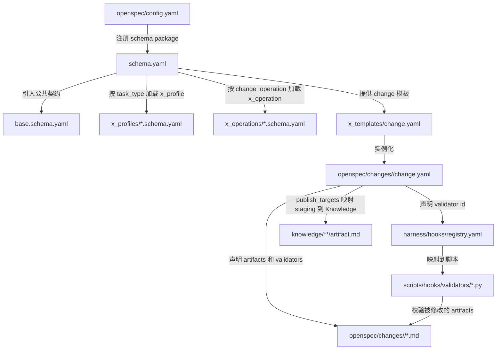

# Schema Wiring 触发点说明

本文档描述 `blockchain-research` schema package 中，各个组件如何串联以及 hook 校验的触发时机。

## 串联关系



## Hook 触发点

| 写入目标 | 触发时机 | 读取 change.yaml | 运行 validators |
|----------|----------|------------------|-----------------|
| `request.md` | PostToolUse | 是 | base: required_files + markdown_sections |
| `plan.md` | PostToolUse | 是 | base: required_files + markdown_sections |
| `sources/source-pack.md` | PostToolUse | 是 | profile: source_pack |
| `sources/evidence-map.md` | PostToolUse | 是 | profile: evidence_map |
| `notes/*.md` | PostToolUse | 是 | 按 profile 中 notes 声明的 validators |
| `claims/*.md` | PostToolUse | 是 | 按 profile 中 claims 声明的 validators |
| `work-products/*.md` | PostToolUse | 是 | profile: markdown_sections + work_product + traceability |
| `review/*.md` | PostToolUse | 是 | base: markdown_sections |
| `publish.md` | PreToolUse | 是 | operation: publish_targets + traceability |
| 写入 `knowledge/` 目录 | PreToolUse | 是 | operation: publish_targets + traceability |
| Stop（流程结束） | 一次性 | 是 | 汇总 validation 状态 |

## 调用链

```
1. openspec/config.yaml
   → 注册 blockchain-research schema package
   → 指向 openspec/schemas/blockchain-research/schema.yaml

2. schema.yaml
   → x_imports.base 指向 ./base.schema.yaml（公共契约）
   → 根据 task_type 选择 x_profiles/*.schema.yaml
   → 根据 change_operation 选择 x_operations/*.schema.yaml
   → 提供 x_templates/* 作为模板源

3. openspec/changes/<change-id>/change.yaml（由 change.yaml 模板实例化）
   → 声明 task_type / change_operation / execution_scope
   → 声明 artifacts 及其路径 / glob
   → 声明 validators（base / profile / operation 分组）
   → 声明 publish_targets（from → to → type）

4. harness/hooks/registry.yaml
   → schema_validators 段：validator id → 脚本路径映射
   → validators 段：事件驱动的旧式校验（向后兼容）

5. scripts/hooks/validators/*.py
   → 读取 change.yaml 确定上下文
   → 校验被修改的 artifact
   → 写入 validation/*.md 或返回 exit code
```

## 关键原则

1. **hooks 不通过路径硬猜语义**：校验器应优先读取 `change.yaml` 中的 `task_type`、`profile` 和 `validators` 来决定运行什么检查。
2. **work-products 是 staging candidate**：不是最终 Knowledge artifact，最终产物在 `knowledge/**/artifact.md`。
3. **schema 是统一的**：`schema.yaml` 是入口，不是四套独立 schema。base + x_profiles + x_operations 共同构成一个 schema package。
