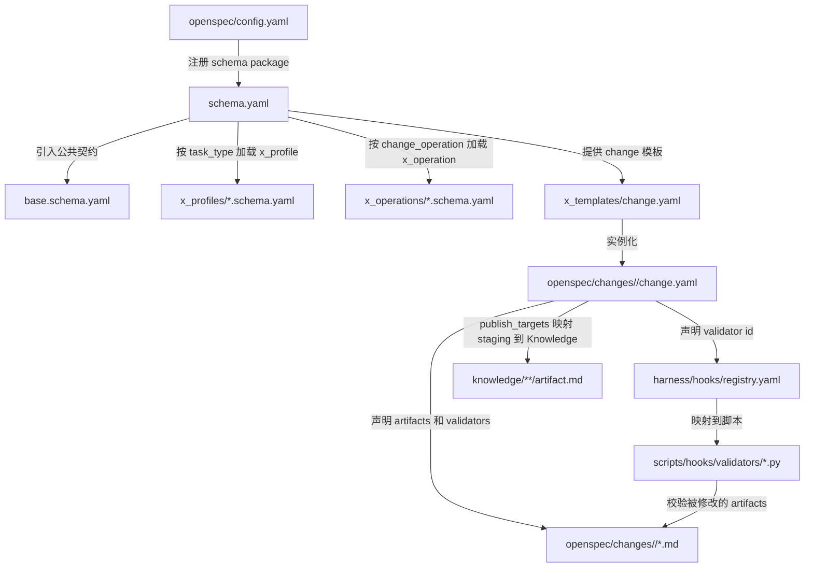

# Schema Wiring 触发点说明

本文档描述 `blockchain-research` schema package 中，各个组件如何串联以及 hook 校验的触发时机。

## 串联关系



## change.yaml 如何声明 validators

change.yaml 中的 validators 段声明三类校验器：

```yaml
validators:
  base:
    - required_files
    - markdown_sections
  profile:
    - traceability
  operation:
    - publish_targets
```

- `base`：公共校验器，对所有 task_type 生效
- `profile`：按 task_type 加载的 profile 专属校验器
- `operation`：按 change_operation 加载的操作专属校验器

## Schema 如何映射到 validator

`schema.yaml` 中 `artifacts[].id` 声明 artifact 标识（如 `request`、`plan`、`draft`、`publish`）。
这些 id 不直接映射到 validator，而是通过 `change.yaml` 的 validators 段间接映射。

`base.schema.yaml` 中 `common_validators` 声明所有 artifact 共享的校验器。

`profiles/*.schema.yaml` 中 `artifact_constraints` 声明特定 task_type 的额外约束，可引用 profile validator。

`operations/*.schema.yaml` 中声明特定 change_operation 的 validator。

## Hook registry 如何调度

`harness/hooks/registry.yaml` 的 `schema_validators` 段声明 validator id → script 映射：

```yaml
schema_validators:
  required_files:
    script: scripts/hooks/validators/required_files.py
    trigger: post_write
    instruction: "检查 change.yaml 声明的必需文件是否存在。"

  markdown_sections:
    script: scripts/hooks/validators/markdown_sections.py
    trigger: post_write
    instruction: "检查被修改的 Markdown 产物是否包含必要章节。"

  source_pack:
    script: scripts/hooks/validators/source_pack.py
    trigger: post_write
    instruction: "检查来源元信息和来源清单。"

  evidence_map:
    script: scripts/hooks/validators/evidence_map.py
    trigger: post_write
    instruction: "检查来源到产物的证据映射。"

  draft_contract:
    script: scripts/hooks/validators/work_product.py
    legacy_script_name: true
    note: "当前 validator 语义已迁移为 draft_contract，脚本名后续再改。"

  publish_targets:
    script: scripts/hooks/validators/publish_targets.py
    trigger: pre_publish
    instruction: "检查 publish.md 和 change.yaml 中的发布目标。"

  traceability:
    script: scripts/hooks/validators/traceability.py
    trigger: pre_publish
    instruction: "检查从来源到知识目标的可追溯性。"
```

## 调用链

```
1. openspec/config.yaml
   → 注册 blockchain-research schema package
   → 指向 openspec/schemas/blockchain-research/schema.yaml

2. schema.yaml
   → x_imports.base 指向 ./base.schema.yaml（公共契约）
   → 根据 task_type 选择 x_profiles/*.schema.yaml
   → 根据 change_operation 选择 x_operations/*.schema.yaml
   → 提供 x_templates/* 作为模板源

3. openspec/changes/<change-id>/change.yaml（由 change.yaml 模板实例化）
   → 声明 task_type / change_operation / execution_scope
   → 声明 artifacts 及其路径 / glob
   → 声明 validators（base / profile / operation 分组）
   → 声明 publish_targets（from → to → type）

4. harness/hooks/registry.yaml
   → schema_validators 段：validator id → 脚本路径映射
   → validators 段：事件驱动的旧式校验（向后兼容）

5. scripts/hooks/validators/*.py
   → 读取 change.yaml 确定上下文
   → 校验被修改的 artifact
   → 写入 validation/*.md 或返回 exit code
```

## 关键原则

1. **hooks 不通过路径硬猜语义**：校验器应优先读取 `change.yaml` 中的 `task_type`、`profile` 和 `validators` 来决定运行什么检查。
2. **draft.md 是唯一主候选产物**：不再使用 work-products/*.md 作为正式流程。
3. **schema 是统一的**：`schema.yaml` 是入口，不是四套独立 schema。base + x_profiles + x_operations 共同构成一个 schema package。
