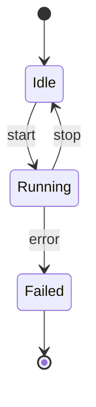
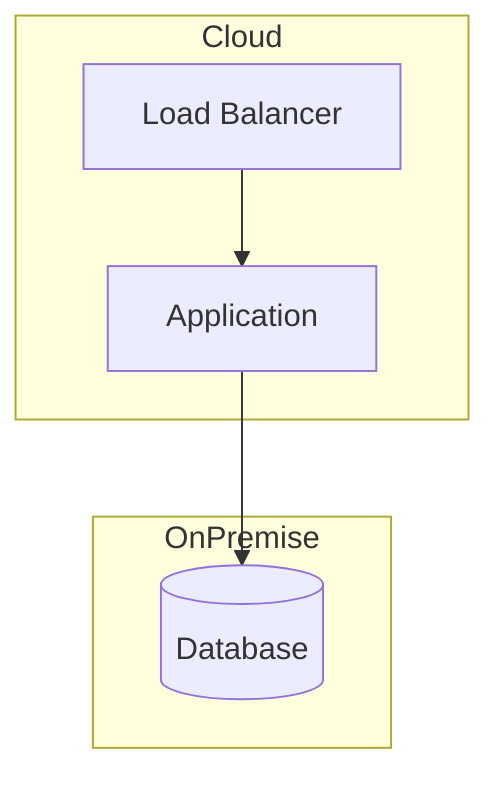
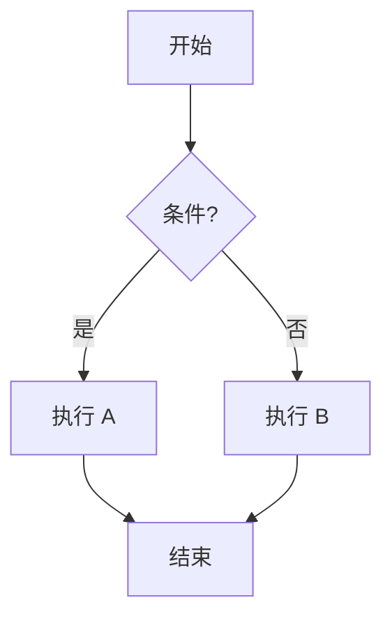

# 图表选择矩阵

## 目的

根据要表达的内容选择合适的图表类型。

**相关**：术语表见 `harness/rules/general/GLOBAL-GLOSSARY.md`。

**详见**：`openspec/specs/diagram-policy/spec.md`（图表政策，定义图表生成、验证与交付标准）。

## 核心原则

**本矩阵仅用于选择可视化方案，不定义正式交付规则。**

**正式规则来源**：`openspec/specs/diagram-policy/spec.md`

## 图表类型矩阵

| 要表达的内容 | 推荐方案 | 备选方案 | 是否支持 PlantUML |
|-------------|----------|----------|------------------|
| 组件关系/系统架构 | **PlantUML Architecture** (via skill) | Mermaid graph / Markdown 表格 | ✅ 是（必须通过 skill） |
| 时序流程/交互链路 | **PlantUML Sequence** (via skill) | Mermaid sequence / Markdown 表格 | ✅ 是（必须通过 skill） |
| 状态变化 | Mermaid stateDiagram | Markdown 表格 / ASCII 草图 | ❌ 否（无 dedicated skill） |
| 部署架构 | Mermaid deployment | Markdown 表格 / ASCII 草图 | ❌ 否（无 dedicated skill） |
| 数据流/活动流 | Mermaid flowchart | Markdown 表格 / ASCII 草图 | ❌ 否（无 dedicated skill） |
| 层级关系 | PlantUML Architecture (via skill) | Markdown 嵌套列表 | ✅ 是（必须通过 skill） |
| 接口定义 | Markdown 表格 | 文本描述 | ❌ 否 |
| 特性对比 | Markdown 表格 | ASCII 表格 | ❌ 否 |
| 时间线 | Mermaid timeline | Markdown 表格 | ❌ 否 |
| 比较总览 | Markdown 表格 | ASCII 草图 | ❌ 否 |

## 决策流程

```
1. 要表达什么内容？
   │
   ├── 组件架构/分层关系 → 使用 PlantUML Architecture skill
   │   └── 调用 feipi-plantuml-generate-architecture-diagram
   │
   ├── 交互流程/消息时序 → 使用 PlantUML Sequence skill
   │   └── 调用 feipi-plantuml-generate-sequence-diagram
   │
   └── 其他类型（状态机/部署/活动流/对比/时间线）
       └── 使用 Fallback 方案：
           ├── 首选：Mermaid
           ├── 次选：Markdown 表格
           └── 快速草图：ASCII/Unicode
```

## PlantUML 支持类型详解

### Architecture Diagram（支持）

**适用场景**：
- 展示系统组件及其关系
- 说明组件职责边界
- 表达依赖关系
- 分层架构展示

**生成方式**：
- **必须**通过全局 skill `feipi-plantuml-generate-architecture-diagram`
- **禁止**手写 PlantUML 代码

**元素语义**：
```plantuml
package "Layer A" #Color {
  component "Component" as C
  database "Storage" as D
}
C --> D : uses
```

### Sequence Diagram（支持）

**适用场景**：
- 展示时间顺序
- 多参与方交互
- 消息传递流程

**生成方式**：
- **必须**通过全局 skill `feipi-plantuml-generate-sequence-diagram`
- **禁止**手写 PlantUML 代码

**元素语义**：
```plantuml
participant "User" as U
database "Contract" as C
U -> C: message(args)
C --> U: return(value)
```

## Unsupported Types 详解

以下类型**没有** dedicated skill 支持，**不得**在正式 draft 中使用 PlantUML 交付。

### State Diagram（状态机图）

**为什么不支持**：无 dedicated skill 支持

**推荐 Fallback**：

1. **Mermaid stateDiagram**（首选）


2. **Markdown 表格**（结构化）

| 当前状态 | 触发事件 | 转换结果 | 说明 |
|----------|----------|----------|------|
| Idle | start | Running | 启动 |
| Running | stop | Idle | 停止 |
| Running | error | Failed | 错误 |

3. **ASCII 草图**（快速）
```
[*] --> Idle --> Running --> Failed --> [*]
                 |          ^
                 v          |
               Idle --------+
```

### Deployment Diagram（部署图）

**为什么不支持**：无 dedicated skill 支持

**推荐 Fallback**：

1. **Mermaid**


2. **Markdown 表格**

| 节点 | 类型 | 位置 | 部署内容 |
|------|------|------|----------|
| Cloud LB | 负载均衡 | AWS | Nginx |
| App Server | 应用服务器 | AWS | Tendermint Core |
| Database | 数据库 | On-premise | MySQL |

### Activity Diagram（活动图）

**为什么不支持**：无 dedicated skill 支持

**推荐 Fallback**：

1. **Mermaid flowchart**


2. **Markdown 无序列表**
- 开始
  - 如果条件满足：
    - 执行 A
  - 否则：
    - 执行 B
- 结束

### 比较总览图

**为什么不支持**：无 dedicated skill 支持；此类信息更适合表格表达

**推荐 Fallback**：

1. **Markdown 表格**（首选）

| 特性 | Tendermint | PBFT | Raft |
|------|------------|------|------|
| 共识模型 | PoS BFT | BFT | CFT |
| 阶段数 | 2 | 3 | 2 |
| 节点数 | N ≥ 3f+1 | N ≥ 3f+1 | N ≥ 2f+1 |

2. **ASCII 草图**
```
Tendermint: [Propose] → [Prevote] → [Precommit] → Commit
PBFT:       [Pre-Prepare] → [Prepare] → [Commit] → Reply
```

## 图复杂度控制

### 单一职责原则

**禁止**在一张图中表达过多内容。

**推荐**：
- Component 图：5-10 个组件
- Sequence 图：3-6 个参与方，5-15 步
- State 图（Mermaid）：3-8 个状态

### 分层策略

当内容过多时：
1. 创建 Overview 图（高层）
2. 创建 Detail 图（子组件）
3. 使用引用链接

## 图的选择决策树

```
要表达什么？
├── 组件关系/架构分层
│   ├── 需要正式交付 → PlantUML Architecture (via skill)
│   └── 快速草图 → Mermaid graph
│
├── 时间流程/交互时序
│   ├── 需要正式交付 → PlantUML Sequence (via skill)
│   └── 快速草图 → Mermaid sequence
│
├── 状态变化
│   └── Mermaid stateDiagram / Markdown 表格 / ASCII
│
├── 特性对比/能力归属
│   └── Markdown 表格（首选）
│
├── 时间线
│   └── Mermaid timeline / Markdown 表格
│
├── 部署架构
│   └── Mermaid deployment / Markdown 表格
│
└── 快速草图/简单关系
    └── ASCII/Unicode
```

## 何时不使用 PlantUML

| 场景 | 原因 | 替代方案 |
|------|------|----------|
| 状态机图 | 无 dedicated skill 支持 | Mermaid stateDiagram |
| 部署图 | 无 dedicated skill 支持 | Mermaid deployment |
| 活动图 | 无 dedicated skill 支持 | Mermaid flowchart |
| 比较总览 | 表格更适合表达 | Markdown 表格 |
| 简单草图 | 无需复杂工具 | ASCII/Unicode |
| 非正式说明 | 过度设计 | 文字描述 |

## Fallback 质量要求

即使使用 fallback 方案，也应遵守：

1. **Mermaid**：
   - 必须在 GitHub/GitLab 预览中可渲染
   - 不得有语法错误
   - 复杂度适中（状态<10，节点<15）

2. **Markdown 表格**：
   - 必须对齐清晰
   - 表头语义明确
   - 列数适中（3-6 列）

3. **ASCII 草图**：
   - 必须在等宽字体下可读
   - 建议标注"ASCII 草图"
   - 仅用于快速说明，不用于核心图表

## 相关规则

- `openspec/specs/diagram-policy/spec.md` — 正式图表政策（规则来源）
- `harness/workflows/diagram-workflow.md` — 图表创建流程
- `harness/rules/diagrams/diagram-review-checklist.md` — 图表评审清单
