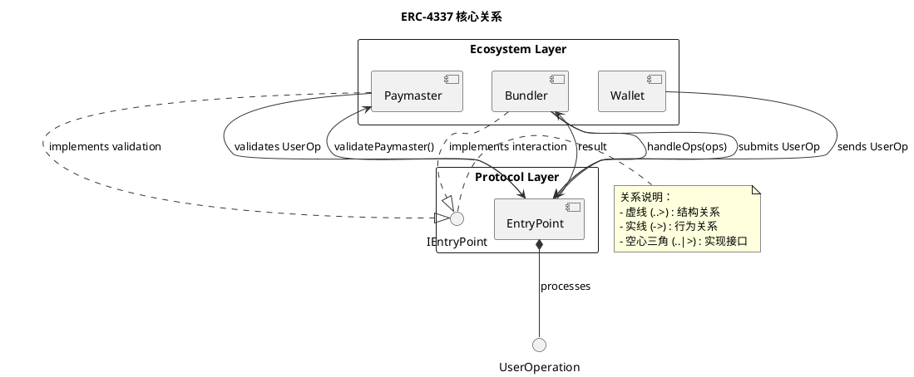

# 关系规则

## 目的

定义图中关系箭头的语义和使用规范。

## 关系类型字典

### 结构关系

| 关系 | PlantUML | 含义 | 示例 |
|------|----------|------|------|
| 依赖 | `A --> B` | A 使用 B | Wallet --> EntryPoint |
| 实现 | `A ..|> B` | A 实现 B 接口 | BundlerImpl ..|> IBundler |
| 继承 | `A --|> B` | A 继承 B | ERC4337Wallet --|> BaseWallet |
| 包含 | `A *-- B` | A 强包含 B | EntryPoint *-- UserOp |
| 聚合 | `A o-- B` | A 弱包含 B | Bundle o-- UserOp |
| 关联 | `A -- B` | A 与 B 关联 | User -- Wallet |

### 行为关系

| 关系 | PlantUML | 含义 | 示例 |
|------|----------|------|------|
| 调用 | `A -> B : method()` | A 调用 B 方法 | Wallet -> EntryPoint : validateUserOp() |
| 返回 | `A --> B : value` | A 返回给 B | EntryPoint --> Wallet : result |
| 创建 | `A --> B : create` | A 创建 B | Factory --> Wallet : create |
| 销毁 | `A -> B : destroy` | A 销毁 B | User -> Session : destroy |

### 流程关系

| 关系 | PlantUML | 含义 | 示例 |
|------|----------|------|------|
| 顺序 | `A -> B` | A 之后是 B | Validate -> Execute |
| 条件 | `A -> B : [condition]` | 条件下 A 到 B | CheckBalance -> Deduct : [sufficient] |
| 循环 | `A -> A` | 自循环 | Process -> Process : retry |

## 关系语义一致性

### 禁止的混用

❌ 错误：在同一图中混用相同符号表示不同含义

```plantuml
' 错误：--> 既表示依赖又表示消息
component "Wallet" as W
component "EntryPoint" as EP

W --> EP : depends on  ' 结构依赖
W --> EP : sendMessage  ' 行为消息 - 混淆！
```

✅ 正确：区分结构关系和行为关系

```plantuml
' 正确：结构关系用虚线，行为关系用实线
component "Wallet" as W
component "EntryPoint" as EP

W ..> EP : depends on  ' 结构依赖（虚线）
W -> EP : sendMessage  ' 行为消息（实线）
```

### 箭头方向规范

**推荐**：
- 依赖关系：依赖方 → 被依赖方
- 继承关系：子类 → 父类
- 消息流：发送方 → 接收方
- 数据流：源 → 目标

**禁止**：
- 反向依赖（除非确实存在循环依赖）
- 模糊的双向箭头（除非确实双向）

## 关系标签规范

### 标签内容

**必须**：
- 使用动词或动词短语
- 简洁明确
- 与技术术语一致

**禁止**：
- 模糊词汇（"相关"、"连接"）
- 过长描述
- 口语化表达

### 标签示例

| 场景 | ❌ 错误 | ✅ 正确 |
|------|--------|--------|
| 调用 | "调用...方法" | `validateUserOp()` |
| 依赖 | "有关系" | `depends on` |
| 包含 | "里面有" | `contains` |
| 实现 | "做的是" | `implements` |

## 复合关系

### 何时使用复合关系

当两个组件之间有：
1. 多种关系类型
2. 关系需要条件说明
3. 关系有顺序

### 表达方式

```plantuml
component "A" as A
component "B" as B

' 方式 1: 多条线
A --> B : depends on
A -> B : calls

' 方式 2: 注释说明
A --> B
note on link
  1. depends on (structurally)
  2. calls (behaviorally)
end note
```

## 关系可见性

### 必须明确的关系

**必须**画出的关系：
- 核心依赖
- 关键交互
- 数据流主要路径

### 可以省略的关系

**可以**省略：
- 琐碎的依赖（如日志）
- 隐含的关系（如继承自同一基类）
- 与当前主题无关的关系

### 使用隐式关系

```plantuml
' 使用注释说明隐式关系
note right of EntryPoint
  隐式依赖：
  - 依赖 L1 Ethereum
  - 依赖时间同步
  本图未画出
end note
```

## 示例：完整关系使用



## 检查清单

- [ ] 关系类型是否正确选择
- [ ] 关系标签是否使用动词
- [ ] 箭头方向是否一致
- [ ] 是否混用相同符号不同含义
- [ ] 是否需要注释说明隐式关系
