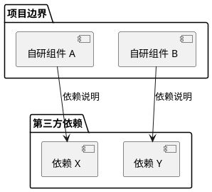

# 组件分析与性能可行性质量要求

## 目的

定义技术调研中组件架构分析和性能提升可行性分析的最低质量要求，确保分析结果可复用、可验证、可执行。

## 适用范围

本规范适用于所有 `primitive` 类型的技术调研，特别是涉及：
- 共识协议与执行层集成项目
- 高性能区块链/协议实现
- 多层架构系统分析

---

## 组件架构分析要求

### 1. 组件清单完整性

**要求**：必须列出所有核心组件，不得遗漏。

**交付格式**：组件职责表

| 组件 | 路径 | 职责 | 来源 |
|------|------|------|------|
| 组件名称 | 代码路径 | 一句话职责描述 | 自研/集成 |

**来源分类**：
- **自研**：项目自有代码
- **Official Ecosystem**：核心团队提供的参考实现或规范
- **Third-Party**：完全独立第三方的服务或产品

### 2. 依赖关系可视化

**要求**：必须生成交付依赖关系图，展示组件间的调用关系。

**图表要求**：
- 使用 PlantUML 组件图
- 区分项目边界与第三方依赖
- 标注关键依赖的调用方向

**示例结构**：


### 3. 自研 vs 集成分类表

**要求**：必须明确区分哪些是自研代码，哪些是集成第三方开源项目。

**交付格式**：分类对比表

| 类别 | 组件/依赖 | 来源 | 成熟度 | 备注 |
|------|----------|------|--------|------|
| 自研代码 | 组件列表 | 团队名 | 实验性/生产 | 说明 |
| 集成依赖 | 依赖列表 | 组织名 | Beta/生产 | 版本/分支信息 |

**成熟度分类**：
- **实验性**：演示/早期开发阶段
- **Beta**：功能基本完整，未经生产验证
- **生产**：已有生产部署案例

**版本追踪**：
- Git 依赖必须注明分支或 Tag（如：`branch: main` 或 `tag: v1.2.0`）
- 包依赖必须注明版本号

---

## 核心流程分析要求

### 4. 流程可视化

**要求**：核心交互流程必须使用时序图展示。

**图表要求**：
- 使用 PlantUML 时序图
- 标注关键阶段（使用 `== 阶段名 ==` 分隔）
- 在关键步骤添加 `note` 说明设计取舍

### 5. 流程步骤说明

**要求**：文字补充必须聚焦图中不易表达的内容。

**格式规范**：
- 使用无序列表（`-`）
- 每个要点聚焦一个关键机制或设计决策
- 避免用文字复述图表已清晰展示的内容

---

## 设计取舍分析要求

### 6. Trade-off 对比表

**要求**：关键设计决策必须提供对比分析。

**交付格式**：对比表格

| 维度 | 方案 A（当前选择） | 方案 B（替代方案） |
|------|-------------------|-------------------|
| 性能 | 高/中/低 | 高/中/低 |
| 复杂度 | 低/中/高 | 低/中/高 |
| 信任假设 | XXX | YYY |
| 适用场景 | AAA | BBB |

### 7. 设计原因说明

**要求**：必须解释"为什么选择 A 而不是 B"。

**内容要求**：
- 列出至少 2-3 个选择当前方案的原因
- 列出至少 1-2 个当前方案的代价/局限性
- 避免"因为更先进"等模糊表述

---

## 性能可行性分析要求

### 8. 性能声明证据等级

**要求**：所有性能声明必须标注证据等级。

| 证据等级 | 来源类型 | 示例 |
|----------|----------|------|
| L1 | 官方规范/源代码 | 代码中的常量定义 |
| L2 | 参考实现/官方文档 | README 中的性能声明 |
| L3 | 生态工具/第三方测试 | 社区基准测试 |
| L4 | 第三方分析/官方博客 | Informal 博客声明 |

**性能声明表格**：

| 指标 | 数值 | 场景 | 证据等级 |
|------|------|------|----------|
| 吞吐量 | 10MB/s | 本地 3 验证者 | L2 |
| TPS | 42,000 | 简单转账 | L2 |

### 9. 瓶颈分析图

**要求**：必须识别并可视化性能瓶颈。

**图表要求**：
- 使用 PlantUML 组件图或流程图
- 标注瓶颈位置
- 关联优化方向

### 10. 性能提升可行性表

**要求**：必须提供可执行的优化建议。

| 优化方向 | 可行性 | 预期收益 | 实现复杂度 |
|----------|--------|----------|------------|
| 并行执行 | 高/中/低 | 高/中/低 | 低/中/高 |
| 状态预取 | 高/中/低 | 高/中/低 | 低/中/高 |

**可行性分类**：
- **高**：技术成熟，实现路径清晰
- **中**：技术可行，需要一定研发
- **低**：技术难度大或依赖外部条件

---

## 能力边界分析要求

### 11. 能解决/不能解决对比

**要求**：必须明确边界，避免过度承诺。

**交付格式**：

```markdown
### 能解决什么
- ✅ 功能 A
- ✅ 功能 B

### 不能解决什么
- ❌ 非目标 A
- ❌ 非目标 B
```

### 12. 状态分类

**要求**：必须区分声明的状态。

| 状态分类 | 定义 | 示例 |
|----------|------|------|
| ✅ Live | 已上线验证 | 主网部署 |
| ⚠️ Promotional | 宣传性声明 | 路线图目标 |
| ❌ 未实现 | 尚未实现 | 未来规划 |

---

## 结论与 Evidence Gap 要求

### 13. 可确认结论表

**要求**：结论必须标注证据等级和置信度。

| 结论 | 证据等级 | 置信度 |
|------|----------|--------|
| 事实性声明 | L1/L2 | High |
| 分析性判断 | L3/L4 | Medium |

### 14. Evidence Gap 表

**要求**：必须列出未解决的问题和待验证的声明。

| 缺口 | 影响 | 解决方式 |
|------|------|----------|
| 缺失的基准数据 | 无法确认性能上限 | 官方报告 |
| 安全审计 | 存在未发现漏洞风险 | 第三方审计 |

---

## 参考资料要求

### 15. 来源追溯

**要求**：所有分析必须有可追溯的来源。

| 来源 | 说明 | 证据等级 |
|------|------|----------|
| URL | 内容说明 | L1-L4 |

**要求**：
- 源代码文件必须标注具体路径
- 外部链接必须是可访问的 URL
- 证据等级必须与来源匹配

---

## 检查清单

在提交 primitive artifact 前，必须完成以下检查：

- [ ] 组件清单完整性（覆盖所有核心组件）
- [ ] 依赖关系可视化（PlantUML 组件图）
- [ ] 自研 vs 集成分类表（覆盖 100% 依赖）
- [ ] 核心流程时序图（标注关键阶段）
- [ ] Trade-off 对比表（至少 1 个关键设计决策）
- [ ] 性能声明证据等级（L1-L4 标注）
- [ ] 瓶颈分析图（可视化瓶颈位置）
- [ ] 性能提升可行性表（至少 3 个优化方向）
- [ ] 能力边界定义（能解决/不能解决）
- [ ] 可确认结论表（标注证据等级）
- [ ] Evidence Gap 表（列出未决问题）
- [ ] 参考资料追溯（所有来源可验证）

---

## 版本记录

| 版本 | 日期 | 变更说明 |
|------|------|----------|
| v1 | 2026-04-01 | 初始版本（基于 malaketh-turbo 调研经验） |
