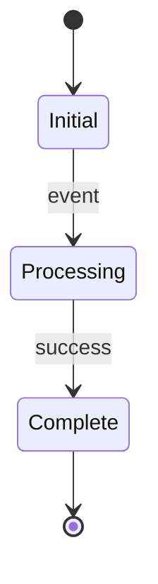
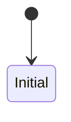

# Diagram Workflow - 图表创建

## 目标

创建图表，辅助说明机制/架构/流程。

## 触发条件

- 需要可视化机制/架构/流程
- `plan.md` 或 `draft.md` 需要图表支撑

## 必需输入

- 研究主题/内容描述
- 图表用途说明

## 规则加载策略

### 初始加载（workflow 开始时）

- `harness/rules/diagrams/diagram-selection-matrix.md` — 图表类型选择
- `openspec/specs/diagram-policy/spec.md` — 图表政策（**正式规则来源**）

### 按需加载（执行到对应步骤前）

| 步骤 | 规则 | 用途 |
|------|------|------|
| 步骤 2（创建 Brief） | `brief-quality-rules.md` | 检查 Brief 质量 |
| 步骤 2（创建 Brief） | `relationship-rules.md` | 关系语义规范 |
| 步骤 2（创建 Brief） | `annotation-rules.md` | 注释规范 |
| 步骤 2（创建 Brief） | `simplification-policy.md` | 简化政策 |
| 步骤 4（校验） | `diagram-review-checklist.md` | 对照评审清单 |

**注意**：规则文件在对话中可能被压缩，**校验前必须重新读取** `diagram-review-checklist.md`。

## 主要技能（优先使用）

由主会话显式调用 @diagram-agent 执行本 workflow。

| 图表类型 | Skill | 说明 |
|----------|-------|------|
| **架构图/组件图** | `feipi-plantuml-generate-architecture-diagram`（全局 skill） | 唯一正式的 Architecture Diagram 生成方式 |
| **时序图** | `feipi-plantuml-generate-sequence-diagram`（全局 skill） | 唯一正式的 Sequence Diagram 生成方式 |
| 其他类型 | 无 dedicated skill | 使用 fallback 方案（Mermaid / 表格 / ASCII） |

## 步骤

### 步骤 1：确定图表类型

根据内容选择图表类型，**严格遵守 `openspec/specs/diagram-policy/spec.md` 的支持矩阵**：

| 内容 | 推荐类型 | 生成方式 |
|------|----------|----------|
| 系统架构/组件分层/模块关系 | **Architecture Diagram** | 必须通过全局 `feipi-plantuml-generate-architecture-diagram` skill |
| 交互流程/调用链路/消息时序 | **Sequence Diagram** | 必须通过全局 `feipi-plantuml-generate-sequence-diagram` skill |
| 状态变化 | **State Diagram** | ❌ 无 PlantUML skill 支持 → 使用 Mermaid / Markdown 表格 / ASCII |
| 部署架构 | **Deployment Diagram** | ❌ 无 PlantUML skill 支持 → 使用 Mermaid / Markdown 表格 / ASCII |
| 数据流/活动流 | **Activity Diagram** | ❌ 无 PlantUML skill 支持 → 使用 Mermaid / Markdown 表格 / ASCII |
| 比较总览/特性对比 | **对比表格** | 必须使用 Markdown 表格 |
| 简单关系/快速草图 | **ASCII/Unicode 图** | 直接手写 ASCII |

**决策树**：

```
要表达什么？
├── 组件架构/分层关系 → Architecture Diagram (PlantUML skill)
│
├── 交互流程/消息时序 → Sequence Diagram (PlantUML skill)
│
├── 状态变化 → Mermaid stateDiagram / Markdown 表格 / ASCII
│
├── 特性对比/能力归属 → Markdown 表格（首选）
│
├── 时间线 → Mermaid timeline / Markdown 表格
│
└── 快速草图/简单关系 → ASCII/Unicode
```

### 步骤 2：创建 Brief（仅限 PlantUML 类型）

**仅当图表类型为 Architecture Diagram 或 Sequence Diagram 时执行此步骤**。

**架构图**使用 `architecture-brief.yaml` 格式（由 user skill 定义）：
```yaml
title: <图标题>
summary: <系统摘要>
layers:
  - id: <layer-id>
    label: <显示名称>
    components:
      - id: <component-id>
        label: <显示名称>
        description: <组件说明>
flows:
  - id: <flow-id>
    from: <component-id>
    to: <component-id>
    description: <流程说明>
```

**时序图**使用 `sequence-brief.yaml` 格式（由 user skill 定义）：
```yaml
title: <图标题>
summary: <场景摘要>
participants:
  - id: <participant-id>
    label: <显示名称>
    type: actor|system|database
messages:
  - id: <message-id>
    from: <participant-id>
    to: <participant-id>
    description: <消息说明>
```

### 步骤 2.5：优化 Brief（仅限 PlantUML 类型）

**仅当图表类型为 Architecture Diagram 或 Sequence Diagram 时执行此步骤**。

在生成 `brief.yaml` 后、调用 skill 前，**必须自动执行 `optimize_brief.py` 脚本**：

```bash
python scripts/diagrams/optimize_brief.py diagrams/<diagram-id>/brief.yaml \
    --output diagrams/<diagram-id>/brief.optimized.yaml
```

优化脚本会自动执行：

| 优化项 | 说明 | 示例 |
|--------|------|------|
| Layer ID 简短化 | 连字符长名 -> 简短单词 | `user-agent` -> `user_as` |
| Component layer 引用同步 | 当 layer ID 改变时同步更新 | `layer: user-agent` -> `layer: user_as` |
| Package 描述格式化 | 长描述按逗号分割为多行 | `"用户和 Agent 控制的组件，授权决策的最终主体"` -> 两行 |
| 同域组件排序 | 按视觉权重排序 | `actor` > `component` > `database` > `cloud` |
| hidden_lines 生成 | 同 layer 内组件数 >= 2 时自动生成 | 用于 PlantUML 对齐 |

**优化后的 `brief.optimized.yaml` 是调用 skill 的唯一输入**。

### 步骤 3：调用 Skill 生成（仅限 PlantUML 类型）

**仅当图表类型为 Architecture Diagram 或 Sequence Diagram 时执行此步骤**。

**使用优化后的 brief 调用 skill**：

**架构图**：
```
# 使用 brief.optimized.yaml 调用 skill
使用 feipi-plantuml-generate-architecture-diagram skill，传入 brief.optimized.yaml
```

**时序图**：
```
# 使用 brief.optimized.yaml 调用 skill
使用 feipi-plantuml-generate-sequence-diagram skill，传入 brief.optimized.yaml
```

**注意**：
- Skill 会自动执行完整校验链（brief 校验、覆盖校验、布局校验、渲染校验）
- 只有 `validation.json` 显示 `final_status=success` 且 `render_result=ok` 时才能交付
- 不得绕过 skill 直接手写 PlantUML

### 步骤 4：Skill 内部校验流程（仅限 PlantUML 类型）

**仅当图表类型为 Architecture Diagram 或 Sequence Diagram 时执行此步骤**。

用户级 skills 会自动执行：

1. **brief 校验** - `scripts/validate_brief.py`
2. **覆盖校验** - `scripts/check_coverage.py`（所有组件/参与者落图）
3. **布局校验** - `scripts/lint_layout.sh`
4. **渲染校验** - `scripts/check_render.sh`

**注意**：
- 这些脚本由用户级 skill 管理，不在本仓库 `scripts/` 目录
- 用户级 skills 会自动执行校验流程
- skill 执行完成后只保留 `diagram.puml`（必需）和 `diagram.svg`（可选）
- `validation.json` 和 `brief.normalized.yaml` 是 skill 执行中间产物，不保留

### 步骤 5：创建 fallback 图表（Unsupported Types）

**当图表类型不属于 Architecture Diagram 或 Sequence Diagram 时，使用以下 fallback 方案**：

#### 5.1 Mermaid（首选 fallback）

```markdown

```

#### 5.2 Markdown 表格（结构化信息）

```markdown
| 状态 | 触发条件 | 转换结果 | 说明 |
|------|----------|----------|------|
| Initial | event | Processing | 初始状态 |
| Processing | success | Complete | 处理成功 |
```

#### 5.3 ASCII/Unicode 草图（快速说明）

```
[State A] --event--> [State B] --success--> [State C]
                          |
                          v
                     [State D]
```

### 步骤 6：集成到 draft.md / artifact.md

**PlantUML 类型（Architecture/Sequence）**：

在 `draft.md` / `artifact.md` 中嵌入完整 PlantUML 代码块：

```markdown

```

可选添加 comment 标注来源：
```markdown
<!-- diagram: Fabric-X Architecture，来源 L1-01, L1-02, L1-03 -->
```

**Fallback 类型（Mermaid/表格/ASCII）**：

```markdown
### 状态机图



图 1: 状态机说明
```

## 输出

**PlantUML 类型**：
- `openspec/changes/<change-id>/diagrams/<diagram-id>/diagram.puml`（必需）— PlantUML 源码，skill 执行中间产物
- `openspec/changes/<change-id>/diagrams/<diagram-id>/diagram.svg`（可选）— 预渲染结果，方便预览
- `draft.md` / `artifact.md` 中嵌入的完整 PlantUML 代码块（正式交付）

**Fallback 类型**：
- Mermaid 代码块（直接嵌入 draft.md / artifact.md）
- Markdown 表格（直接嵌入 draft.md / artifact.md）
- ASCII 草图（直接嵌入 draft.md / artifact.md）

## 完成标准

- [ ] 图表类型已选择（遵守支持矩阵）
- [ ] PlantUML 类型：brief 已创建
- [ ] PlantUML 类型：skill 已调用
- [ ] PlantUML 类型：`diagram.puml` 已生成于 `openspec/changes/<change-id>/diagrams/`
- [ ] PlantUML 类型：`draft.md` / `artifact.md` 中已嵌入完整代码块
- [ ] Fallback 类型：渲染/预览验证通过

## 异常处理

### Skill 不可用

**处理**：
1. 不得降级为手写 PlantUML
2. 如为 Architecture/Sequence 类型，必须等待 skill 可用
3. 如为 unsupported type，直接使用 fallback 方案

### 渲染失败

**处理**：
1. 检查 skill 输出的错误原因
2. 根据错误信息修复
3. 重新执行 skill 完整流程

### 需要 unsupported type

**处理**：
1. 确认类型确实无 dedicated skill 支持
2. 选择 Mermaid / Markdown 表格 / ASCII fallback
3. 不得使用 PlantUML 手写

## 重要约束

1. **repo-local `scripts/diagrams/check_plantuml.sh` 不是正式 gate**
   - 仅用于手工 troubleshooting
   - draft pipeline 的正式真相是 skill 的 `validation.json`

2. **全局 skill 是 PlantUML 生成与验证的 source of truth**
   - 不得绕过 skill 直接手写 PlantUML
   - 不得把 unsupported type 硬塞成 PlantUML

3. **Unsupported type 的 fallback 是正式交付方式**
   - Mermaid / Markdown 表格 / ASCII 是正式交付
   - 不是临时替代
