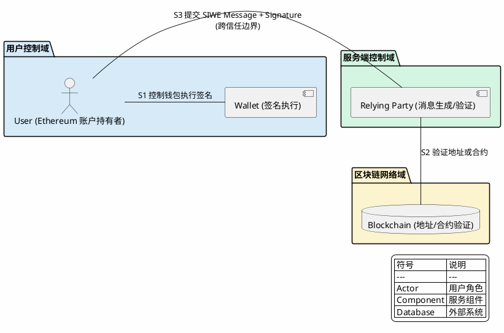

<!--
研究元数据：
- 研究深度：light
- 对象类型：primitive
- 研究路径：light
- 相关 domains：account-abstraction, agentic-payment
- 创建时间：2026-04-11
- 状态：stable
-->

<!-- 目录 -->
- [概述](#概述)
- [关键术语](#关键术语)
- [组件架构](#组件架构)
- [核心流程](#核心流程)
- [设计取舍](#设计取舍)
- [能力边界](#能力边界)
- [相关协议对比](#相关协议对比)
- [结论](#结论)
- [待确认问题](#待确认问题)
- [参考资料](#参考资料)

## 概述

SIWE (Sign-In with Ethereum, ERC-4361) 是一个 Ethereum 账户认证协议，用于 Ethereum 账户向离链服务证明身份。SIWE 提供中心化身份提供商 (如 Google、Facebook 登录) 的自我托管替代方案，允许用户通过签名标准消息格式完成登录。

**SIWE 解决的核心问题**：
- 用户对中心化身份提供商的依赖
- 现有 Ethereum 登录流程缺乏标准化

**SIWE 不解决的问题**（范围外）：
- 服务器资源授权 (Authorization to server resources)
- 非 Ethereum 地址的认证
- Resources 字段的语义解释

SIWE 在 AP2 协议概念中定位为 L5 层（Trust/Authorization）的签名验证参考实现，提供基于签名的身份验证模式。

## 关键术语

| 术语 | 定义 | 在本题中的作用 |
|------|------|---------------|
| SIWE Message | 标准化的签名消息格式，包含 domain、address、uri 等 13 个字段 | AP2 授权消息格式的参考 |
| Relying Party | 依赖 SIWE 进行认证的离链服务 | AP2 中服务提供者的参考模型 |
| Nonce | 每会话唯一的随机值（至少 8 位字母数字） | 防重放攻击机制，AP2 可参考 |
| Session | 绑定到 Ethereum 地址的认证状态 | SIWE 会话仅绑定地址，不绑定可变资源 |
| Domain-binding | 消息必须与请求来源的域名匹配 | 防止钓鱼攻击的安全机制 |
| ERC-191 | Ethereum 签名数据标准，EOA 使用 | SIWE 的 EOA 验证依赖此标准 |
| ERC-1271 | 合约签名验证标准，合约账户使用 | SIWE 的合约账户验证依赖此标准 |
| [AP2](../../agentic-payment/agentic-payment-ap2/artifact.md) | Agent Payment Authorization Protocol，agentic payment 授权层概念模型 | SIWE 是 AP2 签名验证组件的参考实现 |

## 组件架构

### 实体分类表

| 实体 | 类型 | 控制方 | 是否跨信任边界 | 主要职责 |
|------|------|--------|----------------|----------|
| User | role | 用户 | 是 | 持有账户并签名 |
| Wallet | component | 用户 | 否 | 呈现消息、执行签名 |
| Relying Party | role | 服务端 | 是 | 生成消息、验证签名 |
| SIWE Message | data object | - | - | 认证载荷 |
| Signature | data object | - | - | 认证凭证 |
| Blockchain | external system | 网络 | 是 | 地址/合约验证 |

### SIWE 角色与信任边界图

**视角说明**：本图采用角色与信任边界总览视角，展示 SIWE 协议中各参与角色、信任边界划分及跨边界通信关系。图中分为三个域：用户控制域、服务端控制域、区块链网络域。

**控制方说明**：
- 用户控制域：由用户控制，持有账户并执行签名
- 服务端控制域：由服务端控制，生成和验证 SIWE 消息
- 区块链网络域：由网络控制，提供地址和合约验证



**图注**：SIWE 角色与信任边界图。图中展示了三个信任域及其交互关系。跨域通信（如用户提交签名给 Relying Party）依赖 trust assumption：用户必须安全保管私钥，Wallet 必须正确呈现消息。

**核心组件职责**：

| 组件 | 职责 | 所在域 |
|------|------|--------|
| User | Ethereum 账户持有者，认证主体 | 用户控制域 |
| Wallet | 呈现结构化消息、执行 ERC-191/ERC-1271 签名 | 用户控制域 |
| Relying Party | 生成 SIWE 消息、验证签名和消息格式 | 服务端控制域 |
| Blockchain | 提供地址存在性和合约验证 | 区块链网络域 |

**简化说明**：本图省略了 TLS 传输层安全保护，这是实现层面的考虑，不属于 SIWE 协议核心职责。

## 核心流程

### SIWE 认证核心流程

**视角说明**：本图采用跨角色核心流程视角，展示 SIWE 认证的完整交互流程。图中包含 3 个分组：客户端、服务端、区块链。

**流程场景**：本图展示认证成功的 happy path。异常路径在下方文字说明。

```plantuml
@startuml
skinparam backgroundColor #FEFEFE
skinparam sequenceMessageAlign center
skinparam nodesep 30
skinparam ranksep 30
left_to_right direction

autonumber

box "客户端" #EEEEEE
  actor "User/Wallet" as user
endbox

box "服务端" #DDDDDD
  participant "Relying Party" as relying_party
endbox

separator

box "区块链" #CCCCCC
  database "Blockchain" as blockchain
endbox

relying_party -> user : M1 生成 SIWE Message\n(domain, address, uri, nonce, issued-at...)
activate relying_party
activate user

user --> relying_party : M2 返回 Signature\n(包含用户确认和签名)
deactivate user
deactivate relying_party

relying_party -> blockchain : M3 调用 isValidSignature()\n(仅合约账户)
activate relying_party
activate blockchain

blockchain --> relying_party : R1 返回 0x1626ba7e (有效)
deactivate blockchain
deactivate relying_party

relying_party --> user : M4 返回认证结果\n(Success / Failure)
activate relying_party
activate user
deactivate user
deactivate relying_party

legend right
  | 符号 | 说明 |
  | --- | --- |
  | Actor | 用户角色 |
  | Participant | 服务参与者 |
  | Database | 外部系统 |
endlegend

@enduml
```

**流程步骤说明**：

- **【M1】消息生成**：Relying Party 生成 SIWE Message，包含 domain、address、uri、nonce、issued-at 等字段，添加 ERC-191 前缀
- **【M2】签名返回**：User/Wallet 确认登录意图并执行签名，返回签名结果
- **【M3-R1】合约验证**：对于合约账户，Relying Party 调用区块链的 `isValidSignature()` 方法，验证返回值为 `0x1626ba7e`
- **【M4】认证结果**：验证通过则返回 Success 并建立会话，失败则返回 Failure

**异常路径说明**：

| 异常点 | 触发条件 | 返回结果 | 说明 |
|--------|----------|----------|------|
| M2 签名失败 | 用户拒绝签名或钱包错误 | 认证失败 | 用户取消或钱包异常 |
| M3 验证失败 | 合约返回非 `0x1626ba7e` | 认证失败 | 签名无效或合约错误 |
| M1 消息过期 | expiration-time 已过 | 认证失败 | 消息超过有效时间窗口 |
| M3 nonce 已使用 | nonce 已被消耗 | 认证失败 | 重放攻击检测触发 |

**简化说明**：本图省略了 EOA 账户的 ERC-191 验证流程（服务端本地完成，不依赖区块链），聚焦于合约账户的链上验证场景。

### Session 状态转换表

| 当前状态 | 触发事件 | 转换结果 | 说明 |
|----------|----------|----------|------|
| None | 签名验证通过 | Active | 建立新会话 |
| Active | 用户登出 | Inactive | 用户主动失效 |
| Active | expiration-time 到期 | Inactive | 自动失效 |
| Active | 合约代码变更 | Inactive | ERC-1271 结果可能变化，需失效 |
| Active | resources 变更 | Inactive | 依赖资源变化，需失效 |

## 设计取舍

### 为什么选择消息格式签名而非 Token？

| 方案 | 优势 | 劣势 |
|------|------|------|
| 消息签名 | 无需链上交互、即时完成 | 需要前端钱包支持 |
| Token (如 JWT) | 服务端完全控制 | 需要中心化签发方 |

**SIWE 选择消息签名的原因**：
- 符合 Ethereum"自我托管身份"理念
- 无需额外 Token 基础设施
- 签名即证明，无需中间层

### 为什么 Nonce 至少 8 位字母数字？

- **安全性**：8 位字母数字提供约 52^8 ≈ 5.3 × 10^14 种组合，足以抵抗暴力破解
- **可用性**：不过长，用户/系统可处理
- **替代方案**：可使用 recent block hash 或 Unix timestamp

### 为什么 Sessions 仅绑定 Address 而非 Resources？

> "Sessions MUST be bound to the `address` and not to further resolved resources that can change."

**原因**：
- Address 是不可变的（在同一链上）
- Resources 可能变化（如 ENS 解析改变）
- 简化会话管理逻辑

## 能力边界

### SIWE 能解决什么

| 能力 | 说明 | 协议原生 |
|------|------|----------|
| 身份认证 | 证明用户拥有某 Ethereum 地址 | ✓ |
| 会话建立 | 建立绑定到 address 的会话 | ✓ |
| 防重放攻击 | nonce + 时间窗口机制 | ✓ |
| 钓鱼防护 | domain-binding 机制 | ✓ |
| 合约账户支持 | ERC-1271 验证 | ✓ |

### SIWE 不能解决什么

| 能力 | 说明 | 外部依赖 |
|------|------|----------|
| 服务器资源授权 | 明确在范围外 | AP2 / OAuth Scopes |
| 非 Ethereum 地址认证 | 仅支持 Ethereum 地址 | SIWX 系列扩展 |
| 可验证凭证 | 不支持 VC | DID Auth / VC 规范 |
| 跨链身份 | 单链绑定 (chain-id) | 跨链桥/聚合身份 |
| 细粒度授权 | 仅认证，无授权语义 | AP2 策略引擎 |

### 能力边界总结

| 层次 | SIWE 职责 | 外部职责 |
|------|----------|----------|
| L1 认证 | 签名验证、地址证明 | - |
| L2 会话 | 会话建立、失效管理 | - |
| L3 授权 | - | AP2 / OAuth Scopes / 策略引擎 |
| L4 凭证 | - | DID Auth / VC 规范 |

## 相关协议对比

### SIWE vs OAuth 2.0

| 维度 | SIWE | OAuth 2.0 |
|------|------|----------|
| 认证基础 | Ethereum 签名 | 用户名密码/社交登录 |
| 身份提供商 | 自我托管 (用户私钥) | 中心化 IdP (Google, etc.) |
| 授权模型 | 不处理（范围外） | 核心能力 (scopes, grants) |
| Token 格式 | 无 | Bearer Token / JWT |
| 会话绑定 | Address (链上) | User ID (IdP 数据库) |
| 适用场景 | Web3 应用、去中心化身份 | Web2 应用、企业 SSO |

### SIWE vs DID Auth

| 维度 | SIWE | DID Auth |
|------|------|----------|
| 身份格式 | Ethereum 地址 | DID (Decentralized Identifier) |
| 签名方法 | ERC-191 / ERC-1271 | DID Core 规范 |
| 链支持 | Ethereum (单链) | 多链/跨链 |
| 可验证凭证 | 不支持 | VC 规范支持 |
| 适用场景 | Ethereum 生态内 | 跨链/跨平台身份 |

### SIWE 与 AP2 的关系

| 层面 | SIWE | AP2 (概念) | 关系 |
|------|------|-----------|------|
| 定位 | EIP-4361 规范 | 7 层模型 L5 概念 | AP2 将 SIWE 作为参考实现 |
| 核心能力 | 签名验证、身份认证 | 授权策略、信任验证 | SIWE 是 AP2 签名验证组件的参考 |
| 授权能力 | 不处理（范围外） | 策略引擎、凭证管理 | AP2 扩展 SIWE 未覆盖的授权层 |
| 适用场景 | Ethereum 账户登录 | agentic payment 授权 | SIWE 适用于人类用户，AP2 适用于 agent |

## 结论

| 结论 | 置信度 |
|------|--------|
| SIWE 是 Ethereum 账户认证的标准协议 | high |
| SIWE 仅处理认证 (Authentication)，不处理授权 (Authorization) | high |
| SIWE 使用 ERC-191 (EOA) 和 ERC-1271 (合约) 进行签名验证 | high |
| SIWE 通过 nonce + 时间窗口实现防重放攻击 | high |
| SIWE 是 AP2 签名验证组件的参考实现之一 | medium |
| SIWE 适用于人类用户登录，AP2 需扩展以支持 agent 授权 | medium |

## 待确认问题

| 问题 | 状态 | 说明 |
|------|------|------|
| SIWE 与 AP2 的官方认可关系 | 未解决 | 无官方文档确认 SIWE 是 AP2 的参考实现 |
| SIWE `scope` 参数的具体语义 | 证据不足 | 规范提到 `scope` 但未定义其结构 |
| SIWE 是否可扩展支持 agent 授权 | 未解决 | 需分析 agent 场景的特殊需求 |

## 参考资料

| 来源 | 说明 |
|------|------|
| [ERC-4361 (SIWE)](https://eips.ethereum.org/EIPS/eip-4361) | SIWE 规范，Final 状态 |
| [spruceid/siwe](https://github.com/spruceid/siwe) | SIWE 参考实现 |
| [EIP-191](https://eips.ethereum.org/EIPS/eip-191) | Ethereum 签名数据标准 |
| [EIP-1271](https://eips.ethereum.org/EIPS/eip-1271) | 合约签名验证标准 |
