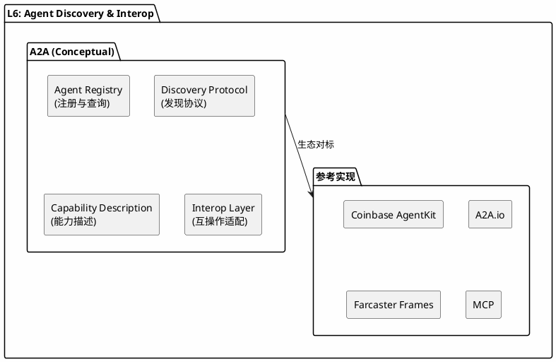
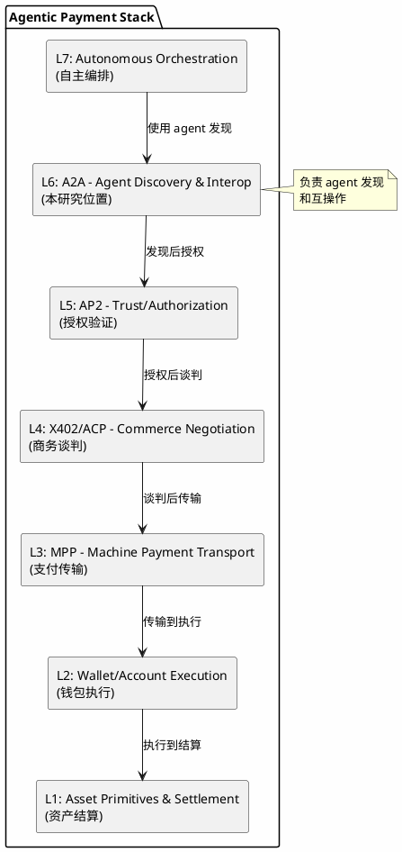
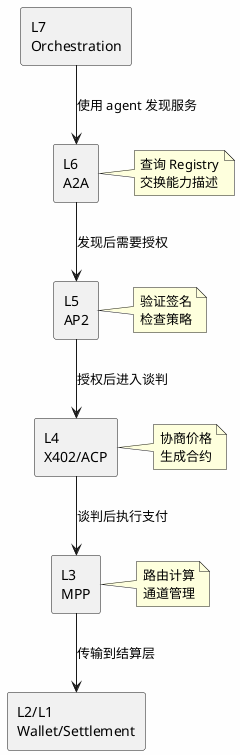

# A2A (Agent-to-Agent) Protocol - 分析框架

## 状态声明

**重要：** A2A 是一个**分析框架中的概念模型**，用于理解 agent 发现和互操作层的能力需求，而非已发布的官方协议规范。

本研究将 A2A 定位为 L6 层的**概念性协议**，并关联到实际存在的生态项目作为参考实现。

---

## 目录

- [关键术语](#关键术语)
- [核心概念](#核心概念)
- [生态映射](#生态映射)
- [参考实现](#参考实现)
- [7 层模型位置](#7-层模型位置)
- [能力边界](#能力边界)
- [相关协议关系](#相关协议关系)
- [可确认结论](#可确认结论)
- [Evidence Gap](#evidence-gap)
- [参考资料](#参考资料)

---

## 关键术语

| 术语 | 定义 | 作用 |
|------|------|------|
| Agent Discovery | agent 发现机制 | L6 核心功能之一 |
| Agent Interop | agent 互操作性 | L6 核心功能之二 |
| Agent Registry | agent 注册表 | discovery 基础设施 |
| Capability Description | 能力描述 | agent 自我描述格式 |
| Protocol-Native | 协议规范本身定义的能力 | 能力分类 - 概念层 |
| Reference Implementation | 实际生态中的参考实现 | 能力分类 - 实现层 |

---

## 核心概念

### A2A 的概念定义

A2A (Agent-to-Agent) 是一个**概念性协议**，用于描述 agent 经济中发现和互操作层的能力需求：

**A2A 概念架构图：**

### 核心功能需求

| 功能 | 概念描述 | 实际生态对应 |
|------|----------|--------------|
| Agent Registry | 统一的 agent 注册和查询机制 | Coinbase AgentKit agent 管理、A2A.io |
| Discovery Protocol | 标准化的发现协议和消息格式 | 各项目自定义协议 |
| Capability Description | agent 能力自我描述格式 | AI Agent 描述语言（ emerging） |
| Interop Layer | 跨 agent 框架的互操作适配 | Farcaster Frames、协议桥接 |

---

## 生态映射

### 实际存在的 L6 层项目

| 项目/协议 | 类型 | 状态 | 与 A2A 概念的关系 |
|-----------|------|------|------------------|
| **Coinbase AgentKit** | SDK/框架 | live | 提供 agent 开发能力，包含发现和调用机制 |
| **A2A.io** | 协议/平台 | live | 直接命名暗示 agent-to-agent 交互 |
| **Farcaster Frames** | 协议扩展 | live | agent 发现和交互的 web3 社交层实现 |
| **Agent Protocol** | 规范尝试 | planned/emerging | 社区驱动的 agent 互操作规范尝试 |
| **Model Context Protocol (MCP)** | 协议 | emerging | LLM 上下文和工具互操作协议 |

### 能力对标表

| A2A 概念能力 | Coinbase AgentKit | A2A.io | Farcaster Frames | MCP |
|--------------|-------------------|--------|------------------|-----|
| Agent Registry | ✓ (CDP 内) | ✓ | ~ (社交图谱) | - |
| Discovery Protocol | ✓ | ✓ | ✓ | ✓ |
| Capability Description | ✓ | ✓ | ~ | ✓ |
| Interop Layer | ~ | ✓ | ~ | ✓ |

**图例：** ✓ = 完整支持，~ = 部分支持，- = 不支持/不涉及

---

## 参考实现

### Coinbase AgentKit

**定位：** Agent 开发和支付集成 SDK

**核心能力：**
- Agent 开发和部署框架
- 与 Coinbase Developer Platform 集成
- 支持链上支付能力
- Agent 发现和调用机制

**与 A2A 的关系：** AgentKit 可视为 A2A 概念的**官方生态参考实现**之一

### A2A.io

**定位：** Agent-to-Agent 交互协议/平台

**核心能力：**
- agent 发现机制
- agent 间通信协议
- 能力描述和交换

**与 A2A 的关系：** 命名直接对应，可视为 A2A 概念的**第三方实现**

### Farcaster Frames

**定位：** 社交协议中的 agent 发现层

**核心能力：**
- 基于社交图谱的 agent 发现
- 交互式 frames 作为 agent 接口
- 链上交互集成

**与 A2A 的关系：** 可视为 A2A 概念在特定垂直领域（社交）的**场景化实现**

---

### 7 层模型位置

**L6: Agent Discovery & Interop**

**7 层模型架构图：**

### 与上下层的关系

| 关系类型 | 相邻层 | 交互内容 |
|----------|--------|----------|
| **上游** | L7: Autonomous Orchestration | 提供 agent 发现服务，接收编排调度指令 |
| **下游** | L5: AP2 (Trust/Authorization) | 发现后需要授权验证，传递信任凭证 |
| **平行** | 其他 L6 实现 | 可能是替代或互补关系 |

---

## 能力边界

### A2A 能解决什么（概念层）

- **Agent 发现标准化**：提供统一的 agent 注册和查询机制
- **Agent 互操作基础**：定义 agent 间通信和协作的基本协议
- **能力描述统一**：建立 agent 自我描述的标准格式
- **降低搜索成本**：通过 registry 机制降低 agent 发现门槛

### A2A 不解决什么

- **L5: Trust/Authorization**：授权和信任验证由 AP2 处理
- **L4: Commerce Negotiation**：商务谈判由 ACP/X402 处理
- **L3: Machine Payment Transport**：支付传输由 MPP 处理
- **L7: Autonomous Orchestration**：上层编排调度由 L7 处理
- **物理基础设施**：L0 网络、存储、计算等

---

## 相关协议关系

### 垂直依赖关系

**协议垂直依赖关系图：**

### 水平关系（与其他 L6 实现）

| 实现方案 | 与 A2A 概念的关系 | 状态 |
|----------|-------------------|------|
| Coinbase AgentKit | 官方生态参考实现 | live |
| A2A.io | 第三方协议实现 | live |
| Farcaster Frames | 垂直场景实现 | live |
| MCP | 相邻领域协议 | emerging |

**潜在关系：**
- **替代关系**：不同实现方案可能竞争成为标准
- **互补关系**：不同方案可能服务于不同场景
- **演进关系**：概念可能被后续规范吸收或替代

---

## 可确认结论

| 结论 | 证据等级 | 置信度 |
|------|----------|--------|
| A2A 是 7 层模型中 L6 层的概念性协议 | 分析框架定义 | high |
| A2A 负责 agent 发现和互操作 | 分析框架定义 | high |
| Coinbase AgentKit 可视为参考实现 | 生态调研 | high |
| A2A.io 是命名直接对应的实现 | 生态调研 | medium |
| A2A 是 agentic payment 栈的必要组件 | 框架推断 | medium |
| 不存在名为"A2A Protocol"的官方规范 | 搜索验证 | high |

---

## Evidence Gap

| 缺口 | 影响 | 解决方式 |
|------|------|----------|
| 无 A2A 官方规范 | 概念细节需从生态推断 | 持续跟踪生态发展 |
| A2A 与 AgentKit 精确定位关系 | 无法确认是否官方认可 | 等待 Coinbase 官方文档 |
| 具体消息格式和协议细节 | 无法实现互操作 | 参考实际项目文档 |
| 是否有标准化组织推动 | 无法确认权威性 | 跟踪标准组织动态 |

---

## 参考资料

| 来源 | 说明 | 证据等级 |
|------|------|----------|
| 用户提供框架 | 7 层模型定义 | L2 |
| Coinbase AgentKit | 参考实现 | L3 |
| A2A.io | 参考实现 | L3 |
| Farcaster Frames | 场景实现 | L3 |
| 社区调研 | 生态分析 | L4 |

---

## 版本记录

| 版本 | 日期 | 变更说明 |
|------|------|----------|
| v1 | 2026-04-01 | 初始版本（概念模型定位） |
