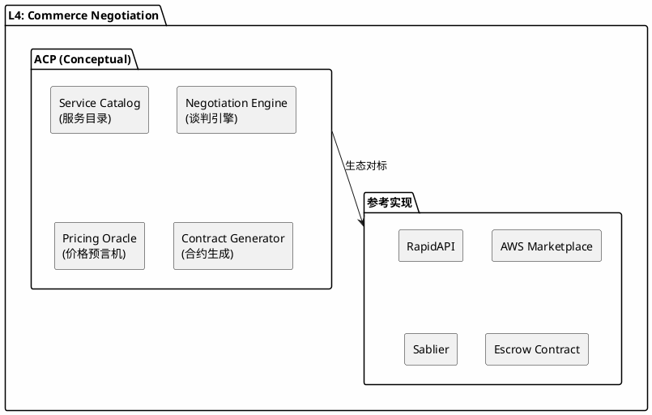
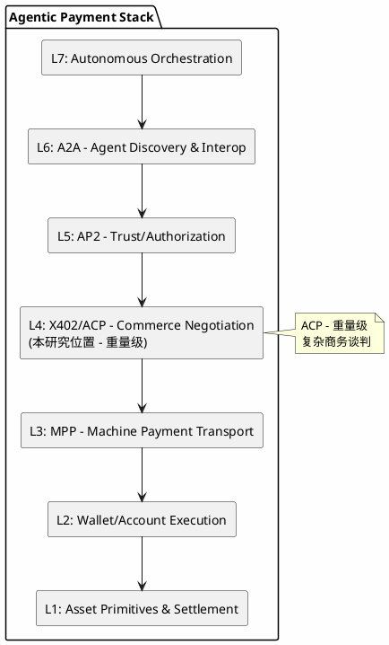
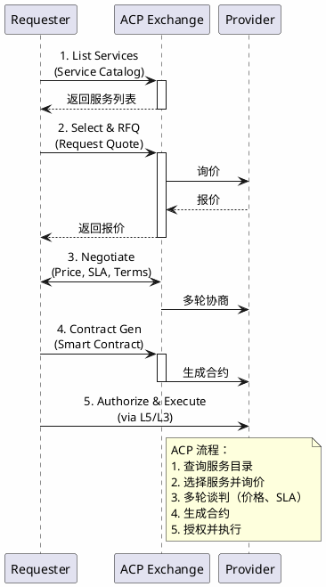

# ACP (Agent Commerce Protocol) - 分析框架

## 状态声明

**重要：** ACP 是一个**分析框架中的概念模型**，用于理解 agent 复杂商务谈判层的能力需求，而非已发布的官方协议规范。

本研究将 ACP 定位为 L4 层的**重量级商务谈判概念协议**，与 X402（轻量级）形成互补，并关联到实际存在的生态项目作为参考实现。

---

## 目录

- [关键术语](#关键术语)
- [核心概念](#核心概念)
- [生态映射](#生态映射)
- [参考实现](#参考实现)
- [7 层模型位置](#7-层模型位置)
- [能力边界](#能力边界)
- [相关协议关系](#相关协议关系)
- [与 X402 的关系](#与 x402-的关系)
- [可确认结论](#可确认结论)
- [Evidence Gap](#evidence-gap)
- [参考资料](#参考资料)

---

## 关键术语

| 术语 | 定义 | 作用 |
|------|------|------|
| Commerce Negotiation | 商业谈判 | ACP 核心功能 |
| Service Description | 服务描述 | 谈判基础 |
| Pricing Model | 定价模型 | 谈判核心内容 |
| Contract | 合约 | 谈判结果载体 |
| SLA | Service Level Agreement | 谈判条款之一 |
| RFQ | Request for Quotation | 谈判触发方式 |

---

## 核心概念

### ACP 的概念定义

ACP (Agent Commerce Protocol) 是一个**概念性协议**，用于描述 agent 复杂商务谈判的能力需求：

**ACP 概念架构图：**



### 核心功能需求

| 功能 | 概念描述 | 实际生态对应 |
|------|----------|--------------|
| Service Catalog | 服务目录和发现 | API 市场、服务注册中心 |
| Negotiation Engine | 谈判逻辑和策略 | 询价 - 报价系统、拍卖引擎 |
| Pricing Oracle | 价格参考和发现 | 价格 API、市场数据源 |
| Contract Generator | 合约生成和执行 | 智能合约、SLA 模板 |

### ACP 与 X402 的定位对比

| 维度 | X402 | ACP |
|------|------|-----|
| **定位** | 轻量级商务谈判 | 重量级商务谈判 |
| **基础** | HTTP 402 | 独立协议 |
| **谈判复杂度** | 单向报价 | 多轮协商 |
| **适用场景** | 简单支付请求 | 复杂服务采购 |
| **条款支持** | 价格 + 基本条款 | SLA、质量指标、违约条款 |
| **合约形式** | 简单收据 | 结构化合约 |

---

## 生态映射

### 实际存在的 L4 层项目/机制

| 项目/协议 | 类型 | 状态 | 与 ACP 概念的关系 |
|-----------|------|------|-------------------|
| **RapidAPI** | API 市场 | live | 服务目录 + 定价 + 支付 |
| **AWS Marketplace** | 云市场 | live | 复杂服务采购流程 |
| **Sablier / Stream Payment** | 流支付协议 | live | 基于时间的支付合约 |
| **Escrow Smart Contracts** | 托管合约 | live | 合约生成和执行 |
| **OTC Trading Platforms** | 场外交易平台 | live | 询价 - 谈判 - 执行流程 |

### 能力对标表

| ACP 概念能力 | RapidAPI | AWS Marketplace | Sablier | Escrow Contract |
|--------------|----------|-----------------|---------|-----------------|
| Service Catalog | ✓ | ✓ | - | - |
| Negotiation Engine | ~ | ~ | - | ~ |
| Pricing Oracle | ✓ | ✓ | ~ | - |
| Contract Generator | ~ | ✓ | ✓ | ✓ |
| SLA Support | ~ | ✓ | ~ | ~ |

**图例：** ✓ = 完整支持，~ = 部分支持，- = 不支持/不涉及

---

## 参考实现

### RapidAPI

**定位：** API 和服务市场平台

**核心能力：**
- API 服务目录和发现
- 统一定价和计费
- API 调用认证和配额管理
- 开发者门户

**与 ACP 的关系：** ACP 概念中服务目录和定价的**参考实现**

### AWS Marketplace

**定位：** 云服务采购市场

**核心能力：**
- 复杂服务目录（SaaS、AMI、容器）
- 询价和合同谈判（企业级）
- SLA 管理和合规
- 自动计费和结算

**与 ACP 的关系：** ACP 概念中复杂商务谈判的**参考实现**

### Sablier / Stream Payment

**定位：** 流支付协议

**核心能力：**
- 基于时间的支付流
- 可组合的支付合约
- 支持持续服务付费

**与 ACP 的关系：** ACP 概念中合约生成的**参考实现**

### Escrow Smart Contracts

**定位：** 去中心化托管合约

**核心能力：**
- 条件触发支付
- 争议解决机制
- 多方签名执行

**与 ACP 的关系：** ACP 概念中合约执行的**参考实现**

---

### 7 层模型位置

**L4: Commerce Negotiation (重量级方案)**

**7 层模型位置图：**



### 与上下层的关系

| 关系类型 | 相邻层 | 交互内容 |
|----------|--------|----------|
| **上游** | L5: AP2 (Authorization) | 授权通过后进入谈判 |
| **下游** | L3: MPP (Transport) | 谈判成功后执行支付 |
| **平行** | L4: X402 (Commerce) | 互补关系，场景选择 |

### ACP 典型交互流程

**ACP 交互序列图：**



---

## 能力边界

### ACP 能解决什么（概念层）

- **商业谈判标准化**：定义复杂商务谈判的流程和格式
- **支持多种定价模型**：固定价格、动态定价、拍卖、订阅等
- **支持动态协商和合约生成**：多轮谈判、SLA 条款、条件支付
- **复杂场景覆盖**：企业级服务采购、长期合作框架

### ACP 不解决什么

- **L5: Trust/Authorization**：授权验证由 AP2 处理
- **L3: Machine Payment Transport**：支付传输由 MPP 处理
- **L6: Agent Discovery**：agent 发现由 A2A 处理
- **简单支付场景**：由 X402 处理（更高效）

---

## 相关协议关系

### 垂直依赖关系

```
L5 (AP2) ────────► 授权验证通过
     │
     │ 请求服务报价
     ▼
L4 (ACP) ─────────► 服务目录查询
     │              RFQ 请求报价
     │              多轮谈判（价格、SLA）
     │              合约生成
     │
     │ 合约签署
     ▼
L3 (MPP) ────────► 执行支付传输
     │              （可能分期/流支付）
     ▼
L2/L1 ───────────► 钱包签名、链上结算
```

### 水平关系（与 X402）

**互补关系：**

```
服务请求
   │
   ├─► [简单场景：固定价格、即时支付]
   │       │
   │       ▼
   │    X402 谈判
   │       │
   │       ▼
   │    MPP 支付
   │
   └─► [复杂场景：需要 SLA、长期合作]
           │
           ▼
        ACP 谈判
           │
           ▼
        合约生成
           │
           ▼
        MPP 支付（可能分期）
```

---

## 与 X402 的关系

### 场景选择矩阵

```
                    谈判复杂度
                  低 ───────────── 高
                ┌─────────────────────────┐
           低   │  直接定价     │  X402   │
  服           │  (固定价格)   │  适用   │
  务           ├─────────────────────────┤
  定           │  简单协商     │   ACP   │
  制   高       │  (需要 SLA)   │  适用   │
  化           └─────────────────────────┘
```

### 协同使用示例

**示例 1：Agent 调用 API 服务**
- 场景：Agent 需要调用地图 API
- 选择：X402（固定价格、按次付费）
- 流程：请求 → HTTP 402 → 支付 → 响应

**示例 2：Agent 采购云服务**
- 场景：Agent 需要长期存储和计算服务
- 选择：ACP（需要 SLA、分期支付）
- 流程：RFQ → 多轮谈判 → 合约 → 分期支付

---

## 可确认结论

| 结论 | 证据等级 | 置信度 |
|------|----------|--------|
| ACP 是 7 层模型中 L4 层的概念性协议 | 分析框架定义 | high |
| ACP 负责复杂商务谈判 | 分析框架定义 | high |
| ACP 支持服务目录和谈判引擎 | 框架推断 | medium |
| ACP 与 X402 是互补关系 | 框架推断 | medium |
| RapidAPI 等可视为参考实现 | 生态调研 | high |
| 不存在名为"ACP Protocol"的官方规范 | 搜索验证 | high |

---

## Evidence Gap

| 缺口 | 影响 | 解决方式 |
|------|------|----------|
| 无 ACP 官方规范 | 概念细节需从生态推断 | 持续跟踪生态发展 |
| ACP 与 X402 的精确定位 | 无法确认边界 | 需要补充对比分析 |
| 支持的定价模型详情 | 无法确认适用范围 | 参考实际项目文档 |
| 是否有标准化组织推动 | 无法确认权威性 | 跟踪标准组织动态 |

---

## 参考资料

| 来源 | 说明 | 证据等级 |
|------|------|----------|
| 用户提供框架 | 7 层模型定义 | L2 |
| RapidAPI | 参考实现 | L3 |
| AWS Marketplace | 参考实现 | L3 |
| Sablier | 参考实现 | L3 |
| 社区调研 | 生态分析 | L4 |

---

## 版本记录

| 版本 | 日期 | 变更说明 |
|------|------|----------|
| v1 | 2026-04-01 | 初始版本（概念模型定位 + 与 X402 对比） |
