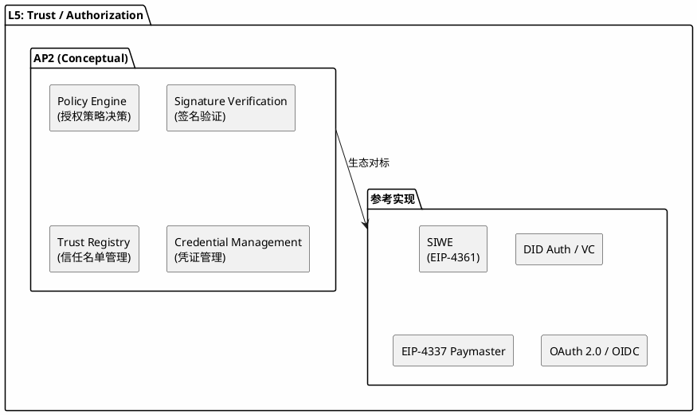
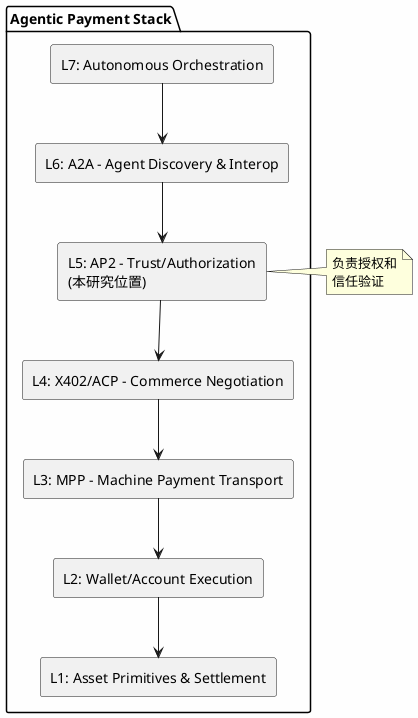
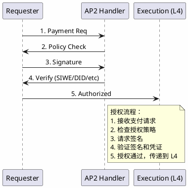
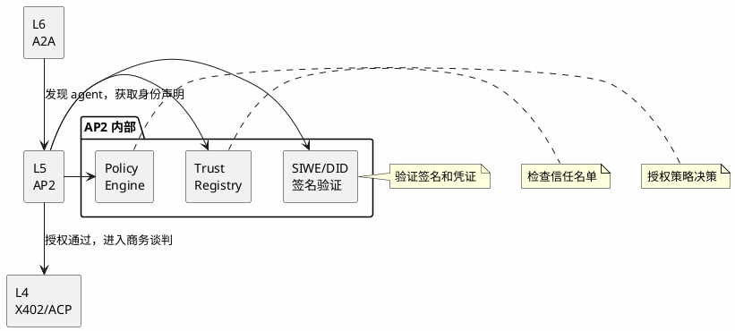

# AP2 (Agent Payment Authorization) Protocol - 分析框架

## 状态声明

**重要：** AP2 是一个**分析框架中的概念模型**，用于理解 agent 支付授权和信任验证层的能力需求，而非已发布的官方协议规范。

本研究将 AP2 定位为 L5 层的**概念性协议**，并关联到实际存在的生态项目作为参考实现。

---

## 目录

- [关键术语](#关键术语)
- [核心概念](#核心概念)
- [生态映射](#生态映射)
- [参考实现](#参考实现)
- [7 层模型位置](#7-层模型位置)
- [能力边界](#能力边界)
- [相关协议关系](#相关协议关系)
- [可确认结论](#可确认结论)
- [Evidence Gap](#evidence-gap)
- [参考资料](#参考资料)

---

## 关键术语

| 术语 | 定义 | 作用 |
|------|------|------|
| Authorization | 授权机制 | AP2 核心功能 |
| Trust Assumption | 信任假设 | 安全模型基础 |
| Signature Scheme | 签名方案 | 授权技术实现 |
| Policy Engine | 策略引擎 | 授权决策核心 |
| SIWE | Sign-In with Ethereum | 参考实现之一 |
| DID Auth | Decentralized Identity Authentication | 参考实现之一 |

---

## 核心概念

### AP2 的概念定义

AP2 (Agent Payment Authorization) 是一个**概念性协议**，用于描述 agent 支付中授权和信任验证层的能力需求：

**AP2 概念架构图：**

### 核心功能需求

| 功能 | 概念描述 | 实际生态对应 |
|------|----------|--------------|
| Policy Engine | 授权策略决策逻辑 | 智能合约权限检查、Paymaster 策略 |
| Signature Verification | 签名验证技术 | ECDSA、EdDSA、BLS 等签名方案 |
| Trust Registry | 信任名单和凭证管理 | 链上信誉合约、DID 文档 |
| Credential Management | 凭证生命周期管理 | VC (Verifiable Credentials)、API Keys |

---

## 生态映射

### 实际存在的 L5 层项目/机制

| 项目/协议 | 类型 | 状态 | 与 AP2 概念的关系 |
|-----------|------|------|------------------|
| **SIWE** (Sign-In with Ethereum) | 规范 | live (EIP-4361) | 钱包签名授权的标准实现 |
| **SIWX** (Sign-In with X) | 规范系列 | live | 扩展到其他链的签名授权 |
| **DID Auth** / **VC** | 规范 | live (W3C) | 去中心化身份和凭证验证 |
| **EIP-4337 Paymaster** | 规范 | live | 账户抽象中的授权策略 |
| **OAuth 2.0 / OIDC** | 规范 | live | Web2 授权协议的参考 |
| **Macaroon** | 规范 | live | 带权限的令牌系统 |

### 能力对标表

| AP2 概念能力 | SIWE | DID Auth | EIP-4337 Paymaster | OAuth 2.0 |
|--------------|------|----------|-------------------|-----------|
| Signature Verification | ✓ | ✓ | ✓ | ~ |
| Policy Engine | ~ | ~ | ✓ | ✓ |
| Trust Registry | - | ✓ | ~ | - |
| Credential Management | ~ | ✓ | ~ | ✓ |

**图例：** ✓ = 完整支持，~ = 部分支持，- = 不支持/不涉及

---

## 参考实现

### SIWE (Sign-In with Ethereum)

**规范：** [EIP-4361](https://eips.ethereum.org/EIPS/eip-4361)

**定位：** 以太坊钱包签名授权标准

**核心能力：**
- 标准化签名消息格式
- 域名绑定和重放攻击防护
- 与以太坊地址绑定的身份验证

**与 AP2 的关系：** AP2 概念中签名验证的**参考实现**

### DID Auth / Verifiable Credentials

**规范：** W3C DID Core, VC Data Model

**定位：** 去中心化身份和可验证凭证标准

**核心能力：**
- 去中心化身份标识 (DID)
- 可验证凭证 (VC) 的签发和验证
- 选择性披露和零知识证明支持

**与 AP2 的关系：** AP2 概念中凭证管理和信任注册的**参考实现**

### EIP-4337 Paymaster

**规范：** [ERC-4337](https://eips.ethereum.org/EIPS/eip-4337)

**定位：** 账户抽象中的授权和代付机制

**核心能力：**
- 智能合约钱包交易验证
- Paymaster 策略引擎
- Gas 费代付和授权检查

**与 AP2 的关系：** AP2 概念中策略引擎的**参考实现**

---

### 7 层模型位置

**L5: Trust / Authorization**

**7 层模型位置图：**

### 与上下层的关系

| 关系类型 | 相邻层 | 交互内容 |
|----------|--------|----------|
| **上游** | L6: A2A (Discovery) | 接收发现的 agent 信息，进行授权检查 |
| **下游** | L4: X402/ACP (Commerce) | 授权通过后进入商务谈判 |
| **平行** | 其他 L5 实现 | SIWE、DID Auth 等是替代或互补 |

### 典型授权流程

**AP2 授权流程图：**

---

## 能力边界

### AP2 能解决什么（概念层）

- **支付授权标准化**：定义 agent 支付的授权流程和格式
- **多种签名方案支持**：兼容 ECDSA、EdDSA、BLS 等多种签名
- **信任假设明确化**：清晰定义授权信任和验证假设
- **策略引擎抽象**：分离授权策略和执行逻辑

### AP2 不解决什么

- **L6: Agent Discovery**：agent 发现由 A2A 处理
- **L4: Commerce Negotiation**：商务谈判由 ACP/X402 处理
- **L3: Machine Payment Transport**：支付传输由 MPP 处理
- **L2: Wallet Execution**：钱包执行由 L2 层处理
- **合规和监管**：法律合规框架不在范围内

---

## 相关协议关系

### 垂直依赖关系

**AP2 垂直依赖关系图：**

### 水平关系（与其他 L5 实现）

| 实现方案 | 与 AP2 概念的关系 | 状态 | 适用场景 |
|----------|-------------------|------|----------|
| SIWE | 签名验证参考实现 | live | 以太坊地址绑定场景 |
| DID Auth | 去中心化身份参考 | live | 跨链/跨平台身份 |
| EIP-4337 Paymaster | 策略引擎参考 | live | 智能合约钱包 |
| OAuth 2.0 | Web2 授权参考 | live | 传统 web 服务集成 |

**潜在关系：**
- **互补关系**：SIWE + DID Auth 可组合使用
- **场景选择**：不同场景选择不同的授权机制
- **演进的替代关系**：新技术可能替代旧方案

---

## 可确认结论

| 结论 | 证据等级 | 置信度 |
|------|----------|--------|
| AP2 是 7 层模型中 L5 层的概念性协议 | 分析框架定义 | high |
| AP2 负责授权和信任验证 | 分析框架定义 | high |
| SIWE 是 AP2 概念的参考实现之一 | 生态调研 | high |
| EIP-4337 Paymaster 提供策略引擎参考 | 生态调研 | high |
| AP2 是 agentic payment 栈的安全层 | 框架推断 | medium |
| 不存在名为"AP2 Protocol"的官方规范 | 搜索验证 | high |

---

## Evidence Gap

| 缺口 | 影响 | 解决方式 |
|------|------|----------|
| 无 AP2 官方规范 | 概念细节需从生态推断 | 持续跟踪生态发展 |
| AP2 与 SIWE 精确定位关系 | 无法确认是否官方认可 | 等待官方文档 |
| 支持的签名方案详情 | 无法确认互操作性 | 参考实际项目文档 |
| 与传统授权 (OAuth) 的区别 | 无法确认优势 | 需要补充对比分析 |

---

## 参考资料

| 来源 | 说明 | 证据等级 |
|------|------|----------|
| 用户提供框架 | 7 层模型定义 | L2 |
| EIP-4361 (SIWE) | 参考实现 | L1 |
| W3C DID/VC | 参考实现 | L1 |
| EIP-4337 | 参考实现 | L1 |
| 社区调研 | 生态分析 | L4 |

---

## 版本记录

| 版本 | 日期 | 变更说明 |
|------|------|----------|
| v1 | 2026-04-01 | 初始版本（概念模型定位） |
