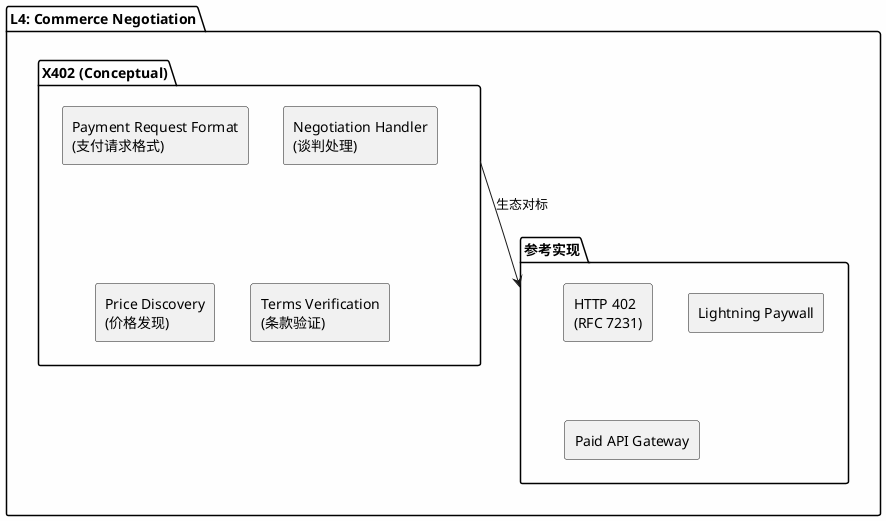
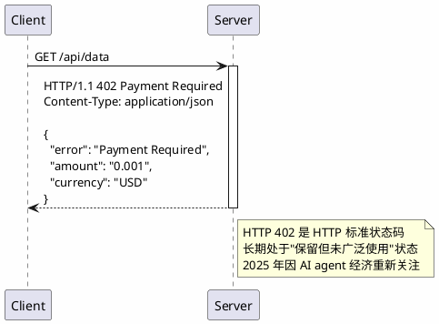
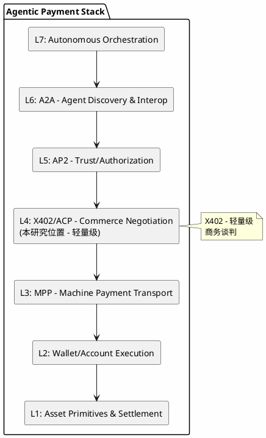
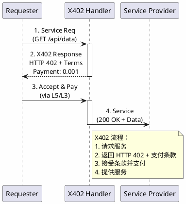
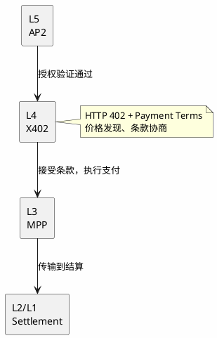
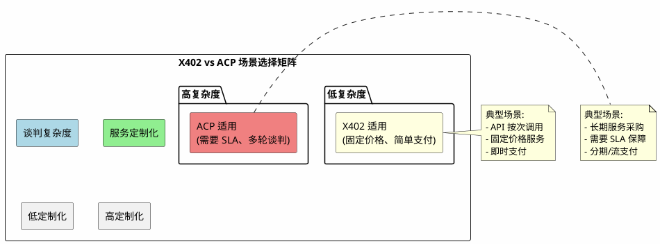

# X402 (HTTP 402 for Agents) Protocol - 分析框架

## 状态声明

**重要：** X402 是一个**分析框架中的概念模型**，用于理解基于 HTTP 402 的 agent 商业谈判层的能力需求，而非已发布的官方协议规范。

X402 概念基于 HTTP 402 Payment Required 状态码的重新关注，与 2025 年 AI agent 支付场景结合。本研究将 X402 定位为 L4 层的**概念性协议**，并关联到实际存在的生态项目作为参考实现。

---

## 目录

- [关键术语](#关键术语)
- [核心概念](#核心概念)
- [HTTP 402 历史背景](#http-402-历史背景)
- [生态映射](#生态映射)
- [参考实现](#参考实现)
- [7 层模型位置](#7-层模型位置)
- [能力边界](#能力边界)
- [相关协议关系](#相关协议关系)
- [与 ACP 的关系](#与-acp-的关系)
- [可确认结论](#可确认结论)
- [Evidence Gap](#evidence-gap)
- [参考资料](#参考资料)

---

## 关键术语

| 术语 | 定义 | 作用 |
|------|------|------|
| HTTP 402 | HTTP Payment Required 状态码 | X402 基础 |
| Commerce Negotiation | 商业谈判 | X402 核心功能 |
| Payment Request | 支付请求格式 | X402 消息格式 |
| Price Discovery | 价格发现 | 谈判前置条件 |
| Payment Header | 支付信息 HTTP 头 | X402 传输载体 |

---

## 核心概念

### X402 的概念定义

X402 是一个**概念性协议**，用于描述基于 HTTP 402 的轻量级 agent 商业谈判机制：

**X402 概念架构图：**



### 核心功能需求

| 功能 | 概念描述 | 实际生态对应 |
|------|----------|--------------|
| Payment Request Format | 标准化支付请求格式 | HTTP 402 响应 + Payment 头 |
| Negotiation Handler | 商业谈判处理逻辑 | API 定价页面、支付网关 |
| Price Discovery | 价格发现机制 | 服务定价 API、动态定价 |
| Terms Verification | 条款验证 | 支付条件检查、收据验证 |

---

## HTTP 402 历史背景

### RFC 7231 中的定义

HTTP 402 Payment Required 是 HTTP/1.1 规范 (RFC 7231) 中定义的状态码：

**HTTP 402 响应示例：**



### 2025 年的重新关注

随着 AI agent 经济的兴起，HTTP 402 获得了新的关注：

| 驱动因素 | 说明 |
|----------|------|
| AI Agent 微支付 | agent 间需要轻量级支付请求机制 |
| HTTP 兼容性 | 402 与现有 web 基础设施无缝兼容 |
| 低采用门槛 | 无需新协议，只需扩展现有 HTTP 服务 |

---

## 生态映射

### 实际存在的 L4 层项目/机制

| 项目/协议 | 类型 | 状态 | 与 X402 概念的关系 |
|-----------|------|------|-------------------|
| **HTTP 402** (RFC 7231) | 规范 | live | X402 的基础协议 |
| **Stripe AI Agent Payments** | 产品探索 | emerging | 支付基础设施的 agent 扩展 |
| **Lightning Network Paywalls** | 应用 | live | 基于闪电网络的支付墙 |
| **Paid API Gateways** | 基础设施 | live | API 计费网关（如 Mashape/Kong） |
| **Brave BAT Micropayments** | 应用 | live | 内容微支付系统 |

### 能力对标表

| X402 概念能力 | HTTP 402 | Lightning Paywall | Stripe | Paid API Gateway |
|---------------|----------|-------------------|--------|------------------|
| Payment Request | ✓ | ~ | ✓ | ✓ |
| Negotiation Handler | - | ~ | ✓ | ✓ |
| Price Discovery | - | ~ | ✓ | ✓ |
| Terms Verification | - | ✓ | ✓ | ✓ |
| HTTP 兼容 | ✓ | ~ | ✓ | ✓ |

**图例：** ✓ = 完整支持，~ = 部分支持，- = 不支持/不涉及

---

## 参考实现

### HTTP 402 Payment Required (RFC)

**规范：** [RFC 7231 Section 6.5.2](https://datatracker.ietf.org/doc/html/rfc7231#section-6.5.2)

**定位：** HTTP 标准状态码

**核心能力：**
- 指示请求的资源需要支付才能访问
- 可附带支付信息和方式
- 与现有 HTTP 基础设施完全兼容

**与 X402 的关系：** X402 概念的**协议基础**

### Lightning Network Paywalls

**定位：** 基于闪电网络的微支付墙实现

**核心能力：**
- 按页/按内容收费
- 即时支付确认
- 极低手续费支持微支付

**与 X402 的关系：** X402 概念中支付验证的**参考实现**

### Stripe AI Agent Payment

**定位：** 支付基础设施的 agent 扩展（ emerging）

**核心能力：**
- agent 身份识别和绑定
- 自动化支付流程
- 与传统支付系统集成

**与 X402 的关系：** X402 概念中支付处理的**潜在参考实现**

---

### 7 层模型位置

**L4: Commerce Negotiation (轻量级方案)**

**7 层模型位置图：**



### 与上下层的关系

| 关系类型 | 相邻层 | 交互内容 |
|----------|--------|----------|
| **上游** | L5: AP2 (Authorization) | 授权通过后进入谈判 |
| **下游** | L3: MPP (Transport) | 谈判成功后执行支付 |
| **平行** | L4: ACP (Commerce) | 可能是互补/场景选择 |

### X402 典型交互流程

**X402 交互序列图：**



---

## 能力边界

### X402 能解决什么（概念层）

- **支付请求格式标准化**：基于 HTTP 402 的标准化响应格式
- **商业谈判流程标准化**：定义请求 - 响应-支付的流程
- **与 HTTP 基础设施无缝集成**：无需新协议，扩展现有服务
- **轻量级场景覆盖**：适用于简单、快速的支付请求

### X402 不解决什么

- **L5: Trust/Authorization**：授权验证由 AP2 处理
- **L3: Machine Payment Transport**：支付传输由 MPP 处理
- **L6: Agent Discovery**：agent 发现由 A2A 处理
- **复杂协商场景**：多轮谈判、SLA 协商等由 ACP 处理

---

## 相关协议关系

### 垂直依赖关系

**X402 垂直依赖关系图：**



### 水平关系（与 ACP）

| 维度 | X402 | ACP |
|------|------|-----|
| 基础 | HTTP 402 | 独立协议 |
| 复杂度 | 轻量级 | 重量级 |
| 适用场景 | 简单支付请求 | 复杂商务谈判 |
| 谈判能力 | 单向报价 | 多轮协商 |
| HTTP 兼容 | 原生兼容 | 需要适配 |
| 实现成本 | 低 | 高 |

**关系判断：** X402 和 ACP 更可能是**互补关系**而非替代：
- X402 适用于简单、快速的支付场景
- ACP 适用于复杂、多轮的商务谈判

---

## 与 ACP 的关系

### 场景选择矩阵

**X402 vs ACP 场景选择图：**



### 协同使用场景

```
用户请求
   │
   ▼
[简单服务] ──► X402 快速谈判 ──► MPP 支付 ──► 完成
   │
   ▼
[复杂服务] ──► ACP 多轮谈判 ──► 生成合约 ──► MPP 支付 ──► 完成
```

---

## 可确认结论

| 结论 | 证据等级 | 置信度 |
|------|----------|--------|
| X402 是 7 层模型中 L4 层的概念性协议 | 分析框架定义 | high |
| X402 基于 HTTP 402 Payment Required | RFC 7231 | high |
| X402 负责轻量级商业谈判 | 分析框架定义 | high |
| HTTP 402 是 HTTP 标准状态码 | RFC 7231 | high |
| X402 与 ACP 可能是互补关系 | 框架推断 | medium |
| 不存在名为"X402 Protocol"的官方规范 | 搜索验证 | high |

---

## Evidence Gap

| 缺口 | 影响 | 解决方式 |
|------|------|----------|
| 无 X402 官方规范 | 概念细节需从生态推断 | 持续跟踪生态发展 |
| HTTP 402 在 agent 场景的具体用法 | 无法确认详细机制 | 等待官方文档 |
| 与 ACP 的精确定位关系 | 无法确认生态位 | 需要补充对比分析 |
| Stripe 等支付巨头的 agent 策略 | 无法确认产业方向 | 跟踪厂商动态 |

---

## 参考资料

| 来源 | 说明 | 证据等级 |
|------|------|----------|
| 用户提供框架 | 7 层模型定义 | L2 |
| RFC 7231 | HTTP 402 原始定义 | L1 |
| Lightning Network | 支付墙实现 | L3 |
| 社区调研 | 生态分析 | L4 |

---

## 版本记录

| 版本 | 日期 | 变更说明 |
|------|------|----------|
| v1 | 2026-04-01 | 初始版本（概念模型定位 + HTTP 402 背景） |
