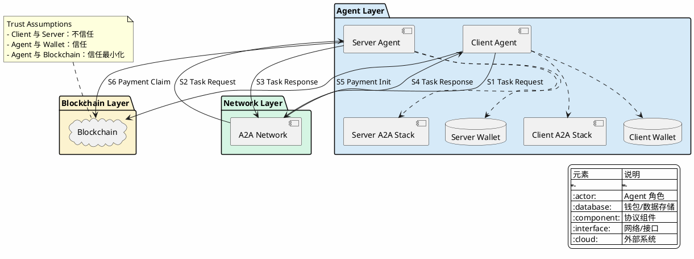
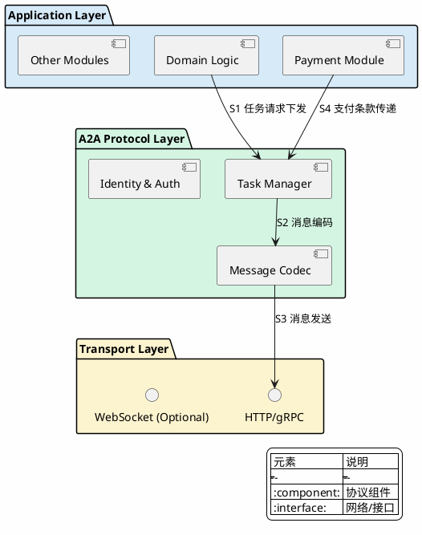
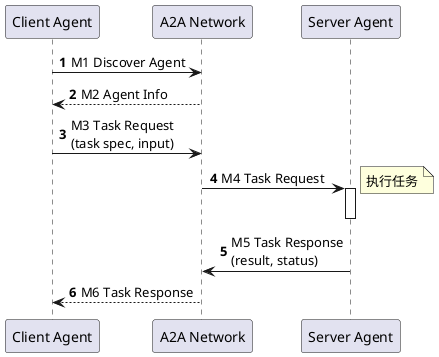

# A2A (Agent-to-Agent) Protocol - Agentic Payment Primitive 分析

## 概述

A2A (Agent-to-Agent) 是 agentic payment 栈中 **L6 层（Agent Discovery & Interop）**的核心协议/框架，负责 agent 之间的发现、能力描述和互操作机制。

从 agentic payment 视角分析，**A2A 协议的核心定位是任务层互操作性，而非价值转移**。支付功能不是协议原生能力，而是应用层扩展，需要与 blockchain payment primitive 组合使用。

---

## 关键术语

| 术语 | 定义 | 作用 |
|------|------|------|
| Agent | 能够自主感知环境、做出决策并执行动作的智能体 | A2A 协议的基本参与单元 |
| Agent Discovery | agent 发现机制 | L6 核心功能之一 |
| Agent Interop | agent 互操作性 | L6 核心功能之二 |
| Agent Registry | agent 注册表 | discovery 基础设施 |
| Capability Description | 能力描述 | agent 自我描述格式 |
| Client Agent | 发起任务请求的 agent | 支付发起方 |
| Server Agent | 接收并执行任务的 agent | 支付接收方 |
| Task Delegation | 任务委托，一个 agent 将任务发送给另一个 agent 执行 | A2A 核心机制 |
| Trust Boundary | 信任边界，区分不同控制方之间的信任假设 | 分析支付安全模型的关键概念 |
| Agent Wallet | 代表 agent 持有和管理数字资产的组件 | agentic payment 的外部依赖组件 |
| [AP2](../agentic-payment-ap2/artifact.md) | Agent Payment Authorization Protocol，授权策略引擎接口架构 | A2A 任务委托需要 AP2 授权验证 |
| [ACP](../agentic-payment-acp/artifact.md) | Agent Commerce Protocol，商业谈判协议 | A2A 发现后进入 ACP 商务谈判 |
| [MPP](../agentic-payment-mpp/artifact.md) | Multi-Party Payment，多方支付传输机制 | A2A 任务执行需要 MPP 支付传输 |

---

## 组件架构

### A2A 在 Agentic Payment 7 层模型中的位置

```
┌─────────────────────────────────────────┐
│  L7: Autonomous Orchestration           │  ← 自主编排层
├─────────────────────────────────────────┤
│  L6: A2A - Agent Discovery & Interop    │  ← 本研究位置
├─────────────────────────────────────────┤
│  L5: AP2 - Trust/Authorization          │  ← 授权验证层
├─────────────────────────────────────────┤
│  L4: X402/ACP - Commerce Negotiation    │  ← 商务谈判层
├─────────────────────────────────────────┤
│  L3: MPP - Machine Payment Transport    │  ← 支付传输层
├─────────────────────────────────────────┤
│  L2: Wallet/Account Execution           │  ← 钱包执行层
├─────────────────────────────────────────┤
│  L1: Asset Primitives & Settlement      │  ← 资产结算层
└─────────────────────────────────────────┘
```

### A2A 生态系统角色与信任边界

**Diagram Package:** `openspec/changes/primitive-a2a-agentic-payment-protocol/diagrams/role-boundary/`



**信任假设说明：**

| 关系 | 信任假设 | 说明 |
|------|----------|------|
| Client Agent 与 Server Agent | 不信任 | 需外部结算保证 |
| Agent 与内部 Wallet | 信任 | 同一控制方 |
| Agent 与 Blockchain | 信任最小化 | 通过密码学验证 |

### Agent 内部组件架构

**Diagram Package:** `openspec/changes/primitive-a2a-agentic-payment-protocol/diagrams/agent-components/`



**Client 与 Server 的差异：**

| 组件 | Client Agent | Server Agent |
|------|--------------|--------------|
| Task Manager | 发起任务、等待响应 | 接收任务、执行并返回 |
| Payment Module | 发起支付请求 | 验证并确认支付 |
| State Machine | 客户端状态（pending/completed） | 服务端状态（received/processing/completed） |

---

## 核心交互流程

### 任务委托流程（Happy Path）

**Diagram Package:** `openspec/changes/primitive-a2a-agentic-payment-protocol/diagrams/task-delegation-flow/`



**流程步骤说明：**

| 步骤 | 方向 | 说明 |
|------|------|------|
| M1 | Client → Network | Client Agent 发现目标 Server Agent |
| M2 | Network → Client | A2A Network 返回 Server Agent 信息 |
| M3 | Client → Network | Client 发送任务请求（包含 task spec 和 input） |
| M4 | Network → Server | A2A Network 路由任务请求到 Server |
| M5 | Server → Network | Server 执行任务后返回结果 |
| M6 | Network → Client | A2A Network 将响应路由回 Client |

### 带支付的可能流程（推断）

**注意**：A2A 协议是否原生支持 payment instruction 需要进一步验证。基于现有信息，**支付更可能是应用层扩展**，由 agent 自行集成 payment module 实现。

```
Client Agent                    Blockchain                     Server Agent
     │                              │                              │
     │──── 1. Task Request ─────────│                              │
     │    (task + payment terms)    │                              │
     │                              │──── 2. Payment Init ────────>│
     │                              │    (lock funds in channel)   │
     │◄─── 3. Payment Locked ───────│                              │
     │                              │                              │
     │                              │                              │ 执行任务
     │                              │──── 4. Payment Claim ───────>│
     │                              │    (unlock with proof)       │
```

---

## 能力边界

### A2A 协议能解决什么（原生能力）

| 能力 | 归属 | 说明 |
|------|------|------|
| Agent 发现 | A2A 原生 | 协议核心功能 |
| 任务描述 | A2A 原生 | 协议定义 task spec 格式 |
| 消息传递 | A2A 原生 | 协议定义通信语义 |
| 身份认证 | A2A 原生 | 协议定义 identity 机制 |

### A2A 协议不能解决什么（外部依赖）

| 能力 | 归属 | 说明 |
|------|------|------|
| 支付指令 | 外部依赖 | 需应用层扩展或集成 payment module |
| 价值结算 | 外部依赖 | 依赖 blockchain 或传统支付系统 |
| 支付原子性 | 外部依赖 | 依赖 payment channel 或 smart contract |
| 争议解决 | 外部依赖 | 需额外机制（如乐观支付、仲裁） |

### 前提条件

- Agent 必须具备网络通信能力
- 如需支付，Agent 需集成 wallet 或 payment adapter
- Blockchain 可用性（如使用链上结算）

---

## 设计取舍

### 为什么 A2A 不原生支持支付？

这可能是有意的设计边界，原因包括：

1. **关注点分离**：A2A 聚焦于任务层互操作性，支付是价值层问题，由专门的 primitive 处理更合适。

2. **支付原语多样性**：不同 blockchain、不同场景需要不同的支付原语（即时结算、payment channel、订阅支付等），协议层难以统一。

3. **监管与合规**：支付涉及金融监管，协议层保持中立可降低合规风险。

4. **演进灵活性**：支付技术快速演进，将支付留给应用层允许更快的创新。

### 为什么选择 HTTP/gRPC 作为传输层？

| 考量 | 说明 |
|------|------|
| 成熟度 | HTTP/gRPC 是广泛支持的工业标准 |
| 性能 | gRPC 提供低延迟、高吞吐的通信能力 |
| 互操作性 | 几乎所有编程环境都支持 HTTP |

---

## 支付集成模式

Agent 如需支持支付，可通过以下两种方式：

| 模式 | 说明 | 优点 | 缺点 |
|------|------|------|------|
| 应用层扩展 | Agent 自行集成 payment module，在 task spec 中携带支付条款 | 灵活、可适配多种 payment primitive | 需要自行处理安全模型 |
| 协议层扩展 | 通过 A2A 扩展机制定义 payment instruction 标准 | 标准化、可互操作 | 需要社区共识和协议升级 |

---

## A2A 在 Agentic Payment 栈中的位置

```
┌─────────────────────────┐
│   Application Layer     │  ← Agent 业务逻辑 + Payment Module
├─────────────────────────┤
│   A2A Protocol          │  ← 任务层互操作性（本协议范围）
├─────────────────────────┤
│   Transport (HTTP/gRPC) │
├─────────────────────────┤
│   Blockchain / Fiat     │  ← 结算层（外部依赖）
└─────────────────────────┘
```

**关键结论**：Agentic payment 需要 A2A + blockchain payment primitive 的组合。A2A 协议处理任务层语义（做什么、谁来做、如何交付），blockchain payment primitive 处理价值层结算（如何付、如何保证原子性）。

---

## 相关协议关系

### 垂直依赖关系

| 关系类型 | 相邻层 | 交互内容 |
|----------|--------|----------|
| **上游** | L7: Autonomous Orchestration | 提供 agent 发现服务，接收编排调度指令 |
| **下游** | L5: AP2 (Trust/Authorization) | 发现后需要授权验证，传递信任凭证 |
| **平行** | 其他 L6 实现 | 可能是替代或互补关系 |

### 水平关系（与其他 L6 实现）

| 实现方案 | 与 A2A 概念的关系 | 状态 |
|----------|-------------------|------|
| Coinbase AgentKit | 官方生态参考实现 | live |
| A2A.io | 第三方协议实现 | live |
| Farcaster Frames | 垂直场景实现 | live |
| MCP | 相邻领域协议 | emerging |

### 平行协议

| 协议 | 与 A2A 关系 | 说明 |
|------|------------|------|
| ANP (Agent Network Protocol) | 竞争/互补 | 另一 agent 互操作性协议 |
| ACP (Agent Communication Protocol) | 竞争/互补 | 专注于通信层 |

### 下游扩展

| 对象 | 关系 | 说明 |
|------|------|------|
| Account Abstraction (ERC-4337) | 可能的支付集成点 | agent 钱包标准化 |
| Payment Channels | 可能的支付集成点 | 高效微支付 |
| Smart Contract Platforms | 结算层 | 自动化支付逻辑 |

---

## 可确认结论

| 结论 | 置信度 |
|------|--------|
| A2A 是 agentic payment 栈中 L6 层的核心协议/框架 | high |
| A2A 负责 agent 发现和互操作，而非价值转移 | high |
| 支付不是 A2A 原生能力，而是应用层扩展 | high |
| A2A 与 blockchain payment primitive 是互补关系 | high |
| Coinbase AgentKit 可视为 A2A 概念的官方生态参考实现 | medium |
| A2A 是 agentic payment 栈的必要组件 | medium |

---

## Evidence Gap

| 缺口 | 影响 | 解决方式 |
|------|------|----------|
| A2A 协议关于支付功能的明确规范描述 | 无法确认是否有原生支付扩展点 | 持续跟踪规范演进 |
| 实际生产环境使用 A2A + payment 的案例 | 无法确认实际集成模式 | 跟踪生态采用情况 |
| A2A 与 AgentKit 的精确定位关系 | 无法确认是否官方认可 | 等待 Coinbase 官方文档 |

---

## 参考资料

| 来源 | 说明 |
|------|------|
| [A2A Protocol Official Specification](https://google.github.io/A2A/) | A2A 协议官方规范 |
| [A2A GitHub Repository](https://github.com/google/A2A) | A2A 协议代码和文档 |
| [Google Blog: A2A Announcement](https://developers.googleblog.com/en/a2a-a-new-open-protocol-for-ai-agent-interoperability/) | Google 官方博客公告 |
| [Coinbase AgentKit](https://www.cdp.coinbase.com/agentkit) | Coinbase AgentKit 参考实现 |
| [A2A.io](https://a2a.io) | A2A.io 协议实现 |
| [Farcaster Frames](https://warpcast.notion.site/Farcaster-Frames-4bd1039983b04f42956bbace0f254705) | Farcaster Frames 规范 |

---

## 版本记录

| 版本 | 日期 | 变更说明 |
|------|------|----------|
| v2 | 2026-04-07 | 合并 `a2a-protocol` 和 `agentic-payment-a2a` 两份 artifact，修复 PlantUML 图 |
| v1 | 2026-04-01 | 初始版本（概念模型定位） |
