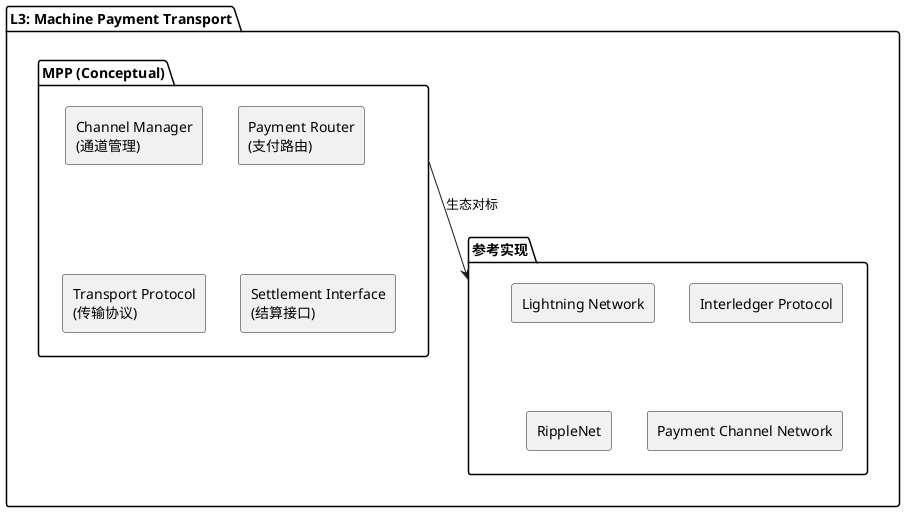
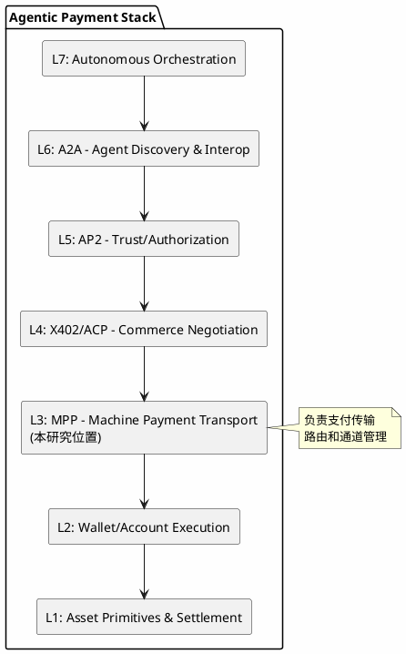
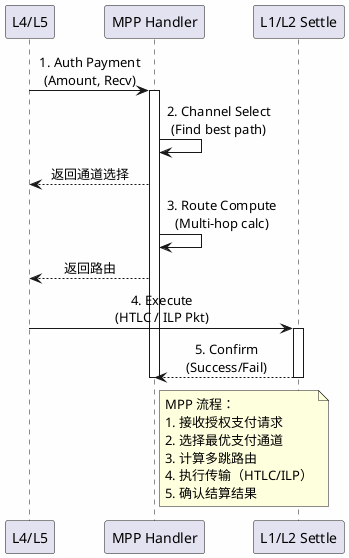

# MPP (Machine Payment Protocol) - 分析框架

## 状态声明

**重要：** MPP 是一个**分析框架中的概念模型**，用于理解 agent 机器支付传输层的能力需求，而非已发布的官方协议规范。

本研究将 MPP 定位为 L3 层的**概念性协议**，并关联到实际存在的生态项目（如 Lightning Network）作为参考实现。

---

## 目录

- [关键术语](#关键术语)
- [核心概念](#核心概念)
- [生态映射](#生态映射)
- [参考实现](#参考实现)
- [7 层模型位置](#7-层模型位置)
- [能力边界](#能力边界)
- [相关协议关系](#相关协议关系)
- [可确认结论](#可确认结论)
- [Evidence Gap](#evidence-gap)
- [参考资料](#参考资料)

---

## 关键术语

| 术语 | 定义 | 作用 |
|------|------|------|
| Payment Transport | 支付传输 | MPP 核心功能 |
| Payment Channel | 支付通道 | 传输基础设施 |
| Routing | 路由机制 | 传输关键算法 |
| Settlement | 结算 | 传输最终状态 |
| Channel Manager | 通道管理 | 通道生命周期管理 |
| Payment Router | 支付路由器 | 路由计算和选择 |
| [ACP](../agentic-payment-acp/artifact.md) | Agent Commerce Protocol，商业谈判协议 | MPP 传输 ACP 谈判达成的支付 |
| [X402](../agentic-payment-x402/artifact.md) | HTTP 402 Payment Required，HTTP 支付协议 | MPP 可作为 X402 的传输层 |
| [AP2](../agentic-payment-ap2/artifact.md) | Agent Payment Authorization Protocol，授权策略引擎接口架构 | MPP 传输前需要 AP2 授权验证 |

---

## 核心概念

### MPP 的概念定义

MPP (Machine Payment Protocol) 是一个**概念性协议**，用于描述 agent 机器支付传输层的能力需求：

**MPP 概念架构图：**



### 核心功能需求

| 功能 | 概念描述 | 实际生态对应 |
|------|----------|--------------|
| Channel Manager | 支付通道创建、维护、关闭 | Lightning Network 通道管理 |
| Payment Router | 路由计算、路径选择、费用优化 | LN 路由算法、ILP Connector |
| Transport Protocol | 传输协议和消息格式 | ILP Interledger Protocol |
| Settlement Interface | 与 L1/L2 结算层对接 | 链上结算、通道结算 |

---

## 生态映射

### 实际存在的 L3 层项目/机制

| 项目/协议 | 类型 | 状态 | 与 MPP 概念的关系 |
|-----------|------|------|-------------------|
| **Lightning Network** | 支付通道网络 | live | MPP 概念的主要参考实现 |
| **Interledger Protocol (ILP)** | 跨账本协议 | live | 传输协议的参考实现 |
| **RippleNet / XRP Ledger** | 跨境支付网络 | live | 结算接口的参考实现 |
| **Payment Channel Network (PCN)** | 通道网络 | live/research | 通道管理的参考实现 |
| **Sprites / Perun** | 状态通道框架 | research | 链下通道技术参考 |

### 能力对标表

| MPP 概念能力 | Lightning | ILP | RippleNet | PCN |
|--------------|-----------|-----|-----------|-----|
| Channel Manager | ✓ | - | - | ✓ |
| Payment Router | ✓ | ✓ | ~ | ~ |
| Transport Protocol | ✓ | ✓ | ✓ | ~ |
| Settlement Interface | ✓ | ✓ | ✓ | ✓ |

**图例：** ✓ = 完整支持，~ = 部分支持，- = 不支持/不涉及

---

## 参考实现

### Lightning Network

**定位：** 比特币二层支付通道网络

**核心能力：**
- 双向支付通道创建和维护
- 多跳支付路由（multi-hop）
- 即时最终结算
- 极低手续费支持微支付

**与 MPP 的关系：** MPP 概念的**主要参考实现**

### Interledger Protocol (ILP)

**定位：** 跨账本支付传输协议

**核心能力：**
- 连接不同区块链和传统支付系统
- 原子跨链支付（通过 ILP Connector）
- 统一的支付请求格式（ILP Packet）
- 流支付支持（STREAM 协议）

**与 MPP 的关系：** MPP 概念中传输协议的**参考实现**

### RippleNet / XRP Ledger

**定位：** 跨境支付网络

**核心能力：**
- 金融机构间跨境转账
- XRP 作为桥梁货币
- 3-5 秒最终结算
- 合规和监管支持

**与 MPP 的关系：** MPP 概念中结算接口的**参考实现**

---

### 7 层模型位置

**L3: Machine Payment Transport**

**7 层模型位置图：**



### 与上下层的关系

| 关系类型 | 相邻层 | 交互内容 |
|----------|--------|----------|
| **上游** | L4: X402/ACP (Commerce) | 接收谈判成功的支付指令 |
| **上游** | L5: AP2 (Authorization) | 验证授权后执行传输 |
| **下游** | L2/L1: Wallet/Settlement | 传递结算指令到链上执行 |

### MPP 典型支付流程

**MPP 支付流程图：**



---

## 能力边界

### MPP 能解决什么（概念层）

- **机器支付传输标准化**：定义 agent 支付的传输协议和格式
- **支持多种支付底层**：兼容链上结算、支付通道、传统支付等
- **优化支付效率和成本**：通过通道网络和路由算法降低费用
- **支持微支付场景**：通道技术使极低额支付经济可行

### MPP 不解决什么

- **L5: Trust/Authorization**：授权验证由 AP2 处理
- **L4: Commerce Negotiation**：商务谈判由 ACP/X402 处理
- **L2: Wallet Execution**：钱包执行由 L2 层处理
- **L1: Asset Settlement**：底层资产结算由 L1 层处理

---

## 相关协议关系

### 垂直依赖关系

```
L4 (X402/ACP) ─────► 商务谈判完成
     │                支付条款确定
     │
     ▼
L3 (MPP) ──────────► 选择支付通道
     │                计算最优路由
     │                执行传输（可能多跳）
     │
     ▼
L2/L1 ─────────────► 钱包签名
                      链上结算（如需要）
```

### 与 Lightning Network 的关系

**Lightning Network 是 MPP 概念的主要参考实现：**

| MPP 概念组件 | Lightning 对应 |
|--------------|----------------|
| Channel Manager | Lightning 通道（bOLT #2） |
| Payment Router | Source-based routing (bOLT #7) |
| Transport Protocol | Lightning 消息格式（bOLT #1） |
| Settlement Interface | 链上结算 / 通道结算 |

**关键机制：HTLC (Hashed TimeLock Contract)**
- 支持多跳支付的原子性
- 超时保护防止资金锁定
- MPP 概念可参考 HTLC 设计

---

## 可确认结论

| 结论 | 证据等级 | 置信度 |
|------|----------|--------|
| MPP 是 7 层模型中 L3 层的概念性协议 | 分析框架定义 | high |
| MPP 负责机器支付的实际传输 | 分析框架定义 | high |
| MPP 需要与底层结算层对接 | 框架推断 | high |
| Lightning Network 是 MPP 的主要参考实现 | 生态调研 | high |
| ILP 提供跨账本传输参考 | 生态调研 | high |
| 不存在名为"MPP Protocol"的官方规范 | 搜索验证 | high |

---

## Evidence Gap

| 缺口 | 影响 | 解决方式 |
|------|------|----------|
| 无 MPP 官方规范 | 概念细节需从生态推断 | 持续跟踪生态发展 |
| MPP 与 Lightning 精确定位关系 | 无法确认是否官方认可 | 等待官方文档 |
| 支持的支付方式详情 | 无法确认适用范围 | 参考实际项目文档 |
| 是否有标准化组织推动 | 无法确认权威性 | 跟踪标准组织动态 |

---

## 参考资料

| 来源 | 说明 | 证据等级 |
|------|------|----------|
| 用户提供框架 | 7 层模型定义 | L2 |
| Lightning Network (bOLT) | 参考实现 | L1 |
| Interledger Protocol | 参考实现 | L1 |
| RippleNet | 参考实现 | L3 |
| 社区调研 | 生态分析 | L4 |

---

## 版本记录

| 版本 | 日期 | 变更说明 |
|------|------|----------|
| v1 | 2026-04-01 | 初始版本（概念模型定位 + Lightning Network 对标） |
