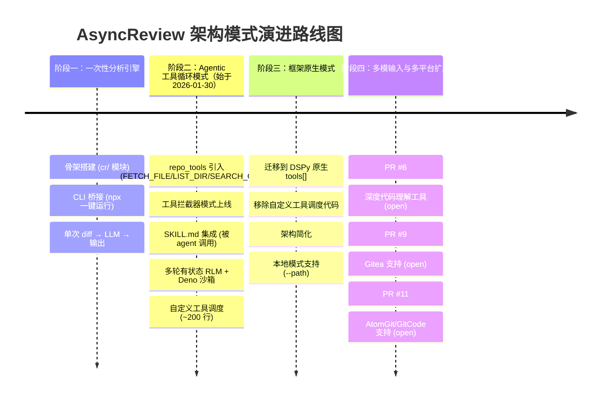
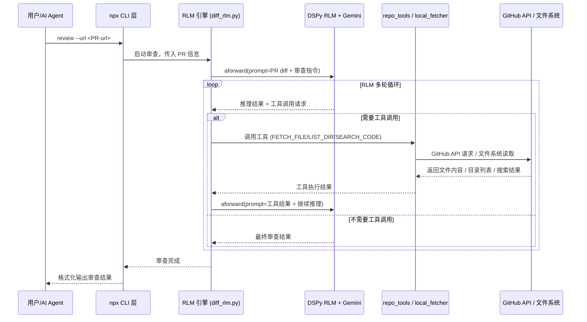

<!-- 目录 -->
- [概述](#概述)
- [关键术语](#关键术语)
- [实体分类](#实体分类)
- [演进路线图](#演进路线图)
- [阶段分析](#阶段分析)
  - [阶段一：一次性分析引擎](#阶段一一次性分析引擎基线模式)
  - [阶段二：Agentic 工具循环模式](#阶段二agentic-工具循环模式)
  - [阶段三：框架原生模式](#阶段三框架原生模式)
  - [阶段四：多模输入与多平台扩展](#阶段四多模输入与多平台扩展)
- [当前架构组件图](#当前架构组件图)
- [RLM 审查流程](#rlm-审查流程)
- [阶段能力对比](#阶段能力对比)
- [设计取舍](#设计取舍)
- [能力归属表](#能力归属表)
- [边界与前提](#边界与前提)
- [结论](#结论)
- [待确认问题](#待确认问题)
- [参考资料](#参考资料)

## 概述

> **置信度声明**：本研究的所有技术主张均基于基线 artifact（`knowledge/analysis/primitives/ai-code-review/asyncreview-evolution/artifact.md`）的分析推断，证据等级为 L4（第三方分析）。规划的全部在线来源（20 个）因无网络访问能力，验证状态均为未验证。因此，本 artifact 中的阶段分析、能力对比与设计取舍结论均为基于基线推断的条件性主张，置信度待 L1/L2 回源验证后更新。高确定性结论需通过 commit diff、release notes、PR 讨论等 L2 来源交叉验证后方可确立。

AsyncReview（AsyncFuncAI/AsyncReview）是一个基于 DSPy RLM（Recursive Language Models）框架的 Agentic 代码审查系统，通过递归语言模型循环实现多轮"分析 → 执行工具 → 观察结果"的代码审查流程。

与传统一次性 diff 分析工具不同，AsyncReview 通过"思考 → 生成代码 → 沙箱执行 → 观察结果 → 递归迭代"的循环获取全仓库上下文，从而提供更深入的代码审查能力。

**本质与表现形式**：

| 维度 | 说明 |
|------|------|
| 它是什么 | 基于 DSPy RLM 框架的 Agentic 代码审查系统，通过递归语言模型循环实现多轮代码审查流程 |
| 表现形式 | GitHub 开源项目实现（Python + TypeScript CLI），含 `cr/` 核心模块、`npx/` CLI 桥接层、`skills/` Skill 集成规范 |
| 类比理解 | 类似传统 LLM code review 工具（一次性 diff → LLM 分析 → 输出评论），但引入了 RLM 递归循环 + 工具执行层，使 LLM 能像开发者一样"探索仓库、执行代码、验证假设" |
| 在模型中的位置 | 属于 AI Code Review 领域的 primitive 机制：核心是 RLM 驱动的多轮工具循环架构 |

## 关键术语

| 术语 | 定义 | 在本题中的作用 |
|------|------|---------------|
| RLM（Recursive Language Models） | DSPy 框架中的一种递归语言模型执行模式，支持多轮有状态的推理循环，每轮可调用工具并观察结果 | AsyncReview 的核心执行引擎，是理解其"Agentic"能力的关键 |
| DSPy | 斯坦福大学开发的深度学习编程框架，提供声明式的 LLM 编程范式，包含 RLM 模块 | AsyncReview 选择的技术框架，架构变迁的核心依赖 |
| `tools[]` | DSPy RLM 的原生工具参数，允许将 Python 函数注册为 RLM 可调用的工具 | 架构从自定义工具调度迁移到框架原生能力的核心标识 |
| Agentic Code Review | 代码审查不再是静态分析，而是 LLM 主动探索代码仓库、执行代码、验证假设的代理式行为 | AsyncReview 的核心定位，也是与传统 diff 分析工具的本质区别 |
| 工具拦截器模式 | RLM 生成的工具调用被中间层拦截并转为外部 API 请求（如 GitHub API），而非直接执行 | 阶段二的核心架构模式，后被阶段三的框架原生模式替代 |
| Deno 沙箱 | 利用 Deno 运行时提供的安全隔离环境执行 RLM 生成的 Python 代码 | AsyncReview 的安全执行模型，理解其安全边界的关键词 |
| SKILL.md | 遵循 vercel/skills 规范的接口描述文件，定义 AsyncReview 如何被其他 AI agent 调用 | 项目"被调用"而非"独立工具"定位的核心证据 |
| npx CLI 桥接 | 通过 TypeScript 层（`npx/`）管理 Python 运行时并桥接用户命令，实现 `npx asyncreview review` 一键运行 | 降低用户使用门槛的关键架构决策 |

## 实体分类

在展开阶段分析之前，首先明确系统中各关键实体的分类，避免后续分析中混用不同层级的概念。

| 实体 | 类型 | 控制方 | 是否跨信任边界 | 主要职责 |
|------|------|--------|----------------|----------|
| AsyncReview RLM 引擎 | component | AsyncReview | 否 | RLM 循环执行、工具调度、状态管理 |
| repo_tools（FETCH_FILE/LIST_DIR/SEARCH_CODE） | component | AsyncReview | 否 | 提供 RLM 可调用的仓库探索工具 |
| Deno 沙箱 | component | AsyncReview | 否 | 安全执行 RLM 生成的代码 |
| DSPy RLM 框架 | external system | DSPy 项目 | 是（外部依赖） | 提供 RLM 执行引擎与原生 tools[] 能力 |
| GitHub API | external system | GitHub | 是（跨信任边界） | PR/Issue 数据获取、diff 获取、文件搜索 |
| AI Agent（Claude/Cursor 等） | role | 第三方 | 是（通过 SKILL.md 调用） | 作为调用方，将 AsyncReview 作为 Skill 使用 |
| 用户（开发者） | role | 终端用户 | 是 | 通过 CLI 或 AI Agent 发起代码审查请求 |
| npx CLI 层 | component | AsyncReview | 否 | 用户入口、Python 运行时管理、参数解析 |
| Gemini LLM 后端 | external system | Google | 是（外部依赖） | 提供 RLM 的语言模型推理能力 |

## 演进路线图

AsyncReview 的架构演进按"架构模式变化"划分为四个阶段，展示了从一次性分析到 Agentic 工具循环、再到框架原生、最终扩展多模输入的核心跃迁路径。



> 说明：阶段四的 PR 均为 open 状态，尚未合并，代表项目的潜在演进方向而非已实现能力 [L4, baseline artifact 推断]。

## 阶段分析

### 阶段一：一次性分析引擎（基线模式）

**核心特征**：项目的起点是构建一个"能用"的最小可行产品。此阶段的核心任务不是实现 Agentic 能力，而是搭建完整的运行骨架：Python 端的 RLM 引擎骨架（`cr/` 模块）、用户入口的 CLI 桥接层（`npx/`）、以及前后端分离的项目结构。此时的 RLM 执行引擎本质上是一次性分析：接收 diff → 调用 LLM → 输出审查结果，尚未引入工具循环。

**架构模式**：线性分析管道（input → process → output），RLM 引擎的"递归"能力尚未被激活

**新增能力**：
- `cr/` 核心模块：`diff_rlm.py`（RLM 审查引擎）、`github.py`（GitHub API 集成）、`render.py`（结果渲染）、`suggestions.py`（建议生成）、`types.py`（类型定义） [L4, baseline artifact]
- npx CLI 桥接：TypeScript 层通过 Python runner 桥接后端，用户通过 `npx asyncreview review` 即可运行，无需本地 Python 环境 [L4, baseline artifact]
- Deno 沙箱配置骨架：`deno.json` 在初始骨架中即存在，但实际执行引擎尚未实现 [L4, baseline artifact]

**未抛弃任何能力**：此为初始阶段

**技术思考**：项目从一开始就规划了"模块化后端 + 便捷入口"的双层架构，说明团队在起点就考虑了用户可用性和系统可扩展性。Deno 沙箱在第一天写入配置但延后实现，体现了"先搭骨架、后填能力"的渐进式开发策略。

> 证据说明：阶段一的细节来自基线 artifact 的项目骨架描述 [L4, baseline artifact]，commit 历史的实际文件数和创建顺序需网络访问验证。

### 阶段二：Agentic 工具循环模式

**核心特征**：这是 AsyncReview 的第一次也是最重要的架构跃迁——从"看 diff 的静态分析工具"变为"能探索仓库的 Agentic 审查系统"。核心变化是引入了 repo_tools 和工具拦截器模式，使 RLM 不再受限于 diff 提供的上下文，而是能主动获取整个仓库的文件、目录结构和代码片段。同时，多轮有状态 RLM 和 Deno 沙箱的引入，使 RLM 能执行代码并观察结果，形成完整的"思考 → 执行 → 观察 → 再思考"循环。

**架构模式**：RLM 工具循环（think → call_tool → execute → observe → repeat），通过自定义工具拦截器实现

**从阶段一新增**：
- `repo_tools.py` 工具集：FETCH_FILE（按路径获取文件）、LIST_DIR（列出目录）、SEARCH_CODE（代码搜索，使用 GitHub `filename:` 限定符）[L4, baseline artifact]
- 工具拦截器模式：RLM 生成的工具调用被 `_process_tool_requests()` 拦截并转为 GitHub API 请求 [L4, baseline artifact]
- 多轮有状态 RLM：RLM 不再是单次调用，而是通过 `AGENTIC_TOOLS_PROMPT` 和 `_run_rlm_with_tools()` 实现有状态的多轮推理 [L4, baseline artifact]
- Deno 沙箱运行时：从配置骨架变为实际运行的 Python 沙箱环境，用于安全执行 RLM 生成的代码 [L4, baseline artifact]
- SKILL.md 集成：`skills/asyncreview/SKILL.md` 定义文件，使 AsyncReview 可被 Claude、Cursor 等 AI agent 作为 Skill 调用 [L4, baseline artifact]
- GitHub Token 支持：可审查私有仓库 [L4, baseline artifact]

**从阶段一抛弃**：
- 一次性 diff 分析模式被工具循环模式取代（旧的一次性分析逻辑被保留但降级为次要路径）

**技术思考**：工具拦截器模式是此阶段的架构核心——项目选择自己实现工具调度逻辑（约 200 行自定义代码），而非等待 DSPy 框架提供原生工具支持。这反映了两个判断：一是 RLM 的工具调用能力在当时尚未成熟，二是团队认为快速实现 Agentic 能力比等待框架完善更重要。SKILL.md 的同步添加说明项目从一开始就将自己定位为"被调用的能力层"而非独立的终端工具。

> 证据说明：阶段二的特征来自基线 artifact [L4, baseline artifact]。自定义工具调度代码的具体行数和 `_process_tool_requests()` 实现需 commit diff 验证。SKILL.md 兼容的具体 agent 列表需网络访问确认 [见待确认问题]。

### 阶段三：框架原生模式

**核心特征**：这是 AsyncReview 的第二次重大架构跃迁，也是一次显著的架构简化。项目从"自定义工具调度"迁移到 DSPy RLM 原生的 `tools[]` 参数，移除了约 200 行自定义工具调度代码（`AGENTIC_TOOLS_PROMPT`、`_process_tool_requests()`、`_run_rlm_with_tools()`）。这不是能力退化，而是"借框架之力"——当 DSPy 框架的 RLM tools[] 能力成熟后，项目主动抛弃了自己的轮子，选择框架原生实现。同时，本地模式（`--path`）的引入使 AsyncReview 脱离了 GitHub 平台绑定，扩大了适用场景。

**架构模式**：框架原生工具循环（RLM `tools[]` → 直接函数调用 → 结果返回），去掉了中间的拦截器层

**从阶段二新增**：
- DSPy 原生 `tools[]` 参数：工具函数通过 `_create_tool_functions()` 返回 `dict[str, Callable]`，直接注册到 RLM 的工具列表 [L4, baseline artifact]
- `on_step` 回调：使用 `result.trajectory` 替代自定义状态管理 [L4, baseline artifact]
- 本地模式：`local_fetcher.py` 和 `LocalRepoTools` 支持本地文件系统访问，CLI 新增 `--path` 选项 [L4, baseline artifact]
- 安全修复：`LocalRepoTools.search_code()` 中的 shell 注入漏洞被修复（`grep` 命令从 `shell=True` 改为列表式 subprocess）[L4, baseline artifact]

**从阶段二抛弃**：
- `AGENTIC_TOOLS_PROMPT` 常量（自定义 prompt 包装）
- `_process_tool_requests()` 方法（自定义工具调用拦截器）
- `_run_rlm_with_tools()` 方法（自定义 RLM 执行循环）
- 未使用的状态字典（`_repo_files`、`_repo_dirs`、`_search_results`）

**技术思考**：这次迁移代表了对"自研 vs 借框架"的明确取舍。阶段二的自定义工具调度是"框架能力不足时的权宜之计"，阶段三的迁移是"框架成熟后的主动简化"。移除自定义拦截器层不仅减少了维护负担，也使 RLM 的工具调用路径更直接、更可预测。本地模式的引入则是对"仅依赖 GitHub API"这一限制的突破，使 AsyncReview 可脱离 GitHub 平台使用。

> 证据说明：移除的代码行数（"约 200 行"）来自基线 artifact 的描述 [L4, baseline artifact]，需 commit diff 验证实际数字。迁移是"主动简化"还是"被动跟随框架"的判断需要 PR 讨论验证 [见待确认问题]。

### 阶段四：多模输入与多平台扩展

**核心特征**：此阶段代表了 AsyncReview 在核心 RLM 架构稳定后的横向扩展方向——从"只理解代码"扩展到"深度代码理解"（PR #6），从"只支持 GitHub"扩展到"多 Git 平台支持"（PR #9、PR #11）。这一阶段的核心特征是所有关键 PR 均为 open 状态，表明项目进入了探索与等待期。

**架构模式**：横向扩展（更多工具类型、更多 Git 平台），核心 RLM 循环架构不变

**从阶段三新增（open PR，尚未合并）**：
- 深度代码理解工具（PR #6）：新增 8 种代码理解和 GitHub 上下文工具 [L4, baseline artifact]
- Gitea 支持（PR #9）：多平台 URL 解析基础设施 [L4, baseline artifact]
- AtomGit/GitCode 支持（PR #11）：进一步扩展 Git 平台覆盖 [L4, baseline artifact]

**从阶段三抛弃**：无

**技术思考**：open PR 的方向揭示了两个潜在演进路径。一是"深度代码理解"方向——在 repo_tools 的三种基础工具之上，增加更细粒度的代码分析能力。二是"多平台"方向——摆脱 GitHub 平台绑定，兼容 Gitea、AtomGit、GitCode 等自建或国产 Git 平台。但由于所有 PR 均为 open 状态且自 2026-03-10 以来无新推送 [L4, baseline artifact]，此阶段的能力是否落地尚不确定。

> 证据说明：阶段四的所有主张均基于 open PR 的状态 [L4, baseline artifact]。由于缺乏网络访问能力，PR 的实际状态（是否已 closed/merged）无法确认 [见待确认问题]。静止期原因（维护者意图）无公开说明。

## 当前架构组件图

为理解 AsyncReview 当前的内部结构，下图展示了阶段三（框架原生模式）后的组件分层。此图回答了 AsyncReview 由哪些核心组件构成、各组件之间的协作关系、以及外部依赖的边界。

```
┌──────────────────────────────────────────────────────────────┐
│                     用户 / AI Agent 层                        │
│  ┌──────────────┐    ┌──────────────┐    ┌──────────────┐   │
│  │  npx CLI     │    │  Claude /    │    │  其他 AI     │   │
│  │  (用户入口)   │    │  Cursor 等   │    │  Agent       │   │
│  └──────┬───────┘    └──────┬───────┘    └──────┬───────┘   │
└─────────┼──────────────────┼──────────────────┼─────────────┘
          │                  │                  │
          ▼                  ▼                  ▼
┌──────────────────────────────────────────────────────────────┐
│                   AsyncReview 核心层                          │
│                                                              │
│  ┌──────────────────────────────────────────────────────┐   │
│  │  npx/ CLI 桥接层                                      │   │
│  │  - Python 运行时管理（Deno 沙箱）                      │   │
│  │  - 参数解析（--url / --path）                         │   │
│  └──────────────────────┬───────────────────────────────┘   │
│                         │                                    │
│  ┌──────────────────────▼───────────────────────────────┐   │
│  │  cr/ RLM 引擎层                                       │   │
│  │  ┌─────────────────┐  ┌──────────────────────────┐   │   │
│  │  │  diff_rlm.py    │  │  repo_tools.py           │   │   │
│  │  │  (RLM 循环引擎)  │──│  (FETCH_FILE/LIST_DIR/   │   │   │
│  │  │  tools[] 注册   │  │   SEARCH_CODE)            │   │   │
│  │  └────────┬────────┘  └─────────────┬────────────┘   │   │
│  │           │                         │                 │   │
│  │  ┌────────▼────────┐  ┌─────────────▼────────────┐   │   │
│  │  │  github.py      │  │  local_fetcher.py        │   │   │
│  │  │  (GitHub API)   │  │  (本地文件访问)           │   │   │
│  │  └─────────────────┘  └──────────────────────────┘   │   │
│  └──────────────────────────────────────────────────────┘   │
│                                                              │
│  ┌──────────────────────────────────────────────────────┐   │
│  │  skills/asyncreview/SKILL.md                          │   │
│  │  (vercel/skills 兼容的调用接口规范)                    │   │
│  └──────────────────────────────────────────────────────┘   │
└────────────────────────┬─────────────────────────────────────┘
                         │
                         ▼
┌──────────────────────────────────────────────────────────────┐
│                     外部依赖层                                │
│  ┌──────────────────┐  ┌──────────────────┐                 │
│  │  DSPy RLM 框架   │  │  Gemini LLM 后端  │                 │
│  │  (RLM 引擎 +     │  │  (语言模型推理)    │                 │
│  │   原生 tools[])  │  │                  │                 │
│  └──────────────────┘  └──────────────────┘                 │
│  ┌──────────────────┐  ┌──────────────────┐                 │
│  │  Deno 沙箱       │  │  GitHub API      │                 │
│  │  (代码安全执行)   │  │  (PR/diff/搜索)  │                 │
│  └──────────────────┘  └──────────────────┘                 │
└──────────────────────────────────────────────────────────────┘
```

> 说明：此图为 ASCII 组件图，描述了 AsyncReview 在阶段三（框架原生模式）后的四层架构。

## RLM 审查流程

为理解 AsyncReview 的核心机制，下图展示了一次完整的 RLM 代码审查流程。此流程回答了 RLM 循环是如何在工具循环模式下运转的，以及工具调用如何与外部系统交互。



**流程步骤说明**：
- 用户通过 npx CLI 或 AI Agent 发起审查请求，CLI 层负责参数解析和 Python 运行时准备
- RLM 引擎接收 PR diff 信息后，通过 `rlm.aforward()` 启动多轮推理循环。注意此处使用的是 DSPy 原生的 `aforward()` 异步调用，而非阶段二的自定义循环 [L4, baseline artifact]
- 循环体：DSPy 的 RLM 模块根据 `tools[]` 参数中的函数列表自动决定是否需要调用工具。工具调用通过原生 `tools[]` 机制直接路由到 Python 函数，不再经过自定义拦截器 [L4, baseline artifact]
- 工具执行层：repo_tools 通过 GitHub API 获取远程仓库数据，local_fetcher 直接读取本地文件系统
- 当 RLM 判断上下文已充分，输出最终审查结果

> 证据说明：此流程基于基线 artifact 中对阶段三架构的描述 [L4, baseline artifact]。RLM 循环的具体轮次、超时机制、错误恢复策略等细节需源码验证。

## 阶段能力对比

下表以结构化方式展示四个阶段之间的能力变化，补充时间线图中不易表达的新增与抛弃细节。

| 阶段 | 架构模式 | 新增能力 | 抛弃或降级能力 | 核心标志 |
|------|----------|----------|---------------|----------|
| 一：一次性分析引擎 | 线性分析管道 | `cr/` 模块骨架、npx CLI 桥接、Deno 配置骨架 | 无 | 项目骨架就位，RLM 引擎可用但仅做单次分析 |
| 二：Agentic 工具循环 | RLM 工具循环（自定义拦截器） | repo_tools 三种工具、自定义工具调度、多轮有状态 RLM、Deno 沙箱运行时、SKILL.md 集成 | 一次性 diff 模式降级为次要路径 | RLM 获得"探索仓库 → 执行代码 → 观察结果"的闭环能力 |
| 三：框架原生模式 | RLM 工具循环（框架原生 tools[]） | DSPy 原生 `tools[]`、`on_step` 回调、本地模式（`--path`） | 自定义工具调度代码（prompt 包装 + 拦截器 + 自定义循环）、冗余状态字典 | 从"自研工具调度"简化为"框架原生调用" |
| 四：多模输入与多平台 | 横向扩展（核心架构不变） | 深度代码理解工具（open）、多 Git 平台支持（open） | 无（所有 PR 尚未合并） | 从"GitHub + 代码审查"向"多平台 + 深度理解"探索 |

### 与基线 artifact 的阶段划分差异

基线 artifact 将 AsyncReview 的演进划分为 6 个阶段，其中"阶段一/二"对应本项目的一次性分析引擎、"阶段三"对应 Agentic 工具循环、"阶段四"对应多轮 RLM + Deno、"阶段五"对应框架原生、"阶段六（静止期）"被作为独立阶段。

本研究的重新划分基于以下判断：

1. **基线阶段一和二合并**：骨架搭建和 CLI 实现属于同一架构模式（线性分析管道），是同一阶段的两个步骤而非两次架构跃迁
2. **基线阶段三和四合并**：repo_tools 引入和多轮 RLM + Deno 引入属于同一架构模式跃迁（从线性到工具循环），时间上仅相隔一天（2026-01-30 → 2026-02-02），应视为同一阶段的不同子步骤
3. **"静止期"不作为独立阶段**：静止期是时间窗口描述，不代表架构模式变化。open PR 代表的演进方向归入阶段四（横向扩展），但需标注为"尚未合并"

## 设计取舍

以下表格回答 AsyncReview 演进过程中的关键设计决策及其 trade-off。

| 设计决策 | 选择方案 | 未选方案 | 取舍原因 | 证据来源 |
|----------|----------|----------|----------|----------|
| RLM 工具调度实现 | 阶段二：自定义拦截器 → 阶段三：迁移到 DSPy 原生 `tools[]` | 从一开始就等待 DSPy 原生支持 | 阶段二时 DSPy tools[] 能力不成熟，团队选择快速实现；阶段三时框架能力成熟，主动简化 [L4, baseline artifact 推断，需 PR 讨论验证] | baseline-stage-4, baseline-stage-5 |
| Deno 作为沙箱运行时 | Deno 提供隔离的 Python REPL 执行环境 | 直接 subprocess 或 Docker 容器 | Deno 提供细粒度的权限控制（文件系统、网络），比 subprocess 更安全，比 Docker 更轻量 [L4, baseline artifact 推断，需 deno.json 配置验证] | baseline-stage-4 |
| 仅支持 Gemini 作为 LLM 后端 | 使用 Gemini | 支持 OpenAI、Anthropic 等多后端 | DSPy RLM 与 Gemini 集成最成熟 [L4, baseline artifact 推断，需代码验证是否有其他后端配置] | baseline-tech-choices |
| npx CLI 桥接架构 | TypeScript 层管理 Python 运行时 | 用户自行安装 Python 环境运行 | 降低使用门槛，`npx asyncreview review` 一键运行，无需用户配置 Python 环境 [L4, baseline artifact] | baseline-stage-2 |
| 定位从独立工具到 Skill | 添加 SKILL.md，兼容 vercel/skills 规范 | 仅作为独立 CLI 工具 | 扩大适用场景——可被 Claude、Cursor 等 agent 在编程过程中随时调用，而非仅在 PR 审查时使用 [L4, baseline artifact 推断] | baseline-stage-3 |
| 本地模式（`--path`） | 添加 local_fetcher.py | 仅支持 GitHub PR | 脱离 GitHub 平台绑定，使本地代码审查场景可用 [L4, baseline artifact] | baseline-stage-5 |

## 能力归属表

| 能力 | 归属方 | 说明 |
|------|--------|------|
| RLM 递归推理 | DSPy 框架（external） | 由 DSPy 的 RLM 模块提供，非 AsyncReview 自研 |
| 语言模型推理 | Gemini / Google（external） | 由 Gemini 提供，AsyncReview 仅做 prompt 组装和结果处理 |
| 仓库探索工具（FETCH_FILE/LIST_DIR/SEARCH_CODE） | AsyncReview（原生） | AsyncReview 自研的工具函数，注册到 RLM 的 tools[] |
| 代码安全执行 | Deno 沙箱（external） + AsyncReview 配置 | Deno 提供运行时隔离，AsyncReview 通过 deno.json 配置安全边界 |
| GitHub API 集成 | AsyncReview（原生） | github.py 实现 PR/diff/搜索的 API 调用 |
| 本地文件访问 | AsyncReview（原生） | local_fetcher.py 实现本地文件系统读取 |
| CLI 入口与运行时管理 | AsyncReview（原生） | npx/ 层提供用户入口和 Python/Deno 运行时管理 |
| Agent 调用接口 | AsyncReview（原生 SKILL.md） + vercel/skills 规范（external） | AsyncReview 提供 SKILL.md，遵循 vercel/skills 标准格式 |

## 边界与前提

**AsyncReview 能解决的**：
- 通过 RLM 多轮工具循环获取全仓库上下文，提供比一次性 diff 分析更深入的代码审查 [L4, baseline artifact]
- 支持 GitHub PR 审查和本地文件夹审查两种模式 [L4, baseline artifact]
- 可被 AI agent（Claude、Cursor 等）作为 Skill 调用 [L4, baseline artifact]，兼容 agent 列表需验证

**AsyncReview 不能解决的**：
- 不保证代码安全性：Deno 沙箱提供运行时隔离，但不覆盖所有攻击面（具体安全边界需 deno.json 配置验证）
- 不覆盖其他 Git 平台：当前仅支持 GitHub PR 和本地模式。Gitea、AtomGit、GitCode 支持仍在 open PR 中 [L4, baseline artifact]
- 不替代人类判断：RLM 的推理结果仍可能存在幻觉，项目通过强化 prompt 来缓解但不消除 [L4, baseline artifact]

**依赖的外部前提**：
- DSPy RLM 框架的可用性和持续维护：AsyncReview 的核心执行引擎依赖 DSPy 框架 [L3 推断]
- Gemini LLM 后端的可用性：当前 RLM 推理依赖 Gemini [L4, baseline artifact 推断，需代码验证]
- Deno 运行时的 Python 支持：沙箱执行依赖 Deno 的 Python 运行时能力 [L3 推断]

**不确定性**：
- 项目静止期原因：自 2026-03-10 以来无新推送，但缺少维护者公开说明
- open PR 的合并状态：PR #6、#9、#11 当前状态需网络访问确认
- DSPy RLM 内部机制细节：`tools[]` 参数的具体行为可能随框架版本变化

## 结论

1. **AsyncReview 的架构演进遵循"能力递增 → 架构简化"的双主线** [L4, baseline artifact]。能力递增体现在：一次性分析 → 工具循环 → 框架原生 → 多模扩展。架构简化体现在：从约 200 行自定义工具调度代码迁移到 DSPy 原生 tools[]，去掉了中间拦截器层。

2. **阶段划分按架构模式变化应为四个阶段** [L4, baseline artifact]。基线的 6 阶段划分中，"阶段一/二"属于同一架构模式（线性分析管道），"阶段三/四"属于同一架构模式（工具循环模式），"静止期"不代表架构变化。

3. **AsyncReview 的核心定位是"Agentic 代码推理能力层"** [L4, baseline artifact]。从 SKILL.md 的早期集成和本地模式的引入可以看出，项目有意将自己定位为可被 AI agent 调用的能力组件，而非独立的终端工具。

4. **当前静止期的原因和影响无法确定**。open PR 指向深度代码理解和多平台扩展两个方向，但所有 PR 均为 open 状态且无维护者公开说明。静止可能是等待 DSPy 框架进一步成熟、团队战略调整、或项目暂停。

## 待确认问题

| 问题 | 状态 | 说明 |
|------|------|------|
| 自定义工具调度迁移到 DSPy 原生 tools[] 的动因 | 未解决 | 需 PR #5 或相关 commit 的讨论来确认是"主动简化"还是"框架成熟后被推动" |
| 仅支持 Gemini 的原因 | 未解决 | 需 pyproject.toml 和代码确认是否有其他后端配置选项 |
| Deno 沙箱的安全边界 | 未解决 | 需 deno.json 的权限配置确认文件系统/网络访问的具体限制 |
| SKILL.md 兼容的 agent 列表 | 未解决 | 需 SKILL.md 全文确认具体兼容哪些 agent |
| 维护者对静止期的说明 | 未解决 | 需 GitHub Issues 或 README 中是否有维护者声明 |
| open PR 的当前状态 | 未解决 | PR #6/#9/#11 可能已 closed/merged，需网络访问确认 |
| 基线 artifact 中的精确数字验证 | 未解决 | "约 200 行代码"、"一天 10+ releases"等需 commit diff 和 release 列表验证 |
| 本地模式与 GitHub 模式的能力差异 | 未解决 | 需对比 local_fetcher.py 和 repo_tools.py 的实现确认两种模式的能力是否对等 |
| review 模式（纯 LLM vs 混合模式）与 prompt 构造机制 | 未解决（基于基线推断） | 根据基线 artifact 推断：阶段二使用自定义 `AGENTIC_TOOLS_PROMPT` + `_process_tool_requests()` 拦截器构造 prompt，LLM 输出工具调用由中间层解析执行（混合模式）；阶段三迁移到 DSPy 原生 `tools[]` 后，prompt 构造与工具路由均由框架接管，属于"框架内混合模式"（RLM 自动决定何时调用工具、何时直接推理）。最终判定需源码验证 prompt 模板的实际构造方式与 LLM 调用链路 [L4, baseline artifact 推断] |

## 参考资料

| 来源 | 说明 | 验证状态 |
|------|------|----------|
| [基线 artifact](../../../../knowledge/analysis/primitives/ai-code-review/asyncreview-evolution/artifact.md) | 既有分析，作为参考基线 | 已审查 |
| AsyncFuncAI/AsyncReview README | 项目定位、功能说明、使用方式 | 未验证（无网络访问能力） |
| SKILL.md | Skill 集成规范 | 未验证（无网络访问能力） |
| Commit 历史 | 架构演进的直接证据 | 未验证（无网络访问能力） |
| Releases | 版本功能变更记录 | 未验证（无网络访问能力） |
| PR #5: local folder support | 本地模式实现 | 未验证（无网络访问能力） |
| PR #6: deep code understanding tools | 深度代码理解工具（open） | 未验证（无网络访问能力） |
| PR #9: Gitea support | Gitea 平台支持（open） | 未验证（无网络访问能力） |
| PR #11: AtomGit/GitCode support | AtomGit/GitCode 支持（open） | 未验证（无网络访问能力） |
| DSPy 框架文档 | DSPy RLM 能力边界与 tools[] 规范 | 未验证（无网络访问能力） |
| Deno 运行时文档 | Deno 安全模型与 Python 支持 | 未验证（无网络访问能力） |
| vercel/skills 规范 | Skill 集成标准格式 | 未验证（无网络访问能力） |
