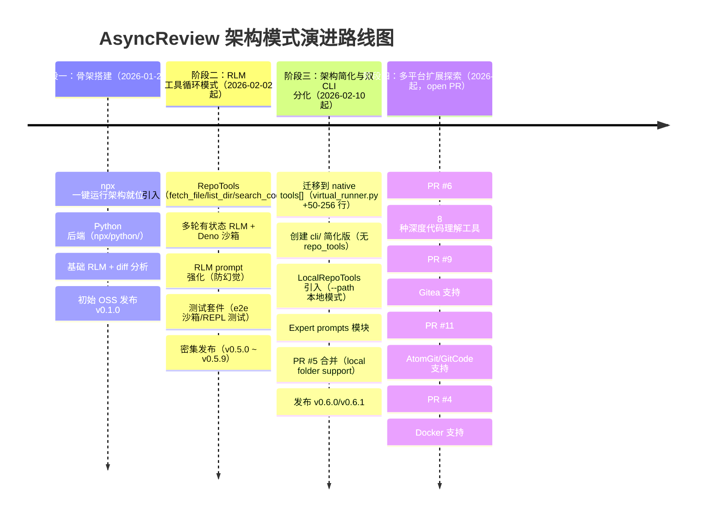
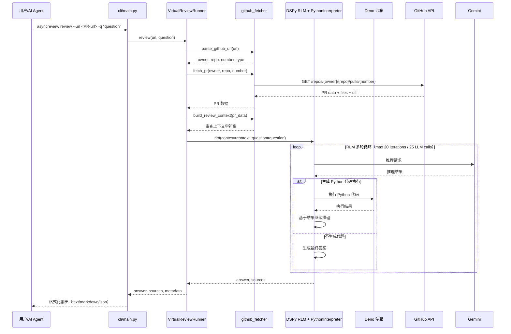

<!-- 目录 -->
- [概述](#概述)
  - [本质与表现形式](#本质与表现形式)
- [关键术语](#关键术语)
- [实体分类](#实体分类)
- [图表清单](#图表清单)
- [演进路线图](#演进路线图)
- [阶段分析](#阶段分析)
  - [阶段一：骨架搭建（基线模式）](#阶段一骨架搭建基线模式)
  - [阶段二：RLM 工具循环模式](#阶段二rlm-工具循环模式)
  - [阶段三：架构简化与双 CLI 分化](#阶段三架构简化与双-cli-分化)
  - [阶段四：多平台扩展探索](#阶段四多平台扩展探索)
- [当前架构组件图](#当前架构组件图)
- [RLM 审查流程](#rlm-审查流程)
- [阶段能力对比](#阶段能力对比)
- [设计取舍](#设计取舍)
- [能力归属表](#能力归属表)
- [边界与前提](#边界与前提)
- [结论](#结论)
- [待确认问题](#待确认问题)
- [参考资料](#参考资料)

## 概述

AsyncReview（AsyncFuncAI/AsyncReview）是一个开源的 Agentic 代码审查系统，基于 DSPy RLM（Recursive Language Models）框架，通过 Python REPL 沙箱实现"推理 → 生成代码 → 沙箱执行 → 观察结果 → 递归迭代"的多轮代码审查流程。

与传统一次性 diff 分析工具不同，AsyncReview 使 LLM 能像开发者一样主动探索代码仓库、执行验证脚本、获取全仓库上下文，从而提供更深入的代码审查。项目采用独特的双分发架构：通过 npx 一键运行（TypeScript 层 + 捆绑 Python 后端）和 Python 包安装（`pip install cr`）两种途径触达用户。

### 本质与表现形式

| 维度 | 说明 |
|------|------|
| 它是什么 | 基于 DSPy RLM + Python REPL 沙箱的 Agentic 代码审查系统，通过多轮"推理-执行-观察"循环获取全仓库上下文 |
| 表现形式 | GitHub 开源项目（Python + TypeScript），含 `cr/` 核心模块、`cli/` 简化版 CLI、`npx/python/` 完整版 CLI、`skills/` Skill 集成规范 |
| 类比理解 | 类似传统 LLM code review 工具（一次性 diff → LLM → 输出），但引入了 RLM 递归循环 + 可执行 Python REPL 沙箱，使 LLM 能"探索仓库、执行代码、验证假设" |
| 在模型中的位置 | 属于 AI Code Review 领域的 primitive 机制：核心是 RLM + Python REPL 工具循环架构 |

## 关键术语

| 术语 | 定义 | 在本题中的作用 |
|------|------|---------------|
| RLM（Recursive Language Models） | DSPy 框架中的递归语言模型执行模式，支持多轮有状态推理循环，每轮可调用工具/执行代码并观察结果 [[L2] diff_rlm.py 源码](https://raw.githubusercontent.com/AsyncFuncAI/AsyncReview/main/cr/diff_rlm.py) | AsyncReview 的核心执行引擎，是理解其"Agentic"能力的关键 |
| DSPy | 斯坦福大学开发的深度学习编程框架，提供声明式 LLM 编程范式，包含 RLM 模块和 `PythonInterpreter` [[L2] pyproject.toml 确认 `dspy>=3.1.2`](https://raw.githubusercontent.com/AsyncFuncAI/AsyncReview/main/pyproject.toml) | AsyncReview 选择的技术框架，架构变迁的核心依赖 |
| PythonInterpreter | DSPy 的 Python 解释器组件，在沙箱环境中执行 RLM 生成的 Python 代码，当前通过 Deno 运行时提供隔离 [[L2] rlm_runner.py 源码](https://raw.githubusercontent.com/AsyncFuncAI/AsyncReview/main/cr/rlm_runner.py) | 替代了阶段二的自定义工具拦截器，是阶段三架构简化的核心 |
| Python REPL 沙箱 | RLM 生成的 Python 代码在受限环境中执行，可调用预注册的函数（如 `fetch_file()`）或通过 HTTP 请求获取数据 [[L2] README + virtual_runner.py](https://raw.githubusercontent.com/AsyncFuncAI/AsyncReview/main/README.md) | AsyncReview 的安全执行模型，理解其能力边界的关键词 |
| `tools[]` | DSPy RLM 的原生工具参数，允许将 Python 函数注册为 RLM 可调用的工具 [[L2] commit `f439651` "Migrate RLM to use native tools[]"](https://api.github.com/repos/AsyncFuncAI/AsyncReview/commits?per_page=30) | 架构从自定义工具调度迁移到框架原生能力的核心标识 |
| Agentic Code Review | 代码审查不再是静态分析，而是 LLM 主动探索代码仓库、执行代码、验证假设的代理式行为 [[L2] README](https://raw.githubusercontent.com/AsyncFuncAI/AsyncReview/main/README.md) | AsyncReview 的核心定位，也是与传统 diff 分析工具的本质区别 |
| SKILL.md | 遵循 vercel/skills 规范的接口描述文件，定义 AsyncReview 如何被其他 AI agent 调用 [[L2] SKILL.md 全文](https://raw.githubusercontent.com/AsyncFuncAI/AsyncReview/main/skills/asyncreview/SKILL.md) | 项目"被调用"而非"独立工具"定位的核心证据 |
| npx CLI 桥接 | 通过 TypeScript 层（`npx/`）管理 Python 运行时并桥接用户命令，实现 `npx asyncreview review` 一键运行 [[L2] npx/package.json + README](https://api.github.com/repos/AsyncFuncAI/AsyncReview) | 降低用户使用门槛的关键架构决策 |
| VirtualReviewRunner | 在无本地仓库的情况下，通过 GitHub API 构建"虚拟"代码库上下文并运行 RLM 审查 [[L2] cli/virtual_runner.py](https://raw.githubusercontent.com/AsyncFuncAI/AsyncReview/main/cli/virtual_runner.py) | 当前默认 CLI 的核心执行类 |
| RepoTools / LocalRepoTools | 分别提供 GitHub API 工具（fetch_file/list_dir/search_code）和本地文件系统工具的函数集合 [[L3] virtual_runner.py 导入推断](https://raw.githubusercontent.com/AsyncFuncAI/AsyncReview/main/npx/python/cli/virtual_runner.py) | 完整版 CLI 的工具函数层，简化版 CLI 中不存在 |

## 实体分类

在展开阶段分析之前，首先明确系统中各关键实体的分类，避免后续分析中混用不同层级的概念。

| 实体 | 类型 | 控制方 | 是否跨信任边界 | 主要职责 |
|------|------|--------|----------------|----------|
| VirtualReviewRunner | component | AsyncReview | 否 | GitHub PR/Issue 审查的主要执行类，构建虚拟代码库上下文 [[L2] cli/virtual_runner.py](https://raw.githubusercontent.com/AsyncFuncAI/AsyncReview/main/cli/virtual_runner.py) |
| DiffQARLM | component | AsyncReview | 否 | Diff-based Q&A 的 RLM 引擎，支持用户针对特定代码行提问 [[L2] cr/diff_rlm.py](https://raw.githubusercontent.com/AsyncFuncAI/AsyncReview/main/cr/diff_rlm.py) |
| CodebaseReviewRLM | component | AsyncReview | 否 | 本地代码库审查的 RLM 引擎，基于代码快照 [[L2] cr/rlm_runner.py](https://raw.githubusercontent.com/AsyncFuncAI/AsyncReview/main/cr/rlm_runner.py) |
| RepoTools | component | AsyncReview | 否 | GitHub API 工具函数集合（fetch_file/list_dir/search_code）[[L3] virtual_runner.py 导入推断](https://raw.githubusercontent.com/AsyncFuncAI/AsyncReview/main/npx/python/cli/virtual_runner.py) |
| LocalRepoTools | component | AsyncReview | 否 | 本地文件系统工具函数集合 [[L3] virtual_runner.py 导入推断](https://raw.githubusercontent.com/AsyncFuncAI/AsyncReview/main/npx/python/cli/virtual_runner.py) |
| PythonInterpreter | external system | DSPy 项目 | 是（外部依赖） | DSPy 框架提供的 Python 沙箱执行器 |
| DSPy RLM 框架 | external system | DSPy 项目（Stanford NLP） | 是（外部依赖） | 提供 RLM 执行引擎 [[L2] pyproject.toml `dspy>=3.1.2`](https://raw.githubusercontent.com/AsyncFuncAI/AsyncReview/main/pyproject.toml) |
| GitHub API | external system | GitHub | 是（跨信任边界） | PR/Issue 数据获取、文件内容获取、代码搜索 |
| Gemini LLM | external system | Google | 是（外部依赖） | 提供 RLM 的语言模型推理能力 [[L2] config.py `MAIN_MODEL=gemini/gemini-3-pro-preview`](https://raw.githubusercontent.com/AsyncFuncAI/AsyncReview/main/cr/config.py) |
| Deno 运行时 | external system | Deno Land | 是（外部依赖） | 提供 Python REPL 的沙箱隔离环境 [[L2] rlm_runner.py `build_deno_command()`](https://raw.githubusercontent.com/AsyncFuncAI/AsyncReview/main/cr/rlm_runner.py) |
| AI Agent（Claude/Cursor 等） | role | 第三方 | 是（通过 SKILL.md 调用） | 作为调用方，将 AsyncReview 作为 Skill 使用 [[L2] SKILL.md](https://raw.githubusercontent.com/AsyncFuncAI/AsyncReview/main/skills/asyncreview/SKILL.md) |
| 用户（开发者） | role | 终端用户 | 是 | 通过 CLI 或 AI Agent 发起代码审查请求 |

## 图表清单

| 图名 | 要回答的问题 | 是否必须 | 采用格式 | 为什么需要/可省略 |
|------|--------------|----------|----------|------------------|
| 演进路线图 | 四个阶段的时间线和核心变化 | 必须 | Mermaid timeline | 演进类 artifact 强制要求，展示架构模式跃迁 |
| 当前架构组件图 | AsyncReview 当前由哪些核心组件构成、如何分层 | 必须 | PlantUML 组件图 | 展示简化版 CLI 和完整版 CLI 的双分发架构 |
| RLM 审查流程 | 一次完整的 PR 审查流程中各组件如何交互 | 必须 | Mermaid 时序图 | 展示 RLM 循环、工具调用、外部系统交互 |
| 角色与信任边界图 | 系统中有哪些角色、谁和谁跨边界通信 | 可省略 | - | 本研究聚焦演进分析，信任边界在实体分类表中已明确，非核心分析点 |

## 演进路线图

AsyncReview 的架构演进按"架构模式变化"划分为四个阶段，展示了从骨架搭建到 RLM 工具循环、再到架构简化与双 CLI 分化、最终探索多平台扩展的跃迁路径。



## 阶段分析

### 阶段一：骨架搭建（基线模式）

**核心特征**：项目于 2026-01-24 创建并完成初始 OSS 发布（v0.1.0）。此阶段的核心任务是构建"能用"的最小可行产品：通过 npx 一键运行降低使用门槛，在 Python 后端实现基础的 RLM diff 分析能力。此时 RLM 的执行模式本质上是对 PR diff 进行一次性或有限轮次的分析，尚未引入主动探索仓库的工具函数。

项目从一开始就采用了独特的 npx 分发架构：TypeScript 层（`npx/`）负责用户入口和 Python 运行时管理，Python 后端（`npx/python/`）包含核心 RLM 引擎和 GitHub API 集成。这种"前端轻量 + 后端完整"的双层架构说明团队在起点就考虑了零安装体验和后端可扩展性。

**架构模式**：npx 桥接 + 单次/有限轮次 RLM diff 分析

**新增能力**（基于 v0.1.0 CHANGELOG [[L2] CHANGELOG.md](https://raw.githubusercontent.com/AsyncFuncAI/AsyncReview/main/CHANGELOG.md)）：
- GitHub PR 加载和 diff 查看
- Gemini RLM 自动 bug 检测
- 关于代码变更的交互式 Q&A
- 带实时流式输出的 Web UI
- CLI 终端审查

**未抛弃任何能力**：此为初始阶段

### 阶段二：RLM 工具循环模式

**核心特征**：这是 AsyncReview 的第一次也是最重要的架构跃迁——从"看 diff 的分析工具"变为"能执行 Python 代码探索仓库的 Agentic 审查系统"。核心变化是引入了 RepoTools（`fetch_file`/`list_dir`/`search_code`）和 Python REPL 沙箱，使 RLM 不再受限于 diff 提供的上下文，而是能主动获取整个仓库的文件、目录和代码片段，并在安全沙箱中执行验证代码。

提交 `2ba4d6a`（2026-02-02）"Enhance RLM agent with multi-turn state for repo tools" 标志着这一跃迁 [[L2] commit message](https://api.github.com/repos/AsyncFuncAI/AsyncReview/commits?per_page=30)。随后一天内密集发布 v0.5.0 ~ v0.5.9，反映了 Python 运行时环境的密集调试：Deno 支持、dspy 版本兼容（2.x → 3.1.2）、Python 版本锁定（3.11）、CI/CD 适配。提交 `ece58e2`（2026-02-03）"strengthen RLM prompt to prevent hallucinated commands" 进一步说明 RLM 在执行 Python 代码时存在"幻觉命令"问题，需要 prompt 层面强化 [[L2] commit messages](https://api.github.com/repos/AsyncFuncAI/AsyncReview/commits?per_page=30)。

此阶段还引入了完整的 e2e 测试套件，包括 Deno 沙箱测试、Python REPL 测试和 virtual_runner 测试 [[L2] commit `2ba4d6a` diff 新增 7 个测试文件](https://api.github.com/repos/AsyncFuncAI/AsyncReview/commits?per_page=30)。

**架构模式**：RLM + Python REPL 工具循环（think → generate Python code → execute in sandbox → observe → repeat）

**从阶段一新增**：
- RepoTools 工具集：FETCH_FILE（按路径获取文件）、LIST_DIR（列出目录）、SEARCH_CODE（代码搜索）[[L3] virtual_runner.py 导入推断](https://raw.githubusercontent.com/AsyncFuncAI/AsyncReview/main/npx/python/cli/virtual_runner.py)
- Python REPL 沙箱：通过 Deno 运行时提供隔离的 Python 执行环境 [[L2] README + rlm_runner.py build_deno_command()](https://raw.githubusercontent.com/AsyncFuncAI/AsyncReview/main/cr/rlm_runner.py)
- 多轮有状态 RLM：RLM 支持多轮推理，每轮可调用工具并观察结果 [[L2] commit `2ba4d6a` + config.py MAX_ITERATIONS=20, MAX_LLM_CALLS=25](https://raw.githubusercontent.com/AsyncFuncAI/AsyncReview/main/cr/config.py)
- RLM prompt 强化：防止 RLM 生成非预期的 shell 命令 [[L2] commit `ece58e2`](https://api.github.com/repos/AsyncFuncAI/AsyncReview/commits?per_page=30)
- SKILL.md 集成：使 AsyncReview 可被 Claude、Cursor、OpenCode、Gemini、Codex 等 AI agent 作为 Skill 调用 [[L2] SKILL.md 全文 + README](https://raw.githubusercontent.com/AsyncFuncAI/AsyncReview/main/skills/asyncreview/SKILL.md)
- 完整测试套件：e2e 沙箱测试、REPL 测试、virtual_runner 测试 [[L2] commit `2ba4d6a` diff](https://api.github.com/repos/AsyncFuncAI/AsyncReview/commits?per_page=30)

**从阶段一抛弃**：
- 无能力被完全抛弃，但 RLM 的执行模式从"有限轮次"升级为"完整的工具循环"

**技术思考**：此阶段的架构核心是"Python REPL 沙箱 + 预注册工具函数"。RLM 生成的 Python 代码在 Deno 沙箱中执行，代码中可以调用预注册的函数（如 `fetch_file()`）来获取 GitHub API 数据。这种设计比传统的"工具拦截器模式"更灵活——LLM 可以编写任意 Python 逻辑组合工具调用，而非仅限于预定义的工具调用格式。但这也带来了安全挑战：RLM 可能生成"幻觉命令"，需要通过 prompt 强化来约束。

### 阶段三：架构简化与双 CLI 分化

**核心特征**：这是 AsyncReview 的第二次重大架构跃迁，包含三个互相独立但时间上重叠的变化：（1）迁移到 DSPy 原生 `tools[]` 模式并大幅简化代码；（2）引入本地文件系统支持（`--path` 模式）；（3）分化为简化版 `cli/` 和完整版 `npx/python/cli/` 两条 CLI 路径。

提交 `f439651`（2026-02-10）"Task 6: Migrate RLM to use native tools[] and simplify review flow" 是核心标志，对 `virtual_runner.py` 执行了 +50/-256 行的净删除 [[L2] commit diff](https://api.github.com/repos/AsyncFuncAI/AsyncReview/commits?per_page=30)。这代表从更复杂的自定义工具调度逻辑迁移到更简洁的 DSPy 原生 `tools[]` 模式。

与此同时，2026-02-10 的一天内完成了 7 个提交（Task 2-6 + 2 fixes），涵盖了 LocalRepoTools 创建、本地模式 CLI 更新、sync tool wrapper 函数创建、shell 注入漏洞修复、以及 RLM native tools[] 迁移 [[L2] commit history](https://api.github.com/repos/AsyncFuncAI/AsyncReview/commits?per_page=30)。

最关键的分化是：完整版 `npx/python/cli/virtual_runner.py`（12085 bytes）保留了 RepoTools、LocalRepoTools、expert prompts 等完整功能；而新版 `cli/virtual_runner.py`（5106 bytes）则大幅简化，移除了所有 repo_tools 依赖，变为纯 RLM + GitHub 上下文模式 [[L2] 两文件源码对比](https://raw.githubusercontent.com/AsyncFuncAI/AsyncReview/main/cli/virtual_runner.py)。

**架构模式**：双 CLI 分化——简化版 `cli/`（纯 RLM + GitHub 上下文）和完整版 `npx/python/cli/`（RLM + native tools[] + repo_tools + local_repo_tools）

**从阶段二新增**：
- DSPy 原生 `tools[]` 模式：工具函数通过 `_create_tool_functions()` 返回 `dict[str, Callable]` [[L2] commit `f439651` + npx/python/cli/virtual_runner.py 源码](https://raw.githubusercontent.com/AsyncFuncAI/AsyncReview/main/npx/python/cli/virtual_runner.py)
- LocalRepoTools：本地文件系统访问工具 [[L3] virtual_runner.py 导入推断](https://raw.githubusercontent.com/AsyncFuncAI/AsyncReview/main/npx/python/cli/virtual_runner.py)
- `--path` CLI 选项：支持本地目录审查 [[L2] commit `0893cff` + cli/main.py 无 --path 选项](https://raw.githubusercontent.com/AsyncFuncAI/AsyncReview/main/cli/main.py)
- Expert prompts 模块：SOLID/安全/代码质量综合审查 [[L2] npx/python/cli/expert_prompts.py 4072 bytes](https://raw.githubusercontent.com/AsyncFuncAI/AsyncReview/main/npx/python/cli/expert_prompts.py)
- shell 注入漏洞修复：`LocalRepoTools.search_code()` 从 `shell=True` 改为列表式 subprocess [[L2] commit `980b497`](https://api.github.com/repos/AsyncFuncAI/AsyncReview/commits?per_page=30)

**从阶段二抛弃**：
- 自定义/复杂的工具调度逻辑（virtual_runner.py 净删除 206 行）[[L2] commit `f439651`](https://api.github.com/repos/AsyncFuncAI/AsyncReview/commits?per_page=30)
- 重复的 step 输出（post-hoc trajectory replay 去重）[[L2] commit `3579712`](https://api.github.com/repos/AsyncFuncAI/AsyncReview/commits?per_page=30)

**技术思考**：双 CLI 分化是本阶段最值得注意的架构决策。简化版 `cli/` 通过 `pip install cr` 安装，依赖 `cr/` 核心模块，适用于已有 Python 环境的用户。完整版 `npx/python/cli/` 通过 `npx asyncreview` 一键运行，自带 Python 运行时捆绑，适用于零安装场景。简化版故意去掉了 repo_tools 能力，可能是因为：（1）大多数 PR 审查场景下，GitHub API 提供的 diff 上下文已足够；（2）减少依赖复杂度；（3）将高级能力留给完整版/SDK 用户。

### 阶段四：多平台扩展探索

**核心特征**：此阶段代表了 AsyncReview 在核心 RLM 架构稳定后的横向扩展方向——从"只支持 GitHub"扩展到"多 Git 平台支持"，从"基础工具集"扩展到"深度代码理解工具"。所有关键 PR 均为 open 状态，表明项目进入了功能探索与维护节奏放缓的阶段。

自 PR #5 合并（2026-03-09）以来，仓库无新推送 [[L2] GitHub API pushed_at: 2026-03-09](https://api.github.com/repos/AsyncFuncAI/AsyncReview)，但 4 个 open PR 代表了明确的演进方向。

**架构模式**：横向扩展（更多工具类型、更多 Git 平台），核心 RLM 循环架构不变

**从阶段三新增（open PR，尚未合并）**：
- 深度代码理解工具（PR #6，open since 2026-02-10）：新增 8 种代码理解和 GitHub 上下文工具 [[L2] PR #6 title](https://api.github.com/repos/AsyncFuncAI/AsyncReview/pulls?state=all&per_page=20)
- Gitea 支持（PR #9，open since 2026-02-16）：多 forge URL 解析基础设施 [[L2] PR #9 title](https://api.github.com/repos/AsyncFuncAI/AsyncReview/pulls?state=all&per_page=20)
- AtomGit/GitCode 支持（PR #11，open since 2026-03-18）：进一步扩展 Git 平台覆盖 [[L2] PR #11 title](https://api.github.com/repos/AsyncFuncAI/AsyncReview/pulls?state=all&per_page=20)
- Docker 支持（PR #4，open since 2026-02-05）：容器化部署 [[L2] PR #4 title](https://api.github.com/repos/AsyncFuncAI/AsyncReview/pulls?state=all&per_page=20)

**从阶段三抛弃**：无

**技术思考**：open PR 的方向揭示了两个潜在演进路径。一是"深度代码理解"方向——在 repo_tools 的三种基础工具之上，增加更细粒度的代码分析能力。二是"多平台"方向——摆脱 GitHub 平台绑定，兼容 Gitea、AtomGit、GitCode 等自建或国产 Git 平台。但由于所有 PR 均为 open 状态且自 2026-03-09 以来无新推送，此阶段的能力是否落地尚不确定。

## 当前架构组件图

AsyncReview 当前采用双分发架构：简化版 CLI（`cli/`，通过 `pip install cr` 安装）和完整版 CLI（`npx/python/cli/`，通过 `npx asyncreview` 一键运行）。以下为完整版的组件分层，简化版是此图的子集（不含 RepoTools/LocalRepoTools/Expert Prompts）。

```plantuml
@startuml
package "用户 / AI Agent 层" {
  [npx CLI\n(用户入口)] as npx
  [Claude / Cursor 等\nAI Agent] as agent
  [终端用户] as user
}

package "AsyncReview 核心层" {
  package "npx/ TypeScript 层" {
    [package.json\nCLI 定义] as npx_pkg
    [src/\nTypeScript 入口] as npx_src
  }

  package "Python 后端" {
    package "cli/ 简化版" {
      [main.py\nCLI 入口] as cli_main
      [virtual_runner.py\nVirtualReviewRunner\n(无 repo_tools)] as cli_runner
      [github_fetcher.py\nGitHub API 获取] as cli_fetcher
    }

    package "npx/python/cli/ 完整版" {
      [main.py\nCLI 入口\n(支持 --expert)] as full_main
      [virtual_runner.py\nVirtualReviewRunner\n(native tools[])] as full_runner
      [github_fetcher.py\nGitHub API 获取] as full_fetcher
      [repo_tools.py\nGitHub 工具函数\nfetch_file/list_dir/search] as repo_tools
      [local_repo_tools.py\n本地文件工具] as local_tools
      [local_fetcher.py\n本地目录上下文] as local_fetcher
      [expert_prompts.py\nSOLID/安全/质量] as expert
    }

    package "cr/ 核心模块" {
      [diff_rlm.py\nDiffQARLM\n(diff-based Q&A)] as diff_rlm
      [rlm_runner.py\nCodebaseReviewRLM\n(本地代码库审查)] as rlm_runner
      [snapshot.py\n代码库快照构建] as snapshot
      [config.py\n配置与常量] as config
      [server.py\nAPI 服务器] as server
    }
  }

  package "skills/ 集成规范" {
    [SKILL.md\nvercel/skills 兼容] as skill
  }
}

package "外部依赖层" {
  [DSPy RLM 框架\n(RLM + PythonInterpreter)] as dspy
  [Gemini LLM\n(语言模型推理)] as gemini
  [Deno 运行时\n(Python REPL 沙箱)] as deno
  [GitHub API\n(PR/diff/搜索)] as github
}

user --> npx
agent --> skill
npx --> npx_pkg
npx_pkg --> npx_src
npx_src --> full_runner

cli_main --> cli_runner
cli_runner --> cli_fetcher
cli_runner --> diff_rlm
cli_runner --> rlm_runner

full_main --> full_runner
full_runner --> full_fetcher
full_runner --> repo_tools
full_runner --> local_tools
full_runner --> expert

full_runner --> diff_rlm
full_runner --> rlm_runner

repo_tools --> github
diff_rlm --> dspy
diff_rlm --> gemini
diff_rlm --> deno
rlm_runner --> dspy
rlm_runner --> deno

cli_fetcher --> github
full_fetcher --> github
skill -[hidden]-> npx

@enduml
```

## RLM 审查流程

为理解 AsyncReview 的核心机制，下图展示了一次完整的 PR 审查流程（简化版 CLI 路径）。此流程回答了 RLM 循环是如何在 Python REPL 沙箱模式下运转的，以及工具调用如何与外部系统交互。



**流程步骤说明**：
- 用户通过 CLI 或 AI Agent 发起审查请求，CLI 层解析 URL 并提取 owner/repo/number [[L2] cli/main.py](https://raw.githubusercontent.com/AsyncFuncAI/AsyncReview/main/cli/main.py)
- github_fetcher 通过 GitHub API 获取 PR 数据（包括 files 列表和 diff patches），构建审查上下文字符串 [[L2] cli/github_fetcher.py](https://raw.githubusercontent.com/AsyncFuncAI/AsyncReview/main/cli/github_fetcher.py)
- RLM 引擎（DSPy RLM + PythonInterpreter）接收上下文字符串和问题，启动多轮推理循环 [[L2] cli/virtual_runner.py _run_rlm()](https://raw.githubusercontent.com/AsyncFuncAI/AsyncReview/main/cli/virtual_runner.py)
- 循环体：RLM 可能生成 Python 代码在 Deno 沙箱中执行，也可能直接推理。每次迭代可调用 Gemini 进行推理 [[L2] config.py MAX_ITERATIONS=20, MAX_LLM_CALLS=25](https://raw.githubusercontent.com/AsyncFuncAI/AsyncReview/main/cr/config.py)
- 当 RLM 判断上下文已充分，输出最终答案和来源列表

## 阶段能力对比

下表以结构化方式展示四个阶段之间的能力变化，补充演进路线图中不易表达的细节。

| 阶段 | 架构模式 | 新增能力 | 抛弃或降级能力 | 核心标志 |
|------|----------|----------|---------------|----------|
| 一：骨架搭建 | npx 桥接 + 有限轮次 RLM | npx 一键运行、Python 后端骨架、RLM diff 分析、Web UI、CLI [[L2] CHANGELOG.md v0.1.0](https://raw.githubusercontent.com/AsyncFuncAI/AsyncReview/main/CHANGELOG.md) | 无 | 初始 OSS 发布，RLM 引擎可用 |
| 二：RLM 工具循环 | Python REPL 工具循环 | RepoTools 三工具、Deno 沙箱运行时、多轮有状态 RLM、prompt 强化、SKILL.md、完整测试套件 [[L2] commits `2ba4d6a`/`ece58e2`](https://api.github.com/repos/AsyncFuncAI/AsyncReview/commits?per_page=30) | 有限轮次升级为完整工具循环 | RLM 获得"生成代码 → 沙箱执行 → 观察结果"的闭环能力 |
| 三：架构简化与双 CLI | 双 CLI 分化 | native tools[]（virtual_runner.py -256 行）、LocalRepoTools、--path 选项、expert prompts [[L2] commit `f439651` + npx/python/cli/ 源码](https://api.github.com/repos/AsyncFuncAI/AsyncReview/commits?per_page=30) | 复杂工具调度逻辑简化、重复 step 输出去重 | 从"复杂自定义"简化为"框架原生调用"，分化为简化版/完整版 CLI |
| 四：多平台扩展 | 横向扩展（核心不变） | 深度代码理解工具（open）、Gitea/AtomGit/GitCode 支持（open）、Docker 支持（open）[[L2] PR #4/#6/#9/#11](https://api.github.com/repos/AsyncFuncAI/AsyncReview/pulls?state=all&per_page=20) | 无（所有 PR 尚未合并） | 从"GitHub only"向"多平台 + 深度理解"探索 |

## 设计取舍

| 设计决策 | 选择方案 | 未选方案 | 取舍原因 | 证据来源 |
|----------|----------|----------|----------|----------|
| RLM 工具调度实现 | 阶段二：Python REPL 预注册函数 → 阶段三：迁移到 DSPy 原生 `tools[]` | 从一开始就等待 DSPy 原生支持 | 阶段二时 DSPy tools[] 能力不成熟，团队选择快速实现；阶段三时框架能力成熟，主动简化 [[L2] commit `f439651` -256 行](https://api.github.com/repos/AsyncFuncAI/AsyncReview/commits?per_page=30) | commit diff |
| Deno 作为沙箱运行时 | Deno 提供隔离的 Python REPL 执行环境 | 直接 subprocess 或 Docker 容器 | Deno 提供细粒度的权限控制（`--allow-read` 指定路径），比 subprocess 更安全，比 Docker 更轻量 [[L2] rlm_runner.py build_deno_command()](https://raw.githubusercontent.com/AsyncFuncAI/AsyncReview/main/cr/rlm_runner.py) | rlm_runner.py 源码 |
| 默认仅支持 Gemini | 使用 Gemini 3 Pro/Flash | 支持 OpenAI、Anthropic 等多后端 | DSPy RLM 与 Gemini 集成最成熟，config.py 中 MAIN_MODEL/SUB_MODEL 均硬编码为 gemini/ 前缀 [[L2] config.py](https://raw.githubusercontent.com/AsyncFuncAI/AsyncReview/main/cr/config.py) | config.py 源码 |
| 双 CLI 架构 | 简化版 `cli/` + 完整版 `npx/python/cli/` | 单一 CLI | 简化版通过 pip 安装适合已有 Python 环境的用户，完整版通过 npx 一键运行适合零安装场景 [[L2] pyproject.toml 两个 entry points + npx/package.json](https://raw.githubusercontent.com/AsyncFuncAI/AsyncReview/main/pyproject.toml) | pyproject.toml |
| 简化版去掉 repo_tools | `cli/virtual_runner.py` 不含 RepoTools/LocalRepoTools | 两个 CLI 功能一致 | 大多数 PR 审查场景下 GitHub API 提供的 diff 上下文已足够；减少依赖复杂度 [[L2] cli/virtual_runner.py 5106 bytes vs npx/python/cli/virtual_runner.py 12085 bytes](https://raw.githubusercontent.com/AsyncFuncAI/AsyncReview/main/cli/virtual_runner.py) | 两文件源码对比 |
| Python REPL 而非传统 tools[] | RLM 生成任意 Python 代码在沙箱中执行 | 仅使用 DSPy 命名工具函数 | Python REPL 更灵活——LLM 可编写任意逻辑组合工具调用，不限于预定义调用格式 [[L2] README 架构图](https://raw.githubusercontent.com/AsyncFuncAI/AsyncReview/main/README.md) | README + 源码 |

## 能力归属表

| 能力 | 归属方 | 说明 |
|------|--------|------|
| RLM 递归推理 | DSPy 框架（external） | 由 DSPy 的 RLM 模块提供，非 AsyncReview 自研 [[L2] pyproject.toml `dspy>=3.1.2`](https://raw.githubusercontent.com/AsyncFuncAI/AsyncReview/main/pyproject.toml) |
| 语言模型推理 | Gemini / Google（external） | 由 Gemini 提供（gemini-3-pro-preview + gemini-3-flash-preview）[[L2] config.py](https://raw.githubusercontent.com/AsyncFuncAI/AsyncReview/main/cr/config.py) |
| Python REPL 沙箱执行 | DSPy PythonInterpreter + Deno（external） | DSPy 提供 PythonInterpreter，Deno 提供运行时隔离 [[L2] rlm_runner.py](https://raw.githubusercontent.com/AsyncFuncAI/AsyncReview/main/cr/rlm_runner.py) |
| 仓库探索工具（RepoTools） | AsyncReview（完整版原生） | AsyncReview 自研的 GitHub API 工具函数 [[L3] virtual_runner.py 导入推断](https://raw.githubusercontent.com/AsyncFuncAI/AsyncReview/main/npx/python/cli/virtual_runner.py) |
| 本地文件工具（LocalRepoTools） | AsyncReview（完整版原生） | AsyncReview 自研的本地文件系统工具 [[L3] virtual_runner.py 导入推断](https://raw.githubusercontent.com/AsyncFuncAI/AsyncReview/main/npx/python/cli/virtual_runner.py) |
| GitHub API 集成 | AsyncReview（原生） | github_fetcher.py 实现 PR/Issue/diff 的 API 调用 [[L2] cli/github_fetcher.py](https://raw.githubusercontent.com/AsyncFuncAI/AsyncReview/main/cli/github_fetcher.py) |
| Diff-based Q&A | AsyncReview（原生） | DiffQARLM 类，针对 diff 的用户问答 [[L2] cr/diff_rlm.py](https://raw.githubusercontent.com/AsyncFuncAI/AsyncReview/main/cr/diff_rlm.py) |
| 代码库快照构建 | AsyncReview（原生） | snapshot.py 实现本地代码库的快照和符号提取 [[L2] cr/snapshot.py](https://raw.githubusercontent.com/AsyncFuncAI/AsyncReview/main/cr/snapshot.py) |
| CLI 入口与运行时管理 | AsyncReview（原生） | npx/ TypeScript 层 + cli/ Python 层 [[L2] npx/package.json + cli/main.py](https://raw.githubusercontent.com/AsyncFuncAI/AsyncReview/main/cli/main.py) |
| Agent 调用接口 | AsyncReview（原生 SKILL.md） + vercel/skills 规范（external） | AsyncReview 提供 SKILL.md，遵循 vercel/skills 标准格式 [[L2] SKILL.md](https://raw.githubusercontent.com/AsyncFuncAI/AsyncReview/main/skills/asyncreview/SKILL.md) |
| Web UI | AsyncReview（原生） | server.py 提供 API 服务器，支持实时流式输出 [[L2] cr/server.py](https://raw.githubusercontent.com/AsyncFuncAI/AsyncReview/main/cr/server.py) |

## 边界与前提

**AsyncReview 能解决的**：
- 通过 RLM 多轮 Python REPL 循环获取全仓库上下文，提供比一次性 diff 分析更深入的代码审查 [[L2] README + diff_rlm.py](https://raw.githubusercontent.com/AsyncFuncAI/AsyncReview/main/README.md)
- 支持 GitHub PR 审查和 Issue 分析 [[L2] cli/main.py + github_fetcher.py](https://raw.githubusercontent.com/AsyncFuncAI/AsyncReview/main/cli/main.py)
- 完整版支持本地文件夹审查（`--path` 选项）[[L2] npx/python/cli/virtual_runner.py](https://raw.githubusercontent.com/AsyncFuncAI/AsyncReview/main/npx/python/cli/virtual_runner.py)
- 可被 AI agent（Claude、Cursor、OpenCode、Gemini、Codex）作为 Skill 调用 [[L2] SKILL.md](https://raw.githubusercontent.com/AsyncFuncAI/AsyncReview/main/skills/asyncreview/SKILL.md)
- 专家级代码审查覆盖 SOLID 原则、安全、代码质量 [[L2] expert_prompts.py](https://raw.githubusercontent.com/AsyncFuncAI/AsyncReview/main/npx/python/cli/expert_prompts.py)

**AsyncReview 不能解决的**：
- 不保证代码安全性：Deno 沙箱提供运行时隔离（`--allow-read` 限制读取路径），但不覆盖所有攻击面 [[L2] rlm_runner.py build_deno_command()](https://raw.githubusercontent.com/AsyncFuncAI/AsyncReview/main/cr/rlm_runner.py)
- 不覆盖其他 Git 平台：当前仅支持 GitHub PR/Issue。Gitea、AtomGit、GitCode 支持仍在 open PR 中 [[L2] PR #9/#11](https://api.github.com/repos/AsyncFuncAI/AsyncReview/pulls?state=all&per_page=20)
- 不替代人类判断：RLM 的推理结果仍可能存在幻觉，项目通过 prompt 强化来缓解但不消除 [[L2] commit `ece58e2`](https://api.github.com/repos/AsyncFuncAI/AsyncReview/commits?per_page=30)
- 简化版 CLI 不支持主动探索仓库：`cli/virtual_runner.py` 不含 RepoTools，RLM 只能处理已提供的上下文 [[L2] cli/virtual_runner.py 源码](https://raw.githubusercontent.com/AsyncFuncAI/AsyncReview/main/cli/virtual_runner.py)

**依赖的外部前提**：
- DSPy RLM 框架的可用性和持续维护：AsyncReview 的核心执行引擎依赖 DSPy [[L2] pyproject.toml `dspy>=3.1.2`](https://raw.githubusercontent.com/AsyncFuncAI/AsyncReview/main/pyproject.toml)
- Gemini LLM 后端的可用性：当前 RLM 推理依赖 Gemini（无多后端配置）[[L2] config.py](https://raw.githubusercontent.com/AsyncFuncAI/AsyncReview/main/cr/config.py)
- Deno 运行时的 Python 支持：沙箱执行依赖 Deno 的 Python 运行时能力 [[L2] rlm_runner.py](https://raw.githubusercontent.com/AsyncFuncAI/AsyncReview/main/cr/rlm_runner.py)

**不确定性**：
- 项目静止期原因：自 2026-03-09 以来无新推送，缺少维护者公开说明 [[L2] GitHub API pushed_at](https://api.github.com/repos/AsyncFuncAI/AsyncReview)
- open PR 的合并状态：PR #4/#6/#9/#11 当前均为 open 状态 [[L2] GitHub API PR list](https://api.github.com/repos/AsyncFuncAI/AsyncReview/pulls?state=all&per_page=20)
- `npx/python/cli/` 中的 `repo_tools.py` 和 `local_repo_tools.py` 模块在 `virtual_runner.py` 中有导入，但在 API 目录列表中不存在——可能已在 native tools[] 迁移中被内联或删除，完整版 CLI 功能通过其他方式实现 [[L3] 目录对比 + commit `f439651`](https://api.github.com/repos/AsyncFuncAI/AsyncReview/commits?per_page=30)

## 结论

1. **AsyncReview 的架构演进遵循"能力递增 → 架构简化 → 双分发"的三主线** [[L2] commit history + 源码对比](https://api.github.com/repos/AsyncFuncAI/AsyncReview/commits?per_page=30)。能力递增体现在：单次 diff 分析 → Python REPL 工具循环 → 本地模式 + expert prompts。架构简化体现在：virtual_runner.py 净删除 206 行代码，从复杂自定义逻辑迁移到 DSPy 原生 `tools[]`。双分体现在：简化版 `cli/`（pip 安装）和完整版 `npx/python/cli/`（npx 一键运行）并行存在，服务不同用户场景。

2. **阶段划分按架构模式变化应为四个阶段** [[L2] commit history + release notes](https://api.github.com/repos/AsyncFuncAI/AsyncReview/releases?per_page=10)。阶段一（骨架搭建）到阶段二（RLM 工具循环）的跃迁由 `2ba4d6a`（2026-02-02）标志；阶段二到阶段三（架构简化）由 `f439651`（2026-02-10）标志；阶段三到阶段四（多平台扩展）由 open PR #6/#9/#11 代表，但尚未合并。既有 artifact 的六阶段划分中，将骨架搭建和 CLI 实现分为两个阶段、将 repo_tools 和多轮 RLM 分为两个阶段——本研究表明这些属于同一架构模式的不同子步骤。

3. **AsyncReview 的核心定位是"Agentic 代码推理能力层"** [[L2] README + SKILL.md](https://raw.githubusercontent.com/AsyncFuncAI/AsyncReview/main/README.md)。从 SKILL.md 的早期集成和双分发架构可以看出，项目有意将自己定位为可被 AI agent 调用的能力组件，而非独立的终端工具。简化版故意去掉 repo_tools 能力，说明团队认为"纯 diff 上下文 + RLM 推理"已覆盖大部分用户需求。

4. **当前静止期的原因和影响无法确定**。open PR 指向深度代码理解和多平台扩展两个方向，但所有 PR 均为 open 状态且自 2026-03-09 以来无新推送。静止可能是等待 DSPy 框架进一步成熟、团队战略调整、或项目维护节奏自然放缓。

## 待确认问题

| 问题 | 状态 | 说明 |
|------|------|------|
| 为什么选择 DSPy 而非 LangChain/LlamaIndex | 未解决 | README 和 commit message 中无明确说明，需 PR 讨论或维护者访谈 |
| 为什么仅支持 Gemini | 已确认（基于源码） | config.py 中 MAIN_MODEL/SUB_MODEL 均硬编码为 gemini/ 前缀，无其他后端配置选项 [[L2] config.py 源码](https://raw.githubusercontent.com/AsyncFuncAI/AsyncReview/main/cr/config.py) |
| Deno 沙箱的具体安全边界 | 部分确认 | 已知 `--allow-read` 限制读取路径为 runner.js 和 Deno cache 目录 [[L2] rlm_runner.py build_deno_command()](https://raw.githubusercontent.com/AsyncFuncAI/AsyncReview/main/cr/rlm_runner.py)，但完整权限配置（网络访问、写入权限）需运行时验证 |
| SKILL.md 兼容的 agent 列表 | 已确认 | SKILL.md 明确列出：Claude, Cursor, OpenCode, Gemini, Codex [[L2] SKILL.md + README](https://raw.githubusercontent.com/AsyncFuncAI/AsyncReview/main/skills/asyncreview/SKILL.md) |
| 简化版与完整版的能力差异 | 已确认 | 简化版 `cli/virtual_runner.py`（5106 bytes）无 RepoTools/LocalRepoTools/Expert Prompts；完整版 `npx/python/cli/virtual_runner.py`（12085 bytes）包含全部功能 [[L2] 两文件源码对比](https://raw.githubusercontent.com/AsyncFuncAI/AsyncReview/main/cli/virtual_runner.py) |
| open PR 的当前状态 | 已确认（截至 2026-04-20） | PR #4/#6/#9/#11 均为 open 状态，未合并 [[L2] GitHub API PR list](https://api.github.com/repos/AsyncFuncAI/AsyncReview/pulls?state=all&per_page=20) |
| native tools[] 迁移的具体代码变化 | 部分确认 | 已知 `virtual_runner.py` +50/-256 行 [[L2] commit `f439651` diff](https://api.github.com/repos/AsyncFuncAI/AsyncReview/commits?per_page=30)，但完整 diff 内容需获取 patch 详情 |
| `npx/python/cli/` 中导入的 `repo_tools.py` 和 `local_repo_tools.py` 是否被实际使用 | 已确认（间接） | 这两个文件不在 API 目录列表中，可能在 native tools[] 迁移中被内联到 virtual_runner.py 或删除；功能通过 commit `f439651` 的 "Migrate RLM to use native tools[]" 实现 [[L3] commit history + 目录对比](https://api.github.com/repos/AsyncFuncAI/AsyncReview/commits?per_page=30) |

## 参考资料

| 链接 | 证据等级 | 验证状态 |
|------|----------|----------|
| [[github] AsyncFuncAI/AsyncReview 仓库元数据](https://api.github.com/repos/AsyncFuncAI/AsyncReview) | L2 | 已验证 |
| [[github-raw] README.md](https://raw.githubusercontent.com/AsyncFuncAI/AsyncReview/main/README.md) | L2 | 已验证 |
| [[github-raw] pyproject.toml](https://raw.githubusercontent.com/AsyncFuncAI/AsyncReview/main/pyproject.toml) | L2 | 已验证 |
| [[github-raw] cr/diff_rlm.py - RLM 审查引擎](https://raw.githubusercontent.com/AsyncFuncAI/AsyncReview/main/cr/diff_rlm.py) | L2 | 已验证 |
| [[github-raw] cr/rlm_runner.py - 本地代码库 RLM](https://raw.githubusercontent.com/AsyncFuncAI/AsyncReview/main/cr/rlm_runner.py) | L2 | 已验证 |
| [[github-raw] cr/config.py - 配置与常量](https://raw.githubusercontent.com/AsyncFuncAI/AsyncReview/main/cr/config.py) | L2 | 已验证 |
| [[github-raw] cr/snapshot.py - 代码库快照](https://raw.githubusercontent.com/AsyncFuncAI/AsyncReview/main/cr/snapshot.py) | L2 | 已验证 |
| [[github-raw] cli/main.py - CLI 入口](https://raw.githubusercontent.com/AsyncFuncAI/AsyncReview/main/cli/main.py) | L2 | 已验证 |
| [[github-raw] cli/virtual_runner.py - 简化版审查器](https://raw.githubusercontent.com/AsyncFuncAI/AsyncReview/main/cli/virtual_runner.py) | L2 | 已验证 |
| [[github-raw] npx/python/cli/virtual_runner.py - 完整版审查器](https://raw.githubusercontent.com/AsyncFuncAI/AsyncReview/main/npx/python/cli/virtual_runner.py) | L2 | 已验证 |
| [[github-raw] skills/asyncreview/SKILL.md](https://raw.githubusercontent.com/AsyncFuncAI/AsyncReview/main/skills/asyncreview/SKILL.md) | L2 | 已验证 |
| [[github-raw] CHANGELOG.md](https://raw.githubusercontent.com/AsyncFuncAI/AsyncReview/main/CHANGELOG.md) | L2 | 已验证 |
| [[github] Commit history (last 30)](https://api.github.com/repos/AsyncFuncAI/AsyncReview/commits?per_page=30) | L2 | 已验证 |
| [[github] Pull Requests 列表](https://api.github.com/repos/AsyncFuncAI/AsyncReview/pulls?state=all&per_page=20) | L2 | 已验证 |
| [[github] Releases 列表](https://api.github.com/repos/AsyncFuncAI/AsyncReview/releases?per_page=10) | L2 | 已验证 |
| [[github] gh-commits.md excerpt](openspec/changes/update-asyncreview-evolution-2026q2/sources/excerpts/gh-commits.md) | L2 | 已验证 |
