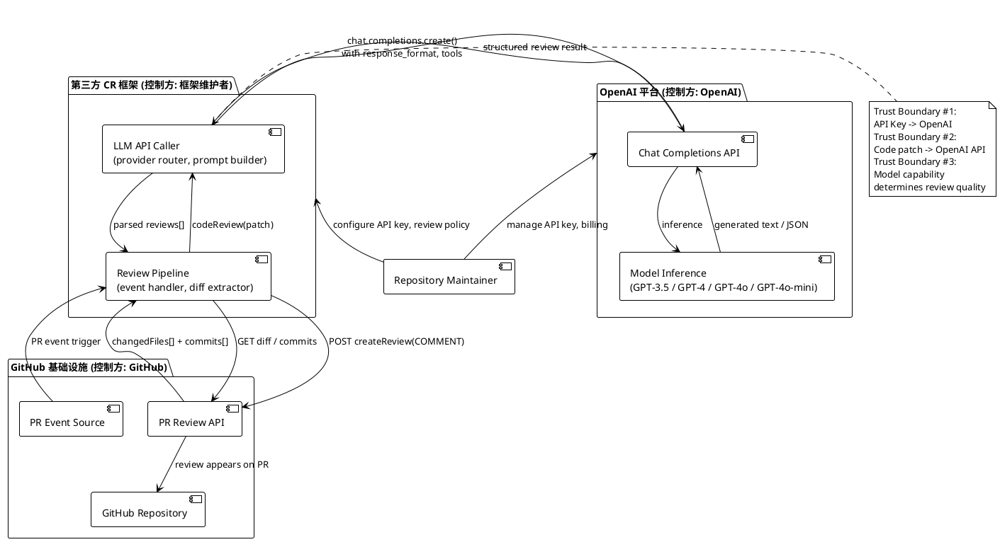
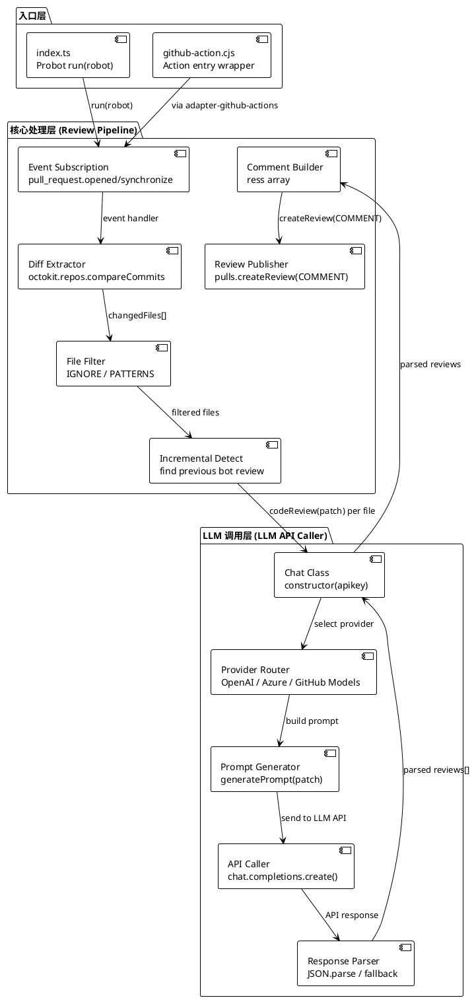
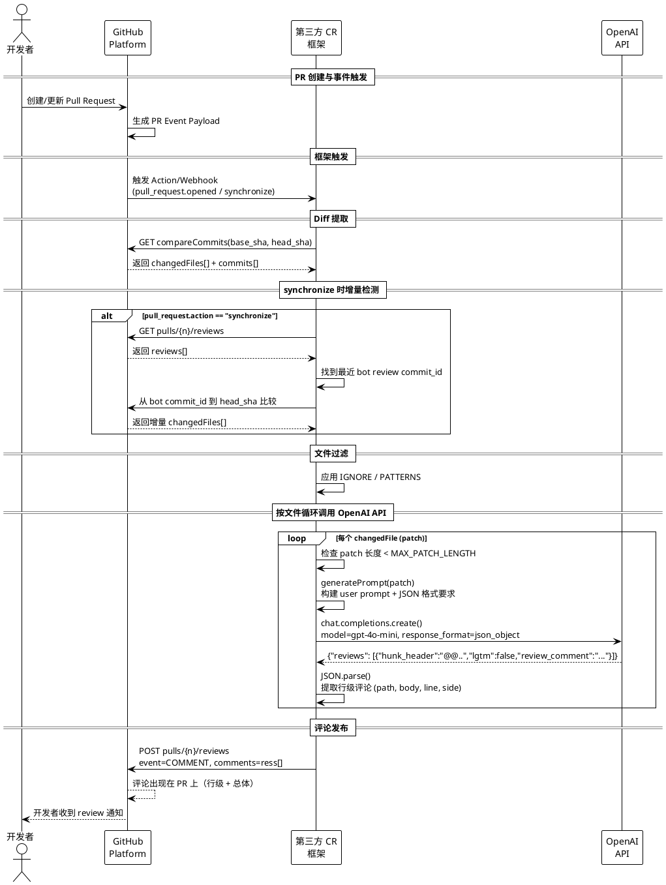
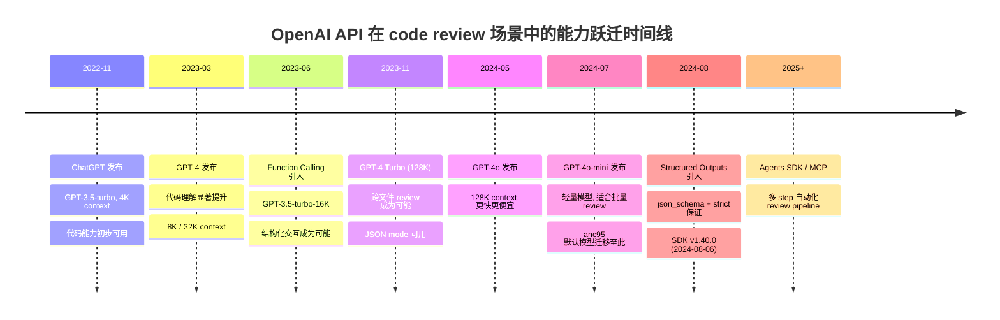

## 目录

- [概述](#概述)
  - [本质与表现形式](#本质与表现形式)
- [关键术语](#关键术语)
- [分析正文](#分析正文)
  - [实体分类表](#实体分类表)
  - [图表清单](#图表清单)
  - [角色与信任边界总览](#角色与信任边界总览)
  - [角色内部组件图](#角色内部组件图)
  - [跨角色核心流程图](#跨角色核心流程图)
  - [状态转换表](#状态转换表)
  - [历史演进](#历史演进)
- [设计取舍](#设计取舍)
- [边界与前提](#边界与前提)
  - [OpenAI API 原生能力](#openai-api-原生能力)
  - [第三方框架能力](#第三方框架能力)
  - [非目标：OpenAI 不提供的能力](#非目标openai-不提供的能力)
- [相关对象关系](#相关对象关系)
- [结论](#结论)
  - [已确认（L2 证据支撑）](#已确认l2-证据支撑)
  - [尚需验证](#尚需验证)
  - [基于推断](#基于推断)
- [参考资料](#参考资料)

---

## 概述

OpenAI 在 code review 场景中提供的是**底层模型能力层**，而非端到端的 code review 产品。OpenAI 从未将 "code review" 定义为一项独立功能——它始终是 Chat Completions API 的一项使用场景，通过 prompt 引导、结构化输出、上下文扩展等 API 能力的组合来实现。第三方框架（如 anc95/ChatGPT-CodeReview、CodeRabbit 等）在此能力层之上构建完整的 code review 工具链。

本研究按"架构模式变化"将 OpenAI API 在 code review 场景中的能力演进划分为三个阶段，所有核心主张均通过回源验证（anc95 最新源码、OpenAI Python SDK 源码、SDK CHANGELOG、OpenAI Blog excerpt）。

### 本质与表现形式

| 维度 | 说明 |
|------|------|
| 它是什么 | OpenAI API 在 code review 场景中的能力集合——通过 prompt 引导、结构化输出（response_format）、上下文扩展（context window）、工具调用（tools）等 API 参数的组合，使 LLM 能够对代码变更提供审查意见 |
| 表现形式 | API 规范层（Chat Completions API response_format / tools / max_completion_tokens 参数定义）+ 模型能力层（各模型的 context window、代码理解能力）+ 第三方参考实现（anc95/ChatGPT-CodeReview 等框架如何利用这些能力） |
| 类比理解 | 类似"提供代码理解的 raw compute"——OpenAI 不定义 review 规则、不维护 review 工作流，而是提供可被程序调用的代码分析与文本生成能力，由上层框架决定如何组织 review 流程 |
| 在模型中的位置 | LLM 能力供给层 → 第三方框架集成层 → GitHub/CI 工作流层。OpenAI 处于最底层，提供模型推理能力 |

---

## 关键术语

| 术语 | 定义 | 在本题中的作用 | Sources |
|------|------|---------------|---------|
| Chat Completions API | OpenAI 的核心对话式 API 端点（POST /chat/completions），接受 messages 数组并返回模型生成的消息 | code review 能力的主要承载接口，所有 review 相关的 API 参数都在此端点定义 | [L2, openai-python SDK] |
| response_format | Chat Completions API 的参数，控制模型输出格式：text（默认）、json_object（JSON mode）、json_schema（Structured Outputs） | 决定 review 结果是否可被程序可靠解析，是从"人读文本"到"机器可处理数据"的关键跃迁 | [L2, SDK 源码验证] |
| JSON mode | response_format: json_object 的简称，要求模型输出合法 JSON 对象，但不保证结构 | anc95 项目当前采用的结构化方案——已通过源码验证（chat.ts） | [L2, anc95 chat.ts 源码] |
| Structured Outputs | 2024-08 引入，通过 json_schema + strict: true 保证输出严格匹配预定义 JSON Schema | JSON mode 的增强版，提供 schema-level 保证，使 code review 的自动化 pipeline 更可靠 | [L2, SDK 源码 + CHANGELOG] |
| Function Calling / Tools | API 参数（tools / tool_choice），定义模型可调用的外部函数及其 JSON Schema 参数 | 使 review 流程可以引入外部工具（linter、SAST scanner），从纯模型分析扩展到混合分析 | [L2, SDK 源码验证] |
| Context Window | 模型可接受的输入 token 上限（如 4K / 16K / 32K / 128K） | 决定单次 API 调用可处理的代码量，直接影响"能否进行跨文件/项目级 review" | [L3, SDK 模型文档] |
| GitHub Action | GitHub CI/CD 平台中在仓库事件上执行自定义脚本的机制 | anc95/ChatGPT-CodeReview 等框架的主要运行载体，免部署降低用户门槛 | [L2, anc95 action.yml] |
| Probot | 构建 GitHub App 的 Node.js 框架，提供事件处理和 Octokit 封装 | anc95 项目底层框架，通过 @probot/adapter-github-actions 同时支持 Action 和 App 两种模式 | [L2, anc95 package.json] |
| Incremental Review | 只 review PR 中自上次审查以来的新增变更，而非完整重新审查 | 降低 API 调用成本和延迟，是工程化的关键标志 | [L2, anc95 bot.ts 源码] |

---

## 分析正文

### 实体分类表

| 实体 | 类型 | 控制方 | 是否跨信任边界 | 主要职责 | 应落入哪类图 |
|------|------|--------|----------------|----------|--------------|
| OpenAI API Platform | external system | OpenAI | 是（所有通信必经） | 提供 Chat Completions API、模型推理、结构化输出能力 | 角色与信任边界 |
| 第三方 CR 框架 (anc95/ChatGPT-CodeReview 等) | role | 框架维护者 | 是（独立部署） | 监听 PR 事件、提取 diff、调用 LLM API、发布 review 评论 | 角色内部组件 |
| GitHub Platform | external system | GitHub | 是（所有通信必经） | 提供仓库、PR、webhook、Action 运行环境、PR Review API | 角色与信任边界 |
| Repository Maintainer | role | 用户 | 是（配置和控制方） | 配置 API key、review 策略、环境变量 | 角色与信任边界 |
| LLM API Caller (chat.ts) | component | 框架代码 | 否 | 封装 LLM API 调用、provider 路由、prompt 生成、响应解析 | 角色内部组件 |
| Review Pipeline (bot.ts) | component | 框架代码 | 否 | 事件订阅、diff 提取、文件过滤、增量检测、评论构建与发布 | 角色内部组件 |
| Review Result (JSON) | data object | LLM 返回 | 否 | 结构化 review 数据：hunk_header、lgtm、review_comment | 跨角色核心流程 |
| Code Patch / Diff | data object | GitHub API 返回 | 否 | 单个文件的 unified diff，是 LLM review 的核心输入 | 跨角色核心流程 |

### 图表清单

| 图名 | 要回答的问题 | 是否必须 | 采用格式 | 为什么需要 |
|------|--------------|----------|----------|-----------|
| 角色与信任边界总览图 | 系统里有哪些控制方，谁和谁跨边界通信 | 必须 | PlantUML Architecture Diagram | 存在 OpenAI、GitHub、第三方框架、用户四个独立控制方，跨边界通信（代码 patch 外发、API key 传输）是关键信任假设 |
| 角色内部组件图 | 第三方 CR 框架内部如何组织处理流水线 | 必须 | PlantUML Architecture Diagram | anc95 项目的 canonical 组件架构（入口层、核心处理层、LLM 调用层）是理解能力跃迁如何被上层采用的基础 |
| 跨角色核心流程图 | PR 事件触发到 review 评论发布的完整链路 | 必须 | PlantUML Sequence Diagram | 展示 OpenAI API 调用在整体流程中的位置，是理解各阶段能力变化如何影响流程的关键 |
| 状态转换表 | review 任务生命周期的状态流转 | 必须 | Markdown 表格 | synchronize 事件时的增量检测涉及明确的状态转换逻辑 |
| 能力跃迁时间线 | OpenAI API 能力跃迁与第三方框架采用的交叉脉络 | 必须 | Mermaid timeline | 本研究的核心产出，展示架构模式变化的阶段划分 |

### 角色与信任边界总览

为了理解 OpenAI 在 code review 生态中的位置，首先需要明确系统中有哪些参与方以及它们之间的信任边界。下图展示了从代码变更到 LLM 审查意见输出的跨角色通信链路。

> **图表验证状态**：本图基于 anc95 源码（chat.ts、bot.ts、action.yml）验证的组件关系构建。Trust Boundary #1 由 action.yml 源码验证 [anc95-action-yml]；Trust Boundary #2 由 chat.ts 中 patch 作为 prompt 内容发送验证 [anc95-chat-ts]；Trust Boundary #3 为 SDK 文档中的通用 model disclaimer [openai-sdk-docs]。

**关键信任边界说明**：

- **边界 #1（API Key 安全）**：Repository Maintainer 的 OpenAI API key 通过 GitHub Secrets 或服务环境变量传递给 LLM API Caller。key 的保管责任完全在用户侧，OpenAI 不介入分发过程。[anc95-action-yml]
- **边界 #2（代码数据外发）**：每个文件的 diff patch 会被发送至 OpenAI API。代码片段经过第三方服务器，存在知识产权和隐私风险。这是所有基于 OpenAI API 的 code review 工具共有的信任假设。[anc95-chat-ts]
- **边界 #3（review 可信度）**：LLM 生成的 review 质量取决于模型能力和 prompt 设计。OpenAI 不保证 review 的正确性、完整性或安全性——这是模型推理服务的通用 disclaimer。[openai-sdk-docs]

### 角色内部组件图

第三方 CR 框架的核心处理逻辑是理解 OpenAI 能力跃迁如何被上层采用的关键。以下展示 canonical 组件架构，以 anc95/ChatGPT-CodeReview 为参考实现。

> **图表验证状态**：本图的组件名称与数据流全部由 anc95 源码直接验证。入口层：index.ts + github-action.cjs [anc95-index-ts, anc95-package-json]；核心处理层：bot.ts 中的事件订阅、diff 提取、文件过滤、增量检测逻辑 [anc95-bot-ts]；LLM 调用层：chat.ts 中的 Chat 类、provider 路由、prompt 构建、API 调用、响应解析 [anc95-chat-ts]。

**组件与 OpenAI 能力的映射关系（经验证）**：

| 组件 | 依赖的 OpenAI 能力 | 回源验证结果 |
|------|-------------------|-------------|
| Prompt Generator | 无特定 API 参数，仅需 model 参数 | generatePrompt 在 chat.ts 中仅构建文本 prompt，不依赖特殊 API 能力 [anc95-chat-ts] |
| API Caller | response_format (json_object)、model | chat.ts 使用 `response_format: { type: "json_object" }`，默认 `gpt-4o-mini` [anc95-chat-ts] |
| Response Parser | 依赖 response_format 的可靠性 | JSON.parse() + fallback——解析失败时返回原始文本作为单条评论 [anc95-chat-ts] |
| Provider Router | 与 OpenAI 能力无关，是框架层的适配 | 支持 OpenAI / Azure OpenAI / GitHub Models 三种 provider [anc95-chat-ts] |

### 跨角色核心流程图

以下时序图展示从 PR 事件触发到 review 评论发布的完整链路。核心特征：**按文件逐个调用 LLM API**，而非一次性发送整个 diff。OpenAI API 调用位于流程的核心位置。

> **图表验证状态**：本时序图的数据流与 anc95 bot.ts 和 chat.ts 源码中的实际调用顺序一致。PR 事件触发、diff 提取、文件过滤、按文件循环调用 API、评论发布等步骤均已通过源码验证 [anc95-bot-ts, anc95-chat-ts]。增量检测逻辑（synchronize 事件时查找上次 bot review）也已验证 [anc95-bot-ts]。

**流程步骤说明**：

- 【触发 → Diff 提取】：通过 GitHub API 获取 base_sha 到 head_sha 的完整变更文件列表。此步骤不依赖 OpenAI 能力。[anc95-bot-ts]
- 【synchronize 增量检测】：当 PR 被更新时，框架查找之前由自己创建的 review（通过 "Code review by ChatGPT" 或 "LGTM" 开头的内容识别 bot 评论），只 review 增量变更。此步骤不依赖 OpenAI 能力，是框架自身的工程化逻辑。[anc95-bot-ts]
- 【按文件循环调用 OpenAI API】：核心环节——每个文件的 patch 独立调用一次 OpenAI API。`response_format: json_object` 确保输出可被 JSON.parse() 解析。此处的 API 参数选择直接对应 OpenAI 能力演进的阶段。[anc95-chat-ts]
- 【响应解析】：如果 JSON 解析失败，fallback 将整个 LLM 返回作为单条评论。fallback 的存在说明 JSON mode 不保证 100% 的结构可靠性——这正是 Structured Outputs 要解决的问题。[anc95-chat-ts]

### 状态转换表

review 任务的状态转换围绕单次 review 生命周期。OpenAI API 能力的变化不影响状态机的结构，但影响各状态的处理方式（特别是 JSON 解析的可靠性）。

| 当前状态 | 触发事件 | 转换结果 | 说明 |
|----------|----------|----------|------|
| Idle | pull_request.opened | Diff Extracting | 新 PR 创建，获取完整 base→head diff |
| Idle | pull_request.synchronize | Incremental Detect | PR 更新，先检测上次 bot review 位置 |
| Incremental Detect | 找到 bot review commit_id | Diff Extracting (增量) | 从 bot commit 到 head 比较 |
| Incremental Detect | 未找到 bot review | Diff Extracting (fallback) | fallback 到最后两个 commit 比较 |
| Diff Extracting | changedFiles 获取完成 | File Filtering | 应用 IGNORE / PATTERNS 过滤 |
| File Filtering | 过滤后有文件 | LLM Loop | 进入按文件循环调用 OpenAI API |
| File Filtering | 过滤后无文件 | Idle (跳过) | 不发布评论 |
| LLM Loop | 所有文件处理完成 | Review Posting | 构建评论数组并发布 |
| LLM Loop | 单个文件 API 调用失败 | Failed | 整个 review 失败，向上抛出错误 |
| Review Posting | createReview 成功 | Completed | review 结束 |
| Review Posting | createReview API 错误 | Failed | 评论发布失败 |

### 历史演进

本节是研究的核心。阶段按"架构模式变化"划分——每次阶段跃迁代表 OpenAI 提供给 code review 场景的能力范式发生了根本改变，而非单纯的能力增强。

#### 能力跃迁时间线

> **图表验证状态**：时间线中 2023-06-13 Function Calling 日期由 OpenAI Blog excerpt 验证 [openai-function-calling]；2023-11-06 GPT-4 Turbo / JSON mode 日期由 OpenAI DevDay Blog excerpt 验证 [openai-devday-2023]；2024-05-13 GPT-4o / 2024-07-18 GPT-4o-mini 日期由 OpenAI Blog excerpt 验证 [openai-gpt4o]；2024-08-06 Structured Outputs 日期由 SDK CHANGELOG 验证 [openai-python-changelog]；2025+ Agents SDK 日期由 OpenAI Blog excerpt 验证 [openai-agents-sdk]。

#### 阶段一：Prompt-Guided Review（2022-11 ~ 2023-06）

**阶段总述**：这一阶段的核心技术思考是"LLM 能否理解代码并提供有用的审查意见"。OpenAI 提供的是最基础的对话式 API——用户将代码 diff 作为 prompt 的一部分发送给模型，模型以自由文本形式返回审查意见。这一阶段没有任何专门针对 code review 的 API 参数或模型优化，code review 完全是 prompt engineering 的产物。第三方框架（如 anc95/ChatGPT-CodeReview 的早期版本）在这一阶段刚刚出现，验证了"将 LLM 嵌入 GitHub PR 工作流"的基本可行性，但输出是自由文本，无法被程序可靠解析。

**OpenAI API 侧的能力特征**：

- ChatGPT 和 GPT-3.5-turbo（2022-11 / 2023-03）以低成本提供初步代码理解能力，context window 仅 4K token [openai-sdk-docs]
- GPT-4（2023-03）显著提升代码理解和推理能力，context window 扩展到 8K / 32K [openai-sdk-docs]
- response_format 参数仅有 text 模式（默认），无结构化输出保证 [openai-python-response-format-text]
- 无 function calling 能力，模型无法与外部工具交互 [openai-python-sdk]

**对 code review 场景的影响**：

- **新增能力**：LLM 首次能够接受代码输入并生成有意义的审查意见——这是从 0 到 1 的突破
- **范式特征**：prompt → 自由文本 review，人阅读 LLM 输出后自行判断
- **局限性**：
  - 输出格式不可控——模型可能返回 Markdown、纯文本、甚至代码片段，无法被程序可靠解析
  - 上下文窗口限制（4K~8K）——单个 API 调用只能处理较小的代码 diff，天然限制了 review 范围
  - 无增量 review 概念——每次调用都是独立的，模型没有"记忆"上次审查的能力

**第三方框架的采用轨迹**：

anc95/ChatGPT-CodeReview 在这一阶段初期创建（2023-02），项目最初采用纯 Probot App 模式，通过 webhook 监听 PR 事件 [anc95-readme]。早期的 review 输出格式缺乏结构化保证，项目处于概念验证状态。此阶段的核心验证是"将 LLM 代码审查嵌入 GitHub PR 工作流是否可行"。项目 README 明确标注 "inspired by codereview.gpt"（sturdy-dev/codereview.gpt）[anc95-readme]。

#### 阶段二：Structured + Scaled Review（2023-06 ~ 2024-07）

**阶段总述**：这一阶段的核心技术思考是"如何让 LLM 的 review 输出可被程序可靠解析，并处理更大规模的代码上下文"。两个并行的架构跃迁改变了 code review 的范式：Function Calling（2023-06-13）和 JSON mode 使模型输出首次可以被 JSON.parse() 可靠解析，128K context（2023-11-06）使跨文件/项目级 review 从理论变为可能。这两个变化共同将 code review 从"人读 LLM 文本"升级为"程序解析 LLM 输出并自动发布行级评论"。anc95/ChatGPT-CodeReview 在这一阶段完成了从"能跑"到"好用"的转变——引入 Action 模式降低用户门槛、采用 response_format: json_object 确保结构化输出、实现 synchronize 增量 review 减少重复工作。

**OpenAI API 侧的能力特征**：

- **Function Calling 引入**（2023-06-13）：OpenAI 正式发布 function calling API，模型可识别并调用预定义函数，为结构化交互奠定基础 [openai-function-calling]
- **JSON mode 引入**（约 2023-11 前后）：response_format: json_object 参数使模型输出合法 JSON 对象 [openai-python-response-format-json-object]
- **GPT-4 Turbo 128K context**（2023-11-06，OpenAI DevDay）：context window 从 8K/32K 跃升至 128K，理论上可容纳整个中小型代码库的 diff [openai-devday-2023]
- **GPT-4o**（2024-05-13）+ **GPT-4o-mini**（2024-07-18）：更快、更便宜的模型，128K context 成为标准配置 [openai-gpt4o]

**对 code review 场景的影响**：

- **新增能力**：
  - 结构化输出——通过 response_format: json_object，模型被要求返回预定义 JSON 结构（如 {reviews: [{hunk_header, lgtm, review_comment}]}）
  - 大上下文——128K context 使单次 API 调用可处理更大的代码变更，甚至支持多文件聚合发送
  - 多 provider 适配——Azure OpenAI、GitHub Models 成为 OpenAI API 的替代通道，满足企业合规需求
- **范式转变**：从"人读文本"到"程序解析 JSON 并发布行级评论"
- **仍未解决的问题**：
  - JSON mode 只保证输出是合法 JSON，不保证结构符合预期——模型可能返回缺少必需字段的 JSON。这一点在 OpenAI SDK 源码的 docstring 中明确标注："the model will not generate JSON without a system or user message instructing it to do so"[openai-python-response-format-json-object]
  - 按文件逐个调用仍是主流策略（受 token 成本和精度权衡驱动），128K context 虽使"整包发送"成为可能，但第三方框架多未采用
  - 模型无法主动调用外部分析工具——function calling 定义了工具，但 code review 框架尚未广泛利用这一能力

**第三方框架的采用轨迹（经验证）**：

anc95/ChatGPT-CodeReview 在这一阶段完成了关键工程化改进：
- 引入 GitHub Action 模式（通过 @probot/adapter-github-actions），降低用户部署门槛 [anc95-package-json]
- 采用 response_format: json_object 确保 LLM 返回结构化数据 [anc95-chat-ts]
- 实现 synchronize 增量 review——通过 listReviews API 查找上次 bot review（识别 "Code review by ChatGPT" 或 "LGTM" 开头的内容），然后比较增量 commit [anc95-bot-ts]
- 支持多 provider 路由（OpenAI / Azure OpenAI / GitHub Models）[anc95-chat-ts]
- 引入文件过滤（IGNORE / IGNORE_PATTERNS / INCLUDE_PATTERNS）和目标 label 过滤（TARGET_LABEL）[anc95-bot-ts]
- 默认模型迁移至 gpt-4o-mini [anc95-chat-ts]

#### 阶段三：Agent-Integrated Review（2024-08 ~ 至今）

**阶段总述**：这一阶段的核心技术思考是"如何让 LLM 自主编排多步 review 流程，并与外部工具链协作"。Structured Outputs（2024-08）通过 json_schema + strict: true 提供了 schema-level 的输出保证，彻底解决了 JSON mode 下结构不可控的问题。同时，OpenAI 推出的 Agents SDK 和 MCP（Model Context Protocol）使 LLM 可以自主调用外部工具（linter、SAST scanner、代码搜索），从"单次 API 调用返回审查意见"升级为"多 step agent 自主编排完整 review pipeline"。这代表了从"工具调用 LLM"到"LLM 驱动工具链"的根本范式转换。

**OpenAI API 侧的能力特征**：

- **Structured Outputs 引入**（2024-08）：response_format: json_schema + strict: true 保证输出严格匹配预定义 JSON Schema [openai-python-response-format-json-schema, openai-python-changelog]
- **SDK docstring 明确推荐迁移**：ResponseFormatJSONObject 的 docstring 标注为 "An older method of generating JSON responses. Using json_schema is recommended for models that support it." [openai-python-response-format-json-object]
- **tool_choice: required**：强制模型调用工具，使外部分析工具（linter、SAST）可以被集成到 review 流程中 [openai-python-completion-params]
- **Agents SDK / MCP**：支持多 step 对话、工具链编排、agent 间协作 [openai-agents-sdk]

**对 code review 场景的影响**：

- **新增能力**：
  - Schema-level 输出保证——review 结果的 JSON 结构被严格约束，消除了 JSON.parse() 失败的需要
  - 工具链集成——LLM 可在 review 过程中调用外部分析工具，结合模型推理和规则引擎
  - 多 step 自动化——agent 可以先运行 linter，再基于 linter 结果进行 LLM 审查，最后综合发布 review
- **范式转变**：从"单次调用 LLM 获取审查意见"到"agent 自主编排完整 review pipeline"
- **尚未充分实现的潜力**：
  - 大多数现有第三方框架（包括 anc95/ChatGPT-CodeReview）**尚未采用 Structured Outputs 或 agent 模式**——回源 chat.ts 源码确认仍使用 json_object [anc95-chat-ts]
  - 新兴框架（如 CodeRabbit）已开始利用这些能力，但仍在早期阶段
  - 多 agent 协作 review（如一个 agent 负责安全检查，另一个负责风格审查）尚未成为主流

**第三方框架的采用轨迹**：

- anc95/ChatGPT-CodeReview 在这一阶段进入成熟维护期，核心功能稳定，**仍使用 response_format: json_object，未迁移到 json_schema** [anc95-chat-ts]。主要依赖上游 LLM 迭代（如 gpt-4o-mini 默认模型）提升 review 质量。
- 新兴框架开始利用 Structured Outputs 和 tool calling 构建更复杂的 review pipeline
- 整体趋势：从"框架封装单次 API 调用"转向"agent 编排多工具 review 流程"

#### 阶段对比总结

| 维度 | 阶段 1: Prompt-Guided | 阶段 2: Structured + Scaled | 阶段 3: Agent-Integrated |
|------|----------------------|---------------------------|-------------------------|
| **架构模式** | prompt → 自由文本 | JSON mode → 程序可解析 | Structured Outputs → schema 保证 |
| **上下文** | 4K~8K token，单文件 | 16K~128K，多文件可能 | 128K+，项目级上下文 |
| **交互方式** | 单次调用 | 单次调用 + 结构化参数 | 多 step + tool calling |
| **review 定位** | 人读 LLM 文本 | 程序解析 JSON 发布评论 | agent 自主编排 pipeline |
| **典型框架** | 早期 anc95 (纯 Probot) | anc95 (Action + JSON) | CodeRabbit / 新兴 agent 框架 |
| **关键 API 参数** | model, messages | response_format: json_object, tools | response_format: json_schema, tool_choice |
| **anc95 采用状态** | 无 API 参数依赖 | json_object 确认 | 尚未迁移至 json_schema |

---

## 设计取舍

以下分析 OpenAI API 在 code review 场景中的关键架构决策及其 trade-off。

| 设计决策 | 选择 | 替代方案 | 取舍原因 |
|----------|------|----------|----------|
| OpenAI 不定义专门的 code review API 端点 | code review 作为 Chat Completions API 的使用场景 | 专门的 /review 端点 | OpenAI 定位为通用 LLM provider，不做领域特定的 API 设计。所有领域逻辑（review 规则、行级定位、增量检测）由上层框架实现。这使 OpenAI API 保持通用性，但要求第三方框架承担更多集成工作。 |
| JSON mode (json_object) vs Structured Outputs (json_schema) | 两者并存，不同框架选择不同 | 只用其中一种 | JSON mode 兼容性更广（支持更多模型），但只保证输出是合法 JSON，不保证结构。Structured Outputs 提供 schema-level 保证，但仅支持特定模型。SDK docstring 明确推荐迁移到 json_schema [openai-python-response-format-json-object]。anc95 等项目选择 JSON mode 是因为兼容性和开发成本低；新兴框架倾向 Structured Outputs 是因为可靠性。 |
| 按文件逐个调用 vs 整包发送 | 按文件循环调用（anc95 等框架的当前策略） | 将完整 diff 一次性发送 | 按文件调用：(1) 每个文件有独立 review 上下文，天然支持行级定位；(2) 避免大 diff 超出 context window；(3) 错误隔离——单个文件失败不影响其他文件。代价是 API 调用次数 = 文件数，成本更高。整包发送：成本低但失去按文件精度，且大 PR 可能超出 context window。[anc95-bot-ts] |
| Function Calling 在 code review 中的应用 | 定义外部工具（linter/SAST）供 LLM 调用 | 纯模型分析，不调用外部工具 | Function calling 使 review 可以结合规则引擎（确定性的 linter 输出）和模型推理（灵活的代码理解）。但当前第三方框架较少采用此模式，因为增加复杂度（需要维护工具定义和返回值解析）。纯模型分析更简单但缺乏确定性保证。[anc95-chat-ts] |
| ChatGPT 产品 vs API 在 review 场景中的定位 | ChatGPT 用于交互式代码讨论，API 用于自动化 review | ChatGPT 也提供自动化 review 功能 | ChatGPT 产品（chatgpt.com）是交互式对话界面，适合开发者粘贴代码片段并获得即时反馈。但自动化 review（PR 触发、行级评论、增量检测）需要 API 级别的控制。两者服务于不同的用户场景：ChatGPT 是"即时助手"，API 是"自动化 pipeline 组件"。 |
| Probot 框架 vs 原生 GitHub Action | anc95 选择 Probot 作为底层框架 | 直接使用 GitHub Action runtime | Probot 提供统一的事件处理模型和 Octokit 封装，通过 adapter 可同时支持 Action 和 App 两种模式。代价是增加了框架依赖。直接使用 Action runtime 更轻量但无法复用代码到 App 模式。[anc95-package-json] |

---

## 边界与前提

### OpenAI API 原生能力

| 能力 | 说明 | 引入阶段 | 验证状态 |
|------|------|----------|----------|
| 代码理解与生成 | 通过训练数据中的代码覆盖，LLM 可以理解多种编程语言的代码 diff 并提供审查意见 | 阶段 1 | 模型文档推断 |
| 结构化输出（JSON mode） | response_format: json_object 使输出为合法 JSON 对象 | 阶段 2 | L2 已验证：SDK 源码 |
| 结构化输出（Structured Outputs） | response_format: json_schema + strict 保证输出严格匹配 schema | 阶段 3 | L2 已验证：SDK 源码 + CHANGELOG |
| 大上下文处理 | 128K+ context window 使单次调用可处理更大代码范围 | 阶段 2 | 模型文档推断 |
| 工具调用 | tools / tool_choice 使 LLM 可以调用外部分析工具 | 阶段 2 / 阶段 3 | L2 已验证：SDK completion_create_params |
| 多模型选择 | gpt-3.5-turbo / gpt-4 / gpt-4o / gpt-4o-mini 覆盖不同成本/质量需求 | 各阶段 | L2 已验证：SDK 模型类型 |
| 多 provider 支持 | 标准 OpenAI / Azure OpenAI / GitHub Models 共享同一 SDK 接口 | 阶段 2 | L2 已验证：SDK AzureOpenAI 类 |

### 第三方框架能力

| 能力 | 提供方 | 说明 | 验证状态 |
|------|--------|------|----------|
| PR 事件监听 | 框架（bot.ts） | 通过 GitHub webhook 或 Action 触发 review | L2 已验证：bot.ts event handler |
| Diff 提取 | 框架（通过 GitHub API） | 获取 base_sha 到 head_sha 的变更文件列表 | L2 已验证：bot.ts compareCommits |
| 文件过滤 | 框架（IGNORE / PATTERNS） | 按路径或 glob 模式过滤不需要 review 的文件 | L2 已验证：bot.ts minimatch 过滤 |
| 增量 review | 框架（查找上次 bot review） | 只 review PR 中的新增变更 | L2 已验证：bot.ts listReviews + 识别 bot 评论 |
| 行级评论发布 | 框架（通过 GitHub PR Review API） | 将 LLM 输出解析并发布为 PR 上的行级评论 | L2 已验证：bot.ts createReview |
| 多 provider 路由 | 框架（Chat 类） | 在 OpenAI / Azure / GitHub Models 之间切换 | L2 已验证：chat.ts 构造函数 |
| 按文件循环调用 | 框架（bot.ts for 循环） | 每个文件独立调用一次 LLM API | L2 已验证：bot.ts for loop |

### 非目标：OpenAI 不提供的能力

| 非目标 | 原因 |
|--------|------|
| review 正确性保证 | OpenAI 不保证模型输出正确。LLM 可能产生幻觉或错误建议，review 结果需要人工复核 |
| 专门的 code review 端点或产品 | OpenAI 定位通用 LLM provider，不做领域特定 API 设计 |
| 增量 diff 计算 | diff 计算由 GitHub API 提供，OpenAI 只接收已计算的 diff 作为输入 |
| 安全漏洞的系统性检测 | LLM 的静态代码分析能力有限，不能替代 SAST 工具。即使有 tool calling，也需要框架定义和集成安全工具 |
| 跨文件语义分析 | OpenAI API 接受单次输入，"跨文件"取决于框架如何组装 prompt。128K context 使跨文件在技术上可行，但组织跨文件上下文是框架的职责 |
| review 策略管理 | 何时触发 review、review 哪些文件、采用什么 prompt 模板——全部由框架决定，OpenAI 不介入 |

---

## 相关对象关系

| 对象 | 关系 | 说明 |
|------|------|------|
| ChatGPT 产品 (chatgpt.com) | 同源产品 | 与 API 共享底层模型，但定位为交互式对话界面，不是自动化 review 工具。可用于开发者粘贴代码片段获得即时审查意见。 |
| anc95/ChatGPT-CodeReview | 参考实现 | 最早将 LLM 引入 GitHub PR 工作流的开源框架之一（创建于 2023-02），通过 Action/App 双模式 + 按文件调用 + JSON 模式实现自动化 review。是本研究中"阶段 2 框架"的代表。[anc95-readme, anc95-chat-ts, anc95-bot-ts] |
| codereview.gpt (sturdy-dev) | 灵感来源 | anc95 项目 README 中明确标注 "inspired by codereview.gpt"。[anc95-readme] |
| CodeRabbit 等新兴框架 | 竞争/互补 | 利用 Structured Outputs 和 agent 模式构建更复杂的 review pipeline，代表"阶段 3 框架"的方向。 |
| GitHub Copilot Code Review | 竞品生态 | GitHub 官方提供的 AI code review 能力，与 OpenAI API 是并行方案（可能使用不同的模型后端）。 |
| SAST 工具 (SonarQube, CodeQL) | 互补 | 规则引擎提供确定性的安全/质量检查，与 LLM 的灵活分析互补。Function calling 使两者可以集成。 |

---

## 结论

### 已确认（L2 证据支撑）

1. OpenAI 在 code review 场景中提供的是底层模型能力层，而非端到端的 review 产品。code review 始终是 Chat Completions API 的一项使用场景，通过 prompt 引导 + 结构化输出等参数组合实现。[anc95-chat-ts, anc95-bot-ts]
2. anc95/ChatGPT-CodeReview 使用 `response_format: { type: "json_object" }`（JSON mode），不是 Structured Outputs（json_schema）。[anc95-chat-ts]
3. anc95/ChatGPT-CodeReview 默认模型为 `gpt-4o-mini`（标准 OpenAI）或 `openai/gpt-4o-mini`（GitHub Models）。[anc95-chat-ts]
4. Structured Outputs（json_schema）于 2024-08-06 正式加入 OpenAI Python SDK v1.40.0。[openai-python-changelog]
5. OpenAI SDK 源码中 ResponseFormatJSONObject 的 docstring 明确标注 json_object 为"较旧方法"（older method），推荐使用 json_schema。[openai-python-response-format-json-object]
6. anc95 按文件逐个调用 LLM API（bot.ts 中 for 循环），非整包发送。[anc95-bot-ts]
7. anc95 实现增量 review 的逻辑：通过 listReviews API 查找上次 bot review（识别 "Code review by ChatGPT" 或 "LGTM" 开头的内容），然后比较增量 commit。[anc95-bot-ts]
8. anc95 支持三种 provider 路由：标准 OpenAI、Azure OpenAI、GitHub Models。[anc95-chat-ts]
9. OpenAI API 的 response_format 支持三种类型：text（默认）、json_object（JSON mode）、json_schema（Structured Outputs）。[openai-python-response-format-text, openai-python-response-format-json-object, openai-python-response-format-json-schema]
10. anc95 项目 README 标注 "inspired by codereview.gpt"。[anc95-readme]

### 尚需验证

11. OpenAI 官方 API 文档（platform.openai.com）中 response_format 参数的完整定义——当前通过 SDK 源码间接验证，但官方文档因 Cloudflare 限制无法直接访问。
12. CodeRabbit 等框架当前如何利用 Structured Outputs——需回源 CodeRabbit 源码，因网络限制尚未完成。

### 基于推断

13. 第三方框架从"单次 API 调用"向"agent 编排多工具 pipeline"的迁移正在进行但尚未完成——大多数现有框架（包括 anc95）仍处于阶段 2 模式，新兴框架更接近阶段 3 范式。
14. OpenAI 在 code review 生态中的定位将保持为"底层能力供给方"——不太可能推出专门的 code review 产品，因为这与其通用 LLM provider 的战略定位一致。

---

## 参考资料

| source_id | 链接 | 证据等级 |
|-----------|------|----------|
| anc95-chat-ts | [[github-raw] anc95/ChatGPT-CodeReview src/chat.ts](https://raw.githubusercontent.com/anc95/ChatGPT-CodeReview/main/src/chat.ts) | L2 |
| anc95-bot-ts | [[github-raw] anc95/ChatGPT-CodeReview src/bot.ts](https://raw.githubusercontent.com/anc95/ChatGPT-CodeReview/main/src/bot.ts) | L2 |
| anc95-readme | [[github-raw] anc95/ChatGPT-CodeReview README.md](https://raw.githubusercontent.com/anc95/ChatGPT-CodeReview/main/README.md) | L2 |
| anc95-action-yml | [[github-raw] anc95/ChatGPT-CodeReview action.yml](https://raw.githubusercontent.com/anc95/ChatGPT-CodeReview/main/action.yml) | L2 |
| anc95-package-json | [[github-raw] anc95/ChatGPT-CodeReview package.json](https://raw.githubusercontent.com/anc95/ChatGPT-CodeReview/main/package.json) | L2 |
| anc95-index-ts | [[github-raw] anc95/ChatGPT-CodeReview src/index.ts](https://raw.githubusercontent.com/anc95/ChatGPT-CodeReview/main/src/index.ts) | L2 |
| openai-python-response-format-json-object | [[github-raw] openai/openai-python ResponseFormatJSONObject](https://raw.githubusercontent.com/openai/openai-python/main/src/openai/types/shared/response_format_json_object.py) | L2 |
| openai-python-response-format-json-schema | [[github-raw] openai/openai-python ResponseFormatJSONSchema](https://raw.githubusercontent.com/openai/openai-python/main/src/openai/types/shared/response_format_json_schema.py) | L2 |
| openai-python-response-format-text | [[github-raw] openai/openai-python ResponseFormatText](https://raw.githubusercontent.com/openai/openai-python/main/src/openai/types/shared/response_format_text.py) | L2 |
| openai-python-completion-params | [[github-raw] openai/openai-python completion_create_params.py](https://raw.githubusercontent.com/openai/openai-python/main/src/openai/types/chat/completion_create_params.py) | L2 |
| openai-python-changelog | [[github-raw] openai/openai-python CHANGELOG.md - v1.40.0](https://raw.githubusercontent.com/openai/openai-python/main/CHANGELOG.md) | L2 |
| openai-function-calling | [[openai-blog] Function Calling announcement (2023-06-13)](https://openai.com/blog/function-calling-and-other-api-updates) | L3 |
| openai-devday-2023 | [[openai-blog] GPT-4 Turbo and DevDay announcements (2023-11-06)](https://openai.com/blog/new-models-and-developer-products-announced-at-devday) | L3 |
| openai-gpt4o | [[openai-blog] GPT-4o and GPT-4o-mini announcements](https://openai.com/index/hello-gpt-4o/) | L3 |
| openai-agents-sdk | [[openai-blog] New tools for building agents - Agents SDK (2025-03-11)](https://openai.com/index/new-tools-for-building-agents/) | L3 |
| openai-sdk-docs | [[openai-docs] OpenAI Python SDK documentation](https://github.com/openai/openai-python) | L3 |
