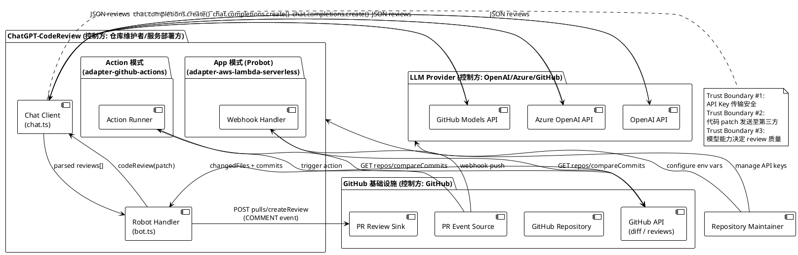
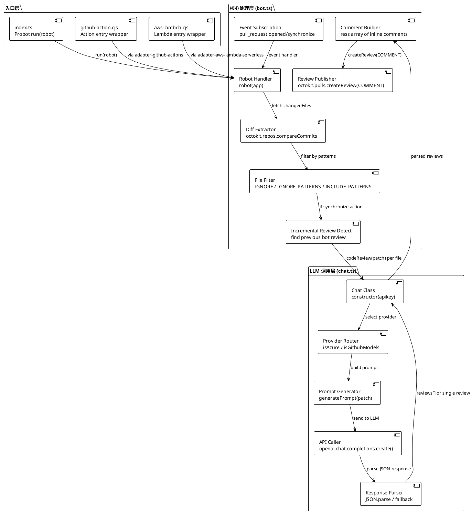
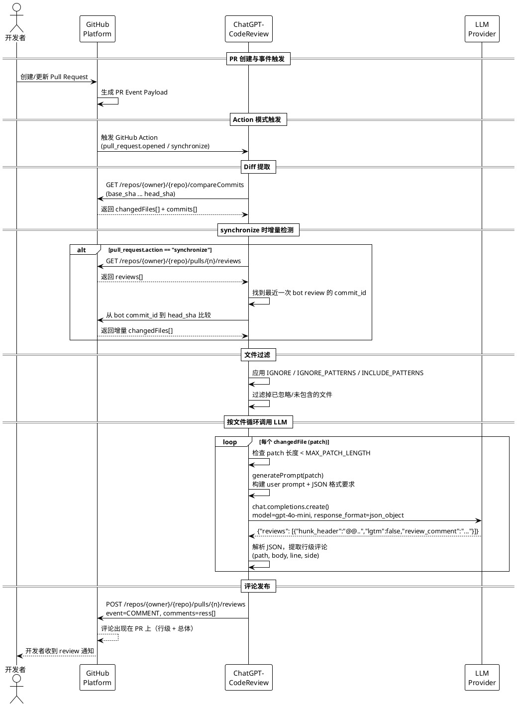

# ChatGPT-CodeReview 框架深度分析

## 概述

ChatGPT-CodeReview 是一个基于 Probot 框架构建的 AI 代码审查框架，由开发者 anc95 于 2023 年 2 月创建。它通过 GitHub Action 或 GitHub App（Probot）两种模式监听 pull request 事件，自动提取代码变更（按文件逐个处理 patch），将每个文件的 diff 连同 commit message 和 PR description 作为上下文发送给 LLM（支持 OpenAI、Azure OpenAI、GitHub Models），再将 LLM 生成的结构化 review 意见解析为 PR 评论（支持行级评论）发布回 PR。

该项目是最早将 LLM 引入 GitHub 代码审查流程的开源项目之一（创建于 2023-02-11，注："最早之一"的准确排序需与同期同类项目对比确认，本文为基于创建时间的初步判断），截至 2026-04 获得 4435 stars，使用 ISC License 完全开源。项目灵感来源于 sturdy-dev/codereview.gpt。

### 本质与表现形式

| 维度 | 说明 |
|------|------|
| 它是什么 | 一个 GitHub Action + GitHub App 双模式的 AI 代码审查框架，按文件逐个调用 LLM 进行代码 diff 审查 |
| 表现形式 | 参考实现（开源 GitHub 仓库），包含 action.yml 配置、Probot handler（bot.ts/index.ts）、LLM 调用封装（chat.ts）、prompt 模板（硬编码在 chat.ts 中） |
| 类比理解 | 类似一个"自动化第一道审查员"，在开发者提交 PR 后立即对每个变更文件进行 LLM 级别审查，输出行级或整体评论 |
| 在模型中的位置 | GitHub 生态集成层 -> PR 事件层 -> LLM 调用层 -> PR 评论输出层（属于 AI code review 的工具框架层 primitive） |

## 关键术语

| 术语 | 定义 | 在本题中的作用 |
|------|------|---------------|
| GitHub Action | GitHub 提供的 CI/CD 自动化平台，允许在仓库事件中执行自定义脚本 | ChatGPT-CodeReview 的运行模式之一，通过 @probot/adapter-github-actions 适配 |
| GitHub App（也称 App 模式 / Probot 模式） | GitHub 提供的第三方应用集成方式，通过 webhook 或 adapter 监听仓库事件 | ChatGPT-CodeReview 的运行模式之二，通过 Probot 框架实现。本文统一使用 "GitHub App" 作为 canonical form |
| Probot | 构建 GitHub App 的 Node.js 框架，提供事件处理、Octokit 封装等基础设施 | ChatGPT-CodeReview 的 App 模式和 Action 模式均基于 Probot（通过不同 adapter） |
| Diff / Patch | Git 代码差异（unified diff 格式），每个文件的变更称为一个 patch | LLM review 的核心输入，按文件逐个处理 |
| Hunk | Diff 中的一个变更块，以 @@ 标记行号范围（如 @@ -10,5 +10,7 @@） | review 结果的粒度单位，LLM 按 hunk 返回意见，支持行级定位 |
| LLM Provider | 大语言模型服务提供商（OpenAI、Azure OpenAI、GitHub Models） | 项目支持的 LLM 后端，通过统一 Chat 类封装适配 |
| response_format: json_object | OpenAI API 参数，要求 LLM 返回 JSON 格式 | 确保 LLM 输出可被程序解析的结构化数据 |
| Webhook | GitHub 向外部服务推送事件通知的 HTTP 回调机制 | Probot App 模式的事件触发方式（但本项目更常用 Action 模式） |
| Pull Request Review API | GitHub API 中创建 PR review 的接口（pulls.createReview） | review 评论的最终输出通道，支持行级评论 |
| codereview.gpt | sturdy-dev 开发的早期 AI code review 项目 | ChatGPT-CodeReview 的灵感来源 |

## 分析正文

### 实体分类表

| 实体 | 类型 | 控制方 | 是否跨信任边界 | 主要职责 | 应落入哪类图 |
|------|------|--------|----------------|----------|--------------|
| GitHub Platform | external system | GitHub | 是（所有通信必经） | 提供仓库、PR、webhook、action 运行环境、API | 角色与信任边界 |
| ChatGPT-CodeReview (Action) | role | 仓库 maintainer | 否（运行在 GitHub 基础设施内） | 通过 @probot/adapter-github-actions 触发 review | 角色内部组件 |
| ChatGPT-CodeReview (App/Probot) | role | 服务部署方 | 是（独立部署，AWS Lambda 或自托管） | 通过 webhook 持续监听并触发 review | 角色内部组件 |
| LLM Provider API | external system | OpenAI/Azure/GitHub | 是（外部 API 调用） | 接收 prompt，返回结构化 review 结果 | 角色与信任边界 |
| Repository Maintainer | role | 用户 | 是（配置和控制方） | 配置环境变量、API key、review 策略 | 角色与信任边界 |
| Chat 类 | component | 项目代码（chat.ts） | 否 | 封装 LLM API 调用，处理 OpenAI/Azure/GitHub Models 三 provider 切换 | 角色内部组件 |
| Robot Handler | component | 项目代码（bot.ts） | 否 | 订阅 pull_request 事件，提取 diff，过滤文件，调用 Chat，发布评论 | 角色内部组件 |
| Prompt Generator | component | 项目代码（chat.ts generatePrompt） | 否 | 将用户 prompt + patch 组合，附加 JSON 格式要求 | 角色内部组件 |
| Patch / File Diff | data object | GitHub API 返回 | 否 | 单个文件的 unified diff，是 LLM 输入 | 时序图 |
| Review Result (JSON) | data object | LLM 返回 | 否 | 结构化 review：hunk_header、lgtm、review_comment | 时序图 |

### 角色与信任边界总览

**关键信任边界说明**：

- **边界 #1（API Key 安全）**：Repository Maintainer 的 LLM API key 通过 GitHub Secrets（Action 模式）或服务环境变量（App 模式）传递给 Chat 类。在 Probot 模式下，还可通过仓库 Actions Variable 存储 key（由 bot.ts 的 loadChat 函数通过 octokit 读取）。
- **边界 #2（代码数据外发）**：每个文件的 diff patch 会被发送至 LLM Provider API。代码片段可能经过第三方服务器，存在知识产权和隐私风险。这是所有 AI code review 工具共有的信任假设。
- **边界 #3（review 可信度）**：LLM 生成的 review 质量完全取决于模型能力和 prompt 设计。默认模型为 gpt-4o-mini，review 结果需要人工复核。

### 角色内部组件图

ChatGPT-CodeReview 的核心处理逻辑在 Action 模式和 App 模式下共享同一套代码（bot.ts + chat.ts），仅入口方式不同。以下展示 canonical 组件架构。

**Action 模式与 App 模式的差异**：

| 维度 | Action 模式 | App 模式 (Probot) |
|------|------------|-------------------|
| 入口文件 | github-action.cjs -> adapter-github-actions | index.ts -> run(robot) -> Probot 默认 server |
| 部署方式 | 仓库 .github/workflows/ 配置，GitHub 托管 Runner | 自托管 Node.js 服务 / AWS Lambda（adapter-aws-lambda-serverless） |
| API Key 获取 | GitHub Secrets（环境变量） | 环境变量 / 仓库 Actions Variable（通过 octokit 读取） |
| 运行时长限制 | 受 GitHub Action 超时限制（默认 6 小时） | 取决于部署环境（Lambda 有 15 分钟限制） |
| 适用场景 | 单次 PR review、按需执行、推荐方式 | 持续监听多个仓库、实时 review |

### 跨角色核心流程图（Happy Path）

以下时序图展示从 PR 事件触发到 review 评论发布的完整链路。核心特征：**按文件逐个调用 LLM**，而非一次性发送整个 diff。

**流程步骤说明**：

- `【触发 -> Diff 提取】`：通过 GitHub API `GET /repos/{owner}/{repo}/compareCommits` 获取 base_sha 到 head_sha 的完整变更文件列表。这里的设计决策是获取"完整 diff"而非"增量 diff"（除非是 synchronize 且能找到上次 bot review 的位置）。
- `【synchronize 增量检测】`：当 PR 被 synchronize 更新时，bot 会查找之前由自己创建的 review（通过 body 开头 "Code review by ChatGPT" 或 "LGTM" 识别），然后只 review 从上次 review commit 到最新 commit 之间的增量变更。如果找不到上次 review，则 fallback 到 PR 最后两个 commit 的比较。
- `【文件过滤】`：支持 IGNORE（精确路径列表）、IGNORE_PATTERNS（glob 或 regex 忽略模式）、INCLUDE_PATTERNS（glob 或 regex 包含模式），使用 minimatch 库实现。
- `【按文件循环 LLM 调用】`：核心设计——每个文件的 patch 独立调用一次 LLM，不是将整个 diff 一次性发送。这样可以：(1) 避免超出 token 限制；(2) 获得按文件/按 hunk 的精细 review。代价是 LLM API 调用次数等于变更文件数。
- `【结构化响应解析】`：LLM 被要求返回 JSON 格式（response_format: json_object），包含 reviews 数组，每个元素有 hunk_header、lgtm、review_comment。如果 JSON 解析失败，fallback 将整个 LLM 返回作为单条评论。

**异常路径**：

| 异常场景 | 处理方式 | 影响 |
|----------|----------|------|
| 单个 patch 超出 MAX_PATCH_LENGTH | 跳过该文件，记录日志 | 该文件未被 review |
| LLM API 超时/认证错误 | 捕获错误并向上抛出（bot.ts 中 throw e） | 整个 review 流程失败 |
| LLM 返回非 JSON 格式 | Response Parser fallback 为整体评论 | 失去行级定位能力，降级为整体评论 |
| 无变更文件（过滤后为空） | 返回 "no change"，不发布评论 | 静默跳过 |
| GitHub API rate limit | 依赖 GitHub Action 重试机制 | review 延迟 |

### 状态转换表

ChatGPT-CodeReview 的运行状态转换围绕单次 review 任务的生命周期。特别地，synchronize 事件时有增量 review 的状态检测逻辑。

| 当前状态 | 触发事件 | 转换结果 | 说明 |
|----------|----------|----------|------|
| Idle | pull_request.opened | Diff Extracting | 新 PR 创建，获取完整 base->head diff |
| Idle | pull_request.synchronize | Incremental Detect | PR 更新，先检测上次 bot review 位置 |
| Incremental Detect | 找到 bot review commit_id | Diff Extracting (增量) | 从 bot commit 到 head 比较 |
| Incremental Detect | 未找到 bot review | Diff Extracting (fallback) | fallback 到 PR 最后两个 commit 比较 |
| Diff Extracting | changedFiles 获取完成 | File Filtering | 应用 IGNORE / PATTERNS 过滤 |
| File Filtering | 过滤后有文件 | LLM Loop | 进入按文件循环调用 |
| File Filtering | 过滤后无文件 | Idle (跳过) | 不发布评论 |
| LLM Loop | 所有文件处理完成 | Review Posting | 构建 ress[] 并发布 |
| LLM Loop | 单个文件 LLM 调用失败 | 向上抛出错误 | 整个 review 失败 |
| Review Posting | createReview 成功 | Completed | review 结束 |
| Review Posting | createReview API 错误 | Failed | 评论发布失败 |

## 历史演进

ChatGPT-CodeReview 的演进基于 GitHub 仓库的实际发布记录（24 个 release，2023-02-16 至 2026-02-07）。以下划分为三个关键阶段，每阶段说明新增、改造、抛弃的具体内容。

### 阶段一：概念验证与 Action 化（2023-02 -- 2023-06，v1 -- v1.0.10）

**新增**：
- v1 (2023-02-16)：引入 GitHub Action 支持（PR #22），这是项目最标志性的变化——从纯 Probot App 扩展为 Action 模式
- v1.0.1-v1.0.3 (2023-03)：初期 bug 修复和 Action 集成稳定性改进
- v1.0.5 (2023-04-28)：添加 `TARGET_LABEL` 环境变量支持，允许仅在 PR 带有特定 label 时触发 review（贡献者 @HosakaKeigo）
- v1.0.6-v1.0.10 (2023-05 -- 2023-06)：持续 bug 修复和稳定化

**改造**：
- 从纯 Probot App 架构转向"Probot + GitHub Action 双模式"架构（通过 @probot/adapter-github-actions）
- 默认模型从早期版本（具体模型缺乏 release notes 记录，推断为 GPT-3.5 或 GPT-4）逐渐稳定

**抛弃**：
- 无明确抛弃的功能

**特征**：这个阶段的核心验证是"将 LLM 代码审查嵌入 GitHub PR 工作流是否可行"。通过 Action 模式降低了用户门槛——用户只需在 workflow 文件中添加几行配置即可使用，无需自托管服务。这反映了 2023 年初 LLM 应用开发的普遍模式：快速验证可行性，利用 GitHub Action 平台免部署。v1 release 时间仅在项目创建后 5 天。

### 阶段二：工程化与可配置性（2023-09 -- 2024-12，v1.0.11 -- v1.0.20）

**新增**：
- v1.0.11-v1.0.13 (2023-09 -- 2024-03)：持续优化，包括 Action 构建产物更新（#140）
- v1.0.14 (2024-10-25)：版本间过渡
- v1.0.18 (2024-11-08)：Azure OpenAI bug 修复（#164，贡献者 @shkangomelet）——确认了 Azure OpenAI 作为第二 provider 的正式支持
- v1.0.19 (2024-11-22)：修复 IGNORE_PATTERNS 逻辑，新增 `INCLUDE_PATTERNS` 环境变量——提供更精细的文件过滤能力
- v1.0.20 (2024-12-11)：修复 glob 匹配逻辑（#171）——确保 minimatch 模式正确工作

**改造**：
- Prompt 模板：从简单硬编码演进为支持 `PROMPT` 环境变量自定义 + `LANGUAGE` 指定回复语言
- LLM 模型：默认模型升级为 gpt-4o-mini（从早期可能的 GPT-3.5/GPT-4），通过 `MODEL` 环境变量可配置
- 响应格式：引入 `response_format: json_object` 确保 LLM 返回结构化数据，支持按 hunk 的行级评论
- synchronize 增量 review：添加查找上次 bot review 位置的逻辑，避免每次 push 都重新 review 整个 PR
- 文件过滤：从简单 IGNORE 列表（精确路径）演进为 IGNORE_PATTERNS（glob/regex）+ INCLUDE_PATTERNS（glob/regex）双向过滤
- LLM 调用策略：确认采用按文件逐个 patch 循环调用，而非单次整体调用

**抛弃**：
- 简单的整体评论模式被按文件/按 hunk 的结构化评论替代
- 硬编码 prompt 被可配置 prompt 系统替代（通过 PROMPT/LANGUAGE 环境变量）

**特征**：这个阶段是项目从"能跑"到"好用"的转变。关键工程化改进包括：增量 review（减少重复工作）、结构化输出（支持行级定位）、多 provider 适配（满足企业合规需求）、可配置 prompt（允许用户自定义审查维度）。这些改进共同指向一个目标：让 AI code review 在生产环境中可持续使用。

### 阶段三：生态整合与体验优化（2025-01 -- 2026-02，v1.0.21 -- v1.0.23）

**新增**：
- v1.0.21 (2025-03-16)：版本间过渡
- v1.0.22 (2025-08-04)：PR #189 相关改进
- v1.0.23 (2026-02-07)：优化评论位置（"optimize comment position"）——改善行级评论的定位准确性

**改造**：
- 默认模型维持 gpt-4o-mini，利用 GitHub Models 生态的模型迭代
- 评论定位精度改进（v1.0.23 的 comment position 优化）

**抛弃**：
- 无明确抛弃

**特征**：这个阶段进入精细化优化期，不再追求大功能新增，而是提升 review 的实用价值——评论位置准确性、模型质量（依赖上游 LLM 迭代）、整体稳定性。发布频率有所降低（2025-2026 年仅 3 个 release vs 2023-2024 年 20 个 release），反映项目进入成熟维护期（注：此为基于 release 频率的推断，L4 证据等级）。

**演进阶段总览表**：

| 阶段 | 时间窗口 | Release 范围 | 核心主题 | 关键新增能力 | 标志性变化 |
|------|----------|-------------|----------|-------------|-----------|
| 概念验证 | 2023-02 -- 2023-06 | v1 -- v1.0.10 | Action 化 | GitHub Action 支持、TARGET_LABEL | 从纯 App 到双模式，5 天完成 Action 化 |
| 工程化 | 2023-09 -- 2024-12 | v1.0.11 -- v1.0.20 | 可配置性 | Azure 支持、增量 review、JSON 结构化、glob 过滤 | 从能跑到好用 |
| 成熟维护 | 2025-01 -- 2026-02 | v1.0.21 -- v1.0.23 | 体验优化 | 评论位置优化 | 发布频率降低，进入稳定维护期 |

## 设计取舍

| 设计决策 | 选择 | 替代方案 | 取舍原因 |
|----------|------|----------|----------|
| 双模式运行（Action + App） | 同时支持，共享同一套核心代码（bot.ts + chat.ts） | 仅支持 Action 或仅支持 App | 双模式覆盖不同场景：Action 免部署（推荐方式，用户只需 workflow 配置），App 支持多仓库持续监听和 AWS Lambda 部署。代价是需要维护两个 adapter 入口，但核心逻辑复用避免了代码分裂。 |
| 按文件逐个调用 LLM | 每个文件 patch 独立调用 | 一次性发送整个 diff / 分块发送 | 按文件调用的优势：(1) 避免超出 token 限制；(2) 每个文件有独立 review 上下文；(3) 天然支持行级定位。代价是调用次数 = 文件数，成本可能较高。 |
| JSON 结构化响应 | response_format: json_object | 自由文本 / Markdown 格式 | JSON 格式使程序可以可靠解析 hunk_header、行号、评论内容，支持行级评论。代价是要求 LLM 严格遵循 JSON 格式，增加了解析失败的可能。 |
| 多 Provider 适配 | OpenAI + Azure OpenAI + GitHub Models | 绑定单一 provider | 避免供应商锁定：Azure 满足企业数据合规（数据驻留），GitHub Models 利用 GitHub 基础设施降低集成成本。代价是 Chat 类需要维护 provider 路由逻辑。 |
| synchronize 增量 review | 通过查找上次 bot review 位置检测增量 | 每次都完整 review 整个 PR | 增量 review 减少重复工作：push 后只 review 新变更部分，降低成本。代价是需要维护 bot review 的 commit 跟踪逻辑，且如果 review 被删除则跟踪失败。 |
| Prompt 硬编码在源码中 | generatePrompt 函数内联在 chat.ts | 外部配置文件 / prompt 模板文件 | 硬编码降低了配置复杂度（用户只需设置 PROMPT 环境变量覆盖默认值）。代价是不支持多模板切换或按文件类型使用不同 prompt 的高级场景。 |
| ISC License | 极简许可 | MIT / Apache-2.0 / GPL | ISC 与 MIT 实质等价但更简短（~100 字），最大化使用自由度，反映项目希望降低采用门槛。 |
| JavaScript/TypeScript 技术栈 | JS/TS（99.9% JavaScript） | Python / Go | JS/TS 与 Probot/Node.js 生态天然契合，GitHub Action 的 JavaScript action 是官方推荐方式之一。rollup + ncc 构建链成熟。代价是在某些后端场景（如复杂文本处理）不如 Python 生态方便。 |

## 能力边界

### 项目原生能力（项目本身提供）

| 能力 | 说明 | 源码位置 |
|------|------|----------|
| PR 事件监听 | 通过 pull_request.opened 和 pull_request.synchronize 事件触发 | bot.ts:42-44 |
| 完整/增量 Diff 提取 | 通过 GitHub API compareCommits 获取，synchronize 时支持增量 | bot.ts:51-99 |
| 文件过滤 | IGNORE（精确路径）、IGNORE_PATTERNS（glob/regex）、INCLUDE_PATTERNS（glob/regex） | bot.ts:101-131 |
| 多 Provider LLM 调用 | OpenAI / Azure OpenAI / GitHub Models 统一接口 | chat.ts:8-23 |
| 结构化 Prompt | user prompt + JSON 格式要求 + 语言指定 | chat.ts:24-50 |
| 按文件循环 Review | 每个文件 patch 独立调用 LLM | bot.ts:143-149 |
| 行级评论发布 | 通过 hunk_header 解析行号，发布 inline comment | bot.ts:157-185 |
| synchronize 增量 review | 查找上次 bot review 位置，只 review 新变更 | bot.ts:59-99 |
| TARGET_LABEL 过滤 | 仅在 PR 带有特定 label 时触发 | bot.ts:47-50 |

### 外部依赖能力

| 能力 | 依赖方 | 说明 |
|------|--------|------|
| LLM 推理与代码分析 | OpenAI / Azure / GitHub Models | review 质量完全取决于 LLM 模型能力（当前默认 gpt-4o-mini） |
| GitHub API | GitHub Platform | diff 获取、review 发布依赖 GitHub API 的稳定性和 rate limit |
| Action 运行环境 | GitHub Actions | Action 模式依赖 GitHub Action Runner 的可用性 |
| Probot 框架 | Probot 社区 | 事件处理、Octokit 封装、adapter 机制 |
| minimatch 库 | isaacs/minimatch | glob 模式匹配实现 |

### 非目标 / 不能解决的问题

| 非目标 | 原因 |
|--------|------|
| 保证 review 正确性 | LLM 可能产生幻觉或错误建议，review 结果需要人工复核 |
| 替代人类 review | 定位是辅助工具，输出作为 COMMENT（非 APPROVE/REQUEST_CHANGES），不是替代人工审查 |
| 处理超大 PR | 单个 patch 超出 MAX_PATCH_LENGTH 会被跳过 |
| 安全漏洞深度检测 | LLM 的静态代码分析能力有限，不能替代 SAST 工具 |
| 运行时行为分析 | 仅分析静态代码 diff，不涉及运行时行为或测试 |
| 多模板/策略化 review | prompt 目前只有一个可配置的 PROMPT 变量，不支持按文件类型自动切换不同 prompt 模板 |
| 跨文件语义分析 | 按文件逐个调用 LLM，每个文件有独立上下文，无法进行跨文件的语义关联分析 |
| 区块链/智能合约专门支持 | 项目没有针对 Solidity/Rust 等区块链语言的专门 prompt 模板或审查规则 |
| Java/后端场景专门支持 | 项目没有针对 Java/Spring Boot 等企业后端场景的专门优化，依赖 LLM 通用能力 |

## 相关对象关系

| 对象 | 关系 | 说明 |
|------|------|------|
| codereview.gpt (sturdy-dev) | 灵感来源 | README 中明确标注 "this project is inspired by codereview.gpt"。codereview.gpt 是早期 AI code review 项目，ChatGPT-CodeReview 借鉴了其基本概念并增加了 Action 模式。具体代码复用程度需进一步对比两个仓库的早期代码确认。 |
| Chat-CodeReview (nangongchengfeng) | GitLab 分支变体 | 中文 README 中推荐了该项目作为 GitLab 替代方案（https://github.com/nangongchengfeng/Chat-CodeReview.git），说明 ChatGPT-CodeReview 本身仅支持 GitHub 平台。 |
| Probot 生态 | 上游运行框架 | 作为 Probot 的一个应用，通过 adapter 机制同时支持 GitHub Action 和 App 两种运行模式 |
| OpenAI 生态 | 上游 LLM 依赖 | 依赖 OpenAI API 和 openai npm 包（^4.71.0）。模型迭代直接影响 review 质量 |
| GitHub Models 生态 | 新增 LLM 渠道 | 通过 USE_GITHUB_MODELS=true 使用 GitHub 内置的 LLM 基础设施（models.github.ai） |

## 场景适配度

### 区块链 / 智能合约场景

| 维度 | 适配度 | 说明 |
|------|--------|------|
| Solidity 代码审查 | 低（依赖 LLM 通用能力） | 项目没有针对 Solidity 的专门 prompt 模板或审查规则。LLM（如 GPT-4o-mini）对 Solidity 的支持取决于其训练数据中的 Solidity 代码覆盖率，而非项目本身的优化。 |
| 安全漏洞检测 | 低 | LLM 可以指出一些明显的安全问题（如 reentrancy 模式），但缺乏系统性的安全扫描能力。不能替代 Slither、Mythril 等专业智能合约审计工具。 |
| Gas 优化建议 | 低（依赖 LLM） | 取决于 LLM 对 EVM gas 机制的理解深度，项目本身不提供 gas 分析能力。 |
| 多文件关联分析 | 不支持 | 按文件逐个调用的架构天然不支持跨文件分析。智能合约通常涉及多文件继承/调用关系，这是架构性限制。 |
| 测试代码审查 | 中等 | 可以通过 INCLUDE_PATTERNS 专门选择测试文件进行审查。 |
| 成本考虑 | 中等 | 每次 PR 的 LLM 调用次数 = 变更文件数，对于频繁迭代的合约开发，API 成本可能较高。 |

**结论**：ChatGPT-CodeReview 在区块链场景中可作为辅助性的代码风格/可读性审查工具，但不具备智能合约安全审计的专业能力。安全相关的 review 应由专门的审计工具处理。（L4 推断，基于架构分析）

### Java / 企业后端场景

| 维度 | 适配度 | 说明 |
|------|--------|------|
| Java 代码审查 | 中（依赖 LLM 通用能力） | LLM（GPT-4o-mini）对 Java 有良好的训练覆盖，项目本身无需针对 Java 做专门优化。 |
| Spring Boot 框架审查 | 中（依赖 LLM） | 同上，取决于 LLM 对 Spring 生态的理解，项目本身不提供框架级审查规则。 |
| 设计模式检测 | 低 | LLM 可以指出一些明显的设计问题，但不是系统性的设计模式审查。 |
| 单元测试覆盖 | 中 | 可以通过自定义 PROMPT 要求 LLM 关注测试覆盖度。 |
| 企业合规检查 | 中 | 可以通过自定义 PROMPT 添加企业内部编码规范，LLM 按规范进行审查。 |
| 大项目适配 | 中低 | Java 项目通常文件数较多，按文件调用的 LLM 成本随文件数线性增长。可通过 IGNORE_PATTERNS 过滤非关键文件（如生成的代码、配置文件）降低成本。 |

**结论**：ChatGPT-CodeReview 在 Java/后端场景中具有中等适配度。LLM 对 Java 有良好训练覆盖，项目可通过自定义 PROMPT 适配企业内部规范。主要限制是成本（文件数多时 API 调用成本高）和缺乏框架级审查能力。（L4 推断，基于架构分析）

## 结论

### 已确认

1. ChatGPT-CodeReview 是一个 GitHub Action + GitHub App 双模式的 AI 代码审查框架，创建于 2023-02-11，使用 ISC License 开源。截至 2026-04 有 4435 stars。
2. 核心技术栈：JavaScript (99.9%)，基于 Probot 框架，通过 @probot/adapter-github-actions 和 @probot/adapter-aws-lambda-serverless 实现双模式。
3. 核心处理流水线：index.ts/github-action.cjs -> bot.ts (事件订阅 -> diff 提取 -> 文件过滤 -> 按文件循环) -> chat.ts (provider 路由 -> prompt 生成 -> LLM 调用 -> JSON 解析) -> 行级评论发布。
4. 支持三种 LLM provider：OpenAI（默认）、Azure OpenAI、GitHub Models，通过 Chat 类的 isAzure / isGithubModels 标志路由。
5. 默认模型为 gpt-4o-mini，通过 MODEL 环境变量可配置。使用 response_format: json_object 要求结构化输出。
6. 按文件逐个调用 LLM，每个文件 patch 独立发送，不是单次整体调用。
7. synchronize 事件时支持增量 review：通过查找上次 bot review 的 commit_id，只 review 新变更。
8. 支持 TARGET_LABEL（label 过滤）、IGNORE / IGNORE_PATTERNS / INCLUDE_PATTERNS（文件过滤）、PROMPT（自定义审查提示词）、LANGUAGE（回复语言）。
9. 项目灵感来源为 sturdy-dev/codereview.gpt。
10. 项目有 24 个 release（v1 至 v1.0.23），217+ commits。

### 尚需进一步验证

11. 与 codereview.gpt 的具体代码复用关系：README 仅提到 "inspired by"，需要进一步对比两个仓库的早期代码确认是否有直接代码复用。
12. 社区讨论和用户反馈的具体内容：需要查看 GitHub Issues、第三方博客等了解实际使用体验。

### 基于推断

13. 项目在 2025-2026 年进入成熟维护期，发布频率显著降低，核心功能已稳定，主要依赖上游 LLM 迭代提升 review 质量。（L4，基于 release 频率分析）
14. 按文件逐个调用的架构在变更文件数多的 PR 中可能成本较高，但对于典型 PR（<10 个文件）是合理的 trade-off。（L4，基于架构分析）
15. 项目在区块链/Java 场景中缺乏专门优化，可作为辅助性代码可读性审查工具，但不适合替代专业安全审计工具。（L4，基于功能分析）
