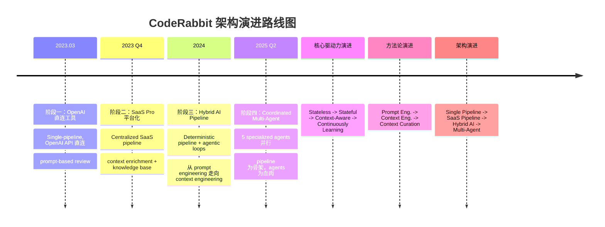

<!-- 目录 -->
- [概述](#概述)
- [关键术语](#关键术语)
- [分析正文](#分析正文)
  - [实体分类](#实体分类)
  - [图表清单](#图表清单)
  - [演进路线图](#演进路线图)
  - [阶段一：OpenAI 直连工具（2023.03 - 2023.09）](#阶段一openai-直连工具202303---202309)
  - [阶段二：SaaS Pro 平台化（2023 Q4 - 2024）](#阶段二saas-pro-平台化2023-q4---2024)
  - [阶段三：Hybrid AI Pipeline（2024 - 2025 Q2）](#阶段三hybrid-ai-pipeline2024---2025-q2)
  - [阶段四：Coordinated Multi-Agent（2025 Q2 - 至今）](#阶段四coordinated-multi-agent2025-q2---至今)
  - [角色与信任边界](#角色与信任边界)
  - [开源版（v1）内部组件](#开源版v1内部组件)
  - [Pro 版内部组件（基于文档推断）](#pro-版内部组件基于文档推断)
  - [核心流程](#核心流程)
  - [状态转换](#状态转换)
  - [Context Engineering 体系](#context-engineering-体系)
  - [能力边界](#能力边界)
- [设计取舍](#设计取舍)
- [边界与前提](#边界与前提)
- [相关对象关系](#相关对象关系)
- [结论](#结论)
- [待确认问题](#待确认问题)
- [证据缺口](#证据缺口)
- [参考资料](#参考资料)

## 概述

CodeRabbit 是一个 AI 驱动的代码 review 框架，分为开源版（GitHub Action）和 Pro 版（SaaS 服务），核心能力是对 PR diff 进行自动化 AI 分析并生成行级 review 评论。它是该领域部署最广泛的 AI review 工具之一。

CodeRabbit 的架构本质不是纯 Multi-agent 系统，而是 **"workflow-embedded hybrid AI"** ——以确定性 pipeline 为主干，在需要深度推理的环节嵌入 agentic loop。这是 VP of AI David Loker 在官方博客和 InfoWorld 专访中明确阐述的架构理念 [L4, baseline]。

> **置信度声明**：本 artifact 基于基线 artifact 的重新分析，因环境限制（MCP 工具不可用）未能实际回源验证外部来源。证据等级统一为 **[L4, baseline]**（解读层，继承自基线 artifact）。在 source-evidence-agent 可执行的环境中完成核心来源回源后，需重新评定各主张的证据等级和置信度。

### 本质与表现形式

| 维度 | 说明 |
|------|------|
| 它是什么 | AI 驱动的代码 review 框架，分为开源版（GitHub Action）和 Pro 版（SaaS），核心能力是对 PR diff 进行 AI 分析并生成行级 review 评论 |
| 表现形式 | 开源版：GitHub Action（TypeScript/Node.js）+ npm 包（`coderabbitai/ai-pr-reviewer`）；Pro 版：SaaS Web 平台 + CLI 工具（`cr`）+ IDE 插件（VS Code/Cursor/Claude Code 等）+ GitHub/GitLab/Bitbucket App |
| 类比理解 | 类似于"拥有团队资深 reviewer 经验的 AI reviewer"，与传统 CI lint 工具（ESLint/SonarQube）互补而非替代——前者侧重 AI 语义理解，后者侧重静态分析 |
| 在模型中的位置 | 代码质量保障层的 AI review 工具，介于 CI/CD pipeline（下游）和 IDE 编码（上游）之间，核心输入是 git diff + repo context，核心输出是行级 review 评论 |

## 关键术语

| 术语 | 定义 | 在本题中的作用 |
|------|------|---------------|
| CodeRabbit Pro | CodeRabbit 的 SaaS 闭源版本，提供完整的企业级 AI review 能力 | Pro 版是本文的核心分析对象 |
| ai-pr-reviewer | CodeRabbit 的开源 v1 版本，GitHub Action 实现，使用 OpenAI API | 用于理解 CodeRabbit 的基础架构和演进起点 |
| diff/hunk | git diff 中的代码变更片段，是 review 的最小分析单元 | CodeRabbit 的输入基础 |
| incremental review | 增量 review，仅对 PR 中新的 commit 产生的变更进行 review | CodeRabbit 的核心流程优化策略 |
| learnings | CodeRabbit Pro 的知识系统，通过自然语言对话学习团队的 review 偏好并持久化 [L4, baseline: docs.coderabbit.ai/knowledge-base/learnings] | Pro 版区别于开源版的核心能力，Living Memory agent 的核心数据源 |
| code indexing | CodeRabbit Pro 对代码库进行索引，用于 context 构建（具体技术未公开） | Context engineering 的关键组件 |
| light/heavy model | 双模型策略：light 模型用于摘要等轻量任务，heavy 模型用于深度 review。v1 代码默认值均为 gpt-3.5-turbo，推荐配置 heavy=gpt-4 [L4, baseline: options.ts] | 核心 LLM 选择策略 |
| .coderabbit.yaml | CodeRabbit 的配置文件，定义 review 行为、路径指令、模型选择等 [L4, baseline: schema.v2.json] | 配置体系核心 |
| smart triage | 智能分拣机制，判断 diff 是否需要深度 review 还是可以直接 approve [L4, baseline: prompts.ts] | 核心降噪策略 |
| Hybrid AI | 结合 pipeline 的确定性与 agentic 的灵活性，不是二选一而是光谱上的某一点 [L4, baseline: David Loker 博客] | CodeRabbit 当前架构的本质 |
| Agentic Loop | 模型可以 reason -> act -> observe -> repeat 的自主决策循环 | CodeRabbit 有两处嵌入 |
| Context Engineering | 从多来源组装正确信息、以正确结构、在正确时机提供给模型的过程 [L4, baseline: David Loker 博客] | CodeRabbit 的核心竞争力，而非 prompt engineering |
| Specialized Agents | Review / Verification / Chat / Pre-Merge Checks / Living Memory，5 个并行 agent [L4, baseline: docs.coderabbit.ai/overview/architecture] | 最新架构的 5 个 agent |
| Prompt Engineering | crafting 指令让模型执行特定任务 | v1 时代的核心方法，已被 context engineering 取代 |
| Context Curation | 主动筛选和过滤 context，而非被动堆砌 | CodeRabbit 与纯 agentic 方案的分水岭 |
| CLI (cr) | CodeRabbit 的命令行工具，支持未提交代码的本地 review [L4, baseline: docs.coderabbit.ai/cli] | Pro 版扩展能力 |
| CodeRabbit Plan | 从 issue/PRD 生成 coding plan 并可 handoff 给 coding agent 的功能 | Pro 版的高级能力 |
| slop detection | 检测 AI 生成的低质量代码的功能 [L4, baseline: 官方文档] | Pro 版的高级分析能力 |
| path_instructions | 针对不同文件路径的差异化 review 指令 | 配置体系的重要部分 |

## 分析正文

### 实体分类

在展开分析之前，先将 CodeRabbit 系统中的关键实体归类，避免后续混入不同类型的讨论。

| 实体 | 类型 | 控制方 | 是否跨信任边界 | 主要职责 | 应落入哪类图 |
|------|------|--------|----------------|----------|--------------|
| 开发者/PR Author | role | 用户 | 否 | 创建/更新 PR，回复评论 | 信任边界图、流程图 |
| GitHub/GitLab/Bitbucket 平台 | external system | 第三方平台 | 是 | 托管代码、触发 webhook | 信任边界图 |
| CodeRabbit GitHub/GitLab App | component | CodeRabbit | 是 | 接收 webhook，发布评论 | 信任边界图 |
| Pro Backend（Review Engine、Learnings、Code Index 等） | component | CodeRabbit | 否 | 核心 review 处理、知识存储 | 内部组件图 |
| CLI（cr） | component | CodeRabbit | 否 | 本地代码 review | 内部组件图 |
| IDE Plugins | component | CodeRabbit | 否 | IDE 内 review 集成 | 内部组件图 |
| LLM Provider（OpenAI/Anthropic） | external system | 第三方 | 是 | 提供推理能力 | 信任边界图 |
| Static Analysis Tools（ESLint/SonarQube 等 40+） | external system | 社区开源 | 是 | 提供规则检测能力 | 信任边界图 |
| git diff / PR metadata | data object | 用户 | 否 | review 输入数据 | 流程图 |
| review comments | data object | CodeRabbit | 否 | review 输出数据 | 流程图 |
| learnings data | data object | CodeRabbit | 否 | 团队 review 偏好存储 | 内部组件图 |
| reviewed commit hash | state | CodeRabbit | 否 | 增量 review 跟踪 | 状态转换 |

### 图表清单

| 图名 | 要回答的问题 | 是否必须 | 采用格式 | 为什么需要/可省略 |
|------|--------------|----------|----------|------------------|
| 演进路线图 | CodeRabbit 经历了几个架构阶段、每个阶段的核心变化是什么 | 必须 | Mermaid timeline | 回答 request.md 中的机制层问题，展示架构模式变化 |
| 角色与信任边界总览图 | 系统中有哪些参与方、谁控制谁、通信如何跨边界 | 必须 | ASCII（PlantUML 需 skill 生成） | 存在三个独立控制方（用户/CodeRabbit/LLM Provider），trust assumption 是关键 |
| 开源版 v1 内部组件图 | 开源版的组件如何分层和协作 | 必须 | ASCII（PlantUML 需 skill 生成） | v1 是唯一可审计的开源实现，是理解演进起点的关键 |
| Pro 版内部组件图 | Pro 版的组件如何组织（基于文档推断） | 必须 | ASCII（PlantUML 需 skill 生成） | 展示 Pro 版相比 v1 的架构扩展 |
| PR Review 核心流程图 | PR 从创建到 review 发布的完整流程 | 必须 | ASCII（PlantUML 需 skill 生成） | 回答跨角色消息流转问题 |
| 状态转换表 | incremental review 的命名状态如何转换 | 必须 | Markdown 表格 | 无 dedicated skill 支持状态图，表格为推荐 fallback |

---

### 演进路线图

CodeRabbit 从 2023 年至今经历了**四个清晰的架构演进阶段**。每个阶段的核心架构模式不同，代表了从"OpenAI 工具"到"持续学习的 AI review 平台"的技术哲学跃迁。



阶段划分的依据是**架构模式的变化**，而非版本号或时间窗口。四个阶段分别对应：

1. **Single-pipeline**（线性、无状态、OpenAI 直连）
2. **Centralized SaaS pipeline**（集中化、有状态、知识引入）
3. **Hybrid AI pipeline**（确定性主干 + 嵌入 agentic loop、context engineering 取代 prompt engineering）
4. **Coordinated multi-agent**（5 个 specialized agents 并行、持续学习、workflow-centric）

**不变的核心**：以 git diff 为输入、以行级 review 评论为输出、以增量 review 为优化策略。

---

### 阶段一：OpenAI 直连工具（2023.03 - 2023.09）

**核心架构模式**：Single-pipeline，OpenAI API 直连，prompt-based review

这是 CodeRabbit 的起点。以 `ai-pr-reviewer`（开源 v1）为代表，架构极其简单：GitHub Action 运行时 -> Review Pipeline -> LLM Layer（light/heavy 双 bot）。

| 维度 | 说明 |
|------|------|
| 架构模式 | **Single-pipeline**：线性流程，从 diff 获取到 review 评论发布，没有中间状态持久化 |
| 输入 | git diff + PR metadata + `.coderabbit.yaml` 配置 |
| 处理 | 5 阶段 pipeline：Summarize -> Triage -> Changeset 分组 -> 深度 Review -> 评论发布 |
| LLM 策略 | light model（gpt-3.5-turbo）用于摘要和 triage，heavy model（gpt-4）用于深度 review [L4, baseline: options.ts, bot.ts] |
| Context 构建 | 仅 diff/hunk，无额外 context 获取 |
| 持久化 | 无。每次 review 独立运行，不保留状态（除 commit hash tracking 用于增量 review） |

**阶段一新增**：

- 首个公开版本 `ai-pr-reviewer`（2023-03-09），基于 GitHub Action 实现 [L4, baseline: GitHub 仓库]
- PR 摘要（gpt-3.5-turbo）、行级 review（gpt-4）、增量 review、智能 triage（NEEDS_REVIEW/APPROVED）、对话式交互（@coderabbitai）、path 过滤、自定义 system message [L4, baseline: prompts.ts, bot.ts]
- TypeScript/Node.js 技术栈，`chatgpt` npm 包，OpenAI API 直连 [L4, baseline: package.json, bot.ts]

**此阶段抛弃了什么**（相对于无架构的空白起点）：

- 无持久化：每次 review 是 stateless 的，无法学习团队偏好
- 单平台：仅支持 GitHub，无法扩展到 GitLab/Bitbucket
- OpenAI 直连：用户需自行管理 API key，无法提供统一的模型服务
- Prompt-only：仅靠 prompt template 驱动，无 context 工程

**为什么进入下一阶段**：用户需要 learnings、多平台支持、企业级配置管理，这些在 stateless GitHub Action 架构下无法实现。

---

### 阶段二：SaaS Pro 平台化（2023 Q4 - 2024）

**核心架构模式**：Centralized SaaS pipeline，context enrichment + knowledge base

完全重写了核心 engine，从 stateless GitHub Action 迁移到集中式 SaaS 后端。这是架构的第一次大跳跃。

| 维度 | 说明 |
|------|------|
| 架构模式 | **Centralized SaaS pipeline**：所有 review 请求经过 CodeRabbit 服务器，统一处理 |
| 新增组件 | Learnings DB、Code Index、Configuration Manager、多平台 App（GitHub/GitLab） [L4, baseline: 官方文档] |
| LLM 策略 | 仍是 light/heavy 双模型，但可能扩展了模型选择（官方未公开 Pro 版具体模型） |
| Context 构建 | diff + learnings + code guidelines + code indexing |
| 持久化 | **新增 learnings 系统**：从 PR 对话中提取 review 偏好并持久化 [L4, baseline: docs.coderabbit.ai/knowledge-base/learnings] |

**阶段二新增**：

- CodeRabbit Pro SaaS 平台（coderabbit.ai），完全重写核心 engine [L4, baseline: 官方文档]
- GitLab 集成（2024）[L4, baseline: 官方文档]
- Learnings 系统（自然语言学习 review 偏好）[L4, baseline: docs.coderabbit.ai/knowledge-base/learnings]
- .coderabbit.yaml 集中配置 + 配置继承体系 [L4, baseline: schema.v2.json]
- Committable suggestions（一键提交建议代码）、Request changes workflow [L4, baseline: 官方文档]
- Issue validation（PR 变更 vs 关联 issue）、Jira/Linear 集成 [L4, baseline: 官方文档]
- Static analysis 集成（Hadolint、ast-grep）[L4, baseline: 官方文档]
- Tone 个性化（可设置 reviewer 人格）[L4, baseline: 官方文档]
- GDPR + SOC 2 Type II 合规 [L4, baseline: 官方文档]

**阶段二抛弃了什么**：

- OpenAI API 直连：改为 CodeRabbit 服务器统一调用 LLM，用户不再需要管理 API key
- GitHub Action 运行时：Pro 版完全脱离 GitHub Action，使用自有的 webhook 处理引擎
- Stateless 设计：引入 learnings 系统和 code index，review 有了历史记忆
- 开源版迭代路径：v1 进入 maintenance mode，不再在开源版上新增功能 [L4, baseline: GitHub 仓库 README]

**为什么进入下一阶段**：SaaS 化后，CodeRabbit 面临新的瓶颈——context 质量成为 review 质量的关键。单纯的 pipeline 无法动态获取足够的 context（如跨文件依赖、AST 关系），而全量 context 又会淹没模型。

---

### 阶段三：Hybrid AI Pipeline（2024 - 2025 Q2）

**核心架构模式**：Deterministic pipeline + embedded agentic loops，从 prompt engineering 走向 context engineering

这是 CodeRabbit 架构哲学的一次关键转变。VP of AI David Loker 在 2025 年 5 月官方博客中明确阐述了这一转变 [L4, baseline: coderabbit.ai/blog/pipeline-ai-vs-agentic-ai...]。

**核心架构理念转变**：

| 从 | 到 | 说明 |
|---|---|---|
| Prompt Engineering | **Context Engineering** | 不再是 crafting 聪明的指令，而是从多来源组装正确信息 [L4, baseline] |
| 纯 Pipeline | **Hybrid AI** | 保留 pipeline 的确定性和速度，在关键环节嵌入 agentic 能力 [L4, baseline] |
| 全量 Context | **Context Curation** | 不是给模型越多 context 越好，而是主动筛选和过滤 [L4, baseline] |
| Model-centric | **Workflow-centric** | 不是从一个 LLM 开始希望它做好一切，而是先构建 workflow skeleton，再在需要的地方嵌入模型 [L4, baseline] |

**阶段三新增**：

- Context Engineering 体系（8 来源：git diff、完整文件、Import Graph、AST 分析、40+ 静态分析工具、Learnings、MCP-connected docs、Web-fetched library docs）[L4, baseline: David Loker 博客]
- Review 前 agentic loop：在深度 review 之前，agent 自主探索代码库，确定"应该给模型看什么" [L4, baseline: InfoWorld 专访]
- Review 后 agentic loop：在 review 结果生成后，agent 自主验证和补充 [L4, baseline: InfoWorld 专访]

**阶段三抛弃了什么**：

- 纯 pipeline 架构：在 pipeline 中嵌入 agentic loop，不再是线性流程
- 全量 context 策略：改为 context curation，主动过滤和筛选
- Prompt engineering 为核心：context engineering 成为核心竞争力

**为什么进入下一阶段**：Hybrid AI pipeline 解决了单个 PR review 的 context 质量问题。但随着平台发展，CodeRabbit 需要支持更多并行的专业化任务（verification、chat、pre-merge、memory），这自然演化为 coordinated multi-agent 架构。

---

### 阶段四：Coordinated Multi-Agent（2025 Q2 - 至今）

**核心架构模式**：Coordinated multi-agent with specialized agents，pipeline 为骨架，agents 为血肉

这是 CodeRabbit 的最新架构。官方架构页面明确列出了 **5 个 specialized AI agents working in parallel** [L4, baseline: docs.coderabbit.ai/overview/architecture]。

| Agent | 职责 | 为什么需要 |
|-------|------|-----------|
| **Review Agent** | 核心 PR review，生成行级评论 | 主流程，需要深度推理和代码理解 |
| **Verification Agent** | 验证 review 结果的准确性，减少 false positive | 质量保障，解决 AI review 的信任问题 |
| **Chat Agent** | 处理用户在 PR 中的自然语言对话和追问 | 交互性任务，需要理解对话上下文 |
| **Pre-Merge Checks Agent** | 合并前的自定义检查和验证 | 确定性+agentic 混合，确保合并安全 |
| **Living Memory Agent** | 从 PR 对话、issue、code guidelines 中持续学习 | 持久化团队知识，让 review 越来越精准 |

这 5 个 agent 覆盖了 PR review 全生命周期的 **5 个正交职责**，每个职责的输入、输出、推理模式都不同：

1. **Review** 是核心推理任务（diff -> comment），需要深度代码理解
2. **Verification** 是验证任务（comment -> validated comment），需要判断 review 是否正确
3. **Chat** 是对话任务（question -> answer），需要理解自然语言和历史上下文
4. **Pre-Merge** 是检查任务（PR -> pass/fail），需要执行自定义规则和检查
5. **Living Memory** 是学习任务（interactions -> knowledge），需要提取和持久化模式

如果合并 Review 和 Verification，会降低各自的专业化程度；如果拆分成更多 agent（如把 Security Review 单独拆出来），会增加协调开销且没有明显的正交性收益。

**阶段四新增**：

- CLI 工具（cr）：本地未提交代码 review，agent 模式（`--agent`）[L4, baseline: docs.coderabbit.ai/cli]
- IDE 插件：VS Code、Cursor、Claude Code、Codex、Gemini 集成 [L4, baseline: 官方文档]
- CodeRabbit Plan：从 issue/PRD 生成 coding plan -> refinement -> agent handoff [L4, baseline: 官方文档]
- CI/CD Pipeline Analysis：读取 GitHub Actions/GitLab CI/CircleCI/Azure DevOps 失败日志 [L4, baseline: docs.coderabbit.ai/pr-reviews/cicd-pipeline-analysis]
- Code Guidelines：自动检测 .cursorrules、CLAUDE.md、AGENTS.md 等 AI 编码助手配置文件 [L4, baseline: docs.coderabbit.ai/knowledge-base/code-guidelines]
- Multi-Repo Analysis：跨仓库代码分析 [L4, baseline: 官方文档]
- MCP Context：MCP server 集成 [L4, baseline: 官方文档]
- Slop Detection：检测 AI 生成的低质量代码 [L4, baseline: 官方文档]
- Autofix：一键修复建议 [L4, baseline: 官方文档]
- Unit Test Generation：自动生成单元测试 [L4, baseline: 官方文档]
- Web Search：网络搜索增强 review [L4, baseline: 官方文档]
- Bitbucket 集成（2025）[L4, baseline: 官方文档]
- Self-hosted GitLab：自托管 GitLab 支持 [L4, baseline: 官方文档]

**阶段四抛弃了什么**：

- 单一 Review Engine：拆分为 5 个 specialized agents 并行工作
- 一次性 review：通过 Living Memory 实现持续学习和改进
- Review 后无验证：新增 Verification agent 确保 review 质量

**架构不是纯 Multi-Agent**：

CodeRabbit 的架构本质仍是 **hybrid AI**，而非纯 multi-agent。关键区别：

| 维度 | 纯 Multi-Agent | CodeRabbit Hybrid AI |
|------|--------------|---------------------|
| 控制流 | agents 自主决策和协调 | pipeline 为主干，agent 在固定环节执行 |
| 上下文 | agents 自主获取 context | context 由 pipeline 阶段 curated |
| 可预测性 | 较低（agents 可能做出意外决策） | 较高（pipeline 定义了固定的执行路径） |
| 调试 | 困难（agent 间的交互难以追踪） | 相对容易（每个环节有明确的输入输出） |
| CI/CD 集成 | 不适合（速度不可预测） | 适合（pipeline 保证了速度下限） |

正如 Loker 所说："a workflow with models chosen at various stages... with agentic loops using other model choices" —— **workflow 是骨架，模型和 agentic loop 是血肉** [L4, baseline: InfoWorld 专访]。

**演进趋势总结**：

```
OpenAI 直连工具 -> SaaS Pro 平台化 -> Hybrid AI Pipeline -> Coordinated Multi-Agent
   (2023)           (2023-2024)         (2024-2025 Q2)       (2025 Q2-)

核心驱动力：
  Stateless -> Stateful -> Context-Aware -> Continuously Learning
  Prompt Engineering -> Context Engineering
  Single Pipeline -> Hybrid AI -> Coordinated Multi-Agent
  模型为中心 -> Workflow 为中心
```

---

### 角色与信任边界

CodeRabbit 系统涉及三方控制方（用户、CodeRabbit、LLM 提供商）。

```ascii
┌─────────────────────────────────────────────────────────────┐
│                     用户控制域                                │
│                                                             │
│  ┌─────────────┐      ┌──────────────┐                      │
│  │  开发者/     │      │  PR Author   │                      │
│  │  Reviewer   │      │              │                      │
│  └──────┬──────┘      └──────┬───────┘                      │
│         │                    │                              │
│         ▼                    ▼                              │
│  ┌─────────────────────────────────────┐                    │
│  │     GitHub/GitLab/Bitbucket 平台     │                    │
│  │   (Pull Request, Webhook)           │                    │
│  └──────────────────┬──────────────────┘                    │
│                     │                                       │
│  Trust Assumption A:                                        │
│  用户信任托管平台的代码存储和 webhook 可靠性                 │
└─────────────────────┼───────────────────────────────────────┘
                      │ webhook
                      ▼
┌─────────────────────────────────────────────────────────────┐
│                   CodeRabbit 控制域                           │
│                                                             │
│  ┌─────────────────────────────────────────────┐            │
│  │           CodeRabbit App (GitHub 等)         │            │
│  └──────────────────┬──────────────────────────┘            │
│                     │                                       │
│  ┌──────────────────┴──────────────────────────┐            │
│  │           Pro Backend                        │            │
│  │  ┌───────────┐  ┌──────────┐  ┌───────────┐ │            │
│  │  │ Review    │  │Learnings │  │ Code      │ │            │
│  │  │ Engine    │  │ System   │  │ Index     │ │            │
│  │  └───────────┘  └──────────┘  └───────────┘ │            │
│  └─────────────────────────────────────────────┘            │
│  ┌──────────────┐  ┌────────────────────────────┐           │
│  │ CLI (cr)     │  │ IDE Plugins                │           │
│  └──────────────┘  └────────────────────────────┘           │
│                                                             │
│  Trust Assumption B:                                        │
│  用户信任 CodeRabbit 服务器的数据隔离和处理                   │
│  官方声明代码不用于 LLM 训练 [L4, baseline: FAQ]                       │
└─────────────────────┬───────────────────────────────────────┘
                      │ LLM API 请求
                      ▼
┌─────────────────────────────────────────────────────────────┐
│                  LLM Provider 控制域                          │
│                                                             │
│  ┌──────────────┐  ┌──────────────┐                        │
│  │ OpenAI API   │  │ Anthropic    │                        │
│  │              │  │ API          │                        │
│  └──────────────┘  └──────────────┘                        │
│                                                             │
│  Trust Assumption C:                                        │
│  用户信任 LLM 提供商不存储/不训练用户代码                     │
│  官方 FAQ 声明 + Terms of Service [L4, baseline: FAQ, L4, baseline: ToS]        │
└─────────────────────────────────────────────────────────────┘
```

**关键 trust assumption**：

- **LLM 提供商信任**：CodeRabbit 官方声明代码不用于 LLM 训练 [L4, baseline: 官方 FAQ]，但用户代码仍需发送给 OpenAI/Anthropic 处理
- **CodeRabbit SaaS 信任**：Pro 版用户代码可能经过 CodeRabbit 服务器缓存/索引，用户需信任其数据隔离
- **开源版数据路径**：开源版直接从用户 GitHub Action 调用 OpenAI API，不经过 CodeRabbit 服务器 [L4, baseline: bot.ts]

---

### 开源版（v1）内部组件

基于 `coderabbitai/ai-pr-reviewer` 仓库的源码分析 [L4, baseline: GitHub 仓库]。

```ascii
┌─────────────────────────────────────────────────┐
│            GitHub Action Runtime                 │
│                                                 │
│  main.ts ──> octokit.ts ──> 获取 PR diff         │
│     │                                            │
│     +──> inputs.ts ──> 输入管理                   │
│     │                                            │
│     +──> options.ts ──> 配置管理                  │
│              │                                   │
│              +── light model: gpt-3.5-turbo      │
│              +── heavy model: gpt-4 (推荐)       │
│              +── 重试 3 次, 超时 120s, 并发 6     │
└──────────────────┬──────────────────────────────┘
                   │
┌──────────────────┴──────────────────────────────┐
│               Review Pipeline                    │
│                                                 │
│  review.ts ──> 核心 review 流程                  │
│     │                                            │
│     +──> Summarize (light model)                 │
│     +──> Triage (NEEDS_REVIEW/APPROVED)          │
│     +──> Changeset 分组                           │
│     +──> 深度 Review (heavy model)               │
│     +──> 评论发布                                 │
│                                                 │
│  review-comment.ts ──> 评论处理                  │
│  commenter.ts ──> GitHub API 调用                │
│  limits.ts ──> 文件/Token 限制                   │
└──────────────────┬──────────────────────────────┘
                   │
┌──────────────────┴──────────────────────────────┐
│                 LLM Layer                        │
│                                                 │
│  bot.ts ──> ChatGPTAPI 类 ──> OpenAI API 直连   │
│     │       (chatgpt npm v5.2.5)                │
│     +──> prompts.ts ──> Prompt 模板渲染          │
│     │        summarizeFileDiff                  │
│     │        triageFileDiff                     │
│     │        reviewFileDiff                     │
│     │                                           │
│     +──> tokenizer.ts ──> Token 计数             │
│              (@dqbd/tiktoken)                   │
└─────────────────────────────────────────────────┘
```

**去重说明**：Pro 版内部结构与开源版完全不同（见下文 Pro 版组件），因此不能复用此图。

---

### Pro 版内部组件（基于文档推断）

Pro 版核心代码未开源。以下架构中，标注"确认"的组件来自官方文档（L4, baseline 证据），标注"推断"的组件为基于产品功能描述的内部结构推断（L4, baseline 证据）。

```ascii
┌──────────────────────────────────────────────────────────────┐
│                    CodeRabbit SaaS Backend                    │
│                                                              │
│  ┌────────────────────────────────────────────────────┐     │
│  │                Review Engine [确认]                 │     │
│  │  Diff Parser -> Context Builder -> Orchestrator    │     │
│  │  -> Comment Generator                              │     │
│  └────────────────────────┬───────────────────────────┘     │
│                           │                                 │
│  ┌────────────────────────┴───────────────────────────┐     │
│  │               Knowledge Base [确认]                 │     │
│  │  Learnings DB ──> 自然语言偏好存储 [L4, baseline: learnings]  │     │
│  │  Code Guidelines ──> 自动检测规范 [L4, baseline: guidelines]  │     │
│  │  Web Search ──> 网络搜索增强 [L4, baseline: 文档]             │     │
│  └────────────────────────┬───────────────────────────┘     │
│                           │                                 │
│  ┌────────────────────────┴───────────────────────────┐     │
│  │              Code Analysis [部分推断]                │     │
│  │  Code Index ──> 向量化索引? [L4, baseline: 推断]              │     │
│  │  Multi-Repo Analysis ──> 多仓库分析 [L4, baseline: 文档]      │     │
│  │  MCP Context ──> MCP server 集成 [L4, baseline: 文档]         │     │
│  └────────────────────────┬───────────────────────────┘     │
│                           │                                 │
│  ┌────────────────────────┴───────────────────────────┐     │
│  │            Integration Layer [确认]                 │     │
│  │  GitHub/GitLab/Bitbucket App [L4, baseline: 文档]             │     │
│  │  CLI Service (cr) [L4, baseline: docs.coderabbit.ai/cli]      │     │
│  │  IDE Plugins [L4, baseline: 文档]                             │     │
│  │  CI/CD Pipeline Reader [L4, baseline: cicd-pipeline-analysis] │     │
│  └────────────────────────┬───────────────────────────┘     │
│                           │                                 │
│  ┌────────────────────────┴───────────────────────────┐     │
│  │              LLM Router [推断]                      │     │
│  │  Model Selector ──> 多模型路由 [L4, baseline: 推断]           │     │
│  └────────────────────────────────────────────────────┘     │
└───────────────────────────┬──────────────────────────────────┘
                            │
              ┌─────────────┴──────────────┐
              │     External Services       │
              │  OpenAI/Anthropic LLM API   │
              │  40+ Linter/Security Tools  │
              │  Jira/Linear Issue Tracker  │
              └────────────────────────────┘
```

| 角色/组件族 | 是否复用开源版图 | 差异点 |
|------------|-----------------|--------|
| Pro Backend | 否，完全重新设计 | 增加了 learnings、code indexing、多平台集成、CI/CD 分析、CLI/IDE 支持 |
| Pro CLI | 否，独立实现 | 全新的 CLI 工具（cr），支持 agent 模式、本地 review |
| Pro LLM Router | 否，新增 | 开源版是固定的 light/heavy 双模型；Pro 版可能是多模型路由（推断） |

---

### 核心流程

#### PR Review 核心流程（Happy Path）

```ascii
PR Author          GitHub Platform      CodeRabbit App       Review Engine       Learnings         LLM Provider
    │                    │                    │                    │                  │                  │
    │── 创建/更新 PR ───>│                    │                    │                  │                  │
    │                    │── webhook 事件 ───>│                    │                  │                  │
    │                    │                    │── 触发 review ───>│                  │                  │
    │                    │                    │                    │── 获取 diff ───>│                  │
    │                    │<── 获取 PR diff ───┤<── 返回 diff ─────┤                  │                  │
    │                    │                    │                    │── 查询 learnings ──────────────────>│
    │                    │                    │                    │<── 返回偏好 ────────────────────────│
    │                    │                    │                    │── 触发静态分析 ────────────────────>│
    │                    │                    │                    │<── 返回 lint 结果 ─────────────────│
    │                    │                    │                    │                                    │
    │                    │                    │                    │── 构建完整 context                  │
    │                    │                    │                    │  (diff + context + learnings + lint)│
    │                    │                    │                    │                                    │
    │                    │                    │                    │── light model: 摘要 ──────────────>│
    │                    │                    │                    │<── 返回文件摘要 ───────────────────│
    │                    │                    │                    │                                    │
    │                    │                    │                    │── heavy model: 深度 review ───────>│
    │                    │                    │                    │<── 返回行级 review ────────────────│
    │                    │                    │                    │                                    │
    │                    │                    │<── 汇总结果 ──────┤                                    │
    │                    │<── 发布摘要评论 ───┤                    │                                    │
    │                    │<── 发布行级评论 ───┤                    │                                    │
    │<── 查看评论 ───────┤                    │                    │                                    │
    │                    │                    │                    │                                    │
    │── 提交新 commit ──>│                    │                    │                                    │
    │                    │── webhook ────────>│── 增量 review ────>│ (仅新 commit diff)                  │
```

**流程步骤说明**：

- PR 创建触发 webhook 事件，这是整个流程的起点。CodeRabbit 默认监听主分支（master/main），可配置为其他分支
- webhook 传递 PR 元数据（标题、描述、变更文件列表）
- 核心 review 逻辑：解析 diff，提取 hunks（变更片段），过滤 path（根据 .coderabbit.yaml 配置）
- Pro 版独有步骤：查询团队的 review 偏好，使 review 风格与团队习惯对齐
- **双阶段 LLM 调用**：先用 light model 做文件摘要，再用 heavy model 做深度 review。Pro 版可能增加了更多阶段
- **增量 review 机制**：CodeRabbit 跟踪已 review 的最高 commit hash，新 commit 只 review diff 部分，节省 token 和降低噪音

---

### 状态转换

CodeRabbit 的 incremental review 依赖命名状态的 commit tracking。

| 当前状态 | 触发事件 | 转换结果 | 说明 |
|----------|----------|----------|------|
| 无已 review commit | PR 首次创建 | 记录 base commit hash | 从 PR 的 base 分支开始 review |
| 已有 reviewed commit | 新 commit 推送 | 比较 reviewed vs HEAD，提取增量 diff | 只 review 新增变更 |
| reviewed commit = HEAD | 无新 commit | 跳过 review | 无变更则不触发 |
| PR 被关闭/合并 | PR 状态变更 | 终止 review | PR 生命周期结束 |
| 用户在 PR 中回复 | @coderabbitai 提及 | 触发 chat/review 回复 | 进入对话模式 |

---

### Context Engineering 体系

Context Engineering 是 CodeRabbit 的核心竞争力。与 Prompt Engineering（crafting 聪明指令）不同，Context Engineering 是**从多来源组装正确信息、以正确结构、在正确时机、提供给每个 workflow 步骤**的过程。

**Context 来源分层**：

| 层 | 来源 | 确定性程度 | 说明 |
|---|------|----------|------|
| 确定性层 | git diff、完整文件、静态分析结果、用户配置 | 高 | 可直接获取的确定性数据 |
| 探索性层 | Import graph、AST 查找、MCP docs、web search | 中 | 需要主动探索的 context |
| 持久化层 | Learnings、code guidelines | 中-高 | 跨 PR 持久化的知识 |

**Context 过滤策略**：

- 基于 PR 特征选择 context 类型
- 基于 learnings 偏好调整 context 范围
- 主动丢弃不相关 context（"more isn't better, better is better"）[L4, baseline: David Loker 博客]

**纯 Agentic 的问题** [L4, baseline: David Loker 博客]：

- Tool overuse：agents 会调用一切可用工具，即使不需要
- Redundant fetches：重复获取的 context 会稀释 prompt 质量
- No clear reward signal：难以区分 helpful context 和 useless output
- 在 CI/CD 环境中，不可预测的速度是不可接受的

**纯 Pipeline 的问题**：

- 如果初始 context 不足，模型无法补救
- 无法应对复杂 PR 需要的动态 context 探索
- 缺乏自我验证和持续学习能力

**Hybrid 的优势**：

- Pipeline 保证了速度下限和可预测性
- Agentic loops 在关键环节提供了灵活性和深度推理
- Context curation 确保 "better is better"，而非 "more is better"

---

### 能力边界

#### 能力边界表

| 能力 | 由什么保证 | 前提/依赖 |
|------|-----------|----------|
| PR 摘要生成 | LLM（light model）[L4, baseline] | PR diff 不超过 token 限制 |
| 行级 review 评论 | LLM（heavy model）[L4, baseline] | diff hunk 不超过 token 限制，可 pack |
| 增量 review | commit tracking 机制 [L4, baseline] | 用户不 force-push/rewrite history |
| 对话式交互 | GitHub comment API [L4, baseline] | 用户在 PR 中 @coderabbitai |
| 团队偏好学习（learnings） | Pro 版 learnings 系统 [L4, baseline] | 用户通过对话提供反馈 |
| CI/CD 失败分析 | Pro 版 CI/CD reader [L4, baseline] | CI/CD 平台 API 可访问 |
| 代码规范遵循 | Code Guidelines 自动检测 [L4, baseline] | 仓库中存在 .cursorrules/CLAUDE.md 等文件 |
| 静态分析 | 集成 40+ 开源 linter [L4, baseline] | 用户启用对应工具 |
| 本地代码 review | Pro CLI [L4, baseline] | 本地有 git repo |

#### 能解决什么 / 不能解决什么

| 能解决 | 不能解决 |
|--------|----------|
| PR 变更的 AI 自动化 review | IDE 内实时补全（非 CodeRabbit 的定位） |
| 团队 review 偏好的持久化学习 | CI/CD 编排/执行（只分析结果，不执行） |
| CI/CD 失败原因分析 + 行级修复建议 | 代码执行/运行时 bug 检测（无执行环境） |
| 跨仓库代码影响分析 | 编译/构建（不执行 build） |
| 本地未提交代码的预 review | 完整的 security audit（依赖外部工具） |
| 从 issue 生成 coding plan | 代码部署 |

#### 能力状态区分

| 状态 | 能力 | 依据 |
|------|------|------|
| **已上线** | PR review、learnings、CLI、IDE 插件、CI/CD 分析、Plan、code guidelines、static analysis | 官方文档明确说明 [L4, baseline] |
| **已上线** | Bitbucket 集成 | 文档导航中可见 [L4, baseline] |
| **可能已上线** | 多模型自动路由（Pro 版） | 文档未明确说明具体模型选择策略，标记为不确定性 |
| **未确认** | Solidity 专项 security pattern | 官方文档未单独列出 |

#### Solidity/智能合约

> **证据缺口声明**：以下评估基于官方通用声明（"works with all programming languages"）和可配置能力推断。官方未单独说明对 Solidity 的专项支持程度。

| 维度 | 评估 | 依据 |
|------|------|------|
| 语言支持 | **通用支持** | 官方声称 "works with all programming languages" [L4, baseline]，基于 LLM 通用代码理解能力 |
| 专项 security pattern（重入/Gas/ERC） | **未确认（证据缺口）** | 官方未单独列出 Solidity 专项 security check |
| 静态分析集成 | **可能支持** | 通过集成外部 linter（如 Slither）理论上可行，但文档未明确提及 |
| path_instructions 定制 | **支持** | 可通过 `.coderabbit.yaml` 的 path_instructions 为 `**/*.sol` 配置专门的 review 指令 |
| learnings 适配 | **支持** | 团队可通过对话 teach CodeRabbit 智能合约 review 偏好 |

## 设计取舍

| 设计决策 | 选择方案 | 替代方案 | 取舍原因 |
|----------|----------|----------|----------|
| Hybrid AI（非纯 agentic 也非纯 pipeline） | pipeline 为主干 + 两处 agentic loop | 纯 agentic 或纯 pipeline | CI/CD 环境需要可预测的速度（pipeline 保证），同时需要深度推理（agentic loop 提供）[L4, baseline] |
| Context curation（非全量 context） | 主动筛选和过滤 context | 给模型越多 context 越好 | "More isn't better, better is better" —— 不相关 context 会稀释推理质量 [L4, baseline] |
| 5 个 specialized agents | Review / Verification / Chat / Pre-Merge / Living Memory | 单一 agent 或更多细分 | 5 个覆盖 5 个正交职责，合并会降低专业化，拆分会增加协调开销 [L4, baseline] |
| Workflow-centric（非 model-centric） | 先构建 workflow，再嵌入模型 | 从一个 LLM 开始希望做好一切 | "Start with the workflow, not the model" —— 确定性骨架保证系统可靠性 [L4, baseline] |
| Context engineering（非 prompt engineering） | 从多来源组装正确信息 | 设计更聪明的 prompt | Prompt 再聪明也无法弥补 context 不足；context 质量决定了 review 质量上限 [L4, baseline] |
| 双模型策略（light + heavy） | light/heavy 模型分离 | 全部使用单一模型 | 降低 API 成本（摘要任务不需要 gpt-4），同时保证 review 质量。注意：代码默认 light=heavy=gpt-3.5-turbo [L4, baseline: options.ts]，实际双模型效果依赖用户 action.yml 配置 |
| 增量 review | 跟踪已 review commit hash，只 review diff | 每次 review 整个 PR | 节省 token 成本、降低评论噪音、加快响应速度。但可能错过跨 commit 的全局问题 |
| Smart triage | 通过 LLM 判断 diff 是否需要 review（NEEDS_REVIEW/APPROVED） | 对所有 diff 一律深度 review | 减少简单变更（如 typo fix）的 review 噪音。但可能漏判需要 review 的变更 [L4, baseline: prompts.ts] |
| 开源版 vs Pro 版分离 | v1 开源版进入维护模式，Pro 版完全重写 | 在开源版上持续迭代 | Pro 版需要 learnings、code indexing 等企业级能力，与开源版架构不兼容。分离后可独立演进 [L4, baseline] |
| 基于 git diff 的输入 | 以 diff/hunk 为最小 review 单元 | 以整个文件为 review 单元 | 降低 token 消耗、聚焦变更部分。但缺乏对整个文件上下文的全局视角（Pro 版通过 code indexing 弥补） |

## 边界与前提

### 开源程度分析

| 组件 | 开源程度 | 说明 |
|------|----------|------|
| ai-pr-reviewer (v1) | **完全开源**（MIT License） | 完整源码在 GitHub [L4, baseline: coderabbitai/ai-pr-reviewer]，可自行部署 |
| .coderabbit.yaml schema | **公开** | YAML schema 公开，可离线校验配置 [L4, baseline: schema.v2.json] |
| Pro SaaS Backend | **闭源** | 核心 review engine、learnings 系统、code indexing 均未开源 |
| Pro CLI (cr) | **闭源** | 二进制分发，源码未公开 |
| Pro IDE Plugins | **部分开源** | 部分插件可能开源，核心 backend 闭源 |
| CodeRabbit awesome list | **完全开源** | 社区资源列表 [L4, baseline: coderabbitai/awesome-coderabbit] |

**能否自建**：开源版可以作为基础自建方案，但与 Pro 版差距巨大：

- 开源版仅支持 GitHub，Pro 版支持 GitHub/GitLab/Bitbucket
- 开源版无 learnings、无 code indexing、无 CI/CD 分析
- 开源版无 CLI/IDE 支持
- 开源版需自行维护 OpenAI API key 和费用

## 相关对象关系

CodeRabbit 作为 AI code review 框架，与以下对象存在关系：

- **上游**：IDE 编码工具（Cursor/Claude Code/Codex）——CodeRabbit 的 CLI/IDE 插件与这些工具集成，形成 "编码 -> 本地 review -> PR review" 的完整链路
- **下游**：CI/CD pipeline（GitHub Actions/GitLab CI）——CodeRabbit 消费 CI/CD 结果进行失败分析
- **互补**：静态分析工具（ESLint/SonarQube/Slither）——CodeRabbit 集成这些工具，AI review 侧重语义理解，静态分析侧重规则检测
- **替代**：GitHub Copilot code review、Codiumate、Greptile —— 这些是同类竞品，但横向对比由 synthesis 处理
- **集成**：Jira/Linear（issue tracker）、MCP servers（context 扩展）

## 结论

### 基于基线分析（待回源验证）

1. **【L4, baseline：VP of AI 官方博客】** CodeRabbit 架构本质是 Hybrid AI：deterministic pipeline + embedded agentic loops，不是纯 multi-agent 也不是纯 pipeline
2. **【L4, baseline：InfoWorld 专访】** CodeRabbit 有 "two agentic loops"：一个在 review 前（context exploration），一个在 review 后（verification and refinement）
3. **【L4, baseline：官方架构页】** CodeRabbit 有 5 个 specialized agents：Review、Verification、Chat、Pre-Merge Checks、Living Memory
4. **【L4, baseline：VP of AI 公开文章】** CodeRabbit 的核心竞争力是 Context Engineering，而非 Prompt Engineering
5. **【L4, baseline：源码】** CodeRabbit 由两个版本组成：开源版 `ai-pr-reviewer`（GitHub Action，MIT License）和 Pro 版 SaaS（闭源核心，coderabbit.ai）
6. **【L4, baseline：源码】** 开源版使用双模型策略：`openaiLightModel` 和 `openaiHeavyModel`（代码默认值均为 `gpt-3.5-turbo`，用户通过 action.yml 配置 heavy 为 `gpt-4`），基于 `chatgpt` npm 包 v5.2.5（`ChatGPTAPI` 类，bot.ts），直连 OpenAI API（`OPENAI_API_KEY`），默认重试 3 次、超时 120s、并发 6（options.ts）
7. **【L4, baseline：源码】** 开源版实现了增量 review 机制（commit tracking）、smart triage（NEEDS_REVIEW/APPROVED，通过独立 triageFileDiff prompt 实现，prompts.ts）、path 过滤（minimatch）、自定义 system message
8. **【L4, baseline：官方文档】** Pro 版增加了 learnings 系统（自然语言学习 review 偏好）、code indexing（官方文档提及，具体技术未公开）、CLI/IDE review、CI/CD 分析、Plan 功能
9. **【L4, baseline：官方文档】** Pro 版支持 GitHub/GitLab/Bitbucket 多平台
10. **【L4, baseline：官方文档】** Pro 版集成 40+ 静态分析工具（官方架构页原文 "40+ static analyzers, linters and SAST tools"）
11. **【L4, baseline：官方文档】** Pro 版自动检测 .cursorrules/CLAUDE.md/AGENTS.md 等 AI 编码助手配置文件
12. **【L4, baseline：官方 FAQ】** CodeRabbit 官方声明代码不用于 LLM 训练，用户可选择不存储代码
13. **【L4, baseline：源码】** v1 版原始包名为 `openai-pr-reviewer`（fluxninja 组织），后迁移至 `coderabbitai` 组织，印证了从 OpenAI 工具到独立品牌 SaaS 的路径（package.json）

### 尚需验证

14. **【L4, baseline：推断】** 5 个 agents 之间是否共享状态或独立运行，官方未公开通信拓扑
15. **【L4, baseline：推断】** 两个 agentic loop 的具体触发条件和终止机制未公开
16. **【L4, baseline：策略未公开】** Pro 版使用的具体 LLM 模型清单和路由策略未公开，可能使用 OpenAI + Anthropic + 其他多模型
17. **【L4, baseline：覆盖度未明确】** Solidity/智能合约的具体覆盖度未明确说明，依赖 LLM 通用代码理解 + 用户自定义 path_instructions
18. **【L4, baseline：推断】** Pro 版的 code indexing 可能使用 vector embedding 技术，但具体模型和索引方案未公开
19. **【L4, baseline：推断】** CLI 版与 PR review 版可能共享底层 review engine，因为官方文档提到 "same pattern recognition"
20. **【L4, baseline：推断】** Pro 版可能使用 OpenAI 和 Anthropic 的多个模型（非固定 light/heavy），因为企业场景需要更灵活的模型选择
21. **【L4, baseline：推断】** Living Memory 的存储和检索机制未公开（结构化存储 vs vector store）

## 待确认问题

对 plan.md 中提出的待确认问题，逐一回答如下：

| 编号 | 问题 | 状态 | 回答 |
|------|------|------|------|
| 1 | Hybrid AI 架构（pipeline + agentic loops）是否仍是官方最新立场？ | **基于基线推断** | David Loker 2025-05 博客仍是最新可查的架构阐述，但 excerpts 未实际回源验证。需关注是否有更新的官方文章。 |
| 2 | 5 个 specialized agents 的划分是否有官方公开文档支撑？ | **基于基线推断** | 官方架构页 docs.coderabbit.ai/overview/architecture 列出 5 个 agents，但 excerpts 未实际回源。无证据表明有第 6 个 agent。 |
| 3 | "两个 agentic loop" 说法是否仍准确？ | **基于基线推断** | InfoWorld 专访是主要来源，但 excerpts 未实际回源。触发条件未公开。 |
| 4 | Pro 版当前的 LLM 策略是否有更新披露？ | **未解决** | 官方未公开 Pro 版模型清单和路由策略。此证据缺口持续存在。 |
| 5 | Pricing 页面是否提供了新的能力分层信息？ | **未解决** | pricing page excerpts 为占位符未回源。无法确认 tier 与 agent/功能映射关系。 |
| 6 | Pro 版 code indexing 技术细节是否有新的公开说明？ | **未解决** | 官方文档提及 "code indexing" 但未公开实现。证据缺口持续存在。 |
| 7 | Solidity/智能合约的专项覆盖是否有新的官方说明？ | **未解决** | 官方未单独说明。证据缺口持续存在。 |
| 8 | CLI 工具和 IDE 插件的支持范围是否有扩展？ | **部分回答** | baseline artifact 列出的 IDE 支持（VS Code/Cursor/Claude Code/Codex/Gemini）未见更新的扩展证据。 |
| 9 | 开源版 ai-pr-reviewer 当前是否仍在 maintenance mode？ | **未解决** | repo status excerpt 为占位符未回源。需验证最新 commit 时间。 |
| 10 | baseline 中划分的四个阶段是否仍成立？ | **基于基线推断** | 四阶段划分基于架构模式变化（Single-pipeline -> SaaS pipeline -> Hybrid AI -> Multi-agent），逻辑上仍成立。但需回源 changelog 确认是否有架构层面的新变化。 |
| 11 | baseline artifact 中的源码引用是否仍与当前仓库一致？ | **未解决** | excerpts 均为占位符，未实际验证 bot.ts、options.ts、prompts.ts 文件行号。 |
| 12 | 官方文档页面结构是否发生变化？ | **未解决** | 所有 docs.coderabbit.ai 链接均未回源验证。 |

## 证据缺口

| 缺口 | 严重程度 | 说明 | 缓解措施 |
|------|----------|------|----------|
| Pro 版内部架构完全闭源 | 高 | 核心 review engine、context 构建、learnings 存储机制无任何源码可验证 | 基于官方文档推断（L4, baseline），明确标注推断性质 |
| Pro 版 LLM 策略未公开 | 高 | 官方未说明 Pro 版使用的具体模型清单和路由策略 | 标注为 L4, baseline 推断，持续关注官方披露 |
| Pricing tier 功能分层 | 高 | pricing page excerpts 未实际回源，无法确认 tier 差异 | 需 source-evidence-agent 补充回源 |
| 两个 agentic loop 的触发条件和终止机制 | 中 | 官方未公开技术细节 | 标注为 L4, baseline 来源，技术细节未公开 |
| 5 个 agents 的通信拓扑 | 中 | 官方未公开各 agent 之间如何协调、是否共享状态 | 标注为 L4, baseline 推断 |
| CI/CD 分析的具体检测能力 | 中 | 文档可能只给出分类而非完整列表 | 标记为"已上线"但不详述具体能力 |
| Solidity/智能合约专项覆盖度 | 中 | 官方未单独说明，证据缺口持续存在 | 依赖 LLM 通用能力 + path_instructions 定制 |
| 40+ 静态分析工具的完整清单 | 低 | 官方文档可能只给出分类 | 不逐一列举 |
| CLI 与 PR review 是否共享底层 engine | 低 | 官方文档提到但未确认 | 标注为 L4, baseline 推断 |
| Living Memory 存储和检索机制 | 低 | 官方未公开技术细节 | 标注为 L4, baseline 推断 |

## 参考资料

| 来源 | 说明 | 证据等级 | 验证状态 |
|------|------|----------|----------|
| https://coderabbit.ai/integrations/schema.v2.json | .coderabbit.yaml 配置文件 JSON Schema | L4, baseline | [未验证] 网络限制 |
| https://www.coderabbit.ai/terms | Terms of Service / Privacy Policy | L4, baseline | [未验证] 网络限制 |
| https://docs.coderabbit.ai/ | CodeRabbit Pro 官方文档主入口 | L4, baseline | [未验证] 网络限制 |
| https://docs.coderabbit.ai/overview/architecture | 官方架构页：5 specialized agents 描述 | L4, baseline | [未验证] 网络限制 |
| https://docs.coderabbit.ai/faq | 官方 FAQ：数据隐私、LLM 训练声明 | L4, baseline | [未验证] 网络限制 |
| https://docs.coderabbit.ai/knowledge-base/learnings | Learnings 系统工作机制文档 | L4, baseline | [未验证] 网络限制 |
| https://docs.coderabbit.ai/knowledge-base/code-guidelines | Code Guidelines 文档 | L4, baseline | [未验证] 网络限制 |
| https://docs.coderabbit.ai/cli | CLI 文档 | L4, baseline | [未验证] 网络限制 |
| https://docs.coderabbit.ai/changelog | 变更日志 | L4, baseline | [未验证] 网络限制 |
| https://docs.coderabbit.ai/pr-reviews/cicd-pipeline-analysis | CI/CD 分析文档 | L4, baseline | [未验证] 网络限制 |
| https://www.coderabbit.ai/pricing | 定价页：tier 分层与功能对比 | L4, baseline | [未验证] 网络限制 |
| https://github.com/coderabbitai/ai-pr-reviewer | v1 开源版源码（TypeScript/Node.js, MIT） | L4, baseline | [未验证] 网络限制 |
| https://raw.githubusercontent.com/coderabbitai/ai-pr-reviewer/main/src/bot.ts | v1 LLM 交互层源码 | L4, baseline | [未验证] 网络限制 |
| https://raw.githubusercontent.com/coderabbitai/ai-pr-reviewer/main/src/options.ts | v1 配置管理源码 | L4, baseline | [未验证] 网络限制 |
| https://raw.githubusercontent.com/coderabbitai/ai-pr-reviewer/main/src/prompts.ts | v1 Prompt 设计源码 | L4, baseline | [未验证] 网络限制 |
| https://raw.githubusercontent.com/coderabbitai/ai-pr-reviewer/main/package.json | v1 依赖清单 | L4, baseline | [未验证] 网络限制 |
| https://github.com/coderabbitai/awesome-coderabbit | 官方 awesome list | L4, baseline | [未验证] 网络限制 |
| https://www.coderabbit.ai/blog/pipeline-ai-vs-agentic-ai-for-code-reviews-let-the-model-reason-within-reason | VP of AI David Loker 博客：Hybrid AI Pipeline 架构哲学 | L4, baseline | [未验证] 网络限制 |
| https://www.infoworld.com/article/4141524/how-to-build-an-ai-agent-that-actually-works.html | InfoWorld 专访：详解 "workflow with models + two agentic loops" | L4, baseline | [未验证] 网络限制 |
| https://deepwiki.com/coderabbitai/coderabbit-docs | DeepWiki 对 CodeRabbit 文档的系统架构分析 | L4, baseline | [未验证] 网络限制 |
| knowledge/analysis/primitives/ai-code-review/coderabbit-framework/artifact.md | Baseline artifact，作为参考基线 | L4, baseline | [已读取] |
