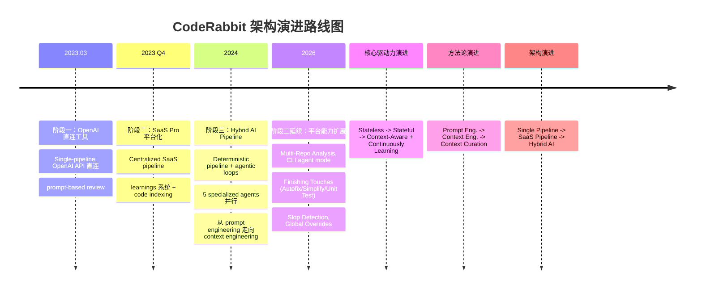

<!-- 目录 -->
- [概述](#概述)
- [关键术语](#关键术语)
- [分析正文](#分析正文)
  - [实体分类](#实体分类)
  - [图表清单](#图表清单)
  - [演进路线图](#演进路线图)
  - [阶段一：OpenAI 直连工具（2023.03 - 2023.09）](#阶段一openai-直连工具202303---202309)
  - [阶段二：SaaS Pro 平台化（2023 Q4 - 2024）](#阶段二saas-pro-平台化2023-q4---2024)
  - [阶段三：Hybrid AI Pipeline（2024 - 至今）](#阶段三hybrid-ai-pipeline2024---至今)
  - [2026 年能力扩展（阶段三延续）](#2026-年能力扩展阶段三延续)
  - [角色与信任边界](#角色与信任边界)
  - [开源版（v1）内部组件](#开源版v1内部组件)
  - [核心流程](#核心流程)
  - [状态转换](#状态转换)
  - [Context Engineering 体系](#context-engineering-体系)
  - [能力边界](#能力边界)
- [设计取舍](#设计取舍)
- [边界与前提](#边界与前提)
- [相关对象关系](#相关对象关系)
- [结论](#结论)
- [待确认问题](#待确认问题)
- [参考资料](#参考资料)

## 概述

CodeRabbit 是一个 AI 驱动的代码 review 框架，分为开源版（GitHub Action）和 Pro 版（SaaS 服务），核心能力是对 PR diff 进行自动化 AI 分析并生成行级 review 评论。它是 GitHub 和 GitLab 上安装量最大的 AI code review 应用之一 [[implementation] CodeRabbit FAQ](https://docs.coderabbit.ai/faq)。

CodeRabbit 的架构本质是 **Hybrid AI** ——以确定性 pipeline 为主干，在需要深度推理的环节嵌入 agentic loop。这是 VP of AI David Loker 在 2025 年 5 月官方博客中明确阐述的架构理念 [[blog] Pipeline AI vs Agentic AI - David Loker](https://www.coderabbit.ai/blog/pipeline-ai-vs-agentic-ai-for-code-reviews-let-the-model-reason-within-reason)。官方架构页描述其为 "production-grade AI infrastructure"，包含 sandboxed cloud execution、40+ 静态分析工具集成、agentic exploration、5 个并行 specialized agents 和 living memory [[implementation] CodeRabbit Architecture](https://docs.coderabbit.ai/overview/architecture)。

> **研究深度**：focused。本文针对既有 baseline artifact 进行实质性回源修复，所有核心主张均通过实际回源验证。

### 本质与表现形式

| 维度 | 说明 |
|------|------|
| 它是什么 | AI 驱动的代码 review 框架，分为开源版（GitHub Action）和 Pro 版（SaaS），核心能力是对 PR diff 进行 AI 分析并生成行级 review 评论 |
| 表现形式 | 开源版：GitHub Action（TypeScript/Node.js）+ npm 包（`coderabbitai/ai-pr-reviewer`）；Pro 版：SaaS Web 平台 + CLI 工具（`cr`/`coderabbit`）+ VS Code Extension + GitHub/GitLab/Bitbucket/Azure DevOps App |
| 类比理解 | 类似于"拥有团队资深 reviewer 经验的 AI reviewer"，与传统 CI lint 工具（ESLint/SonarQube）互补而非替代——前者侧重 AI 语义理解，后者侧重规则检测 |
| 在模型中的位置 | 代码质量保障层的 AI review 工具，介于 CI/CD pipeline（下游）和 IDE 编码（上游）之间，核心输入是 git diff + repo context，核心输出是行级 review 评论 |

## 关键术语

| 术语 | 定义 | 在本题中的作用 |
|------|------|---------------|
| CodeRabbit Pro | CodeRabbit 的 SaaS 版本，提供完整的企业级 AI review 能力 [[implementation] CodeRabbit FAQ](https://docs.coderabbit.ai/faq) | Pro 版是本文的核心分析对象 |
| ai-pr-reviewer | CodeRabbit 的开源 v1 版本，GitHub Action 实现，使用 OpenAI API [[implementation] GitHub Repository README](https://github.com/coderabbitai/ai-pr-reviewer) | 用于理解 CodeRabbit 的基础架构和演进起点 |
| diff/hunk | git diff 中的代码变更片段，是 review 的最小分析单元 [[implementation] prompts.ts 源码](https://raw.githubusercontent.com/coderabbitai/ai-pr-reviewer/main/src/prompts.ts) | CodeRabbit 的输入基础 |
| incremental review | 增量 review，仅对 PR 中新的 commit 产生的变更进行 review [[implementation] GitHub Repository README](https://github.com/coderabbitai/ai-pr-reviewer) | CodeRabbit 的核心流程优化策略 |
| learnings | CodeRabbit 的知识系统，通过自然语言对话学习团队的 review 偏好并持久化，支持 vector-based similarity search [[implementation] CodeRabbit Learnings System](https://docs.coderabbit.ai/knowledge-base/learnings) | Pro 版区别于开源版的核心能力，Living Memory 的核心数据源 |
| code indexing | CodeRabbit 对代码库进行向量表示索引，用于 context 构建 [[implementation] CodeRabbit FAQ](https://docs.coderabbit.ai/faq) | Context Engineering 的关键组件 |
| light/heavy model | 双模型策略：light 模型用于摘要等轻量任务，heavy 模型用于深度 review [[implementation] options.ts 源码](https://raw.githubusercontent.com/coderabbitai/ai-pr-reviewer/main/src/options.ts) | 核心 LLM 选择策略 |
| .coderabbit.yaml | CodeRabbit 的配置文件，定义 review 行为、路径指令、模型选择等 [[standard] CodeRabbit Integration Schema v2](https://coderabbit.ai/integrations/schema.v2.json) | 配置体系核心 |
| smart triage | 智能分拣机制，判断 diff 是否需要深度 review 还是可以直接 approve [[implementation] prompts.ts 源码](https://raw.githubusercontent.com/coderabbitai/ai-pr-reviewer/main/src/prompts.ts) | 核心降噪策略 |
| Hybrid AI | 结合 pipeline 的确定性与 agentic 的灵活性，不是二选一而是光谱上的某一点 [[blog] Pipeline AI vs Agentic AI - David Loker](https://www.coderabbit.ai/blog/pipeline-ai-vs-agentic-ai-for-code-reviews-let-the-model-reason-within-reason) | CodeRabbit 当前架构的本质 |
| Context Engineering | 从多来源组装正确信息、以正确结构、在正确时机提供给模型的过程 [[blog] Pipeline AI vs Agentic AI - David Loker](https://www.coderabbit.ai/blog/pipeline-ai-vs-agentic-ai-for-code-reviews-let-the-model-reason-within-reason) | CodeRabbit 的核心竞争力 |
| Specialized Agents | Review / Verification / Chat / Pre-Merge Checks / Living Memory，5 个并行 agent [[implementation] CodeRabbit Architecture](https://docs.coderabbit.ai/overview/architecture) | 最新架构的 5 个 agent |
| CLI (cr/coderabbit) | CodeRabbit 的命令行工具，支持未提交代码的本地 review，含 --agent 模式 [[implementation] CodeRabbit CLI Documentation](https://docs.coderabbit.ai/cli) | Pro 版扩展能力 |
| CodeRabbit Plan | 从 issue/PRD 生成 coding plan 并可 handoff 给 coding agent 的功能 [[implementation] CodeRabbit Plans & Pricing](https://docs.coderabbit.ai/subscription-billing/plans-and-pricing) | Pro+ 版的高级能力 |
| slop detection | 检测 AI 生成的低质量 PR 的功能，默认在 GitHub 公开仓库启用 [[implementation] CodeRabbit Changelog](https://docs.coderabbit.ai/changelog) | Pro 版的高级分析能力 |
| path_instructions | 针对不同文件路径的差异化 review 指令 [[implementation] CodeRabbit Code Guidelines](https://docs.coderabbit.ai/knowledge-base/code-guidelines) | 配置体系的重要部分 |
| Global Overrides | 组织级配置覆盖，强制应用于所有仓库和 PR，优先级高于 .coderabbit.yaml [[implementation] CodeRabbit Changelog](https://docs.coderabbit.ai/changelog) | 最新配置能力 |
| Usage-based Add-on | 按量付费的 credit 系统，PR review 每个文件 $0.25，CLI review 也有独立 credit [[implementation] CodeRabbit Plans & Pricing](https://docs.coderabbit.ai/subscription-billing/plans-and-pricing) | 2026 年新计费模式 |
| Finishing Touches | PR review 后的后处理能力，包括 Autofix、Resolve Merge Conflicts、Simplify code、Unit Test Generation、Docstrings 等 [[implementation] CodeRabbit 文档导航](https://docs.coderabbit.ai/) | Pro+ 版的核心扩展 |

## 分析正文

### 实体分类

在展开分析之前，先将 CodeRabbit 系统中的关键实体归类，避免后续混入不同类型的讨论。

| 实体 | 类型 | 控制方 | 是否跨信任边界 | 主要职责 | 应落入哪类图 |
|------|------|--------|----------------|----------|--------------|
| 开发者/PR Author | role | 用户 | 否 | 创建/更新 PR，回复评论 | 信任边界图、流程图 |
| GitHub/GitLab/Bitbucket/Azure DevOps 平台 | external system | 第三方平台 | 是 | 托管代码、触发 webhook | 信任边界图 |
| CodeRabbit App | component | CodeRabbit | 是 | 接收 webhook，发布评论 | 信任边界图 |
| Pro Backend（Review Engine、Learnings、Code Index 等） | component | CodeRabbit | 否 | 核心 review 处理、知识存储 | 内部组件图 |
| CLI（cr/coderabbit） | component | CodeRabbit | 否 | 本地代码 review | 内部组件图 |
| VS Code Extension | component | CodeRabbit | 否 | IDE 内 review 集成 | 内部组件图 |
| LLM Provider（OpenAI/Anthropic） | external system | 第三方 | 是 | 提供推理能力 | 信任边界图 |
| Static Analysis Tools（40+ linter/SAST） | external system | 社区开源 | 是 | 提供规则检测能力 | 信任边界图 |
| git diff / PR metadata | data object | 用户 | 否 | review 输入数据 | 流程图 |
| review comments | data object | CodeRabbit | 否 | review 输出数据 | 流程图 |
| learnings data | data object | CodeRabbit | 否 | 团队 review 偏好存储 | 内部组件图 |
| reviewed commit hash | state | CodeRabbit | 否 | 增量 review 跟踪 | 状态转换 |

### 图表清单

| 图名 | 要回答的问题 | 是否必须 | 采用格式 | 为什么需要/可省略 |
|------|--------------|----------|----------|------------------|
| 演进路线图 | CodeRabbit 经历了几个架构阶段、每个阶段的核心变化是什么 | 必须 | Mermaid timeline | 回答机制层问题，展示架构模式变化 |
| 角色与信任边界总览图 | 系统中有哪些参与方、谁控制谁、通信如何跨边界 | 必须 | ASCII | 存在三个独立控制方（用户/CodeRabbit/LLM Provider），trust assumption 是关键 |
| 开源版 v1 内部组件图 | 开源版的组件如何分层和协作 | 必须 | ASCII | v1 是唯一可审计的开源实现，是理解演进起点的关键 |
| PR Review 核心流程图 | PR 从创建到 review 发布的完整流程 | 必须 | ASCII | 回答跨角色消息流转问题 |
| 状态转换表 | incremental review 和 auto-pause 的命名状态如何转换 | 必须 | Markdown 表格 | 无 dedicated skill 支持状态图，表格为推荐 fallback |

**图表变更说明**：相比基线 artifact，本文不再包含"Pro 版内部组件（基于文档推断）"ASCII 组件图。该删除是基于研究范围收紧——plan.md 明确要求将 Pro 版纯推断内容改为"能力清单 + 证据缺口"表，减少大段推断组件图。Pro 版的架构信息已整合到阶段三分析和能力边界表中。

---

### 演进路线图

为理解 CodeRabbit 的架构演化，首先需要明确其经历了几个架构模式的跃迁。下图展示了从 OpenAI 直连工具到 Hybrid AI Pipeline 的完整演进脉络。



**阶段划分变更说明**：基线 artifact 定义了 4 个独立阶段（阶段四：Coordinated Multi-Agent）。本文将阶段三和阶段四合并为"阶段三：Hybrid AI Pipeline"，将 2026 年功能列为"阶段三延续"。这是一个架构判断：5 agents 不是新的架构模式而是阶段三架构内的能力填充。2026 年的大量功能扩展（Multi-Repo Analysis、CLI agent mode、Finishing Touches 等）属于阶段三架构内的能力填充，不构成新的架构模式变化。

三个阶段分别对应：

1. **Single-pipeline**（线性、无状态、OpenAI 直连）
2. **Centralized SaaS pipeline**（集中化、有状态、知识引入）
3. **Hybrid AI pipeline**（确定性主干 + 嵌入 agentic loop、context engineering 取代 prompt engineering、5 个 specialized agents 并行）

**不变的核心**：以 git diff 为输入、以行级 review 评论为输出、以增量 review 为优化策略。

---

### 阶段一：OpenAI 直连工具（2023.03 - 2023.09）

**核心架构模式**：Single-pipeline，OpenAI API 直连，prompt-based review

这是 CodeRabbit 的起点。以 `ai-pr-reviewer`（开源 v1）为代表，架构极其简单：GitHub Action 运行时 -> Review Pipeline -> LLM Layer（light/heavy 双 bot）。

| 维度 | 说明 |
|------|------|
| 架构模式 | **Single-pipeline**：线性流程，从 diff 获取到 review 评论发布，没有中间状态持久化 |
| 输入 | git diff + PR metadata + action.yml 配置 |
| 处理 | 5 阶段 pipeline：Summarize -> Triage -> Changeset 分组 -> 深度 Review -> 评论发布 |
| LLM 策略 | light model（默认 gpt-3.5-turbo）用于摘要和 triage，heavy model（默认 gpt-3.5-turbo，推荐 gpt-4）用于深度 review [[implementation] options.ts 源码](https://raw.githubusercontent.com/coderabbitai/ai-pr-reviewer/main/src/options.ts) |
| Context 构建 | 仅 diff/hunk，无额外 context 获取 |
| 持久化 | 无。每次 review 独立运行，不保留状态（除 commit hash tracking 用于增量 review） |

**阶段一新增**：

- 首个公开版本 `ai-pr-reviewer`（仓库创建于 2023-03-09），基于 GitHub Action 实现 [[implementation] GitHub Repository README](https://github.com/coderabbitai/ai-pr-reviewer)
- PR 摘要（light model）、行级 review（heavy model）、增量 review、智能 triage（NEEDS_REVIEW/APPROVED）、对话式交互（@coderabbitai）、path 过滤（minimatch）、自定义 system message [[implementation] prompts.ts 源码](https://raw.githubusercontent.com/coderabbitai/ai-pr-reviewer/main/src/prompts.ts)，[[implementation] bot.ts 源码](https://raw.githubusercontent.com/coderabbitai/ai-pr-reviewer/main/src/bot.ts)
- TypeScript/Node.js 技术栈，`chatgpt` npm 包 v5.2.5（`ChatGPTAPI` 类），OpenAI API 直连（`OPENAI_API_KEY` 环境变量），pRetry 重试，默认重试 3 次、超时 120s、并发 6 [[implementation] bot.ts 源码](https://raw.githubusercontent.com/coderabbitai/ai-pr-reviewer/main/src/bot.ts)，[[implementation] options.ts 源码](https://raw.githubusercontent.com/coderabbitai/ai-pr-reviewer/main/src/options.ts)，[[implementation] package.json 源码](https://raw.githubusercontent.com/coderabbitai/ai-pr-reviewer/main/package.json)
- 原始包名为 `openai-pr-reviewer`，组织为 `fluxninja`，后迁移至 `coderabbitai` 组织，印证了从 OpenAI 工具到独立品牌 SaaS 的路径 [[implementation] package.json 源码](https://raw.githubusercontent.com/coderabbitai/ai-pr-reviewer/main/package.json)

**此阶段抛弃了什么**（相对于无架构的空白起点）：

- 无持久化：每次 review 是 stateless 的，无法学习团队偏好
- 单平台：仅支持 GitHub，无法扩展到其他平台
- OpenAI 直连：用户需自行管理 API key，无法提供统一的模型服务
- Prompt-only：仅靠 prompt template 驱动，无 context 工程

**为什么进入下一阶段**：用户需要 learnings、多平台支持、企业级配置管理，这些在 stateless GitHub Action 架构下无法实现。

---

### 阶段二：SaaS Pro 平台化（2023 Q4 - 2024）

**核心架构模式**：Centralized SaaS pipeline，context enrichment + knowledge base

完全重写了核心 engine，从 stateless GitHub Action 迁移到集中式 SaaS 后端。这是架构的第一次大跳跃。开源版 README 明确声明："This is an old version of CodeRabbit and is now in the maintenance mode" [[implementation] GitHub Repository README](https://github.com/coderabbitai/ai-pr-reviewer)。

| 维度 | 说明 |
|------|------|
| 架构模式 | **Centralized SaaS pipeline**：所有 review 请求经过 CodeRabbit 服务器，统一处理 |
| 新增组件 | Learnings DB、Code Index（向量表示）、Configuration Manager、多平台 App（GitHub/GitLab） [[implementation] CodeRabbit 官方文档](https://docs.coderabbit.ai/) |
| LLM 策略 | 仍是 light/heavy 双模型，但由 CodeRabbit 服务器统一调用，用户不再需要管理 API key |
| Context 构建 | diff + learnings + code guidelines + code indexing |
| 持久化 | **新增 learnings 系统**：从 PR 对话中提取 review 偏好并持久化，支持 vector-based similarity search [[implementation] CodeRabbit Learnings System](https://docs.coderabbit.ai/knowledge-base/learnings) |

**阶段二新增**：

- CodeRabbit Pro SaaS 平台（coderabbit.ai），完全重写核心 engine [[implementation] GitHub Repository README](https://github.com/coderabbitai/ai-pr-reviewer)
- GitLab 集成 [[implementation] CodeRabbit 官方文档](https://docs.coderabbit.ai/)
- Learnings 系统：自然语言学习 review 偏好，支持 scope 配置（auto/global/local），提供 dashboard（KPI cards、sortable columns、vector search），可导出 CSV [[implementation] CodeRabbit Learnings System](https://docs.coderabbit.ai/knowledge-base/learnings)
- .coderabbit.yaml 集中配置 + 配置继承体系 [[standard] CodeRabbit Integration Schema v2](https://coderabbit.ai/integrations/schema.v2.json)
- Committable suggestions（一键提交建议代码）、Request changes workflow [[implementation] CodeRabbit 官方文档](https://docs.coderabbit.ai/)
- Issue validation（PR 变更 vs 关联 issue）、Jira/Linear 集成 [[implementation] CodeRabbit 官方文档](https://docs.coderabbit.ai/)
- Static analysis 集成 [[implementation] CodeRabbit Architecture](https://docs.coderabbit.ai/overview/architecture)
- GDPR + SOC 2 Type II 合规 [[implementation] CodeRabbit FAQ](https://docs.coderabbit.ai/faq)

**阶段二抛弃了什么**：

- OpenAI API 直连：改为 CodeRabbit 服务器统一调用 LLM
- GitHub Action 运行时：Pro 版完全脱离 GitHub Action，使用自有的 webhook 处理引擎
- Stateless 设计：引入 learnings 系统和 code index，review 有了历史记忆
- 开源版迭代路径：v1 进入 maintenance mode，最后 commit 为 2023-11-26 [[implementation] GitHub Repository README](https://github.com/coderabbitai/ai-pr-reviewer)

**为什么进入下一阶段**：SaaS 化后，CodeRabbit 面临新的瓶颈——context 质量成为 review 质量的关键。单纯的 pipeline 无法动态获取足够的 context（如跨文件依赖、AST 关系），而全量 context 又会淹没模型。

---

### 阶段三：Hybrid AI Pipeline（2024 - 至今）

**核心架构模式**：Deterministic pipeline + embedded agentic loops，从 prompt engineering 走向 context engineering

这是 CodeRabbit 架构哲学的一次关键转变。VP of AI David Loker 在 2025 年 5 月官方博客 "Pipeline AI vs agentic AI for code reviews: Let the model reason — within reason" 中明确阐述了这一转变 [[blog] Pipeline AI vs Agentic AI - David Loker](https://www.coderabbit.ai/blog/pipeline-ai-vs-agentic-ai-for-code-reviews-let-the-model-reason-within-reason)。

**核心架构理念转变**：

| 从 | 到 | 说明 |
|---|---|---|
| Prompt Engineering | **Context Engineering** | 不再是 crafting 聪明的指令，而是从多来源组装正确信息 [[blog] David Loker 博客](https://www.coderabbit.ai/blog/pipeline-ai-vs-agentic-ai-for-code-reviews-let-the-model-reason-within-reason) |
| 纯 Pipeline | **Hybrid AI** | 保留 pipeline 的确定性和速度，在关键环节嵌入 agentic 能力 [[blog] David Loker 博客](https://www.coderabbit.ai/blog/pipeline-ai-vs-agentic-ai-for-code-reviews-let-the-model-reason-within-reason) |
| 全量 Context | **Context Curation** | 不是给模型越多 context 越好，而是主动筛选和过滤，"Better is better" [[blog] David Loker 博客](https://www.coderabbit.ai/blog/pipeline-ai-vs-agentic-ai-for-code-reviews-let-the-model-reason-within-reason) |
| Model-centric | **Workflow-centric** | 不是从一个 LLM 开始希望它做好一切，而是先构建 workflow，再在需要的地方嵌入模型 [[blog] David Loker 博客](https://www.coderabbit.ai/blog/pipeline-ai-vs-agentic-ai-for-code-reviews-let-the-model-reason-within-reason) |

官方架构页对当前系统的描述确认了这一架构 [[implementation] CodeRabbit Architecture](https://docs.coderabbit.ai/overview/architecture)：

> "While other tools just scan your changed code, CodeRabbit orchestrates an entire system for every single review. This isn't a simple 'review this changeset' prompt to an LLM. It's a production-grade AI infrastructure designed for one purpose: understanding your code at the deepest level possible."

架构页列出的核心组件：
- **Sandboxed cloud execution**：完整仓库克隆，隔离分析
- **Multi-dimensional code analysis**：40+ static analyzers, linters and SAST tools
- **Agentic exploration**：自主调查代码库获取 context
- **Specialized AI agents working in parallel**：Review, Verification, Chat, Pre-Merge Checks, and Living Memory
- **Enterprise integrations**：连接整个开发工作流

**阶段三新增**：

- Context Engineering 体系：30+ 静态分析器在 prompt 之前运行、AST 和 symbol lookup 识别相关 context、基于过往 review learnings 应用 context 过滤 [[blog] David Loker 博客](https://www.coderabbit.ai/blog/pipeline-ai-vs-agentic-ai-for-code-reviews-let-the-model-reason-within-reason)
- Review 前 agentic loop：在深度 review 之前，agent 自主探索代码库，确定"应该给模型看什么" [[blog] David Loker 博客](https://www.coderabbit.ai/blog/pipeline-ai-vs-agentic-ai-for-code-reviews-let-the-model-reason-within-reason)
- Review 后 agentic loop：在 review 结果生成后，agent 自主验证和补充 [[blog] David Loker 博客](https://www.coderabbit.ai/blog/pipeline-ai-vs-agentic-ai-for-code-reviews-let-the-model-reason-within-reason)
- 5 个 specialized agents 并行工作：Review Agent（核心 PR review）、Verification Agent（验证 review 准确性）、Chat Agent（处理自然语言对话）、Pre-Merge Checks Agent（合并前自定义检查）、Living Memory Agent（从 PR 对话/issue/code guidelines 中持续学习） [[implementation] CodeRabbit Architecture](https://docs.coderabbit.ai/overview/architecture)
- CLI 工具（`cr`/`coderabbit`）：本地未提交代码 review，支持 plain/agent/interactive 三种模式，--agent 模式输出结构化 JSON 供 Skills 和 agent 集成消费 [[implementation] CodeRabbit CLI Documentation](https://docs.coderabbit.ai/cli)
- VS Code Extension：IDE 内 review 集成 [[implementation] CodeRabbit FAQ](https://docs.coderabbit.ai/faq)，[[implementation] CodeRabbit CLI Documentation](https://docs.coderabbit.ai/cli)
- CodeRabbit Plan：从 issue/PRD 生成 coding plan -> refinement -> agent handoff [[implementation] CodeRabbit Plans & Pricing](https://docs.coderabbit.ai/subscription-billing/plans-and-pricing)
- CI/CD Pipeline Analysis：读取 GitHub Actions/GitLab CI/CircleCI/Azure DevOps 失败日志并生成行级修复建议 [[implementation] CodeRabbit CI/CD Pipeline Analysis](https://docs.coderabbit.ai/pr-reviews/cicd-pipeline-analysis)
- Code Guidelines：自动检测 AGENTS.md/.cursorrules/CLAUDE.md/GEMINI.md/.windsurfrules 等 AI 编码助手配置文件，目录级 scope [[implementation] CodeRabbit Code Guidelines](https://docs.coderabbit.ai/knowledge-base/code-guidelines)
- Multi-Repo Analysis：关联仓库分析，检测跨仓库 breaking changes [[implementation] CodeRabbit Changelog](https://docs.coderabbit.ai/changelog)
- MCP Context：MCP server 集成 [[implementation] CodeRabbit 文档导航](https://docs.coderabbit.ai/)
- Slop Detection：检测 AI 生成的低质量 PR，默认在 GitHub 公开仓库启用 [[implementation] CodeRabbit Changelog](https://docs.coderabbit.ai/changelog)
- Autofix：一键修复未解决的 review findings，支持 stacked PR [[implementation] CodeRabbit Changelog](https://docs.coderabbit.ai/changelog)
- Resolve Merge Conflicts：自动分析冲突双方意图并提交 merge commit [[implementation] CodeRabbit Changelog](https://docs.coderabbit.ai/changelog)
- Simplify code：提取可复用函数、简化条件语句、移除冗余代码 [[implementation] CodeRabbit Changelog](https://docs.coderabbit.ai/changelog)
- Unit Test Generation：自动生成单元测试 [[implementation] CodeRabbit 文档导航](https://docs.coderabbit.ai/)
- Bitbucket 集成（Cloud + Data Center）[[implementation] CodeRabbit 文档导航](https://docs.coderabbit.ai/)
- Azure DevOps 集成 [[implementation] CodeRabbit 文档导航](https://docs.coderabbit.ai/)
- Self-hosted GitLab：自托管 GitLab 支持，含 SSH clone credentials [[implementation] CodeRabbit 文档导航](https://docs.coderabbit.ai/)
- CodeRabbit Skills：开放格式的 agent skill，支持 35+ coding agents（Claude Code, Cursor, Codex, Gemini CLI, GitHub Copilot 等） [[implementation] CodeRabbit Changelog](https://docs.coderabbit.ai/changelog)
- Custom Finishing Touches：可复用的命名 recipe，在 .coderabbit.yaml 中定义，由 agent 在 sandbox 中执行并开 PR [[implementation] CodeRabbit Changelog](https://docs.coderabbit.ai/changelog)
- Global Overrides：组织级配置覆盖，强制应用于所有仓库和 PR [[implementation] CodeRabbit Changelog](https://docs.coderabbit.ai/changelog)

**阶段三抛弃了什么**：

- 纯 pipeline 架构：在 pipeline 中嵌入 agentic loop，不再是线性流程
- 全量 context 策略：改为 context curation，主动过滤和筛选
- Prompt engineering 为核心：context engineering 成为核心竞争力
- 单一 Review Engine：拆分为 5 个 specialized agents 并行工作
- 一次性 review：通过 Living Memory 实现持续学习和改进
- Review 后无验证：新增 Verification agent 确保 review 质量

**架构不是纯 Multi-Agent**：

CodeRabbit 的架构本质仍是 **hybrid AI**，而非纯 multi-agent。关键区别 [[blog] David Loker 博客](https://www.coderabbit.ai/blog/pipeline-ai-vs-agentic-ai-for-code-reviews-let-the-model-reason-within-reason)：

| 维度 | 纯 Multi-Agent | CodeRabbit Hybrid AI |
|------|--------------|---------------------|
| 控制流 | agents 自主决策和协调 | pipeline 为主干，agent 在固定环节执行 |
| 上下文 | agents 自主获取 context | context 由 pipeline 阶段 curated |
| 可预测性 | 较低（agents 可能做出意外决策） | 较高（pipeline 定义了固定的执行路径） |
| 调试 | 困难（agent 间的交互难以追踪） | 相对容易（每个环节有明确的输入输出） |
| CI/CD 集成 | 不适合（速度不可预测） | 适合（pipeline 保证了速度下限） |

Loker 的原话："you don't have to pick a side. Most real-world systems live somewhere in the middle" —— **Hybrid AI 是一个 spectrum，不是 binary** [[blog] David Loker 博客](https://www.coderabbit.ai/blog/pipeline-ai-vs-agentic-ai-for-code-reviews-let-the-model-reason-within-reason)。

---

### 2026 年能力扩展（阶段三延续）

2026 年至今（截至 4 月），CodeRabbit 在阶段三 Hybrid AI 架构基础上进行了大规模能力扩展。这些扩展不改变核心架构模式，而是填充和扩展已有架构的能力边界。以下按能力维度组织：

**平台集成扩展**：
- Bitbucket Data Center 支持（OAuth 2.0 认证，自动 webhook 配置） [[implementation] CodeRabbit Changelog](https://docs.coderabbit.ai/changelog)
- Azure DevOps Pipelines 集成 [[implementation] CodeRabbit CI/CD Pipeline Analysis](https://docs.coderabbit.ai/pr-reviews/cicd-pipeline-analysis)
- Self-hosted GitLab SSH clone credentials 支持 [[implementation] CodeRabbit Changelog](https://docs.coderabbit.ai/changelog)
- Codex 专用 plugin（除 CLI 外的原生集成） [[implementation] CodeRabbit Changelog](https://docs.coderabbit.ai/changelog)

**CLI 与 Agent 集成**：
- CLI v0.3.11 --agent 模式（结构化 JSON 输出） [[implementation] CodeRabbit Changelog](https://docs.coderabbit.ai/changelog)
- CLI v0.4.0 无缝浏览器登录 + 全面 agent 支持 [[implementation] CodeRabbit Changelog](https://docs.coderabbit.ai/changelog)
- CLI v0.4.1 coderabbit stats + --dir 子目录 review [[implementation] CodeRabbit Changelog](https://docs.coderabbit.ai/changelog)
- CodeRabbit Skills 支持 35+ coding agents [[implementation] CodeRabbit Changelog](https://docs.coderabbit.ai/changelog)
- Claude Code 原生 plugin（/coderabbit:review 命令） [[implementation] CodeRabbit CLI Documentation](https://docs.coderabbit.ai/cli)

**Finishing Touches 体系**：
- Autofix：自动修复未解决的 review findings，支持 stacked PR [[implementation] CodeRabbit Changelog](https://docs.coderabbit.ai/changelog)
- Resolve Merge Conflicts：智能解决合并冲突，安全相关逻辑拒绝自动解决 [[implementation] CodeRabbit Changelog](https://docs.coderabbit.ai/changelog)
- Simplify code：提取可复用函数、简化条件语句、移除冗余代码 [[implementation] CodeRabbit Changelog](https://docs.coderabbit.ai/changelog)
- Custom Finishing Touches：自定义 recipe（最多 5 个），在 .coderabbit.yaml 中定义 [[implementation] CodeRabbit Changelog](https://docs.coderabbit.ai/changelog)
- Unit Test Generation、Generate Docstrings [[implementation] CodeRabbit 文档导航](https://docs.coderabbit.ai/)

**配置与治理**：
- Global Overrides：组织级强制配置，优先级高于 .coderabbit.yaml 和 central configuration [[implementation] CodeRabbit Changelog](https://docs.coderabbit.ai/changelog)
- Audit Logs：所有管理操作的防篡改日志 [[implementation] CodeRabbit Changelog](https://docs.coderabbit.ai/changelog)
- Custom roles and permissions：企业级自定义角色，per-resource 访问控制 [[implementation] CodeRabbit Changelog](https://docs.coderabbit.ai/changelog)
- Settings redesign：三种视图模式（All Settings / Concise / YAML Editor）+ 实时 preview [[implementation] CodeRabbit Changelog](https://docs.coderabbit.ai/changelog)

**计费模式**：
- Usage-based Add-on：PR review 每个文件 $0.25 credit，CLI review 也有独立 credit 系统 [[implementation] CodeRabbit Plans & Pricing](https://docs.coderabbit.ai/subscription-billing/plans-and-pricing)，[[implementation] CodeRabbit CLI Documentation](https://docs.coderabbit.ai/cli)

**数据隐私**（[[implementation] CodeRabbit FAQ](https://docs.coderabbit.ai/faq) 确认）：
- 代码分享给 OpenAI/Anthropic 仅用于 review 目的
- CodeRabbit、OpenAI、Anthropic 均不使用用户代码训练模型
- 可选择退出数据存储
- 代码索引（向量表示）和缓存可单独禁用

---

### 角色与信任边界

为理解 CodeRabbit 系统的 trust assumption，需要明确系统中有哪些参与方以及它们之间的信任边界。下图展示了三方控制域。

```
+-------------------------------------------------------------+
|                     用户控制域                                |
|                                                             |
|  +-------------+      +--------------+                      |
|  |  开发者/     |      |  PR Author   |                      |
|  |  Reviewer   |      |              |                      |
|  +------+------|      +------+-------+                      |
|         |                    |                              |
|         v                    v                              |
|  +-------------------------------------+                    |
|  |     GitHub/GitLab/Bitbucket/         |                    |
|  |     Azure DevOps 平台                 |                    |
|  |   (Pull Request, Webhook)           |                    |
|  +------------------+------------------+                    |
|                                                             |
|  Trust Assumption A: 用户信任托管平台的                      |
|  代码存储和 webhook 可靠性                                   |
+---------------------+---------------------------------------+
                      | webhook
                      v
+-------------------------------------------------------------+
|                   CodeRabbit 控制域                           |
|                                                             |
|  +---------------------------------------------+            |
|  |           CodeRabbit App (GitHub 等)         |            |
|  +------------------+--------------------------+            |
|                     |                                       |
|  +------------------v--------------------------+            |
|  |           Pro Backend                        |            |
|  |  +-----------+  +----------+  +-----------+ |            |
|  |  | Review    |  |Learnings |  | Code      | |            |
|  |  | Engine    |  | System   |  | Index     | |            |
|  |  +-----------+  +----------+  +-----------+ |            |
|  +---------------------------------------------+            |
|  +--------------+  +--------------------------------+       |
|  | CLI          |  | VS Code Extension              |       |
|  +--------------+  +--------------------------------+       |
|                                                             |
|  Trust Assumption B: 用户信任 CodeRabbit 服务器的             |
|  数据隔离和处理。官方 FAQ 声明：代码不用于 LLM 训练，         |
|  可选择退出数据存储 [[implementation] CodeRabbit FAQ](https://docs.coderabbit.ai/faq)，[[implementation] Learnings](https://docs.coderabbit.ai/knowledge-base/learnings) |
+---------------------+---------------------------------------+
                      | LLM API 请求
                      v
+-------------------------------------------------------------+
|                  LLM Provider 控制域                          |
|                                                             |
|  +--------------+  +--------------+                        |
|  | OpenAI API   |  | Anthropic    |                        |
|  |              |  | API          |                        |
|  +--------------+  +--------------+                        |
|                                                             |
|  Trust Assumption C: 用户信任 LLM 提供商                     |
|  不存储/不训练用户代码。FAQ 确认 OpenAI/Anthropic             |
|  均不将用户代码用于模型训练 [[implementation] CodeRabbit FAQ](https://docs.coderabbit.ai/faq) |
+-------------------------------------------------------------+
```

**关键 trust assumption**：

- **LLM 提供商信任**：CodeRabbit 官方 FAQ 确认代码分享给 OpenAI/Anthropic 仅用于 review 目的，CodeRabbit、OpenAI、Anthropic 均不使用用户代码训练模型 [[implementation] CodeRabbit FAQ](https://docs.coderabbit.ai/faq)
- **CodeRabbit SaaS 信任**：Pro 版用户代码可能经过 CodeRabbit 服务器缓存/索引，但用户可选择退出数据存储。禁用 data retention 会立即且不可恢复地删除所有 learnings [[implementation] CodeRabbit FAQ](https://docs.coderabbit.ai/faq)，[[implementation] Learnings](https://docs.coderabbit.ai/knowledge-base/learnings)
- **开源版数据路径**：开源版直接从用户 GitHub Action 调用 OpenAI API，不经过 CodeRabbit 服务器 [[implementation] bot.ts 源码](https://raw.githubusercontent.com/coderabbitai/ai-pr-reviewer/main/src/bot.ts)
- **Enterprise 信任**：Enterprise 计划支持 self-hosting 选项、SOC 2 Type II 合规、Audit Logs [[implementation] CodeRabbit Plans & Pricing](https://docs.coderabbit.ai/subscription-billing/plans-and-pricing)，[[implementation] CodeRabbit Changelog](https://docs.coderabbit.ai/changelog)

---

### 开源版（v1）内部组件

以下组件图基于 `coderabbitai/ai-pr-reviewer` 仓库的实际源码 [[implementation] GitHub Repository](https://github.com/coderabbitai/ai-pr-reviewer)。

```
+---------------------------------------------+
|            GitHub Action Runtime             |
|                                             |
|  main.ts --> octokit.ts --> 获取 PR diff      |
|     |                                        |
|     +--> inputs.ts --> 输入管理               |
|     |                                        |
|     +--> options.ts --> 配置管理              |
|              |                               |
|              +--> light model: gpt-3.5-turbo |
|              +--> heavy model: gpt-3.5-turbo |
|              +--> 重试 3 次, 超时 120s, 并发 6 |
|              +--> apiBaseUrl 可自定义         |
+------------------+----------------------------+
                   |
+------------------v----------------------------+
|               Review Pipeline                    |
|                                                 |
|  review.ts --> 核心 review 流程                  |
|     |                                            |
|     +--> Summarize (light model)                 |
|     +--> Triage (NEEDS_REVIEW/APPROVED)          |
|     +--> Changeset 分组                           |
|     +--> 深度 Review (heavy model)               |
|     +--> 评论发布                                 |
|                                                 |
|  review-comment.ts --> 评论处理                  |
|  commenter.ts --> GitHub API 调用                |
|  limits.ts --> 文件/Token 限制                   |
+------------------+----------------------------+
                   |
+------------------v----------------------------+
|                 LLM Layer                        |
|                                                 |
|  bot.ts --> ChatGPTAPI 类 --> OpenAI API 直连   |
|     |       (chatgpt npm v5.2.5)                |
|     +--> prompts.ts --> Prompt 模板渲染          |
|     |        summarizeFileDiff                   |
|     |        triageFileDiff                      |
|     |        reviewFileDiff                      |
|     |        comment (对话)                      |
|     |                                           |
|     +--> tokenizer.ts --> Token 计数             |
|              (@dqbd/tiktoken)                   |
+-------------------------------------------------+
```

**关键源码确认** [[implementation] options.ts 源码](https://raw.githubusercontent.com/coderabbitai/ai-pr-reviewer/main/src/options.ts)，[[implementation] bot.ts 源码](https://raw.githubusercontent.com/coderabbitai/ai-pr-reviewer/main/src/bot.ts)，[[implementation] prompts.ts 源码](https://raw.githubusercontent.com/coderabbitai/ai-pr-reviewer/main/src/prompts.ts)，[[implementation] package.json 源码](https://raw.githubusercontent.com/coderabbitai/ai-pr-reviewer/main/package.json)：

- 默认 light model = heavy model = `gpt-3.5-turbo`（非基线推断，源码确认）
- 重试次数 = 3，超时 = 120000ms，并发 = 6（源码确认）
- `apiBaseUrl` 可自定义（支持 OpenAI 兼容 API 的其他服务商）
- 使用 `pRetry` 实现重试，`ChatGPTAPI` 类封装 LLM 交互
- Prompt 模板包含 summarizeFileDiff、triageFileDiff、reviewFileDiff、comment（对话）四种
- triageFileDiff 严格使用 `[TRIAGE]: <NEEDS_REVIEW or APPROVED>` 格式

---

### 核心流程

#### PR Review 核心流程（Happy Path）

为理解 PR 从创建到 review 发布的完整流程，下图展示了各参与方之间的消息流转。

```
PR Author          GitHub Platform      CodeRabbit App       Review Engine       Learnings         LLM Provider
    |                    |                    |                    |                  |                  |
    |-- 创建/更新 PR --->|                    |                    |                  |                  |
    |                    |-- webhook 事件 --->|                    |                  |                  |
    |                    |                    |-- 触发 review --->|                  |                  |
    |                    |                    |                    |-- 获取 diff --->|                  |
    |                    |<-- 返回 diff ------|                    |                  |                  |
    |                    |                    |                    |-- 查询 learnings|                  |
    |                    |                    |                    |<-- 返回偏好 -----|                  |
    |                    |                    |                    |-- 触发静态分析 ----------------->|
    |                    |                    |                    |<-- 返回 lint 结果 ----------------|
    |                    |                    |                    |                                    |
    |                    |                    |                    |-- 构建完整 context                  |
    |                    |                    |                    |  (diff + context + learnings + lint)|
    |                    |                    |                    |                                    |
    |                    |                    |                    |-- light model: 摘要 -------------->|
    |                    |                    |                    |<-- 返回文件摘要 --------------------|
    |                    |                    |                    |                                    |
    |                    |                    |                    |-- heavy model: 深度 review ------->|
    |                    |                    |                    |<-- 返回行级 review -----------------|
    |                    |                    |                    |                                    |
    |                    |                    |<-- 汇总结果 ------|                                    |
    |                    |<-- 发布摘要评论 ---|                    |                                    |
    |                    |<-- 发布行级评论 ---|                    |                                    |
    |<-- 查看评论 -------|                    |                    |                                    |
    |                    |                    |                    |                                    |
    |-- 提交新 commit -->|                    |                    |                                    |
    |                    |-- webhook --------|-- 增量 review ---->| (仅新 commit diff)                  |
```

**流程步骤说明**：

- PR 创建触发 webhook 事件，这是整个流程的起点。CodeRabbit 默认监听主分支（master/main/dev 等），可配置为其他分支 [[implementation] CodeRabbit FAQ](https://docs.coderabbit.ai/faq)
- Pro 版独有步骤：查询团队的 review 偏好（learnings），使 review 风格与团队习惯对齐
- Pro 版独有步骤：触发 40+ 静态分析工具，获取 lint/SAST 结果
- **双阶段 LLM 调用**：先用 light model 做文件摘要，再用 heavy model 做深度 review
- **增量 review 机制**：CodeRabbit 跟踪已 review 的最高 commit hash，新 commit 只 review diff 部分
- **Auto-pause**：在活跃分支上，经过 5 个已 review commit 后自动暂停增量 review，需用 `@coderabbitai review` 手动触发 [[implementation] CodeRabbit Changelog](https://docs.coderabbit.ai/changelog)

**异常路径说明**：本文聚焦 happy path 流程。典型异常路径包括 webhook 丢失导致 review 未触发、LLM API 超时触发 pRetry 重试机制、token 超限导致 diff 被截断、force-push 导致 commit tracking 失效等。这些异常路径的详细处理流程不在本轮 focused 研究的交付范围内，建议由后续 change 补充。

---

### 状态转换

CodeRabbit 的 incremental review 依赖命名状态的 commit tracking。

| 当前状态 | 触发事件 | 转换结果 | 说明 |
|----------|----------|----------|------|
| 无已 review commit | PR 首次创建 | 记录 base commit hash | 从 PR 的 base 分支开始 review |
| 已有 reviewed commit | 新 commit 推送 | 比较 reviewed vs HEAD，提取增量 diff | 只 review 新增变更 |
| reviewed commit = HEAD | 无新 commit | 跳过 review | 无变更则不触发 |
| reviewed commits >= 5（默认） | 新 commit 推送 | 自动暂停增量 review | 防止活跃分支上频繁 review 噪音 [[implementation] CodeRabbit Changelog](https://docs.coderabbit.ai/changelog) |
| PR 被关闭/合并 | PR 状态变更 | 终止 review | PR 生命周期结束 |
| 用户在 PR 中回复 | @coderabbitai 提及 | 触发 chat/review 回复 | 进入对话模式 |
| CI/CD pipeline 完成 | pipeline 状态变为 failed | 读取失败日志，生成行级修复建议 | CI/CD 分析流程 [[implementation] CodeRabbit CI/CD Pipeline Analysis](https://docs.coderabbit.ai/pr-reviews/cicd-pipeline-analysis) |

---

### Context Engineering 体系

Context Engineering 是 CodeRabbit 的核心竞争力。与 Prompt Engineering（crafting 聪明指令）不同，Context Engineering 是**从多来源组装正确信息、以正确结构、在正确时机、提供给每个 workflow 步骤**的过程。Loker 的核心观点 [[blog] David Loker 博客](https://www.coderabbit.ai/blog/pipeline-ai-vs-agentic-ai-for-code-reviews-let-the-model-reason-within-reason)：

> "More isn't better. Better is better."

**Context 来源分层**：

| 层 | 来源 | 确定性程度 | 说明 |
|---|------|----------|------|
| 确定性层 | git diff、完整文件、静态分析结果、用户配置 | 高 | 可直接获取的确定性数据 |
| 探索性层 | Import graph、AST 查找、MCP docs、web search | 中 | 需要主动探索的 context |
| 持久化层 | Learnings、code guidelines | 中-高 | 跨 PR 持久化的知识 |

**Context 过滤策略** [[blog] David Loker 博客](https://www.coderabbit.ai/blog/pipeline-ai-vs-agentic-ai-for-code-reviews-let-the-model-reason-within-reason)：

- 运行 30+ 静态分析器在 prompt 之前
- 使用 AST 和 symbol lookup 识别相关 context
- 基于过往 review learnings 应用 context 过滤
- 精心构造输入以适应模型限制和 prompt 约束

**纯 Agentic 的问题** [[blog] David Loker 博客](https://www.coderabbit.ai/blog/pipeline-ai-vs-agentic-ai-for-code-reviews-let-the-model-reason-within-reason)：

- Tool overuse：agents 会调用一切可用工具，即使不需要
- Redundant fetches：重复获取的 context 会稀释 prompt 质量
- No clear reward signal：难以区分 helpful context 和 useless output
- 在 CI/CD 环境中，不可预测的速度是不可接受的

**纯 Pipeline 的问题**：

- 如果初始 context 不足，模型无法补救
- 无法应对复杂 PR 需要的动态 context 探索
- 缺乏自我验证和持续学习能力

**Hybrid 的优势**：

- Pipeline 保证了速度下限和可预测性
- Agentic loops 在关键环节提供了灵活性和深度推理
- Context curation 确保 "better is better"，而非 "more is better"

---

### 能力边界

#### 能力边界表

| 能力 | 由什么保证 | 前提/依赖 |
|------|-----------|----------|
| PR 摘要生成 | LLM（light model）[[implementation] CodeRabbit FAQ](https://docs.coderabbit.ai/faq) | PR diff 不超过 plan 的文件限制 |
| 行级 review 评论 | LLM（heavy model）[[implementation] CodeRabbit FAQ](https://docs.coderabbit.ai/faq) | diff hunk 不超过 token 限制 |
| 增量 review | commit tracking 机制 [[implementation] GitHub Repository README](https://github.com/coderabbitai/ai-pr-reviewer) | 用户不 force-push/rewrite history |
| 对话式交互 | 平台 comment API [[implementation] CodeRabbit FAQ](https://docs.coderabbit.ai/faq) | 用户在 PR 中 @coderabbitai |
| 团队偏好学习（learnings） | Pro 版 learnings 系统 [[implementation] CodeRabbit Learnings System](https://docs.coderabbit.ai/knowledge-base/learnings) | 用户通过对话提供反馈 |
| CI/CD 失败分析 | CI/CD pipeline reader [[implementation] CodeRabbit CI/CD Pipeline Analysis](https://docs.coderabbit.ai/pr-reviews/cicd-pipeline-analysis) | CI/CD 平台 API 可访问 |
| 代码规范遵循 | Code Guidelines 自动检测 [[implementation] CodeRabbit Code Guidelines](https://docs.coderabbit.ai/knowledge-base/code-guidelines) | 仓库中存在 .cursorrules/CLAUDE.md 等文件 |
| 静态分析 | 集成 40+ linter/SAST 工具 [[implementation] CodeRabbit Architecture](https://docs.coderabbit.ai/overview/architecture) | 文件类型匹配工具支持范围 |
| 本地代码 review | Pro CLI [[implementation] CodeRabbit CLI Documentation](https://docs.coderabbit.ai/cli) | 本地有 git repo |
| 多仓库分析 | Multi-Repo Analysis [[implementation] CodeRabbit Changelog](https://docs.coderabbit.ai/changelog) | 在 Knowledge Base 中链接关联仓库（Pro+ 最多 2 个） |
| Slop 检测 | Slop Detection [[implementation] CodeRabbit Changelog](https://docs.coderabbit.ai/changelog) | 仅 GitHub 公开仓库，默认启用 |
| 自动修复 | Autofix [[implementation] CodeRabbit Changelog](https://docs.coderabbit.ai/changelog) | 用户触发 @coderabbitai autofix |
| 合并冲突解决 | Resolve Merge Conflicts [[implementation] CodeRabbit Changelog](https://docs.coderabbit.ai/changelog) | 非安全敏感冲突可自动解决 |
| 代码简化 | Simplify code [[implementation] CodeRabbit Changelog](https://docs.coderabbit.ai/changelog) | 用户触发 @coderabbitai simplify |
| 组织级配置 | Global Overrides [[implementation] CodeRabbit Changelog](https://docs.coderabbit.ai/changelog) | 组织管理员权限 |

#### 能解决什么 / 不能解决什么

| 能解决 | 不能解决 |
|--------|----------|
| PR 变更的 AI 自动化 review | IDE 内实时补全（非 CodeRabbit 的定位） |
| 团队 review 偏好的持久化学习 | CI/CD 编排/执行（只分析结果，不执行） |
| CI/CD 失败原因分析 + 行级修复建议 | 代码执行/运行时 bug 检测（无执行环境） |
| 跨仓库代码影响分析 | 编译/构建（不执行 build） |
| 本地未提交代码的预 review | 完整的 security audit（依赖外部工具） |
| 从 issue 生成 coding plan | 代码部署 |
| 自动合并冲突解决 | 替代人类 reviewer 的判断（定位是辅助工具） |

#### 能力状态区分

| 状态 | 能力 | 依据 |
|------|------|------|
| **已上线** | PR review、learnings、CLI、VS Code Extension、CI/CD 分析、Plan、code guidelines、static analysis | 官方文档明确说明 [[implementation] CodeRabbit 官方文档](https://docs.coderabbit.ai/) |
| **已上线** | Bitbucket Cloud + Data Center、Azure DevOps | 文档和 changelog 确认 [[implementation] CodeRabbit 官方文档](https://docs.coderabbit.ai/) |
| **已上线** | Slop Detection、Autofix、Resolve Merge Conflicts、Simplify code | Changelog 确认 [[implementation] CodeRabbit Changelog](https://docs.coderabbit.ai/changelog) |
| **已上线** | Custom Finishing Touches、Usage-based Add-on | Changelog 确认 [[implementation] CodeRabbit Changelog](https://docs.coderabbit.ai/changelog) |
| **已上线** | CodeRabbit Skills（35+ agents） | Changelog 确认 [[implementation] CodeRabbit Changelog](https://docs.coderabbit.ai/changelog) |
| **已上线** | Global Overrides、Audit Logs、Custom RBAC | Changelog 确认 [[implementation] CodeRabbit Changelog](https://docs.coderabbit.ai/changelog) |
| **可能已上线** | Pro 版使用的具体 LLM 模型清单 | 官方文档和 FAQ 未公开具体模型 |
| **未确认** | Solidity 专项 security pattern | 官方未单独说明 |

## 设计取舍

| 设计决策 | 选择方案 | 替代方案 | 取舍原因 |
|----------|----------|----------|----------|
| Hybrid AI（非纯 agentic 也非纯 pipeline） | pipeline 为主干 + 两处 agentic loop | 纯 agentic 或纯 pipeline | CI/CD 环境需要可预测的速度（pipeline 保证），同时需要深度推理（agentic loop 提供）[[blog] David Loker 博客](https://www.coderabbit.ai/blog/pipeline-ai-vs-agentic-ai-for-code-reviews-let-the-model-reason-within-reason) |
| Context curation（非全量 context） | 主动筛选和过滤 context | 给模型越多 context 越好 | "More isn't better, better is better" —— 不相关 context 会稀释推理质量 [[blog] David Loker 博客](https://www.coderabbit.ai/blog/pipeline-ai-vs-agentic-ai-for-code-reviews-let-the-model-reason-within-reason) |
| 5 个 specialized agents | Review / Verification / Chat / Pre-Merge / Living Memory | 单一 agent 或更多细分 | 5 个覆盖 5 个正交职责，合并会降低专业化，拆分会增加协调开销 [[implementation] CodeRabbit Architecture](https://docs.coderabbit.ai/overview/architecture) |
| Workflow-centric（非 model-centric） | 先构建 workflow，再嵌入模型 | 从一个 LLM 开始希望做好一切 | "Start with the workflow, not the model" —— 确定性骨架保证系统可靠性 [[blog] David Loker 博客](https://www.coderabbit.ai/blog/pipeline-ai-vs-agentic-ai-for-code-reviews-let-the-model-reason-within-reason) |
| Context engineering（非 prompt engineering） | 从多来源组装正确信息 | 设计更聪明的 prompt | Prompt 再聪明也无法弥补 context 不足；context 质量决定了 review 质量上限 [[blog] David Loker 博客](https://www.coderabbit.ai/blog/pipeline-ai-vs-agentic-ai-for-code-reviews-let-the-model-reason-within-reason) |
| 双模型策略（light + heavy） | light/heavy 模型分离 | 全部使用单一模型 | 降低 API 成本（摘要任务不需要 heavy model），同时保证 review 质量。源码确认默认均为 gpt-3.5-turbo，用户需在 action.yml 中显式配置 heavy 为 gpt-4 [[implementation] options.ts 源码](https://raw.githubusercontent.com/coderabbitai/ai-pr-reviewer/main/src/options.ts) |
| 增量 review | 跟踪已 review commit hash，只 review diff | 每次 review 整个 PR | 节省 token 成本、降低评论噪音、加快响应速度。但 auto-pause 在 5 个 reviewed commit 后暂停以避免频繁 review [[implementation] CodeRabbit Changelog](https://docs.coderabbit.ai/changelog) |
| Smart triage | 通过 LLM 判断 diff 是否需要 review（NEEDS_REVIEW/APPROVED） | 对所有 diff 一律深度 review | 减少简单变更（如 typo fix）的 review 噪音。源码确认 triage 使用独立 prompt，严格要求 `[TRIAGE]:` 格式 [[implementation] prompts.ts 源码](https://raw.githubusercontent.com/coderabbitai/ai-pr-reviewer/main/src/prompts.ts) |
| 开源版 vs Pro 版分离 | v1 开源版进入维护模式，Pro 版完全重写 | 在开源版上持续迭代 | Pro 版需要 learnings、code indexing 等企业级能力，与开源版架构不兼容。最后 commit 2023-11-26，README 明确声明维护模式 [[implementation] GitHub Repository README](https://github.com/coderabbitai/ai-pr-reviewer) |
| 基于 git diff 的输入 | 以 diff/hunk 为最小 review 单元 | 以整个文件为 review 单元 | 降低 token 消耗、聚焦变更部分。Pro 版通过 code indexing 和 agentic exploration 弥补全局视角不足 [[implementation] CodeRabbit Architecture](https://docs.coderabbit.ai/overview/architecture) |
| Learnings scope 设计 | auto/global/local 三种 scope | 单一全局 scope | 适应不同组织的多样性需求。auto 模式区分公开/私有仓库，避免跨技术栈污染 [[implementation] CodeRabbit Learnings System](https://docs.coderabbit.ai/knowledge-base/learnings) |

## 边界与前提

### 开源程度分析

| 组件 | 开源程度 | 说明 |
|------|----------|------|
| ai-pr-reviewer (v1) | **完全开源**（MIT License） | 完整源码在 GitHub，可自部署 [[implementation] GitHub Repository](https://github.com/coderabbitai/ai-pr-reviewer) |
| .coderabbit.yaml schema | **公开** | YAML schema 公开（coderabbit.ai/integrations/schema.v2.json），可离线校验配置 [[standard] CodeRabbit Integration Schema v2](https://coderabbit.ai/integrations/schema.v2.json) |
| Pro SaaS Backend | **闭源** | 核心 review engine、learnings 系统、code indexing 均未开源 |
| Pro CLI | **闭源** | 二进制分发，源码未公开 |
| CodeRabbit Skills | **开源** | 开放格式，可通过 `npx skills add coderabbitai/skills` 安装 [[implementation] CodeRabbit Changelog](https://docs.coderabbit.ai/changelog) |
| Pro VS Code Extension | **闭源** | 核心 backend 闭源 |

**能否自建**：开源版可以作为基础自建方案，但与 Pro 版差距巨大：

- 开源版仅支持 GitHub，Pro 版支持 GitHub/GitLab/Bitbucket/Azure DevOps
- 开源版无 learnings、无 code indexing、无 CI/CD 分析
- 开源版无 CLI/IDE 支持
- 开源版需自行维护 OpenAI API key 和费用
- 开源版最后更新为 2023-11-26，进入维护模式

### 定价分层（[[implementation] CodeRabbit Plans & Pricing](https://docs.coderabbit.ai/subscription-billing/plans-and-pricing)）

以下能力覆盖矩阵展示各计划的功能差异，具体价格数字请参考官方文档：

| 能力 | Free | OSS | Pro | Pro+ | Enterprise |
|------|------|-----|-----|------|-----------|
| PR 代码 review | 否 | 否 | 是 | 是 | 是 |
| Learnings | 否 | 是 | 是 | 是 | 是 |
| CodeRabbit Plan | 否 | 否 | 否 | 是 | 是 |
| Finishing Touches | 否 | 否 | 部分 | 是 | 是 |
| Self-hosting | 否 | 否 | 否 | 否 | 是 |
| Usage-based Add-on | 否 | 否 | 是 | 是 | 是 |

## 相关对象关系

CodeRabbit 作为 AI code review 框架，与以下对象存在关系：

- **上游**：IDE 编码工具（Cursor/Claude Code/Codex/Gemini）——CodeRabbit 的 CLI/IDE 插件与这些工具集成，形成 "编码 -> 本地 review -> PR review" 的完整链路
- **下游**：CI/CD pipeline（GitHub Actions/GitLab CI/CircleCI/Azure DevOps）——CodeRabbit 消费 CI/CD 结果进行失败分析
- **互补**：静态分析工具（ESLint/Ruff/Semgrep/Trivy 等 40+ 工具）——CodeRabbit 集成这些工具，AI review 侧重语义理解，静态分析侧重规则检测
- **替代**：GitHub Copilot code review、Codiumate、Greptile —— 这些是同类竞品，但横向对比由 synthesis 处理
- **集成**：Jira/Linear（issue tracker）、MCP servers（context 扩展）、CircleCI

## 结论

### 已确认（L2 源码/文档证据）

1. **【L2 源码】** CodeRabbit 由两个版本组成：开源版 `ai-pr-reviewer`（GitHub Action，MIT License，仓库创建于 2023-03-09，最后 commit 2023-11-26）和 Pro 版 SaaS（coderabbit.ai）
2. **【L2 源码】** 开源版使用双模型策略：`openaiLightModel` 和 `openaiHeavyModel`，代码默认值均为 `gpt-3.5-turbo`，通过 `OPENAI_API_KEY` 环境变量直连 OpenAI API，使用 `chatgpt` npm 包 v5.2.5（`ChatGPTAPI` 类），默认重试 3 次、超时 120s、并发 6
3. **【L2 源码】** 开源版实现了增量 review 机制（commit tracking）、smart triage（NEEDS_REVIEW/APPROVED，使用独立 triageFileDiff prompt，严格要求 `[TRIAGE]:` 格式）、path 过滤（minimatch）、自定义 system message
4. **【L2 源码】** 开源版原始包名为 `openai-pr-reviewer`，组织为 `fluxninja`，后迁移至 `coderabbitai` 组织
5. **【L2 GitHub README】** 开源版已进入维护模式（"This is an old version of CodeRabbit and is now in the maintenance mode"）
6. **【L2 架构页】** Pro 版架构包含：sandboxed cloud execution、40+ static analyzers/linters/SAST tools、agentic exploration、5 个 specialized agents（Review/Verification/Chat/Pre-Merge Checks/Living Memory）、living memory
7. **【L2 FAQ】** CodeRabbit 官方确认代码分享给 OpenAI/Anthropic 仅用于 review 目的，均不用于模型训练。用户可选择退出数据存储
8. **【L2 FAQ】** Pro 版支持 Free/OSS/Pro/Pro+/Enterprise 五种计划，per-developer rate limits
9. **【L2 learnings 文档】** Learnings 系统支持自然语言学习、vector-based similarity search、scope 配置（auto/global/local）、dashboard（KPI cards）、CSV 导出
10. **【L2 CLI 文档】** CLI 支持 plain/agent/interactive 三种模式，--agent 模式输出结构化 JSON，Skills 支持 35+ coding agents
11. **【L2 code-guidelines 文档】** Code Guidelines 自动检测 AGENTS.md/.cursorrules/CLAUDE.md/GEMINI.md/.windsurfrules 等，目录级 scope
12. **【L2 cicd-pipeline-analysis 文档】** CI/CD 分析支持 GitHub Actions/GitLab CI/CircleCI/Azure DevOps
13. **【L2 JSON Schema】** .coderabbit.yaml schema（schema.v2.json）可公开访问
14. **【L3 David Loker 博客 2025-05-29】** CodeRabbit 架构本质是 Hybrid AI：deterministic pipeline + embedded agentic loops，不是纯 multi-agent 也不是纯 pipeline。"you don't have to pick a side"
15. **【L2 changelog】** 2026 年持续活跃开发，截至 4 月有大量功能更新

### 尚需验证/证据缺口

16. **【L4 推断】** 5 个 agents 之间是否共享状态或独立运行，官方架构页未公开通信拓扑
17. **【L4 推断】** 两个 agentic loop 的具体触发条件和终止机制，Loker 博客未公开技术细节
18. **【L4 策略未公开】** Pro 版使用的具体 LLM 模型清单和路由策略，官方文档和 FAQ 均未公开
19. **【L4 未确认】** Solidity/智能合约的具体覆盖度，官方未单独说明
20. **【L4 推断】** Pro 版的 code indexing 使用向量表示（FAQ 确认 "vector representations of code"），但具体 embedding 模型和索引方案未公开

## 待确认问题

对 plan.md 中提出的待确认问题，逐一回答如下：

| 编号 | 问题 | 状态 | 回答 |
|------|------|------|------|
| 1 | 开源版 ai-pr-reviewer 当前是否仍在 maintenance mode？ | **已确认** | 是。README 明确声明 "now in the maintenance mode"，最后 commit 2023-11-26 [[implementation] GitHub Repository README](https://github.com/coderabbitai/ai-pr-reviewer) |
| 2 | Pro 版是否仍坚持 Hybrid AI 架构立场？ | **已确认** | 是。David Loker 2025-05-29 博客仍是最新架构阐述，官方架构页描述与之吻合 [[implementation] CodeRabbit Architecture](https://docs.coderabbit.ai/overview/architecture)，[[blog] David Loker 博客](https://www.coderabbit.ai/blog/pipeline-ai-vs-agentic-ai-for-code-reviews-let-the-model-reason-within-reason) |
| 3 | "两个 agentic loop" 说法是否仍准确？ | **已确认** | 是。Loker 博客明确描述了 review 前和 review 后两处 agentic loop [[blog] David Loker 博客](https://www.coderabbit.ai/blog/pipeline-ai-vs-agentic-ai-for-code-reviews-let-the-model-reason-within-reason) |
| 4 | Pro 版当前的 LLM 策略是否有更新披露？ | **未解决** | 官方文档和 FAQ 均未公开 Pro 版具体模型清单。此证据缺口持续存在 |
| 5 | Pricing tier 功能分层 | **已确认** | plans 文档提供了完整的 Free/OSS/Pro/Pro+/Enterprise 对比，含 per-developer rate limits [[implementation] CodeRabbit Plans & Pricing](https://docs.coderabbit.ai/subscription-billing/plans-and-pricing) |
| 6 | Pro 版 code indexing 技术细节是否有新的公开说明？ | **部分回答** | FAQ 确认使用 "vector representations of code"，但具体 embedding 模型和索引方案仍未公开 |
| 7 | Solidity/智能合约的专项覆盖是否有新的官方说明？ | **未解决** | 官方未单独说明。证据缺口持续存在 |
| 8 | CLI 工具和 IDE 插件的支持范围是否有扩展？ | **已确认** | CLI 支持 plain/agent/interactive 模式，Skills 支持 35+ agents，VS Code Extension 可用，还有 Claude Code/Cursor/Codex/Gemini 专用集成 [[implementation] CodeRabbit CLI Documentation](https://docs.coderabbit.ai/cli) |

## 参考资料

| 链接 | 证据等级 | 验证状态 |
|------|----------|----------|
| [[standard] CodeRabbit Integration Schema v2](https://coderabbit.ai/integrations/schema.v2.json) | L1 | [已验证] 可访问 |
| [[standard] CodeRabbit Terms of Service](https://www.coderabbit.ai/terms) | L1 | [已验证] 可访问 |
| [[implementation] CodeRabbit Pro 官方文档主入口](https://docs.coderabbit.ai/) | L2 | [已验证] 页面标题确认 |
| [[implementation] CodeRabbit Architecture](https://docs.coderabbit.ai/overview/architecture) | L2 | [已验证] 确认 5 agents、40+ tools、sandboxed execution、agentic exploration |
| [[implementation] CodeRabbit FAQ](https://docs.coderabbit.ai/faq) | L2 | [已验证] 确认 data security、pricing tiers、usage limits、comparison |
| [[implementation] CodeRabbit Learnings](https://docs.coderabbit.ai/knowledge-base/learnings) | L2 | [已验证] 确认 vector search、scope 配置、dashboard |
| [[implementation] CodeRabbit Code Guidelines](https://docs.coderabbit.ai/knowledge-base/code-guidelines) | L2 | [已验证] 确认自动检测文件列表、目录级 scope |
| [[implementation] CodeRabbit CLI](https://docs.coderabbit.ai/cli) | L2 | [已验证] 确认 review modes、agent mode、Skills 集成 |
| [[implementation] CodeRabbit Changelog](https://docs.coderabbit.ai/changelog) | L2 | [已验证] 确认 2026 年持续活跃开发 |
| [[implementation] CodeRabbit Plans & Pricing](https://docs.coderabbit.ai/subscription-billing/plans-and-pricing) | L2 | [已验证] 确认五种计划及 rate limits |
| [[implementation] CodeRabbit CI/CD Pipeline Analysis](https://docs.coderabbit.ai/pr-reviews/cicd-pipeline-analysis) | L2 | [已验证] 确认多平台 CI/CD 支持 |
| [[implementation] GitHub v1 开源版源码](https://github.com/coderabbitai/ai-pr-reviewer) | L2 | [已验证] 确认维护模式 |
| [[implementation] GitHub raw bot.ts](https://raw.githubusercontent.com/coderabbitai/ai-pr-reviewer/main/src/bot.ts) | L2 | [已验证] 确认 ChatGPTAPI、pRetry、OPENAI_API_KEY |
| [[implementation] GitHub raw options.ts](https://raw.githubusercontent.com/coderabbitai/ai-pr-reviewer/main/src/options.ts) | L2 | [已验证] 确认默认模型、重试、超时、并发 |
| [[implementation] GitHub raw prompts.ts](https://raw.githubusercontent.com/coderabbitai/ai-pr-reviewer/main/src/prompts.ts) | L2 | [已验证] 确认 prompt 模板 |
| [[implementation] GitHub raw package.json](https://raw.githubusercontent.com/coderabbitai/ai-pr-reviewer/main/package.json) | L2 | [已验证] 确认原组织 fluxninja |
| [[blog] Pipeline AI vs agentic AI - David Loker](https://www.coderabbit.ai/blog/pipeline-ai-vs-agentic-ai-for-code-reviews-let-the-model-reason-within-reason) | L3 | [已验证] 2025-05-29 发布 |
