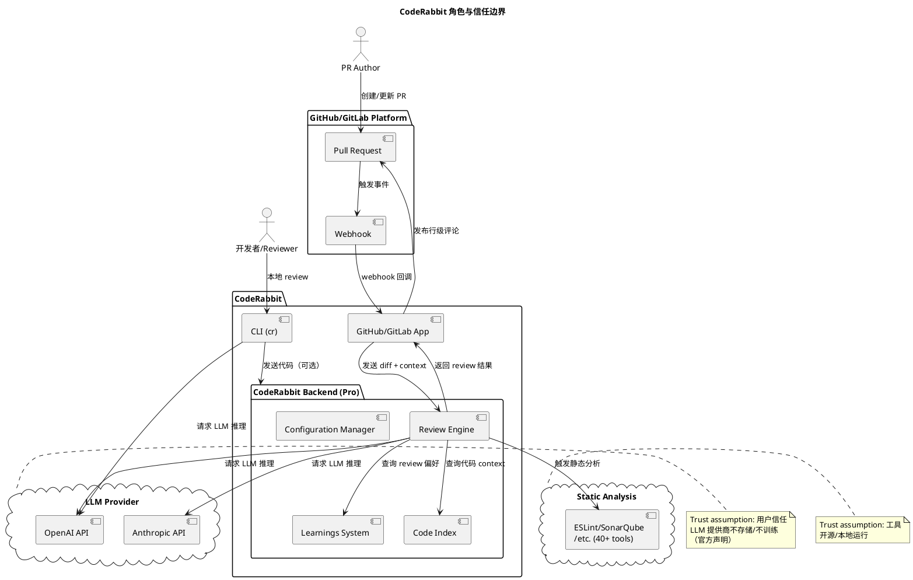
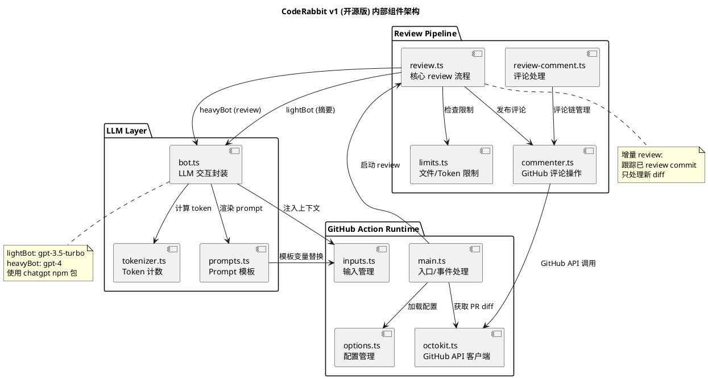
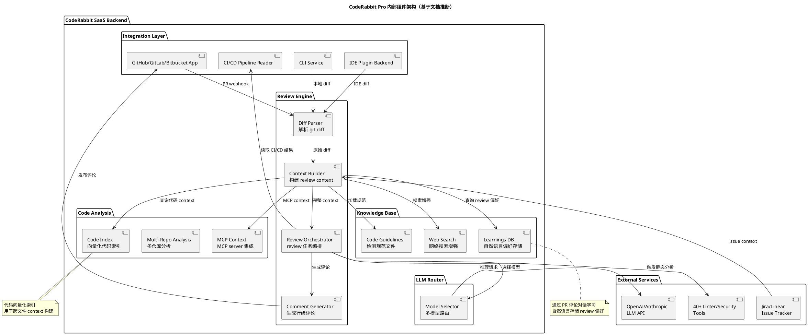
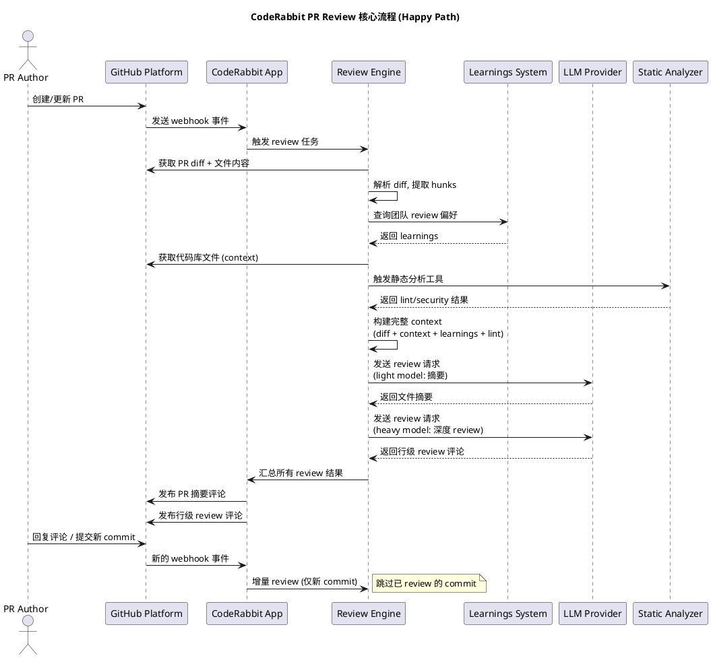

# CodeRabbit 框架深度分析

## 概述

CodeRabbit 是一个 AI 驱动的代码 review 框架/平台，分为开源版（GitHub Action）和 Pro 版（SaaS 服务），核心能力是对 PR diff 进行自动化 AI 分析并生成行级 review 评论。

开源版是用户自托管的 GitHub Action，使用 OpenAI API 直接进行 PR review；Pro 版是一个完整的 SaaS 平台，增加了 learnings 系统（自动学习团队 review 偏好）、code indexing（代码向量化）、CLI/IDE review、CI/CD pipeline 分析、Plan 功能（从 issue 到 coding plan 到 agent handoff）等企业级能力。

### 本质与表现形式

| 维度 | 说明 |
|------|------|
| 它是什么 | CodeRabbit 是一个 AI 驱动的代码 review 框架/平台，分为开源版（GitHub Action）和 Pro 版（SaaS 服务），核心能力是对 PR diff 进行自动化 AI 分析并生成行级 review 评论 |
| 表现形式 | 开源版：GitHub Action（TypeScript/Node.js）+ npm 包；Pro 版：SaaS Web 平台 + CLI 工具 + IDE 插件（VS Code/Cursor/Claude Code 等）+ GitHub/GitLab/Bitbucket App |
| 类比理解 | 类似于一个"拥有团队资深 reviewer 经验的 AI reviewer"，与传统 CI lint 工具（ESLint/SonarQube）互补而非替代——前者侧重 AI 语义理解，后者侧重静态分析 |
| 在模型中的位置 | 属于代码质量保障层的 AI review 工具，介于 CI/CD pipeline（下游）和 IDE 编码（上游）之间，核心输入是 git diff + repo context，核心输出是行级 review 评论 |

## 关键术语

| 术语 | 定义 | 在本题中的作用 |
|------|------|---------------|
| CodeRabbit Pro | CodeRabbit 的 SaaS 闭源版本，提供完整的企业级 AI review 能力 | Pro 版是本文的核心分析对象 |
| ai-pr-reviewer | CodeRabbit 的开源 v1 版本，GitHub Action 实现，使用 OpenAI API | 用于理解 CodeRabbit 的基础架构和演进起点 |
| diff/hunk | git diff 中的代码变更片段，是 review 的最小分析单元 | CodeRabbit 的输入基础 |
| incremental review | 增量 review，仅对 PR 中新的 commit 产生的变更进行 review，而非重复 review 整个 PR | CodeRabbit 的核心流程优化策略 |
| learnings | CodeRabbit Pro 的知识系统，通过自然语言对话学习团队的 review 偏好并持久化 | Pro 版区别于开源版的核心能力 |
| code indexing | CodeRabbit Pro 对代码库进行向量化索引，用于 context 构建 | Pro 版的 context 构建策略 |
| light/heavy model | CodeRabbit 双模型策略：light 模型用于摘要等轻量任务，heavy 模型用于深度 review。v1 代码默认值均为 gpt-3.5-turbo，用户配置中通常 heavy=gpt-4 | 核心 LLM 选择策略 |
| .coderabbit.yaml | CodeRabbit 的配置文件，定义 review 行为、路径指令、模型选择等 | 配置体系核心 |
| CLI (cr) | CodeRabbit 的命令行工具，支持未提交代码的本地 review | Pro 版扩展能力 |
| CodeRabbit Plan | 从 issue/PRD 生成 coding plan 并可 handoff 给 coding agent 的功能 | Pro 版的高级能力 |
| path_instructions | 针对不同文件路径的差异化 review 指令 | 配置体系的重要部分 |
| smart triage | 智能分拣机制，判断 diff 是否需要深度 review 还是可以直接 approve | 核心降噪策略 |
| AST-grep | CodeRabbit 集成的 AST 级代码分析工具 | 静态分析集成 |
| slop detection | 检测 AI 生成的低质量代码（slop）的功能（来源：CodeRabbit Pro 官方文档） | Pro 版的高级分析能力 |

## 分析正文

### 架构总览：开源版 vs Pro 版

#### 角色与信任边界

CodeRabbit 系统涉及三方控制方（用户、CodeRabbit、LLM 提供商）。

<!-- diagram: trust-boundaries | 展示 CodeRabbit 系统的参与方、通信关系和 trust assumption -->


**关键 trust assumption**：
- **LLM 提供商信任**：CodeRabbit 官方声明代码不用于 LLM 训练（L2 证据：官方 FAQ），但用户代码仍需发送给 OpenAI/Anthropic 处理
- **CodeRabbit SaaS 信任**：Pro 版用户代码可能经过 CodeRabbit 服务器缓存/索引，用户需信任其数据隔离
- **开源版数据路径**：开源版直接从用户 GitHub Action 调用 OpenAI API，不经过 CodeRabbit 服务器

#### 开源版（v1）内部组件

基于 `coderabbitai/ai-pr-reviewer` 仓库的源码分析（L2 证据）。

<!-- diagram: v1-architecture | 开源版 v1 内部组件分层和协作关系，基于源码分析 -->


#### Pro 版内部组件（基于文档推断）

Pro 版核心代码未开源。以下架构中，标注"确认"的组件来自官方文档（L2 证据），标注"推断"的组件为基于产品功能描述的内部结构推断（L4 证据）。

<!-- diagram: pro-architecture | Pro 版内部架构，基于官方文档推断。图中组件逐一分标注已确认/推断 -->


| 角色/组件族 | 是否复用开源版图 | 差异点 |
|------------|-----------------|--------|
| Pro Backend | 否，完全重新设计 | 增加了 learnings、code indexing、多平台集成、CI/CD 分析、CLI/IDE 支持 |
| Pro CLI | 否，独立实现 | 全新的 CLI 工具（cr），支持 agent 模式、本地 review |
| Pro LLM Router | 否，新增 | 开源版是固定的 light/heavy 双模型；Pro 版可能是多模型路由 |

### 核心流程

#### PR Review 核心流程（Happy Path）

<!-- diagram: pr-review-flow | PR 从创建到 review 发布的完整流程，展示跨角色交互 -->


**流程步骤说明**：
- PR 创建触发 webhook 事件，这是整个流程的起点。CodeRabbit 默认监听主分支（master/main），可配置为其他分支
- webhook 传递 PR 元数据（标题、描述、变更文件列表）
- 核心 review 逻辑：解析 diff，提取 hunks（变更片段），过滤 path（根据 .coderabbit.yaml 配置）
- Pro 版独有步骤：查询团队的 review 偏好，使 review 风格与团队习惯对齐
- **双阶段 LLM 调用**：先用 light model 做文件摘要，再用 heavy model 做深度 review。Pro 版可能增加了更多阶段
- **增量 review 机制**：CodeRabbit 跟踪已 review 的最高 commit hash，新 commit 只 review diff 部分，节省 token 和降低噪音

#### 状态转换

CodeRabbit 的 incremental review 依赖命名状态的 commit tracking。

| 当前状态 | 触发事件 | 转换结果 | 说明 |
|----------|----------|----------|------|
| 无已 review commit | PR 首次创建 | 记录 base commit hash | 从 PR 的 base 分支开始 review |
| 已有 reviewed commit | 新 commit 推送 | 比较 reviewed vs HEAD，提取增量 diff | 只 review 新增变更 |
| reviewed commit = HEAD | 无新 commit | 跳过 review | 无变更则不触发 |
| PR 被关闭/合并 | PR 状态变更 | 终止 review | PR 生命周期结束 |
| 用户在 PR 中回复 | @coderabbitai 提及 | 触发 chat/review 回复 | 进入对话模式 |

### 功能演进路径

CodeRabbit 从 2023 年至今经历了三个清晰的演进阶段。

#### 阶段一：开源 GitHub Action（2023.03 - 2023.09）

**核心特征**：开源、自托管、OpenAI API 直连

- **新增**：首个公开版本 `ai-pr-reviewer`（2023-03-09），基于 GitHub Action 实现
- **核心能力**：PR 摘要（gpt-3.5-turbo）、行级 review（gpt-4）、增量 review、智能 triage（NEEDS_REVIEW/APPROVED）、对话式交互（@coderabbitai）、path 过滤、自定义 system message
- **技术栈**：TypeScript/Node.js、`chatgpt` npm 包、OpenAI API 直连
- **发布节奏**：2023 年 3-9 月密集发布（v1.7 -> v1.16），月均 2-3 个版本
- **局限**：仅支持 GitHub、无持久化学习、无企业级配置管理、无 CLI/IDE 支持

#### 阶段二：SaaS Pro 平台化（2023 Q4 - 2024）

**核心特征**：闭源 SaaS、多平台支持、知识系统

- **新增**：CodeRabbit Pro SaaS 平台（coderabbit.ai），完全重写核心 engine
- **新增能力**：
  - GitLab 集成（2024）
  - Learnings 系统（自然语言学习 review 偏好）
  - .coderabbit.yaml 集中配置 + 配置继承体系
  - Learnings 从 PR 对话中自动提取并持久化
  - Committable suggestions（一键提交建议代码）
  - Request changes workflow
  - Issue validation（PR 变更 vs 关联 issue）
  - Jira/Linear 集成
  - Static analysis 集成（Hadolint、ast-grep）
  - Tone 个性化（可设置 reviewer 人格）
  - GDPR + SOC 2 Type II 合规
- **开源版定位调整**：`ai-pr-reviewer` 进入维护模式（maintenance mode），推荐用户迁移到 Pro

#### 阶段三：AI Agent 时代（2025 - 2026）

**核心特征**：CLI/IDE 本地 review、Plan 功能、Agent handoff

- **新增能力**：
  - **CLI 工具（cr）**：本地未提交代码 review，agent 模式（`--agent`）
  - **IDE 插件**：VS Code、Cursor、Claude Code、Codex、Gemini 集成
  - **CodeRabbit Plan**：从 issue/PRD 生成 coding plan -> refinement -> agent handoff
  - **CI/CD Pipeline Analysis**：读取 GitHub Actions/GitLab CI/CircleCI/Azure DevOps 失败日志，在对应代码行给出修复建议
  - **Code Guidelines**：自动检测 .cursorrules、CLAUDE.md、AGENTS.md 等 AI 编码助手配置文件并作为 review 标准
  - **Multi-Repo Analysis**：跨仓库代码分析
  - **MCP Context**：MCP server 集成
  - **Slop Detection**：检测 AI 生成的低质量代码
  - **Autofix**：一键修复建议
  - **Unit Test Generation**：自动生成单元测试
  - **Web Search**：网络搜索增强 review
  - **Bitbucket 集成**（2025）
  - **Self-hosted GitLab**：自托管 GitLab 支持

**演进规律**：从单点工具（GitHub Action）-> 平台（SaaS + 多平台）-> 生态（CLI/IDE + Agent + Plan）

### 开源程度分析

| 组件 | 开源程度 | 说明 |
|------|----------|------|
| ai-pr-reviewer (v1) | **完全开源**（MIT License） | 完整源码在 GitHub，可自行部署 |
| .coderabbit.yaml schema | **公开** | YAML schema 公开，可离线校验配置 |
| Pro SaaS Backend | **闭源** | 核心 review engine、learnings 系统、code indexing 均未开源 |
| Pro CLI (cr) | **闭源** | 二进制分发，源码未公开 |
| Pro IDE Plugins | **部分开源** | 部分插件可能开源，核心 backend 闭源 |
| CodeRabbit awesome list | **完全开源** | 社区资源列表 |

**能否自建**：开源版可以作为基础自建方案，但与 Pro 版差距巨大：
- 开源版仅支持 GitHub，Pro 版支持 GitHub/GitLab/Bitbucket
- 开源版无 learnings、无 code indexing、无 CI/CD 分析
- 开源版无 CLI/IDE 支持
- 开源版需自行维护 OpenAI API key 和费用

### v1 开源版详细技术分析（基于源码 L2 证据）

#### LLM 交互层

| 维度 | 细节 | 来源 |
|------|------|------|
| Wrapper | `chatgpt` npm 包 v5.2.5，使用 `ChatGPTAPI` 类 | bot.ts (L2-01) |
| 认证 | `OPENAI_API_KEY` 环境变量直连 | bot.ts (L2-01) |
| API Base | 默认 `https://api.openai.com/v1`，可自定义 `apiBaseUrl` | options.ts (L2-02) |
| 组织 | 支持 `OPENAI_API_ORG` 可选配置 | bot.ts (L2-01) |
| Token 管理 | `@dqbd/tiktoken` 计算 token 数 | package.json (L2-05) |
| 重试 | `p-retry` 包，默认 3 次重试 | options.ts (L2-02) |
| 超时 | 默认 120000ms（2 分钟） | options.ts (L2-02) |
| 并发 | OpenAI API 和 GitHub API 各 6 个并发请求 | options.ts (L2-02) |
| 温度 | 默认 0.0，可通过 `openai_model_temperature` 配置 | options.ts (L2-02) |
| 语言 | 默认 en-US，可通过 `language` 配置 | options.ts (L2-02) |

#### Review Pipeline

| 阶段 | 说明 | 使用的模型 |
|------|------|-----------|
| 1. Summarize | 生成 PR 变更总结（100 字内），关注签名/接口变更 | light model |
| 2. Triage | 将每个 diff 分类为 NEEDS_REVIEW 或 APPROVED | light model |
| 3. Changeset 分组 | 去重和分组相关变更 | light model |
| 4. 深度 Review | 对 NEEDS_REVIEW 的文件做行级 review | heavy model |
| 5. 评论发布 | 通过 GitHub API 发布行级评论和 PR 摘要 | - |

#### Smart Triage 机制

v1 版的 `triageFileDiff` prompt（prompts.ts, L2-03）明确要求：
- 任何逻辑/功能变更（控制结构、函数调用、变量赋值）-> `NEEDS_REVIEW`
- 仅 typo/格式化/重命名 -> `APPROVED`
- 不确定时倾向 `NEEDS_REVIEW`（保守策略）
- 严格格式：`[TRIAGE]: <NEEDS_REVIEW or APPROVED>`
- triage 结果不混入 summary，避免影响 review 质量

#### 包名演进

原始包名为 `openai-pr-reviewer`（见 package.json 的 `repository.url` 中的 `fluxninja/openai-pr-reviewer`），后迁移至 `coderabbitai` 组织。这印证了 CodeRabbit 从 OpenAI 直连工具演变为独立品牌 SaaS 的路径。

### 区块链（Solidity）和 Java/后端场景覆盖度

#### Solidity/智能合约

| 维度 | 评估 | 依据 |
|------|------|------|
| 语言支持 | **通用支持** | 官方声称 "works with all programming languages"（L2 证据：官方文档），基于 LLM 通用代码理解能力 |
| 专项 security pattern | **未确认** | 官方文档未单独列出 Solidity 专项 security check |
| 静态分析集成 | **可能支持** | 通过集成外部 linter（如 Slither）理论上可行，但文档未明确提及 |
| path_instructions 定制 | **支持** | 可通过 `.coderabbit.yaml` 的 path_instructions 为 `**/*.sol` 配置专门的 review 指令 |
| learnings 适配 | **支持** | 团队可通过对话 teach CodeRabbit 智能合约 review 偏好 |

#### Java/后端

| 维度 | 评估 | 依据 |
|------|------|------|
| 语言支持 | **通用支持** | LLM 对 Java 有良好训练数据覆盖 |
| 静态分析集成 | **支持** | 可集成 Checkstyle、SpotBugs、SonarQube 等 Java linter |
| 企业配置 | **强支持** | 配置示例中明确提及 Java tone_instructions |
| path_instructions | **支持** | 可针对 `**/*.java` 配置专门 review 指令 |
| CI/CD 分析 | **支持** | 支持 GitHub Actions/GitLab CI 的 Java build 失败分析 |

## 设计取舍

| 设计决策 | 选择方案 | 替代方案 | 取舍原因 |
|----------|----------|----------|----------|
| 双模型策略（light + heavy） | light/heavy 模型分离，代码默认均为 gpt-3.5-turbo，推荐配置 heavy=gpt-4 | 全部使用单一模型 | 降低 API 成本（摘要任务不需要 gpt-4），同时保证 review 质量。Pro 版可能演进为多模型路由。注意：代码默认 light=heavy=gpt-3.5-turbo（options.ts L2-02 证据），实际双模型效果依赖用户 action.yml 配置 |
| 增量 review | 跟踪已 review commit hash，只 review diff | 每次 review 整个 PR | 节省 token 成本、降低评论噪音、加快响应速度。但可能导致错过跨 commit 的全局问题 |
| Smart triage | 通过 LLM 判断 diff 是否需要 review（NEEDS_REVIEW/APPROVED） | 对所有 diff 一律深度 review | 减少简单变更（如 typo fix）的 review 噪音。但可能漏判需要 review 的变更 |
| 开源版 vs Pro 版分离 | v1 开源版进入维护模式，Pro 版完全重写 | 在开源版上持续迭代 | Pro 版需要 learnings、code indexing 等企业级能力，与开源版架构不兼容。分离后可独立演进 |
| 使用 OpenAI API 直连（v1） | GitHub Action 直接调用 OpenAI API | 通过 CodeRabbit 中转服务器 | 降低 v1 版的运维复杂度，用户自行管理 API key。但无法提供 learnings 等持久化能力 |
| Prompt-based review（v1） | 使用精心设计的 prompt 模板（summarizeFileDiff、triageFileDiff、reviewFileDiff） | fine-tune 专用模型 | 避免 fine-tune 的维护成本，通过 prompt 工程即可适配不同场景。v1 源码显示所有 prompt 均为模板字符串，使用 `$title`、`$description`、`$file_diff` 等变量替换。但效果受限于 prompt 质量和 LLM 理解能力 |
| 基于 git diff 的输入 | 以 diff/hunk 为最小 review 单元 | 以整个文件为 review 单元 | 降低 token 消耗、聚焦变更部分。但缺乏对整个文件上下文的全局视角（Pro 版通过 code indexing 弥补） |

## 边界与前提

### 能力边界表

| 能力 | 由什么保证 | 前提/依赖 |
|------|-----------|----------|
| PR 摘要生成 | LLM（light model） | PR diff 不超过 token 限制 |
| 行级 review 评论 | LLM（heavy model） | diff hunk 不超过 token 限制，可 pack |
| 增量 review | commit tracking 机制 | 用户不 force-push/rewrite history |
| 对话式交互 | GitHub comment API | 用户在 PR 中 @coderabbitai |
| 团队偏好学习（learnings） | Pro 版 learnings 系统 | 用户通过对话提供反馈 |
| CI/CD 失败分析 | Pro 版 CI/CD reader | CI/CD 平台 API 可访问 |
| 代码规范遵循 | Code Guidelines 自动检测 | 仓库中存在 .cursorrules/CLAUDE.md 等文件 |
| 静态分析 | 集成 40+ 开源 linter | 用户启用对应工具 |
| 本地代码 review | Pro CLI | 本地有 git repo |

### 能解决什么 / 不能解决什么

| 能解决 | 不能解决 |
|--------|----------|
| PR 变更的 AI 自动化 review | IDE 内实时补全（非 CodeRabbit 的定位） |
| 团队 review 偏好的持久化学习 | CI/CD 编排/执行（只分析结果，不执行） |
| CI/CD 失败原因分析 + 行级修复建议 | 代码执行/运行时 bug 检测（无执行环境） |
| 跨仓库代码影响分析 | 编译/构建（不执行 build） |
| 本地未提交代码的预 review | 完整的 security audit（依赖外部工具） |
| 从 issue 生成 coding plan | 代码部署 |

### 能力状态区分

| 状态 | 能力 | 依据 |
|------|------|------|
| **已上线** | PR review、learnings、CLI、IDE 插件、CI/CD 分析、Plan、code guidelines、static analysis | 官方文档明确说明（L2） |
| **已上线** | Bitbucket 集成 | 文档导航中可见（L2） |
| **可能已上线** | 多模型自动路由（Pro 版） | 文档未明确说明具体模型选择策略 |
| **未确认** | Solidity 专项 security pattern | 官方文档未单独列出 |

## 相关对象关系

CodeRabbit 作为 AI code review 框架，与以下对象存在关系：

- **上游**：IDE 编码工具（Cursor/Claude Code/Codex）——CodeRabbit 的 CLI/IDE 插件与这些工具集成，形成 "编码 -> 本地 review -> PR review" 的完整链路
- **下游**：CI/CD pipeline（GitHub Actions/GitLab CI）——CodeRabbit 消费 CI/CD 结果进行失败分析
- **互补**：静态分析工具（ESLint/SonarQube/Slither）——CodeRabbit 集成这些工具，AI review 侧重语义理解，静态分析侧重规则检测
- **替代**：GitHub Copilot code review、Codiumate、Greptile —— 这些是同类竞品，但横向对比由 synthesis 处理
- **集成**：Jira/Linear（issue tracker）、MCP servers（context 扩展）

## 结论

### 已确认

1. **【L2 证据】** CodeRabbit 由两个版本组成：开源版 `ai-pr-reviewer`（GitHub Action，MIT License）和 Pro 版 SaaS（闭源核心，coderabbit.ai）
2. **【L2 证据】** 开源版使用双模型策略：`openaiLightModel` 和 `openaiHeavyModel`（代码默认值均为 `gpt-3.5-turbo`，用户通过 action.yml 配置 heavy 为 `gpt-4`），基于 `chatgpt` npm 包 v5.2.5（`ChatGPTAPI` 类，bot.ts），直连 OpenAI API（`OPENAI_API_KEY`），默认重试 3 次、超时 120s、并发 6（options.ts）
3. **【L2 证据】** 开源版实现了增量 review 机制（commit tracking）、smart triage（NEEDS_REVIEW/APPROVED，通过独立 triageFileDiff prompt 实现，prompts.ts）、path 过滤（minimatch）、自定义 system message
4. **【L2 证据】** Pro 版增加了 learnings 系统（自然语言学习 review 偏好）、code indexing（向量化代码索引）、CLI/IDE review、CI/CD 分析、Plan 功能（官方文档）
5. **【L2 证据】** Pro 版支持 GitHub/GitLab/Bitbucket 多平台
6. **【L2 证据】** Pro 版集成 40+ 静态分析工具（官方文档提及）
7. **【L2 证据】** Pro 版自动检测 .cursorrules/CLAUDE.md/AGENTS.md 等 AI 编码助手配置文件
8. **【L2 证据】** CodeRabbit 官方声明代码不用于 LLM 训练，用户可选择不存储代码（官方 FAQ）
9. **【L2 证据】** v1 版原始包名为 `openai-pr-reviewer`（fluxninja 组织），后迁移至 `coderabbitai` 组织，印证了从 OpenAI 工具到独立品牌的演进路径（package.json）

### 尚需验证

10. **【L2 证据，策略未公开】** Pro 版使用的具体 LLM 模型清单和路由策略未公开，可能使用 OpenAI + Anthropic + 其他多模型
11. **【L2 证据，覆盖度未明确】** Solidity/智能合约的具体覆盖度未明确说明，依赖 LLM 通用代码理解 + 用户自定义 path_instructions
12. **【L4 证据，推断】** Pro 版的 code indexing 可能使用 vector embedding 技术，但具体模型（如 text-embedding-3、Codex embeddings）和索引方案未公开
13. **【L4 证据，推断】** CLI 版与 PR review 版可能共享底层 review engine，因为官方文档提到 "same pattern recognition"
14. **【L4 证据，推断】** Pro 版可能使用 OpenAI 和 Anthropic 的多个模型（非固定 light/heavy），因为企业场景需要更灵活的模型选择

## 证据缺口

以下领域存在已知证据缺口，后续研究需注意：

1. **Pro 版 LLM 策略未公开**：官方未明确说明 Pro 版使用的具体模型清单和路由策略
2. **Pro 版内部架构未开源**：核心 review engine、context 构建、learnings 存储均未开源
3. **Solidity/智能合约专项覆盖度**：官方文档未单独说明对 Solidity 的专项支持程度
4. **CI/CD 分析的具体检测能力**：文档只说明支持平台，未详细说明检测范围

## 参考资料

| 来源 | 说明 | 证据等级 |
|------|------|----------|
| https://docs.coderabbit.ai/ | CodeRabbit Pro 官方文档 | L2 |
| https://github.com/coderabbitai/ai-pr-reviewer | v1 开源版源码（TypeScript/Node.js, MIT） | L2 |
| https://github.com/coderabbitai/awesome-coderabbit | 官方 awesome list | L2 |
| https://docs.coderabbit.ai/changelog | Pro 版 changelog | L2 |
| https://coderabbit.ai/integrations/schema.v2.json | 配置文件 schema | L2 |
| https://docs.coderabbit.ai/faq | 官方 FAQ | L2 |
| https://docs.coderabbit.ai/knowledge-base/learnings | Learnings 系统文档 | L2 |
| https://docs.coderabbit.ai/knowledge-base/code-guidelines | Code Guidelines 文档 | L2 |
| https://docs.coderabbit.ai/cli | CLI 文档 | L2 |
| https://docs.coderabbit.ai/configuration/central-configuration | 集中配置文档 | L2 |
| https://docs.coderabbit.ai/pr-reviews/cicd-pipeline-analysis | CI/CD 分析文档 | L2 |
| https://raw.githubusercontent.com/coderabbitai/ai-pr-reviewer/main/src/bot.ts | v1 LLM 交互层源码 | L2 |
| https://raw.githubusercontent.com/coderabbitai/ai-pr-reviewer/main/src/options.ts | v1 配置管理源码 | L2 |
| https://raw.githubusercontent.com/coderabbitai/ai-pr-reviewer/main/src/prompts.ts | v1 Prompt 设计源码 | L2 |
| https://raw.githubusercontent.com/coderabbitai/ai-pr-reviewer/main/package.json | v1 依赖清单 | L2 |
| https://github.com/obra/coderabbit-review-helper | 第三方 review 提取工具 | L4 |
| https://github.com/bradthebeeble/coderabbitai-mcp | 第三方 MCP server | L4 |
| https://github.com/eersnington/diff0 | 开源替代实现 | L4 |

## 变更追溯

```yaml
change_trace:
  change_id: coderabbit-framework
  change_path: openspec/changes/coderabbit-framework/
  research_type: primitive
  research_path: deep-dive
  domain_id: ai-code-review
  topic_slug: coderabbit-framework
  outputs:
    - knowledge/analysis/primitives/ai-code-review/coderabbit-framework/artifact.md
```
