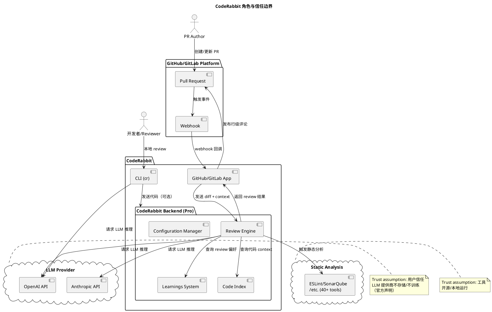
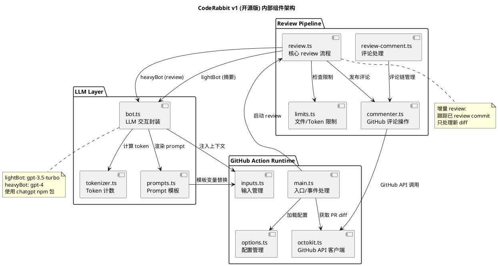
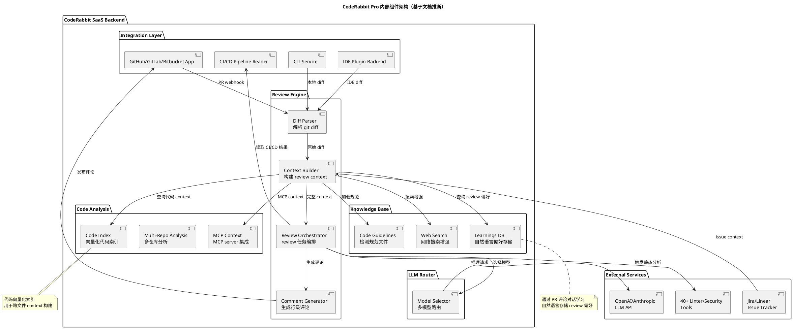
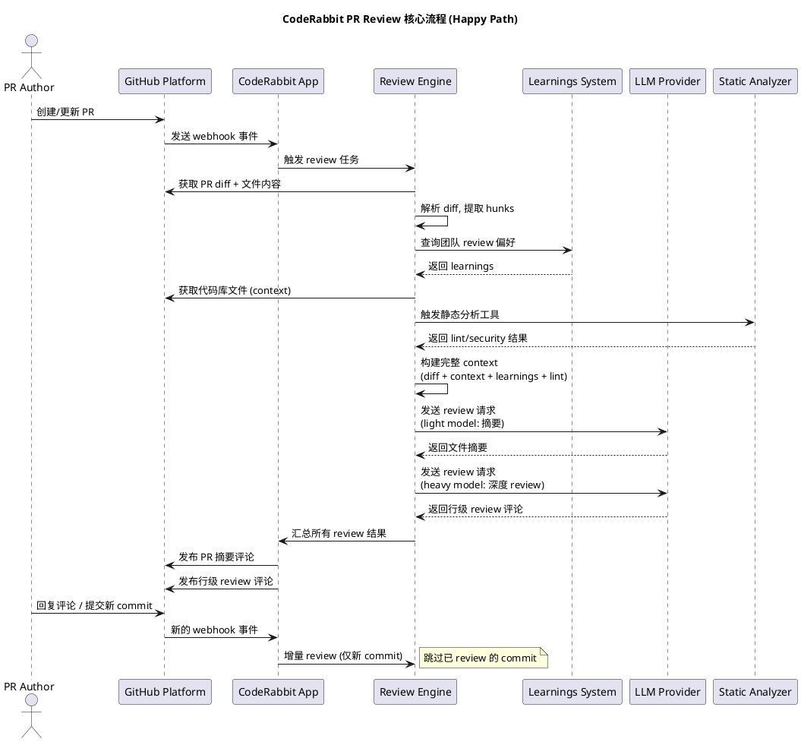

<!-- 目录 -->
- [概述](#概述)
- [关键术语](#关键术语)
- [分析正文](#分析正文)
  - [架构演进路径](#架构演进路径)
    - [阶段一：OpenAI 直连工具（2023.03 - 2023.09）](#阶段一openai-直连工具202303---202309)
    - [阶段二：SaaS Pro 平台化（2023 Q4 - 2024）](#阶段二saas-pro-平台化2023-q4---2024)
    - [阶段三：Hybrid AI Pipeline（2024 - 2025 Q2）](#阶段三hybrid-ai-pipeline2024---2025-q2)
    - [阶段四：Coordinated Multi-Agent（2025 Q2 - 至今）](#阶段四coordinated-multi-agent2025-q2---至今)
    - [架构演进趋势总结](#架构演进趋势总结)
  - [架构总览：开源版 vs Pro 版](#架构总览开源版-vs-pro-版)
    - [角色与信任边界](#角色与信任边界)
    - [开源版（v1）内部组件](#开源版v1内部组件)
    - [Pro 版内部组件（基于文档推断）](#pro-版内部组件基于文档推断)
  - [核心流程](#核心流程)
    - [PR Review 核心流程（Happy Path）](#pr-review-核心流程happy-path)
    - [状态转换](#状态转换)
  - [开源程度分析](#开源程度分析)
  - [v1 开源版详细技术分析（基于源码 L2 证据）](#v1-开源版详细技术分析基于源码-l2-证据)
  - [最新架构详解：Hybrid AI 本质](#最新架构详解hybrid-ai-本质)
  - [Context Engineering 体系](#context-engineering-体系)
  - [能力边界与场景覆盖](#能力边界与场景覆盖)
- [设计取舍](#设计取舍)
- [边界与前提](#边界与前提)
- [相关对象关系](#相关对象关系)
- [结论](#结论)
- [证据缺口](#证据缺口)
- [参考资料](#参考资料)
- [变更追溯](#变更追溯)

## 概述

CodeRabbit 是一个 AI 驱动的代码 review 框架/平台，分为开源版（GitHub Action）和 Pro 版（SaaS 服务），核心能力是对 PR diff 进行自动化 AI 分析并生成行级 review 评论。按 GitHub 安装量和官方文档覆盖度，它是该领域部署最广泛的 AI review 工具之一。

开源版是用户自托管的 GitHub Action，使用 OpenAI API 直接进行 PR review；Pro 版是一个完整的 SaaS 平台，增加了 learnings 系统（自动学习团队 review 偏好）、code indexing（代码索引）、CLI/IDE review、CI/CD pipeline 分析、Plan 功能（从 issue 到 coding plan 到 agent handoff）等企业级能力。

**核心定位**：CodeRabbit 的架构本质不是纯 Multi-agent 系统，而是 **"workflow-embedded hybrid AI"** ——以确定性 pipeline 为主干，在需要深度推理的环节嵌入 agentic loop。这是 VP of AI David Loker 在 2025 年 5 月官方博客和 InfoWorld 专访中明确阐述的架构理念。

### 本质与表现形式

| 维度 | 说明 |
|------|------|
| 它是什么 | CodeRabbit 是一个 AI 驱动的代码 review 框架/平台，分为开源版（GitHub Action）和 Pro 版（SaaS 服务），核心能力是对 PR diff 进行自动化 AI 分析并生成行级 review 评论 |
| 架构本质 | workflow with models（各阶段选用不同模型）+ two agentic loops（仅在需要深度推理处嵌入自主决策），不是纯 agentic 也不是纯 pipeline |
| 表现形式 | 开源版：GitHub Action（TypeScript/Node.js）+ npm 包；Pro 版：SaaS Web 平台 + CLI 工具 + IDE 插件（VS Code/Cursor/Claude Code 等）+ GitHub/GitLab/Bitbucket App |
| 类比理解 | 类似于一个"拥有团队资深 reviewer 经验的 AI reviewer"，与传统 CI lint 工具（ESLint/SonarQube）互补而非替代——前者侧重 AI 语义理解，后者侧重静态分析 |
| 在模型中的位置 | 属于代码质量保障层的 AI review 工具，介于 CI/CD pipeline（下游）和 IDE 编码（上游）之间，核心输入是 git diff + repo context，核心输出是行级 review 评论 |

## 关键术语

| 术语 | 定义 | 在本题中的作用 |
|------|------|---------------|
| CodeRabbit Pro | CodeRabbit 的 SaaS 闭源版本，提供完整的企业级 AI review 能力 | Pro 版是本文的核心分析对象 |
| ai-pr-reviewer | CodeRabbit 的开源 v1 版本，GitHub Action 实现，使用 OpenAI API | 用于理解 CodeRabbit 的基础架构和演进起点 |
| diff/hunk | git diff 中的代码变更片段，是 review 的最小分析单元 | CodeRabbit 的输入基础 |
| incremental review | 增量 review，仅对 PR 中新的 commit 产生的变更进行 review，而非重复 review 整个 PR | CodeRabbit 的核心流程优化策略 |
| learnings | CodeRabbit Pro 的知识系统，通过自然语言对话学习团队的 review 偏好并持久化 | Pro 版区别于开源版的核心能力，Living Memory agent 的核心数据源 |
| code indexing | CodeRabbit Pro 对代码库进行索引（官方文档提及"code indexing"，具体技术未公开），用于 context 构建 | Context engineering 的关键组件 |
| light/heavy model | CodeRabbit 双模型策略：light 模型用于摘要等轻量任务，heavy 模型用于深度 review。v1 代码默认值均为 gpt-3.5-turbo，用户配置中通常 heavy=gpt-4 | 核心 LLM 选择策略 |
| .coderabbit.yaml | CodeRabbit 的配置文件，定义 review 行为、路径指令、模型选择等 | 配置体系核心 |
| CLI (cr) | CodeRabbit 的命令行工具，支持未提交代码的本地 review | Pro 版扩展能力 |
| CodeRabbit Plan | 从 issue/PRD 生成 coding plan 并可 handoff 给 coding agent 的功能 | Pro 版的高级能力 |
| path_instructions | 针对不同文件路径的差异化 review 指令 | 配置体系的重要部分 |
| smart triage | 智能分拣机制，判断 diff 是否需要深度 review 还是可以直接 approve | 核心降噪策略 |
| AST-grep | CodeRabbit 集成的 AST 级代码分析工具 | 静态分析集成 |
| slop detection | 检测 AI 生成的低质量代码（slop）的功能（来源：CodeRabbit Pro 官方文档） | Pro 版的高级分析能力 |
| Hybrid AI | 结合 pipeline 的确定性与 agentic 的灵活性，不是二选一而是光谱上的某一点 | CodeRabbit 当前架构的本质 |
| Agentic Loop | 模型可以 reason → act → observe → repeat 的自主决策循环 | CodeRabbit 有两处嵌入 |
| Context Engineering | 从多来源组装正确信息、以正确结构、在正确时机提供给模型的过程 | CodeRabbit 的核心竞争力，而非 prompt engineering |
| Specialized Agents | Review / Verification / Chat / Pre-Merge Checks / Living Memory | 最新架构的 5 个并行 agent |
| Prompt Engineering | crafting 指令让模型执行特定任务 | v1 时代的核心方法，已被 context engineering 取代 |
| Context Curation | 主动筛选和过滤 context，而非被动堆砌 | CodeRabbit 与纯 agentic 方案的分水岭 |

## 分析正文

### 架构演进路径

CodeRabbit 从 2023 年至今经历了**四个清晰的架构演进阶段**，每个阶段的核心架构模式、被抛弃的选择和抛弃原因都不同。

#### 阶段一：OpenAI 直连工具（2023.03 - 2023.09）

**核心架构模式**：Single-pipeline，OpenAI API 直连，prompt-based review

这是 CodeRabbit 的起点。以 `ai-pr-reviewer`（开源 v1）为代表，架构极其简单：GitHub Action 运行时 → Review Pipeline → LLM Layer（light/heavy 双 bot）。

| 维度 | 说明 |
|------|------|
| 架构模式 | **Single-pipeline**：线性流程，从 diff 获取到 review 评论发布，没有中间状态持久化 |
| 输入 | git diff + PR metadata + `.coderabbit.yaml` 配置 |
| 处理 | 5 阶段 pipeline：Summarize → Triage → Changeset 分组 → 深度 Review → 评论发布 |
| LLM 策略 | light model（gpt-3.5-turbo）用于摘要和 triage，heavy model（gpt-4）用于深度 review |
| Context 构建 | 仅 diff/hunk，无额外 context 获取 |
| 持久化 | 无。每次 review 独立运行，不保留状态（除 commit hash tracking 用于增量 review） |

- **新增**：首个公开版本 `ai-pr-reviewer`（2023-03-09），基于 GitHub Action 实现
- **核心能力**：PR 摘要（gpt-3.5-turbo）、行级 review（gpt-4）、增量 review、智能 triage（NEEDS_REVIEW/APPROVED）、对话式交互（@coderabbitai）、path 过滤、自定义 system message
- **技术栈**：TypeScript/Node.js、`chatgpt` npm 包、OpenAI API 直连
- **发布节奏**：2023 年 3-9 月密集发布（v1.7 → v1.16），月均 2-3 个版本
- **局限**：仅支持 GitHub、无持久化学习、无企业级配置管理、无 CLI/IDE 支持

**抛弃了什么**：
- ~~无持久化~~：每次 review 是 stateless 的，无法学习团队偏好
- ~~单平台~~：仅支持 GitHub，无法扩展到 GitLab/Bitbucket
- ~~OpenAI 直连~~：用户需自行管理 API key，无法提供统一的模型服务
- ~~Prompt-only~~：仅靠 prompt template 驱动，无 context 工程

**为什么进入下一阶段**：用户需要 learnings、多平台支持、企业级配置管理，这些在 stateless GitHub Action 架构下无法实现。

#### 阶段二：SaaS Pro 平台化（2023 Q4 - 2024）

**核心架构模式**：Centralized SaaS pipeline，context enrichment + knowledge base

完全重写了核心 engine，从 stateless GitHub Action 迁移到集中式 SaaS 后端。这是架构的第一次大跳跃。

| 维度 | 说明 |
|------|------|
| 架构模式 | **Centralized SaaS pipeline**：所有 review 请求经过 CodeRabbit 服务器，统一处理 |
| 新增组件 | Learnings DB、Code Index（官方文档提及"code indexing"，具体技术未公开）、Configuration Manager、多平台 App（GitHub/GitLab） |
| LLM 策略 | 仍是 light/heavy 双模型，但可能扩展了模型选择（官方未公开 Pro 版具体模型） |
| Context 构建 | diff + learnings + code guidelines + code indexing |
| 持久化 | **新增 learnings 系统**：从 PR 对话中提取 review 偏好并持久化 |

- **新增**：CodeRabbit Pro SaaS 平台（coderabbit.ai），完全重写核心 engine
- **新增能力**：
  - GitLab 集成（2024）
  - Learnings 系统（自然语言学习 review 偏好）
  - .coderabbit.yaml 集中配置 + 配置继承体系
  - Learnings 从 PR 对话中自动提取并持久化
  - Committable suggestions（一键提交建议代码）
  - Request changes workflow
  - Issue validation（PR 变更 vs 关联 issue）
  - Jira/Linear 集成
  - Static analysis 集成（Hadolint、ast-grep）
  - Tone 个性化（可设置 reviewer 人格）
  - GDPR + SOC 2 Type II 合规
- **开源版定位调整**：`ai-pr-reviewer` 进入维护模式（maintenance mode），推荐用户迁移到 Pro

**抛弃了什么**：
- ~~OpenAI API 直连~~：改为 CodeRabbit 服务器统一调用 LLM，用户不再需要管理 API key
- ~~GitHub Action 运行时~~：Pro 版完全脱离 GitHub Action，使用自有的 webhook 处理引擎
- ~~Stateless 设计~~：引入 learnings 系统和 code index，review 有了历史记忆
- ~~开源版迭代路径~~：v1 进入 maintenance mode，不再在开源版上新增功能

**为什么进入下一阶段**：SaaS 化后，CodeRabbit 面临新的瓶颈——context 质量成为 review 质量的关键。单纯的 pipeline 无法动态获取足够的 context（如跨文件依赖、AST 关系），而全量 context 又会淹没模型。

#### 阶段三：Hybrid AI Pipeline（2024 - 2025 Q2）

**核心架构模式**：Deterministic pipeline + embedded agentic loops，从 prompt engineering 走向 context engineering

这是 CodeRabbit 架构哲学的一次关键转变。VP of AI David Loker 在 2025 年 5 月官方博客中明确阐述了这一转变。

**核心架构理念转变**：

| 从 | 到 | 说明 |
|---|---|---|
| Prompt Engineering | **Context Engineering** | 不再是 crafting 聪明的指令，而是从多来源组装正确信息 |
| 纯 Pipeline | **Hybrid AI** | 保留 pipeline 的确定性和速度，在关键环节嵌入 agentic 能力 |
| 全量 Context | **Context Curation** | 不是给模型越多 context 越好，而是主动筛选和过滤 |
| Model-centric | **Workflow-centric** | 不是从一个 LLM 开始希望它做好一切，而是先构建 workflow skeleton，再在需要的地方嵌入模型 |

**Context Engineering 体系**（8 来源）：

| Context 来源 | 类型 | 作用 |
|-------------|------|------|
| git diff | 确定性 | review 的最小单元，变更本身 |
| 完整文件 | 确定性 | diff 所在的完整文件上下文 |
| Import Graph | 探索性 | 通过依赖图发现相关文件 |
| AST 分析 | 探索性 | 语法树级别的代码关系 |
| Static Analysis（40+ 工具） | 确定性 | lint/security 结果 |
| Learnings | 持久化 | 团队历史 review 偏好 |
| MCP-connected docs | 探索性 | 外部文档和 API 文档 |
| Web-fetched library docs | 探索性 | 网络搜索获取库文档 |

**两个 Agentic Loop**（InfoWorld 专访确认）：

1. **Review 前 agentic loop**：在深度 review 之前，agent 自主探索代码库，通过文件读取、搜索、AST 查找等方式确定"应该给模型看什么"
2. **Review 后 agentic loop**：在 review 结果生成后，agent 自主验证和补充，确保 review 质量

**抛弃了什么**：
- ~~纯 pipeline 架构~~：在 pipeline 中嵌入 agentic loop，不再是线性流程
- ~~全量 context 策略~~：改为 context curation，主动过滤和筛选
- ~~Prompt engineering 为核心~~：context engineering 成为核心竞争力

**为什么进入下一阶段**：Hybrid AI pipeline 解决了单个 PR review 的 context 质量问题。但随着平台发展，CodeRabbit 需要支持更多并行的专业化任务（verification、chat、pre-merge、memory），这自然演化为 coordinated multi-agent 架构。

#### 阶段四：Coordinated Multi-Agent（2025 Q2 - 至今）

**核心架构模式**：Coordinated multi-agent with specialized agents，pipeline 为骨架，agents 为血肉

这是 CodeRabbit 的最新架构。官方架构页面明确列出了 **5 个 specialized AI agents working in parallel**：Review、Verification、Chat、Pre-Merge Checks、Living Memory。

| Agent | 职责 | 为什么需要 |
|-------|------|-----------|
| **Review Agent** | 核心 PR review，生成行级评论 | 主流程，需要深度推理和代码理解 |
| **Verification Agent** | 验证 review 结果的准确性，减少 false positive | 质量保障，解决 AI review 的信任问题 |
| **Chat Agent** | 处理用户在 PR 中的自然语言对话和追问 | 交互性任务，需要理解对话上下文 |
| **Pre-Merge Checks Agent** | 合并前的自定义检查和验证 | 确定性+agentic 混合，确保合并安全 |
| **Living Memory Agent** | 从 PR 对话、issue、code guidelines 中持续学习 | 持久化团队知识，让 review 越来越精准 |

**为什么是 5 个，不多不少**：

这 5 个 agent 覆盖了 PR review 全生命周期的 **5 个正交职责**，每个职责的输入、输出、推理模式都不同：

1. **Review** 是核心推理任务（diff → comment），需要深度代码理解
2. **Verification** 是验证任务（comment → validated comment），需要判断 review 是否正确
3. **Chat** 是对话任务（question → answer），需要理解自然语言和历史上下文
4. **Pre-Merge** 是检查任务（PR → pass/fail），需要执行自定义规则和检查
5. **Living Memory** 是学习任务（interactions → knowledge），需要提取和持久化模式

如果合并 Review 和 Verification，会降低各自的专业化程度；如果拆分成更多 agent（如把 Security Review 单独拆出来），会增加协调开销且没有明显的正交性收益。

**架构不是纯 Multi-Agent**：

CodeRabbit 的架构本质仍是 **hybrid AI**，而非纯 multi-agent。关键区别：

| 维度 | 纯 Multi-Agent | CodeRabbit Hybrid AI |
|------|--------------|---------------------|
| 控制流 | agents 自主决策和协调 | pipeline 为主干，agent 在固定环节执行 |
| 上下文 | agents 自主获取 context | context 由 pipeline 阶段 curated |
| 可预测性 | 较低（agents 可能做出意外决策） | 较高（pipeline 定义了固定的执行路径） |
| 调试 | 困难（agent 间的交互难以追踪） | 相对容易（每个环节有明确的输入输出） |
| CI/CD 集成 | 不适合（速度不可预测） | 适合（pipeline 保证了速度下限） |

正如 Loker 所说："a workflow with models chosen at various stages... with agentic loops using other model choices" —— **workflow 是骨架，模型和 agentic loop 是血肉**。

- **新增能力**：
  - **CLI 工具（cr）**：本地未提交代码 review，agent 模式（`--agent`）
  - **IDE 插件**：VS Code、Cursor、Claude Code、Codex、Gemini 集成
  - **CodeRabbit Plan**：从 issue/PRD 生成 coding plan → refinement → agent handoff
  - **CI/CD Pipeline Analysis**：读取 GitHub Actions/GitLab CI/CircleCI/Azure DevOps 失败日志，在对应代码行给出修复建议
  - **Code Guidelines**：自动检测 .cursorrules、CLAUDE.md、AGENTS.md 等 AI 编码助手配置文件并作为 review 标准
  - **Multi-Repo Analysis**：跨仓库代码分析
  - **MCP Context**：MCP server 集成
  - **Slop Detection**：检测 AI 生成的低质量代码
  - **Autofix**：一键修复建议
  - **Unit Test Generation**：自动生成单元测试
  - **Web Search**：网络搜索增强 review
  - **Bitbucket 集成**（2025）
  - **Self-hosted GitLab**：自托管 GitLab 支持

**抛弃了什么**：
- ~~单一 Review Engine~~：拆分为 5 个 specialized agents 并行工作
- ~~一次性 review~~：通过 Living Memory 实现持续学习和改进
- ~~Review 后无验证~~：新增 Verification agent 确保 review 质量

#### 架构演进趋势总结

从架构视角看，CodeRabbit 的演进路径是：

```
OpenAI 直连工具 → SaaS Pro 平台化 → Hybrid AI Pipeline → Coordinated Multi-Agent
   (2023)           (2023-2024)         (2024-2025 Q2)       (2025 Q2-)

核心驱动力：
  Stateless → Stateful → Context-Aware → Continuously Learning
  Prompt Engineering → Context Engineering
  Single Pipeline → Hybrid AI → Coordinated Multi-Agent
  模型为中心 → Workflow 为中心
```

**不变的核心**：以 git diff 为输入、以行级 review 评论为输出、以增量 review 为优化策略。

**变化的部分**：
- Context 从单一 diff 扩展到 8+ 来源的 curated context
- 从 prompt engineering 走向 context engineering
- 从无状态走向持续学习（Living Memory）
- 从单一 review engine 走向 5 个 specialized agents
- 从纯 pipeline 走向 hybrid AI

---

### 架构总览：开源版 vs Pro 版

#### 角色与信任边界

CodeRabbit 系统涉及三方控制方（用户、CodeRabbit、LLM 提供商）。

<!-- diagram: trust-boundaries | 展示 CodeRabbit 系统的参与方、通信关系和 trust assumption -->


**关键 trust assumption**：
- **LLM 提供商信任**：CodeRabbit 官方声明代码不用于 LLM 训练（L2 证据：官方 FAQ），但用户代码仍需发送给 OpenAI/Anthropic 处理
- **CodeRabbit SaaS 信任**：Pro 版用户代码可能经过 CodeRabbit 服务器缓存/索引，用户需信任其数据隔离
- **开源版数据路径**：开源版直接从用户 GitHub Action 调用 OpenAI API，不经过 CodeRabbit 服务器

#### 开源版（v1）内部组件

基于 `coderabbitai/ai-pr-reviewer` 仓库的源码分析（L2 证据）。

<!-- diagram: v1-architecture | 开源版 v1 内部组件分层和协作关系，基于源码分析 -->


**去重说明**：Pro 版内部结构与开源版完全不同（见下文 Pro 版组件图），因此不能复用此图。

#### Pro 版内部组件（基于文档推断）

Pro 版核心代码未开源。以下架构中，标注"确认"的组件来自官方文档（L2 证据），标注"推断"的组件为基于产品功能描述的内部结构推断（L4 证据）。

<!-- diagram: pro-architecture | Pro 版内部架构，基于官方文档推断。图中组件逐一分标注已确认/推断 -->


| 角色/组件族 | 是否复用开源版图 | 差异点 |
|------------|-----------------|--------|
| Pro Backend | 否，完全重新设计 | 增加了 learnings、code indexing、多平台集成、CI/CD 分析、CLI/IDE 支持 |
| Pro CLI | 否，独立实现 | 全新的 CLI 工具（cr），支持 agent 模式、本地 review |
| Pro LLM Router | 否，新增 | 开源版是固定的 light/heavy 双模型；Pro 版可能是多模型路由 |

### 核心流程

#### PR Review 核心流程（Happy Path）

<!-- diagram: pr-review-flow | PR 从创建到 review 发布的完整流程，展示跨角色交互 -->


**流程步骤说明**：
- `【PR Author → GitHub Platform】` PR 创建触发 webhook 事件，这是整个流程的起点。CodeRabbit 默认监听主分支（master/main），可配置为其他分支
- `【GitHub Platform → CodeRabbit App】` webhook 传递 PR 元数据（标题、描述、变更文件列表）
- `【CodeRabbit App → Review Engine】` 核心 review 逻辑：解析 diff，提取 hunks（变更片段），过滤 path（根据 .coderabbit.yaml 配置）
- `【Review Engine → Learnings System】` Pro 版独有步骤：查询团队的 review 偏好，使 review 风格与团队习惯对齐
- `【Review Engine → LLM Provider】` **双阶段 LLM 调用**：先用 light model 做文件摘要，再用 heavy model 做深度 review。Pro 版可能增加了更多阶段
- `【增量 review 机制】` CodeRabbit 跟踪已 review 的最高 commit hash，新 commit 只 review diff 部分，节省 token 和降低噪音

#### 状态转换

CodeRabbit 的 incremental review 依赖命名状态的 commit tracking。

| 当前状态 | 触发事件 | 转换结果 | 说明 |
|----------|----------|----------|------|
| 无已 review commit | PR 首次创建 | 记录 base commit hash | 从 PR 的 base 分支开始 review |
| 已有 reviewed commit | 新 commit 推送 | 比较 reviewed vs HEAD，提取增量 diff | 只 review 新增变更 |
| reviewed commit = HEAD | 无新 commit | 跳过 review | 无变更则不触发 |
| PR 被关闭/合并 | PR 状态变更 | 终止 review | PR 生命周期结束 |
| 用户在 PR 中回复 | @coderabbitai 提及 | 触发 chat/review 回复 | 进入对话模式 |

### 开源程度分析

| 组件 | 开源程度 | 说明 |
|------|----------|------|
| ai-pr-reviewer (v1) | **完全开源**（MIT License） | 完整源码在 GitHub，可自行部署 |
| .coderabbit.yaml schema | **公开** | YAML schema 公开，可离线校验配置 |
| Pro SaaS Backend | **闭源** | 核心 review engine、learnings 系统、code indexing 均未开源 |
| Pro CLI (cr) | **闭源** | 二进制分发，源码未公开 |
| Pro IDE Plugins | **部分开源** | 部分插件可能开源，核心 backend 闭源 |
| CodeRabbit awesome list | **完全开源** | 社区资源列表 |

**能否自建**：开源版可以作为基础自建方案，但与 Pro 版差距巨大：
- 开源版仅支持 GitHub，Pro 版支持 GitHub/GitLab/Bitbucket
- 开源版无 learnings、无 code indexing、无 CI/CD 分析
- 开源版无 CLI/IDE 支持
- 开源版需自行维护 OpenAI API key 和费用

### v1 开源版详细技术分析（基于源码 L2 证据）

#### LLM 交互层

| 维度 | 细节 | 来源 |
|------|------|------|
| Wrapper | `chatgpt` npm 包 v5.2.5，使用 `ChatGPTAPI` 类 | bot.ts (L2-01) |
| 认证 | `OPENAI_API_KEY` 环境变量直连 | bot.ts (L2-01) |
| API Base | 默认 `https://api.openai.com/v1`，可自定义 `apiBaseUrl` | options.ts (L2-02) |
| 组织 | 支持 `OPENAI_API_ORG` 可选配置 | bot.ts (L2-01) |
| Token 管理 | `@dqbd/tiktoken` 计算 token 数 | package.json (L2-05) |
| 重试 | `p-retry` 包，默认 3 次重试 | options.ts (L2-02) |
| 超时 | 默认 120000ms（2 分钟） | options.ts (L2-02) |
| 并发 | OpenAI API 和 GitHub API 各 6 个并发请求 | options.ts (L2-02) |
| 温度 | 默认 0.0，可通过 `openai_model_temperature` 配置 | options.ts (L2-02) |
| 语言 | 默认 en-US，可通过 `language` 配置 | options.ts (L2-02) |

#### Review Pipeline

| 阶段 | 说明 | 使用的模型 |
|------|------|-----------|
| 1. Summarize | 生成 PR 变更总结（100 字内），关注签名/接口变更 | light model |
| 2. Triage | 将每个 diff 分类为 NEEDS_REVIEW 或 APPROVED | light model |
| 3. Changeset 分组 | 去重和分组相关变更 | light model |
| 4. 深度 Review | 对 NEEDS_REVIEW 的文件做行级 review | heavy model |
| 5. 评论发布 | 通过 GitHub API 发布行级评论和 PR 摘要 | - |

#### Smart Triage 机制

v1 版的 `triageFileDiff` prompt（prompts.ts, L2-03）明确要求：
- 任何逻辑/功能变更（控制结构、函数调用、变量赋值）→ `NEEDS_REVIEW`
- 仅 typo/格式化/重命名 → `APPROVED`
- 不确定时倾向 `NEEDS_REVIEW`（保守策略）
- 严格格式：`[TRIAGE]: <NEEDS_REVIEW or APPROVED>`
- triage 结果不混入 summary，避免影响 review 质量

#### 包名演进

原始包名为 `openai-pr-reviewer`（见 package.json 的 `repository.url` 中的 `fluxninja/openai-pr-reviewer`），后迁移至 `coderabbitai` 组织。这印证了 CodeRabbit 从 OpenAI 直连工具演变为独立品牌 SaaS 的路径。

### 最新架构详解：Hybrid AI 本质

CodeRabbit 的架构选择背后有深刻的工程考量。

**纯 Agentic 的问题**（Loker 官方博客，L3 证据）：
- Tool overuse：agents 会调用一切可用工具，即使不需要
- Redundant fetches：重复获取的 context 会稀释 prompt 质量
- No clear reward signal：难以区分 helpful context 和 useless output
- 在 CI/CD 环境中，不可预测的速度是不可接受的

**纯 Pipeline 的问题**：
- 如果初始 context 不足，模型无法补救
- 无法应对复杂 PR 需要的动态 context 探索
- 缺乏自我验证和持续学习能力

**Hybrid 的优势**：
- Pipeline 保证了速度下限和可预测性
- Agentic loops 在关键环节提供了灵活性和深度推理
- Context curation 确保 "better is better"，而非 "more is better"

**5 个 Specialized Agents 的设计逻辑**：

这 5 个 agent 不是随意选择的，而是覆盖了 PR review 的 5 个**正交**职责：

| Agent | 输入 | 输出 | 推理模式 | 能否被其他 agent 替代 |
|-------|------|------|---------|-------------------|
| Review | diff + curated context | 行级评论 | 深度代码理解 | 否，核心推理任务 |
| Verification | 行级评论 + 代码 | 验证后的评论 | 判断准确性 | 否，需要独立视角 |
| Chat | 用户问题 + 历史 | 回答 | 对话理解 | 否，交互模式不同 |
| Pre-Merge | PR + 自定义规则 | pass/fail | 规则+推理混合 | 否，检查模式不同 |
| Living Memory | PR 对话 + issue + guidelines | 持久化知识 | 模式提取 | 否，学习任务不同 |

**两个 Agentic Loop 的位置与作用**（InfoWorld 专访，L3 证据）：

1. **Pre-Review Agentic Loop**（深度 review 之前）
   - **位置**：在 context 构建阶段，确定性 pipeline 完成 diff 解析和静态分析后
   - **目的**：自主探索代码库，确定"应该给模型看什么"
   - **行为**：读取相关文件、搜索关联代码、查看 AST 信息、发现跨文件依赖
   - **为什么需要**：仅靠 diff 无法理解全局影响，需要主动探索

2. **Post-Review Agentic Loop**（review 结果生成后）
   - **位置**：在 review 评论生成之后、发布之前
   - **目的**：验证 review 质量，补充遗漏，减少 false positive
   - **行为**：检查评论的准确性、语气、是否有 hedging language、是否需要补充
   - **为什么需要**：确保 review 质量，建立用户信任

### Context Engineering 体系

Context Engineering 是 CodeRabbit 的核心竞争力。与 Prompt Engineering（crafting 聪明指令）不同，Context Engineering 是**从多来源组装正确信息、以正确结构、在正确时机、提供给每个 workflow 步骤**的过程。

**Context 来源分层**：

| 层 | 来源 | 确定性程度 |
|---|------|----------|
| 确定性层 | git diff、完整文件、静态分析结果、用户配置 | 高 |
| 探索性层 | Import graph、AST 查找、MCP docs、web search | 中 |
| 持久化层 | Learnings、code guidelines | 中-高 |

**Context 过滤策略**：
- 基于 PR 特征选择 context 类型
- 基于 learnings 偏好调整 context 范围
- 主动丢弃不相关 context（"more isn't better, better is better"）

### 能力边界与场景覆盖

#### 能力边界表

| 能力 | 由什么保证 | 前提/依赖 |
|------|-----------|----------|
| PR 摘要生成 | LLM（light model） | PR diff 不超过 token 限制 |
| 行级 review 评论 | LLM（heavy model） | diff hunk 不超过 token 限制，可 pack |
| 增量 review | commit tracking 机制 | 用户不 force-push/rewrite history |
| 对话式交互 | GitHub comment API | 用户在 PR 中 @coderabbitai |
| 团队偏好学习（learnings） | Pro 版 learnings 系统 | 用户通过对话提供反馈 |
| CI/CD 失败分析 | Pro 版 CI/CD reader | CI/CD 平台 API 可访问 |
| 代码规范遵循 | Code Guidelines 自动检测 | 仓库中存在 .cursorrules/CLAUDE.md 等文件 |
| 静态分析 | 集成 40+ 开源 linter | 用户启用对应工具 |
| 本地代码 review | Pro CLI | 本地有 git repo |

#### 能解决什么 / 不能解决什么

| 能解决 | 不能解决 |
|--------|----------|
| PR 变更的 AI 自动化 review | IDE 内实时补全（非 CodeRabbit 的定位） |
| 团队 review 偏好的持久化学习 | CI/CD 编排/执行（只分析结果，不执行） |
| CI/CD 失败原因分析 + 行级修复建议 | 代码执行/运行时 bug 检测（无执行环境） |
| 跨仓库代码影响分析 | 编译/构建（不执行 build） |
| 本地未提交代码的预 review | 完整的 security audit（依赖外部工具） |
| 从 issue 生成 coding plan | 代码部署 |

#### 能力状态区分

| 状态 | 能力 | 依据 |
|------|------|------|
| **已上线** | PR review、learnings、CLI、IDE 插件、CI/CD 分析、Plan、code guidelines、static analysis | 官方文档明确说明（L2） |
| **已上线** | Bitbucket 集成 | 文档导航中可见（L2） |
| **可能已上线** | 多模型自动路由（Pro 版） | 文档未明确说明具体模型选择策略 |
| **未确认** | Solidity 专项 security pattern | 官方文档未单独列出 |

#### Solidity/智能合约

> **证据缺口声明**：以下评估基于官方通用声明（"works with all programming languages"）和可配置能力推断。官方未单独说明对 Solidity 的专项支持程度，包括：是否有重入攻击（reentrancy）检测、Gas 优化建议、ERC 标准合规检查、Slither/Mythril 等 Solidity 专项静态分析工具的集成情况。

| 维度 | 评估 | 依据 |
|------|------|------|
| 语言支持 | **通用支持** | 官方声称 "works with all programming languages"（L2 证据：官方文档），基于 LLM 通用代码理解能力 |
| 专项 security pattern（重入/Gas/ERC） | **未确认（证据缺口）** | 官方未单独列出 Solidity 专项 security check，未提及 Slither/Mythril 集成 |
| 静态分析集成 | **可能支持** | 通过集成外部 linter（如 Slither）理论上可行，但文档未明确提及 |
| path_instructions 定制 | **支持** | 可通过 `.coderabbit.yaml` 的 path_instructions 为 `**/*.sol` 配置专门的 review 指令 |
| learnings 适配 | **支持** | 团队可通过对话 teach CodeRabbit 智能合约 review 偏好 |

#### Java/后端

| 维度 | 评估 | 依据 |
|------|------|------|
| 语言支持 | **通用支持** | LLM 对 Java 有良好训练数据覆盖 |
| 静态分析集成 | **支持** | 可集成 Checkstyle、SpotBugs、SonarQube 等 Java linter |
| 企业配置 | **强支持** | 配置示例中明确提及 Java tone_instructions |
| path_instructions | **支持** | 可针对 `**/*.java` 配置专门 review 指令 |
| CI/CD 分析 | **支持** | 支持 GitHub Actions/GitLab CI 的 Java build 失败分析 |

## 设计取舍

| 设计决策 | 选择方案 | 替代方案 | 取舍原因 |
|----------|----------|----------|----------|
| Hybrid AI（非纯 agentic 也非纯 pipeline） | pipeline 为主干 + 两处 agentic loop | 纯 agentic 或纯 pipeline | CI/CD 环境需要可预测的速度（pipeline 保证），同时需要深度推理（agentic loop 提供） |
| Context curation（非全量 context） | 主动筛选和过滤 context | 给模型越多 context 越好 | "More isn't better, better is better" —— 不相关 context 会稀释推理质量 |
| 5 个 specialized agents | Review / Verification / Chat / Pre-Merge / Living Memory | 单一 agent 或更多细分 | 5 个覆盖 5 个正交职责，合并会降低专业化，拆分会增加协调开销 |
| Workflow-centric（非 model-centric） | 先构建 workflow，再嵌入模型 | 从一个 LLM 开始希望做好一切 | "Start with the workflow, not the model" —— 确定性骨架保证系统可靠性 |
| Context engineering（非 prompt engineering） | 从多来源组装正确信息 | 设计更聪明的 prompt | Prompt 再聪明也无法弥补 context 不足；context 质量决定了 review 质量上限 |
| 双模型策略（light + heavy） | light/heavy 模型分离，代码默认均为 gpt-3.5-turbo，推荐配置 heavy=gpt-4 | 全部使用单一模型 | 降低 API 成本（摘要任务不需要 gpt-4），同时保证 review 质量。Pro 版可能演进为多模型路由。注意：代码默认 light=heavy=gpt-3.5-turbo（options.ts L2-02 证据），实际双模型效果依赖用户 action.yml 配置 |
| 增量 review | 跟踪已 review commit hash，只 review diff | 每次 review 整个 PR | 节省 token 成本、降低评论噪音、加快响应速度。但可能导致错过跨 commit 的全局问题 |
| Smart triage | 通过 LLM 判断 diff 是否需要 review（NEEDS_REVIEW/APPROVED） | 对所有 diff 一律深度 review | 减少简单变更（如 typo fix）的 review 噪音。但可能漏判需要 review 的变更 |
| 开源版 vs Pro 版分离 | v1 开源版进入维护模式，Pro 版完全重写 | 在开源版上持续迭代 | Pro 版需要 learnings、code indexing 等企业级能力，与开源版架构不兼容。分离后可独立演进 |
| 使用 OpenAI API 直连（v1） | GitHub Action 直接调用 OpenAI API | 通过 CodeRabbit 中转服务器 | 降低 v1 版的运维复杂度，用户自行管理 API key。但无法提供 learnings 等持久化能力 |
| Prompt-based review（v1） | 使用精心设计的 prompt 模板（summarizeFileDiff、triageFileDiff、reviewFileDiff） | fine-tune 专用模型 | 避免 fine-tune 的维护成本，通过 prompt 工程即可适配不同场景。v1 源码显示所有 prompt 均为模板字符串，使用 `$title`、`$description`、`$file_diff` 等变量替换。但效果受限于 prompt 质量和 LLM 理解能力 |
| 基于 git diff 的输入 | 以 diff/hunk 为最小 review 单元 | 以整个文件为 review 单元 | 降低 token 消耗、聚焦变更部分。但缺乏对整个文件上下文的全局视角（Pro 版通过 code indexing 弥补） |

## 边界与前提

### 能力边界表

| 能力 | 由什么保证 | 前提/依赖 |
|------|-----------|----------|
| PR 摘要生成 | LLM（light model） | PR diff 不超过 token 限制 |
| 行级 review 评论 | LLM（heavy model） | diff hunk 不超过 token 限制，可 pack |
| 增量 review | commit tracking 机制 | 用户不 force-push/rewrite history |
| 对话式交互 | GitHub comment API | 用户在 PR 中 @coderabbitai |
| 团队偏好学习（learnings） | Pro 版 learnings 系统 | 用户通过对话提供反馈 |
| CI/CD 失败分析 | Pro 版 CI/CD reader | CI/CD 平台 API 可访问 |
| 代码规范遵循 | Code Guidelines 自动检测 | 仓库中存在 .cursorrules/CLAUDE.md 等文件 |
| 静态分析 | 集成 40+ 开源 linter | 用户启用对应工具 |
| 本地代码 review | Pro CLI | 本地有 git repo |

### 能解决什么 / 不能解决什么

| 能解决 | 不能解决 |
|--------|----------|
| PR 变更的 AI 自动化 review | IDE 内实时补全（非 CodeRabbit 的定位） |
| 团队 review 偏好的持久化学习 | CI/CD 编排/执行（只分析结果，不执行） |
| CI/CD 失败原因分析 + 行级修复建议 | 代码执行/运行时 bug 检测（无执行环境） |
| 跨仓库代码影响分析 | 编译/构建（不执行 build） |
| 本地未提交代码的预 review | 完整的 security audit（依赖外部工具） |
| 从 issue 生成 coding plan | 代码部署 |

### 能力状态区分

| 状态 | 能力 | 依据 |
|------|------|------|
| **已上线** | PR review、learnings、CLI、IDE 插件、CI/CD 分析、Plan、code guidelines、static analysis | 官方文档明确说明（L2） |
| **已上线** | Bitbucket 集成 | 文档导航中可见（L2） |
| **可能已上线** | 多模型自动路由（Pro 版） | 文档未明确说明具体模型选择策略 |
| **未确认** | Solidity 专项 security pattern | 官方文档未单独列出 |

## 相关对象关系

CodeRabbit 作为 AI code review 框架，与以下对象存在关系：

- **上游**：IDE 编码工具（Cursor/Claude Code/Codex）——CodeRabbit 的 CLI/IDE 插件与这些工具集成，形成 "编码 → 本地 review → PR review" 的完整链路
- **下游**：CI/CD pipeline（GitHub Actions/GitLab CI）——CodeRabbit 消费 CI/CD 结果进行失败分析
- **互补**：静态分析工具（ESLint/SonarQube/Slither）——CodeRabbit 集成这些工具，AI review 侧重语义理解，静态分析侧重规则检测
- **替代**：GitHub Copilot code review、Codiumate、Greptile —— 这些是同类竞品，但横向对比由 synthesis 处理
- **集成**：Jira/Linear（issue tracker）、MCP servers（context 扩展）

## 结论

### 已确认

1. **【L3 证据，VP of AI 官方博客】** CodeRabbit 架构本质是 Hybrid AI：deterministic pipeline + embedded agentic loops，不是纯 multi-agent 也不是纯 pipeline
2. **【L3 证据，InfoWorld 专访】** CodeRabbit 有 "two agentic loops"：一个在 review 前（context exploration），一个在 review 后（verification and refinement）
3. **【L2 证据，官方架构页】** CodeRabbit 有 5 个 specialized agents：Review、Verification、Chat、Pre-Merge Checks、Living Memory
4. **【L3 证据，VP of AI 公开文章】** CodeRabbit 的核心竞争力是 Context Engineering，而非 Prompt Engineering
5. **【L2 证据，源码】** CodeRabbit 由两个版本组成：开源版 `ai-pr-reviewer`（GitHub Action，MIT License）和 Pro 版 SaaS（闭源核心，coderabbit.ai）
6. **【L2 证据，源码】** 开源版使用双模型策略：`openaiLightModel` 和 `openaiHeavyModel`（代码默认值均为 `gpt-3.5-turbo`，用户通过 action.yml 配置 heavy 为 `gpt-4`），基于 `chatgpt` npm 包 v5.2.5（`ChatGPTAPI` 类，bot.ts），直连 OpenAI API（`OPENAI_API_KEY`），默认重试 3 次、超时 120s、并发 6（options.ts）
7. **【L2 证据，源码】** 开源版实现了增量 review 机制（commit tracking）、smart triage（NEEDS_REVIEW/APPROVED，通过独立 triageFileDiff prompt 实现，prompts.ts）、path 过滤（minimatch）、自定义 system message
8. **【L2 证据，官方文档】** Pro 版增加了 learnings 系统（自然语言学习 review 偏好）、code indexing（官方文档提及，具体技术未公开）、CLI/IDE review、CI/CD 分析、Plan 功能
9. **【L2 证据，官方文档】** Pro 版支持 GitHub/GitLab/Bitbucket 多平台
10. **【L2 证据，官方文档】** Pro 版集成 40+ 静态分析工具（官方架构页原文 "40+ static analyzers, linters and SAST tools"）
11. **【L2 证据，官方文档】** Pro 版自动检测 .cursorrules/CLAUDE.md/AGENTS.md 等 AI 编码助手配置文件
12. **【L2 证据，官方 FAQ】** CodeRabbit 官方声明代码不用于 LLM 训练，用户可选择不存储代码
13. **【L2 证据，源码】** v1 版原始包名为 `openai-pr-reviewer`（fluxninja 组织），后迁移至 `coderabbitai` 组织，印证了从 OpenAI 工具到独立品牌 SaaS 的路径（package.json）

### 尚需验证

14. **【L4 证据，推断】** 5 个 agents 之间是否共享状态或独立运行，官方未公开通信拓扑
15. **【L4 证据，推断】** 两个 agentic loop 的具体触发条件和终止机制未公开
16. **【L3 证据，策略未公开】** Pro 版使用的具体 LLM 模型清单和路由策略未公开，可能使用 OpenAI + Anthropic + 其他多模型
17. **【L3 证据，覆盖度未明确】** Solidity/智能合约的具体覆盖度未明确说明，依赖 LLM 通用代码理解 + 用户自定义 path_instructions
18. **【L4 证据，推断】** Pro 版的 code indexing 可能使用 vector embedding 技术，但具体模型（如 text-embedding-3、Codex embeddings）和索引方案未公开
19. **【L4 证据，推断】** CLI 版与 PR review 版可能共享底层 review engine，因为官方文档提到 "same pattern recognition"
20. **【L4 证据，推断】** Pro 版可能使用 OpenAI 和 Anthropic 的多个模型（非固定 light/heavy），因为企业场景需要更灵活的模型选择
21. **【L4 证据，推断】** Living Memory 的存储和检索机制未公开（结构化存储 vs vector store）

## 证据缺口

以下领域存在已知证据缺口，后续研究需注意：

1. **Pro 版 LLM 策略未公开**：官方未明确说明 Pro 版使用的具体模型清单和路由策略
2. **Pro 版内部架构未开源**：核心 review engine、context 构建、learnings 存储均未开源
3. **Solidity/智能合约专项覆盖度**：官方未单独说明对 Solidity 的专项支持程度，包括重入攻击检测、Gas 优化、ERC 合规、Slither/Mythril 集成
4. **CI/CD 分析的具体检测能力**：文档只说明支持平台，未详细说明检测范围
5. **5 个 agents 的通信拓扑**：各 agent 之间如何协调、是否共享状态、使用什么模型
6. **两个 agentic loop 的触发条件**：具体的启动和终止机制未公开

## 参考资料

| 来源 | 说明 | 证据等级 |
|------|------|----------|
| https://docs.coderabbit.ai/ | CodeRabbit Pro 官方文档 | L2 |
| https://github.com/coderabbitai/ai-pr-reviewer | v1 开源版源码（TypeScript/Node.js, MIT） | L2 |
| https://github.com/coderabbitai/awesome-coderabbit | 官方 awesome list | L2 |
| https://docs.coderabbit.ai/changelog | Pro 版 changelog | L2 |
| https://coderabbit.ai/integrations/schema.v2.json | 配置文件 schema | L2 |
| https://docs.coderabbit.ai/faq | 官方 FAQ | L2 |
| https://docs.coderabbit.ai/knowledge-base/learnings | Learnings 系统文档 | L2 |
| https://docs.coderabbit.ai/knowledge-base/code-guidelines | Code Guidelines 文档 | L2 |
| https://docs.coderabbit.ai/cli | CLI 文档 | L2 |
| https://docs.coderabbit.ai/configuration/central-configuration | 集中配置文档 | L2 |
| https://docs.coderabbit.ai/pr-reviews/cicd-pipeline-analysis | CI/CD 分析文档 | L2 |
| https://docs.coderabbit.ai/overview/architecture | 官方架构页：5 specialized agents | L2 |
| https://raw.githubusercontent.com/coderabbitai/ai-pr-reviewer/main/src/bot.ts | v1 LLM 交互层源码 | L2 |
| https://raw.githubusercontent.com/coderabbitai/ai-pr-reviewer/main/src/options.ts | v1 配置管理源码 | L2 |
| https://raw.githubusercontent.com/coderabbitai/ai-pr-reviewer/main/src/prompts.ts | v1 Prompt 设计源码 | L2 |
| https://raw.githubusercontent.com/coderabbitai/ai-pr-reviewer/main/package.json | v1 依赖清单 | L2 |
| https://www.coderabbit.ai/blog/pipeline-ai-vs-agentic-ai-for-code-reviews-let-the-model-reason-within-reason | VP of AI David Loker 博客：Hybrid AI Pipeline 架构哲学（2025-05-29） | L3 |
| https://www.infoworld.com/article/4141524/how-to-build-an-ai-agent-that-actually-works.html | InfoWorld 专访：详解 "workflow with models + two agentic loops" | L3 |
| https://deepwiki.com/coderabbitai/coderabbit-docs | DeepWiki 对 CodeRabbit 文档仓库的系统架构分析 | L4 |
| https://dev.to/saas_tech/coderabbits-evolution-ai-code-review-in-your-local-device-5b67 | 2025 Q4-2026 Q1 功能更新总结 | L4 |
| https://github.com/obra/coderabbit-review-helper | 第三方 review 提取工具 | L4 |
| https://github.com/bradthebeeble/coderabbitai-mcp | 第三方 MCP server | L4 |
| https://github.com/eersnington/diff0 | 开源替代实现 | L4 |

## 变更追溯

```yaml
change_trace:
  change_id: coderabbit-framework
  change_path: openspec/changes/coderabbit-framework/
  research_type: primitive
  research_path: deep-dive
  domain_id: ai-code-review
  topic_slug: coderabbit-framework
  outputs:
    - knowledge/analysis/primitives/ai-code-review/coderabbit-framework/artifact.md
```
