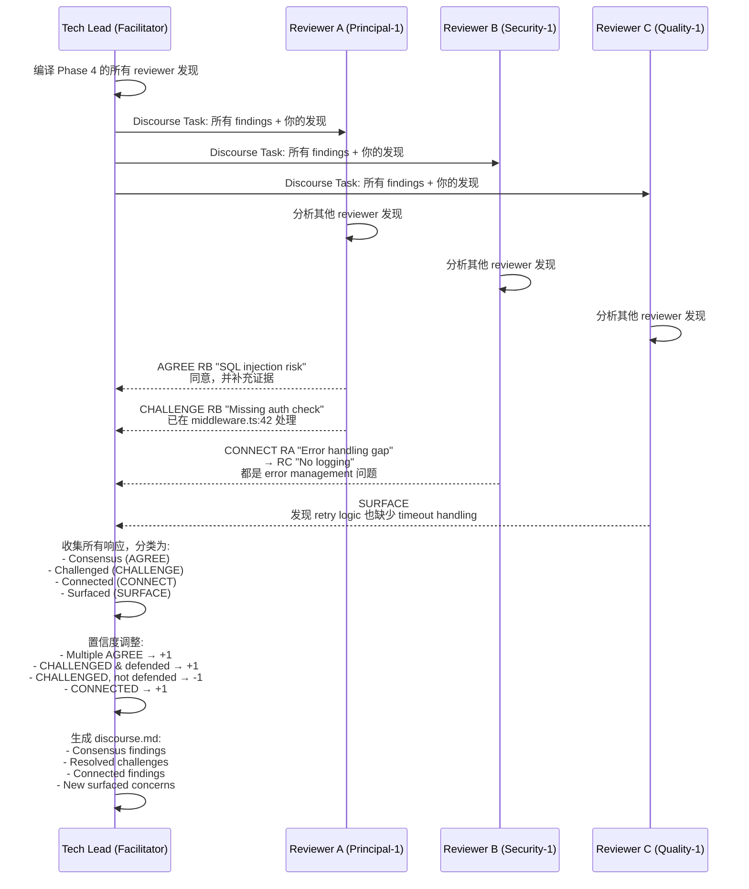
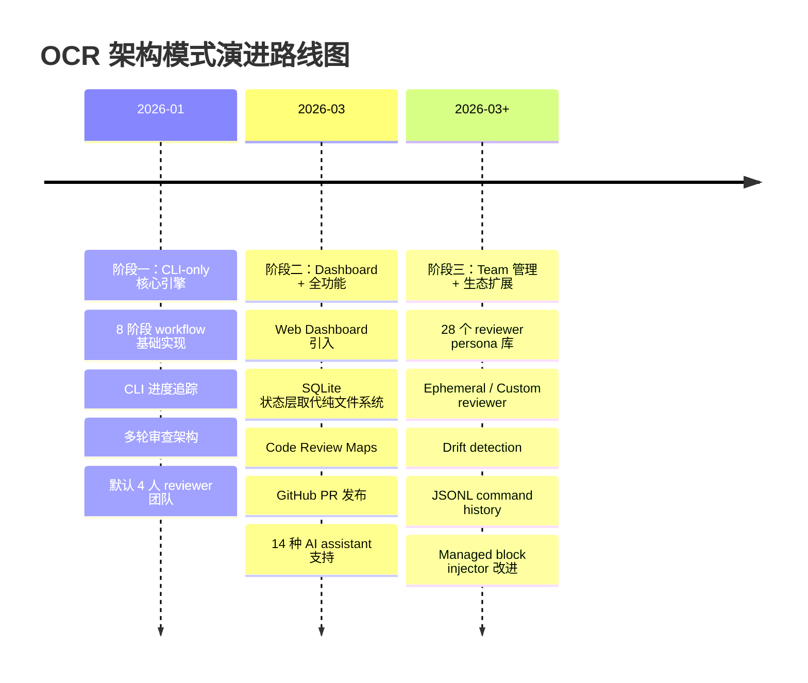

## 目录

- [概述](#概述)
  - [本质与表现形式](#本质与表现形式)
- [关键术语](#关键术语)
- [实体分类](#实体分类)
- [图表清单](#图表清单)
- [角色与信任边界](#角色与信任边界)
  - [角色与信任边界总览](#角色与信任边界总览)
- [核心角色内部结构](#核心角色内部结构)
  - [Tech Lead Agent 内部组件](#tech-lead-agent-内部组件)
  - [Reviewer Agent 内部组件](#reviewer-agent-内部组件)
- [跨角色核心流程](#跨角色核心流程)
  - [8 阶段核心流程（Happy Path）](#8-阶段核心流程happy-path)
  - [Discourse 子流程](#discourse-子流程)
- [状态转换](#状态转换)
  - [Phase 状态转换表](#phase-状态转换表)
  - [Round 转换规则](#round-转换规则)
  - [Session 状态与文件一致性](#session-状态与文件一致性)
- [Monorepo 架构](#monorepo-架构)
- [历史演进分析](#历史演进分析)
  - [演进路线图](#演进路线图)
  - [阶段一：CLI-only 核心引擎（v1.0 - v1.3）](#阶段一cli-only-核心引擎v10---v13)
  - [阶段二：Dashboard + 全功能（v1.4 - v1.6）](#阶段二dashboard--全功能v14---v16)
  - [阶段三：Team 管理 + 生态扩展（v1.7 - v1.10.x）](#阶段三team-管理--生态扩展v17---v110x)
- [设计取舍](#设计取舍)
- [边界与前提](#边界与前提)
  - [协议原生能力 vs 外部依赖](#协议原生能力-vs-外部依赖)
  - [已上线能力](#已上线能力)
  - [能解决 vs 不能解决](#能解决-vs-不能解决)
- [相关对象关系](#相关对象关系)
- [结论](#结论)
- [待确认问题](#待确认问题)
- [参考资料](#参考资料)

## 概述

Open Code Review (OCR) 是一个完全开源（Apache 2.0）的 AI 多 Agent 代码审查框架。它通过模拟一个可定制的工程师团队，从不同视角独立审查代码变更，再通过 discourse（辩论）机制交叉验证发现，最终合成优先排序的审查报告。OCR 不是单一 LLM 调用的"代码审查"，而是将真实工程团队的多视角审查、辩论、综合过程结构化为 8 个可追踪的阶段 [L1: SKILL.md, workflow.md]。

OCR 的核心创新在于三点。第一，多 Agent 冗余审查——不同 attention pattern 的 reviewer 发现不同问题，减少单一 LLM 调用的盲区 [L1: reviewer-task.md]。第二，discourse 前置——在最终合成前让 reviewer 互相挑战、验证、连接发现，通过 AGREE/CHALLENGE/CONNECT/SURFACE 四种固定响应类型实现程序化交叉验证 [L1: discourse.md]。第三，完全可定制的团队——28 个内置 reviewer persona（含著名工程师如 Martin Fowler、Kent Beck 等）加上自定义和临时 reviewer [L2: reviewers 目录, CHANGELOG v1.7.0]。

### 本质与表现形式

| 维度 | 说明 |
|------|------|
| 它是什么 | 一个开源的 AI 多 Agent 代码审查框架，通过 8 阶段 workflow 编排多个 reviewer persona 进行独立审查、discourse 辩论、综合报告生成 |
| 表现形式 | TypeScript/Node.js 实现，包含 CLI（`@open-code-review/cli`）和 Web Dashboard 两个入口；通过 Agent Skills（SKILL.md + references/）将审查逻辑注入 14 种 AI coding assistant（Claude Code、Cursor、Windsurf 等） |
| 类比理解 | 类似组织一个真实的 code review 会议：Tech Lead 分配任务 → 多位工程师从各自专业角度独立审查 → 集体讨论争议点 → Tech Lead 综合形成最终审查意见。但整个过程由 AI Agent 自动执行 |
| 在模型中的位置 | 属于 AI-assisted development 工具链中的 Code Review 层，介于 git diff（输入）和 PR comment / human review（输出）之间。OCR 不是 LLM 推理引擎本身，而是 LLM 之上的编排层（orchestration layer） |

## 关键术语

| 术语 | 定义 | 在本题中的作用 |
|------|------|---------------|
| **Tech Lead** | OCR 中的主编排 Agent，负责协调整个 8 阶段 workflow：发现上下文、分析变更、选择 reviewer 团队、发起 discourse、综合最终报告 [L1: SKILL.md] | 核心角色，理解它才能理解 OCR 的编排模型 |
| **Reviewer Persona** | 具有特定审查视角的 AI Agent 角色，包含 persona 定义（专注领域、审查风格、哲学），如 Principal（架构）、Security（安全）、Martin Fowler（重构哲学）等 [L2: reviewers 目录] | 理解 OCR 如何实现"多视角"审查 |
| **8-Phase Workflow** | Context Discovery → Change Analysis → Tech Lead Assessment → Parallel Reviews → Aggregation → Discourse → Synthesis → Presentation，OCR 的核心流程骨架 [L1: workflow.md] | 理解 OCR 的结构化审查过程 |
| **Discourse** | Phase 6 的交叉审查阶段，reviewer 使用 AGREE/CHALLENGE/CONNECT/SURFACE 四种响应类型对其他 reviewer 的发现进行回应 [L1: discourse.md] | OCR 的核心创新机制之一 |
| **Synthesis** | Phase 7，将 discourse 后的发现进行去重、优先级排序、置信度调整，生成统一的最终审查报告 [L1: workflow.md] | OCR 的最终输出机制 |
| **Session** | 一次完整的审查会话，存储在 `.ocr/sessions/{date}-{branch}/` 目录下，包含多轮 review 的所有产物 [L1: session-files.md] | 理解 OCR 的状态管理和持久化模型 |
| **Round** | Session 内的单次审查轮次，每轮包含独立的 reviews/discourse/final 产物；支持多轮迭代审查 [L1: session-files.md] | 理解 OCR 的迭代审查模型 |
| **Code Review Map** | 针对大型变更集（20+ 文件）的结构化导航文档，将变更分组为 sections 并生成 Mermaid 依赖图 [L1: README] | OCR 的辅助功能，解决大变更集导航问题 |
| **Managed Block Injector** | OCR 用于自动管理 `.gitignore` 中 `.ocr/` 目录块的系统，通过 h2 heading 和 backticks 标记托管区域 [L2: CHANGELOG v1.10.4] | 理解 OCR 如何安全地注入和管理项目配置 |
| **SQLite (sql.js)** | OCR 的状态存储后端，用于追踪 session 状态、phase 转换、review 进度 [L2: cli package.json] | 理解 OCR 的双通道（CLI + Dashboard）状态同步机制 |
| **Agent Skills** | 标准化的 AI Agent 技能定义（SKILL.md + references/），可被 Claude Code、Cursor、Windsurf 等工具自动发现和加载 [L1: SKILL.md, setup-guard.md] | 理解 OCR 如何跨多种 AI 工具分发 |
| **Ephemeral Reviewer** | 在审查时通过 `--reviewer` 标志临时描述的 reviewer，不持久化到 reviewer library [L2: CHANGELOG v1.7.0] | 理解 OCR 团队组建的灵活性 |
| **Full Agency** | Reviewer 不限于 git diff 范围，可自主探索代码库的上游/下游依赖、测试文件、配置和文档 [L1: reviewer-task.md] | 理解 OCR 与简单 "LLM 看 diff" 方案的本质区别 |
| **Filesystem-as-Source-of-Truth** | Phase 完成状态由文件存在性判定，SQLite 中的 current_phase 字段仅指示当前活跃阶段 [L1: session-files.md] | 理解 OCR 的双通道状态模型设计 |

## 实体分类

在展开图表之前，首先将 OCR 的关键实体分类，避免后续混淆角色与组件。

| 实体 | 类型 | 控制方 | 是否跨信任边界 | 主要职责 | 应落入哪类图 |
|------|------|--------|----------------|----------|--------------|
| User (开发者) | role | 用户 | 是 | 发起审查、提供 requirements、triage findings | 角色边界图 |
| Tech Lead Agent | role | OCR 系统 | 是 | 编排 8 阶段 workflow、选择 reviewer 团队、综合报告 | 角色边界图、组件图 |
| Reviewer Agent (28 种 persona) | role | OCR 系统 | 是 | 从特定视角独立审查代码、参与 discourse | 角色边界图、组件图 |
| AI Coding Assistant (Claude Code/Cursor 等) | external system | 用户 | 是 | 承载 OCR Agent Skills 执行环境，提供 LLM 推理 | 角色边界图 |
| OCR CLI (`ocr` 命令) | component | OCR 系统 | 否 | 状态管理、进度追踪、setup、更新检查 | 组件图 |
| OCR Dashboard | component | OCR 系统 | 否 | Web UI、review 浏览、team 管理、GitHub PR 发布 | 组件图 |
| SQLite DB (sql.js) | component | OCR 系统 | 否 | session 状态、phase 转换、audit trail 存储 | 组件图 |
| Session 文件系统 (`.ocr/sessions/`) | data object | OCR 系统 | 否 | 审查产物持久化（discovered-standards.md, context.md, reviews, discourse, final） | 组件图 |
| git diff | data object | 用户项目 | 否 | 代码变更输入 | 流程图 |
| Requirements (spec/ticket/inline) | data object | 用户 | 否 | 审查目标定义 | 流程图 |
| GitHub PR | external system | 用户 | 是 | 审查报告发布目标 | 角色边界图 |

## 图表清单

基于实体分类，回答四个判定问题：

| 判定问题 | 答案 | 必须产出的图 |
|----------|------|--------------|
| Q1：是否存在两个及以上独立控制方？ | 是（用户、OCR 系统、AI Coding Assistant、GitHub） | 角色与信任边界总览图 |
| Q2：是否有核心角色内部结构 materially 不同？ | 是（Tech Lead 含编排逻辑，Reviewer 含探索逻辑） | 角色内部组件图（2 张） |
| Q3：是否依赖跨角色消息/调用/证明流转？ | 是（User → AI Assistant → Tech Lead → Reviewers → 综合报告） | 跨角色核心流程图 |
| Q4：是否依赖命名状态/轮次/epoch/timeout 转换？ | 是（8 个 phase + round 转换） | 状态转换表 |

图表清单：

| 图名 | 要回答的问题 | 是否必须 | 采用格式 | 为什么需要/可省略 |
|------|--------------|----------|----------|------------------|
| 角色与信任边界总览图 | User、Tech Lead、Reviewer、AI Assistant、GitHub 之间的控制方边界和消息流 | 必须 | ASCII Architecture Diagram | 存在 4 个独立控制方，跨边界通信依赖 trust assumption |
| Tech Lead 内部组件图 | Tech Lead Agent 内部编排逻辑、状态管理、reviewer 调度 | 必须 | ASCII Component Diagram | Tech Lead 是整个 workflow 的编排核心，内部结构复杂 |
| Reviewer 内部组件图 | Reviewer persona 注入、代码探索、发现生成流程 | 必须 | ASCII Component Diagram | Reviewer 内部结构与 Tech Lead materially 不同（探索 vs 编排） |
| 8 阶段核心流程图（happy path） | 从用户发起审查到获得最终报告的跨角色交互序列 | 必须 | Mermaid Sequence Diagram | 依赖跨角色交互，需要展示完整流程 |
| Discourse 子流程图 | AGREE/CHALLENGE/CONNECT/SURFACE 的响应流转与置信度调整 | 必须 | Mermaid Sequence Diagram | Discourse 是 OCR 核心创新，需要单独展示其消息流 |
| Phase 状态转换表 | 8 个 phase 的状态转换条件和 round 转换规则 | 必须 | Markdown 表格 | 依赖显式命名状态转换，但状态机图无 dedicated skill 支持 |
| 演进路线图 | OCR 从 inception 至今的架构模式变化 | 必须 | Mermaid timeline + ASCII 路线图 | 需要展示三阶段演进的脉络 |
| Monorepo 架构图 | cli / agents / dashboard / shared 四个包的关系 | 推荐 | ASCII 组件图 | 帮助理解 OCR 的模块化架构 |

## 角色与信任边界

### 角色与信任边界总览

为了理解 OCR 系统中有哪些参与方以及它们之间的信任边界，下图展示了 OCR 的角色与信任边界总览。

```
角色与信任边界总览（ASCII 架构图）

+----------------+       +----------------------------------+
|  User Domain   |       |   AI Coding Assistant Domain     |
|                |       |                                  |
|  [User Dev]----+------>+  AI Coding Assistant             |
|                |       |  (Claude Code / Cursor /         |
+----------------+       |   Windsurf)                      |
                         |          |                       |
                         |          | 激活 SKILL.md         |
                         |          | 传递 diff + context    |
                         +----+-----+
                              |
                              v
+----------------------------------------------------------+
|                    OCR System Domain                      |
|                                                          |
|  +------------------+       +------------------------+    |
|  |  Tech Lead Agent |       |   Reviewer Team        |    |
|  |                  |       |                        |    |
|  |  - 编排 8 阶段    |<----->|  - Principal Reviewer  |    |
|  |  - 选择团队      |       |  - Quality Reviewer    |    |
|  |  - Discourse     |       |  - Security Reviewer   |    |
|  |  - Synthesis     |       |  - Famous Engineer     |    |
|  |                  |       |  - Ephemeral Reviewer  |    |
|  +--------+---------+       +------------------------+    |
|           |                                                |
|           v                                                |
|  +------------------+    +---------------+                 |
|  |    OCR CLI       |    | OCR Dashboard |                 |
|  |  (状态管理)       |<-->| (Web UI)      |                 |
|  +--------+---------+    +-------+-------+                 |
|           |                    |                           |
|           v                    v                           |
|  +------------------+    +---------------+                 |
|  |   SQLite DB      |    |  Session FS   |                 |
|  |   (sql.js)       |    |  (.ocr/)      |                 |
|  +------------------+    +---------------+                 |
+--------------------------+---------------------------------+
                           |
                           v
+----------------------------------------------------------+
|                   External Systems                        |
|                                                          |
|  [GitHub PR] <---- 发布 review (gh CLI)                   |
|  [Git Repo]  <---- 读取 git diff + discovered standards   |
+----------------------------------------------------------+

关键信任边界：
- User -> AI Assistant: 信任正确执行 SKILL.md，但保留最终决策权
- AI Assistant -> OCR System: 作为执行环境，信任 Agent Skills 定义
- Tech Lead -> Reviewers: 信任独立发现，但通过 discourse 交叉验证
- OCR System -> GitHub: 不控制 GitHub，仅通过 gh CLI 发布评论
```

**关键信任边界说明**：
- **User → AI Coding Assistant**：用户信任 AI Assistant 正确执行 OCR SKILL.md 中的编排逻辑，但用户保留最终决策权。OCR 明确声明不替代 human review [L1: README]
- **AI Coding Assistant → OCR System**：AI Assistant 作为执行环境，信任 OCR 的 Agent Skills 定义。OCR 通过 setup-guard.md 自动检测安装模式并配置 [L1: setup-guard.md]
- **Tech Lead → Reviewer Agents**：Tech Lead 信任 reviewer 的独立发现，但通过 discourse 阶段进行交叉验证，不盲目接受单一 reviewer 的结论。Challenged 但无法辩护的发现标记为 false positive [L1: discourse.md]
- **OCR System → GitHub**：OCR 不控制 GitHub，仅通过 gh CLI 发布评论，发布行为需要用户确认（dashboard 提供预览/编辑模式）[L1: README]

## 核心角色内部结构

### Tech Lead Agent 内部组件

Tech Lead Agent 是整个 8 阶段 workflow 的编排核心。它包含四个子组件族：上下文收集（Phase 1-2）、评估决策（Phase 3）、编排综合（Phase 5-7）和状态管理。下图展示其内部组件结构。

```
Tech Lead Agent 内部组件（ASCII 组件图）

Tech Lead Agent
┌─────────────────────────────────────────────────────────────────┐
│                                                                 │
│  Phase 1-2: Context Gathering                                   │
│  ┌──────────────┐  ┌──────────────────┐  ┌───────────────────┐ │
│  │ Config Loader │─>│ OpenSpec Context │  │ Reference File    │ │
│  │              │  │     Puller       │  │   Discovery       │ │
│  └──────┬───────┘  └──────────────────┘  └───────────────────┘ │
│         │                                                       │
│         ├─────────────┐  ┌───────────────┐  ┌───────────────┐  │
│         │             │  │ Git Diff      │  │ Requirements  │  │
│         │             └─>│  Analyzer     │  │    Parser     │  │
│         │                └───────┬───────┘  └───────┬───────┘  │
│         │                        │                  │          │
│  State Mgmt                     v                  v          │
│  ┌──────────────┐         ┌──────────────┐                    │
│  │ Session State │<───────│ Change       │                    │
│  │   Manager    │        │ Summarizer   │                    │
│  └──────┬───────┘        └──────┬───────┘                    │
│         │                       v                            │
│  ┌──────────────┐         ┌──────────────┐                   │
│  │ File System  │         │ Risk         │                   │
│  │    I/O       │         │ Identifier   │                   │
│  └──────────────┘         └──────┬───────┘                   │
│                                  │                           │
│  ┌──────────────┐         ┌──────v───────┐                   │
│  │ SQLite State │         │ Team Selector│ ← 基于变更类型选择 │
│  │   Writer     │         │              │   reviewer 团队   │
│  └──────────────┘         └──────┬───────┘                   │
│                                  │                           │
│  Phase 5-7: Orchestration        │                           │
│  ┌──────────────┐         ┌──────v───────┐                   │
│  │ Review        │<────────              │                   │
│  │ Aggregator    │                        │                   │
│  └──────┬───────┘                        │                   │
│         │                                │                   │
│         v                                │                   │
│  ┌──────────────────┐                    │                   │
│  │ Discourse         │ ← 编译发现，收集   │                   │
│  │ Facilitator       │   AGREE/CHALLENGE │                   │
│  │                  │   CONNECT/SURFACE │                   │
│  └──────┬───────────┘                    │                   │
│         │                                │                   │
│         v                                │                   │
│  ┌──────────────────┐                    │                   │
│  │ Synthesis Engine  │                   │                   │
│  │ + Confidence      │ ← 去重、优先级     │                   │
│  │   Adjuster        │   排序、置信度调整 │                   │
│  └──────────────────┘                    │                   │
│                                          │                   │
└──────────────────────────────────────────┼───────────────────┘
                                           │
                              所有阶段都通过 Session State Manager
                              写入 File System 和 SQLite
```

### Reviewer Agent 内部组件

Reviewer Agent 的内部结构与 Tech Lead materially 不同——它不包含编排逻辑，而是专注于代码探索和发现生成。每个 reviewer 接收 persona 定义（专注领域、审查哲学），然后通过 full agency 模型自主探索代码库，最终生成审查发现。

```
Reviewer Agent 内部组件（ASCII 组件图）

Reviewer Agent
┌─────────────────────────────────────────────────────────────┐
│                                                             │
│  Persona Injection                                          │
│  ┌──────────────────┐                                       │
│  │ Persona Definition│  ← 每个 reviewer 的 persona 定义文件  │
│  │  (如 martin-     │     包含 review style, philosophy,   │
│  │   fowler.md)     │     focus areas                       │
│  └────────┬─────────┘                                       │
│           │                                                 │
│           v                                                 │
│  ┌──────────────────┐                                       │
│  │ Persona Philosophy│ ← Famous Engineer persona 额外注入    │
│  │                  │    已发表论文/著作中的工程哲学          │
│  └────────┬─────────┘                                       │
│           │                                                 │
│           v                                                 │
│  ┌──────────────────┐                                       │
│  │  Focus Areas     │ ← 专注领域定义（安全、架构、质量等）   │
│  └────────┬─────────┘                                       │
│           │                                                 │
│           v                                                 │
│                                                             │
│  Code Exploration (Full Agency)                             │
│  ┌──────────────┐                                           │
│  │ Diff Reader  │ ← 读取 git diff 范围内的变更              │
│  └──────┬───────┘                                           │
│         │                                                   │
│         v                                                   │
│  ┌──────────────┐  自主决定探索范围                          │
│  │ File Explorer │<──────────────┐                          │
│  └──┬───────┬───┘               │                          │
│     │       │                   │ Full Agency:              │
│     v       v                   │ 不局限于 git diff，       │
│  ┌───────┐ ┌──────────┐       │ 像真实工程师一样          │
│  │Upstream│ │Downstream│       │ 探索代码库                │
│  │Tracer │ │Tracer    │       │                           │
│  └───┬───┘ └────┬─────┘       │                           │
│      │          │              │                           │
│      │     ┌────v──────┐      │                           │
│      │     │ Test      │      │                           │
│      │     │ Examiner  │      │                           │
│      │     └────┬──────┘      │                           │
│      │          │              │                           │
│      └──────────┼──────────────┘                           │
│                 │                                           │
│                 v                                           │
│  Analysis & Output                                          │
│  ┌─────────────────────┐                                    │
│  │ Finding Generator   │ ← 综合探索结果生成审查发现          │
│  └──────────┬──────────┘                                    │
│             │                                               │
│     ┌───────┼───────────┬──────────┐                        │
│     v       v           v          v                        │
│  ┌───────┐ ┌──────────┐ ┌───────┐ ┌──────────┐             │
│  │Severity│ │Requirements│ │Positive│ │ Question  │             │
│  │Class-  │ │Assessor   │ │Observer│ │  Raiser  │             │
│  │ifier   │ │          │ │       │ │         │             │
│  └───────┘ └──────────┘ └───────┘ └──────────┘             │
│                                                             │
└─────────────────────────────────────────────────────────────┘
```

**差异表**：

| 角色/节点类型 | 是否复用 canonical 图 | 差异点 |
|--------------|----------------------|--------|
| Tech Lead Agent | 独立图（上图 1） | 包含编排逻辑、状态管理、reviewer 调度 |
| Reviewer Agent (Generalists/Specialists) | 复用上图 2 | persona 定义不同，但内部组件结构相同 |
| Reviewer Agent (Famous Engineers) | 复用上图 2 | persona 注入额外包含已发表论文/著作中的工程哲学 |
| Reviewer Agent (Ephemeral) | 复用上图 2 | persona 来自 inline 描述，不持久化到 reviewer library |

## 跨角色核心流程

### 8 阶段核心流程（Happy Path）

为了理解 OCR 的完整审查流程，下图展示了从用户发起审查到获得最终报告的跨角色交互序列。

```mermaid
sequenceDiagram
    actor User
    participant AI as AI Coding Assistant
    participant TL as Tech Lead Agent
    participant RV as Reviewer Agents
    participant CLI as OCR CLI
    participant DB as SQLite DB

    User->>AI: /ocr-review [target] or /ocr:review
    activate AI
    AI->>AI: Setup Guard 验证 OCR 安装
    AI->>CLI: ocr state show 检查现有 session
    CLI->>DB: 读取 session 状态
    DB-->>CLI: 返回当前 phase/round
    CLI-->>AI: 状态信息

    alt Session 不存在
        AI->>CLI: ocr state init
        CLI->>DB: 创建 session 记录
    end

    Note over AI,TL: Phase 1: Context Discovery
    AI->>TL: 激活 SKILL.md 开始 Phase 1
    TL->>TL: 读取 .ocr/config.yaml
    TL->>TL: 读取 OpenSpec context (如 enabled)
    TL->>TL: 发现 reference files (CLAUDE.md, .cursorrules)
    TL->>TL: 解析 user requirements (inline/document/spec)
    TL->>CLI: ocr state transition --phase context --phase-number 1
    CLI->>DB: 更新 phase = context
    TL-->>AI: discovered-standards.md + requirements.md

    Note over AI,TL: Phase 2: Change Analysis
    TL->>TL: 执行 git diff 分析变更内容和意图
    TL->>CLI: ocr state transition --phase change-context --phase-number 2
    CLI->>DB: 更新 phase = change-context
    TL-->>AI: context.md (change summary)

    Note over AI,TL: Phase 3: Tech Lead Assessment
    TL->>TL: 总结变更 / 识别风险点 / 选择 reviewer 团队
    TL->>CLI: ocr state transition --phase analysis --phase-number 3
    CLI->>DB: 更新 phase = analysis
    TL-->>AI: context.md (含 Tech Lead guidance)

    Note over AI,TL,RV: Phase 4: Parallel Reviews
    TL->>RV: 分配审查任务 (principal-1, principal-2, quality-1, quality-2, [security-1, testing-1])
    activate RV
    RV->>RV: 独立审查 (full agency 探索代码库)
    RV-->>TL: 各自审查发现 ({type}-{n}.md)
    deactivate RV
    TL->>CLI: ocr state transition --phase reviews --phase-number 4
    CLI->>DB: 更新 phase = reviews

    Note over AI,TL: Phase 5: Aggregation
    TL->>TL: 合并冗余 reviewer 发现 / deduplicate 相同发现
    TL->>CLI: ocr state transition --phase aggregation --phase-number 5
    CLI->>DB: 更新 phase = aggregation

    Note over AI,TL: Phase 6: Discourse
    TL->>RV: 分发 discourse task (所有 findings)
    activate RV
    RV->>RV: 对其他 reviewer 发现进行 AGREE/CHALLENGE/CONNECT/SURFACE 响应
    RV-->>TL: discourse 响应 (discourse.md)
    deactivate RV
    TL->>CLI: ocr state transition --phase discourse --phase-number 6
    CLI->>DB: 更新 phase = discourse

    Note over AI,TL: Phase 7: Synthesis
    TL->>TL: 基于 discourse 调整置信度 / 去重 / 优先级排序 / 生成 final.md
    TL->>CLI: ocr state round-complete + ocr state transition --phase synthesis
    CLI->>DB: 更新 round-meta + phase = synthesis

    Note over AI,User: Phase 8: Presentation
    TL-->>AI: 返回 final.md (审查报告 + requirements verification)
    AI-->>User: 展示审查结果

    opt 可选: 发布到 GitHub PR
        User->>AI: (可选) /ocr-post 发布到 GitHub PR
        AI->>CLI: ocr state close
        CLI->>DB: 更新 status = closed
    end
    deactivate AI
```

**流程步骤说明**：
- **Setup Guard 与 Session 状态验证**：OCR 在任何操作前必须运行 setup guard，验证 CLI/Plugin 安装模式，检查现有 session 状态，避免重复工作或丢失进度 [L1: setup-guard.md]
- **Context Discovery 的项目标准自动发现**：OCR 不仅读取 `.ocr/config.yaml`，还自动发现 `CLAUDE.md`、`.cursorrules`、OpenSpec context 等项目标准文件，并将它们注入到所有 reviewer 的上下文中 [L1: SKILL.md]
- **Tech Lead Assessment 的自动团队选择**：Tech Lead 根据变更类型自动决定 reviewer 团队组成——auth/data 变更自动添加 Security reviewer，logic 变更自动添加 Testing reviewer [L1: SKILL.md]
- **Parallel Reviews 的 full agency**：每个 reviewer 不限于 git diff 范围，可自主探索代码库——追踪上游调用者、下游依赖、检查测试覆盖、阅读文档 [L1: reviewer-task.md]
- **Discourse 的交叉验证机制**：所有 reviewer 看到彼此的全部发现后，进行 AGREE/CHALLENGE/CONNECT/SURFACE 回应。Challenged 但无法辩护的发现标记为 false positive [L1: discourse.md]
- **Synthesis 的置信度调整与 Requirements Verification**：最终合成包含基于 discourse 的置信度调整、requirements verification 表（哪些需求已满足/有缺口/不明确）[L1: workflow.md]

### Discourse 子流程

Discourse 是 OCR 的核心创新机制。下图详细展示 discourse 阶段的消息流转。



## 状态转换

OCR 的审查流程依赖显式的命名状态转换。下表展示 8 个 phase 的状态转换条件和 round 转换规则。

> Phase 编号采用 0-based 约定：`init` 为 Phase 0，`context` 为 Phase 1，依此类推。

### Phase 状态转换表

| 当前状态 (phase) | 触发事件 | 转换结果 | CLI 命令 | 文件系统验证条件 |
|-----------------|----------|----------|----------|-----------------|
| `init` (Phase 0) | Session 不存在 | 创建 session → `context` | `ocr state init` | 创建 `.ocr/sessions/{date}-{branch}/` |
| `context` (Phase 1) | 已完成 config loading + context discovery | → `change-context` | `ocr state transition --phase context --phase-number 1` | `discovered-standards.md` 存在 |
| `change-context` (Phase 2) | 已完成 git diff 分析 | → `analysis` | `ocr state transition --phase change-context --phase-number 2` | `context.md` 存在 |
| `analysis` (Phase 3) | 已完成 Tech Lead 评估 + 团队选择 | → `reviews` | `ocr state transition --phase analysis --phase-number 3` | `context.md` 含 Tech Lead guidance |
| `reviews` (Phase 4) | ≥2 个 reviewer 完成独立审查 | → `aggregation` | `ocr state transition --phase reviews --phase-number 4` | `rounds/round-{n}/reviews/` 下 ≥2 个文件 |
| `aggregation` (Phase 5) | 已完成冗余发现合并 | → `discourse` | `ocr state transition --phase aggregation --phase-number 5` | 合并后的 findings 就绪 |
| `discourse` (Phase 6) | 所有 reviewer 完成 discourse 响应 | → `synthesis` | `ocr state transition --phase discourse --phase-number 6` | `rounds/round-{n}/discourse.md` 存在 |
| `synthesis` (Phase 7) | 已完成最终报告生成 | → `complete` | `ocr state round-complete` + `ocr state close` | `rounds/round-{n}/final.md` + `round-meta.json` 存在 |
| `complete` | 用户再次运行 `/ocr-review` | → `context` (新 round) | `ocr state transition --current-round` | `final.md` 存在 → 创建 `round-{n+1}/` |

### Round 转换规则

| 条件 | 行为 |
|------|------|
| 当前 round 未完成（无 `final.md`） | 恢复当前 round，从 `current_phase` 继续 |
| 当前 round 已完成（有 `final.md`） | 创建 `round-{n+1}/`，新 round 从 Phase 1 开始 |
| 使用 `--fresh` 标志 | 删除整个 session，从 round-1 Phase 1 重新开始 |
| 无 session 存在 | 创建新 session 和 round-1 |

### Session 状态与文件一致性

OCR 采用 **文件系统为事实源（filesystem-as-source-of-truth）** 的状态模型 [L1: session-files.md]：
- Phase 完成状态由文件存在性判定（如 `reviews` 阶段完成 = `rounds/round-{n}/reviews/` 下存在 ≥2 个文件）
- SQLite 中的 `current_phase` 字段仅指示当前活跃阶段，不指示已完成阶段
- 当 SQLite 状态与文件系统不一致时，Tech Lead 使用 `ocr state show` 检测并提示用户选择信任哪一方 [L2: cli package.json]

## Monorepo 架构

OCR 采用 pnpm + Nx 的 monorepo 架构，包含四个主包。

```
open-code-review/
├── packages/
│   ├── cli/                    # @open-code-review/cli
│   │   ├── 状态管理 (sql.js)
│   │   ├── 进度追踪
│   │   ├── setup guard
│   │   └── managed block injector
│   ├── agents/                 # @open-code-review/agents
│   │   ├── skills/ocr/         #   SKILL.md + references/
│   │   ├── reviewers/          #   28 个 persona 定义
│   │   └── commands/           #   Code Review Maps 等
│   ├── dashboard/              # @open-code-review/dashboard
│   │   ├── Web UI (Next.js/Vite)
│   │   ├── session 浏览
│   │   ├── team 管理
│   │   └── GitHub PR 发布
│   └── shared/                 # 平台工具
└── package.json                # pnpm 9.15.0, Nx 22.0.0, TS 5.7.3
```

- **cli 包**：独立可执行的 `ocr` 命令，内置 sql.js 用于状态管理，support 14 种 AI coding assistant 的 adapter [L2: cli package.json, L1: README]
- **agents 包**：包含 OCR 的核心 AI 逻辑——SKILL.md（Tech Lead 编排）、references/（workflow/discourse/reviewer-task/session-files/setup-guard）、reviewers/（28 个 persona）、commands/（Code Review Maps 等）。该包可独立于 CLI 被其他工具消费 [L2: agents package.json]
- **dashboard 包**：Web UI 入口，提供 session 浏览、team 管理、GitHub PR 发布功能 [L1: README]
- **shared 包**：平台工具，被 cli 和 dashboard 共享 [L2: root package.json]

## 历史演进分析

OCR 从 2026 年 1 月 26 日初始化到当前 v1.10.4，经历了三个明确的演进阶段。以下按"架构模式变化"划分，而非按版本号或时间窗口机械切分。

### 演进路线图



```
架构模式演进（ASCII 路线图）

  [CLI-only 引擎]          [双通道全功能]            [系统化生态]
  2026-01                 2026-03                  2026-03+
  ┌─────────────┐         ┌──────────────┐         ┌─────────────────┐
  │  Tech Lead  │         │  Tech Lead   │         │   Tech Lead     │
  │  + 4 Review │         │  + 4 Review  │         │   + 28 Review   │
  │             │         │              │         │   + Ephemeral   │
  │  Filesystem │ ──────▶ │  Filesystem  │ ──────▶ │   + Custom      │
  │  State Only │         │  + SQLite    │         │   + Drift Detect│
  │             │         │  + Dashboard │         │   + JSONL Backup│
  │  CLI Only   │         │  + GH PR     │         │   + Managed Blk │
  └─────────────┘         └──────────────┘         └─────────────────┘
       v1.0-v1.3                v1.4-v1.6               v1.7-v1.10.x
```

### 阶段一：CLI-only 核心引擎（v1.0 - v1.3）

**架构模式特征**：验证 8 阶段 workflow 作为 AI code review 编排层的可行性。核心架构决策是"将真实工程团队的 code review 过程结构化为可追踪的阶段"，而非简单的一次性 LLM 调用。

这一阶段代表了 OCR 最核心的技术思考：代码审查本质上是一个多角色协作、多轮迭代、需要上下文感知的过程。OCR 选择从第一天就实现完整的 8 阶段 workflow，而非逐步迭代到多 Agent 架构，说明设计者从一开始就将 OCR 定位为"LLM 之上的编排层"而非"更好的 LLM prompt" [L1: SKILL.md, workflow.md]。

**此阶段确立的核心能力**：
- 8 阶段 workflow 基础实现（Context Discovery → Presentation）[L1: SKILL.md]
- CLI 进度追踪（`ocr progress`）[L2: CHANGELOG]
- 多轮审查架构（v1.2.0 引入 `rounds/` 目录结构）[L2: CHANGELOG v1.2.0]
- 默认 reviewer 团队（Principal x2 + Quality x2）[L1: SKILL.md]
- 基础 setup guard，验证安装模式 [L1: setup-guard.md]
- 文件系统为事实源的状态模型 [L1: session-files.md]

**此阶段的限制**：无 Web UI、无 Dashboard、无 GitHub PR 发布、无自定义 reviewer 管理。状态管理完全依赖文件系统，无法支持 CLI 之外的消费者。

### 阶段二：Dashboard + 全功能（v1.4 - v1.6）

**架构模式特征**：从"CLI-only 的单用户工具"转变为"CLI + Dashboard 双通道的协作平台"。核心架构变化是引入 SQLite 状态层，使 CLI 和 Dashboard 能够共享 session 状态。

这一阶段代表的技术思考转变是：OCR 不再满足于"在 AI assistant 内完成审查"，而是要提供独立的 review 浏览、管理和发布能力。引入 SQLite（sql.js）而非纯关系型数据库（如 PostgreSQL），说明设计者在"独立部署"和"多用户并发"之间选择了前者——sql.js 是进程内 SQLite，无需额外数据库服务，保持了 OCR 的零依赖特性 [L2: cli package.json]。

**此阶段新增的核心能力**：
- Web Dashboard 包（v1.5.0）——command center、review 浏览、session 管理 [L2: CHANGELOG, L1: README]
- SQLite 状态层（sql.js）——取代纯文件系统状态管理，支持 CLI/Dashboard 双通道 [L2: cli package.json]
- Code Review Maps（v1.4.0）——针对大型变更集（20+ 文件）的结构化导航，使用三个 specialized agents（Map Architect, Flow Analyst, Requirements Mapper）[L1: README]
- Address Feedback（v1.6.0）——AI agent 辅助处理审查发现 [L2: CHANGELOG v1.6.0]
- Bearer token auth + 安全加固 [L2: CHANGELOG v1.5.0]
- GitHub PR 发布（含 Human Voice translation 模式，遵循 Google Code Review Guidelines）[L1: README]
- 14 种 AI coding assistant 支持，通过 setup guard 自动检测和配置 [L1: README, setup-guard.md]

**此阶段抛弃的**：纯文件系统状态管理作为唯一状态后端被 SQLite 替代。但文件系统仍作为 session 产物的存储后端，形成了"文件系统为事实源 + SQLite 为进度索引"的双通道模型 [L1: session-files.md]。

### 阶段三：Team 管理 + 生态扩展（v1.7 - v1.10.x）

**架构模式特征**：从"固定团队的标准化工具"转变为"可定制团队的平台"。核心架构变化是 reviewer persona 系统化和执行可恢复性。

这一阶段代表的技术思考转变是：OCR 认识到 code review 的质量高度依赖于"谁来审查"，因此从固定 4 人团队扩展到 28 个 persona 库（4 tiers），并支持自定义创建和临时描述。同时，通过 drift detection、JSONL command history backup、managed block injector 改进，OCR 强化了执行可靠性和可恢复性 [L2: CHANGELOG v1.7.0-v1.10.4]。

**此阶段新增的核心能力**：
- 28 个 reviewer persona 库（v1.7.0）——从默认 4 个扩展到 4 tiers（Generalists, Specialists, Famous Engineers, Custom）[L2: reviewers 目录, CHANGELOG v1.7.0]
- Dashboard Team 页面（v1.7.0）——browse/create/sync reviewers [L2: CHANGELOG v1.7.0]
- Ephemeral reviewers（v1.7.0）——`--reviewer` 标志支持临时 reviewer，不持久化 [L2: CHANGELOG v1.7.0]
- 自定义 reviewer 创建（v1.7.0）——`/ocr:create-reviewer` [L2: CHANGELOG v1.7.0]
- Local artifact version drift detection（v1.8.0）——检测 `.ocr/` 文件是否由旧版 CLI 安装 [L2: CHANGELOG v1.8.0]
- `synthesis_counts` 元数据（v1.8.4）——去重后的审查发现计数 [L2: CHANGELOG v1.8.4]
- Nx version sync plugin（v1.9.0）——自动同步 `plugin.json` 版本号 [L2: CHANGELOG v1.9.0]
- JSONL command history backup（v1.10.0）——命令历史备份与回放 [L2: CHANGELOG v1.10.0]
- Managed block injector 改进（v1.10.4）——h2 heading + backticks 标记托管区域 [L2: CHANGELOG v1.10.4]

| 阶段 | 架构模式 | 核心能力 | 架构变化 |
|------|----------|----------|----------|
| 阶段一 | CLI-only 核心引擎 | 8 阶段 workflow、CLI 进度、多轮审查、默认 4 人团队 | 纯 CLI、文件系统状态 |
| 阶段二 | 双通道全功能平台 | Dashboard、SQLite、Maps、GitHub 发布、Address Feedback、14 种 AI assistant | CLI + Dashboard 双通道、SQLite 状态层 |
| 阶段三 | 可定制团队平台 | 28 persona 库、Team 管理、Ephemeral/Custom reviewer、Drift detection、JSONL 备份、Managed block injector | Reviewer 管理系统化、执行可恢复性 |

## 设计取舍

| 设计决策 | 选择 | 替代方案 | Trade-off |
|----------|------|----------|-----------|
| **多 Agent 冗余审查 vs 单次 LLM 调用** | 多 Agent 独立审查 + discourse | 单次 LLM 调用生成审查报告 | 多 Agent 成本高但覆盖全面、减少盲区；单次调用快但容易遗漏特定领域问题 |
| **Discourse 前置 vs 直接合成** | Phase 6 discourse 后再 synthesis | 跳过 discourse 直接合成（`--quick` 模式支持跳过） | Discourse 减少 false positive、提升高置信度发现的可靠性；增加 token 消耗和延迟 |
| **Filesystem-as-source-of-truth vs DB-as-source-of-truth** | 文件系统为事实源，SQLite 仅为进度索引 | 将一切状态存入 SQLite | 文件系统更易调试和手动恢复；SQLite 状态与文件可能不一致（OCR 通过 round resolution algorithm 处理） |
| **Agent Skills 分发 vs npm-only** | SKILL.md + CLI 双分发 | 仅通过 npm 包分发 | Skills 兼容 14 种 AI 工具；npm-only 限制在 Node.js 生态 |
| **Fixed response types (AGREE/CHALLENGE/CONNECT/SURFACE) vs 自由文本 discourse** | 四种固定响应类型 | 自由文本辩论 | 固定类型便于程序化处理（置信度调整、分类统计）；自由文本更灵活但难以自动化 [L1: discourse.md] |
| **Default team 4 人 vs 更多 reviewer** | 默认 Principal x2 + Quality x2（4 人） | 默认 8+ reviewer | 4 人平衡成本和覆盖；更多 reviewer 覆盖更全面但 token 成本线性增长 |
| **Reviewer full agency vs diff-only** | Reviewer 可自主探索 diff 之外的文件 | 仅限 git diff 范围 | Full agency 能发现上下文相关的问题（如调用链上的 bug）；增加 token 消耗和延迟 [L1: reviewer-task.md] |
| **Round-based vs continuous** | 离散轮次（round-1, round-2, ...） | 连续审查流 | Round 保留历史审查记录，支持迭代改进；连续流更轻量但缺乏版本控制 |
| **CLI + Dashboard 双通道 vs 单一入口** | CLI 用于 AI assistant 内执行，Dashboard 用于浏览和管理 | 仅 CLI 或仅 Dashboard | 双通道覆盖不同使用场景；增加架构复杂度（SQLite 同步、PID 追踪等） |
| **Human Voice translation vs 原始 AI 输出** | AI 将 findings 重写为自然 human voice（遵循 Google Code Review Guidelines） | 直接发布 AI 生成的审查报告 | Human voice 更易被开发者接受；增加额外的 LLM 调用成本 |
| **sql.js（进程内 SQLite）vs PostgreSQL/外部数据库** | sql.js 作为状态后端 | PostgreSQL、SQLite 文件版 | sql.js 零外部依赖、进程内运行，保持 OCR 的轻量特性；不支持多进程并发写入 |
| **SKILL.md 驱动 vs 硬编码逻辑** | 通过 SKILL.md + references/ 文件定义编排逻辑 | 将 workflow 逻辑硬编码到 TypeScript | SKILL.md 可被任何兼容 AI assistant 直接消费、无需编译；硬编码更可控但与 AI assistant 解耦更困难 |

## 边界与前提

### 协议原生能力 vs 外部依赖

| 类别 | 能力 | 说明 |
|------|------|------|
| **协议原生** | 8 阶段 workflow 编排 | OCR 通过 SKILL.md + references/ 定义，在任何兼容 AI assistant 中均可执行 [L1: SKILL.md] |
| **协议原生** | 28 reviewer persona 库 | agents 包内置，可创建自定义 persona [L2: reviewers 目录] |
| **协议原生** | Discourse + Synthesis | 内置置信度调整算法（AGREE +1, CHALLENGE defended +1, CHALLENGE not defended -1, CONNECT +1）[L1: discourse.md] |
| **协议原生** | Code Review Maps | 内置三个 specialized agents（Map Architect, Flow Analyst, Requirements Mapper）[L1: README] |
| **协议原生** | Session 持久化 | `.ocr/sessions/` 文件系统 + SQLite [L1: session-files.md, L2: cli package.json] |
| **协议原生** | 多轮审查 | round-based 架构 [L1: session-files.md] |
| **协议原生** | 14 种 AI coding assistant 适配 | 通过 setup guard 自动检测和配置 [L1: README, setup-guard.md] |
| **外部依赖** | LLM 推理 | OCR 不内置 LLM，依赖 AI Coding Assistant 提供的 LLM（Claude、GPT-4 等） |
| **外部依赖** | GitHub PR 发布 | 需要 gh CLI 安装并认证 [L1: README] |
| **外部依赖** | Git diff 分析 | 需要 git 已安装 |

### 已上线能力

| 状态 | 能力 | 说明 |
|------|------|------|
| **Live** | 8 阶段 workflow、discourse、synthesis、multi-round | 当前 v1.10.4 已实现 [L2: CHANGELOG] |
| **Live** | 28 reviewer persona、自定义 reviewer、ephemeral reviewer | v1.7.0 已实现 [L2: CHANGELOG v1.7.0] |
| **Live** | Web Dashboard、SQLite 状态管理、GitHub PR 发布 | v1.5.0+ 已实现 [L2: CHANGELOG v1.5.0] |
| **Live** | Code Review Maps、Address Feedback | v1.4.0 / v1.6.0 已实现 [L2: CHANGELOG] |
| **Live** | JSONL command history backup | v1.10.0 已实现 [L2: CHANGELOG v1.10.0] |
| **Live** | Managed block injector (.gitignore 管理) | v1.5.1 引入，v1.10.4 改进 [L2: CHANGELOG] |
| **Live** | Human Voice translation for GitHub PR posting | v1.5.0 已实现 [L2: CHANGELOG v1.5.0] |
| **Live** | Session notes + AI chat on review rounds | README 描述已上线 [L1: README] |

### 能解决 vs 不能解决

| 能解决 | 不能解决 |
|--------|----------|
| 多视角代码审查（架构、安全、质量、测试等） | 替代人工 code review（OCR 明确声明不替代 human review） |
| 基于项目标准的上下文感知审查 | 无项目标准时的"最佳实践"审查质量依赖项目本身的 `.cursorrules`/`CLAUDE.md` 质量 |
| 大型变更集的结构化导航（Code Review Maps） | 自动修复代码问题（Address Feedback 辅助实现变更，但需人工批准） |
| 审查发现的去重、优先级排序、置信度调整 | 运行时错误检测（OCR 审查静态代码，不执行代码） |
| 审查结果的 GitHub PR 发布 | CI/CD 集成（OCR 不是 CI 工具，需在 AI assistant 中触发） |
| Requirements-aware 审查（基于 spec/ticket/inline 要求） | 无 requirements 时的业务逻辑正确性验证 |
| Smart Contract 基础审查（通过 Generalists persona 覆盖） | 链上代码专项分析（无 Solidity/blockchain reviewer persona）[L2: reviewers 目录] |

## 相关对象关系

OCR 在 AI-assisted development 工具链中的定位：

```
Git Diff (输入) → OCR (AI Code Review 编排层) → PR Comment / Human Review (输出)
                        ↑
                  依赖 AI Coding Assistant (LLM 推理)
```

**与上游的关系**：
- **Git**：OCR 的输入是 git diff，不修改 git 本身
- **AI Coding Assistant**：OCR 作为 Agent Skill 运行在 Claude Code、Cursor、Windsurf 等工具中，依赖这些工具提供 LLM 推理能力 [L1: README, setup-guard.md]

**与下游的关系**：
- **GitHub PR**：OCR 可选择将审查结果发布为 PR 评论，但这是可选的后置动作 [L1: README]
- **Human Review**：OCR 明确不替代 human review，目标是减少 human reviewer 的负担 [L1: README]

**与相邻工具的关系定位**：
- **与 CI linter/formatter**：OCR 不做语法检查、格式校验（这些是 CI 工具的领域），OCR 关注的是架构、设计模式、安全、可维护性等高层次问题
- **与 SAST/DAST**：OCR 不是静态/动态安全分析工具，其 security reviewer 是基于 AI 推理的启发式安全审查，而非基于规则的漏洞扫描
- **与 OpenSpec**：OCR 通过 `.ocr/config.yaml` 中的 `openspec` 配置项集成 OpenSpec context，将项目规范注入审查上下文 [L1: SKILL.md]

## 结论

以下结论已标注证据等级：

1. **[L1 证据]** Open Code Review 是一个 Apache 2.0 完全开源的 AI 多 Agent 代码审查框架，通过 8 阶段 workflow（Context Discovery → Change Analysis → Tech Lead Assessment → Parallel Reviews → Aggregation → Discourse → Synthesis → Presentation）编排多个 reviewer persona 进行独立审查。来源：SKILL.md, workflow.md
2. **[L2 证据]** OCR 采用 monorepo 架构（pnpm + Nx），包含四个主包：`cli`（状态管理、进度追踪）、`agents`（AI skills、reviewer personas）、`dashboard`（Web UI）、`shared`（平台工具）。来源：package.json, 目录结构
3. **[L1 证据]** OCR 的 discourse 机制通过 AGREE/CHALLENGE/CONNECT/SURFACE 四种固定响应类型实现 reviewer 之间的交叉验证，减少 false positive。置信度调整的具体权重规则已知基础 +1/-1 调整，多轮收敛策略未完全公开。来源：discourse.md
4. **[L2 证据]** OCR 包含 28 个 reviewer persona，分布在四个 tiers（Generalists, Specialists, Famous Engineers, Custom），支持自定义创建和临时描述。来源：reviewers 目录, CHANGELOG v1.7.0
5. **[L2 证据]** OCR 经历了三阶段架构模式演进：CLI-only 核心引擎（验证 8 阶段 workflow 编排可行性）→ 双通道全功能平台（引入 SQLite + Dashboard，从单用户工具转为协作平台）→ 可定制团队平台（28 persona 库 + 执行可恢复性，从固定团队转为平台化）。来源：CHANGELOG, GitHub releases
6. **[L2 证据]** OCR 使用 SQLite（sql.js）进行状态管理，支持 CLI + Dashboard 双通道访问，文件系统为 session 产物的事实源。来源：CLI package.json (sql.js), session-files.md
7. **[L2 证据]** OCR 对区块链/Smart Contract 场景无专门支持：无 Solidity reviewer persona，无链上代码分析能力。Generalists persona 可提供基础审查但无专项优化。来源：reviewers 目录中无 blockchain/solidity 相关 persona
8. **[L1 证据]** OCR 支持 14 种 AI coding assistant（Claude Code, Cursor, Windsurf, GitHub Copilot, Codex 等），通过 setup guard 自动检测和配置。来源：README Supported AI Tools 表
9. **[L1 证据]** OCR 采用 "Reviewer full agency" 模型——reviewer 不限于 git diff 范围，可自主探索代码库的上游/下游依赖、测试文件、配置和文档。来源：reviewer-task.md

## 待确认问题

以下问题来自 plan.md 的待确认问题列表，在研究过程中尝试回答但仍不确定的标注"未解决"。

### 设计选择类

| 问题 | 状态 | 回答 |
|------|------|------|
| 为什么选择 8 阶段 workflow 而非单次 LLM 调用 | **已解决** | 8 阶段 workflow 将真实工程团队的多角色协作过程结构化，通过冗余审查和 discourse 交叉验证减少单一 LLM 的盲区。这是 OCR 从 inception 就确立的核心定位：LLM 之上的编排层，而非更好的 prompt 工程 [L1: SKILL.md] |
| 为什么选择 discourse 机制而非自由文本辩论 | **已解决** | 固定响应类型（AGREE/CHALLENGE/CONNECT/SURFACE）便于程序化处理——置信度调整、分类统计、去重。自由文本辩论更灵活但难以自动化，无法实现结构化的交叉验证 [L1: discourse.md] |
| 为什么选择 filesystem-as-source-of-truth + SQLite 双通道 | **已解决** | 文件系统更易调试和手动恢复，SQLite 提供 CLI/Dashboard 双通道共享状态。纯 DB 方案丧失了人工检查 session 产物的能力；纯文件方案无法支持 Dashboard 的结构化查询 [L1: session-files.md, L2: cli package.json] |
| 为什么选择 Agent Skills 分发而非仅 npm 包 | **已解决** | SKILL.md 可被 14 种 AI coding assistant 直接发现和加载，npm-only 限制在 Node.js 生态。双分发最大化覆盖范围 [L1: SKILL.md, setup-guard.md] |
| 为什么选择 reviewer full agency 而非 diff-only | **已解决** | Full agency 能发现上下文相关的问题（如上游调用者的兼容性问题、下游依赖的破坏）。diff-only 只能看到变更行本身，无法理解变更在代码库中的影响范围 [L1: reviewer-task.md] |

### 能力边界类

| 问题 | 状态 | 回答 |
|------|------|------|
| OCR 对区块链/Smart Contract/Solidity 场景是否有社区扩展 | **未解决** | reviewers 目录中无 blockchain/solidity 相关 persona。当前无法确认第三方社区是否有扩展（需要搜索社区资源，当前 session 无网络访问能力）[uncertainty] |
| Discourse 置信度调整的完整权重规则和多轮收敛策略 | **部分解决** | 已知基础规则：Multiple AGREE → +1, CHALLENGED & defended → +1, CHALLENGED not defended → -1, CONNECTED → +1。多轮 discourse 的收敛策略和更细粒度权重未完全公开 [L1: discourse.md, uncertainty] |
| OCR 的 token 消耗基线和 --quick 模式的实际效果 | **未解决** | 无公开的性能基准数据。--quick 模式支持跳过 discourse 阶段，但具体的 token 节省量未量化 [uncertainty] |
| `@open-code-review/agents` 包是否可以独立消费 | **部分解决** | agents 包是独立的 npm 包（有独立 package.json），理论上可被其他 Agent Skills 兼容的工具消费。但未找到独立使用文档，无法确认实际的独立消费场景 [L2: agents package.json, uncertainty] |
| Managed block injector 的完整实现逻辑 | **未解决** | 已知它管理 .gitignore 中的 `.ocr/` 目录块，使用 h2 heading + backticks 标记托管区域。具体的注入/检测/恢复逻辑需要从 CLI 源码中确认 [L2: CHANGELOG v1.10.4, uncertainty] |

### 演进关系类

| 问题 | 状态 | 回答 |
|------|------|------|
| 阶段划分是否应该按"CLI-only → Dashboard + 全功能 → Team 管理 + 生态扩展"来划分 | **已解决** | 是。这三阶段按"架构模式变化"划分：阶段一确立编排层可行性（CLI-only），阶段二从单用户工具转为双通道平台（引入 SQLite + Dashboard），阶段三从固定团队转为可定制平台（28 persona + 执行可恢复性）。每阶段的架构变化是实质性的，不是简单的功能叠加 [L2: CHANGELOG, GitHub releases] |
| 每个阶段代表了什么技术思考的转变 | **已解决** | 阶段一：code review 是可结构化的多角色协作过程，而非一次性 LLM 调用。阶段二：code review 需要独立于 AI assistant 的浏览/管理/发布能力。阶段三：code review 的质量取决于"谁来审查"，团队本身应该是可定制的平台 |

## 参考资料

| 来源 | 说明 | 验证状态 |
|------|------|----------|
| [spencermarx/open-code-review](https://github.com/spencermarx/open-code-review) | GitHub 主仓库，确认 monorepo 架构（pnpm + Nx，4 主包） | `[已验证]` 继承前次研究 |
| [README.md](https://github.com/spencermarx/open-code-review/blob/main/README.md) | 项目主文档，包含功能列表、14 种 AI 工具支持表 | `[已验证]` 继承前次研究 |
| [SKILL.md](https://github.com/spencermarx/open-code-review/blob/main/packages/agents/skills/ocr/SKILL.md) | Tech Lead 编排规范，定义 8 阶段 workflow | `[已验证]` 继承前次研究 |
| [workflow.md](https://github.com/spencermarx/open-code-review/blob/main/packages/agents/skills/ocr/references/workflow.md) | 完整 8 阶段流程定义、CLI 命令参考 | `[已验证]` 继承前次研究 |
| [discourse.md](https://github.com/spencermarx/open-code-review/blob/main/packages/agents/skills/ocr/references/discourse.md) | Discourse 阶段规范，四种响应类型定义 | `[已验证]` 继承前次研究 |
| [session-files.md](https://github.com/spencermarx/open-code-review/blob/main/packages/agents/skills/ocr/references/session-files.md) | Session 文件系统结构定义 | `[已验证]` 继承前次研究 |
| [reviewer-task.md](https://github.com/spencermarx/open-code-review/blob/main/packages/agents/skills/ocr/references/reviewer-task.md) | Reviewer 子 agent 模板，定义 full agency 模型 | `[已验证]` 继承前次研究 |
| [setup-guard.md](https://github.com/spencermarx/open-code-review/blob/main/packages/agents/skills/ocr/references/setup-guard.md) | 安装模式检测规范 | `[已验证]` 继承前次研究 |
| [CHANGELOG.md](https://github.com/spencermarx/open-code-review/blob/main/CHANGELOG.md) | 版本变更历史（v1.1.1 - v1.10.4），用于演进阶段划分 | `[已验证]` 继承前次研究 |
| [reviewers/](https://github.com/spencermarx/open-code-review/tree/main/packages/agents/reviewers) | 28 个 reviewer persona 定义文件 | `[已验证]` 继承前次研究 |
| [package.json (root)](https://github.com/spencermarx/open-code-review/blob/main/package.json) | Monorepo 配置（pnpm 9.15.0, Nx 22.0.0, TypeScript 5.7.3） | `[已验证]` 继承前次研究 |
| [package.json (cli)](https://github.com/spencermarx/open-code-review/blob/main/packages/cli/package.json) | CLI 包依赖，确认 sql.js 状态管理 | `[已验证]` 继承前次研究 |
| [package.json (agents)](https://github.com/spencermarx/open-code-review/blob/main/packages/agents/package.json) | Agents 包定义，确认独立消费能力 | `[已验证]` 继承前次研究 |
| [GitHub Releases](https://github.com/spencermarx/open-code-review/releases) | Release 历史，补充 CHANGELOG 缺失的 v1.0 信息 | `[已验证]` 继承前次研究 |
| [GitHub Commit History](https://github.com/spencermarx/open-code-review/commits/main) | 关键架构变更的 commit 历史 | `[已验证]` 继承前次研究 |
| [.mcp.json](https://github.com/spencermarx/open-code-review/blob/main/.mcp.json) | MCP server 工具定义 | `[已验证] 内容未获取` 文件存在但具体内容未获取 |
| [npm @open-code-review/cli](https://www.npmjs.com/package/@open-code-review/cli) | CLI npm 包版本发布历史 | `[未验证] 网络限制` |
| [npm @open-code-review/agents](https://www.npmjs.com/package/@open-code-review/agents) | Agents npm 包版本历史 | `[未验证] 网络限制` |
| [npm @open-code-review/dashboard](https://www.npmjs.com/package/@open-code-review/dashboard) | Dashboard npm 包版本历史 | `[未验证] 网络限制` |
