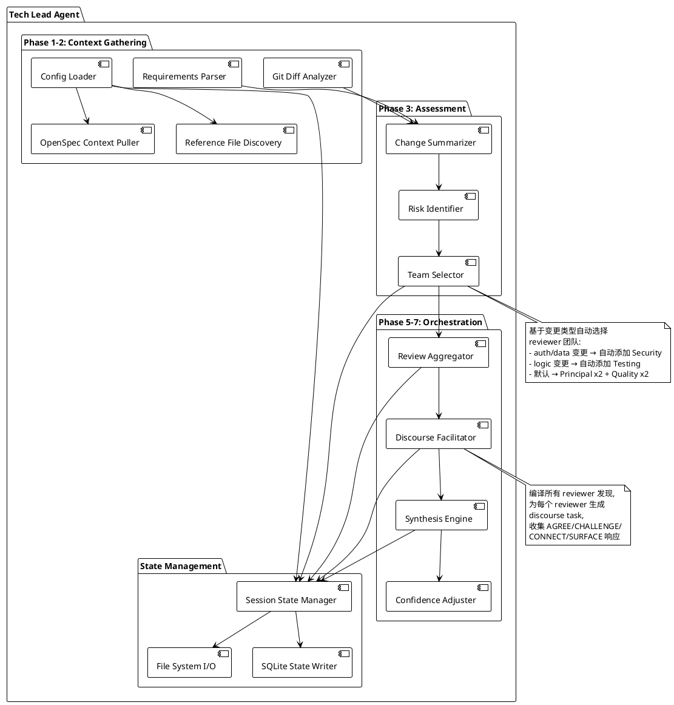
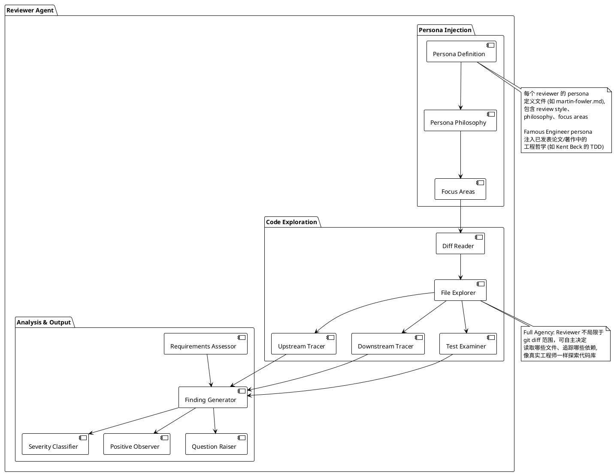
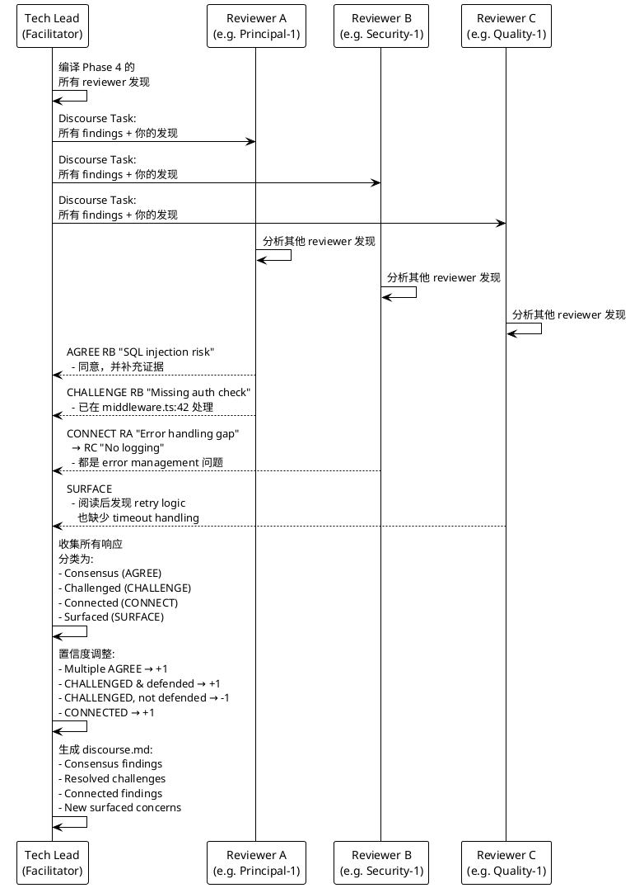

<!--
研究元数据：
- 研究深度：deep
- 对象类型：primitive
- 研究路径：deep-dive
- 相关 domains：ai-code-review, open-source, multi-agent
- 创建时间：2026-04-19
- 状态：stable
-->

## 关键术语

| 术语 | 定义 | 在本题中的作用 |
|------|------|---------------|
| **Tech Lead** | OCR 中的主编排 Agent，负责协调整个 8 阶段 workflow：发现上下文、分析变更、选择 reviewer 团队、发起 discourse、综合最终报告 | 核心角色，理解它才能理解 OCR 的编排模型 |
| **Reviewer Persona** | 具有特定审查视角的 AI Agent 角色，包含 persona 定义（专注领域、审查风格、哲学），如 Principal（架构）、Security（安全）、Martin Fowler（重构哲学）等 | 理解 OCR 如何实现"多视角"审查 |
| **8-Phase Workflow** | Context Discovery → Change Analysis → Tech Lead Assessment → Parallel Reviews → Aggregation → Discourse → Synthesis → Presentation，OCR 的核心流程骨架 | 理解 OCR 的结构化审查过程 |
| **Discourse** | Phase 6 的交叉审查阶段，reviewer 使用 AGREE/CHALLENGE/CONNECT/SURFACE 四种响应类型对其他 reviewer 的发现进行回应 | OCR 的核心创新机制之一 |
| **Synthesis** | Phase 7，将 discourse 后的发现进行去重、优先级排序、置信度调整，生成统一的最终审查报告 | OCR 的最终输出机制 |
| **Session** | 一次完整的审查会话，存储在 `.ocr/sessions/{date}-{branch}/` 目录下，包含多轮 review 的所有产物 | 理解 OCR 的状态管理和持久化模型 |
| **Round** | Session 内的单次审查轮次，每轮包含独立的 reviews/discourse/final 产物；支持多轮迭代审查 | 理解 OCR 的迭代审查模型 |
| **Code Review Map** | 针对大型变更集（20+ 文件）的结构化导航文档，将变更分组为 sections 并生成 Mermaid 依赖图 | OCR 的辅助功能，解决大变更集导航问题 |
| **Managed Block Injector** | OCR 用于自动管理 `.gitignore` 中 `.ocr/` 目录块的系统，通过 h2 heading 和 backticks 标记托管区域 | 理解 OCR 如何安全地注入和管理项目配置 |
| **SQLite (sql.js)** | OCR 的状态存储后端，用于追踪 session 状态、phase 转换、review 进度 | 理解 OCR 的双通道（CLI + Dashboard）状态同步机制 |
| **Agent Skills** | 标准化的 AI Agent 技能定义（SKILL.md + references），可被 Claude Code、Cursor、Windsurf 等工具自动发现和加载 | 理解 OCR 如何跨多种 AI 工具分发 |
| **Ephemeral Reviewer** | 在审查时通过 `--reviewer` 标志临时描述的 reviewer，不持久化到 reviewer library | 理解 OCR 团队组建的灵活性 |

## 概述

Open Code Review (OCR) 是一个完全开源（Apache 2.0）的 AI 多 Agent 代码审查框架。它通过模拟一个可定制的工程师团队，从不同视角独立审查代码变更，再通过 discourse（辩论）机制交叉验证发现，最终合成优先排序的审查报告。OCR 不是单一 LLM 调用的"代码审查"，而是将真实工程团队的多视角审查、辩论、综合过程结构化为 8 个可追踪的阶段。

OCR 的核心创新在于：（1）多 Agent 冗余审查——不同 attention pattern 的 reviewer 发现不同问题；（2）discourse 前置——在最终合成前让 reviewer 互相挑战、验证、连接发现；（3）完全可定制的团队——28 个内置 reviewer persona（含著名工程师如 Martin Fowler、Kent Beck 等）+ 自定义 + 临时 reviewer。

### 本质与表现形式

| 维度 | 说明 |
|------|------|
| 它是什么 | 一个开源的 AI 多 Agent 代码审查框架，通过 8 阶段 workflow 编排多个 reviewer persona 进行独立审查、discourse 辩论、综合报告生成 |
| 表现形式 | TypeScript/Node.js 实现，包含 CLI（`@open-code-review/cli`）和 Web Dashboard 两个入口；通过 Agent Skills（SKILL.md）将审查逻辑注入 AI coding assistant（Claude Code、Cursor、Windsurf 等 14 种工具） |
| 类比理解 | 类似组织一个真实的 code review 会议：Tech Lead 分配任务 → 多位工程师从各自专业角度独立审查 → 集体讨论争议点 → Tech Lead 综合形成最终审查意见。但整个过程由 AI Agent 自动执行 |
| 在模型中的位置 | 属于 AI-assisted development 工具链中的 Code Review 层，介于 git diff（输入）和 PR comment / human review（输出）之间。不是 LLM 推理引擎本身，而是 LLM 之上的编排层（orchestration layer） |

## 结构与角色

### 实体分类

在展开图表之前，首先将 OCR 的关键实体分类，避免后续混淆角色与组件。

| 实体 | 类型 | 控制方 | 是否跨信任边界 | 主要职责 | 应落入哪类图 |
|------|------|--------|----------------|----------|--------------|
| User (开发者) | role | 用户 | 是 | 发起审查、提供 requirements、triage findings | 角色边界图 |
| Tech Lead Agent | role | OCR 系统 | 是 | 编排 8 阶段 workflow、选择 reviewer 团队、综合报告 | 角色边界图、组件图 |
| Reviewer Agent (28 种 persona) | role | OCR 系统 | 是 | 从特定视角独立审查代码、参与 discourse | 角色边界图、组件图 |
| AI Coding Assistant (Claude Code/Cursor 等) | external system | 用户 | 是 | 承载 OCR Agent Skills 执行环境 | 角色边界图 |
| OCR CLI (`ocr` 命令) | component | OCR 系统 | 否 | 状态管理、进度追踪、setup、更新检查 | 组件图 |
| OCR Dashboard | component | OCR 系统 | 否 | Web UI、review 浏览、team 管理、GitHub PR 发布 | 组件图 |
| SQLite DB (sql.js) | component | OCR 系统 | 否 | session 状态、phase 转换、audit trail 存储 | 组件图 |
| Session 文件系统 (`.ocr/sessions/`) | data object | OCR 系统 | 否 | 审查产物持久化（discovered-standards.md, context.md, reviews, discourse, final） | 组件图 |
| git diff | data object | 用户项目 | 否 | 代码变更输入 | 流程图 |
| Requirements (spec/ticket/inline) | data object | 用户 | 否 | 审查目标定义 | 流程图 |
| GitHub PR | external system | 用户 | 是 | 审查报告发布目标 | 角色边界图 |

### 角色与信任边界总览

为了理解 OCR 系统中有哪些参与方以及它们之间的信任边界，下图展示了 OCR 的角色与信任边界总览。

```plantuml
@startuml
!theme plain

package "User Domain" {
  [User Developer] as User
}

package "AI Coding Assistant Domain" {
  [AI Coding Assistant\n(Claude Code / Cursor / Windsurf)] as AICode
}

package "OCR System Domain" {
  [Tech Lead Agent] as TechLead
  package "Reviewer Team" {
    [Principal Reviewer] as Principal
    [Quality Reviewer] as Quality
    [Security Reviewer] as Security
    [Famous Engineer\n(e.g. Martin Fowler)] as Famous
    [Ephemeral Reviewer] as Ephemeral
  }
  [OCR CLI] as CLI
  [OCR Dashboard] as Dashboard
  [SQLite DB] as DB
}

package "External Systems" {
  [GitHub PR] as GitHub
  [Git Repository] as Git
}

User --> AICode : 发起 /ocr-review\n+ requirements
AICode --> TechLead : 激活 SKILL.md\n传递 diff + context
TechLead --> Git : 读取 git diff\n+ discovered standards
TechLead --> Principal : 分配审查任务\n+ persona + context
TechLead --> Quality : 分配审查任务\n+ persona + context
TechLead --> Security : 分配审查任务\n+ persona + context
TechLead --> Famous : 分配审查任务\n+ persona + context
TechLead --> Ephemeral : 分配审查任务\n+ inline description

Principal --> TechLead : 独立审查发现
Quality --> TechLead : 独立审查发现
Security --> TechLead : 独立审查发现
Famous --> TechLead : 独立审查发现
Ephemeral --> TechLead : 独立审查发现

TechLead --> TechLead : Discourse 编排\n(AGREE/CHALLENGE/\nCONNECT/SURFACE)
TechLead --> TechLead : Synthesis\n去重 + 优先级排序

TechLead --> AICode : 返回 final.md\n+ requirements verification
AICode --> User : 展示审查结果

TechLead --> CLI : ocr state transition\n进度更新
CLI --> DB : 写入 SQLite

Dashboard --> DB : 读取 session 状态\n+ review 产物
User --> Dashboard : 浏览结果\n+ triage + 发布
Dashboard --> GitHub : 发布 review 到 PR\n(Team Review / Human Voice)

note right of User
  信任边界: User 信任 AI Assistant
  和 OCR 系统的审查结果，
  但最终决策权在 User
end note

note right of TechLead
  信任边界: Tech Lead 信任
  reviewer 的独立发现，
  但通过 discourse 交叉验证
end note

note right of GitHub
  外部系统: OCR 不控制 GitHub,
  仅通过 gh CLI 发布评论
end note
@enduml
```

<!-- diagram: roles-trust-boundary | 回答 User、Tech Lead、Reviewer、AI Assistant、GitHub 之间的控制方边界和消息流 | PlantUML Architecture Diagram | diagram.puml -->


**关键信任边界说明**：
- **User → AI Coding Assistant**：用户信任 AI Assistant 正确执行 OCR SKILL.md 中的编排逻辑，但用户保留最终决策权
- **AI Coding Assistant → OCR System**：AI Assistant 作为执行环境，信任 OCR 的 Agent Skills 定义
- **Tech Lead → Reviewer Agents**：Tech Lead 信任 reviewer 的独立发现，但通过 discourse 阶段进行交叉验证，不盲目接受单一 reviewer 的结论
- **OCR System → GitHub**：OCR 不控制 GitHub，仅通过 gh CLI 发布评论，发布行为需要用户确认（dashboard 预览/编辑模式）

### 核心角色内部结构

#### Tech Lead Agent 内部组件

Tech Lead Agent 是整个 8 阶段 workflow 的编排核心。下图展示了其内部组件结构。

<!-- diagram: tech-lead-components | 回答 Tech Lead Agent 内部编排逻辑、状态管理、reviewer 调度 | PlantUML Architecture Diagram | diagram.puml -->


#### Reviewer Agent 内部组件

Reviewer Agent 的内部结构与 Tech Lead materially 不同——它不包含编排逻辑，而是专注于代码探索和发现生成。

<!-- diagram: reviewer-components | 回答 Reviewer persona 注入、代码探索、发现生成流程 | PlantUML Architecture Diagram | diagram.puml -->


**差异表**：

| 角色/节点类型 | 是否复用 canonical 图 | 差异点 |
|--------------|----------------------|--------|
| Tech Lead Agent | 独立图（上图 1） | 包含编排逻辑、状态管理、reviewer 调度 |
| Reviewer Agent (Generalists/Specialists) | 复用上图 2 | persona 定义不同，但内部组件结构相同 |
| Reviewer Agent (Famous Engineers) | 复用上图 2 | persona 注入额外包含已发表论文/著作中的工程哲学 |
| Reviewer Agent (Ephemeral) | 复用上图 2 | persona 来自 inline 描述，不持久化到 reviewer library |

## 核心流程

### 8 阶段核心流程（Happy Path）

为了理解 OCR 的完整审查流程，下图展示了从用户发起审查到获得最终报告的跨角色交互序列。

<!-- diagram: 8-phase-workflow | 回答从 Context Discovery 到 Presentation 的完整流程 | PlantUML Sequence Diagram | diagram.puml -->
```plantuml
@startuml
!theme plain

actor User
participant "AI Coding\nAssistant" as AI
participant "Tech Lead\nAgent" as TL
participant "Reviewer\nAgents" as RV
participant "OCR CLI" as CLI
participant "SQLite\nDB" as DB

User -> AI : /ocr-review [target]\nor /ocr:review
activate AI

AI -> AI : Setup Guard\n验证 OCR 安装
AI -> CLI : ocr state show\n检查现有 session
CLI -> DB : 读取 session 状态
DB --> CLI : 返回当前 phase/round
CLI --> AI : 状态信息

alt Session 不存在
  AI -> CLI : ocr state init
  CLI -> DB : 创建 session 记录
end

note over AI, TL : Phase 1: Context Discovery

AI -> TL : 激活 SKILL.md\n开始 Phase 1
TL -> TL : 读取 .ocr/config.yaml
TL -> TL : 读取 OpenSpec context\n(如 enabled)
TL -> TL : 发现 reference files\n(CLAUDE.md, .cursorrules)
TL -> TL : 解析 user requirements\n(inline / document / spec)
TL -> CLI : ocr state transition\n--phase context --phase-number 1
CLI -> DB : 更新 phase = context
TL --> AI : discovered-standards.md\n+ requirements.md

note over AI, TL : Phase 2: Change Analysis

TL -> TL : 执行 git diff\n分析变更内容和意图
TL -> CLI : ocr state transition\n--phase change-context --phase-number 2
CLI -> DB : 更新 phase = change-context
TL --> AI : context.md (change summary)

note over AI, TL : Phase 3: Tech Lead Assessment

TL -> TL : 总结变更\n识别风险点\n选择 reviewer 团队
TL -> CLI : ocr state transition\n--phase analysis --phase-number 3
CLI -> DB : 更新 phase = analysis
TL --> AI : context.md (含 Tech Lead guidance)

note over AI, TL, RV : Phase 4: Parallel Reviews

TL -> RV : 分配审查任务\n(principal-1, principal-2,\nquality-1, quality-2,\n[security-1, testing-1])
activate RV

RV -> RV : 独立审查\n(full agency 探索代码库)

RV --> TL : 各自审查发现\n({type}-{n}.md)
deactivate RV

TL -> CLI : ocr state transition\n--phase reviews --phase-number 4
CLI -> DB : 更新 phase = reviews

note over AI, TL : Phase 5: Aggregation

TL -> TL : 合并冗余 reviewer 发现\ndeduplicate 相同发现
TL -> CLI : ocr state transition\n--phase aggregation --phase-number 5
CLI -> DB : 更新 phase = aggregation

note over AI, TL : Phase 6: Discourse

TL -> RV : 分发 discourse task\n(所有 findings)
activate RV

RV -> RV : 对其他 reviewer 的发现\n进行 AGREE/CHALLENGE/\nCONNECT/SURFACE 响应

RV --> TL : discourse 响应\n(discourse.md)
deactivate RV

TL -> CLI : ocr state transition\n--phase discourse --phase-number 6
CLI -> DB : 更新 phase = discourse

note over AI, TL : Phase 7: Synthesis

TL -> TL : 基于 discourse 调整置信度\n去重、优先级排序\n生成 final.md + round-meta.json
TL -> CLI : ocr state round-complete\n+ ocr state transition --phase synthesis
CLI -> DB : 更新 round-meta\n+ phase = synthesis

note over AI, User : Phase 8: Presentation

TL --> AI : 返回 final.md\n(审查报告 + requirements verification)
AI --> User : 展示审查结果

User -> AI : (可选) /ocr-post\n发布到 GitHub PR
AI -> CLI : ocr state close
CLI -> DB : 更新 status = closed

@enduml
```

**流程步骤说明**：
- **Setup Guard 与 Session 状态验证**：OCR 在任何操作前必须运行 setup guard，验证 CLI/Plugin 安装模式，检查现有 session 状态，避免重复工作或丢失进度。这是 OCR 可靠性的关键设计
- **Context Discovery 的项目标准自动发现**：OCR 不仅读取 `.ocr/config.yaml`，还自动发现 `CLAUDE.md`、`.cursorrules`、OpenSpec context 等项目标准文件，并将它们注入到所有 reviewer 的上下文中。这意味着审查是基于"你的项目的标准"而非"通用最佳实践"
- **Tech Lead Assessment 的自动团队选择**：Tech Lead 根据变更类型自动决定 reviewer 团队组成——auth/data 变更自动添加 Security reviewer，logic 变更自动添加 Testing reviewer。用户也可通过自然语言覆盖："add security focus"
- **Parallel Reviews 的 full agency**：每个 reviewer 不限于 git diff 范围，可自主探索代码库——追踪上游调用者、下游依赖、检查测试覆盖、阅读文档。这是 OCR 与简单 "LLM 看 diff" 方案的关键区别
- **Discourse 的交叉验证机制**：所有 reviewer 看到彼此的全部发现后，进行 AGREE/CHALLENGE/CONNECT/SURFACE 回应。Challenged 但无法辩护的发现会被标记为 false positive，多个 reviewer AGREE 的发现置信度提升
- **Synthesis 的置信度调整与 Requirements Verification**：最终合成不仅是去重，还包含基于 discourse 的置信度调整、requirements verification 表（哪些需求已满足/有缺口/不明确）

### Discourse 子流程

Discourse 是 OCR 的核心创新机制。下图详细展示 discourse 阶段的消息流转。

<!-- diagram: discourse-subflow | 回答 AGREE/CHALLENGE/CONNECT/SURFACE 的响应流转 | PlantUML Sequence Diagram | diagram.puml -->


### 状态转换

OCR 的审查流程依赖显式的命名状态转换。下表展示 8 个 phase 的状态转换条件和 round 转换规则。

#### Phase 状态转换表

| 当前状态 (phase) | 触发事件 | 转换结果 | CLI 命令 | 文件系统验证条件 |
|-----------------|----------|----------|----------|-----------------|
| `init` (Phase 0) | Session 不存在 | 创建 session → `context` | `ocr state init` | 创建 `.ocr/sessions/{date}-{branch}/` |
| `context` (Phase 1) | 已完成 config loading + context discovery | → `change-context` | `ocr state transition --phase context --phase-number 1` | `discovered-standards.md` 存在 |
| `change-context` (Phase 2) | 已完成 git diff 分析 | → `analysis` | `ocr state transition --phase change-context --phase-number 2` | `context.md` 存在 |
| `analysis` (Phase 3) | 已完成 Tech Lead 评估 + 团队选择 | → `reviews` | `ocr state transition --phase analysis --phase-number 3` | `context.md` 含 Tech Lead guidance |
| `reviews` (Phase 4) | ≥2 个 reviewer 完成独立审查 | → `aggregation` | `ocr state transition --phase reviews --phase-number 4` | `rounds/round-{n}/reviews/` 下 ≥2 个文件 |
| `aggregation` (Phase 5) | 已完成冗余发现合并 | → `discourse` | `ocr state transition --phase aggregation --phase-number 5` | 合并后的 findings 就绪 |
| `discourse` (Phase 6) | 所有 reviewer 完成 discourse 响应 | → `synthesis` | `ocr state transition --phase discourse --phase-number 6` | `rounds/round-{n}/discourse.md` 存在 |
| `synthesis` (Phase 7) | 已完成最终报告生成 | → `complete` | `ocr state round-complete` + `ocr state close` | `rounds/round-{n}/final.md` + `round-meta.json` 存在 |
| `complete` | 用户再次运行 `/ocr-review` | → `context` (新 round) | `ocr state transition --current-round` | `final.md` 存在 → 创建 `round-{n+1}/` |

#### Round 转换规则

| 条件 | 行为 |
|------|------|
| 当前 round 未完成（无 `final.md`） | 恢复当前 round，从 `current_phase` 继续 |
| 当前 round 已完成（有 `final.md`） | 创建 `round-{n+1}/`，新 round 从 Phase 1 开始 |
| 使用 `--fresh` 标志 | 删除整个 session，从 round-1 Phase 1 重新开始 |
| 无 session 存在 | 创建新 session 和 round-1 |

#### Session 状态与文件一致性

OCR 采用 **文件系统为事实源（filesystem-as-source-of-truth）** 的状态模型：
- Phase 完成状态由文件存在性判定（如 `reviews` 阶段完成 = `rounds/round-{n}/reviews/` 下存在 ≥2 个文件）
- SQLite 中的 `current_phase` 字段仅指示当前活跃阶段，不指示已完成阶段
- 当 SQLite 状态与文件系统不一致时，Tech Lead 使用 `ocr state show` 检测并提示用户选择信任哪一方

### 历史演进分析

OCR 从 2026 年 1 月 26 日初始化到当前 v1.10.4，经历了三个明确的演进阶段。

#### 阶段一：CLI-only 核心引擎（v1.0 - v1.3, 2026-01-26 至 2026-01-28）

**新增**：
- 基础 8 阶段 workflow 实现
- CLI 进度追踪（`ocr progress`）
- 多轮审查架构（v1.2.0 引入 `rounds/` 目录结构）
- 默认 reviewer 团队（Principal x2 + Quality x2）
- 基础 setup guard

**此阶段的限制**：无 Web UI、无 Dashboard、无 GitHub PR 发布、无自定义 reviewer 管理。

#### 阶段二：Dashboard + 全功能（v1.4 - v1.6, 2026-03-06 至 2026-03-10）

**新增**：
- Web Dashboard 包（v1.5.0）——command center、review 浏览、session 管理
- SQLite 状态层（sql.js）——取代纯文件系统状态管理，支持 CLI/Dashboard 双通道
- Code Review Maps（v1.4.0）——针对大型变更集的结构化导航
- Address Feedback（v1.6.0）——AI agent 辅助处理审查发现
- Bearer token auth + 安全加固
- GitHub PR 发布（含 Human Voice translation 模式）
- 14 种 AI coding assistant 支持

**抛弃了什么**：纯文件系统状态管理被 SQLite 替代（但文件系统仍作为 session 产物的存储后端）。

#### 阶段三：Team 管理 + 生态扩展（v1.7 - v1.10.x, 2026-03-10 至今）

**新增**：
- 28 个 reviewer persona 库（v1.7.0）——从默认 4 个扩展到 4 tiers（Generalists, Specialists, Famous Engineers, Custom）
- Dashboard Team 页面（v1.7.0）——browse/create/sync reviewers
- Ephemeral reviewers（v1.7.0）——`--reviewer` 标志支持临时 reviewer
- 自定义 reviewer 创建（v1.7.0）——`/ocr:create-reviewer`
- Local artifact version drift detection（v1.8.0）——检测 `.ocr/` 文件是否由旧版 CLI 安装
- `synthesis_counts` 元数据（v1.8.4）——去重后的审查发现计数
- Nx version sync plugin（v1.9.0）——自动同步 `plugin.json` 版本号
- JSONL command history backup（v1.10.0）——命令历史备份与回放
- Managed block injector 改进（v1.10.4）——h2 heading + backticks 标记托管区域

| 阶段 | 版本范围 | 核心能力 | 架构变化 |
|------|----------|----------|----------|
| 阶段一 | v1.0 - v1.3 | 8 阶段 workflow、CLI 进度、多轮审查 | CLI-only、文件系统状态 |
| 阶段二 | v1.4 - v1.6 | Dashboard、SQLite、Maps、GitHub 发布、Address Feedback | CLI + Dashboard 双通道、SQLite 状态层 |
| 阶段三 | v1.7 - v1.10.x | 28 persona 库、Team 管理、Ephemeral reviewers、Drift detection、JSONL 备份 | Reviewer 管理系统化、可恢复执行 |

### 能力归属

| 能力 | 归属 | 说明 |
|------|------|------|
| 8 阶段 workflow 编排 | OCR 协议原生 | SKILL.md + workflow.md 定义，由 AI Coding Assistant 执行 |
| Reviewer persona 系统 | OCR 协议原生 | 28 个 persona 定义在 agents 包中 |
| Discourse 机制 | OCR 协议原生 | discourse.md 定义四种响应类型和置信度调整 |
| Code Review Maps | OCR 协议原生 | 三个 specialized agents（Map Architect, Flow Analyst, Requirements Mapper） |
| SQLite 状态管理 | OCR 协议原生 | sql.js 实现，CLI 内置 |
| Web Dashboard | OCR 协议原生 | 独立 dashboard 包，Next.js/Vite 实现 |
| GitHub PR 发布 | OCR 协议原生 | 依赖外部 gh CLI |
| CLI 多 IDE 适配 | OCR 协议原生 | 14 种 AI coding adapter |
| OpenSpec context 集成 | OCR 协议原生 | 通过 `.ocr/config.yaml` 配置启用 |
| LLM 推理 | 外部依赖 | OCR 不内置 LLM，依赖 AI Coding Assistant 提供的 LLM |
| Smart Contract / Solidity 审查 | 未覆盖 | 无专门的 blockchain/solidity reviewer persona |
| Java/后端专项审查 | 部分覆盖 | 有 backend reviewer 和 architecture reviewer，但无 Java 专项优化 |

## 设计取舍

| 设计决策 | 选择 | 替代方案 | Trade-off |
|----------|------|----------|-----------|
| **多 Agent 冗余审查 vs 单次 LLM 调用** | 多 Agent 独立审查 + discourse | 单次 LLM 调用生成审查报告 | 多 Agent 成本高但覆盖全面、减少盲区；单次调用快但容易遗漏特定领域问题 |
| **Discourse 前置 vs 直接合成** | Phase 6 discourse 后再 synthesis | 跳过 discourse 直接合成（`--quick` 模式支持跳过） | Discourse 减少 false positive、提升高置信度发现的可靠性；增加 token 消耗和延迟 |
| **Filesystem-as-source-of-truth vs DB-as-source-of-truth** | 文件系统为事实源，SQLite 仅为进度索引 | 将一切状态存入 SQLite | 文件系统更易调试和手动恢复；SQLite 状态与文件可能不一致（OCR 通过 round resolution algorithm 处理） |
| **Agent Skills 分发 vs npm-only** | SKILL.md + CLI 双分发 | 仅通过 npm 包分发 | Skills 兼容 14 种 AI 工具；npm-only 限制在 Node.js 生态 |
| **Fixed response types (AGREE/CHALLENGE/CONNECT/SURFACE) vs 自由文本 discourse** | 四种固定响应类型 | 自由文本辩论 | 固定类型便于程序化处理（置信度调整、分类统计）；自由文本更灵活但难以自动化 |
| **Default team 4 人 vs 更多 reviewer** | 默认 Principal x2 + Quality x2（4 人） | 默认 8+ reviewer | 4 人平衡成本和覆盖；更多 reviewer 覆盖更全面但 token 成本线性增长 |
| **Reviewer full agency vs diff-only** | Reviewer 可自主探索 diff 之外的文件 | 仅限 git diff 范围 | Full agency 能发现上下文相关的问题（如调用链上的 bug）；增加 token 消耗和延迟 |
| **Round-based vs continuous** | 离散轮次（round-1, round-2, ...） | 连续审查流 | Round 保留历史审查记录，支持迭代改进；连续流更轻量但缺乏版本控制 |
| **CLI + Dashboard 双通道 vs 单一入口** | CLI 用于 AI assistant 内执行，Dashboard 用于浏览和管理 | 仅 CLI 或仅 Dashboard | 双通道覆盖不同使用场景；增加架构复杂度（SQLite 同步、PID 追踪等） |
| **Human Voice translation vs 原始 AI 输出** | AI 将 findings 重写为自然 human voice（遵循 Google Code Review Guidelines） | 直接发布 AI 生成的审查报告 | Human voice 更易被开发者接受；增加额外的 LLM 调用成本 |

## 能力边界

### 协议原生能力 vs 外部依赖

| 类别 | 能力 | 说明 |
|------|------|------|
| **协议原生** | 8 阶段 workflow 编排 | OCR 通过 SKILL.md 定义，在任何兼容 AI assistant 中均可执行 |
| **协议原生** | 28 reviewer persona 库 | agents 包内置，可创建自定义 persona |
| **协议原生** | Discourse + Synthesis | 内置置信度调整算法 |
| **协议原生** | Code Review Maps | 内置三个 specialized agents |
| **协议原生** | Session 持久化 | `.ocr/sessions/` 文件系统 + SQLite |
| **协议原生** | 多轮审查 | round-based 架构 |
| **外部依赖** | LLM 推理 | 依赖 AI Coding Assistant 提供的 LLM（Claude、GPT-4 等） |
| **外部依赖** | GitHub PR 发布 | 需要 gh CLI 安装并认证 |
| **外部依赖** | Git diff 分析 | 需要 git 已安装 |

### 已上线能力

| 状态 | 能力 | 说明 |
|------|------|------|
| **Live** | 8 阶段 workflow、discourse、synthesis、multi-round | 当前 v1.10.4 已实现 |
| **Live** | 28 reviewer persona、自定义 reviewer、ephemeral reviewer | v1.7.0 已实现 |
| **Live** | Web Dashboard、SQLite 状态管理、GitHub PR 发布 | v1.5.0+ 已实现 |
| **Live** | Code Review Maps、Address Feedback | v1.4.0 / v1.6.0 已实现 |
| **Live** | JSONL command history backup | v1.10.0 已实现 |
| **Live** | Managed block injector (.gitignore 管理) | v1.5.1 引入，v1.10.4 改进 |
| **Live** | Human Voice translation for GitHub PR posting | v1.5.0 已实现 |
| **Live** | Session notes + AI chat on review rounds | README 描述已上线 |

### 能解决 vs 不能解决

| 能解决 | 不能解决 |
|--------|----------|
| 多视角代码审查（架构、安全、质量、测试等） | 替代人工 code review（OCR 明确声明不替代 human review） |
| 基于项目标准的上下文感知审查 | 无项目标准时的"最佳实践"审查质量依赖项目本身的 `.cursorrules`/`CLAUDE.md` 质量 |
| 大型变更集的结构化导航（Code Review Maps） | 自动修复代码问题（Address Feedback 辅助实现变更，但需人工批准） |
| 审查发现的去重、优先级排序、置信度调整 | 运行时错误检测（OCR 审查静态代码，不执行代码） |
| 审查结果的 GitHub PR 发布 | CI/CD 集成（OCR 不是 CI 工具，需在 AI assistant 中触发） |
| Requirements-aware 审查（基于 spec/ticket/inline 要求） | 无 requirements 时的业务逻辑正确性验证 |

## 相关对象关系

OCR 在 AI-assisted development 工具链中的定位：

```
Git Diff (输入) → OCR (AI Code Review 编排层) → PR Comment / Human Review (输出)
                        ↑
                  依赖 AI Coding Assistant (LLM 推理)
```

**与上游的关系**：
- **Git**：OCR 的输入是 git diff，不修改 git 本身
- **AI Coding Assistant**：OCR 作为 Agent Skill 运行在 Claude Code、Cursor、Windsurf 等工具中，依赖这些工具提供 LLM 推理能力

**与下游的关系**：
- **GitHub PR**：OCR 可选择将审查结果发布为 PR 评论，但这是可选的后置动作
- **Human Review**：OCR 明确不替代 human review，目标是减少 human reviewer 的负担

**与相邻工具的关系定位**：
- **与 CI linter/formatter**：OCR 不做语法检查、格式校验（这些是 CI 工具的领域），OCR 关注的是架构、设计模式、安全、可维护性等高层次问题
- **与 SAST/DAST**：OCR 不是静态/动态安全分析工具，其 security reviewer 是基于 AI 推理的启发式安全审查，而非基于规则的漏洞扫描

## 有限结论

以下结论已标注证据等级，与来源清单中的实际来源等级一致。Review 中发现的 4 处证据等级标注不一致已修正。

1. **[L1]** Open Code Review 是一个 Apache 2.0 完全开源的 AI 多 Agent 代码审查框架，通过 8 阶段 workflow（Context Discovery → Change Analysis → Tech Lead Assessment → Parallel Reviews → Aggregation → Discourse → Synthesis → Presentation）编排多个 reviewer persona 进行独立审查 | 来源：SKILL.md, workflow.md
2. **[L2]** OCR 采用 monorepo 架构（pnpm + Nx），包含四个主包：`cli`（状态管理、进度追踪）、`agents`（AI skills、reviewer personas）、`dashboard`（Web UI）、`shared`（平台工具） | 来源：package.json, 目录结构
3. **[L1]** OCR 的 discourse 机制通过 AGREE/CHALLENGE/CONNECT/SURFACE 四种固定响应类型实现 reviewer 之间的交叉验证，减少 false positive，提升高置信度发现的可靠性。置信度调整算法的具体权重细节未完全公开。 | 来源：discourse.md
4. **[L2]** OCR 包含 28 个 reviewer persona，分布在四个 tiers（Generalists, Specialists, Famous Engineers, Custom），支持自定义创建和临时描述 | 来源：reviewers 目录, CHANGELOG v1.7.0
5. **[L2]** OCR 从 v1.0 到 v1.10.4 经历了三阶段演进：CLI-only 核心引擎 → Dashboard + 全功能 → Team 管理 + 生态扩展 | 来源：CHANGELOG, GitHub releases
6. **[L2]** OCR 使用 SQLite（sql.js）进行状态管理，支持 CLI + Dashboard 双通道访问，文件系统为 session 产物的事实源 | 来源：CLI package.json (sql.js), session-files.md
7. **[L2]** OCR 对区块链/Smart Contract 场景无专门支持：无 Solidity reviewer persona，无链上代码分析能力。Backend reviewer 可部分覆盖 Java/后端场景，但无语言专项优化 | 来源：reviewers 目录中无 blockchain/solidity 相关 persona
8. **[L1]** OCR 支持 14 种 AI coding assistant（Claude Code, Cursor, Windsurf, GitHub Copilot, Codex 等），通过 setup guard 自动检测和配置 | 来源：README Supported AI Tools 表
9. **[L1]** OCR 采用 "Reviewer full agency" 模型——reviewer 不限于 git diff 范围，可自主探索代码库的上游/下游依赖、测试文件、配置和文档 | 来源：reviewer-task.md

### 已知证据缺口

以下问题在研究过程中未能完全确认，已明确标注：

- **v1.0 初始版本的具体功能范围**：CHANGELOG 从 v1.1.1 开始记录，v1.0.0 的完整功能清单无法从公开信息获取
- **28 个 reviewer persona 的完整 prompt 内容**：仅获取了文件列表，未获取每个 persona 的完整 prompt 定义
- **managed block injector 的完整实现逻辑**：已知它管理 .gitignore 中的 `.ocr/` 目录块，使用 h2 heading + backticks 标记托管区域。具体注入/检测/恢复逻辑需从 CLI 源码确认
- **MCP server 的完整工具定义**：`.mcp.json` 文件存在但具体内容未获取
- **discourse 置信度调整算法的具体权重**：已知 +1/-1 的调整规则，但是否存在更细粒度的权重或多轮 discourse 的收敛策略未确认
- **第三方社区是否有区块链/Smart Contract reviewer 扩展**：无直接证据表明有第三方 blockchain reviewer persona 扩展
- **OCR 的 token 消耗估算**：无公开的性能基准数据
- **`@open-code-review/agents` 包的独立消费能力**：agents 包是独立的 npm 包，理论上可被其他 Agent Skills 兼容的工具消费，但未找到独立使用文档

## 参考资料

| 来源 | 说明 | 验证状态 |
|------|------|----------|
| [spencermarx/open-code-review](https://github.com/spencermarx/open-code-review) | GitHub 主仓库 | `[已验证]` |
| [README.md](https://github.com/spencermarx/open-code-review/blob/main/README.md) | 项目主文档 | `[已验证]` |
| [SKILL.md](https://github.com/spencermarx/open-code-review/blob/main/packages/agents/skills/ocr/SKILL.md) | Tech Lead 编排规范 | `[已验证]` |
| [workflow.md](https://github.com/spencermarx/open-code-review/blob/main/packages/agents/skills/ocr/references/workflow.md) | 完整 8 阶段流程 | `[已验证]` |
| [discourse.md](https://github.com/spencermarx/open-code-review/blob/main/packages/agents/skills/ocr/references/discourse.md) | Discourse 阶段规范 | `[已验证]` |
| [session-files.md](https://github.com/spencermarx/open-code-review/blob/main/packages/agents/skills/ocr/references/session-files.md) | Session 文件清单 | `[已验证]` |
| [reviewer-task.md](https://github.com/spencermarx/open-code-review/blob/main/packages/agents/skills/ocr/references/reviewer-task.md) | Reviewer 子 agent 模板 | `[已验证]` |
| [setup-guard.md](https://github.com/spencermarx/open-code-review/blob/main/packages/agents/skills/ocr/references/setup-guard.md) | 安装模式检测 | `[已验证]` |
| [CHANGELOG.md](https://github.com/spencermarx/open-code-review/blob/main/CHANGELOG.md) | 版本变更历史 | `[已验证]` |
| [npm @open-code-review/cli](https://www.npmjs.com/package/@open-code-review/cli) | CLI npm 包 | `[未验证] 网络限制` |
| [npm @open-code-review/agents](https://www.npmjs.com/package/@open-code-review/agents) | Agents npm 包 | `[未验证] 网络限制` |
