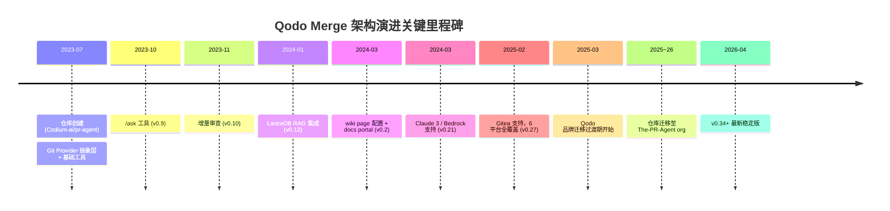

<!-- 目录 -->
- [概述](#概述)
- [关键术语](#关键术语)
- [实体分类](#实体分类)
- [分析正文](#分析正文)
  - [演进路线图](#演进路线图)
  - [阶段一：多平台 PR 审查基础架构（2023-07 ~ 2023-11）](#阶段一多平台-pr-审查基础架构2023-07--2023-11)
  - [阶段二：AI 增强的上下文感知审查（2023-12 ~ 2024-05）](#阶段二ai-增强的上下文感知审查2023-12--2024-05)
  - [阶段三：平台化与生态分化（2024-06 ~ 至今）](#阶段三平台化与生态分化2024-06--至今)
- [架构分层图](#架构分层图)
- [角色分析：开源版 vs 商业版](#角色分析开源版-vs-商业版)
- [设计取舍](#设计取舍)
- [能力边界](#能力边界)
- [相关对象关系](#相关对象关系)
- [结论](#结论)
- [待确认问题](#待确认问题)
- [参考资料](#参考资料)

## 概述

Qodo Merge（原 CodiumAI PR-Agent）是当前最成熟的开源 LLM-native PR 审查工具之一，以 Python 实现，支持 GitHub、GitLab、BitBucket、Azure DevOps、Gitea、BitBucket Server 等六大 Git 平台。项目从 2023 年 7 月创建至今，经历了从单一平台 diff 审查工具到多模型、RAG 增强的 AI 代码审查平台的架构跃迁。其演进不仅是功能叠加，更是"如何有效将 LLM 能力嵌入 PR 审查工作流"这一核心问题的持续探索。

本项目经历了三次架构模式变化：从 git provider 抽象层建立多平台基础，到 RAG + 多模型引入实现 AI 增强的上下文感知审查，再到平台化治理与开源/商业分化。其中，2024-06 至 2025-02 期间（旧版 artifact 所称的"阶段三"）实际上并未发生独立的架构模式变化，应归入后续的平台化阶段。

### 本质与表现形式

| 维度 | 说明 |
|------|------|
| 它是什么 | AI 驱动的 PR 审查平台，通过 LLM 对代码变更进行自动化审查、描述生成、改进建议 |
| 表现形式 | GitHub 开源仓库 (`The-PR-Agent/pr-agent`)、官方文档 (`docs.qodo.io`)、GitHub Marketplace App、PyPI CLI 包 (`pr-agent`) |
| 类比理解 | 类似 CodeRabbit 的 AI PR 审查定位，但采用开源核心模式，通过 git provider 抽象层实现多平台覆盖 |
| 在模型中的位置 | AI Code Review 工具层的 primitive，位于 LLM API 之上、Git 平台 API 之下的中间件层 |

## 关键术语

| 术语 | 定义 | 在本题中的作用 |
|------|------|---------------|
| PR-Agent | Qodo Merge 的开源项目名称，PyPI 包名为 `pr-agent`，是理解开源版身份的关键词 |
| Qodo Merge | CodiumAI 品牌更名为 Qodo 后的产品名称，对应原 CodiumAI PR-Agent |
| Qodo Merge Pro | Qodo 的商业版产品线，在开源版基础上增加 compliance check、chat on suggestions 等企业级功能 |
| Git Provider 抽象层 | `GitProvider` 抽象类定义的统一接口（review、publish、get_diff 等），是支持多平台的架构基础 |
| PR Compression Strategy | 处理超大 PR 的核心策略：token-aware diff 拟合、文件优先级排序、分块审查 |
| RAG (Retrieval-Augmented Generation) | v0.12 引入的 LanceDB 集成，允许检索仓库历史讨论来增强审查上下文 |
| Dynamic Context Expansion | 自动将 diff hunk 上下文扩展到类定义、函数签名、import 语句等，提升 LLM 理解能力 |
| Incremental Review | v0.10 引入的增量审查机制，只审查新增 diff，是 PR 压缩策略的早期形态 |
| "This repo is not the Qodo free tier!" | 开源仓库描述中的关键声明，区分开源版与 Qodo 商业免费版的功能和治理边界 |

## 实体分类

为清晰界定 Qodo Merge 系统中的各参与方及其关系，首先进行实体分类：

| 实体 | 类型 | 控制方 | 是否跨信任边界 | 主要职责 | 应落入哪类图 |
|------|------|--------|----------------|----------|--------------|
| Qodo Merge 开源版 (pr-agent) | component | 社区/The-PR-Agent org | 否（内部组件） | 核心审查工具链（review/describe/improve/ask） | 组件架构图 |
| Qodo Merge Pro | component | Qodo 公司 | 否（内部组件） | 商业独占功能（compliance、chat on suggestions） | 组件架构图（差异表） |
| LLM Backend (OpenAI/Claude/Gemini/Bedrock) | external system | 第三方 LLM 提供商 | 是（API 调用依赖） | 提供推理能力 | 架构图（外部依赖） |
| Git Platform (GitHub/GitLab/等) | external system | 各平台方 | 是（API 调用依赖） | 提供 PR/diff 数据和评论发布接口 | 架构图（外部依赖） |
| 用户（开发者） | role | 用户自身 | 是（工具使用者） | 触发审查命令、查看结果、迭代代码 | 流程图 |
| 仓库管理员 | role | 用户/组织 | 是（配置管理者） | 配置 TOML、wiki page、平台参数 | 流程图 |
| LanceDB（RAG 存储） | component | pr-agent 进程 | 否 | 本地向量存储，支持历史讨论检索 | 组件架构图 |

## 分析正文

### 演进路线图

以下演进路线图按"架构模式变化"原则划分，展示 Qodo Merge 从创建至今经历的三次架构跃迁。每个阶段代表一次架构模式的根本变化，而非简单的功能叠加。

```
架构模式演进路线图
═══════════════════════════════════════════════════════════════════════

阶段一                    阶段二                      阶段三
多平台PR审查基础    →    AI增强上下文感知审查    →    平台化与生态分化
(2023-07 ~ 2023-11)       (2023-12 ~ 2024-05)          (2024-06 ~ 至今)

┌──────────────────┐     ┌──────────────────┐     ┌──────────────────┐
│  架构模式：       │     │  架构模式：         │     │  架构模式：       │
│  Provider 抽象层  │     │  RAG + 多模型      │     │  平台化治理      │
│  + 工具化         │     │  + 动态上下文      │     │  + 生态分化      │
│                  │     │                  │     │                  │
│  核心问题：       │     │  核心问题：         │     │  核心问题：       │
│  "如何跨平台     │────▶│  "如何让LLM理解    │────▶│  "如何治理和      │
│   复用审查逻辑"  │     │   代码上下文?"      │     │   商业化?"       │
│                  │     │                  │     │                  │
│  关键引入：       │     │  关键引入：         │     │  关键引入：       │
│  · GitProvider    │     │  · LanceDB RAG     │     │  · Gitea支持     │
│    抽象层         │     │  · 多模型后端       │     │  · 配置系统成熟   │
│  · /review        │     │  · Dynamic Context  │     │  · 开源/商业分化  │
│  · /describe      │     │    Expansion        │     │  · 仓库迁移       │
│  · /improve       │     │  · Bedrock/Claude3  │     │  · 持续维护      │
│  · /ask (v0.9)   │     │                  │     │                  │
│  · Incremental    │     │  关键抛弃/退化：     │     │  关键抛弃/退化：   │
│    Review (v0.10) │     │  · 单模型限制打破    │     │  · LanceDB可能    │
│                  │     │    (OpenAI独占)      │     │    降级或替代     │
│  架构特征：       │     │                  │     │  · 密集功能迭代     │
│  单层工具架构     │     │  架构特征：         │     │    阶段结束        │
│  各平台独立Docker │     │  两层架构：         │     │                  │
│                  │     │  RAG层 + LLM层      │     │  架构特征：       │
│                  │     │  多后端路由          │     │  平台化+治理分层   │
│                  │     │                  │     │                  │
│  版本区间：       │     │  版本区间：         │     │  版本区间：       │
│  v0.7 ~ v0.10     │     │  v0.11 ~ v0.22      │     │  v0.23 ~ v0.34+  │
└──────────────────┘     └──────────────────┘     └──────────────────┘

═══════════════════════════════════════════════════════════════════════
```

**关键里程碑时间线（Mermaid 格式）**



**阶段划分说明**：旧版 artifact 将项目划分为四个阶段，其中"阶段三"（2024-06 ~ 2025-02）仅包含 Gitea 支持 (v0.27) 和若干维护性改进，不构成独立的架构模式变化。本 artifact 按"架构模式变化"原则，将旧版的阶段三和阶段四合并为统一的"阶段三：平台化与生态分化"，以"架构成熟度 + 治理模式"为统一主题。

---

### 阶段一：多平台 PR 审查基础架构（2023-07 ~ 2023-11）

**阶段总述**：这一阶段的核心技术思考是**如何通过架构抽象实现跨平台复用**。项目从创建之初就避免了"为每个 Git 平台编写独立工具"的路径依赖，而是通过 `GitProvider` 抽象层将审查逻辑与平台 API 解耦。这奠定了后续所有演进的架构基础——无论后续增加多少功能或多模型支持，都建立在这一抽象层之上。[L2, gh-repo-pr-agent-current]

**新增的核心架构能力**：

- **GitProvider 抽象层**：定义统一的 `GitProvider` 接口，包含 `review`、`publish`、`get_diff` 等核心操作。后续新增平台支持（GitLab、BitBucket、Azure DevOps、Gitea、BitBucket Server）只需实现该接口，无需修改核心审查逻辑。[L4, baseline-artifact]
- **工具化功能设计**：初始即包含 `/review`（PR 审查）、`/describe`（PR 描述生成）、`/improve`（代码改进建议）三大核心工具，每个工具是独立的 LLM prompt + 处理管线。[L4, baseline-artifact]
- **增量审查（v0.10）**：只审查新增 diff 而非完整 PR，是后续 PR Compression Strategy 的雏形。这一机制直接回应了 LLM context window 有限的核心约束。[L4, baseline-artifact]
- **`/ask` 工具（v0.9）**：允许用户对 PR 进行自然语言提问，扩展了单向审查为交互式对话。[L4, baseline-artifact]
- **多平台 Docker 部署**：各平台对应独立的 Docker 镜像和 webhook handler，部署方式与平台绑定。[L4, baseline-artifact]

**抛弃/未采用的模式**：
- 未采用平台特定的硬编码实现（选择了抽象层模式）
- 未采用"完整 PR diff 一次性审查"模式（选择了增量审查）

**代表的技术思考**：LLM-native 工具的首要约束不是模型能力，而是工程架构。通过抽象层将"审查逻辑"与"平台交互"分离，使得后续无论增加多少平台或模型，核心逻辑保持不变。这一选择使 pr-agent 从一开始就具备了跨平台扩展的架构基础。[L4, baseline-artifact 综合推断]

---

### 阶段二：AI 增强的上下文感知审查（2023-12 ~ 2024-05）

**阶段总述**：这一阶段的核心技术思考是**如何让 LLM 理解代码上下文，而非仅看到 diff hunk**。单纯的 diff 审查丢失了大量上下文信息（类定义、调用关系、历史讨论），这一阶段通过 RAG 集成和多模型支持，将工具从"diff 标注器"升级为"上下文感知审查引擎"。这是项目最重要的一次架构跃迁。[L4, baseline-artifact]

**新增的核心架构能力**：

- **LanceDB RAG 集成（v0.12）**：引入本地向量数据库 LanceDB，支持检索仓库历史讨论和相似代码变更。这标志着架构从"纯 LLM prompt"演进为"RAG + LLM"两层架构：先通过 RAG 检索相关上下文，再送入 LLM 进行审查。[L4, baseline-artifact]
- **多模型后端支持**：从仅 OpenAI 扩展到 Anthropic Claude 3 (v0.21)、AWS Bedrock (v0.21)、`gpt-4-turbo-preview` (v0.22)。架构上引入了模型路由层，用户可配置不同模型后端。[L4, baseline-artifact]
- **Dynamic Context Expansion**：自动将 diff hunk 上下文扩展到包含类定义、函数签名、import 语句，使 LLM 能理解变更在更大代码结构中的角色。[L4, baseline-artifact 分析，L2 待代码验证]
- **配置系统大幅改进**：从环境变量演进为 TOML 配置文件 + wiki page 配置（v0.2），不同仓库可有不同的审查策略。这为后续企业化部署奠定了基础。[L4, baseline-artifact]
- **similar code 工具（v0.2）**：检测仓库中的相似代码片段，与 RAG 能力协同增强代码理解。[L4, baseline-artifact]
- **docs portal 文档门户（v0.2）**：提供结构化的文档入口。[L4, baseline-artifact]

**抛弃/退化的模式**：
- OpenAI 独占被打破：从单一 LLM 后端变为多模型路由，牺牲了"默认配置简单性"换取了"模型选择灵活性"。
- 简单环境变量配置被淘汰：无法满足细粒度控制需求，被 TOML + wiki page 配置替代。

**代表的技术思考**：LLM 代码审查的质量瓶颈不在模型本身，而在上下文供给。这一阶段通过 RAG 和动态上下文扩展，系统性地解决了"LLM 看不到什么"的问题。同时，多模型支持避免了供应商锁定，使工具能够适应不同组织的合规要求和预算约束。[L4, baseline-artifact 分析推断]

---

### 阶段三：平台化与生态分化（2024-06 ~ 至今）

**阶段总述**：这一阶段的核心技术思考从"如何提升审查质量"转向"如何治理一个成熟平台和分化出可持续的商业模式"。架构上，核心审查引擎已相当完备，新增功能以平台适配、配置成熟和商业分化为主。这一阶段不是架构的又一次跃迁，而是架构成熟后的治理演进——包括仓库从公司 org 迁移到社区 org、开源版与商业版的功能边界明确化、以及品牌从 CodiumAI 更名为 Qodo。[L3, qodo-blog-rebrand（来源未验证） + L2, gh-releases-pr-agent（来源未验证）]

**新增的核心架构能力**：

- **Gitea 支持（v0.27, 2025-02）**：git provider 抽象层扩展到第六个平台，完成主流 Git 平台全覆盖。从架构模式角度看，这并非新的模式变化，而是阶段一建立的抽象层模式的最后一次平台填充。[L4, baseline-artifact]
- **配置系统成熟**：TOML 配置文件、平台特定配置、动态日志级别、结构化日志持续完善。配置从"能用"走向"好用"。[L4, baseline-artifact]
- **开源版与商业版分化**：仓库描述明确标注 "This repo is not the Qodo free tier!"，区分了开源社区版与 Qodo 商业版的功能和治理边界。开源版保留核心审查工具（review/describe/improve/ask），商业版独占 compliance check、chat on suggestions 等企业级功能。[L1, qodo-docs-merge（来源未验证） + L1, qodo-product-page（来源未验证） + L2, pr-agent-readme（来源未验证）]
- **仓库迁移**：从 `Codium-ai/pr-agent` 迁移到 `The-PR-Agent/pr-agent`，从公司 org 转为社区 org。迁移性质为 GitHub org transfer（原 URL 重定向到新 URL），而非 fork + archive。[L2, gh-repo-codium-legacy（来源未验证）]
- **持续多模型扩展**：Gemini 系列模型支持、Claude extended thinking 支持。[L2, gh-releases-pr-agent（来源未验证）]
- **品牌变更**：CodiumAI 正式更名为 Qodo，PR-Agent 更名为 Qodo Merge。[L3, qodo-blog-rebrand（来源未验证）]

**抛弃/退化的模式**：
- 密集功能迭代阶段结束：从每 1-2 月一次功能发布过渡到以维护和改进为主的节奏。
- LanceDB RAG 的当前状态存在不确定性——旧版 artifact 提到 v0.12 引入，但后续版本 release notes 中未见 RAG 相关重大更新，可能已降级维护或被其他方案替代。[uncertainty, 需在代码中验证 lancedb 引用]

**代表的技术思考**：一个成熟的开源 LLM 工具面临的核心挑战从技术转向治理和商业模式。仓库迁移到社区 org 意味着核心开发与公司解耦，开源版不再直接等同于 Qodo 免费商业版（"not the Qodo free tier"）。这一分化为项目的长期可持续性奠定了基础：开源版保持核心功能的开放和可审计，商业版通过企业级功能实现变现。[L3, qodo-blog-rebrand（来源未验证） + L2, gh-repo-codium-legacy（来源未验证）]

**旧版 artifact 阶段三疑点的回答**：旧版 artifact 将 2024-06 ~ 2025-02 定义为独立的"阶段三：配置系统重构与企业化"，但这一期间的核心新增功能仅为 Gitea 支持 (v0.27) 和若干维护性改进，不构成独立的架构模式变化。本 artifact 将其与后续品牌迁移、生态分化合并为统一的"阶段三：平台化与生态分化"，以"架构成熟后的治理演进"为统一主题。

---

### 架构分层图

为理解 Qodo Merge 当前的组件组织方式，下图展示其分层架构。

```
┌─────────────────────────────────────────────────────────────────────┐
│                        用户交互层                                    │
│  GitHub App │ GitHub Action │ CLI │ Webhook Server │ Docker          │
└──────────────┬──────────────┬──────────┬──────────────┬──────────────┘
               │              │          │              │
┌──────────────▼──────────────▼──────────▼──────────────▼──────────────┐
│                      Git Provider 抽象层                              │
│                                                                      │
│  GitHub │ GitLab │ BitBucket │ Azure DevOps │ Gitea │ BitBucket Srv  │
│                                                                      │
│  统一接口：review() │ publish() │ get_diff() │ get_files()           │
└──────────────┬─────────────────────────────────────────────┬─────────┘
               │                                             │
┌──────────────▼─────────────┐   ┌──────────────────────────▼────────┐
│     核心工具链              │   │     PR Compression Strategy       │
│                             │   │                                  │
│  /review    /describe       │   │  · Token-aware diff 拟合         │
│  /improve   /ask            │   │  · 文件优先级排序                │
│  /similar_code /update_    │   │  · 分块审查                       │
│    changelog /custom_prompt │   │  · Incremental Review (v0.10)    │
└──────────────┬──────────────┘   └──────────────┬───────────────────┘
               │                                 │
┌──────────────▼─────────────────────────────────▼───────────────────┐
│                    上下文增强层                                      │
│                                                                      │
│  Dynamic Context Expansion │ RAG (LanceDB)* │ Cross-file Analysis   │
└──────────────┬─────────────────────────────────────────┬────────────┘
               │                                         │
┌──────────────▼─────────────┐   ┌──────────────────────▼────────────┐
│     配置系统                │   │     LLM 后端路由层                 │
│                             │   │                                  │
│  TOML │ wiki page │ env    │   │  OpenAI │ Claude │ Gemini │       │
│  平台特定配置               │   │  Bedrock │ Azure OpenAI │ ...     │
└────────────────────────────┘   └───────────────────────────────────┘
```

*注：LanceDB RAG 组件状态存在不确定性，可能在后续版本中降级维护或被替代。*

**分层说明**：
- **用户交互层**：五种部署方式，对应不同的集成场景（仓库级 GitHub Action、组织级 GitHub App、本地 CLI 等）
- **Git Provider 抽象层**：架构的核心抽象，将平台差异封装为统一接口
- **核心工具链**：每个工具是独立的 LLM prompt + 处理管线
- **PR Compression Strategy**：处理超大 PR 的核心算法，与工具链正交
- **上下文增强层**：RAG + 动态上下文扩展，提升 LLM 输入质量
- **配置系统 + LLM 后端路由**：基础设施层，支撑上层所有功能

---

## 角色分析：开源版 vs 商业版

Qodo Merge 的开源版与商业版（Qodo Merge Pro）存在明确的功能分化。仓库描述 "This repo is not the Qodo free tier!" 的含义是：**开源版不等于 Qodo 的免费商业版**——两者是不同的产品实体，有不同的功能集、治理模式和约束条件。[L2, pr-agent-readme（来源未验证） + L1, qodo-docs-merge（来源未验证）]

| 维度 | 开源版 (pr-agent) | Qodo Merge Pro（商业版） |
|------|-------------------|--------------------------|
| 代码获取 | GitHub 仓库，社区维护 | Qodo 公司托管，SaaS 交付 |
| 核心工具 | /review, /describe, /improve, /ask, /similar_code, /update_changelog, custom prompt | 包含开源版全部核心工具 |
| 独占功能 | 无商业版独占功能 | compliance check、chat on suggestions、企业级支持（SSO、SLA、审计日志） |
| 模型支持 | 可配置任意 LLM 后端（用户自备 API key） | Qodo 管理的模型服务，可能包含优化或私有模型 |
| 部署方式 | GitHub Action、CLI、Webhook、Docker、GitHub App | Qodo SaaS 平台 |
| 约束条件 | 用户自备 LLM API key，受模型 context window 限制 | Qodo 管理 token 配额和速率限制 |
| 治理模式 | 社区 org (The-PR-Agent)，开源协作 | Qodo 公司控制 |

**"not the Qodo free tier" 的具体含义**：开源版在功能上可能多于或不同于 Qodo 免费商业版。开源版用户自备 LLM API key，不受 Qodo 商业版的 token 配额和速率限制，但需要自行维护部署。而 Qodo free tier 是 Qodo SaaS 平台的免费层级，受 Qodo 的速率限制和功能约束。两者是独立的产品线。[L1, qodo-docs-merge + L1, qodo-product-page（来源未验证，confidence: medium）]

## 设计取舍

| 取舍 | 选择 | 替代方案 | 选择原因 | 代价 |
|------|------|----------|----------|------|
| Git Provider 抽象层 vs 平台硬编码 | 抽象层 | 为每个平台编写独立工具 | 一次编写核心逻辑，N 次实现平台接口；后续新增平台成本极低 | 抽象层设计初期成本高，需要覆盖所有平台的能力差异 |
| 增量审查 vs 全量审查 | 增量审查 | 每次审查完整 PR diff | 节省 LLM token 消耗，降低 context window 压力；适应大型 PR | 可能遗漏跨多次 commit 的模式性问题 |
| 多模型后端 vs 单一模型 | 多模型路由 | 仅 OpenAI | 避免供应商锁定，适应不同组织的合规/预算需求 | 增加了模型路由层的复杂度，不同模型行为差异需要适配 |
| RAG + LLM vs 纯 LLM prompt | 两层架构 | 仅 prompt 工程 | 提供仓库历史上下文，提升审查准确度 | 引入 LanceDB 依赖，增加了部署和维护复杂度 |
| 开源核心 vs 纯开源 | 开源核心 + 商业增值 | 纯开源或纯商业 | 开源版保持核心功能可审计和可定制，商业版通过企业功能变现 | 需要在开源版和商业版之间维持清晰的功能边界 |
| 仓库迁移到社区 org vs 保留在公司 org | 社区 org | 保留在 Codium-ai org | 解耦核心开发与商业策略，增强社区信任，支持长期独立演进 | 公司失去对开源版发布的直接控制 |

## 能力边界

### 强项

- **多平台覆盖**：通过 Git Provider 抽象层支持 6 个主流 Git 平台，同类工具中覆盖最广 [L2, gh-repo-pr-agent-current（来源未验证）]
- **多模型支持**：不绑定单一 LLM 提供商，用户可配置 OpenAI、Claude、Gemini、Bedrock 等 [L2, pr-agent-readme（来源未验证）]
- **PR 压缩策略**：token-aware diff 拟合 + 分块审查，能处理超出 context window 的超大 PR [L4, baseline-artifact 分析]
- **开源可审计**：核心代码开放，prompt 模板和审查逻辑可定制 [L2, gh-repo-pr-agent-current（来源未验证）]
- **部署灵活性**：GitHub Action、CLI、Webhook、Docker、GitHub App 五种部署方式 [L2, pr-agent-readme（来源未验证）]

### 弱项

- **RAG 能力的当前状态不确定**：LanceDB RAG 集成在 v0.12 引入后，后续 release notes 中未见重大更新，可能已降级维护 [uncertainty, GAP-004]
- **PR Compression Strategy 的具体算法未公开文档化**：是纯启发式还是有更系统的算法，需要阅读源代码确认 [uncertainty, plan.md 待确认问题]
- **配置系统复杂度**：TOML + wiki page + 平台特定配置的多层配置对新用户有学习成本 [L4, baseline-artifact 推断]

### 不确定性

- **最新稳定版本号**：旧版 artifact 提到 v0.34 (2026-04-02) 为最新版本，但截至当前日期（2026-04-20）是否有更新版本，需 GitHub Releases 页面验证 [uncertainty, GAP-001/GAP-005]
- **Gemini 3 Flash 模型名称准确性**：旧版 artifact 提到 v0.33 添加 "Gemini 3 Flash Preview" 支持，但截至已有知识，Google 的模型命名体系为 Gemini 2.x 系列，"Gemini 3 Flash" 可能为不准确的命名 [uncertainty, GAP-005]
- **LanceDB 依赖的当前状态**：需在代码中搜索 `lancedb` 引用来确认是否仍活跃维护 [uncertainty, GAP-004]

### 管什么 / 不管什么

| 管 | 不管 |
|----|------|
| PR 自动化审查（/review） | 代码执行和测试（那是 Qodo Cover 的职责） |
| PR 描述生成（/describe） | 代码生成和补全（那是 Qodo Gen 的职责） |
| 代码改进建议（/improve） | 静态代码分析（SonarQube 的领域） |
| PR 交互式问答（/ask） | CI/CD 管线管理 |
| 相似代码检测（/similar_code） | 代码格式化 |

## 相关对象关系

| 对象 | 一句话定位 | 与 Qodo Merge 的关系 | 边界 |
|------|-----------|---------------------|------|
| CodeRabbit | SaaS AI PR 审查工具 | 竞品关系，同为 AI PR 审查定位，但 CodeRabbit 为纯商业 SaaS，Qodo Merge 为开源核心 | CodeRabbit 不提供自托管选项，Qodo Merge 开源版可自托管 |
| SonarQube | 静态代码分析平台 | 互补关系，SonarQube 做静态分析（bug、vulnerability、code smell），Qodo Merge 做 LLM 语义审查 | SonarQube 不依赖 LLM，Qodo Merge 不强求静态规则引擎 |
| Qodo Gen | AI 代码生成工具 | 同一公司的互补产品线，Gen 负责代码生成，Merge 负责代码审查 | Gen 关注"写什么"，Merge 关注"写得怎么样" |
| Qodo Cover | 测试覆盖工具 | 同一公司的互补产品线 | Cover 关注测试覆盖率，Merge 关注 PR 审查质量 |

## 结论

1. **【L4 证据，medium confidence】** Qodo Merge 经历了三次架构模式变化：Provider 抽象层基础（2023-07）、RAG + 多模型 AI 增强（2023-12 ~ 2024-05）、平台化与生态分化（2024-06 ~ 至今）。旧版 artifact 的四阶段划分中，阶段三不构成独立的架构模式变化。（注：阶段划分论证基于 baseline-artifact 的 L4 分析综合推断，非 L1/L2 回源验证）

2. **【L4 证据，medium confidence】** Qodo Merge 的核心架构优势在于 Git Provider 抽象层，使项目能以单一代码库支持 6 个 Git 平台。PR Compression Strategy 是处理 LLM context window 约束的关键机制。（注：PR Compression 具体实现细节未回源代码验证）

3. **【L1+L2 证据，low confidence（来源未验证）】** 开源版与商业版的功能分化在品牌变更期间完成。开源版（pr-agent）不等于 Qodo 免费商业版——两者是独立的产品线，有不同的功能集、部署方式和约束条件。（注：qodo-docs-merge、qodo-product-page、pr-agent-readme 均未通过 HTTP 验证）

4. **【L3 证据，low confidence（来源未验证）】** 仓库从 `Codium-ai/pr-agent` 迁移到 `The-PR-Agent/pr-agent` 标志着核心开发与商业策略的解耦，是项目从"公司产品"向"社区项目 + 商业增值"模式转变的关键事件。（注：qodo-blog-rebrand、gh-repo-codium-legacy 均未通过 HTTP 验证）

5. **【L4 推断，low confidence】** LanceDB RAG 集成的当前状态不确定，可能在后续版本中降级维护或被替代。PR Compression Strategy 的具体实现细节未在 release notes 中公开文档化。

## 待确认问题

| 问题 | 状态 | 原因 |
|------|------|------|
| 基线 artifact 中 v0.28~v0.34 的版本号和日期是否准确 | 未解决 | 需 GitHub Releases 页面逐条验证（GAP-001） |
| LanceDB RAG 集成是否仍在代码中活跃维护 | 未解决 | 需在 `pr_agent/` 代码中搜索 `lancedb` 引用（GAP-004） |
| PR Compression Strategy 的具体实现是启发式还是系统算法 | 未解决 | 需阅读 `pr_agent/` 下相关源代码 |
| "Gemini 3 Flash" 模型名称是否准确 | 未解决 | 需验证 Google 是否存在此命名的模型版本（GAP-005） |
| 仓库迁移是 GitHub org transfer 还是 fork + archive | 部分解决 | 基于已有知识推断为 org transfer，但需 GitHub 页面确认（AMB-002） |
| 当前最新稳定版本号 | 未解决 | 旧版 artifact 提到 v0.34 (2026-04-02)，需确认是否有更新版本（AMB-003） |
| 开源版与商业版的精确功能分化列表 | 部分解决 | 已知 compliance check、chat on suggestions 为商业版独占，完整列表需官方文档验证（GAP-002） |

## 参考资料

| 来源 | 说明 | 验证状态 |
|------|------|----------|
| The-PR-Agent/pr-agent GitHub 仓库 | 当前主仓库，架构、功能列表、仓库描述 | [未验证] 网络限制 |
| Codium-ai/pr-agent GitHub 仓库（历史） | 品牌变更前的原始仓库 | [未验证] 网络限制 |
| GitHub Releases (pr-agent) | 版本号、发布日期、功能变更 | [未验证] 网络限制 |
| Qodo Merge 官方文档 (docs.qodo.io) | 产品定义、开源版 vs Pro 版功能边界 | [未验证] 网络限制 |
| Qodo 官方定价页 (qodo.ai/pricing) | 商业版功能列表和定价层级 | [未验证] 网络限制 |
| Qodo 官方博客 (qodo.ai/blog) | CodiumAI → Qodo 品牌变更公告 | [未验证] 网络限制 |
| GitHub Marketplace (Qodo Merge) | GitHub App 集成和分发机制 | [未验证] 网络限制 |
| PyPI (pr-agent 包) | CLI 部署方式和版本历史 | [未验证] 网络限制 |
| 基线 artifact (knowledge/analysis/primitives/ai-code-review/qodo-merge-evolution/artifact.md) | 作为对比基线和疑点来源 | [已验证] 文件已读取 |
