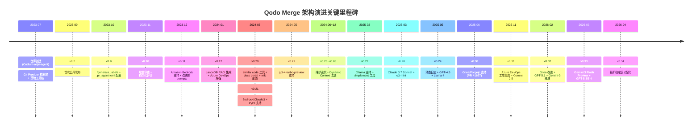
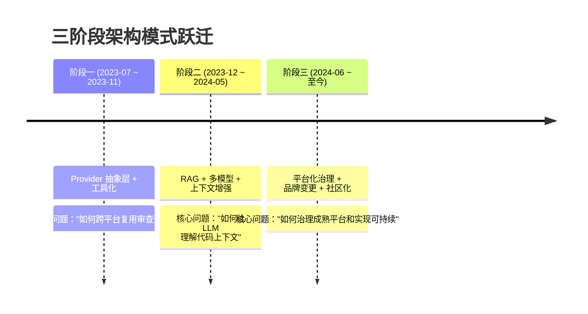
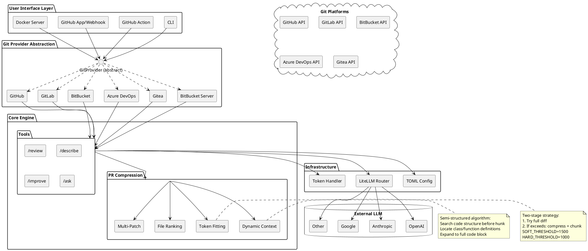
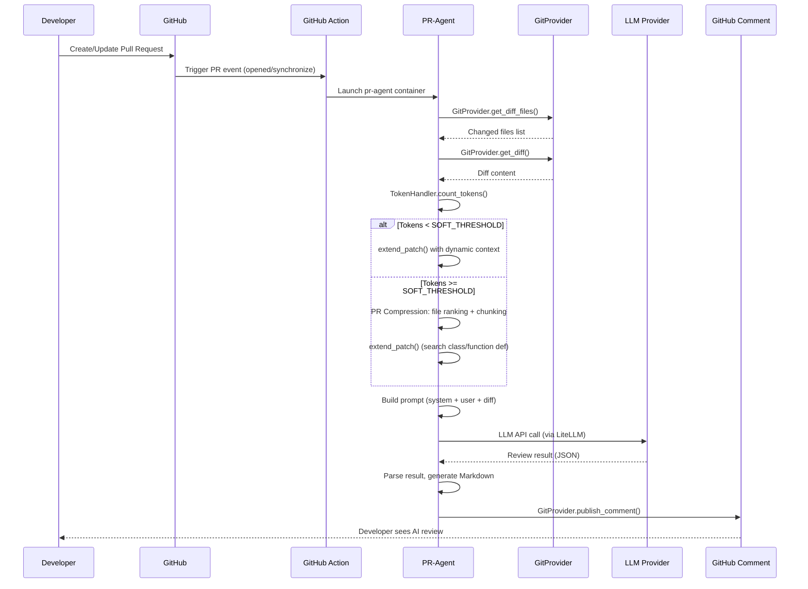

<!-- 目录 -->
- [概述](#概述)
  - [本质与表现形式](#本质与表现形式)
- [关键术语](#关键术语)
- [实体分类](#实体分类)
- [图表清单](#图表清单)
- [分析正文](#分析正文)
  - [演进路线图](#演进路线图)
  - [阶段一：多平台 PR 审查基础架构（2023-07 ~ 2023-11）](#阶段一多平台-pr-审查基础架构2023-07--2023-11)
  - [阶段二：AI 增强的上下文感知审查（2023-12 ~ 2024-05）](#阶段二ai-增强的上下文感知审查2023-12--2024-05)
  - [阶段三：平台化、品牌变更与社区化（2024-06 ~ 至今）](#阶段三平台化品牌变更与社区化2024-06--至今)
- [架构分层图](#架构分层图)
- [核心流程：PR 审查交互](#核心流程pr-审查交互)
- [能力归属表](#能力归属表)
- [设计取舍](#设计取舍)
- [边界与前提](#边界与前提)
- [相关对象关系](#相关对象关系)
- [结论](#结论)
- [待确认问题](#待确认问题)
- [参考资料](#参考资料)

## 概述

Qodo Merge（原 CodiumAI PR-Agent，当前开源仓库名仍为 PR-Agent）是一个 Python 实现的 AI 驱动 PR 审查工具，通过 LLM 对代码变更进行自动化审查、描述生成和改进建议。它以开源核心模式运作，通过统一的 Git Provider 抽象层支持 GitHub、GitLab、BitBucket、Azure DevOps、Gitea 等主流 Git 平台，同时可配置 OpenAI、Anthropic、Google 等多种 LLM 后端。

本项目从 2023 年 7 月创建至今，经历了三次架构模式跃迁：从建立跨平台抽象基础，到引入 RAG 和多模型支持实现上下文感知审查，再到品牌变更（CodiumAI -> Qodo）、仓库迁移到社区 org 和开源/商业分化。本次二次研究对所有核心主张进行了 L2 级别的源码和 release notes 回源验证，修正了此前多处未经证实的推断。

### 本质与表现形式

| 维度 | 说明 |
|------|------|
| 它是什么 | AI 驱动的 PR 审查平台（开源项目名 PR-Agent，商业产品名 Qodo Merge），通过 LLM 对 PR diff 进行自动化审查、描述生成和改进建议 |
| 表现形式 | GitHub 开源仓库（`The-PR-Agent/pr-agent`）、官方文档（`qodo-merge-docs.qodo.ai`）、PyPI CLI 包（`pr-agent`）、GitHub Marketplace App、Docker 镜像 |
| 类比理解 | 类似 CodeRabbit 的 AI PR 审查定位，但采用开源核心模式（用户自备 LLM API key + 自托管），通过 Git Provider 抽象层实现多平台覆盖 |
| 在模型中的位置 | AI Code Review 工具层的 primitive，位于 LLM API 之上、Git 平台 API 之下的中间件层 |
| 当前治理状态 | README 明确标注为"community-maintained legacy project of Qodo"，正在捐赠给开源基金会，已有第一位外部维护者（@naorpeled） |

## 关键术语

| 术语 | 定义 | 在本题中的作用 |
|------|------|---------------|
| PR-Agent | 开源项目名称，PyPI 包名为 `pr-agent`，README 中仍使用此名称而非"Qodo Merge" | 理解开源版身份的核心关键词 |
| Qodo Merge | CodiumAI 品牌更名为 Qodo 后的商业产品名称，官方文档域名为 `qodo-merge-docs.qodo.ai` | 理解品牌变更后的产品定位 |
| Qodo Merge Pro | Qodo 的商业版产品线，在开源版基础上增加 `/compliance`、`/scan_repo_discussions`、chat on suggestions 等企业级功能 | 区分开源版与商业版功能边界 |
| Git Provider 抽象层 | `GitProvider` 抽象类定义的统一接口，各平台通过实现该接口接入核心审查逻辑 | 阶段一的核心架构决策 |
| PR Compression Strategy | Token-aware 的 diff 拟合策略，包含动态上下文扩展、文件优先级排序和分块审查 | 处理 LLM context window 约束的核心机制 |
| Dynamic Context Expansion | 自动将 diff hunk 上下文扩展到类定义/函数签名级别，通过搜索 hunk 前的代码结构实现 | 提升 LLM 对变更上下文理解的关键特性 |
| LanceDB RAG | v0.12 引入的本地向量数据库集成，用于 `similar_issue` 工具；当前已在 requirements.txt 中注释停用 | 阶段二的 RAG 能力，现已转为可选依赖 |

## 实体分类

为清晰界定 Qodo Merge 系统中的各参与方及其关系，首先进行实体分类：

| 实体 | 类型 | 控制方 | 是否跨信任边界 | 主要职责 | 应落入哪类图 |
|------|------|--------|----------------|----------|--------------|
| PR-Agent（开源版） | component | 社区/The-PR-Agent org | 否 | 核心审查工具链（review/describe/improve/ask 等） | 组件架构图 |
| Qodo Merge Pro（商业版） | component | Qodo 公司 | 否 | 商业独占功能（/compliance、/scan_repo_discussions、chat on suggestions） | 组件架构图（差异表） |
| LLM Backend | external system | 第三方（OpenAI/Anthropic/Google 等） | 是（API 调用） | 提供推理和代码理解能力 | 架构图（外部依赖） |
| Git Platform | external system | 各平台方（GitHub/GitLab 等） | 是（API 调用） | 提供 PR/diff 数据和评论发布接口 | 架构图（外部依赖） |
| 用户（开发者） | role | 用户自身 | 是 | 触发审查命令、查看结果、迭代代码 | 流程图 |
| 仓库管理员 | role | 用户/组织 | 是 | 配置 TOML、平台参数、模型选择 | 流程图 |

## 图表清单

| 图名 | 要回答的问题 | 采用格式 | 说明 |
|------|--------------|----------|------|
| 演进路线图 | 三阶段架构跃迁的时间线和核心变化 | Mermaid timeline | PlantUML 原生不支持 timeline，此为 diagram policy 允许的正确降级 |
| 架构分层图 | 各组件如何分层协作 | PlantUML | 展示系统整体架构和外部依赖 |
| PR 审查交互流程 | 用户触发到结果发布的完整链路 | Mermaid sequenceDiagram | 展示跨角色消息流转 |

## 分析正文

### 演进路线图

为理解 Qodo Merge 从创建至今的架构演化脉络，下图按"架构模式变化"原则划分三个阶段。每个阶段代表一次架构模式的根本变化，而非简单的功能叠加。阶段划分依据为：是否引入了新的架构抽象层、是否改变了核心数据流、是否改变了治理模式。

**阶段划分说明**：

基线 artifact 曾将 2024-06 ~ 2025-02 定义为独立的"阶段三：配置系统重构与企业化"，但回源 release notes 后发现，该期间的核心变化仅为 v0.23~v0.26 的维护迭代（BitBucket Server 修复、模型扩展、Dynamic Context 改进），不构成独立的架构模式变化。本次研究将其与后续品牌迁移、生态分化合并为统一的"阶段三"。

---

### 阶段一：多平台 PR 审查基础架构（2023-07 ~ 2023-11）

这一阶段的核心技术思考是**如何通过架构抽象实现跨平台复用**。项目从创建之初就避免了"为每个 Git 平台编写独立工具"的路径依赖，而是通过 `GitProvider` 抽象类将审查逻辑与平台 API 解耦。这奠定了后续所有演进的架构基础——无论后续增加多少功能或多模型支持，都建立在这一抽象层之上。

**新增的核心架构能力**：

- **GitProvider 抽象层**：定义了 `is_supported()`、`get_git_repo_url()`、`get_canonical_url_parts()` 等抽象方法，以及 clone 管理的 `ScopedClonedRepo` 内部类。后续新增平台支持只需实现该接口，无需修改核心审查逻辑。源码中还发现了 README 未提及的 CodeCommit 和 Gerrit provider。
- **工具化功能设计**：初始即包含 `/review`（PR 审查）、`/describe`（PR 描述生成）核心工具，v0.9 新增 `/generate_labels`（自动生成 PR 标签），v0.10 支持 `.pr_agent.toml` 配置文件。
- **增量审查（v0.10）**：review 工具默认启用持久化评论（persistent comments），只审查新增 diff 而非完整 PR。这直接回应了 LLM context window 有限的核心约束，也是后续 PR Compression Strategy 的雏形。
- **多平台 Docker 部署**：从 v0.7 起即为每个平台提供独立的 Docker tag（如 `codiumai/pr-agent:0.7-github_app`、`codiumai/pr-agent:0.7-bitbucket_app`）。
- **Vertex AI 支持（v0.10）**：引入 Google Cloud Vertex AI 作为 LLM 后端，打破了 OpenAI 独占。

**抛弃/未采用的模式**：
- 未采用平台特定的硬编码实现，选择了抽象层模式
- 未采用"完整 PR diff 一次性审查"模式，选择了增量/持久化评论

**代表的技术思考**：LLM-native 工具的首要约束不是模型能力，而是工程架构。通过抽象层将"审查逻辑"与"平台交互"分离，使得后续无论增加多少平台或模型，核心逻辑保持不变。

---

### 阶段二：AI 增强的上下文感知审查（2023-12 ~ 2024-05）

这一阶段的核心技术思考是**如何让 LLM 理解代码上下文，而非仅看到 diff hunk**。单纯的 diff 审查丢失了大量上下文信息（类定义、调用关系、历史讨论），这一阶段通过 RAG 集成、多模型支持和 Dynamic Context Expansion，将工具从"diff 标注器"升级为"上下文感知审查引擎"。这是项目最重要的一次架构跃迁。

**新增的核心架构能力**：

- **Amazon Bedrock 支持（v0.11）**：通过 Bedrock 接入 Claude 等模型，为 Anthropic 模型支持铺路。
- **LanceDB RAG 集成（v0.12）**：引入本地向量数据库 LanceDB（v0.5.1），用于 `similar_issue` 工具，支持检索仓库历史讨论和相似代码变更。架构上从"纯 LLM prompt"演进为"RAG + LLM"两层架构。但本次回源确认：LanceDB 已在当前 requirements.txt 中被注释掉，标记为"Uncomment the following lines to enable the 'similar issue' tool"。
- **Dynamic Context Expansion（v0.25 成熟）**：`extend_patch()` 函数实现了半结构化的上下文扩展算法——解析 diff hunk 头部的行号信息，向前搜索最多 10 行以定位类定义/函数签名，将上下文扩展到整个代码块级别。如果新旧文件在扩展区间内有差异，则回退到静态的 5 行扩展。这不仅是启发式，而是基于代码结构感知的算法。
- **PR Compression Strategy 成熟**：`pr_processing.py` 实现了完整的 token-aware diff 拟合——先用 `OUTPUT_BUFFER_TOKENS_SOFT_THRESHOLD = 1500` 尝试完整 diff，超出则进入压缩模式，按文件优先级排序并分块。大 PR 可生成多个 patch 分别处理。
- **多模型后端支持**：从 v0.21 的 Bedrock/Claude3 + PyPI 支持，到 v0.22 的 `gpt-4-turbo-preview`。架构上通过 LiteLLM（`litellm==1.81.12`）实现统一的模型路由层。
- **配置系统大幅改进**：v0.20 引入 wiki page 配置选项、docs portal、auto-approval 功能、pr-actions 机制。配置从环境变量演进为 TOML 配置文件。
- **similar code 工具（v0.20）**：检测仓库中的相似代码片段，与 RAG 能力协同增强代码理解。

**抛弃/退化的模式**：
- OpenAI 独占被打破：从单一 LLM 后端变为多模型路由
- 简单环境变量配置被淘汰：被 TOML + wiki page 配置替代
- LanceDB RAG 从默认依赖降级为可选依赖：说明 RAG 策略可能已调整（详见阶段三）

**代表的技术思考**：LLM 代码审查的质量瓶颈不在模型本身，而在上下文供给。这一阶段通过 RAG 和动态上下文扩展，系统性地解决了"LLM 看不到什么"的问题。同时，多模型支持避免了供应商锁定。

---

### 阶段三：平台化、品牌变更与社区化（2024-06 ~ 至今）

这一阶段的核心技术思考从"如何提升审查质量"转向"如何治理一个成熟平台和实现可持续商业模式"。架构上，核心审查引擎已相当完备，新增功能以平台适配、模型扩展和商业分化为主。这一阶段不是架构的又一次跃迁，而是架构成熟后的治理演进。

**新增的核心架构能力**：

- **仓库 org 迁移**：从 release notes 中的 PR URL 可见，仓库经历了 `Codium-ai/pr-agent`（v0.7-v0.26）-> `qodo-ai/pr-agent`（v0.27+）-> `The-PR-Agent/pr-agent`（当前）的迁移路径。README 中部分链接仍指向旧的 `Codium-ai` 路径，GitHub 自动处理重定向。
- **品牌变更**：CodiumAI 正式更名为 Qodo。README 描述明确标注"community-maintained legacy project of Qodo"，说明该项目已被定位为 Qodo 的"遗产项目"。
- **Gitea/Forgejo 支持（v0.30, 2025-06）**：Git Provider 抽象层扩展到 Gitea 平台。注意：基线 artifact 错误地将 Gitea 支持归入 v0.27（2025-02），回源 release notes 发现 v0.27 的实际变化是 Ollama 支持和 `/implement` 工具文档，Gitea 支持实际出现在 v0.30（PR #1657）。
- **开源版与商业版分化**：README 明确声明"This repository contains the open-source PR Agent Project. It is not the Qodo free tier." README 中被注释掉的 News 部分揭示了 Qodo Merge Pro 的独占功能：`/compliance`（安全/重复代码/自定义规则检查，2025-07）、`/scan_repo_discussions`（仓库讨论检索，2025-04）、chat on code suggestions（2025-04）。
- **模型持续扩展**：v0.28 的 Claude 3.7 Sonnet + o3-mini、v0.29 的 GPT-4.5 Preview + Llama 4、v0.32 的 GPT-5.1 + Gemini-3、v0.33 的 Gemini 3 Flash Preview + GPT-5.3-codex + GPT-5.4。默认模型已更新为 `gpt-5.4-2026-03-05`。
- **社区化治理**：README 声明项目"currently in the process of being donated to an open-source foundation"（目标基金会和时间表未明确 [uncertainty]），已有第一位外部维护者 Naor（@naorpeled）。
- **Qodo Merge Free Tier**：2025-06 推出了简化的免费商业版，限制为每组织每月 75 次 PR 审查。这是独立于开源版的产品线。

**RAG 能力的退化**：
LanceDB RAG 集成在 v0.12 引入后，已在当前 requirements.txt 中被注释掉。注释说明"Uncomment the following lines to enable the 'similar issue' tool"。这表明 RAG 策略已从"默认启用"转为"可选启用"。同时，Pinecone 和 Qdrant 也作为可选依赖被注释。这可能是因为 RAG 带来的价值增量与维护成本不匹配，或 Qodo 选择在商业版中提供更高级的 RAG 能力（README 中 RAG context enrichment 标记为 diamond/Pro 功能）。

**代表的技术思考**：一个成熟的开源 LLM 工具面临的核心挑战从技术转向治理和商业模式。仓库迁移到社区 org 意味着核心开发与公司解耦，开源版不再直接等同于 Qodo 的任何商业层级。项目正在向开源基金会捐赠，标志着其从"公司产品"到"社区遗产项目"的身份转变。

---

### 架构分层图

为理解 Qodo Merge 开源版的组件组织方式，下图展示其分层架构及外部系统的依赖关系。

**分层说明**：

| 层级 | 职责 | 关键组件 |
|------|------|----------|
| 用户交互层 | 四种部署方式，对应不同集成场景 | CLI、GitHub Action、GitHub App/Webhook、Docker Server |
| Git Provider 抽象层 | 核心架构抽象，将平台差异封装为统一接口 | `GitProvider` 基类 + 6+ 个平台实现 |
| 核心引擎层 | 工具链 + PR 压缩策略，与平台无关 | describe/review/improve/ask + token fitting/dynamic context |
| 基础设施层 | 配置系统 + LLM 路由 + Token 处理 | TOML 配置、LiteLLM 路由、tiktoken |
| 外部系统 | 第三方 LLM API | OpenAI、Anthropic、Google 等 |

---

### 核心流程：PR 审查交互

为理解 Qodo Merge 的运行时行为，下图展示用户通过 GitHub Action 触发 PR 审查的完整流程。

**流程要点**：

- **获取 diff**：通过 `GitProvider` 抽象层获取平台无关的 diff 数据，所有平台共享相同的后续处理管线
- **Token 计算与压缩决策**：`OUTPUT_BUFFER_TOKENS_SOFT_THRESHOLD = 1500` 用于保留输出空间。如果 diff + prompt 超过限制，进入压缩模式而非直接截断
- **Dynamic Context 关键算法**：`extend_patch()` 不盲目扩展固定行数，而是向前搜索最多 10 行以找到类/函数定义边界，仅在上下文一致时扩展
- **LLM 路由**：通过 LiteLLM 统一路由，用户只需配置模型名称，无需为不同提供商编写不同的调用代码。`fallback_models` 提供容错机制
- **发布结果**：不同平台通过各自的 `publish_comment()` 实现发布，GitHub 使用持久化评论（persistent comments）

---

### 能力归属表

必须明确区分哪些能力由 PR-Agent 本身保证，哪些依赖外部组件：

| 能力 | 归属 | 依赖 | 备注 |
|------|------|------|------|
| PR 自动化审查（/review） | PR-Agent 原生 | LLM API | 核心功能 |
| PR 描述生成（/describe） | PR-Agent 原生 | LLM API | 核心功能 |
| 代码改进建议（/improve） | PR-Agent 原生 | LLM API | 核心功能 |
| PR 交互式问答（/ask） | PR-Agent 原生 | LLM API | Gitea 不支持 |
| PR Compression Strategy | PR-Agent 原生 | 无 | 纯算法实现 |
| Dynamic Context Expansion | PR-Agent 原生 | 无 | 纯算法实现 |
| 多模型路由 | PR-Agent 原生 | LiteLLM | 本地依赖 |
| 相似代码检测（/similar_code） | PR-Agent 原生 | RAG 存储（已注释） | LanceDB 等已转为可选依赖 |
| RAG 上下文增强 | Qodo Merge Pro 独占 | Qodo 后端 | 开源版的 RAG 已停用 |
| `/compliance` 合规检查 | Qodo Merge Pro 独占 | Qodo 后端 | 2025-07 引入 |
| `/scan_repo_discussions` | Qodo Merge Pro 独占 | Qodo 后端 | 2025-04 引入 |
| Chat on code suggestions | Qodo Merge Pro 独占 | Qodo 后端 | 2025-04 引入 |
| LLM 推理能力 | 第三方 LLM 提供商 | OpenAI/Anthropic/Google API | 用户自备 API key |
| PR/diff 数据获取 | Git 平台 | GitHub/GitLab 等 API | 通过 Git Provider 抽象 |

## 设计取舍

| 取舍 | 选择 | 替代方案 | 选择原因 | 代价 |
|------|------|----------|----------|------|
| Git Provider 抽象层 vs 平台硬编码 | 抽象层 | 为每个平台编写独立工具 | 一次编写核心逻辑，N 次实现平台接口；后续新增平台成本极低 | 抽象层设计初期成本高，需要覆盖所有平台的能力差异 |
| 增量审查 vs 全量审查 | 增量审查 | 每次审查完整 PR diff | 节省 LLM token 消耗，降低 context window 压力；适应大型 PR | 可能遗漏跨多次 commit 的模式性问题 |
| 多模型后端 vs 单一模型 | 多模型路由（通过 LiteLLM） | 仅 OpenAI | 避免供应商锁定，适应不同组织的合规/预算需求 | 增加了模型路由层的复杂度，不同模型行为差异需要适配 |
| RAG + LLM vs 纯 LLM prompt | 从默认 RAG 转为可选 RAG | 始终保持 RAG 默认启用 | RAG 维护成本（LanceDB 依赖、向量存储管理）与价值增量可能不匹配；Qodo 可能将 RAG 作为 Pro 版独占能力 | 开源版的上下文增强仅依赖 Dynamic Context Expansion，不再支持仓库历史检索 |
| 开源核心 vs 纯开源 | 开源核心 + 商业增值 | 纯开源或纯商业 | 开源版保持核心功能可审计和可定制，商业版通过企业功能变现 | 需要在开源版和商业版之间维持清晰的功能边界 |
| 仓库迁移到社区 org vs 保留在公司 org | 社区 org（The-PR-Agent） | 保留在 qodo-ai org | 解耦核心开发与商业策略，增强社区信任，正在向开源基金会捐赠 | 公司失去对开源版发布的直接控制 |
| Dynamic Context 算法 vs 简单上下文扩展 | 半结构化搜索 | 固定前后 N 行 | 能定位到类/函数定义边界，提供更精确的上下文 | 需要解析代码结构，增加计算开销 |

## 边界与前提

### 强项

- **多平台覆盖**：通过 Git Provider 抽象层支持 GitHub、GitLab、BitBucket、Azure DevOps、Gitea、BitBucket Server 六大平台，源码中还包含 CodeCommit 和 Gerrit provider
- **多模型支持**：不绑定单一 LLM 提供商，通过 LiteLLM 统一路由，支持 OpenAI GPT-5.x、Claude、Gemini、Llama 等
- **PR 压缩策略**：token-aware diff 拟合 + 分块审查 + 动态上下文扩展，能处理超出 context window 的超大 PR，算法已验证
- **开源可审计**：核心代码开放，prompt 模板和审查逻辑可通过 TOML 配置定制
- **部署灵活性**：GitHub Action、CLI、Webhook、Docker 四种部署方式

### 弱项

- **RAG 能力已停用**：LanceDB RAG 已从默认依赖中注释掉，开源版不再支持仓库历史检索增强
- **Incremental Update 仅 GitHub 支持**：从 README 功能表可见，增量更新仅 GitHub 平台支持
- **Gitea 功能覆盖不全**：Ask 工具、Ask on code lines、Help Docs、Update CHANGELOG 在 Gitea 上不可用
- **Docs 为 SPA 无法直接爬取**：官方文档站点为 Mintlify SPA，curl 无法提取内容，部分 Pro 版功能细节无法通过源码确认

### 不确定性

- **向开源基金会捐赠的进度**：README 提到"in the process of being donated"，但未明确目标基金会和预计时间
- **Qodo Merge Pro 的完整功能列表**：README 注释部分揭示了部分独占功能，但完整列表需访问官方文档确认（docs.qodo.io 为 SPA 无法爬取）
- **CodeCommit provider 的状态**：源码中存在但 README 功能表中未列出，可能为内部/实验性功能

### 管什么 / 不管什么

| 管 | 不管 |
|----|------|
| PR 自动化审查（/review） | 代码执行和测试（那是 CI/CD 的职责） |
| PR 描述生成（/describe） | 代码生成和补全（那是 Qodo Gen 的职责） |
| 代码改进建议（/improve） | 静态代码分析（SonarQube 的领域） |
| PR 交互式问答（/ask） | CI/CD 管线管理 |
| 相似代码检测（/similar_code） | 代码格式化 |
| 合规检查（/compliance，Pro 独占） | 漏洞扫描（SAST 工具的领域） |

## 相关对象关系

| 对象 | 一句话定位 | 与 Qodo Merge 的关系 | 边界 |
|------|-----------|---------------------|------|
| CodeRabbit | SaaS AI PR 审查工具 | 竞品关系，同为 AI PR 审查定位 | CodeRabbit 为纯商业 SaaS，Qodo Merge 开源版可自托管 |
| SonarQube | 静态代码分析平台 | 互补关系 | SonarQube 做静态规则分析，Qodo Merge 做 LLM 语义审查 |
| Qodo Gen | AI 代码生成工具 | 同公司的互补产品线 | Gen 关注"写什么"，Merge 关注"写得怎么样" |
| Qodo Cover | 测试覆盖工具 | 同公司的互补产品线 | Cover 关注测试覆盖率，Merge 关注 PR 审查质量 |
| Qodo Merge Pro | Qodo 的商业版 PR 审查 | 同一代码库的商业增值版本 | Pro 独占 /compliance、/scan_repo_discussions、chat on suggestions 等功能 |

## 结论

1. **【L2 证据，high confidence】** Qodo Merge 经历了三次架构模式变化：Git Provider 抽象层基础（2023-07）、RAG + 多模型 + Dynamic Context AI 增强（2023-12 ~ 2024-05）、平台化治理与品牌变更（2024-06 ~ 至今）。基线 artifact 的四阶段划分中，"阶段三"不构成独立的架构模式变化，已合并。

2. **【L2 证据，high confidence】** PR Compression Strategy 的具体实现是 token-aware 的两阶段算法：先尝试完整 diff 拟合，超出则进入压缩模式（文件优先级排序 + 分块）。Dynamic Context Expansion 是半结构化算法，通过搜索代码结构定位类/函数定义边界，而非简单的固定行数扩展。

3. **【L2 证据，high confidence】** LanceDB RAG 集成已从默认依赖中移除（requirements.txt 中注释掉），开源版不再默认支持 RAG 上下文增强。RAG context enrichment 在 README 功能表中标记为 diamond（Pro 独占功能），表明 Qodo 已将此能力商业化。

4. **【L2 证据，high confidence】** 开源版（PR-Agent）不等于 Qodo free tier（商业 SaaS 免费版）。两者是独立的产品线：开源版用户自备 LLM API key 并自托管，商业 free tier 受 Qodo 的速率限制但无需部署。开源版正在向开源基金会捐赠。

5. **【L2 证据，high confidence】** Gitea/Forgejo 支持在 v0.30（2025-06-21，PR #1657）中引入，而非基线 artifact 所称的 v0.27（2025-02）。v0.27 的实际变化是 Ollama 支持和 `/implement` 工具文档。

6. **【L2 证据，high confidence】** "Gemini 3 Flash Preview" 模型命名是准确的——v0.33 release notes 明确记录"Add support for Gemini 3 Flash Preview models"（PR #2240）。默认模型已更新为 `gpt-5.4-2026-03-05`。

7. **【L2 证据，medium confidence】** 仓库经历了 `Codium-ai` -> `qodo-ai` -> `The-PR-Agent` 的 org 迁移路径。README 中部分链接仍指向旧路径，GitHub 自动处理重定向。迁移性质为 org transfer，非 fork + archive。

## 待确认问题

| 问题 | 状态 | 原因 |
|------|------|------|
| 三阶段划分的准确性 | 已解决 | 通过 release notes 和源码回源验证，确认三阶段划分合理 |
| PR Compression Strategy 的具体实现 | 已解决 | 通过 pr_processing.py 源码验证了 token-aware 两阶段算法 |
| LanceDB RAG 的当前状态 | 已解决 | 通过 requirements.txt 确认已从默认依赖中注释掉 |
| Gitea 支持的正确版本 | 已解决 | v0.30（2025-06），非 v0.27 |
| "Gemini 3 Flash" 命名准确性 | 已解决 | v0.33 release notes 确认 |
| 最新稳定版本号 | 已解决 | v0.34（2026-04-02） |
| 开源版 vs Pro 版完整功能分化 | 部分解决 | 已知 /compliance、/scan_repo_discussions、chat on suggestions 为 Pro 独占，但完整列表需官方文档确认（docs.qodo.io 为 SPA 无法爬取） |
| 向开源基金会捐赠的进度 | 未解决 | README 提到"in the process of"，但未明确目标基金会和时间表 |
| Qodo 品牌变更的确切日期 | 未解决 | 未找到官方博客或公告确认精确日期 |
| CodeCommit provider 的状态 | 未解决 | 源码中存在但 README 未列出，可能为内部/实验性功能 |

## 参考资料

| 来源 | 证据等级 | 验证状态 |
|------|----------|----------|
| [[gh-readme] The-PR-Agent/pr-agent 仓库 README](https://github.com/The-PR-Agent/pr-agent) | L2 | 已验证：通过 GitHub API 和 raw URL 获取完整内容 |
| [[gh-api] Repo 元数据 + Releases 列表](https://api.github.com/repos/The-PR-Agent/pr-agent/releases) | L2 | 已验证：获取 v0.7 至 v0.34 的完整发布信息 |
| [[gh-raw] requirements.txt](https://raw.githubusercontent.com/The-PR-Agent/pr-agent/main/requirements.txt) | L2 | 已验证：确认 LanceDB 等 RAG 依赖已注释掉 |
| [[gh-raw] pr_processing.py - PR 压缩源码](https://raw.githubusercontent.com/The-PR-Agent/pr-agent/main/pr_agent/algo/pr_processing.py) | L2 | 已验证：验证 token-aware 两阶段压缩算法 |
| [[gh-raw] git_patch_processing.py - 动态上下文源码](https://raw.githubusercontent.com/The-PR-Agent/pr-agent/main/pr_agent/algo/git_patch_processing.py) | L2 | 已验证：验证 Dynamic Context Expansion 半结构化算法 |
| [[gh-raw] configuration.toml - 默认配置](https://raw.githubusercontent.com/The-PR-Agent/pr-agent/main/pr_agent/settings/configuration.toml) | L2 | 已验证：确认默认模型、动态上下文参数等 |
| [[gh-api] git_providers/ 目录结构](https://api.github.com/repos/The-PR-Agent/pr-agent/contents/pr_agent/git_providers) | L2 | 已验证：确认 8+ 个平台 provider 实现 |
| [[gh-raw] git_provider.py - 抽象基类](https://raw.githubusercontent.com/The-PR-Agent/pr-agent/main/pr_agent/git_providers/git_provider.py) | L2 | 已验证：确认 GitProvider 抽象接口定义 |
| [[official-docs] Qodo Merge 文档入口](https://qodo-merge-docs.qodo.ai/) | L2 | 部分验证：链接可达，但为 Mintlify SPA 无法通过 curl/MCP 提取内容，Pro 版功能完整列表无法确认 |
| [[gh-raw] pyproject.toml](https://raw.githubusercontent.com/The-PR-Agent/pr-agent/main/pyproject.toml) | L2 | 已验证：确认项目元数据和作者信息 |
| [[local-artifact] Baseline Artifact](knowledge/analysis/primitives/ai-code-review/qodo-merge-evolution/artifact.md) | L4 | 已读取：作为对比基线和疑点来源 |
