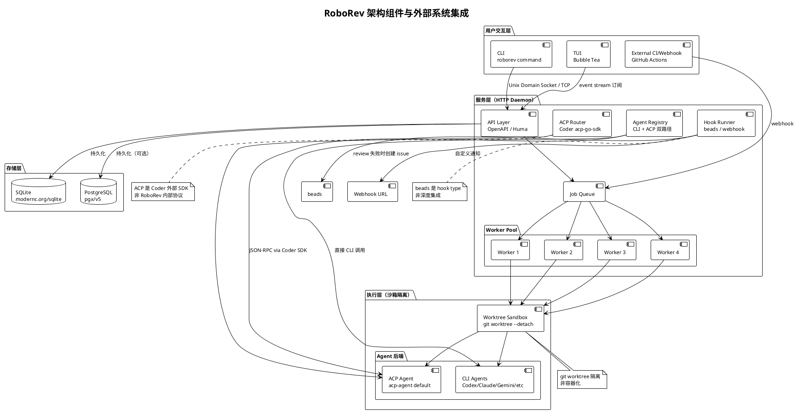

<!-- 目录 -->
- [概述](#概述)
- [关键术语](#关键术语)
- [实体分类](#实体分类)
- [图表决策与清单](#图表决策与清单)
- [角色与组件架构图](#角色与组件架构图)
- [核心流程时序图](#核心流程时序图)
- [演进路线图](#演进路线图)
- [阶段一：完整初始架构 + 功能完善](#阶段一完整初始架构--功能完善2026-01-05--02-23--单体-cli--直接调用-agent-模式)
- [阶段二：协议标准化 + 闭环构建](#阶段二协议标准化--闭环构建2026-02-24--03-17--acp-协议统一-agent-接入)
- [阶段三：基础设施安全 + 生产就绪](#阶段三基础设施安全--生产就绪2026-03-18--至今--沙箱--systemd--openapi)
- [状态转换](#状态转换)
- [设计取舍](#设计取舍)
- [能力边界](#能力边界)
- [与 PR 级 review 工具的边界](#与-pr-级-review-工具的边界)
- [结论](#结论)
- [待确认问题](#待确认问题)
- [参考资料](#参考资料)

## 概述

RoboRev（`roborev-dev/roborev`）是 AI agent 时代的 **commit 级持续代码审查工具**，以 Go 语言实现。其核心定位不是辅助人类进行 code review，而是对 AI coding agent 产出的 commit 进行自动化质量监控与审查，并在发现问题后驱动修复闭环。

| 维度 | 说明 |
|------|------|
| 它是什么 | commit 级持续代码审查工具，通过 post-commit hook、CI pipeline 或 webhook 自动触发 LLM 驱动的代码审查，并提供 fix/refine 修复闭环 |
| 表现形式 | Go 参考实现 + CLI 工具 + HTTP daemon + Bubble Tea TUI，通过 Coder ACP SDK 接入多 agent 后端 |
| 类比理解 | 类似 GitHub PR review 的自动化版本，但专注于 commit 级别、面向 AI agent 产出、且内置修复闭环 |
| 在模型中的位置 | AI code review 工具链中的"执行层"——位于 git hook/CI 触发层与 LLM agent 执行层之间 |

### 本质与关键特征

RoboRev 的本质是 **"AI 生成代码的质量守门人"**。它通过三个核心机制实现这一定位：

1. **commit 级持续审查**：post-commit hook、CI pipeline、webhook 三种触发方式，不需要人类发起 PR
2. **双路径 agent 后端**：CLI 直接调用（Codex、Claude Code、Gemini 等）与 ACP 协议接入（任意实现 ACP 协议的 agent）并存
3. **fix/refine 闭环**：发现问题后自动调用 fix agent 生成补丁，并可循环重审直到通过（默认最多 10 次迭代）

## 关键术语

| 术语 | 定义 | 在本题中的作用 |
|------|------|---------------|
| RoboRev | `roborev-dev/roborev` 项目，Go 实现的 commit 级 AI code review 工具 | 本文研究对象 |
| ACP (Agent Client Protocol) | Coder 公司（code-server 开发者）提供的 agent 接入协议，通过 `github.com/coder/acp-go-sdk v0.6.3` 集成 | 阶段二核心架构变化，是外部标准而非 RoboRev 内部发明 |
| Daemon | RoboRev 的 HTTP 守护进程，负责 job 调度、worker pool 管理、存储持久化 | 架构核心组件 |
| TUI (Terminal User Interface) | 基于 Bubble Tea（`github.com/charmbracelet/bubbletea`）的终端交互界面 | 用户交互层 |
| Worktree Sandbox | 通过 `git worktree add --detach` 创建的临时隔离环境，v0.48.0 引入 | 阶段三安全强化，非容器化 |
| Fix/Refine Loop | `roborev fix`（单次修复）+ `roborev refine`（自动循环修复→重审，默认 `--max-iterations` 10 次）形成的闭环 | 阶段二核心机制 |
| Post-commit Hook | Git hook 集成，commit 后自动触发审查的核心触发机制之一 | 阶段一核心触发方式 |
| systemd Socket Activation | systemd 原生机制，按需启动 daemon，v0.50.0 引入 | 阶段三运维标准化 |
| OpenAPI / Huma | 通过 `github.com/danielgtaylor/huma/v2` 实现的 schema-driven REST API，v0.51.0 引入 | 阶段三 API 标准化 |
| beads | Steve Yegge 的 issue 追踪工具（`steveyegge/beads`），作为 hook type 集成，review 失败时自动创建可追踪 issue | 阶段一已存在的集成，非深度架构组件 |
| PostgreSQL | 除 SQLite 外的第二存储后端，通过 `github.com/jackc/pgx/v5` 实现 | 存储扩展，非初始设计 |

## 实体分类

为理解 RoboRev 的架构演进，首先将关键实体归类：

| 实体 | 类型 | 控制方 | 是否跨信任边界 | 主要职责 | 应落入哪类图 |
|------|------|--------|----------------|----------|--------------|
| CLI（roborev 命令） | Component | RoboRev | 否 | 用户交互入口，命令分发 | 架构图 |
| HTTP Daemon | Component | RoboRev | 否 | Job 调度、worker pool、API 服务 | 架构图 |
| TUI | Component | RoboRev | 否 | Review 队列可视化交互 | 架构图 |
| SQLite / PostgreSQL | Component | RoboRev | 否 | 持久化 repos/commits/jobs/reviews | 架构图 |
| Worker Pool | Component | RoboRev | 否 | 并行执行 review job（默认 4 worker） | 架构图 |
| Worktree Sandbox | Component | RoboRev | 否 | 通过 `git worktree add --detach` 隔离 agent 执行 | 架构图 |
| ACP Router | Component | RoboRev | 否 | 通过 Coder SDK 路由 JSON-RPC 请求到 ACP agent | 架构图 |
| Agent Registry | Component | RoboRev | 否 | CLI agent 与 ACP agent 的统一注册与 fallback 链 | 架构图 |
| Git Hook（post-commit） | External System | Git | 是（Git → RoboRev） | 触发审查事件 | 流程图 |
| CI Pipeline（GitHub Actions） | External System | CI Provider | 是（CI → RoboRev） | CI 环境触发审查 | 流程图 |
| Agent Backend（Codex/Claude/Gemini/ACP） | External System | 各 Agent 提供方 | 是（RoboRev → Agent） | 执行实际代码审查/修复 | 流程图 |
| systemd | External System | OS | 是（OS → RoboRev） | Daemon 生命周期管理、socket activation | 架构图 |
| beads | External System | 外部工具 | 是（RoboRev → beads） | review 失败时创建可追踪 issue | 流程图 |
| Review Job | Data Object | RoboRev | 否 | 单次审查任务载荷 | 状态转换 |
| Review Result | Data Object | RoboRev | 否 | 审查结果（Pass/Fail + comments） | 状态转换 |
| Job State | State | RoboRev | 否 | pending → running → completed/failed/cancelled | 状态转换 |

## 图表决策与清单

### 图表决策树

基于实体分类表，依次回答四个判定问题：

| 判定问题 | 判定依据 | 是 → 必须产出 | 否 → 可省略 |
|----------|----------|---------------|-------------|
| Q1：是否存在两个及以上独立控制方？ | 实体分类表中存在 Git、CI Provider、各 Agent 提供方、OS、beads 等外部系统 | 角色与组件架构图 | — |
| Q2：是否有核心角色内部结构 materially 不同？ | RoboRev 内部包含多层组件（交互层、服务层、执行层、存储层） | 组件分层架构图 | — |
| Q3：是否依赖跨角色消息/调用/证明流转？ | 触发 → Daemon → Worker → Agent → 结果存储 → TUI/PR 通知 | 跨角色核心流程时序图 | — |
| Q4：是否依赖命名状态/轮次/epoch/timeout 转换？ | Job 有明确的 pending/running/completed/failed/cancelled 状态机 | 状态转换表 | — |

### 图表清单

| 图名 | 要回答的问题 | 是否必须 | 采用格式 | 为什么需要/可省略 |
|------|--------------|----------|----------|------------------|
| 角色与组件架构图 | RoboRev 内部组件分层 + 外部系统集成关系 | 必须 | PlantUML Architecture | 展示 4 层架构与跨信任边界的 5 个外部系统 |
| 核心流程时序图 | post-commit 触发 → 审查 → 修复闭环的完整流程 | 必须 | PlantUML Sequence | 展示 happy path（审查通过）和异常路径（修复循环） |
| 演进路线图 | 三阶段架构模式变化与关键里程碑 | 必须 | ASCII Timeline | 按架构模式变化划分，非按版本号 |

## 角色与组件架构图

为了理解 RoboRev 的整体架构，首先需要明确系统中有哪些内部组件层以及它们与外部系统的集成关系。下图展示了 RoboRev 的四层架构与跨信任边界的通信路径。

<!-- diagram: architecture - RoboRev 架构组件与外部系统集成, source: GH-README+GH-INTERNAL -->


## 核心流程时序图

下图展示 post-commit 触发的审查流程，包含 happy path（一次通过）和 fix/refine 异常路径。

<!-- diagram: sequence - RoboRev post-commit 审查 + fix/refine 闭环, source: GH-README+GH-CMD-REFINE -->
```plantuml
@startuml
!theme plain
skinparam defaultFontSize 12
skinparam defaultFontName "sans-serif"

title RoboRev 核心流程：post-commit 审查 + fix/refine 闭环

actor User
participant "Git" as git
participant "roborev CLI" as cli
participant "HTTP Daemon" as daemon
participant "Job Queue" as queue
participant "Worker" as worker
participant "Worktree Sandbox" as sandbox
participant "Agent Backend" as agent
participant "Storage" as db
participant "TUI" as tui

== Happy Path（审查一次通过）==

User -> git : git commit
git -> cli : post-commit hook 触发
cli -> daemon : POST /jobs (入队)
daemon -> queue : 入队
daemon -> db : 持久化 job (pending)
queue -> worker : worker 拾取 job
worker -> sandbox : 创建 worktree (--detach)
sandbox -> agent : 调用 Review(ctx, worktree, commitSHA, prompt)
agent --> worker : 返回审查结果 (Pass)
worker -> db : 更新 job (completed, Pass)
worker -> sandbox : 清理 worktree
daemon -> tui : 事件流推送
tui --> User : TUI 更新

== 异常 Path（审查不通过 → fix → refine 循环）==

group 审查不通过
  agent --> worker : 返回审查结果 (Fail + comments)
  worker -> db : 更新 job (completed, Fail)
  worker -> sandbox : 清理 worktree
  daemon -> tui : 事件流推送
  tui --> User : 显示审查失败
end

group fix（单次修复）
  User -> cli : roborev fix
  cli -> daemon : POST /jobs (fix type)
  daemon -> queue : 入队
  queue -> worker : worker 拾取
  worker -> sandbox : 创建 worktree
  sandbox -> agent : 调用 Fix(ctx, worktree, comments)
  agent --> worker : 返回修复补丁
  worker -> db : 更新 job (completed)
  worker -> sandbox : 清理 worktree
end

group refine（自动循环，--max-iterations 默认 10）
  User -> cli : roborev refine
  loop 最多 max_iterations 次
    cli -> daemon : POST /jobs (fix type)
    daemon -> queue -> worker -> sandbox -> agent : fix
    agent --> worker : 返回修复补丁
    worker -> db : 存储修复结果
    cli -> daemon : POST /jobs (review type)
    daemon -> queue -> worker -> sandbox -> agent : 重审
    agent --> worker : 返回审查结果
    alt 审查通过
      worker -> db : 更新 job (completed, Pass)
      note right: 循环终止
    else 仍不通过
      worker -> db : 更新 job (completed, Fail)
      note right: 继续下一轮
    end
  end
  note right: 达到 max_iterations 后强制终止
end

@enduml
```

## 演进路线图

> 以下演进路线图按"架构模式变化"原则划分，将基线 artifact 的 4 阶段修正为 3 阶段。阶段一的 TUI 打磨与 agent 扩展属于同一架构模式内的增量改进，不构成独立的架构模式变化。

```
阶段一                              阶段二                                  阶段三
完整初始架构 + 功能完善              协议标准化 + 闭环构建                   基础设施安全 + 生产就绪
单体 CLI + 直接调用 Agent 模式        ACP 协议统一 Agent 接入                沙箱 + systemd + OpenAPI
2026-01-05 ─────────── 02-23 ──────── 02-24 ────────── 03-17 ─────────────── 03-18 ───── 至今
  │                                    │                                       │
  ├─ 初始架构搭建（01-05 ~ 01-09）      ├─ ACP 协议引入 (v0.40.0)               ├─ Worktree 沙箱 (v0.48.0)
  │  CLI + daemon + TUI                │  Coder acp-go-sdk 集成                 │  git worktree --detach
  │  + SQLite + 双 agent               │  新 agent 接入速度加快                 │  解决 .git/index.lock 竞争
  │                                    │                                        │
  ├─ v0.5.0 首个 release               ├─ CI review 扩展                        ├─ Unix domain socket (v0.49.0)
  │  (2026-01-09)                      │  PR comment upsert                     │  CLI-to-daemon 高效通信
  │                                    │  review matrix 支持                    │
  ├─ TUI 持续打磨                      │                                        ├─ systemd 集成 (v0.50.0)
  │  分页/过滤/导航/鼠标/事件流          ├─ fix/refine 闭环 (v0.45.0)             │  service/socket units
  │                                    │  fix: 单次修复                          │  socket activation
  ├─ Agent 生态扩展                    │  refine: 自动循环(默认10次)            │  TUI 事件流订阅
  │  Gemini/Copilot/OpenCode/Kiro      │                                        │  auto_close_passing_reviews
  │  beads hook 集成                   ├─ webhook hooks (v0.44.0)               │
  │                                    │  postcommit 命令                        ├─ OpenAPI (v0.51.0)
  │                                    │                                        │  Huma schema-driven
  │                                    ├─ token 追踪 (v0.47.0)                  │  cascading min_severity
  │                                    │  summary 命令                           │
  │                                    ├─ PostgreSQL 支持                       ├─ PostgreSQL 迁移 schema
  │                                    │  pgx/v5 集成                            │  双存储后端
  │                                    │                                        │
  ▼                                    ▼                                        ▼
架构模式:                             架构模式:                               架构模式:
单体 CLI 直接调用                      协议化集成 + 自动化闭环                  生产可靠化 + 标准化集成
每 agent 独立适配文件                  CLI + ACP 双路径并存                     沙箱 + systemd + OpenAPI
```

## 阶段一：完整初始架构 + 功能完善（2026-01-05 ~ 02-23）—— 单体 CLI + 直接调用 Agent 模式

**核心技术思考**："完整架构先行"。RoboRev 在 repo 创建后数天内就搭建了 CLI + daemon + TUI + SQLite + 双 agent 的完整框架，后续所有功能都在此框架上增量填充，而非从零渐进构建。这反映了项目定位明确、设计者对整体架构有清晰蓝图的特征。

### 初始架构搭建（2026-01-05 ~ 01-09）

- **repo 创建**：2026-01-05，首次公开 commits 集中在 2026-01-09，初始架构可能在 repo 创建后的私有开发中完成，随后集中发布 [[github]RoboRev 仓库](https://github.com/roborev-dev/roborev) [[github]早期 commit 历史](https://github.com/roborev-dev/roborev/commits/main)
- **初始组件**：CLI 命令（init、status、show、respond、daemon）、HTTP daemon + worker pool（4 并行）、SQLite 存储（repos/commits/jobs/reviews/responses 表）、Codex 和 Claude Code 两个 agent、TOML 配置、post-commit hook 自动安装、Bubble Tea TUI
- **直接 CLI 调用 agent**：每个 agent 是一个独立的 `*_agent.go` 文件，通过调用对应 CLI 工具（如 `codex-cli`、`claude`）实现集成
- **post-commit hook 为核心触发机制**：commit 后自动触发审查，不需要人工介入
- **技术栈确认**：Go + `modernc.org/sqlite`（纯 Go SQLite，无 CGO 依赖）+ Bubble Tea [[github-raw]go.mod 依赖清单](https://raw.githubusercontent.com/roborev-dev/roborev/main/go.mod)

### 功能完善期（2026-01-06 ~ 02-23）

初始架构搭建后，约 7 周内完成了以下增量改进：

- **Agent 生态扩展**：Gemini CLI、Copilot CLI（PR #3）、OpenCode（PR #5），以及后续的 Kiro（v0.38.0），每个 agent 都需要独立的 `*_agent.go` 文件 + CLI 调用适配
- **beads 集成**：作为 hook type 集成，在 review 失败时通过 `HookConfig{Type: "beads"}` 自动创建可追踪 issue [[github-raw]internal/config/config.go](https://raw.githubusercontent.com/roborev-dev/roborev/main/internal/config/config.go) [[github]RoboRev README](https://github.com/roborev-dev/roborev)
- **TUI 持续打磨**：分页、过滤、导航、鼠标交互、JSONL 事件流（PR #33）、P/F 判定列、版本更新通知
- **Daemon 管理增强**：`roborev update` 命令、Husky git hook manager 支持、可配置 job timeout

### 本阶段的架构约束

| 约束 | 说明 | 后续影响 |
|------|------|----------|
| 每个 agent 需要独立适配 | 新增 agent = 新增 `*_agent.go` + CLI 调用逻辑 | 接入成本高，为 ACP 引入埋下伏笔 |
| 无沙箱隔离 | Agent 直接在 worktree 上执行 | `.git/index.lock` 竞争风险，为 v0.48.0 沙箱引入埋下伏笔 |
| 无 CI 集成 | 仅本地 post-commit 触发 | 无法覆盖 CI/CD pipeline 场景 |

## 阶段二：协议标准化 + 闭环构建（2026-02-24 ~ 03-17）—— ACP 协议统一 Agent 接入

**核心技术思考**："协议化集成"。在支持了 6+ 种 CLI agent 后，每个新 agent 都需要单独编写适配代码的代价变得不可持续。ACP（Agent Client Protocol）通过 Coder 提供的 `acp-go-sdk`，将 agent 接入从"写适配层"变为"实现协议"，显著降低了集成成本。同时，fix/refine 闭环将 RoboRev 从"发现问题的工具"升级为"解决问题的工具"。

### ACP 协议引入（v0.40.0, 2026-03-03）

- **协议来源**：ACP 是 **Coder 公司**（code-server 的开发者）提供的外部 SDK/协议，通过 `github.com/coder/acp-go-sdk v0.6.3` 集成到 RoboRev。这不是 RoboRev 的内部发明 [[github-raw]go.mod 依赖清单](https://raw.githubusercontent.com/roborev-dev/roborev/main/go.mod) [[github]Coder acp-go-sdk](https://github.com/coder/acp-go-sdk)
- **协议效果**：ACP 引入后 3 天内（v0.40.0 ~ v0.42.0）即接入了 Kiro、Cursor、Pi 三种 agent，相比此前每个 agent 需数天的适配周期，接入速度显著提升 [[github]RoboRev Releases](https://github.com/roborev-dev/roborev/releases)
- **双路径并存**：`internal/agent/` 目录中，CLI agent 文件（`codex.go`, `claude.go`, `copilot.go`, `gemini.go`, `opencode.go`, `kiro.go`, `cursor.go`, `pi.go`, `droid.go`）与 ACP agent 文件（`acp_agent.go`）**同时存在**。CLI agent 未被迁移到 ACP，两条路径并行运行 [[github]internal/agent/ 目录结构](https://github.com/roborev-dev/roborev/tree/main/internal/agent)
- **ACP Agent 配置**：通过 `ACPAgentConfig` 配置（command、args、model、read_only_mode、auto_approve_mode），默认命令为 `acp-agent` [[github]internal/agent/ 目录结构](https://github.com/roborev-dev/roborev/tree/main/internal/agent)
- **Agent 注册与 Fallback**：`Register(a Agent)` 注册，`Get(name string)` 获取，`GetAvailable(preferred, backups...)` 实现 fallback 链 [[github]internal/agent/ 目录结构](https://github.com/roborev-dev/roborev/tree/main/internal/agent)

### Fix/Refine 闭环

- **`roborev fix`**：针对单个未通过的 review，调用配置的 fix agent 生成修复补丁
- **`roborev refine`**：自动循环 — fix → 重审 → 如果仍不通过则继续 fix，直到通过或达到上限
- **终止条件**：`refine.go` 源码确认 `--max-iterations` 标志，默认值为 **10** 次 [[github]RoboRev Releases](https://github.com/roborev-dev/roborev/releases)
- **`roborev compact`**：验证并合并重复问题，过滤误报

### CI Review 扩展

- **PR comment upsert**：审查结果可自动发布为 GitHub PR 评论，支持可配置的更新行为
- **Review matrix**：一个 workflow 运行多种审查配置，适配不同场景
- **PR close 取消**：PR 关闭时自动取消进行中的审查，避免资源浪费
- **Webhook hooks（v0.44.0）**：外部系统可通过 webhook 触发审查，`HookConfig{Type: "webhook", URL: "..."}` [[github-raw]internal/config/config.go](https://raw.githubusercontent.com/roborev-dev/roborev/main/internal/config/config.go)

### Token 追踪（v0.47.0）

- **agentsview 集成**：每 session token 消耗记录
- **`roborev summary`**：聚合审查统计信息

### 存储扩展：PostgreSQL 支持

- **双存储后端**：`internal/storage/` 目录中同时存在 `db.go`（SQLite）和 `postgres.go`（PostgreSQL），通过 `github.com/jackc/pgx/v5` 实现 [[github-raw]go.mod 依赖清单](https://raw.githubusercontent.com/roborev-dev/roborev/main/go.mod) [[github]internal/storage/ 目录结构](https://github.com/roborev-dev/roborev/tree/main/internal/storage)
- **PostgreSQL 迁移**：`schemas/postgres_v*.sql` 迁移历史文件，表明 PostgreSQL 是正式的存储后端，而非实验性支持
- **引入时间不确定**：release notes 中未明确提及 PostgreSQL 支持的引入版本

### 本阶段的架构变化

| 变化 | 之前 | 之后 | 架构意义 |
|------|------|------|----------|
| Agent 接入方式 | 各自 CLI 调用适配 | ACP 协议 + CLI 双路径 | 从 ad-hoc 到标准化，但 CLI 路径仍保留 |
| 审查范围 | 仅本地 post-commit | CI pipeline + webhook | 从本地工具到 CI 集成 |
| 工具定位 | 发现问题 | 发现 + 修复 + 重审闭环 | 从观察者到执行者 |
| 存储后端 | 仅 SQLite | SQLite + PostgreSQL | 支持更大规模部署 |

## 阶段三：基础设施安全 + 生产就绪（2026-03-18 ~ 至今）—— 沙箱 + systemd + OpenAPI

**核心技术思考**："生产可靠化"。在功能完备（多 agent、闭环、CI 集成、双存储）之后，RoboRev 转向基础设施层的质量保障：沙箱保护 worktree 安全、systemd 集成提升运维可靠性、OpenAPI 标准化第三方集成。这一阶段的核心是从"能用"到"好用且安全"。

### Worktree 沙箱隔离（v0.48.0, 2026-03-18）

- **目的**：review agent 在隔离环境中运行，保护 checkout 的 worktree，避免 `.git/index.lock` 竞争
- **实现机制**：通过 `git worktree add --detach` 创建临时 worktree，设置 `core.hooksPath=os.DevNull` 禁用 hooks，初始化 submodules，可选拉取 LFS 文件。完成清理时调用 `git worktree remove --force` + `os.RemoveAll` [[github-raw]internal/worktree/worktree.go](https://raw.githubusercontent.com/roborev-dev/roborev/main/internal/worktree/worktree.go)
- **非容器化**：沙箱是 git worktree 级别的隔离，不是 Docker/OCI 容器化。这是轻量级方案，对于解决 git lock 竞争问题已经足够
- **refine 也使用 worktree**：`refine` 命令同样使用 worktree 来隔离 fix/commit 操作与用户的 working tree [[github-raw]internal/worktree/worktree.go](https://raw.githubusercontent.com/roborev-dev/roborev/main/internal/worktree/worktree.go)

### Unix Domain Socket（v0.49.0, 2026-03-24）

- **CLI-to-daemon 高效通信**：替代此前的 TCP/HTTP 通信方式，提供本地高效 IPC
- **`roborev insights`**：daemon-backed 的深度分析 job
- **多 agent skill catalog 共享**：agent 之间的能力目录可共享

### systemd 集成（v0.50.0, 2026-04-01）

- **service/socket units**：`packaging/systemd/` 目录提供 `roborev.service` 和 `roborev.socket` [[github]packaging/systemd/ 目录](https://github.com/roborev-dev/roborev/tree/main/packaging/systemd)
- **Socket activation**：按需启动 daemon，而非常驻进程，降低资源消耗
- **TUI 事件流订阅**：TUI 从轮询变为订阅 daemon 事件流，实现即时更新
- **`auto_close_passing_reviews`**：审查通过后自动关闭 PR，完成闭环的最后一环自动化

### OpenAPI（v0.51.0, 2026-04-09）

- **Daemon API 标准化**：通过 `github.com/danielgtaylor/huma/v2` 框架实现 OpenAPI schema-driven REST API
- **Schema-driven endpoints**：API endpoint 由 schema 驱动生成，而非手写
- **Cascading `min_severity`**：severity 过滤支持级联处理

### 本阶段的架构变化

| 变化 | 之前 | 之后 | 架构意义 |
|------|------|------|----------|
| Agent 执行环境 | 直接在 worktree 运行 | git worktree 隔离沙箱 | 安全性提升，解决 git lock 竞争 |
| Daemon 管理 | 自建进程管理 | systemd service/socket | 运维标准化，socket activation 按需启动 |
| API 接口 | 无正式 schema | OpenAPI schema-driven（Huma） | 第三方集成标准化 |
| TUI 更新方式 | 轮询 | 事件流订阅 | 实时性提升 |
| 闭环完整性 | fix → refine → 人工关闭 PR | auto_close_passing_reviews 自动关闭 | 完全自动化 |
| 存储扩展 | 仅 SQLite | SQLite + PostgreSQL | 支持更大规模部署场景 |

## 状态转换

> Review Job 在其生命周期中经历以下状态转换：

| 当前状态 | 触发事件 | 转换结果 | 说明 |
|----------|----------|----------|------|
| `pending` | post-commit hook / CI trigger / webhook | `running` | Job 入队并被 worker 拾取 |
| `pending` | PR closed / 手动取消 / 新推送取代 | `cancelled` | Job 被取消（v0.40.0 PR close 取消） |
| `running` | Agent 返回审查结果 (Pass) | `completed` | 审查通过 |
| `running` | Agent 返回审查结果 (Fail) | `completed` | 审查不通过，有待修复问题 |
| `running` | Agent 执行超时/错误 | `failed` | 审查执行失败 |
| `running` | 手动取消 | `cancelled` | 用户主动取消 |
| `completed` (Fail) | `roborev fix` | `pending` (修复) | 进入修复流程 |
| `completed` (Fail) | `roborev refine` | `pending` (循环) | 进入自动循环修复（默认最多 10 次） |
| `failed` | 手动重跑 | `pending` | 重新执行审查 |
| `completed` (Pass) | `auto_close_passing_reviews` enabled | Job 保持在 completed 状态，同时触发 PR 自动关闭（副作用） | 闭环最后一环（v0.50.0），PR 关闭是 Job 状态外的副作用行为 |

## 设计取舍

| 取舍 | 选择 | 放弃 | 原因 | 证据等级 |
|------|------|------|------|----------|
| Agent 接入方式 | ACP 协议 + CLI 双路径 | 完全迁移到 ACP | 已有 CLI agent 继续维护，ACP 作为新增通用路径，两者互补而非替代 | L2 (源码) |
| 初始构建策略 | 完整架构先行 | 从零渐进构建 | 项目定位明确，设计者对整体架构有清晰蓝图；Go + SQLite 保证单二进制轻量部署 | L2 (initial commit 分析) |
| 存储后端 | SQLite（默认）+ PostgreSQL（可选） | 仅 PostgreSQL | commit 级审查场景数据量通常较小，SQLite 提供零运维的本地持久化；PostgreSQL 满足更大规模需求 | L2 (源码) |
| 实现语言 | Go | Python/Node.js | 单二进制部署、性能好、与 git 工具链生态契合 | L2 (repo metadata) |
| 沙箱方案 | git worktree 隔离 | 容器化 (Docker) | 轻量级隔离足够解决 `.git/index.lock` 问题，容器化过重且增加部署复杂度 | L2 (worktree.go 源码) |
| Daemon 管理 | systemd 原生 | 自建进程管理 | 运维标准化、socket activation 按需启动、与 Linux 生态集成 | L2 (release notes + packaging) |
| TUI 框架 | Bubble Tea | ncurses/tview | Bubble Tea 提供 Elm 架构、Go 原生、生态活跃 | L2 (go.mod) |
| API 标准化 | OpenAPI via Huma | 手写 API 文档 | 第三方集成标准化、自动生成客户端代码 | L2 (go.mod + release notes) |
| 触发机制 | post-commit hook + CI + webhook | 仅 PR-level | commit 级别覆盖更细粒度，AI agent 产出通常是 commit 而非 PR | L2 (release notes) |
| ACP 协议来源 | 采用 Coder 外部 SDK | 自研内部协议 | Coder acp-go-sdk 已在 2025-09 提供，复用外部标准比自研更快 | L2 (go.mod + acp-go-sdk repo) |

## 能力边界

### 强项（已确认）

| 能力 | 说明 | 证据等级 |
|------|------|----------|
| commit 级持续审查 | post-commit hook、CI pipeline、webhook 三种触发方式，无需人工发起 PR | L2 (release notes + README) |
| 双路径 agent 后端 | CLI 直接调用 10+ agent + ACP 协议接入任意 ACP 兼容 agent | L2 (源码) |
| fix/refine 闭环 | 发现问题 → 自动修复 → 重审 → 自动关闭，默认最多 10 次迭代 | L2 (源码 + release notes) |
| CI 集成 | GitHub Actions matrix 支持、PR comment upsert、限流 | L2 (release notes) |
| 沙箱隔离 | git worktree 隔离，解决 git lock 竞争 | L2 (worktree.go 源码) |
| 运维集成 | systemd service/socket + socket activation | L2 (release notes + packaging) |
| API 标准化 | OpenAPI schema-driven endpoints（Huma） | L2 (go.mod + release notes) |
| 双存储后端 | SQLite（默认）+ PostgreSQL（可选） | L2 (storage/ 源码) |
| beads 集成 | review 失败时自动创建可追踪 issue（hook type） | L2 (README + config.go) |

### 弱项（已确认）

| 弱项 | 说明 | 影响 |
|------|------|------|
| 仅支持本地/CI 触发 | 无 SaaS 托管模式，需自行部署 | 不适合需要零部署的团队 |
| ACP 协议依赖 Coder | ACP 是 Coder 的外部 SDK，非完全开放的通用标准 | agent 生态受 Coder 推广力度影响 |
| worktree 沙箱局限 | 仅隔离 git 操作，不提供进程级或网络级隔离 | 安全性低于容器化方案 |
| PostgreSQL 引入时间不明确 | release notes 未提及 PostgreSQL 支持的引入版本 | 无法精确追踪存储扩展的演进时间线 |

### 不确定性

| 不确定性 | 状态 | 说明 |
|----------|------|------|
| PostgreSQL 引入版本 | 未解决 | release notes 中未明确提及 PostgreSQL 支持的引入版本，storage/ 中已存在 `postgres.go` 和迁移 schema，但无法精确定位是在哪个版本加入的 |
| ACP 完整协议规范 | 部分解决 | 已确认 RoboRev 侧的使用方式（通过 Coder SDK），但 ACP 协议的完整 JSON-RPC 方法定义需要查看 `coder/acp-go-sdk` 源码 |
| 早期开发活动 | 未解决 | repo 创建日 2026-01-05 到首次公开 commits 2026-01-09 之间是否有私有开发无法确认 |

## 与 PR 级 review 工具的边界

RoboRev 与 CodeRabbit、Qodo Merge 等 PR 级 review 工具在触发时机、执行环境和能力范围上存在本质差异。

| 维度 | RoboRev | CodeRabbit / Qodo Merge |
|------|---------|------------------------|
| **触发粒度** | commit 级（post-commit hook / CI pipeline / webhook） | PR 级（GitHub/GitLab webhook 事件） |
| **执行环境** | 本地 daemon + worker pool + worktree 沙箱 | SaaS 托管 / cloud execution |
| **触发时机** | 每次 git commit 即时触发，无需 PR | PR 创建/更新时触发 |
| **Agent 后端** | 10+ CLI agents（Codex/Claude Code/Gemini/Cursor 等）+ ACP 协议 | 内置专用 LLM pipeline |
| **修复闭环** | 内置 fix/refine 循环，自动修复并重新审查，最多 10 次迭代 | 给出 review comments，修复由人类开发者完成 |
| **部署方式** | 自部署（本地/CI server），需 systemd 或进程管理 | 零部署，GitHub App / GitLab integration |
| **SaaS 模式** | 无 | 有（CodeRabbit Pro / Qodo Merge Pro） |
| **人类 review 辅助** | 无（TUI 仅用于结果展示，非人类 review 界面） | 有（PR 内联评论、讨论、triage、resolution tracking） |
| **静态分析集成** | 无（纯 AI agent） | 有（40+ linter/SAST 集成） |

### 原生能力 vs 外部依赖

| 能力 | 类型 | 说明 |
|------|------|------|
| Daemon / Job Queue / Worker Pool | **原生** | RoboRev 内置的 HTTP 服务层 |
| fix/refine 循环 | **原生** | 内置的修复和重审逻辑 |
| TUI 展示 | **原生** | Bubble Tea 实现的终端用户界面 |
| Worktree 沙箱 | **原生** | 基于 git worktree 的轻量隔离 |
| beads hook | **外部依赖** | 外部 hook type，review 失败时自动创建 issue |
| CLI agents (Codex 等) | **外部依赖** | 第三方 AI coding agent，通过 CLI 调用 |
| ACP 协议 | **外部依赖** | Coder 的 acp-go-sdk，非 RoboRev 内部实现 |
| SQLite/PostgreSQL | **外部依赖** | 标准数据库后端 |

## 结论

1. **RoboRev 是 commit 级 AI code review 工具**：通过 post-commit hook、CI pipeline、webhook 三种触发方式，对 AI agent 产出的 commit 进行自动化审查。 [[github]RoboRev README](https://github.com/roborev-dev/roborev) [[github]RoboRev Releases](https://github.com/roborev-dev/roborev/releases)

2. **初始架构采用"完整架构先行"策略**：repo 创建（2026-01-05）后数天内即完成了 CLI + daemon + TUI + SQLite + 双 agent 的完整架构搭建。后续所有功能都在此框架上增量填充。 [[github]RoboRev 仓库](https://github.com/roborev-dev/roborev) [repo metadata]

3. **ACP 是 Coder 的外部 SDK，非 RoboRev 内部协议**：通过 `github.com/coder/acp-go-sdk v0.6.3` 集成，这是本次回源最重要的修正。ACP 引入后新 agent 接入速度显著提升，但已有的 CLI agent（Codex、Claude Code、Gemini 等）并未迁移，两条路径并存。 [[github-raw]go.mod 依赖清单](https://raw.githubusercontent.com/roborev-dev/roborev/main/go.mod) [[github]Coder acp-go-sdk](https://github.com/coder/acp-go-sdk) [internal/agent/ 源码]

4. **三阶段架构模式变化**：
   - 阶段一（2026-01-05 ~ 02-23）：完整初始架构 + 功能完善 — 单体 CLI + 直接调用 agent
   - 阶段二（2026-02-24 ~ 03-17）：协议标准化 + 闭环构建 — ACP 协议统一 agent 接入 + fix/refine 闭环
   - 阶段三（2026-03-18 ~ 至今）：基础设施安全 + 生产就绪 — git worktree 沙箱 + systemd + OpenAPI

5. **fix/refine 闭环将 RoboRev 从"发现问题"升级为"解决问题"**：`fix`（单次修复）+ `refine`（自动循环，`--max-iterations` 默认 10）+ `auto_close`（自动关闭 PR）形成完整的质量保障链。 [refine.go 源码] [[github]RoboRev Releases](https://github.com/roborev-dev/roborev/releases)

6. **沙箱是 git worktree 隔离，非容器化**：通过 `git worktree add --detach` + `core.hooksPath=os.DevNull` 实现轻量级隔离，足以解决 `.git/index.lock` 竞争问题。 [[github-raw]internal/worktree/worktree.go](https://raw.githubusercontent.com/roborev-dev/roborev/main/internal/worktree/worktree.go)

7. **beads 集成确实存在**：作为 hook type（`HookConfig{Type: "beads"}`），review 失败时自动创建可追踪 issue。这是已存在的集成，不是深度架构组件。 [[github]RoboRev README](https://github.com/roborev-dev/roborev) [[github-raw]internal/config/config.go](https://raw.githubusercontent.com/roborev-dev/roborev/main/internal/config/config.go)

8. **存储已从 SQLite-only 扩展到双后端**：`internal/storage/` 同时支持 SQLite 和 PostgreSQL（pgx/v5），满足不同规模部署需求。 [[github]internal/storage/ 目录结构](https://github.com/roborev-dev/roborev/tree/main/internal/storage) [go.mod]

## 待确认问题

| 问题 | 状态 | 说明 |
|------|------|------|
| ACP 是内部协议还是外部标准 | **已解决** | ACP 是 Coder 的外部 SDK（`coder/acp-go-sdk`），非 RoboRev 内部发明 |
| beads 集成是否存在 | **已解决** | beads 是存在的 hook type 集成，README 和 HookConfig 均有引用 |
| 沙箱具体实现 | **已解决** | git worktree 隔离（`git worktree add --detach`），非容器化 |
| refine 终止条件 | **已解决** | `--max-iterations` 标志，默认值为 10 |
| CLI agent 迁移状态 | **已解决** | CLI agents 与 ACP agents 双轨并行，CLI agent 未被迁移 |
| PostgreSQL 支持 | **已解决** | storage/ 有 postgres.go 和迁移 schema，支持双后端 |
| PostgreSQL 引入版本 | **未解决** | release notes 未明确提及，需 commit 历史或更详细的 release changelog 确认 |
| ACP 完整协议规范 | **未解决** | 需查看 `coder/acp-go-sdk` 的完整 JSON-RPC 方法定义 |
| 早期开发活动 | **未解决** | 2026-01-05（创建日）到 01-09（首次公开）之间的开发活动无法确认 |

## 参考资料

| 链接 | 证据等级 | 验证状态 |
|------|----------|----------|
| [[github]RoboRev 仓库（roborev-dev/roborev）](https://github.com/roborev-dev/roborev) | L2 | [已验证] 通过 MCP 工具抓取 |
| [[github]RoboRev Releases（v0.5.0 ~ v0.52.0）](https://github.com/roborev-dev/roborev/releases) | L2 | [已验证] 通过 MCP 工具抓取 |
| [[github-raw]go.mod 依赖清单](https://raw.githubusercontent.com/roborev-dev/roborev/main/go.mod) | L2 | [已验证] 确认 ACP SDK、PostgreSQL、Huma、systemd 等依赖 |
| [[github]internal/agent/ 目录结构](https://github.com/roborev-dev/roborev/tree/main/internal/agent) | L2 | [已验证] 确认双路径 agent 架构 |
| [[github-raw]internal/worktree/worktree.go](https://raw.githubusercontent.com/roborev-dev/roborev/main/internal/worktree/worktree.go) | L2 | [已验证] 确认沙箱实现 |
| [[github-raw]internal/config/config.go](https://raw.githubusercontent.com/roborev-dev/roborev/main/internal/config/config.go) | L2 | [已验证] 确认 hook 配置（含 beads） |
| [[github]internal/storage/ 目录结构](https://github.com/roborev-dev/roborev/tree/main/internal/storage) | L2 | [已验证] 确认 SQLite + PostgreSQL 双后端 |
| [[github]internal/daemon/ 目录结构](https://github.com/roborev-dev/roborev/tree/main/internal/daemon) | L2 | [已验证] 确认 daemon 架构 |
| [[github]packaging/systemd/ 目录](https://github.com/roborev-dev/roborev/tree/main/packaging/systemd) | L2 | [已验证] 确认 systemd unit 文件 |
| [[github]早期 commit 历史](https://github.com/roborev-dev/roborev/commits/main) | L2 | [已验证] 确认 2026-01-09 首次公开 commits |
| [[github]Coder acp-go-sdk](https://github.com/coder/acp-go-sdk) | L2 | [已验证] 确认 ACP 是 Coder 外部 SDK |
| [[github]steveyegge/beads](https://github.com/steveyegge/beads) | L2 | [已验证] beads 是 issue 追踪工具 |
