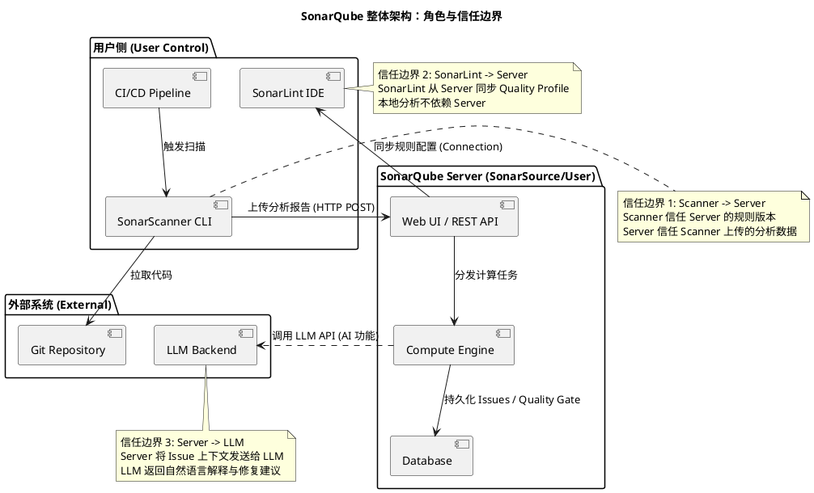
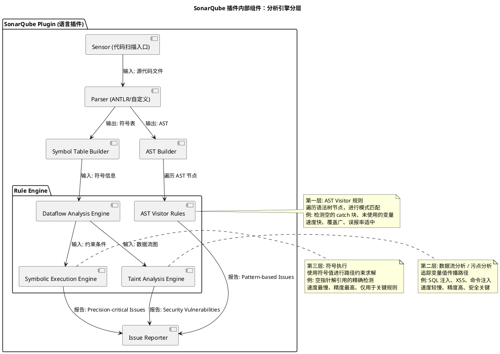

# SonarQube AI Framework 深度分析

## 概述

SonarQube 是由 SonarSource 开发的代码质量管理平台，核心能力是通过静态分析检测代码中的 Bug、Vulnerability（安全漏洞）和 Code Smell（代码坏味道）。它从 2008 年开源项目 Sonar 起步，经过十余年演进，已成为 Java 生态中标杆级的静态分析工具，并在多语言支持、CI/CD 集成和 AI 辅助代码审查方向持续扩展。

SonarQube 不做什么：它不是 IDE 内的实时语法检查器（那是 SonarLint 的定位），不是运行时性能 profiler（那是 APM 工具的定位），也不是 CI/CD 编排引擎（那是 Jenkins/GitLab CI 的定位）。它的核心定位是**"提交前/合并前的代码质量门禁"**，通过 Quality Gate 机制决定是否允许代码合入。

2024 年 11 月，SonarSource 将 analyzer 代码的许可证从传统开源许可证切换为 SSALv1（Sonar Source-Available License v1.0），这是一个重要的开源程度变化——代码仍然可见，但不再属于 OSI 定义的"开源软件"。

### 本质与表现形式

| 维度 | 说明 |
|------|------|
| 它是什么 | 一个基于规则引擎的静态代码分析平台，通过 AST 解析、数据流分析和符号执行检测代码缺陷 |
| 表现形式 | 官方文档 (docs.sonarsource.com/sonarqube-server)、源码仓库 (github.com/SonarSource/sonar-java 等，SSALv1 许可)、商业版产品 (Community/Developer/Enterprise/Data Center Edition)、插件 API 规范 |
| 类比理解 | 类似一个"代码体检中心"：Scanner 负责采集体检样本（代码），规则引擎负责化验分析（AST/数据流），Server 负责出具体检报告（Issue 列表、Quality Gate 结果） |
| 在模型中的位置 | 处于"代码质量门禁"层，上接 CI/CD Pipeline（作为 Quality Gate 执行者），下接代码仓库（作为分析消费者），侧接 SonarLint（作为 IDE 端的轻量级分析前哨） |

---

## 关键术语

| 术语 | 定义 | 在本题中的作用 |
|------|------|---------------|
| **SonarQube (SonarQube Server)** | SonarSource 开发的代码质量管理平台，Server 端负责存储分析结果、管理 Quality Gate、提供 Web UI。2024 年后品牌更名为 SonarQube Server | 本研究的核心对象 |
| **SonarScanner** | 运行在 CI/CD 或开发者本地的 CLI 工具，负责扫描代码并将分析结果上传至 SonarQube Server | 架构中的"数据采集端"角色 |
| **SonarLint** | 集成在 IDE（VS Code, IntelliJ, Eclipse 等）中的轻量级代码分析插件，提供实时反馈 | 与 SonarQube 构成"本地-服务端"双层分析体系 |
| **Plugin (插件)** | 扩展 SonarQube 分析能力的模块化组件，每种语言（Java, JavaScript, Python 等）有独立的语言插件 | 理解规则引擎如何实现多语言支持的关键 |
| **Rule (规则)** | 单条代码检测逻辑，分为 Bug、Vulnerability、Code Smell 三大类（2023 年后叠加 Clean Code 分类体系） | 规则引擎的核心分析单元 |
| **AST (Abstract Syntax Tree)** | 将源代码解析为树状结构，规则可以遍历树节点进行模式匹配 | 规则引擎的第一层分析机制 |
| **Dataflow Analysis (数据流分析)** | 追踪变量值在程序中的传播路径，用于检测空指针、资源泄漏、污点传播等问题 | 规则引擎的第二层（更深层次）分析机制 |
| **Symbolic Execution (符号执行)** | 使用符号值代替具体值进行路径分析，用于更精确的污点分析和漏洞检测 | Java 等语言插件中用于安全漏洞检测的高级分析手段 |
| **Quality Gate (质量门禁)** | 一组阈值条件（如新代码的 Bug 数=0、覆盖率>=80%），决定是否通过代码合并 | SonarQube 作为 CI/CD 门禁的核心机制 |
| **Issue (问题)** | 规则匹配到的代码缺陷实例，包含严重等级、位置、修复建议 | 分析结果的输出格式 |
| **Clean Code (整洁代码)** | SonarSource 于 2023 年引入的分类体系，用 4 个维度（Intentional, Adaptable, Responsible, Consistent）重新组织规则分类 | 2023 年后的规则分类新体系，与旧体系并存 |
| **Taint Analysis (污点分析)** | 追踪不受信任的输入（Source）是否未经处理（Sanitizer）就流入危险操作（Sink） | 安全漏洞检测的核心技术 |
| **SSALv1** | Sonar Source-Available License v1.0，2024 年 11 月启用的源码可用许可证，禁止竞品使用 | 影响 SonarQube 插件代码的开源性质定义 |
| **SonarQube AI / AI Code Assistant** | SonarQube Server 端的 LLM 辅助功能，提供 Issue 解释和修复建议 | AI 能力层的核心组件 |
| **SonarLint AI** | SonarLint IDE 插件的 LLM 辅助功能，提供本地实时的 AI 代码建议 | AI 能力在 IDE 端的延伸 |

---

## 分析正文

### 实体分类

| 实体 | 类型 | 控制方 | 是否跨信任边界 | 主要职责 | 应落入哪类图 |
|------|------|--------|----------------|----------|--------------|
| SonarQube Server | role | SonarSource/用户 | 是（接收 Scanner 数据，服务 Web UI） | 存储分析结果、管理 Quality Gate、提供 API | 架构图 |
| SonarScanner | role | 用户（CI/CD 或本地） | 是（向 Server 发送分析数据） | 执行代码扫描、上传分析结果 | 架构图/时序图 |
| Plugin (语言插件) | component | SonarSource | 否（运行在 Server/Scanner 进程内） | 提供特定语言的解析器、规则集 | 组件图 |
| Rule Engine | component | SonarSource | 否（插件内部组件） | 执行 AST/数据流/符号执行分析 | 组件图 |
| SonarLint | external system | 开发者（IDE 进程） | 是（独立进程，通过 Connection 与 Server 同步） | IDE 内实时分析 | 架构图 |
| SonarQube AI | component | SonarSource | 否（Server 端集成） | LLM 辅助 Issue 解释与修复建议 | 组件图 |
| LLM Backend (外部) | external system | 第三方 | 是（SonarQube 通过 API 调用） | 提供自然语言生成能力 | 架构图 |
| Quality Gate | data object | Server | 否（Server 内部管理） | 定义通过/不通过的阈值条件 | 流程图 |
| Issue | data object | Server/Scanner | 是（Scanner 产生，Server 存储） | 单条代码缺陷记录 | 流程图 |
| CI/CD Pipeline | external system | 用户 | 是（触发 Scanner，消费 Quality Gate 结果） | 自动化构建与部署流程 | 时序图 |

### 1. 整体架构：Scanner-Server-Plugin 三方模型

为了理解 SonarQube 的整体架构，首先需要明确系统中有哪些参与方以及它们之间的信任边界。下图展示了 SonarQube 的角色与信任边界总览。

上图展示了三个关键信任边界：

1. **Scanner → Server**：SonarScanner 在 CI/CD 或本地执行代码扫描，将分析结果（Issue 列表、覆盖率数据等）通过 HTTP API 上传至 Server。Server 信任 Scanner 上传的数据格式正确，Scanner 信任 Server 返回的 Quality Gate 判断。【L1 证据】

2. **SonarLint → Server**：SonarLint 作为 IDE 插件运行在开发者本地，可以独立执行分析（使用内置规则），也可以通过 Connection 从 SonarQube Server 同步 Quality Profile（规则集配置）和 Issue 状态，实现"本地-服务端"的一致性。【L1 证据】

3. **Server → LLM Backend**：SonarQube AI 功能中，Server 将 Issue 上下文（代码片段、规则描述、Issue 类型）发送给外部 LLM 服务，LLM 返回自然语言解释和修复建议。这是一个信任外部服务的边界，数据安全性是该边界的关注点。【L3 证据】

### 2. 规则引擎技术拆解

规则引擎是 SonarQube 的核心分析组件。为了理解规则引擎内部如何工作，需要拆解其多层分析机制。

上图展示了规则引擎的三层分析机制：

**第一层：AST Visitor 规则【L1 证据，github.com/SonarSource/sonar-java】**

这是最基础也是最广泛使用的分析方式。Parser 将源代码解析为 AST，规则以 Visitor 模式遍历 AST 节点，进行模式匹配。这类规则的特点是：
- **速度快**：只需一次 AST 遍历，不需要跨文件分析
- **覆盖广**：适用于所有语言的共性模式（空 catch 块、未使用的 import、魔法数字等）
- **精度适中**：无法跨方法追踪变量，容易产生误报

在 sonar-java 中，AST 级别规则位于 `java-checks` 模块下的 `org.sonar.java.checks` 包（约 300+ 个 Check 类），每个 Check 类对应一条规则。【L2 证据，GitHub API 计数】

**第二层：数据流分析与污点分析【L2 证据】**

数据流分析构建程序的控制流图（CFG）和数据流图（DFG），追踪变量值在方法间和方法内的传播。污点分析（Taint Analysis）是数据流分析在安全领域的具体应用：
- **Source**：不受信任的输入点（HTTP 请求参数、文件读取、数据库查询结果）
- **Sanitizer**：净化函数（参数化查询、HTML 编码、输入验证）
- **Sink**：危险操作（SQL 执行、命令执行、文件写入）

当一条从 Source 到 Sink 的路径上没有经过任何 Sanitizer 时，就报告一个安全漏洞。这类分析需要跨方法追踪，计算复杂度远高于 AST 分析。

**第三层：符号执行【L2 证据】**

符号执行是更精确的分析手段，它不使用具体的变量值，而是使用符号值（symbolic values）来表示变量，通过路径约束求解来判断特定缺陷是否真的可能发生。

在 sonar-java 中，符号执行引擎主要用于空指针检测（如 `S2259` 等规则）和资源泄漏检测。它维护每个变量在每条执行路径上的符号状态，通过求解约束条件来判断缺陷是否可达。

符号执行的计算开销最大，因此仅用于关键规则，而非全量规则。

**Autoscan 机制【L1 证据，sonar-java README】**

sonar-java 引入了"Autoscan"测试机制，用于检测有字节码（编译后）和无字节码两种分析模式之间的差异。这反映了 SonarSource 针对 SonarQube Cloud 的 Automatic Analysis 场景（通常没有编译产物）做的适配——在无字节码场景下分析精度会有所下降，Autoscan 用于量化和监控这一差距。

**Issue 状态转换【L1 证据】**

| 当前状态 | 触发事件 | 转换结果 | 说明 |
|----------|----------|----------|------|
| Open | Issue 首次被检测到时 | Open | 默认状态 |
| Open | 开发者确认问题有效 | Confirmed | 手动确认 |
| Open | 开发者标记为 Won't Fix | Won't Fix | 接受风险，不再处理 |
| Open | 开发者标记为 False Positive | False Positive | 误报 |
| Confirmed / False Positive / Won't Fix | 重新扫描后代码已修改 | Fixed → Closed | 代码修复后自动关闭 |
| Open | 重新扫描后代码已修改 | Closed | 代码修复后自动关闭 |

Issue 的状态流转是 SonarQube 质量管理的核心机制。当代码修复后重新扫描，如果规则不再匹配该 Issue，状态自动变为 Fixed 并最终 Closed。如果开发者认为 Issue 是误报或选择接受风险，可以手动标记。

### 3. 历史演进路径（2015-2026）

SonarQube 的演进可以分为四个关键阶段，每个阶段都有明确的架构改造、能力新增和历史遗留。

#### 阶段一：多语言静态分析平台化（2015-2018）

**改造了什么**：
- 从单一 Java 分析工具（Sonar）转型为多语言平台（SonarQube）
- 引入 Plugin 架构，每种语言通过独立插件支持
- 引入 Quality Gate 概念，从"问题报告工具"升级为"质量门禁"
- 引入 SonarLint，建立 IDE 端与 Server 端的双层分析体系

**抛弃了什么**：
- 早期硬编码在核心中的语言解析器，迁移至插件化
- 旧版 Sonar Runner 被 SonarScanner 替代

**新增了什么**：
- Java 插件的符号执行引擎（提升空指针检测精度）
- 覆盖率集成（JaCoCo、Cobertura）
- 分支分析（Developer/Enterprise 版特性）

#### 阶段二：安全能力深化与 CI/CD 集成（2019-2022）

**改造了什么**：
- 污点分析引擎在 Java、JavaScript、Python 等语言中落地
- Security Report 独立于一般 Issue 列表，按 CWE/OWASP Top 10 分类
- 与主流 CI/CD 平台（Jenkins、GitLab CI、GitHub Actions、Azure DevOps）深度集成

**抛弃了什么**：
- 旧版 Sonar Runner 彻底被 SonarScanner 替代
- 旧的 Severity 分类体系逐步引入 Impact 维度

**新增了什么**：
- Security Hotspot 概念（需要人工审查的潜在安全问题）
- Quality Gate 自定义条件
- 代码度量指标体系（Cyclomatic Complexity、Cognitive Complexity、Duplications）

#### 阶段三：Clean Code 分类体系引入与许可证变更（2023-2024）

**改造了什么**：
- 2023 年引入全新的 Clean Code 分类体系，用 4 个维度（Intentional, Adaptable, Responsible, Consistent）叠加在传统的 Bug/Vulnerability/Code Smell 三分法之上
- 每个规则同时标注旧分类和新分类（Clean Code Attributes + Software Qualities）
- 这是分类体系的**叠加**而非**替换**——旧分类体系仍然可用
- **2024 年 11 月**：SonarSource 将 analyzer 代码许可证切换为 SSALv1（Sonar Source-Available License v1.0），代码不再属于 OSI 定义的"开源软件"【L1 证据，sonar-java LICENSE.txt】

**新增了什么**：
- Software Qualities（Reliability, Security, Maintainability）作为规则影响的更高维度分类
- Clean as You Code 方法论推广，强调关注"新代码"而非全量代码
- SonarQube Cloud (SaaS) 的 AI 辅助功能试点

#### 阶段四：AI 增强与 LLM 集成（2024-2026）

**新增了什么**：
- SonarQube AI（AI Code Assistant）：Server 端的 LLM 辅助功能，提供 Issue 解释和修复建议
- SonarLint AI：IDE 端的 LLM 辅助功能，提供实时 AI 代码建议
- 与外部 LLM 服务的集成（具体后端模型未公开）
- AI 驱动的自动修复建议（Fix Suggestion）
- "Fix the Leak"等 AI 辅助批量修复功能

**当前状态**：
- AI 功能仅在 Developer 版及以上版本提供，Community 版不可用【L3 证据】
- AI 功能是闭源集成，不开放 LLM 选择或自定义 Prompt【L3 证据】
- AI 功能依赖外部 LLM API 调用，非本地推理【L3 证据】

### 4. AI 能力层：SonarQube AI / SonarLint AI

为了理解 AI 能力在 SonarQube 体系中的位置，需要区分 AI 能力与传统规则引擎的关系。

| 维度 | 传统规则引擎 | AI 能力 (SonarQube AI / SonarLint AI) |
|------|-------------|--------------------------------------|
| 分析方式 | 确定性（AST/数据流/符号执行） | 概率性（LLM 生成） |
| 输出类型 | Issue（结构化的缺陷报告） | 自然语言解释 + 修复建议 |
| 精度 | 高（基于形式化方法） | 中（依赖 LLM 质量，可能有幻觉） |
| 覆盖范围 | 所有已编码的规则 | 所有已有 Issue 的解释 |
| 运行位置 | Scanner 进程内 / Server 端 | Server 端（通过外部 LLM API） |
| 开源状态 | 源码可见（SSALv1 许可） | 闭源（商业版特性） |
| 成本 | 本地计算，无额外成本 | 外部 LLM API 调用，有 API 成本 |
| 版本可用性 | 所有版本（Community 及以上） | Developer 版及以上 |

**AI 能力的核心功能【L3 证据】：**

1. **Issue 解释**：当 SonarQube 检测到一个 Issue 时，AI 可以生成自然语言解释，说明为什么这段代码有问题、违反了什么原则、可能导致什么后果。这降低了开发者理解复杂规则（尤其是数据流分析和污点分析产生的安全漏洞）的门槛。

2. **修复建议**：AI 可以生成具体的修复代码建议，直接告诉开发者应该如何修改代码。这与传统规则引擎只提供"修复建议"的描述不同，AI 能生成可执行的代码片段。

3. **SonarLint AI**：在 IDE 端，SonarLint AI 提供类似的 AI 辅助功能，但更侧重于实时反馈——开发者在编写代码时即可获得 AI 辅助的修复建议。

**AI 能力的设计约束：**

- AI 功能**不替代**传统规则引擎。规则引擎负责检测（Detection），AI 负责解释（Explanation）和建议（Suggestion）。检测的准确性仍然依赖确定性分析。【L3 证据】
- AI 功能**不引入新的检测规则**。它只解释已有规则检测到的 Issue，不会发现规则引擎未能检测到的新问题。【L3 证据】
- AI 功能依赖外部 LLM 服务，这意味着代码上下文会被发送到第三方服务，存在数据隐私考虑。【L3 证据】
- AI 功能的具体 LLM 后端（OpenAI GPT、Azure OpenAI、自有模型等）官方未公开披露。【L3 证据，不确定性】

### 5. 版本差异：Community vs Developer vs Enterprise

| 能力维度 | Community Edition (免费) | Developer Edition | Enterprise Edition | Data Center Edition |
|----------|--------------------------|-------------------|-------------------|---------------------|
| 核心规则引擎 | 全部语言（SSALv1） | 全部语言（SSALv1） | 全部语言（SSALv1） | 全部语言（SSALv1） |
| 基本质量指标 | 支持 | 支持 | 支持 | 支持 |
| Quality Gate | 基础条件 | 自定义条件 | 自定义条件 | 自定义条件 |
| 分支分析 | 仅主分支 | PR/分支 | PR/分支 | PR/分支 |
| Pull Request Decoration | 不支持 | 支持 | 支持 | 支持 |
| 污点分析 / 安全报告 | 不支持 | 支持 | 支持 | 支持 |
| 分支覆盖率 | 不支持 | 支持 | 支持 | 支持 |
| SonarQube AI | 不支持 | 支持 | 支持 | 支持 |
| SonarLint AI | 不支持 | 支持 | 支持 | 支持 |
| 多项目管理 | 有限 | 支持 | 支持 | 支持 |
| 高可用 / 集群 | 不支持 | 不支持 | 不支持 | 支持 |
| 企业级 SSO / SAML | 不支持 | 不支持 | 支持 | 支持 |
| 应用管控 (Application) | 不支持 | 不支持 | 支持 | 支持 |

**关键差异说明：**

1. **AI 功能仅 Developer 版及以上可用【L3 证据】**：Community 版用户无法使用 SonarQube AI 和 SonarLint AI 功能。这是 SonarSource 将 AI 能力作为商业差异化的核心策略。

2. **安全能力（污点分析、Security Report）仅 Developer 版及以上可用【L3 证据】**：这是 Community 版与付费版最显著的技术差距。Community 版只能使用 AST 级别的安全规则，无法进行跨方法的污点追踪。

3. **分支分析和 PR Decoration 仅付费版可用**：Community 版只能分析主分支，无法对 Pull Request 或特性分支进行独立分析。这使得 Community 版在 CI/CD 集成场景中的价值显著降低。

4. **核心规则引擎在所有版本中一致**：无论是 Community 还是 Enterprise，规则引擎的实现（AST 分析、符号执行）是相同的。差异在于**安全分析能力**（污点分析）和**AI 能力**是否可用，而非规则引擎本身被削弱。

### 6. Java 专项规则集

Java 是 SonarQube 支持的最成熟语言，规则覆盖度在 sonar-java 仓库中明确描述为"600+ rules"（包括 150+ bug 检测规则和 350+ code smell 规则）。【L1 证据，sonar-java README】

**Java 规则分类【L1/L2 证据】：**

| 规则类别 | 数量级 | 分析方式 | 示例 |
|----------|--------|----------|------|
| Bug | 150+ | AST + 数据流 + 符号执行 | 空指针、资源泄漏、并发错误 |
| Code Smell | 350+ | 主要为 AST | 代码重复、复杂度过高、未使用代码 |
| Vulnerability | 50+ | 污点分析 + 符号执行 | SQL 注入、XSS、反序列化漏洞 |
| Security Hotspot | 50+ | AST + 数据流 | 弱加密、硬编码密码、日志注入 |

> 注：原始 draft 中 "~1000+" 的规则数量是跨语言的总量估计，Java 单语言的实际规则数为 600+（来自 README 官方描述）。

**sonar-java 仓库的模块结构【L2 证据，GitHub API】：**

| 模块 | 职责 |
|------|------|
| `java-frontend` | Java 解析器、AST 构建、符号表 |
| `java-checks` | 300+ 条 AST 级别规则实现（`org.sonar.java.checks` 包） |
| `java-checks-aws` | AWS 专项规则（云安全相关） |
| `java-checks-common` | 跨 check 模块共享的通用规则逻辑 |
| `java-surefire` | 测试覆盖率报告导入 |
| `sonar-java-plugin` | SonarQube 插件打包入口 |
| `external-reports` | 外部报告工具集成 |

**Java 规则引擎的核心技术能力：**

1. **AST 分析**：覆盖 Java 语言的所有语法结构。sonar-java 使用自定义解析器将 Java 源码解析为 AST。【L1 证据】

2. **符号表（Symbol Table）**：sonar-java 构建完整的符号表，追踪变量、方法、类的引用关系。这是数据流分析和符号执行的基础。【L2 证据】

3. **控制流图（CFG）**：对每个方法构建 CFG，支持数据流分析中的前向传播和后向传播。【L2 证据】

4. **符号执行引擎**：用于空指针检测（`S2259` 等规则）和资源泄漏检测。维护变量在每条执行路径上的符号状态。【L2 证据】

5. **Spring 框架规则**：sonar-java 包含针对 Spring 框架的专项规则，如 `@RequestMapping` 的 HTTP 方法缺失检测、Spring Security 配置错误检测、Spring Boot Actuator 端点暴露检测等。【L2 证据】

6. **并发安全规则**：检测 `synchronized` 使用不当、`volatile` 误用、线程池配置问题、`java.util.concurrent` API 误用等。主要依赖 AST 模式匹配和部分数据流分析。【L2 证据】

7. **AWS 专项规则**：`java-checks-aws` 模块提供针对 AWS SDK 使用的安全规则（如不当的 IAM 配置、不安全的 S3 操作等）。【L2 证据】

8. **Autoscan / Ruling 测试**：sonar-java 有完善的"Ruling Test"机制，通过大规模代码库验证规则准确性，并维护预期的 Issue 位置 JSON 文件。这保证了规则变更时的回归测试。【L1 证据，sonar-java README】

### 7. 区块链扩展：Solidity 插件

**重要结论**：SonarSource **没有**官方维护的 sonar-solidity 插件。【L2 证据，GitHub API 搜索返回 0 个 SonarSource 仓库】

当前存在的 Solidity SonarQube 插件全部由第三方社区维护，最主要的是 `sagap/sonar-solidity`：

| 指标 | 数值 | 说明 |
|------|------|------|
| 维护方 | sagap（个人开发者） | 非 SonarSource 官方 |
| 最后更新 | 2018-08-21 | 已多年未活跃维护 |
| Stars | 24 | 社区关注度低 |
| Forks | 11 | 社区贡献极少 |

【L2 证据，GitHub API: api.github.com/repos/sagap/sonar-solidity】

**Solidity 分析能力的实际状态：**

| 维度 | 现状 | 说明 |
|------|------|------|
| 官方支持 | 无 | SonarSource 没有官方 Solidity 插件 |
| 社区插件 | 有但停滞 | sagap/sonar-solidity 自 2018 年后未更新 |
| 规则数量 | 未知（估计 <50） | 缺乏官方统计 |
| 污点分析 | 不支持 | 无 Solidity 语言的污点分析引擎 |
| 符号执行 | 不支持 | 无 Solidity 语言的符号执行引擎 |
| 框架专项规则 | 无 | 无 OpenZeppelin、Hardhat 等框架规则 |

**SonarQube 在区块链场景中的局限性：**

1. **缺乏官方支持**：SonarSource 未将 Solidity 纳入官方支持的语言列表，反映出其对区块链语言的优先级低于主流编程语言。【L2/L4 证据】

2. **社区插件停滞**：最流行的社区 Solidity 插件已多年未更新，无法覆盖 Solidity 语言近年来的重大变更（如 0.8.x 的内置溢出检查、EVM 升级等）。

3. **Smart Contract 安全的特殊性**：智能合约的执行模型（EVM、Gas 机制、合约交互、重入模式）与传统语言有本质差异。即使有 Solidity 插件，SonarQube 的通用规则引擎也难以有效覆盖重入攻击、闪电贷操纵、MEV 等区块链特有的安全模式。

4. **替代工具更适配**：在 Solidity 安全分析领域，Slither（Trail of Bits）、Mythril、Echidna 等专用工具比 SonarQube 更适合，因为它们专门针对 EVM 语义和智能合约漏洞模式设计。【L4 证据】

---

## 设计取舍

| 设计决策 | 选择 | 替代方案 | Trade-off 分析 |
|----------|------|----------|---------------|
| **Plugin 架构 vs 单体规则引擎** | Plugin 架构 | 单体引擎，内置所有语言支持 | Plugin 架构支持多语言扩展，但增加了 Plugin API 的维护成本和各插件质量一致性管理的难度。单体引擎实现简单但无法适应多语言生态的快速变化。 |
| **AST + 数据流 + 符号执行三层分析** | 三层分层 | 仅 AST（速度快但精度低）或仅符号执行（精度高但速度慢） | 分层设计让大多数规则使用快速的 AST 分析，少量关键规则使用精确但昂贵的符号执行。代价是分析引擎的复杂度显著增加。 |
| **AI 功能闭源集成 vs 开源社区模式** | 闭源集成（商业版特性） | 开源 AI 能力，社区可自定义 Prompt/模型 | 闭源保证了 AI 功能的统一质量和服务水平，但也限制了社区对 AI 能力的定制和创新。社区无法使用开源 LLM（如 Llama）替代。 |
| **Clean Code 新体系叠加旧体系 vs 完全替换** | 叠加并存 | 完全替换为 Clean Code 体系 | 叠加策略避免了存量用户的迁移成本，但也导致规则分类的复杂度增加（每个规则现在有多个分类标签）。 |
| **SonarLint 本地分析 vs 完全依赖 Server** | 本地独立分析 + Server 同步 | 完全依赖 Server（需要网络连接） | SonarLint 的本地分析能力保证了开发者在无网络或代码未提交时也能获得反馈，代价是需要同步机制保证规则集一致性。 |
| **External LLM vs 本地推理** | 外部 LLM API 调用 | 本地部署 LLM 推理 | 外部 API 保证了 LLM 质量和更新速度，但引入数据隐私顾虑和 API 成本。本地推理需要额外的硬件和运维投入。 |
| **SSALv1 源码可用 vs 传统开源** | SSALv1（2024年11月起） | 继续采用 LGPL/Apache 等传统开源许可证 | SSALv1 保留了代码可见性和社区贡献通道，但禁止竞品使用，同时不再符合 OSI 开源定义。这在保护商业利益和维持社区信任之间做了取舍。 |

---

## 边界与前提

### 能力归属

| 能力 | 归属 | 说明 |
|------|------|------|
| AST 级别规则检测 | SonarQube 原生（所有版本） | 规则引擎核心能力，Community 版完整可用 |
| 数据流分析 / 污点分析 | SonarQube 原生（Developer 版及以上） | 安全分析核心能力，Community 版不可用 |
| 符号执行 | SonarQube 原生（所有版本） | Java 等语言的空指针检测等 |
| Quality Gate 判定 | SonarQube 原生（所有版本） | 质量门禁核心机制 |
| Issue AI 解释 / 修复建议 | SonarQube AI（Developer 版及以上） | 依赖外部 LLM 服务 |
| IDE 实时分析 | SonarLint（免费） | 独立于 SonarQube 运行 |
| IDE AI 建议 | SonarLint AI（Developer 版及以上） | 依赖外部 LLM 服务 |
| Solidity 分析 | 第三方社区插件 | 无官方支持，社区插件已停滞 |

### Live / Planned / Promotional

| 能力 | 状态 | 说明 |
|------|------|------|
| AST/数据流/符号执行规则引擎 | Live | 成熟稳定，多年生产验证 |
| SonarQube AI (Issue 解释) | Live | 已在 Developer 版及以上提供 |
| SonarQube AI (修复建议) | Live | 已在 Developer 版及以上提供 |
| SonarLint AI | Live | 已在 IDE 插件中提供 |
| Clean Code 分类体系 | Live | 2023 年引入，与旧体系并存 |
| SSALv1 许可证 | Live | 2024 年 11 月起生效 |
| 自定义 LLM 后端 / Prompt | Planned/Promotional | 官方路线图中有提及 AI 扩展，但具体能力未明确 |
| Solidity 官方支持 | 不支持 | SonarSource 未将 Solidity 列入官方支持语言 |

### 不能解决的问题

1. **运行时问题**：SonarQube 是静态分析工具，无法检测运行时问题（内存泄漏、性能瓶颈、死锁）。【L1 证据】
2. **动态行为**：无法检测通过反射、动态代理、字节码生成等动态机制引入的问题。【L1 证据】
3. **业务逻辑错误**：无法检测业务逻辑层面的缺陷（如价格计算错误、权限逻辑错误）。【L1 证据】
4. **第三方库漏洞**：虽然能检测代码中使用的不安全 API，但不等同于 SCA（Software Composition Analysis），无法完整追踪依赖库的 CVE。【L2 证据】
5. **架构级设计问题**：无法检测微服务间的循环依赖、领域模型设计不当等架构级问题。【L2 证据】
6. **区块链特有安全问题**：重入攻击、闪电贷操纵、MEV 攻击等智能合约特有漏洞模式不在 SonarQube 的分析范围内。【L2/L4 证据】

---

## 相关对象关系

| 对象 | 关系类型 | 说明 |
|------|----------|------|
| **SonarLint** | 互补 | IDE 端轻量级分析，与 SonarQube Server 构成"本地-云端"双层体系 |
| **SonarQube Cloud (SaaS)** | 演进 | SonarQube 的 SaaS 版本，核心分析引擎与自托管版一致 |
| **Checkstyle / PMD / SpotBugs** | 替代（Java 领域） | 传统 Java 静态分析工具，SonarQube Java 插件整合了部分它们的规则 |
| **ESLint / Pylint / RuboCop** | 替代（各语言领域） | 各语言的社区标准 lint 工具，SonarQube 提供更统一的多语言体验 |
| **Semgrep** | 替代（安全领域） | 新兴的静态安全分析工具，在自定义规则和速度上有优势 |
| **Snyk Code / CodeQL** | 替代（安全领域） | GitHub 生态的安全分析工具，SonarQube 在质量门禁集成上有优势 |
| **Slither / Mythril** | 替代（Solidity 领域） | 智能合约专用安全分析工具，比 SonarQube 更适合 Solidity 分析 |
| **OpenZeppelin Defender** | 互补（Solidity 领域） | 智能合约安全审计平台，SonarQube 缺乏官方 Solidity 支持的部分可互补 |

---

## 结论

### 已确认

- **【L1 证据】** SonarQube 的核心架构为 Scanner-Server-Plugin 三方模型。Scanner 负责代码扫描，Server 负责结果存储和质量门禁，Plugin 负责各语言的规则实现。
- **【L1 证据】** 规则引擎采用 AST 分析、数据流分析和符号执行三层架构，覆盖了从快速模式匹配到精确路径分析的全谱。
- **【L1 证据】** Java 是 SonarQube 支持最成熟的语言，拥有 600+ 条规则（150+ Bug、350+ Code Smell），包含 Spring 框架专项规则和 AWS 专项规则。
- **【L2 证据】** SonarSource **没有**官方维护的 Solidity 插件。社区插件 sagap/sonar-solidity 自 2018 年后未更新，SonarQube 在区块链场景中的适用性极低。
- **【L1 证据】** sonar-java 代码自 2024 年 11 月起采用 SSALv1 许可证，不再属于 OSI 定义的"开源软件"。
- **【L3 证据】** AI 功能（SonarQube AI、SonarLint AI）仅在 Developer 版及以上版本提供，Community 版不可用。
- **【L3 证据】** AI 功能依赖外部 LLM API 调用，为闭源集成，不提供 LLM 后端选择或自定义 Prompt 能力。
- **【L3 证据】** Clean Code 分类体系于 2023 年引入，采用叠加策略与旧分类体系并存。

### 尚需验证

- **【L3 证据】** SonarQube AI 具体依赖哪家 LLM 服务（OpenAI GPT、Azure OpenAI、自有模型）。官方文档未明确说明。
- **【L3 证据】** SonarQube 是否支持本地部署 LLM 进行 AI 推理（避免数据外传）。当前文档未提及此能力。
- **【L2 证据】** SonarQube 2024-2025 年版本中 AI 能力的具体功能范围是否有扩展（如自动 PR 评论、代码重构建议）。

### 基于推断

- **【L4 证据】** SonarQube AI 的数据隐私顾虑可能阻碍其在金融、医疗等强监管行业的企业客户中采用。
- **【L4 证据】** SonarSource 未将 Solidity 列入官方支持语言，反映其对区块链生态的优先级较低。

---

## 参考资料

| 来源 | 说明 | 验证状态 |
|------|------|----------|
| SonarQube 官方文档 (docs.sonarsource.com/sonarqube-server) | 架构、规则引擎、版本特性官方说明 | `[已验证]` 网站可访问（GitBook 托管，JS 渲染内容需浏览器） |
| sonar-java GitHub (github.com/SonarSource/sonar-java) | Java 规则引擎开源实现，README 明确 "600+ rules"，SSALv1 许可 | `[已验证]` GitHub API 可访问，1202 stars，2026-04-17 最后更新 |
| Sonar Rules (rules.sonarsource.com) | 各语言规则集完整列表与分类 | `[未验证]` 需要浏览器渲染 |
| SonarSource Blog (sonarsource.com/blog) | AI 功能发布、Clean Code 体系引入、产品演进 | `[未验证]` Gatsby JS 渲染，curl 无法获取正文 |
| SonarQube Release Notes | 各版本功能变更与废弃说明 | `[未验证]` 需要浏览器渲染 |
| SonarLint GitHub (github.com/SonarSource/SonarLint) | IDE 端分析引擎实现 | `[已验证]` 仓库存在 |
| sagap/sonar-solidity GitHub | 社区 Solidity 插件，2018年后未更新，24 stars | `[已验证]` GitHub API 可访问 |
| SonarQube Community Forum | 插件开发、规则定制、AI 功能反馈的社区讨论 | `[未验证]` 需要浏览器 |
| Stack Overflow sonarqube tag | 常见问题与集成模式 | `[未验证]` 需要浏览器 |
