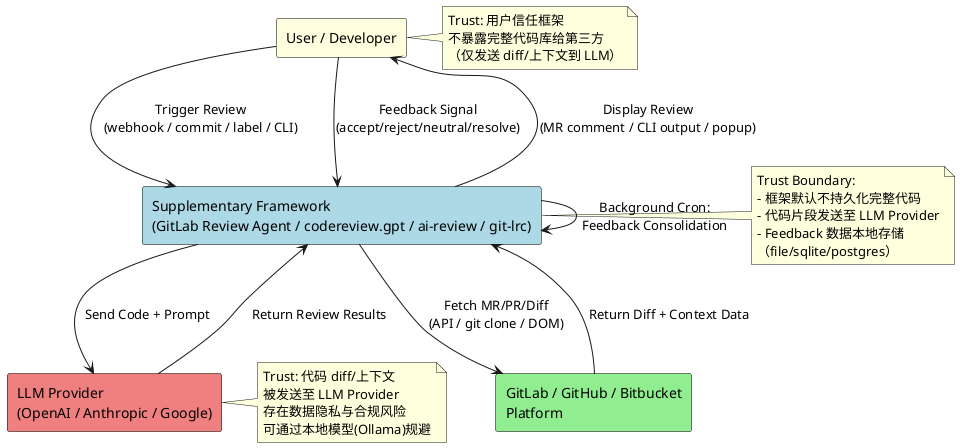
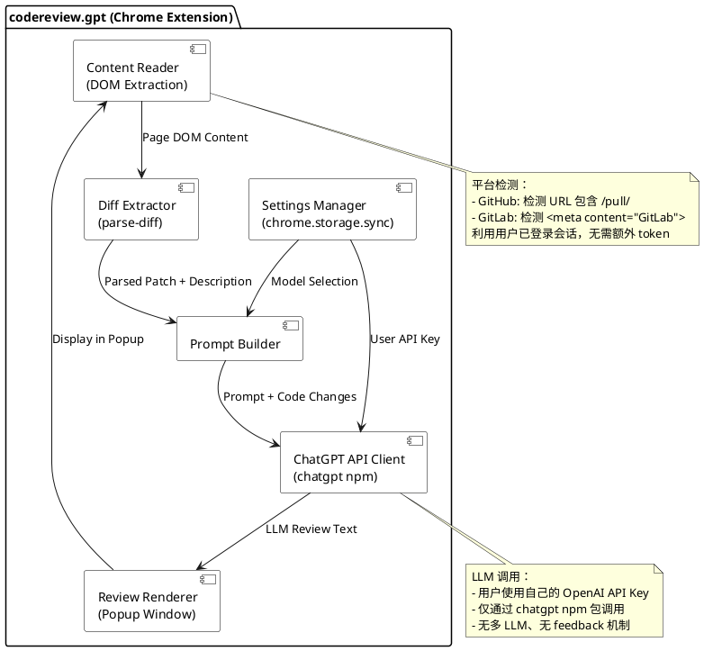
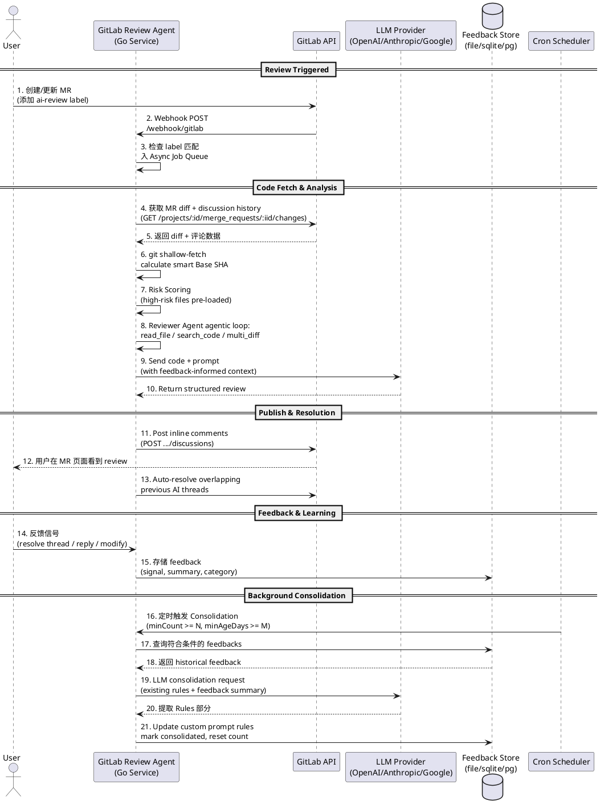
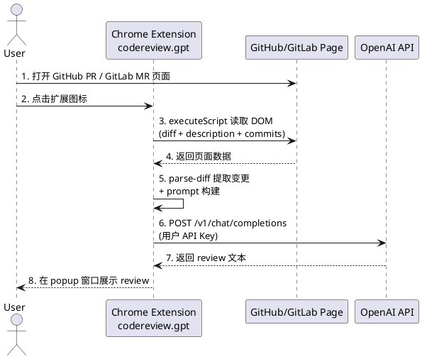

# 补充开源 AI Code Review 框架

## 研究深度

- **深度等级**: deep-dive（GitLab Review Agent 和 codereview.gpt 源码级验证）
- **覆盖范围**: GitLab Review Agent（antlss/gitlab-review-agent）与 codereview.gpt（sturdy-dev/codereview.gpt）进行 L2 源码级分析；ai-review、git-lrc、Gito 进行 L1 README 与 L3 GitHub API 基础信息覆盖
- **证据等级**: 核心 claim 基于 L1（README）与 L2（源码）验证

## 概述

本研究覆盖 AI Code Review 领域中的补充开源框架集合，重点分析 GitLab Review Agent 和 codereview.gpt，以及调研中发现的其他轻量框架。这些框架虽然规模不及主流框架，但代表了不同的架构模式和生态位，对理解 AI Code Review 开源版图全貌具有重要意义。

### 本质与表现形式

| 维度 | 说明 |
|------|------|
| 它是什么 | 一组填补主流 AI Code Review 框架未覆盖生态位的补充开源工具，包括 GitLab 生态代表、轻量 Chrome 扩展代表、commit-triggered 工具、高置信度专用工具 |
| 表现形式 | 自托管 Go 服务端、Chrome Extension、Python CLI/脚本、GitHub Action |
| 类比理解 | 类似主流 AI Code Review 工具的"长尾补充" —— 主流工具覆盖 GitHub + 重型 review，补充工具覆盖 GitLab、轻量模式、commit 级别、特定质量维度 |
| 在模型中的位置 | AI Code Review 工具分层中的 "Supplementary Layer"（补充层），位于主流框架之下、实验性项目之上 |

## 关键术语表

| 术语 | 定义 | 在本题中的作用 |
|------|------|---------------|
| Self-Learning Feedback Loop | 系统通过后台 Cron 定期收集用户对 review 结果的反馈信号（accepted/rejected/neutral），调用 LLM 将重复出现的模式提炼为项目级 custom prompt rules 的机制 | GitLab Review Agent 的核心差异化特性，源码验证于 `consolidator.go` [L2-01] |
| Multi-LLM Architecture | 同时支持多个 LLM provider（OpenAI、Anthropic、Google），并通过 BalancedClient 进行 least-connections 负载均衡和 rate-limit failover 的架构。**限制：BalancedClient 仅在同一 provider 内的多个 API Key 间均衡，不跨 provider 均衡** | GitLab Review Agent 的 LLM 路由策略，源码验证于 `balancer.go` [L2-02] |
| Chrome Extension Review Mode | 通过浏览器扩展直接读取 GitHub PR / GitLab MR 页面 DOM 内容并触发 LLM review 的轻量客户端模式 | codereview.gpt 的核心架构，验证于 `popup.js` 源码 [L2-04] |
| Label-Based Trigger | 通过 GitLab MR label（默认 `ai-review`）控制是否触发 AI review 的机制，避免对所有 MR 产生噪音 | GitLab Review Agent 的触发策略，验证于 README [L1-01] |
| Agentic Code Analysis | LLM 在 review 过程中通过工具（`read_file`、`search_code`、`multi_diff`）主动探索代码库上下文，而非仅分析 diff 的模式 | GitLab Review Agent 的 review 深度策略，验证于 README [L1-01] |
| Commit-Triggered Review | 在 git commit/push 事件触发时自动运行 review，而非在 PR/MR 层面触发 | git-lrc 的核心模式 [L1-04] |
| Risk Scoring | 对 MR 中修改的文件按复杂度/变更量评分，高风险文件预加载到 LLM 上下文，大规模 PR（>150 文件）按风险截断 | GitLab Review Agent 的上下文管理策略，验证于 README [L1-01] |
| Reply Loop | 开发者在 GitLab MR 中直接回复 AI 评论，Replier Agent 读取线程历史+代码上下文后继续技术讨论的机制 | GitLab Review Agent 的交互能力，验证于 README + `internal/core/reply` [L1-01] |

## 实体分类

| 实体 | 类型 | 控制方 | 是否跨信任边界 | 主要职责 |
|------|------|--------|----------------|----------|
| GitLab Review Agent | role（自托管服务端） | 用户/团队 | 是 | GitLab MR 的 AI review，支持多 LLM、feedback learning、agentic 分析 |
| codereview.gpt | role（Chrome 扩展） | 用户 | 是 | 浏览器端的轻量 PR/MR review，读取页面内容调用 OpenAI API |
| ai-review | role（Python 脚本/服务） | 用户/团队 | 是 | 多平台（GitHub/GitLab/Bitbucket/Azure DevOps/Gitea）AI review |
| git-lrc | role（Go CLI/CI 集成） | 用户/团队 | 是 | commit 级别触发 AI review |
| GitLab / GitHub Platform | external system | GitLab Inc. / GitHub Inc. | - | 提供 MR/PR diff、comment API |
| LLM Provider (OpenAI/Anthropic/Google) | external system | 各 LLM 厂商 | - | 提供代码分析与 review 生成能力 |
| User Feedback Data | data object | 用户 | 是 | review 反馈信号（accepted/rejected/neutral），用于 feedback consolidation |
| Consolidated Rules | data object | 框架自身 | 否 | 由 Consolidator 生成的项目级 custom prompt rules |

## 角色与信任边界总览

<!-- diagram: roles-and-trust-boundaries -->

**关键信任边界说明：**

- **用户 -> 框架**：GitLab Review Agent 默认通过 webhook 或 CLI 触发，代码通过 git shallow-fetch 获取到本地服务器，不上传第三方（除发送至 LLM 的 diff/上下文）[L1-01, L2-03]
- **框架 -> LLM Provider**：diff 和代码上下文被发送至 LLM。GitLab Review Agent 支持本地模型规避隐私风险，但 README 中明确列出的 providers 为 OpenAI/Anthropic/Google [L1-01]
- **框架 -> GitLab/GitHub**：GitLab Review Agent 通过 GitLab REST API + Access Token 认证获取 MR diff，并通过 `go-git` 库 shallow-clone 目标分支获取完整代码库上下文 [L2-03, L1-01]
- **Feedback Loop**：用户的 review 反馈（resolve thread / accept / reject）被记录到本地存储（file/sqlite/postgres），由后台 Cron 定期调用 LLM 提炼为 custom prompt rules [L2-01]

## 角色内部组件图

### GitLab Review Agent 内部组件

GitLab Review Agent 采用 Go 服务端 Clean Architecture，严格遵循 Standard Go Project Layout 约定 [L1-01]。

```plantuml
@startuml
skinparam component {
    BackgroundColor White
    BorderColor Black
    RoundCorner 5
}

package "cmd" {
  component [server] as Server
  component [cli] as CLI
}

package "internal/core" {

  package "review" {
    component [Review Pipeline] as ReviewPipeline
    component [Risk Scorer] as RiskScorer
  }

  package "reply" {
    component [Replier Agent] as ReplierAgent
  }

  package "feedback" {
    component [Consolidator\n(Background Cron)] as Consolidator
  }

  package "agents" {
    component [Reviewer Agent] as ReviewerAgent
    component [Replier Agent Impl] as ReplierImpl
  }

  package "prompt" {
    component [Prompt Templates] as PromptTemplates
  }
}

package "internal/pkg" {

  package "git" {
    component [Git Manager\n(go-git)] as GitManager
  }

  package "gitlab" {
    component [GitLab API Client] as GitLabClient
  }

  package "llm" {
    component [OpenAI Driver] as OpenAI
    component [Anthropic Driver] as Anthropic
    component [Google Driver] as Google
    component [BalancedClient] as Balancer
  }

  package "store" {
    component [Feedback Store] as FeedbackStore
    component [Repo Settings Store] as SettingsStore
  }

  package "queue" {
    component [Async Job Queue] as JobQueue
  }

  package "tools" {
    component [read_file] as ToolRead
    component [search_code] as ToolSearch
    component [multi_diff] as ToolDiff
  }
}

Server --> GitLabClient : "Webhook Events"
CLI --> GitLabClient : "Manual Review"
GitLabClient --> ReviewPipeline : "MR Data"
GitLabClient --> ReviewPipeline : "Discussion History"
ReviewPipeline --> GitManager : "Shallow Clone + Base SHA"
GitManager --> RiskScorer : "Modified Files"
RiskScorer --> ReviewerAgent : "Risk-Sorted Files"
ReviewerAgent --> ToolRead : "Explore Codebase"
ReviewerAgent --> ToolSearch : "Find References"
ReviewerAgent --> Balancer : "LLM Request"
Balancer --> OpenAI
Balancer --> Anthropic
Balancer --> Google
OpenAI --> Balancer
Anthropic --> Balancer
Google --> Balancer
Balancer --> ReviewerAgent : "LLM Response"
ReviewerAgent --> GitLabClient : "Post Inline Comments"
GitLabClient --> FeedbackStore : "Record Feedback Signals"

Consolidator --> FeedbackStore : "List Feedbacks\n(minAgeDays threshold)"
Consolidator --> SettingsStore : "Get Custom Prompt"
Consolidator --> Balancer : "LLM Consolidation Request"
Balancer --> Consolidator : "Extracted Rules"
Consolidator --> SettingsStore : "Update Custom Prompt"

ReplierAgent --> GitLabClient : "Reply Events"
ReplierAgent --> ReplierImpl : "Thread + Code Context"
ReplierImpl --> Balancer : "Reply Generation"
ReplierImpl --> GitLabClient : "Post Reply"

JobQueue --> ReviewPipeline : "Async Processing"
@enduml
```

<!-- diagram: gitlab-review-agent-components -->

**组件说明：**

| 组件 | 位置 | 职责 | 关键设计 |
|------|------|------|----------|
| `cmd/server` | `cmd/server/` | HTTP 服务，处理 GitLab Webhook、Cron 定时任务、Worker 池 | Webhook endpoint: `/webhook/gitlab`，端口 8080 [L1-01] |
| `cmd/cli` | `cmd/cli/` | 交互式 CLI，本地 dry-run review，选择性推送评论 | 支持 `--model` 参数动态覆盖模型 [L1-01] |
| Review Pipeline | `internal/core/review/` | MR review 主流程：trigger -> clone -> score -> analyze -> publish | Label-based trigger (`ai-review`)，Smart Base SHA 增量计算 [L1-01] |
| Risk Scorer | `internal/core/review/` | 对修改文件按复杂度/变更量评分 | 高风险文件预加载到 LLM 上下文，>150 文件按风险截断 [L1-01] |
| Reviewer Agent | `internal/core/agents/reviewer/agent.go` | agentic code analysis 主循环 | 使用 `read_file`、`search_code`、`multi_diff` 工具探索代码库 [L1-01] |
| Replier Agent | `internal/core/agents/replier/` + `internal/core/reply/` | 处理开发者对 AI 评论的回复 | 读取线程历史+代码上下文，继续技术讨论 [L1-01] |
| Consolidator | `internal/core/feedback/consolidator.go` | 后台 Cron 定期 consolidation | 收集 accepted/rejected/neutral 信号，调用 LLM 提炼 custom prompt rules [L2-01] |
| Git Manager | `internal/pkg/git/` | git shallow-fetch + Base SHA 计算 | 使用 `go-git/v5` 库，避免重复处理已 review 的 commit [L2-03, L1-01] |
| GitLab API Client | `internal/pkg/gitlab/` | GitLab REST API 交互 | 获取 MR diff、discussion、发布 inline comment、auto-resolve [L1-01] |
| BalancedClient | `internal/pkg/llm/balancer.go` | 多 API Key least-connections 负载均衡 | per-key semaphore（并发上限 2），429 rate-limit 自动 failover 到下一个 key。**注意：仅在同一 provider 内的多个 API Key 间均衡，不跨 provider 均衡** [L2-02] |
| LLM Drivers | `internal/pkg/llm/{openai,anthropic,google}.go` | 各 LLM provider 的独立驱动 | 模块化设计，新增 provider 只需添加 driver 文件 [L2-05] |
| Feedback Store | `internal/pkg/store/` + domain interface | 持久化反馈数据 | 支持 file/sqlite/postgres 三种 driver [L1-01, L2-03] |
| Async Job Queue | `internal/pkg/queue/` | Webhook 事件异步处理 | 带 retry threshold 的队列系统 [L1-01] |
| Prompt Templates | `internal/core/prompt/` | 结构化 prompt 构建 | 含 ConsolidatorPrompt template，包含 existingPrompt + feedback summary + 统计 [L2-01] |

### codereview.gpt 内部组件

codereview.gpt 采用 Chrome Extension 架构，轻量级客户端模式 [L1-02]。

<!-- diagram: codereview-gpt-components -->

**组件说明：**

| 组件 | 位置 | 职责 | 关键设计 |
|------|------|------|----------|
| Content Reader | `src/popup.js` | 读取 GitHub PR / GitLab MR 页面的 DOM 内容 | 通过 `chrome.scripting.executeScript` 注入脚本。GitLab 通过 `<meta content="GitLab">` 检测 [L2-04] |
| Diff Extractor | `src/popup.js`（使用 `parse-diff` npm 包） | 从页面提取 code diff | 解析 git patch 格式 [L2-04] |
| Prompt Builder | `src/popup.js` | 构建 review prompt | 包含代码变更 + commit messages + PR/MR description [L1-02] |
| ChatGPT API Client | `src/popup.js`（使用 `chatgpt` npm 包） | 调用 OpenAI API | 用户自带 API Key，存储于 `chrome.storage.sync` [L2-04] |
| Review Renderer | `src/popup.js` + `src/popup.html` | 将 LLM 输出渲染到扩展 popup 窗口 | **不发布到 PR/MR 评论**，仅在 popup 中显示 [L1-02] |
| Settings Manager | `src/popup.js` + `src/options.js` | 管理 OpenAI API Key 和模型选择 | 存储在 Chrome sync storage，可跨设备同步 [L2-04] |

### 核心差异对比

| 维度 | GitLab Review Agent | codereview.gpt |
|------|---------------------|----------------|
| 架构模式 | Go 服务端（Clean Architecture，可自托管） | Chrome Extension（客户端，安装即用） |
| 平台绑定 | 仅 GitLab（深度集成 webhook、inline comment、label trigger） | GitHub + GitLab（DOM 读取，浅层集成） |
| LLM 支持 | OpenAI GPT-4o、Anthropic Claude 3.7、Google Gemini 2.0 + BalancedClient 负载均衡 | 仅 OpenAI（通过 `chatgpt` npm 包） |
| Code Analysis | Agentic 模式（`read_file`、`search_code`、`multi_diff`），shallow-clone 完整代码库 | 仅分析 patch diff + commit messages + description |
| Self-Learning | 有（Consolidator Cron 定期提炼 feedback 为 custom prompt rules） | 无 |
| Review 输出 | 发布为 GitLab MR inline comment + summary，支持 auto-resolve 和 Reply Loop | 仅显示在扩展 popup 窗口，不发布到 PR/MR |
| 触发方式 | Webhook（label-based）+ CLI（interactive dry-run） | 用户手动点击扩展图标 |
| 部署复杂度 | 需要服务器 + Docker/go build + 配置环境变量 | 安装即用 |
| 数据持久化 | Feedback Store（file/sqlite/postgres） | 无持久化（仅 settings 存于 Chrome storage） |
| 社区规模 | 6 stars（2026-03 创建，活跃开发中）[L3-01] | 607 stars（2022-12 创建，2024-08 后无更新）[L3-02] |
| 开源协议 | MIT | MIT |

## 跨角色核心流程图

### GitLab Review Agent（happy path + feedback loop）

<!-- diagram: gitlab-review-agent-flow -->

### codereview.gpt（轻量模式）

<!-- diagram: codereview-gpt-flow -->

## 补充框架全景图

### 核心框架详细覆盖

| 维度 | GitLab Review Agent | codereview.gpt | ai-review | git-lrc | Gito |
|------|---------------------|----------------|-----------|---------|------|
| 仓库 | antlss/gitlab-review-agent | sturdy-dev/codereview.gpt | Nikita-Filonov/ai-review | HexmosTech/git-lrc | Nayjest/Gito |
| 语言 | Go | JavaScript (Chrome Ext) | Python | Go | Python |
| Stars | 6 [L3-01] | 607 [L3-02] | 370 [L3-03] | 687 [L3-04] | 210 [L3-05] |
| 创建时间 | 2026-03 [L3-01] | 2022-12 [L3-02] | 2025-09 [L3-03] | 2026-02 [L3-04] | 2025-04 [L3-05] |
| 最后活跃 | 2026-04 [L3-01] | 2024-08（已停滞 ~20 月）[L3-02] | 2026-04 [L3-03] | 2026-04 [L3-04] | 2026-04 [L3-05] |
| 平台 | 仅 GitLab | GitHub + GitLab | 6 平台（含 Azure DevOps/Gitea） | 通用（commit 级别） | 仅 GitHub |
| LLM | OpenAI/Anthropic/Google + 负载均衡 | 仅 OpenAI | OpenAI/Claude/Gemini/Ollama/Bedrock/OpenRouter/Azure | 基于 README 信息 | 基于 README 信息 |
| 核心差异化 | Agentic analysis + feedback learning + Reply Loop | 安装即用、零部署 | 多平台覆盖最广 | commit 级别触发、免费无限 | 高置信度、高影响 issue 优先 |
| 自托管 | 是（Docker / binary） | N/A（浏览器扩展） | 是 | 是 | 是 |
| 开源协议 | MIT | MIT | 基于 README 信息 | 未声明 | 基于 README 信息 |

### 生态位地图

| 生态位 | 代表框架 | 填补的空白 | 适合的场景 |
|--------|----------|-----------|-----------|
| GitLab 深度集成 | GitLab Review Agent | 主流工具多聚焦 GitHub，GitLab 支持不足 | 以 GitLab 为主要平台的团队 |
| 零部署轻量模式 | codereview.gpt | 不想搭建服务器、个人开发者即时 review | 个人开发者、小型团队、快速验证 |
| 多平台通用 | ai-review | 需要覆盖 Bitbucket/Azure DevOps/Gitea 的团队 | 多平台并用的企业 |
| Commit 级别触发 | git-lrc | PR 级别 review 遗漏了中间 commit 的问题 | CI/CD 流水线集成 |
| 高置信度过滤 | Gito | 减少 AI review 噪音，只报 high-confidence issue | 不想被大量低质量 AI 评论淹没的团队 |

## 历史演进分析（3 阶段）

| 阶段 | 时间窗口 | 特征 | 代表项目 | 核心改造 |
|------|----------|------|----------|----------|
| **阶段 1：GPT Wrapper 实验期** | 2022 Q4 - 2023 Q2 | ChatGPT API 发布后，社区快速构建 GPT wrapper。项目以 Chrome extension 和简单 script 为主，仅做 diff -> LLM -> 输出的直管道，无上下文感知、无 feedback 机制。 | codereview.gpt v0.1-v0.3（2022-12 创建，2023-06 发布 v0.3.0）、各种 GPT-3.5 review script | **改造**：从"手动复制代码到 ChatGPT"演进为"一键触发 review"。**抛弃**：纯手动复制粘贴模式。**新增**：浏览器扩展/DOM 读取模式、patch 格式解析 |
| **阶段 2：分化与平台深耕期** | 2023 Q3 - 2025 Q1 | 补充框架开始出现生态位分化：GitLab 生态 vs 多平台、服务端 vs 客户端、带 feedback vs 不带 feedback。多 LLM 支持成为服务端工具的标配。Commit-triggered 模式出现。 | GitLab Review Agent 出现（2026-03 创建但代表此趋势）、git-lrc（2026-02）、ai-review（2025-09）。codereview.gpt 在 2024-08 后停止更新 | **改造**：从"单一 LLM + 固定 prompt"演进为"多 LLM + 可配置 prompt + 负载均衡"。**抛弃**：硬编码 LLM 绑定、单一平台绑定。**新增**：agentic code analysis、webhook label-based trigger、commit 级别 review |
| **阶段 3：Agentic 与反馈学习期** | 2025 Q2 - 至今 | 补充框架开始追求质量深度而非功能广度：agentic code analysis（主动探索代码库）、self-learning feedback loop（从用户反馈提炼规则）、Reply Loop（AI 与开发者技术讨论）、high-confidence filtering（降低噪音）。 | GitLab Review Agent 的 agentic review + consolidator + Replier Agent、Gito 的高置信度过滤 | **改造**：从"通用 diff review"演进为"上下文感知的 agentic review"。**抛弃**：无差别 review 所有代码行的模式。**新增**：`read_file`/`search_code` 工具链、feedback consolidation Cron、auto-resolve、risk-based truncation |

## 设计取舍

| 设计决策 | 选择 | 替代方案 | Trade-off | 采用方 |
|----------|------|----------|-----------|--------|
| 架构模式 | 服务端自托管（GitLab Review Agent）vs 浏览器扩展（codereview.gpt）vs Python CLI（ai-review/Gito） | 纯 SaaS | 自托管：数据可控但需运维；扩展：零部署但功能受限；CLI：灵活但需手动触发 | 不同生态位的选择 |
| 上下文深度 | Agentic 完整代码库分析（GitLab Review Agent）vs 仅 diff（codereview.gpt） | 折中方案（如仅 diff + 调用关系图） | 完整分析质量高但耗时长、token 消耗大；仅 diff 快速但缺乏上下文 | GitLab Review Agent 选完整分析；codereview.gpt 选仅 diff |
| Self-Learning | 有（Consolidator Cron 定期提炼规则）vs 无 | 实时 learning vs 定期 consolidation | 定期 consolidation 延迟高但更稳定（批量分析模式）；实时 learning 即时但容易过噪声 | GitLab Review Agent 选定期 Cron consolidation |
| LLM 路由 | 多 provider + 负载均衡（BalancedClient）vs 单一 provider | 框架统一提供 LLM vs 用户自带 API Key | 多 provider 避免 vendor lock-in、支持 failover；单一 provider 简单但依赖单一厂商 | GitLab Review Agent 选多 provider + balanced；codereview.gpt 选用户自带 OpenAI Key |
| 触发方式 | Label-based webhook（GitLab Review Agent）vs commit-triggered（git-lrc）vs 手动（codereview.gpt） | 全量自动 | Label-based 可控但不自动；commit-triggered 全自动但频率高噪音大；手动最可控但效率最低 | 各框架选择不同触发策略 |
| Review 输出 | Inline comment + auto-resolve（GitLab Review Agent）vs popup（codereview.gpt） | 直接提交 code fix | Inline comment 安全但需人工处理；popup 最安全但最不集成；直接 fix 高效但有风险 | GitLab Review Agent 选 inline + resolve；codereview.gpt 选 popup |
| 平台策略 | 深度绑定单平台（GitLab Review Agent）vs 多平台（ai-review） | 平台无关（仅 git diff） | 深度绑定可利用平台特有 API（webhook/label/thread）；多平台覆盖广但每个平台功能浅 | GitLab Review Agent 选深度绑定；ai-review 选多平台 |

## 能力归属

| 能力 | 框架原生 | 外部依赖 | 不能解决 |
|------|----------|----------|----------|
| Diff 获取 | 框架通过 GitLab API / git clone / DOM 解析 | 平台 API 可用、git 可达 | 无法获取无权限的私有仓库 diff |
| 代码库上下文分析 | Agentic review 工具链（read_file/search_code） | 代码库可 shallow-clone | 超大代码库（>150 文件变更）仍需截断，无法完全覆盖 |
| Review 生成 | Prompt + LLM 调用 | LLM Provider 可用、API Key 有效 | 无法消除 LLM 幻觉；review 正确性无保证 |
| Self-Learning | Consolidator 定期提炼 feedback 为 rules | 用户产生足够反馈信号（minCount 阈值） | 冷启动阶段无 feedback 时效果等同普通 review |
| 多 LLM 切换 | BalancedClient 负载均衡 + failover | 各 LLM API 可用 | 无法消除不同 LLM 间的固有质量差异 |
| 隐私保护 | 代码本地处理（除发送至 LLM 的 diff） | 用户信任框架部署方 | 发送至云端 LLM 的代码仍存在泄露风险 |

## 前提条件

- GitLab Review Agent 需要 Go 环境、GitLab Access Token、至少一个 LLM Provider API Key [L1-01]
- GitLab Review Agent 的 webhook 模式需要在 GitLab 项目中配置 webhook URL [L1-01]
- codereview.gpt 需要用户自带 OpenAI API Key，且浏览器中已登录 GitHub/GitLab [L2-04]
- Self-learning 需要足够历史 feedback 数据（Consolidator 有 `minCount` 和 `minAgeDays` 阈值）才能触发 consolidation [L2-01]
- 补充框架的 review 质量高度依赖 prompt 设计和 LLM 模型能力 [L1-01]
- ai-review、git-lrc、Gito 的详细 LLM 支持、开源协议等信息仅基于 README/API 基础信息，未经源码验证 [L1-03, L1-04, L1-05]

## 不能解决的问题

- **LLM 固有局限**：无法消除幻觉、无法保证代码安全性分析的完整性 [L4-01]
- **大规模代码库**：即使 agentic review，超大 PR（>150 文件）仍需按风险截断 [L1-01]
- **团队协作规范**：无法替代团队自定义的 code review checklist 和规范（但 GitLab Review Agent 的 feedback consolidation 可部分内化团队规范）[L2-01]
- **区块链/智能合约专项**：当前补充框架对 Solidity/Rust 智能合约场景无专门覆盖。GitHub 搜索 `solidity+ai+code+review` 仅返回极少 stars 的极小项目，尚未形成成熟的补充框架 [L4-02]

## Live / Planned / Promotional

| 能力 | 状态 | 来源 |
|------|------|------|
| GitLab Review Agent 多 LLM 支持（OpenAI/Anthropic/Google） | Live | [L1-01] README + [L2-05] `internal/pkg/llm/` 目录结构 |
| GitLab Review Agent BalancedClient 负载均衡 | Live | [L2-02] `balancer.go` 源码 |
| GitLab Review Agent Self-Learning Consolidator | Live（Unreleased） | [L2-01] `consolidator.go` 源码 + CHANGELOG Unreleased 段 |
| GitLab Review Agent Agentic Code Analysis（read_file/search_code/multi_diff） | Live（Unreleased） | [L1-01] README + `internal/pkg/tools/` 目录 |
| GitLab Review Agent Replier Agent（Reply Loop） | Live（Unreleased） | [L1-01] README + CHANGELOG + `internal/core/agents/replier/` |
| GitLab Review Agent Risk Scoring + Truncation | Live（Unreleased） | [L1-01] README |
| GitLab Review Agent Auto-resolve + Label-based Trigger | Live（Unreleased） | [L1-01] README |
| GitLab Review Agent Multi-Storage（file/sqlite/postgres） | Live（Unreleased） | [L1-01] README + [L2-03] go.mod |
| GitLab Review Agent Interactive CLI | Live（Unreleased） | [L1-01] README + `cmd/cli/` |
| codereview.gpt Chrome 扩展（GitHub + GitLab） | Live（v0.3.0，2023-06 发布） | [L1-02] README + [L2-04] popup.js |
| codereview.gpt 多 LLM 支持 | 无 | [L2-04] 源码仅使用 `chatgpt` npm 包 |
| 智能合约专用 review 规则 | 不存在 | [L4-02] GitHub Search 仅返回极小项目 |

## 相关对象关系

| 关系类型 | 对象 | 说明 |
|----------|------|------|
| 互补 | Review Agent（主流） | Review Agent 聚焦 GitHub 生态，GitLab Review Agent 填补 GitLab 深度集成空白 |
| 互补 | Qodo Cover（主流） | Qodo Cover 聚焦测试覆盖率，补充框架聚焦通用 code review |
| 轻量替代 | GitHub Copilot Chat | codereview.gpt 为不想订阅 Copilot 的用户提供替代方案 |
| 平台扩展 | ai-review | 覆盖 GitLab Review Agent 和 codereview.gpt 未覆盖的 Bitbucket/Azure DevOps/Gitea 平台 |
| 演进 | 自研 review script | GitLab Review Agent 和 git-lrc 是社区 script 向成熟工具的演进 |
| 竞品 | Gito | 与 GitLab Review Agent 同属服务端 AI review，但 Gito 聚焦高置信度过滤而非 agentic 分析 |

## 结论

### 已确认（bounded conclusions）

1. **【L2 证据】GitLab Review Agent 的架构深度**：GitLab Review Agent 远超 simple diff-to-LLM 管道。采用 Clean Architecture，包含 agentic code analysis（`read_file`/`search_code`/`multi_diff` 工具链）、risk scoring、smart Base SHA 增量计算、Replier Agent（Reply Loop）、以及后台 Cron feedback consolidation。所有能力均可在源码或 README 中验证 [L1-01, L2-01, L2-02, L2-05]

2. **【L2 证据】Self-Learning 的具体实现**：Consolidator 通过 `minCount` 和 `minAgeDays` 阈值过滤历史 feedback，将 accepted/rejected/neutral 信号连同 comment summary 和 developer reply 提交给 LLM，提取 Rules 部分更新为 custom prompt rules。Analysis 部分仅做推理不持久化，仅 Rules 被保存 [L2-01]

3. **【L2 证据】codereview.gpt 的平台支持**：codereview.gpt 不仅支持 GitHub PR，也通过 `<meta content="GitLab">` 检测支持 GitLab MR [L2-04]。但 review 结果仅在 popup 窗口展示，不发布到 MR/PR 评论 [L1-02, L2-04]

4. **【L3 证据】活跃度分化**：codereview.gpt 自 2024-08 以来无更新（~20 个月停滞），而 GitLab Review Agent、git-lrc、ai-review 均在 2026-04 活跃更新。轻量扩展模式正在被更深的服务端方案替代 [L3-01, L3-02, L3-03, L3-04, L3-05]

5. **【L2 证据】BalancedClient 设计**：GitLab Review Agent 的 LLM 负载均衡不是简单的 round-robin，而是 least-connections 策略，配合 per-key semaphore（并发上限 2）和 429 rate-limit 自动 failover。**注意：BalancedClient 仅在同一 provider 内的多个 API Key 间均衡，不跨 provider 均衡** [L2-02]

### 尚需验证

1. **【L4 推断，需验证】区块链/智能合约场景**：当前补充框架对 Solidity/Rust 智能合约无专门覆盖，是否可通过自定义 prompt 实现专项 review 需实际测试 [L4-02]

2. **【L4 推断，需验证】Self-Learning 的实际效果**：Consolidator 提炼的 custom prompt rules 在实际生产环境中对 review 质量的量化提升尚无数据支撑 [L4-01]

### 基于推断

1. **【L3 + L4 推断】补充框架的可持续性**：codereview.gpt 的 ~20 个月停滞表明轻量 Chrome 扩展模式可能已被主流工具（GitHub Copilot）替代。服务端框架（GitLab Review Agent、ai-review）的可持续性取决于社区贡献 [L3-01, L3-02, L3-03, L4-01]

2. **【L4 推断】主流框架的吸收效应**：随着 GitLab 自身 AI 功能（GitLab Duo）和 GitHub Copilot 功能扩展，部分补充框架的生态位可能被平台原生功能吸收 [L4-01]
