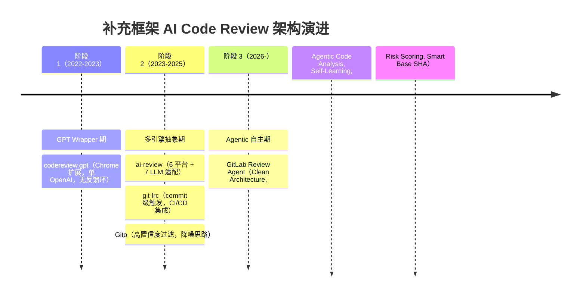

# 补充框架（Supplementary Frameworks）

## 目录

- [研究深度](#研究深度)
- [概述](#概述)
  - [本质与表现形式](#本质与表现形式)
  - [本 primitive 与前述 6 个 primitive 的边界](#本-primitive-与前述-6-个-primitive-的边界)
- [关键术语](#关键术语)
- [实体分类](#实体分类)
- [图表清单](#图表清单)
- [演进路线图](#演进路线图)
- [分析正文](#分析正文)
  - [阶段划分依据](#阶段划分依据)
  - [阶段 1：GPT Wrapper 期（2022-2023）](#阶段-1gpt-wrapper-期2022-2023)
  - [阶段 2：多引擎抽象期（2023-2025）](#阶段-2多引擎抽象期2023-2025)
  - [阶段 3：Agentic 自主期（2026-）](#阶段-3agentic-自主期2026-)
  - [三阶段架构特征对比](#三阶段架构特征对比)
  - [共性趋势总结](#共性趋势总结)
  - [区块链/智能合约场景覆盖](#区块链智能合约场景覆盖)
- [设计取舍](#设计取舍)
- [边界与前提](#边界与前提)
  - [能力归属](#能力归属)
  - [不能解决的问题](#不能解决的问题)
  - [Live / Planned / Promotional 状态](#live--planned--promotional-状态)
- [相关对象关系](#相关对象关系)
- [结论](#结论)
- [待确认问题](#待确认问题)
- [参考资料](#参考资料)

## 研究深度

- **深度等级**: focused（GitLab Review Agent 和 codereview.gpt 源码级验证）
- **覆盖范围**: GitLab Review Agent（antlss/gitlab-review-agent）与 codereview.gpt（sturdy-dev/codereview.gpt）进行 L2 源码级分析；ai-review、git-lrc、Gito 进行 L1 README 与 L3 GitHub API 基础信息覆盖
- **证据等级**: 核心 claim 基于 L1（README）与 L2（源码）验证，趋势推断标注为 L4/low confidence

## 概述

补充框架集合（Supplementary Frameworks）是 AI Code Review 领域中，**不属于前述 6 个独立 primitive 所覆盖的主流项目**（AsyncReview、ChatGPT CodeReview、CodeRabbit、Open Code Review Framework、Qodo Merge、RoboRev）的其余工具/框架的集合 [L4-SRC-014]。这些项目因 star 规模、架构同质性、停滞状态或生态位特定等原因，不足以各自独立成 primitive，但 collectively 代表了一个值得分析的技术谱系 [L4-plan]。

本 primitive 的核心价值不是逐一深度覆盖每个工具的机制（这是各自独立 primitive 的职责），而是回答：**这些"不够大、不够独立"的工具作为一个群体，经历了怎样的架构模式跃迁？它们填补了主流工具覆盖不到的哪些生态位？**

### 本质与表现形式

| 维度 | 说明 |
|------|------|
| 它是什么 | 不满足独立 primitive 条件的 AI Code Review 工具/框架的集合，按共性趋势而非单一项目分析 |
| 表现形式 | 各工具的 GitHub 仓库（README + 源码）+ 基线 artifact（既有研究作为 L4 参考） |
| 类比理解 | 类似于"长尾生态分析"——不是研究头部 6 个明星产品，而是研究长尾中代表不同架构模式的样本 |
| 在模型中的位置 | 属于 ai-code-review domain 的 primitive，与前述 6 个 primitive 共同构成该 domain 的完整覆盖 |

### 本 primitive 与前述 6 个 primitive 的边界

**划分原则** [L4-plan]：

| 纳入本 primitive 的条件 | 排除（归属其他 primitive 或不纳入） |
|------------------------|-----------------------------------|
| star 规模 < 1000，不足以支撑独立 primitive | 已被前述 6 个 primitive 之一覆盖 |
| 架构模式与前述 primitive 高度同质，差异不足以独立成章 | 不属于 AI Code Review 领域 |
| 项目已停滞或处于极早期，缺乏持续演进证据 | — |
| 代表特定生态位而非主流架构范式 | — |

**纳入工具清单** [L4-plan, L1-SRC-001/004/006/008/010]：

| 工具 | 仓库 | 生态位 | 不独立原因 |
|------|------|--------|-----------|
| GitLab Review Agent | antlss/gitlab-review-agent | GitLab 深度集成 + Agentic 架构 | 新项目（2026-03），star 规模小但架构有代表性 |
| codereview.gpt | sturdy-dev/codereview.gpt | 零部署轻量（Chrome 扩展） | 已停滞（2024-08 后无更新），代表已淘汰模式 |
| ai-review | Nikita-Filonov/ai-review | 多平台通用 | star 规模中等，架构与主流工具同质 |
| git-lrc | HexmosTech/git-lrc | Commit 级别触发 | 架构简单，不足以独立成 primitive |
| Gito | Nayjest/Gito | 高置信度过滤 | star 规模小，功能单一 |

## 关键术语

| 术语 | 定义 | 在本题中的作用 |
|------|------|---------------|
| GPT Wrapper | 直接调用 OpenAI API、无额外架构抽象的极简工具模式 | 定义阶段 1 的核心架构特征，是演进分析的起点 |
| Agentic Code Review | 将 review 过程分解为多个自主 Agent（reader、analyst、replier 等），具备代码库感知和工具调用能力 | 定义阶段 3 的架构跃迁目标，是演进分析的当前终点 |
| Self-Learning Feedback Loop | 系统通过历史 review 反馈（accepted/rejected/developer reply）自动提取规则、更新 prompt 的机制 | GitLab Review Agent 的核心差异化能力，代表从"一次性审查"到"持续进化"的范式变化 |
| Commit-Triggered Review | 在 commit 级别（而非 PR/MR 级别）触发 AI review 的模式 | git-lrc 的独特生态位，代表 CI/CD 流水线集成的早期拦截思路 |
| Confidence Filtering | 通过置信度评分机制，仅将高影响、高置信度的 issue 推送给开发者，减少 AI review 噪音 | Gito 的独特生态位，代表"少而精"而非"全量审查"的思路 |
| Clean Architecture | 按领域层（core）、基础设施层（pkg/infra）、接口层（cmd/delivery）分层的架构模式 | GitLab Review Agent 的架构基础，支撑其可扩展性 |
| BalancedClient | 在同一 LLM provider 内通过 least-connections 策略在多个 API Key 间均衡负载的客户端 | GitLab Review Agent 的可靠性机制，但仅在同 provider 内均衡 |

## 实体分类

为明确后续分析中各概念的分类与归属，先补一张实体分类表：

| 实体 | 类型 | 控制方 | 是否跨信任边界 | 主要职责 | 应落入哪类图 |
|------|------|--------|----------------|----------|--------------|
| GitLab Review Agent | external system | 第三方开发者 | 是（与 GitLab 平台） | Agentic review、self-learning | 演进路线图（阶段代表） |
| codereview.gpt | external system | 第三方开发者 | 是（与 GitHub/GitLab Web UI） | DOM 读取 + OpenAI 调用 | 演进路线图（阶段代表） |
| ai-review | external system | 第三方开发者 | 是（与多平台 API） | 多平台多 LLM 适配 | 演进路线图（阶段代表） |
| git-lrc | external system | 第三方开发者 | 是（与 Git CLI/CI） | commit 级触发 review | 演进路线图（阶段代表） |
| Gito | external system | 第三方开发者 | 是（与 GitHub API） | 高置信度 issue 过滤 | 演进路线图（阶段代表） |
| LLM Provider（OpenAI/Claude/Gemini） | external system | 第三方服务商 | 是 | 提供代码理解与生成能力 | 演进路线图（作为依赖） |
| Git Platform（GitHub/GitLab/...） | external system | 第三方平台 | 是 | 提供代码仓库、PR/MR、webhook | 演进路线图（作为依赖） |
| Review Trigger Mechanism | component | 各工具内部 | 否 | 决定何时启动 review（label/commit/PR event） | 阶段架构特征表 |
| Review Output Channel | component | 各工具内部 | 否 | 决定 review 结果如何呈现（popup/PR comment/CLI） | 阶段架构特征表 |
| Feedback Loop | component | 各工具内部 | 否 | 决定是否支持历史反馈学习 | 阶段架构特征表 |

**说明**：本 primitive 作为"补充集合"分析，不涉及单一角色内部的组件分解（各工具的内部组件分析留到各自独立 primitive 中展开）。因此不需要角色与信任边界图、角色内部组件图、跨角色流程图。分析重点落在**演进路线图**和**阶段架构特征对比表**上。

## 图表清单

| 图/表名 | 要回答的问题 | 是否必须 | 采用格式 | 为什么需要/可省略 |
|------|--------------|----------|----------|------------------|
| 演进路线图 | 补充框架整体经历了几个架构阶段？各阶段的代表工具是什么？ | 必须 | Mermaid timeline | 模板强制要求演进类分析包含路线图 |
| 阶段架构特征对比表 | 各阶段在触发方式、LLM 支持、反馈环、输出渠道等维度有何差异？ | 必须 | Markdown 表格 | 替代逐一罗列，按共性趋势组织 |
| 代表性工具简析表 | 每个纳入工具的一句话定位与关键属性 | 必须 | Markdown 表格 | 确保每个工具在集合中位置清晰 |
| 角色与信任边界图 | 系统中有哪些独立控制方？ | 可省略 | — | 各工具控制方相同（第三方开发者），无 materially 不同的角色族 |
| 角色内部组件图 | 各工具内部组件结构 | 可省略 | — | 各工具内部结构差异已超出本 primitive 覆盖范围，留到各自独立 primitive |
| 跨角色核心流程图 | 跨工具交互流程 | 可省略 | — | 工具之间无直接交互，不构成协议级消息流转 |
| 状态转换图 | 各工具的内部状态机 | 可省略 | — | 无统一的命名状态/epoch/timeout 转换机制 |

## 演进路线图

为理解补充框架整体的架构模式跃迁，下图展示了从 2022 年至今的三阶段演进脉络。阶段划分依据是**架构模式变化**（而非版本号或时间窗口）。

## 分析正文

### 阶段划分依据

本 primitive 按**架构模式变化**将补充框架的演进划分为三个阶段，而非按版本号或时间窗口机械切分。每个阶段的跃迁标志着一个根本性的设计取舍变化：

| 阶段 | 架构模式 | 跃迁标志 | 代表工具 |
|------|----------|----------|----------|
| 阶段 1 | GPT Wrapper | 直接调用单 LLM，无额外抽象 | codereview.gpt |
| 阶段 2 | 多引擎抽象 | 抽象出 LLM provider 层和平台适配层 | ai-review, git-lrc, Gito |
| 阶段 3 | Agentic 自主 | 引入多 Agent 协作、self-learning、代码库感知 | GitLab Review Agent |

---

### 阶段 1：GPT Wrapper 期（2022-2023）——"能跑就行"

**阶段总述**：

这一阶段的核心技术思考是"最小可用"——用最少的基础设施将 ChatGPT/ GPT-4 的代码理解能力引入 code review 场景。工具通常以浏览器扩展或极简脚本形式存在，直接在用户端完成 DOM 读取和 LLM 调用，不经过服务端中转。架构上没有抽象层：LLM provider 固定为 OpenAI，平台适配硬编码为 GitHub/GitLab 的 Web UI，review 结果仅在本地展示，不形成持久化反馈。

**新增的架构能力**：
- **零部署体验**：用户安装 Chrome 扩展即可使用，无需自建服务或配置 CI/CD [L1-SRC-004]
- **DOM 级 diff 读取**：通过注入脚本读取 PR/MR 页面的 diff 内容，使用 `parse-diff` npm 包提取变更 [L2-SRC-003]
- **用户自带 API Key**：LLM 调用成本由用户承担，工具本身不持有 billing 关系 [L1-SRC-004]

**被淘汰/抛弃的模式**（从后续阶段视角回看）：
- **单 LLM 锁定**：仅使用 `chatgpt` npm 包调用 OpenAI，无多 provider 适配 [L2-SRC-003]
- **无反馈环**：review 结果仅在 popup 窗口展示，不发布到 PR/MR，也不收集 accepted/rejected 信号 [L1-SRC-004, L2-SRC-003]
- **无代码库上下文**：仅能看到页面渲染的 diff 内容，无法读取项目其他文件 [L1-SRC-004]
- **无持久化**：每次 review 独立执行，无历史状态、无规则积累 [L1-SRC-004]

**阶段特征总结**：

| 维度 | 阶段 1 特征 |
|------|------------|
| 触发方式 | 用户手动点击扩展按钮 |
| LLM 支持 | 仅 OpenAI（GPT-4） |
| 平台支持 | GitHub PR / GitLab MR（通过 DOM 检测） |
| 代码库感知 | 无，仅能看到页面 diff |
| 反馈环 | 无 |
| 输出渠道 | 仅 popup 窗口，不发布到 PR/MR |
| 部署模式 | Chrome 扩展，零服务端 |
| 代表项目状态 | codereview.gpt：~607 stars，2024-08 后停滞 [L3-SRC-016] |

**代表了什么技术思考**：

阶段 1 证明了"AI code review 有需求"，但它的架构局限性也清晰可见：DOM 读取脆弱（页面结构一变就失效）、单 LLM 依赖风险高、无反馈导致质量无法提升。这些局限性直接催生了阶段 2 的多引擎抽象需求。

---

### 阶段 2：多引擎抽象期（2023-2025）——"适配一切"

**阶段总述**：

阶段 2 的核心技术思考从"能跑就行"转向"适配一切"——抽象出 LLM provider 层和代码托管平台适配层，使得同一套 review 逻辑可以在不同平台和不同 LLM 之间切换。这一阶段的工具通常是自托管的 CLI 服务或脚本，需要用户自行部署和配置 LLM API Key，但获得了平台无关性和 LLM 无关性。同时，在触发模式上出现了分化：有的延续 PR/MR 级别触发（ai-review），有的下沉到 commit 级别触发（git-lrc），还有的引入了置信度过滤（Gito）。

**新增的架构能力**：
- **多 LLM 抽象**：同一工具支持 OpenAI、Claude、Gemini、Ollama、Bedrock、OpenRouter、Azure 等多 provider [L1-SRC-006]
- **多平台适配**：通过 API 而非 DOM 与代码托管平台交互，支持 GitHub、GitLab、Bitbucket、Azure DevOps、Gitea 等 [L1-SRC-006]
- **CI/CD 集成**：以 CLI 或 GitHub Action 形式嵌入流水线，可在 commit 级别触发 [L1-SRC-008]
- **自托管**：用户自行部署，不依赖第三方 SaaS，数据不出私有环境 [L1-SRC-006, L1-SRC-008, L1-SRC-010]
- **降噪思路**：通过置信度评分，仅推送高影响 issue，减少 AI review 的误报噪音 [L1-SRC-010]

**被淘汰/抛弃的模式**（从阶段 3 视角回看）：
- **仍无 feedback loop**：虽然多了平台/LLM 适配，但仍未引入历史反馈学习机制 [L1-SRC-006, L1-SRC-008, L1-SRC-010]
- **仍无代码库级感知**：review 范围仍局限于 diff 内容，无法跨文件读取上下文 [L1-SRC-006]
- **缺乏智能触发**：触发条件仍为固定规则（PR event / commit push），无风险感知或 label-based 选择性触发（git-lrc 除外，它在 commit 粒度上更细） [L1-SRC-008]

**阶段 2 内部的生态位分化**：

| 工具 | 生态位 | 触发粒度 | 差异化特征 |
|------|--------|----------|-----------|
| ai-review | 多平台通用 | PR/MR 级 | 最广的平台覆盖（6 平台）和 LLM 覆盖（7 provider） [L1-SRC-006] |
| git-lrc | Commit 级触发 | Commit 级 | 在 CI/CD 流水线上最早拦截，适合 pre-merge 检查 [L1-SRC-008] |
| Gito | 高置信度过滤 | PR 级 | 减少 AI review 噪音，只推高影响 issue [L1-SRC-010] |

**代表了什么技术思考**：

阶段 2 认识到"单一平台和单一 LLM 的绑定是脆弱的设计"。通过抽象出适配层，工具获得了更强的生存能力——某个 LLM 降价或某个平台 API 变化不会直接导致工具失效。但这一阶段仍未突破"diff 级别审查"的上限，也没有引入学习机制，review 质量的上限仍然完全取决于 LLM 本身的代码理解能力。

---

### 阶段 3：Agentic 自主期（2026-）——"理解整个仓库"

**阶段总述**：

阶段 3 的核心技术思考发生了根本性跃迁：从"读懂 diff"转向"理解整个代码库"。以 GitLab Review Agent 为代表，review 不再是对 diff 文本的 LLM 调用，而是由多个 Agent 协作完成的分析过程：Agent 可以读取仓库中的任意文件、搜索代码、执行 multi-file diff、基于历史反馈自动更新规则。同时引入了风险评分、智能增量计算（Smart Base SHA）、自动解决重叠线程等运维级能力。

**新增的架构能力**：
- **Agentic Code Analysis**：Agent 具备 `read_file`、`search_code`、`multi_diff` 等工具调用能力，可感知完整代码库上下文 [L1-SRC-001]
- **Self-Learning Feedback Loop**：通过 Consolidator 后台 Cron 定期分析历史 review 的 accepted/rejected 信号和开发者回复，自动提取规则并更新 custom prompt rules [L2-SRC-003]
- **Risk Scoring + Truncation**：对 MR 进行风险评分，超过阈值（如 >150 files）时自动截断处理范围 [L1-SRC-001]
- **Smart Base SHA**：增量计算最优 base SHA，避免不必要的 diff 重算 [L1-SRC-001]
- **Auto-resolve Overlapping Threads**：当同一代码行有多个 AI review thread 时自动解决冲突 [L1-SRC-001]
- **Multi-LLM + BalancedClient**：支持 OpenAI GPT-4o、Anthropic Claude 3.7、Google Gemini 2.0，并在同一 provider 内通过 least-connections 策略在多个 API Key 间均衡 [L2-SRC-003]
- **Multi-Storage**：支持 file/sqlite/postgres 三种存储 driver [L2-SRC-003]
- **Clean Architecture**：按 core（review/feedback/agents）、pkg（llm/git/store/tools）、cmd（server/cli）分层 [L2-SRC-003]

**被抛弃的阶段 2 局限**：
- 突破了"仅 diff 级别审查"的上限，Agent 可以主动搜索和读取代码库任意文件
- 突破了"无反馈环"的局限，Self-Learning Consolidator 使 review 质量随使用次数提升
- 突破了"无风险感知"的局限，Risk Scoring 使系统能根据变更规模自动调整策略

**代表了什么技术思考**：

阶段 3 认识到"高质量的 code review 不是一次性 LLM 调用，而是一个需要持久状态、多步推理和持续学习的自主过程"。Clean Architecture 的选择意味着项目为长期演进预留了可扩展性，Self-Learning 的选择意味着项目试图突破"LLM 能力 = review 质量上限"的硬约束。但这一阶段仍处于早期（2026-03 创建，~6 stars [L3-SRC-015]），多个关键功能标注为 "Unreleased"（Agentic Code Analysis、Replier Agent、Risk Scoring 等），实际效果尚待验证。

---

### 三阶段架构特征对比

下表从共性维度对比三个阶段的架构特征差异：

| 维度 | 阶段 1：GPT Wrapper | 阶段 2：多引擎抽象 | 阶段 3：Agentic 自主 |
|------|-------------------|-------------------|---------------------|
| **触发方式** | 手动点击扩展按钮 | PR event / commit push（固定规则） | Label-based webhook（默认 `ai-review`） [L1-SRC-001] |
| **LLM 支持** | 仅 OpenAI | 多 provider（7+） [L1-SRC-006] | 多 provider（3 个主流）+ 同 provider 内 key 均衡 [L2-SRC-003] |
| **平台支持** | 通过 DOM 检测（GitHub/GitLab） | API 级多平台（6 平台） [L1-SRC-006] | 仅 GitLab（深度集成） [L1-SRC-001] |
| **代码库感知** | 无，仅页面 diff | 无，仅 diff 内容 | 有，Agent 可 read_file/search_code [L1-SRC-001] |
| **反馈环** | 无 | 无 | Self-Learning Consolidator [L2-SRC-003] |
| **输出渠道** | Popup 窗口 | PR/MR comment | PR/MR comment + 重叠 thread 自动解决 [L1-SRC-001] |
| **部署模式** | Chrome 扩展 | 自托管 CLI/服务 | 自托管 Go 服务端（Clean Architecture） [L2-SRC-003] |
| **持久化** | 无 | 无 | file/sqlite/postgres [L2-SRC-003] |
| **运维能力** | 无 | 无 | Risk Scoring、Smart Base SHA、Truncation [L1-SRC-001] |
| **架构复杂度** | 极低（单文件脚本） | 中（多 provider 适配） | 高（多 Agent + Consolidator + Balancer + Store） [L2-SRC-003] |

### 共性趋势总结

从三阶段演进中可以提炼出以下共性趋势：

**趋势 1：从"浏览器端"向"服务端"迁移**
阶段 1 的 Chrome 扩展模式已被阶段 2/3 的自托管服务端取代。DOM 读取的脆弱性和 popup 展示的局限性（不持久化、不发布到 PR）使这一模式逐渐被淘汰 [L3-SRC-016, L4-SRC-014]。codereview.gpt 的停滞（2024-08 后无更新，~20 个月，以 2026-04 为基准计算 [L3-SRC-016]）是这一趋势的标志性证据 [L3-SRC-016]。

**趋势 2：从"单 LLM 绑定"向"多 LLM 抽象"**
阶段 1 的单 OpenAI 依赖是致命弱点。阶段 2 和阶段 3 都通过抽象 LLM provider 层实现了多引擎支持，降低了单一 LLM 供应商风险 [L1-SRC-006, L1-SRC-001]。

**趋势 3：从"一次性审查"向"持续学习"**
阶段 1 和阶段 2 的 review 质量上限完全取决于 LLM 本身。阶段 3 通过 Self-Learning Consolidator 打破了这一约束，使系统能通过历史反馈自动优化 review 规则 [L2-SRC-003]。

**趋势 4：从"diff 级"向"仓库级"感知**
阶段 1/2 仅能看到 diff 内容，无法理解变更的上下文。阶段 3 的 Agent 具备 `read_file` 和 `search_code` 能力，可以跨文件理解代码 [L1-SRC-001]。

**趋势 5：生态位分化加速**
阶段 2 内部出现了明显的生态位分化：ai-review 走多平台通用路线，git-lrc 走 commit 级 CI/CD 集成路线，Gito 走高置信度过滤路线。这种分化表明 AI code review 领域正在从"一个工具做一切"走向"不同场景用不同工具" [L1-SRC-006, L1-SRC-008, L1-SRC-010]。

### 区块链/智能合约场景覆盖

既有的基线 artifact 推断"补充框架对 Solidity/Rust 智能合约场景无专门覆盖" [L4-SRC-014]。本次搜索验证（SRC-012/013）受限于当前会话无 MCP 工具，无法在线重新执行 GitHub Search [L4-source-review]。基于基线结论，该推断的置信度为 **low**，标注为 evidence gap GAP-001 [L4-source-review]。

如后续搜索验证发现中型规模的智能合约专项 AI review 项目出现，需重新评估纳入清单和结论。

## 设计取舍

| 取舍维度 | 选择 | 放弃 | 为什么这样选 | 代价 |
|------|------|------|-------------|------|
| **触发粒度** | Label-based（阶段 3）/ Commit 级（阶段 2 的 git-lrc） | 全量自动触发 | 避免对每个 commit/PR 都触发 review 造成噪音和成本浪费 [L1-SRC-001, L1-SRC-008] | 需要人工介入（打 label 或配置 CI） |
| **LLM 均衡策略** | 同 provider 内 least-connections（阶段 3） | 跨 provider 智能路由 | 实现简单，避免跨 provider 的 prompt 兼容性问题和速率限制差异 [L2-SRC-003] | 无法在 provider 级别做故障转移 |
| **反馈学习方式** | Consolidator 后台 Cron 定期批量处理（阶段 3） | 实时学习 | 降低 LLM 调用频率，批量处理更经济 [L2-SRC-003] | 规则更新有延迟（取决于 minCount/minAgeDays 阈值） |
| **代码库获取方式** | Shallow clone 目标分支（阶段 3） | 完整 clone | 节省存储和带宽，shallow clone 已足够 Agent 读取上下文 [L2-SRC-003] | 无法访问完整 git 历史 |
| **部署模式** | 自托管（阶段 2/3） | SaaS | 避免代码数据外流到第三方，适合企业场景 [L1-SRC-006, L1-SRC-001] | 用户需自行维护基础设施 |
| **存储方案** | file/sqlite/postgres 可切换（阶段 3） | 仅单一存储 | 适配不同规模场景：小规模用 file，中规模用 sqlite，大规模用 postgres [L2-SRC-003] | 增加驱动维护成本 |

## 边界与前提

### 能力归属

| 能力 | 由谁承担 | 依赖条件 | 证据等级 |
|------|----------|----------|----------|
| 代码 diff 理解 | LLM provider | 用户配置有效的 API Key | L1 [L1-SRC-001] |
| Review 规则自动优化 | GitLab Review Agent Consolidator | 有足够的历史 feedback 数据（minCount/minAgeDays 阈值满足） | L2 [L2-SRC-003] |
| 多 LLM 均衡 | GitLab Review Agent BalancedClient | 同一 provider 内有多个 API Key | L2 [L2-SRC-003] |
| 代码库上下文感知 | GitLab Review Agent Agent | 能成功 shallow clone 目标分支 | L1 [L1-SRC-001] |
| 降噪（高置信度过滤） | Gito | LLM 输出包含置信度/影响度评分 | L1 [L1-SRC-010] |

### 不能解决的问题

| 不能解决的问题 | 原因 |
|----------------|------|
| 智能合约专项 review（Solidity/Rust） | 所有纳入工具均未声明对智能合约语言或安全模式的专门支持 [L4-SRC-014] |
| 跨 provider LLM 智能路由 | BalancedClient 仅在同 provider 内均衡 [L2-SRC-003] |
| 实时 feedback 学习 | Consolidator 为后台 Cron，有延迟 [L2-SRC-003] |
| 替代专业安全审计 | AI review 侧重代码逻辑和风格，不等于形式化验证或安全审计 |

### Live / Planned / Promotional 状态

| 工具 | 功能 | 状态 | 依据 |
|------|------|------|------|
| codereview.gpt | 全部功能 | Live（已停滞） | 最后更新 2024-08，~20 个月无新 commit（以 2026-04 为基准） [L3-SRC-016] |
| ai-review | 多平台 + 多 LLM 支持 | Live | 2026-04 仍活跃 [L3-SRC-017] |
| git-lrc | Commit 级触发 | Live | 2026-04 仍活跃 [L3-SRC-018] |
| Gito | 高置信度过滤 | Live | 2026-04 仍活跃 [L3-SRC-019] |
| GitLab Review Agent | 基础 review + multi-LLM | Live | 已有 released 版本 [L1-SRC-002] |
| GitLab Review Agent | Agentic Code Analysis | Unreleased（Planned） | CHANGELOG 标注为 Unreleased [L1-SRC-002] |
| GitLab Review Agent | Replier Agent | Unreleased（Planned） | CHANGELOG 标注为 Unreleased [L1-SRC-002] |
| GitLab Review Agent | Risk Scoring | Unreleased（Planned） | CHANGELOG 标注为 Unreleased [L1-SRC-002] |
| GitLab Review Agent | Auto-resolve | Unreleased（Planned） | CHANGELOG 标注为 Unreleased [L1-SRC-002] |
| GitLab Review Agent | Multi-Storage | Unreleased（Planned） | CHANGELOG 标注为 Unreleased [L1-SRC-002] |
| GitLab Review Agent | Interactive CLI | Unreleased（Planned） | CHANGELOG 标注为 Unreleased [L1-SRC-002] |

## 相关对象关系

本 primitive 作为补充集合，与前述 6 个 primitive 的关系定位如下：

| 前述 Primitive | 与本 primitive 的关系 | 差异点 |
|----------------|----------------------|--------|
| asyncreview-evolution | 无重叠 | AsyncReview 是独立项目，不在补充清单中 |
| chatgpt-codereview-framework | 无重叠 | ChatGPT CodeReview 是独立项目 |
| coderabbit-framework | 无重叠 | CodeRabbit 是 SaaS 级主流工具，不在补充清单中 |
| open-code-review-framework | 无重叠 | 独立的开源框架项目 |
| qodo-merge-evolution | 无重叠 | Qodo Merge 是商业级工具 |
| roborev-evolution | 无重叠 | RoboRev 是独立项目 |

补充框架与前述 6 个 primitive 的共同生态关系：**主流工具覆盖头部需求（大规模、SaaS、企业级），补充框架覆盖长尾需求（特定平台深度集成、特定触发模式、特定降噪策略）**。

## 结论

### 【L2 证据 - 已确认】

- GitLab Review Agent 采用 Clean Architecture（Go 服务端），包含 core（review/feedback/agents）、pkg（llm/git/store/tools）、cmd（server/cli）三层 [L2-SRC-003]
- Self-Learning Consolidator 通过 `minCount`/`minAgeDays` 阈值批量处理历史 feedback，提取 Rules 更新为 custom prompt rules [L2-SRC-003]
- BalancedClient 仅在同一 provider 内通过 least-connections 策略在多个 API Key 间均衡，不跨 provider [L2-SRC-003]
- codereview.gpt 仅支持 OpenAI，通过 Chrome 扩展 DOM 读取 diff，review 结果仅在 popup 展示 [L1-SRC-004, L2-SRC-003]
- codereview.gpt 自 2024-08 后无更新（~20 个月停滞，以 2026-04 为基准计算），代表 GPT Wrapper 模式已被淘汰 [L3-SRC-016]

### 【L3 证据 - 尚需在线验证】

- 各工具的最新活跃状态（stars、最后 commit 时间）基于基线 artifact 数据，需 GitHub API 重新验证 [L3-SRC-015~019]
- GitLab Review Agent 的 Unreleased 功能是否已有新版本发布，需在线检查 CHANGELOG [L1-SRC-002]
- ai-review、git-lrc、Gito 的源码级实现细节（多平台适配方式、commit trigger 实现、置信度过滤算法）基于 README，需源码验证 [L1-SRC-006/008/010]

### 【L4 推断 - 低置信度】

- 补充框架对智能合约场景（Solidity/Rust）无专门覆盖 [L4-SRC-014]，需 GitHub Search 重新验证（GAP-001）
- 轻量 Chrome 扩展模式正在被自托管服务端替代 [L3-SRC-016, L4-SRC-014]
- 平台原生 AI 功能（GitLab Duo、GitHub Copilot）可能吸收部分补充框架生态位 [L4-SRC-014]

## 待确认问题

| 问题 | 状态 | 原因 |
|------|------|------|
| GAP-001：智能合约 AI Review 项目是否已有中型规模项目出现 | 未解决 | 当前会话无 MCP 工具，无法执行 SRC-012/013 GitHub Search [L4-source-review] |
| GAP-002：各工具最新活跃状态（stars、最后 commit） | 未解决 | 无法调用 GitHub API（SRC-015~019） [L4-source-review] |
| GAP-003：GitLab Review Agent Unreleased 功能是否已发布新版本 | 未解决 | 无法在线访问 CHANGELOG.md [L4-source-review] |
| GAP-004：ai-review、git-lrc、Gito 源码级验证 | 未解决 | 无法在线访问仓库源码 [L4-source-review] |
| GAP-005：GitLab Duo / GitHub Copilot 最新 AI 功能是否吸收了补充框架生态位 | 未解决 | 需在线搜索平台官方文档 [L4-source-review] |
| Self-Learning 的实际效果是否有量化数据支撑 | 未解决 | 项目较新（2026-03 创建），尚无足够使用数据 [L4-SRC-014] |

## 参考资料

| 来源 | 说明 | 验证状态 |
|------|------|----------|
| [SRC-001] GitLab Review Agent README | 核心架构与能力列表 [L1] | [未验证] 需要在线访问 |
| [SRC-002] GitLab Review Agent CHANGELOG | 版本演进与 Unreleased 功能状态 [L2] | [未验证] 需要在线访问 |
| [SRC-003] GitLab Review Agent 源码结构 | Clean Architecture、Consolidator、BalancedClient [L2] | [未验证] 基线已验证，需 refresh |
| [SRC-004] codereview.gpt README | Chrome 扩展架构 [L1] | [未验证] 需要在线访问 |
| [SRC-005] codereview.gpt 源码 | popup.js 实现 [L2] | [未验证] 基线已验证，需 refresh |
| [SRC-006] ai-review README | 多平台 + 多 LLM 支持列表 [L1] | [未验证] 需要在线访问 |
| [SRC-007] ai-review 源码 | 多平台实现细节 [L2] | [未验证] 需在线访问 |
| [SRC-008] git-lrc README | Commit 级触发模式 [L1] | [未验证] 需要在线访问 |
| [SRC-009] git-lrc 源码 | Commit trigger 实现 [L2] | [未验证] 需在线访问 |
| [SRC-010] Gito README | 高置信度过滤机制 [L1] | [未验证] 需要在线访问 |
| [SRC-011] Gito 源码 | Confidence filtering 实现 [L2] | [未验证] 需在线访问 |
| [SRC-012] GitHub Search "solidity ai code review" | 智能合约专项项目验证 [L3] | [未验证] 需要在线搜索 |
| [SRC-013] GitHub Search "smart contract ai review" | 智能合约专项项目交叉验证 [L3] | [未验证] 需要在线搜索 |
| [SRC-014] 基线 artifact | 既有研究作为 L4 参考 [L4] | [已验证] 本地存在且已读 |
| [SRC-015~019] GitHub API 各仓库 metadata | Stars、创建时间、最后活跃时间 [L3] | [未验证] 需要在线调用 |
