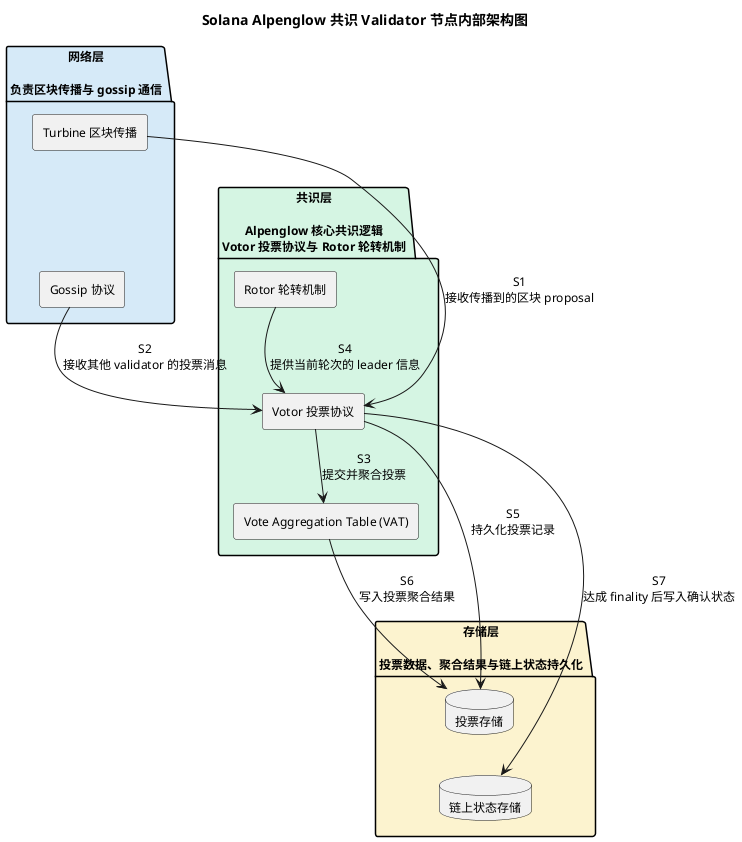
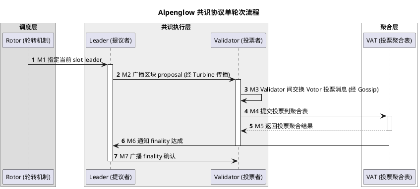

# Solana Alpenglow 共识协议

## 目录

- [摘要](#摘要)
- [术语表](#术语表)
- [信任边界](#信任边界)
- [组件结构](#组件结构)
- [核心流程](#核心流程)
- [状态转换](#状态转换)
- [共识速度优化原理](#共识速度优化原理)
- [历史演进](#历史演进)
- [设计取舍](#设计取舍)
  - [Off-chain 投票 vs 链上投票](#off-chain-投票-vs-链上投票)
  - [PoH 移除 vs PoH 保留](#poh-移除-vs-poh-保留)
  - [20+20 Resilience 阈值](#2020-resilience-阈值)
- [能力边界](#能力边界)
- [部署状态](#部署状态)
- [待确认问题](#待确认问题)
- [参考资料](#参考资料)

## 摘要

Alpenglow 是 Solana 的新一代共识协议，由 Anza（原 Solana Labs）提出，通过 SIMD-0326 正式规范化 [L1: simd-0326]。它以 Votor 投票协议和 Rotor 轮转机制为核心，**替换了** Solana 原有的 Proof of History（PoH）时钟 + Tower BFT 组合 [L1: anza-alpenglow-blog]。Alpenglow 的设计目标是将交易中位 finality 时间缩短至 100-150ms，同时保持 20% 拜占庭容错 + 20% 离线容错（20+20 resilience）[L1: simd-0326]。

本 primitive 聚焦 Alpenglow 的协议机制、组件架构、共识流程和性能原理。

## 术语表

| 术语 | 定义 |
|---|---|
| Alpenglow | Solana 新一代共识协议，替换 PoH + Tower BFT |
| Votor | Alpenglow 核心投票协议，执行 off-chain 投票 |
| Rotor | Alpenglow 轮转机制，决定 leader 选择与调度 |
| VAT（Vote Aggregation Table） | 投票聚合表，收集、验证和聚合 validator 投票权重 |
| PoH（Proof of History） | Solana 原有可验证延迟函数时钟，已被 Alpenglow 替换 |
| Tower BFT | Solana 原有 BFT 投票机制，已被 Alpenglow 替换 |
| Turbine | Solana 区块传播协议，基于多播树 |
| Gossip | Solana P2P 消息广播网络 |
| Slot | Solana 时间槽，leader 生产区块的基本时间单位 |
| Finality | 交易不可逆确认 |
| 20+20 Resilience | 同时容忍 20% 拜占庭节点和 20% 离线节点 |
| SIMD | Solana Improvement Document，Alpenglow 通过 SIMD-0326 提案 |

## 信任边界

Alpenglow 共识网络按信任级别分为三层：

- **共识层（可信）**：Votor 投票协议、Rotor 轮转机制、VAT 投票聚合表。信任假设：拜占庭节点不超过 20%，离线节点不超过 20% [L1: simd-0326]。
- **网络层（不可信传输）**：Turbine（区块传播）+ Gossip（消息广播）。不保证消息顺序和送达，共识层需处理网络分区和消息丢失。
- **存储层（本地可信）**：投票存储 + 链上状态存储。仅当前 validator 节点可写。

外部边界：客户端实现（Agave / Firedancer）为协议无关；Token 质押/解质押和治理机制不在共识层处理范围内。

## 组件结构

Alpenglow 共识在 Validator 节点内部按三层组织：网络层、共识层和存储层 [L1: anza-alpenglow-blog]。

**三层职责**：

1. **网络层**：Turbine 负责将 leader 打包的区块通过多播树快速传播到全网 validator；Gossip 负责传播投票消息和共识通信。两层均不保证可靠传输。
2. **共识层**：Rotor 决定每 slot 的 leader 调度；Votor 是核心投票协议，接收区块 proposal 和投票消息后执行 off-chain 投票；VAT 聚合投票权重并验证是否达到 finality 阈值。
3. **存储层**：投票存储持久化 validator 的投票记录和聚合结果；链上状态存储在达成 finality 后写入最终确认状态。

## 核心流程

Alpenglow 的单轮次共识流程围绕 slot 调度展开，每个 slot 由一个 leader 提议区块，validator 集合通过 Votor 协议进行 off-chain 投票 [L1: simd-0326]。

**流程说明**：

1. **M1 - Leader 调度**：Rotor 根据质押权重和轮换算法决定当前 slot 的 leader validator。
2. **M2 - 区块传播**：Leader 打包区块 proposal，通过 Turbine 多播树广播到全网。
3. **M3 - Off-chain 投票交换**：Validator 收到 proposal 后，通过 Gossip 网络交换 Votor 投票消息。这是 off-chain 操作，是 Alpenglow 相比 Tower BFT 降低延迟的关键设计 [L1: anza-alpenglow-blog]。
4. **M4/M5 - 投票聚合**：Validator 将投票提交到 VAT，VAT 验证投票权重并返回聚合结果。聚合操作在链下完成 [L1: simd-0326]。
5. **M6 - Finality 通知**：当 VAT 确认投票权重达到 finality 阈值（20+20 resilience 条件满足），通知 leader。
6. **M7 - Finality 广播**：Leader 将 finality 确认广播到全网，validator 将确认状态写入链上存储。

## 状态转换

Alpenglow 的投票协议通过明确的投票状态转换来推进共识 [L1: simd-0326]。

| 状态 | 触发条件 | 转换目标 | 说明 |
|---|---|---|---|
| Idle | 收到新区块 proposal | PreVote | Validator 开始评估 proposal |
| PreVote | 验证 proposal 合法性 + 足够 PreVote 消息 | PreCommit | proposal 通过初步验证 |
| PreVote | proposal 验证失败或超时 | Nil | 拒绝当前 proposal |
| PreCommit | 收集到足够 PreCommit 消息 | Finalized | 区块达成 finality |
| PreCommit | 超时或投票不足 | Nil | 无法达成共识 |
| Finalized | 写入链上状态 | Idle | 等待下一 slot |
| Nil | 进入下一 slot | Idle | Rotor 选择新 leader |

**关键约束**：
- PreVote 阶段验证 proposal 的基本合法性（签名、parent hash、状态转换有效性等）。
- PreCommit 阶段要求投票权重达到 finality 阈值，在 20+20 resilience 条件下可保证安全性。
- Nil 状态表示当前 slot 无法达成共识，Rotor 选择新 leader 进入下一 slot。

## 共识速度优化原理

Alpenglow 相比原有 PoH + Tower BFT 组合的共识延迟优化来自三个核心设计决策 [L1: anza-alpenglow-blog]：

1. **Off-chain 投票**：Tower BFT 的投票通过链上交易执行，每个 validator 的投票都需写入链上。Alpenglow 将投票操作移到链下，通过 Gossip 网络直接交换投票消息，VAT 在链下完成聚合，避免了链上投票交易的确认延迟 [L1: simd-0326]。

2. **VAT 投票聚合**：通过 Vote Aggregation Table 在链下集中聚合投票权重，validator 不需要等待所有投票写入链上即可确认是否达到 finality 阈值，将 finality 决策时间从 Tower BFT 的多 slot 等待缩短到单 slot 内 [L1: anza-alpenglow-blog]。

3. **PoH 移除**：原有的 PoH 时钟需要验证器按序执行可验证延迟函数，引入额外计算开销。Alpenglow 不再依赖 PoH 作为时间源，而是通过 Rotor 的 slot 调度和 Votor 的投票同步来建立共识序 [L1: simd-0326]。

**性能目标**：Alpenglow 声明的中位 finality 时间为 150ms，在理想网络条件下可达 100ms [L1: simd-0326]。原有 PoH + Tower BFT 组合的 finality 时间通常在 12-15 秒（约 10-15 个 slot）级别。

## 历史演进

Alpenglow 不是对 PoH + Tower BFT 的渐进改进，而是共识架构模式的根本替换。

| 阶段 | 架构模式 | 时间源 | 投票机制 | 特征 |
|---|---|---|---|---|
| 阶段一：PoH + Tower BFT | 链上投票 + 可验证时钟 | PoH（可验证延迟函数） | Tower BFT（链上交易投票） | 多 slot 等待 finality，投票写入链上 |
| 阶段二：Alpenglow | Off-chain 投票 + 轮转调度 | Rotor slot 调度 | Votor（off-chain 投票 + VAT 聚合） | 单 slot 内 finality，投票不写链上 |

**阶段一（PoH + Tower BFT）**：PoH 提供可验证的全局时钟，Tower BFT 在 PoH 时间序上执行链上投票。Validator 的投票作为交易写入链上，需要等待多个 slot 才能累积足够的投票权重确认 finality [L1: solana-evm-svm-consensus]。

**阶段二（Alpenglow）**：移除 PoH 时钟，改用 Rotor 的 slot 调度作为时间基准；移除 Tower BFT 链上投票，改用 Votor 的 off-chain 投票 + VAT 聚合。投票消息通过 Gossip 网络传播，在链下完成聚合和 finality 决策 [L1: simd-0326]。

两个阶段的差异不仅是性能优化，而是共识架构模式的根本变化——从"链上时间序 + 链上投票"变为"slot 调度 + off-chain 投票聚合"。

## 设计取舍

### Off-chain 投票 vs 链上投票

**选择 Off-chain 投票的理由**：避免链上交易确认的额外延迟，实现单 slot 内 finality [L1: simd-0326]；减少链上状态写入的计算和存储开销；VAT 聚合可以在网络层快速完成。

**代价**：Off-chain 投票不直接受链上状态保护，需要额外机制确保投票消息的可靠性和防篡改 [`evidence-gap`：极端情况（如网络分区期间的投票消息一致性保障）的详细安全论证需要完整白皮书确认]。Validator 需要在本地维护投票状态，增加了本地状态复杂性。

### PoH 移除 vs PoH 保留

**选择移除 PoH 的理由**：PoH 的可验证延迟函数引入了额外计算开销；Rotor slot 调度足以提供共识所需的时间基准；移除 PoH 简化了共识路径 [L1: simd-0326]。

**代价**：失去了 PoH 提供的可验证全局时间序 [`uncertainty`：Alpenglow 移除 PoH 后，如何为需要历史时间证明的应用（如某些 DeFi 场景）提供替代方案，官方文档未明确]。

### 20+20 Resilience 阈值

Alpenglow 声称在 20% 拜占庭节点 + 20% 离线节点的条件下仍能保持安全性和活性 [L1: anza-alpenglow-blog]。20% 拜占庭阈值低于经典 BFT 的 33% 阈值，这可能反映了 off-chain 投票模型下安全论证的保守估计 [`uncertainty`：20+20 与经典 33% BFT 阈值之间的精确理论关系，需要完整的安全证明论文确认]。

## 能力边界

### 协议原生能力

- **快速 finality**：中位 100-150ms 交易中位 finality 时间 [L1: simd-0326]
- **20+20 容错**：同时容忍 20% 拜占庭节点和 20% 离线节点 [L1: anza-alpenglow-blog]
- **单 slot 共识**：正常网络条件下，一个 slot 内完成从 proposal 到 finality 的完整流程 [L1: simd-0326]
- **Off-chain 投票聚合**：通过 VAT 在链下完成投票聚合 [L1: simd-0326]

### 协议不提供的能力

- **不处理 Token 经济模型**：质押、解质押、奖励分配由共识层之外的模块处理 [L1: solana-evm-svm-consensus]
- **不处理治理机制**：协议升级、参数调整通过 SIMD 流程而非共识协议本身
- **不提供跨链互操作**：Alpenglow 仅负责 Solana 链内共识
- **不保证区块生产时间**：Turbine 和 Gossip 网络不保证消息送达时间，极端网络条件下 finality 可能延迟

### 失败条件

- **拜占庭节点超过 20%**：安全性不再保证，可能出现分叉或双重确认
- **离线节点超过 20%**：活性不再保证，协议可能无法达成 finality
- **网络分区**：单个分区内 validator 权重不足时，该分区无法独立达成 finality
- **Leader 连续掉线**：增加延迟但不破坏安全性

### 前提假设

- 验证器集合的质押权重分布已知且通过链上状态可验证
- Turbine 和 Gossip 网络在正常条件下能够在规定时间内传播消息
- Validator 本地时钟足够准确以识别 slot 边界
- 20+20 resilience 条件始终满足

### 与客户端实现的关系

Alpenglow 是协议层规范，与具体的验证器客户端实现无关。Agave（原 solana-labs/solana）和 Firedancer 都可以实现 Alpenglow 协议 [L1: anza-alpenglow-blog]。

## 部署状态

| 状态维度 | 当前信息 | 来源等级 |
|---|---|---|
| 提案状态 | SIMD-0326 已提交，白皮书 v1.0/v1.1 已发布 | L1 |
| 测试网部署 | 具体时间线未在公开来源中确认 [`evidence-gap`] | — |
| 主网部署 | 2025-2026 年期间规划，具体时间线未官方确认 [`uncertainty`] | — |
| 白皮书版本 | v1.0（初始）和 v1.1（更新）已发布 | L1 |

## 待确认问题

### UNC-001: Alpenglow 主网部署时间线

Alpenglow 在主网的具体部署时间线未在官方来源中明确确认。SIMD-0326 提案和 Anza 官方博客表明白皮书已发布，提案已进入社区讨论阶段，但主网激活的具体 slot 或日期尚未公布 [L1: simd-0326] [L1: anza-alpenglow-blog]。

**影响**：如部署时间线推迟，2025-2026 年窗口期的规划可能发生变化。

**追踪**：SIMD-0326 提案状态更新（forum.solana.com）、Anza 官方公告、Solana 主网升级公告。

### UNC-002: Off-chain 投票的安全论证完整性

Off-chain 投票模型在极端网络条件下的安全论证尚不完整。根据 SIMD-0326 [L1: simd-0326]，Alpenglow 在 20+20 resilience 条件下可以保证安全性。

**证据缺口**：网络分区期间投票消息一致性的详细安全论证；20+20 阈值与经典 BFT 33% 阈值的精确理论关系；完整的安全证明论文尚未公开。

**影响**：如安全论证在极端条件下存在不足，实际部署可能需要调整容错参数。

**追踪**：Alpenglow 完整白皮书发布、同行评审的安全分析论文。

## 参考资料

| 来源 | 说明 |
|---|---|
| [SIMD-0326](https://forum.solana.com/t/simd-0326-proposal-for-the-new-alpenglow-consensus-protocol/4236) | Solana 改进提案：Alpenglow 共识协议正式规范 |
| [Anza - Alpenglow Blog](https://www.anza.xyz/blog/alpenglow-a-new-consensus-for-solana) | Anza 官方技术博客：Alpenglow 新共识介绍 |
| [Solana - EVM vs SVM Consensus](https://solana.com/developers/evm-to-svm/consensus) | Solana 官方开发者文档：共识机制对比 |
