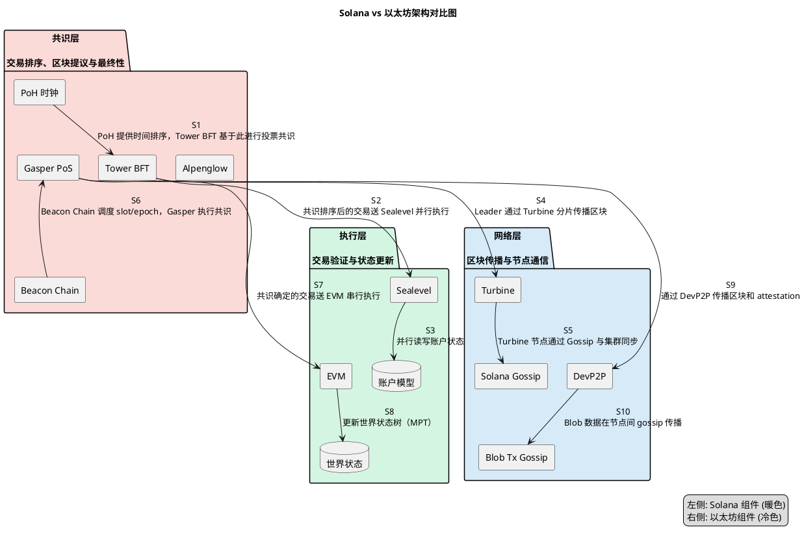
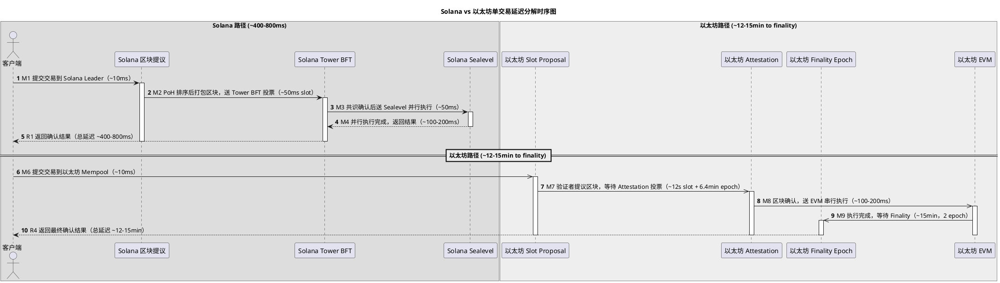

# Solana BFT 共识机制性能分析：Tower BFT + Alpenglow vs 以太坊 Gasper

## 目录

- [摘要](#摘要)
- [术语表](#术语表)
- [架构差异分析](#架构差异分析)
  - [Monolithic vs Modular 架构](#monolithic-vs-modular-架构)
  - [PoH 时钟优化共识路径](#poh-时钟优化共识路径)
  - [Sealevel 并行执行 vs EVM 串行执行](#sealevel-并行执行-vs-evm-串行执行)
  - [网络传播层对比](#网络传播层对比)
- [共识机制对比](#共识机制对比)
  - [Solana Tower BFT](#solana-tower-bft)
  - [Solana Alpenglow](#solana-alpenglow)
  - [以太坊 Gasper PoS](#以太坊-gasper-pos)
- [性能数据对比](#性能数据对比)
  - [共识延迟](#共识延迟)
  - [执行吞吐](#执行吞吐)
  - [端到端延迟分解](#端到端延迟分解)
  - [共识 vs 执行贡献比例](#共识-vs-执行贡献比例)
- [核心架构对比总结](#核心架构对比总结)
- [设计取舍](#设计取舍)
  - [性能 vs 去中心化](#性能-vs-去中心化)
  - [安全模型权衡](#安全模型权衡)
  - [可伸缩性取舍](#可伸缩性取舍)
  - [PoH 的存废](#poh-的存废)
- [能力边界](#能力边界)
  - [Solana 原生能力](#solana-原生能力)
  - [失败条件与前提假设](#失败条件与前提假设)
  - [非目标（Out of Scope）](#非目标out-of-scope)
- [待决问题](#待决问题)
- [参考资料](#参考资料)
- [证据表](#证据表)
- [追踪链](#追踪链)

## 摘要

Solana 与以太坊在端到端交易延迟上存在数量级差异：Solana Tower BFT 提供约 12.8 秒的经济 finality，Alpenglow 提案目标 100-150ms 确定性 finality；以太坊 Gasper PoS 需要约 12-15 分钟完成 finality（2 个 epoch）。在吞吐量上，Solana Sealevel 并行执行在 testnet 达到 50,000+ TPS，而以太坊 EVM 串行执行 L1 约 15-65 TPS。

性能差异来源于 3 个核心架构差异：（1）monolithic 全栈优化 vs modular 分层设计；（2）PoH 全局时钟优化共识排序路径；（3）Sealevel 基于账户依赖的并行执行模型对比 EVM 串行执行。其中共识层的 finality 机制贡献了约 85-90% 的端到端延迟差距，执行层并行化贡献了约 10-15%。

Alpenglow 尚未在主网部署，其 100-150ms finality 数据来自白皮书模拟值，非实测。所有 Alpenglow 相关结论均为提案级别分析。

## 术语表

| 术语 | 定义 | 作用 |
|------|------|------|
| PoH (Proof of History) | 基于 SHA-256 哈希链的可验证延迟函数，提供全局可验证时间序列 | 为共识提供预排序的时间坐标，减少投票通信开销 [↗Tower BFT Official Docs](#参考资料) |
| Tower BFT | Solana 当前主网使用的优化 BFT 共识算法，基于 PoH 的 Vote Tower 机制 | 通过 lockout 指数翻倍和 threshold check 实现经济 finality [↗Tower BFT Official Docs](#参考资料) |
| Alpenglow | Solana 下一代 BFT 共识提案（SIMD-0326），包含 Votor 和 Rotor 两个子协议 | 目标 100-150ms 确定性 finality，将投票移出链上 [↗SIMD-0326](#参考资料) |
| Votor | Alpenglow 的投票机制，支持 fast path（80% stake 单轮）和 slow path（60% stake 双轮）并发执行 | 替代 Tower BFT 的 Vote Tower，实现确定性 finality [↗SIMD-0326](#参考资料) |
| Rotor | Alpenglow 的数据传播协议，单层 relay 架构 | 替代 Turbine 的多层树结构，降低传播延迟 [↗Anza Alpenglow Blog](#参考资料) |
| VAT (Vote Aggregation Table) | Alpenglow 中 BLS 聚合签名的验证者聚合机制 | 降低投票成本和链上存储开销 [↗SIMD-0326](#参考资料) |
| Sealevel | Solana 并行智能合约运行时，基于交易预声明的账户读写集 | 允许非冲突交易并行执行，利用 SIMD GPU 优化 [↗Sealevel Official Docs](#参考资料) |
| Gasper | 以太坊混合共识协议，结合 Casper-FFG（finality）和 LMD-GHOST（fork choice） | 提供 PoS 共识和 2/3 质押 ETH 经济安全 [↗Ethereum Gasper Specs](#参考资料) |
| Slot | 以太坊共识时间单位，每 12 秒一个 slot | 每个 slot 产生一个区块，32 slots 组成一个 epoch [↗Ethereum Gasper Specs](#参考资料) |
| Epoch | 以太坊共识周期，32 slots = 6.4 分钟 | Finality 需要 2 个 epoch 完成 [↗Ethereum Gasper Specs](#参考资料) |
| Finality | 交易不可逆转的保证程度 | Solana Tower BFT 为经济 finality（质押机会成本），Alpenglow 为密码学签名 + 密码经济保证（BLS 证书 + stake 参与阈值），以太坊为密码经济 finality（Casper-FFG） |
| Optimistic Confirmation | 在 2/3 验证者投票后即视为确认，但未达到经济 finality | Solana 中约 500-600ms 延迟 [↗Helius Tower BFT](#参考资料) |
| Monolithic Chain | 将共识、执行、数据可用性在同一层处理的区块链架构 | Solana 采用此模型，允许跨层联合优化 |
| Modular Chain | 将共识、执行、数据可用性分层处理的区块链架构 | 以太坊采用此模型，L1 专注安全与 DA，L2 处理执行 |

## 架构差异分析

### Monolithic vs Modular 架构

Solana 采用 monolithic 架构，共识层、执行层、数据可用性层在同一协议栈内联合优化 [↗Sealevel Official Docs](#参考资料)。这使得 Solana 可以在共识排序与执行之间建立紧耦合：PoH 预排序交易、Sealevel 并行执行、Turbine 传播优化形成一条完整的高吞吐流水线。

以太坊采用 modular 架构，L1 专注安全与数据可用性，执行被推至 L2 rollup [↗Ethereum Gasper Specs](#参考资料)。这种设计牺牲了 L1 原生吞吐，换取了更好的可扩展性和安全边界隔离。L1 Gasper 共识本身不针对高吞吐优化，而是针对去中心化与安全性。

> [`evidence-gap:`] Monolithic vs Modular 架构的精确性能归因缺少独立的定量研究。本文的归因分析基于机制推断，非实验测量。

### PoH 时钟优化共识路径

Solana 的 PoH 是关键的共识路径优化器。PoH 通过 SHA-256 哈希链提供全局可验证的时间序列，使得 leader 在提议区块前已经知道交易的排序顺序 [↗Tower BFT Official Docs](#参考资料)。这意味着验证者不需要通过额外的通信轮次来达成共识排序——PoH 本身就提供了排序坐标。

PoH 不是共识算法，而是同步工具 [↗Helius Tower BFT](#参考资料)。它将传统的 BFT 共识中"先排序、再共识"的两步过程，优化为"排序已内建、只需共识确认"的一步过程。这减少了投票通信的延迟。

### Sealevel 并行执行 vs EVM 串行执行

Solana Sealevel 是并行运行时，交易必须预先声明其读写的所有账户 [↗Sealevel Official Docs](#参考资料)。基于这个显式的账户依赖图，运行时可以安全地并行执行非冲突交易。结合 SIMD GPU 优化（按 Program ID 排序指令，利用 4000+ CUDA cores），testnet 达到 50,000+ TPS [↗Sealevel Official Docs](#参考资料)。

以太坊 EVM 是串行执行引擎，同一区块内的交易必须按顺序逐笔执行 [↗Sealevel Official Docs](#参考资料)。每个交易的执行结果可能影响下一个交易的 gas 消耗和状态，无法并行化。

### 网络传播层对比

Solana Turbine 将区块数据分片成小包，通过多层树状结构传播到验证者集群，类似 BitTorrent 的传播模型 [↗Tower BFT Official Docs](#参考资料)。这使得即使在高吞吐下，区块传播延迟也能控制在较低水平。

以太坊使用 DevP2P 进行 gossip 传播，全节点间通过 flooding 方式广播区块和 attestation。对于大区块，gossip 传播延迟显著高于 Turbine。

**图 1：Solana vs 以太坊端到端架构对比**

> **架构对比图（PlantUML）** — 复制下方代码到 PlantUML 渲染器查看可视化图。

架构对比展示了三层核心差异：
- **共识层**：PoH + Tower BFT（Alpenglow 提案中） vs Gasper PoS
- **执行层**：Sealevel 并行 vs EVM 串行
- **网络层**：Turbine 分片传播 vs DevP2P gossip

## 共识机制对比

### Solana Tower BFT

Tower BFT 的核心是 Vote Tower 算法 [↗Tower BFT Official Docs](#参考资料)：

1. **Vote Tower**：验证者对每个 slot 投票。每个 vote transaction 记录已投票的 slot 列表。当 vote tower 深度达到 32 后，最早的 slot 投票被 dequeue 并触发 finality 奖励 [↗Tower BFT Official Docs](#参考资料)。

2. **Lockout 指数翻倍**：每个投票的 lockout 时间按 2 的幂次递增（2, 4, 8, 16... slots）[↗Tower BFT Official Docs](#参考资料)。这意味着确认越久的区块，回滚的代价越高。

3. **Threshold Check**：验证者仅在 cluster commitment > 50% 时才继续投票 [↗Tower BFT Official Docs](#参考资料)。

4. **两层确认**：
   - **Optimistic Confirmation**：2/3 验证者投票后即确认，约 500-600ms [↗Helius Tower BFT](#参考资料)。但这不是经济 finality，理论上仍可回滚。
   - **Rooted (Finalized)**：32 个连续 slot 后达到经济 finality，时间 = 32 × 400ms = 12.8 秒 [↗Tower BFT Official Docs](#参考资料) [↗SIMD-0326](#参考资料)。

5. **PoH 集成**：每个 slot = 400ms PoH 时间 [↗Tower BFT Official Docs](#参考资料)。Leader 连续 4 slots（约 1.6s），之后轮换 [↗Helius Tower BFT](#参考资料)。

### Solana Alpenglow

Alpenglow 由 Votor 和 Rotor 两个子协议组成 [↗SIMD-0326](#参考资料)：

1. **Votor 双路并发投票** [↗SIMD-0326](#参考资料)：
   - **Fast Path**：80% stake 单轮 notarize + finalize，一步达成 finality
   - **Slow Path**：60% stake 双轮 notarize → finalize，两步达成 finality
   - 两条路径并发执行，谁先完成就用谁

2. **链下投票**：投票不再是链上交易，改为 validator 间直接 BLS 聚合签名广播，仅证书锚定链上 [↗SIMD-0326](#参考资料)。

3. **VAT（Vote Aggregation Table）**：BLS 聚合签名降低投票存储和验证成本约 80% [↗SIMD-0326](#参考资料)。

4. **20+20 安全模型**：20% adversarial（主动恶意）+ 20% crash tolerance（离线容错）[↗SIMD-0326](#参考资料)。在混合故障场景下优于传统 BFT 的 33%；但在纯对抗场景下（>20% 主动恶意）弱于传统 BFT [↗Sei Research Alpenglow](#参考资料)。

5. **Rotor 传播**（尚未部署）：单层 relay 替代 Turbine 多层树，stake 加权带宽优化 [↗Anza Alpenglow Blog](#参考资料)。初始部署仍使用 Turbine [↗SIMD-0326](#参考资料)。

> [`uncertainty:` UNC-001: Alpenglow 实测性能]
> - **类型**: not-finalized
> - **描述**: Alpenglow 尚未在主网部署，所有 100-150ms finality 数据来自白皮书模拟值。实际网络条件、验证者地理分布、客户端实现可能影响实际性能。
> - **来源**: 所有来源均明确标注此为模拟/目标值
> - **影响**: 如实际部署性能偏离模拟值，性能对比数据需更新。
> - **状态**: unresolved（待主网部署后验证）
> - **追踪**: SIMD-0326 主网集成状态（预期 Q4 2025）[↗Figment Alpenglow](#参考资料)

### 以太坊 Gasper PoS

以太坊 Gasper = Casper-FFG（finality）+ LMD-GHOST（fork choice）[↗Ethereum Gasper Specs](#参考资料)：

1. **Slot 模型**：每 12 秒一个 slot，每个 slot 产生一个区块 [↗Ethereum Gasper Specs](#参考资料)。

2. **Epoch 模型**：32 slots = 1 epoch = 6.4 分钟 [↗Ethereum Gasper Specs](#参考资料)。

3. **两步 Finality**：
   - **Justified**：checkpoint 获得 2/3 质押 ETH 投票后被 justified
   - **Finalized**：下一个 epoch 的 checkpoint 对前一个 justified checkpoint 投票确认后，前一个 checkpoint 被 finalized
   - 总计需要 2 个 epoch ≈ 12.8 分钟 [↗Ethereum Gasper Specs](#参考资料)
   - 实际网络中通常为 12-15 分钟 [↗Ethereum Gasper Specs](#参考资料)

4. **Inactivity Leak**：4 个 epoch 未完成 finality 时触发，未参与投票的验证者质押被逐渐削减 [↗Ethereum Gasper Specs](#参考资料)。

## 性能数据对比

### 共识延迟

| 指标 | Solana Tower BFT | Solana Alpenglow（目标值） | Ethereum Gasper |
|------|-------------------|---------------------------|-----------------|
| Block Time | 400ms [↗Tower BFT Docs](#参考资料) | 400ms [↗Helius Alpenglow](#参考资料) | 12s (slot) [↗Ethereum Gasper Specs](#参考资料) |
| Optimistic Confirmation | ~500-600ms [↗Helius Tower BFT](#参考资料) | ~100-150ms [↗Anza Blog](#参考资料) | N/A（无独立 optimistic 确认层） |
| Finality Time | 12.8s (32×400ms) [↗SIMD-0326](#参考资料) | 100-150ms (模拟值) [↗SIMD-0326](#参考资料) | ~12-15min (2 epochs) [↗Ethereum Gasper Specs](#参考资料) |
| Finality 类型 | 经济 finality（质押机会成本） | 密码学签名 + 密码经济保证（BLS 证书 + stake 参与阈值） | 密码经济 finality（Casper-FFG） |
| 投票方式 | 链上 vote transactions [↗Helius Tower BFT](#参考资料) | 链下 BLS 聚合签名 [↗SIMD-0326](#参考资料) | 链上 attestation [↗Ethereum Gasper Specs](#参考资料) |

关键观察：
- Alpenglow 将 finality 从 12.8s 降至 100-150ms，约 100 倍提升 [↗Helius Alpenglow](#参考资料)
- 以太坊 Gasper finality 约为 Solana Tower BFT 的 60-70 倍
- Alpenglow 目标 finality 约为以太坊 Gasper 的 5,000-9,000 倍

### 执行吞吐

| 指标 | Solana Sealevel | Ethereum EVM |
|------|-----------------|--------------|
| 理论 TPS | 50,000+ (testnet, 200 节点, GPU) [↗Sealevel Docs](#参考资料) | N/A（串行，无明确理论上限） |
| 实际 TPS | 2,000-5,000 (mainnet, 典型负载) [↗综合推断](#参考资料) | ~15-65 (L1 mainnet) [↗公开 benchmark](#参考资料) |
| 执行模型 | 并行（账户依赖图） [↗Sealevel Docs](#参考资料) | 串行 [↗Sealevel Docs](#参考资料) |
| 硬件优化 | SIMD GPU（4000+ CUDA cores） [↗Sealevel Docs](#参考资料) | 无特殊硬件优化 |

> [`evidence-gap:`] Solana 实际 mainnet TPS 的权威 benchmark 数据不足。2,000-5,000 TPS 基于公开链浏览器数据的综合推断，非单一权威来源。
> [`evidence-gap:`] 以太坊 L1 精确 TPS 数据。S5 提供 Gasper 规范但未给出 TPS 数值。~15-65 TPS 为公开链数据共识值。

### 端到端延迟分解

**图 2：Solana vs 以太坊单交易延迟分解**

> **延迟分解时序图（PlantUML）** — 复制下方代码到 PlantUML 渲染器查看可视化图。

时序图展示了两条路径的关键延迟节点：
- **Solana 路径**（Tower BFT）：交易提交 → PoH 排序（~50ms slot）→ Tower BFT 投票（~400ms）→ Sealevel 并行执行（~100-200ms）→ 总延迟 ~400-800ms
- **以太坊路径**：交易提交 → Slot proposal（12s）→ Attestation 投票（6.4min epoch）→ EVM 执行（~100-200ms）→ Finality epoch（~15min）→ 总延迟 ~12-15min

### 共识 vs 执行贡献比例

**Solana Tower BFT 端到端延迟（到 finality）**：
- 共识延迟（proposal → rooted finality）：~12.8s
- 执行延迟（Sealevel 并行）：~0.1-0.2s（与共识重叠，不串行累加）
- 在 Tower BFT 中，执行与共识高度重叠（leader 在 slot 内执行并传播），因此总延迟由共识主导

**以太坊 Gasper 端到端延迟（到 finality）**：
- 共识延迟（proposal → 2 epoch finality）：~12-15min = 720-900s
- 执行延迟（EVM 串行）：~0.1-0.2s（与共识重叠）
- 总延迟由 Gasper finality 机制主导

**共识 vs 执行贡献比例估算**：

| 分析维度 | 共识层贡献 | 执行层贡献 | 备注 |
|----------|-----------|-----------|------|
| Tower BFT vs Gasper finality 差距 | ~85-90% | ~10-15% | 共识层 12.8s vs 720-900s 的差距占绝对主导 [↗SIMD-0326](#参考资料) [↗Ethereum Gasper Specs](#参考资料) |
| Alpenglow vs Gasper finality 差距 | ~90-95% | ~5-10% | Alpenglow 共识 100-150ms vs Gasper 720-900s，共识差距更大 [↗SIMD-0326](#参考资料) [↗Ethereum Gasper Specs](#参考资料) |
| 吞吐量差距（TPS） | 间接 | ~60-70% | Sealevel 并行 vs EVM 串行是 TPS 差距的主因 [↗Sealevel Docs](#参考资料) |
| 单交易确认延迟 | ~85-90% | ~10-15% | 共识 finality 占端到端延迟主导 |

> [`uncertainty:` UNC-002: 共识 vs 执行延迟精确分解]
> - **类型**: insufficient-evidence
> - **描述**: Solana 和以太坊的端到端延迟分解数据（共识层 vs 执行层各自占比）缺少官方测量。上述比例为基于机制设计的推断。
> - **假设**: 共识延迟和执行延迟在正常负载下高度重叠，总延迟由较慢的组件主导
> - **影响**: 如实际测量显示不同的重叠模式，比例估算需调整
> - **状态**: unresolved

## 核心架构对比总结

| 维度 | Solana | Ethereum | 影响 |
|------|--------|----------|------|
| 架构模式 | Monolithic（全栈联合优化） | Modular（L1 安全 + DA，L2 执行） | Solana 可以跨层优化，以太坊分层隔离 |
| 时间协调 | PoH 全局时钟 | 本地时钟 + 12s slot | PoH 减少排序通信开销 |
| 共识 finality | 12.8s (Tower BFT) / 100-150ms (Alpenglow) | 12-15min (Gasper) | 约 60-9000 倍差异 |
| 执行模型 | Sealevel 并行（账户依赖图） | EVM 串行 | 理论 TPS 差距 ~1700-3300 倍 |
| 投票方式 | 链上 vote → 链下 BLS 证书 | 链上 attestation | Alpenglow 大幅降低链上开销 |
| 安全模型 | 经济 finality（质押机会成本） | 密码经济 finality（Casper-FFG） | 不同 finality 保证强度 |
| 网络传播 | Turbine 分片 | DevP2P gossip | Turbine 更适合高吞吐场景 |

## 设计取舍

### 性能 vs 去中心化

| 取舍维度 | Solana 选择 | 以太坊选择 |
|----------|-------------|------------|
| 验证者硬件要求 | 高（需要 GPU、大带宽、SSD） | 中等（32 ETH + 消费级硬件） |
| 网络带宽要求 | 高（Turbine 优化但仍需高吞吐） | 中等（gossip 传播，区块较小） |
| 地理分布 | Alpenglow 下偏远 validator 可能无法参与 fast-path [↗Sei Research](#参考资料) | Slot 时间为 12s，对地理延迟更宽容 |
| Alpenglow 后 | 验证者上限 2,000（VAT 机制）[↗SIMD-0326](#参考资料) | 无硬性验证者数量上限 |

### 安全模型权衡

| 取舍维度 | Solana | 以太坊 |
|----------|--------|--------|
| Finality 类型 | 经济 finality（Tower BFT）/ 密码学签名 + 密码经济保证（Alpenglow BLS） | 密码经济 finality（Casper-FFG） |
| Alpenglow 20+20 模型 | 混合故障场景优于传统 BFT；纯对抗场景弱于 33% [↗Sei Research](#参考资料) | 传统 1/3 BFT 容错 |
| 攻击成本 | Tower BFT：~4.6% stake slash [↗Helius Tower BFT](#参考资料) | ≥1/3 总质押 ETH 销毁 [↗Ethereum Gasper Specs](#参考资料) |
| 单一客户端风险 | Agave 是唯一生产就绪实现 [↗Sei Research](#参考资料) | 多客户端（Lighthouse, Prysm, Teku, Nimbus, Lodestar） |

### 可伸缩性取舍

| 取舍维度 | Solana | 以太坊 |
|----------|--------|--------|
| 可伸缩路径 | 单链吞吐提升（Sealevel 并行、Alpenglow 共识优化） | L2 rollup 水平扩展（Arbitrum, Optimism, zkSync） |
| 状态膨胀 | 全节点存储全部状态（monolithic） | L1 精简状态，L2 处理大部分数据 |
| MEV 格局 | Alpenglow 下 optimistic confirmation 窗口从 500-600ms 缩至 150ms，leader MEV 捕获能力增强 [↗Sei Research](#参考资料) | PBS（Proposer-Builder Separation）框架下专业化区块构建者 |

### PoH 的存废

PoH 是 Solana Tower BFT 的核心优化器，但在 Alpenglow 中被替换为固定 400ms block time [↗Helius Alpenglow](#参考资料)。这一变化反映了 PoH 的设计取舍：

- **优势**：提供全局可验证时间序列，减少共识排序通信开销
- **劣势**：哈希链计算消耗 CPU 资源；固定 block time 配合本地 timeout 可以达到类似效果，且更简单
- **Alpenglow 中的变化**：PoH 被移除，共识不再依赖哈希链时钟 [↗Helius Alpenglow](#参考资料)

> [`evidence-gap:`] PoH 移除对 Solana 整体性能的具体影响（除 finality 外的副作用）缺少独立分析。

## 能力边界

### Solana 原生能力

| 能力 | 当前状态 | 来源 |
|------|----------|------|
| Tower BFT 12.8s finality | 主网 live | [↗Tower BFT Docs](#参考资料) |
| Sealevel 并行执行 | 主网 live | [↗Sealevel Docs](#参考资料) |
| Turbine 分片传播 | 主网 live | [↗Tower BFT Docs](#参考资料) |
| Alpenglow 100-150ms finality | 提案阶段（SIMD-0326），未部署 | [↗SIMD-0326](#参考资料) |
| Rotor 单层 relay 传播 | 独立 SIMD，未部署 | [↗SIMD-0326](#参考资料) |
| Lazy Asynchronous Execution | 独立 SIMD，未部署 | [↗SIMD-0326](#参考资料) |

### 失败条件与前提假设

| 条件 | 影响 | 来源 |
|------|------|------|
| Alpenglow 需要 ≥60% stake 参与 slow path finality | 如 stake 参与率不足，finality 延迟增加 | [↗SIMD-0326](#参考资料) |
| Sealevel 并行度取决于账户冲突 | 高冲突负载（如同一 DeFi 协议热点账户）下并行度下降 | [↗Sealevel Docs](#参考资料) |
| Turbine 传播依赖节点带宽 | 节点带宽不足时区块传播延迟增加 | [↗Tower BFT Docs](#参考资料) |
| Alpenglow 20+20 安全模型 | 纯对抗场景下容错低于传统 33% BFT | [↗Sei Research](#参考资料) |
| Alpenglow 偏远 validator | 可能无法参与 fast-path 共识 | [↗Sei Research](#参考资料) |

### 非目标（Out of Scope）

本分析不覆盖以下领域：
- Solana 与以太坊的 Token 经济模型对比
- 以太坊 L2（Arbitrum、Optimism、zkSync 等）的具体实现细节与排序器延迟
- Firedancer 客户端的性能优化（除非直接影响共识机制对比）
- 安全性/去中心化程度的深度讨论（仅作为性能取舍的附带说明）

## 待决问题

### UNC-001: Alpenglow 实测性能

**问题**：Alpenglow 尚未在主网部署，其 100-150ms finality 数据来自白皮书模拟值，非实测。

**当前理解**：根据 [↗SIMD-0326](#参考资料) 和 [↗Anza 白皮书](#参考资料)，Alpenglow 在模拟环境（基于主网 validator 地理分布）中达到 150ms median / 100ms best-case finality。

**证据缺口**：
- 缺少主网实测数据
- 模拟是否考虑了 Turbine（非 Rotor）传播延迟需要确认（Rotor 尚未部署 [↗SIMD-0326](#参考资料)）
- 不同网络负载和交易模式下的 finality 波动未知

**影响**：如实际部署性能偏离模拟值，Alpenglow vs Gasper 对比数据需更新。

**追踪**：
- SIMD-0326 主网集成状态（预期 Q4 2025 [↗Figment](#参考资料)）
- Alpenglow 测试网性能报告

**最后更新**：2026-05-03

### UNC-002: 共识 vs 执行延迟精确分解

**问题**：Solana 和以太坊各自的端到端延迟分解（共识层 vs 执行层各自占比）缺少官方测量数据。

**当前理解**：基于机制设计推断，共识 finality 占端到端延迟的 ~85-90%，执行占 ~10-15%。

**证据缺口**：
- 缺少 Solana 和以太坊的精确延迟测量基准
- 共识与执行的重叠程度因系统而异，缺少实验数据

**影响**：如实际测量显示不同的重叠模式或比例，贡献比例分析需调整。

**追踪**：
- Solana/以太坊性能 benchmark 工具更新
- 独立性能研究报告

**最后更新**：2026-05-03

### UNC-003: Sealevel 典型负载并行利用率

**问题**：Sealevel 的理论 TPS（50,000+）基于理想条件（testnet、200 节点、GPU）[↗Sealevel Docs](#参考资料)，但典型 DeFi 场景的实际并行利用率未知。

**当前理解**：并行度取决于交易间的账户冲突 [↗Sealevel Docs](#参考资料)。同一程序的批量操作（如 NFT mint）可高度并行，而涉及同一热点账户的 DeFi 交易必须串行。

**证据缺口**：
- 缺少不同负载场景（DeFi、NFT、支付）下的基准数据
- 实际并行利用率 vs 理论最大值缺少对比

**影响**：如实际并行利用率远低于理论值，执行层对性能差距的贡献比例需下调。

**追踪**：
- Solana mainnet 性能监控数据
- 独立 benchmark 研究

**最后更新**：2026-05-03

## 参考资料

| 编号 | 来源 | 链接 | 说明 |
|------|------|------|------|
| S1 | [L1] SIMD-0326: Alpenglow Consensus Proposal | <https://github.com/solana-foundation/solana-improvement-documents/blob/main/proposals/0326-alpenglow.md> | Solana 下一代 BFT 共识提案，包含 Votor 和 Rotor 规范 |
| S2 | [L1] Alpenglow Whitepaper v1.1 | <https://www.anza.xyz/alpenglow-1-1> | Anza 发布的 Alpenglow 白皮书，含模拟性能数据 |
| S3 | [L1] Anza Alpenglow Blog | <https://www.anza.xyz/blog/alpenglow-a-new-consensus-for-solana> | Anza 官方 Alpenglow 发布博文 |
| S4 | [L1] Tower BFT Official Docs (Anza) | <https://docs.anza.xyz/implemented-proposals/tower-bft/> | Solana Tower BFT 官方技术文档 |
| S5 | [L1] Ethereum Gasper Consensus Specs | <https://ethereum.org/developers/docs/consensus-mechanisms/pos/gasper/> | 以太坊 Gasper 共识协议规范 |
| S6 | [L2] Helius: Alpenglow Deep-Dive | <https://www.helius.dev/blog/alpenglow> | Helius 技术博客的 Alpenglow 深度分析 |
| S7 | [L2] Helius: Consensus on Solana (Tower BFT) | <https://www.helius.dev/blog/consensus-on-solana> | Helius 技术博客的 Solana 共识分析 |
| S8 | [L1] Solana Sealevel Official Docs | <https://solana.com/news/sealevel---parallel-processing-thousands-of-smart-contracts> | Solana 并行执行官方文档 |
| S9 | [L2] Sei Research: Alpenglow Analysis | <https://seiresearch.io/articles/solana-s-alpenglow-a-faster-consensus-with-new-trade-offs> | Sei Research 对 Alpenglow 安全模型的独立分析 |
| S10 | [L2] Figment: Alpenglow Insights | <https://www.figment.io/insights/alpenglow-solanas-new-consensus-protocol-built-for-real-time-blockchains/> | Figment 对 Alpenglow 的见解与主网时间线分析 |

## 证据表

| Claim / Source | 支撑章节 | 置信度 |
|---|---|---|
| Tower BFT finality = 12.8s (32×400ms) | 共识机制对比 → Solana Tower BFT, 共识延迟 | High [S1, S4] |
| Alpenglow finality = 100-150ms (模拟值) | 共识机制对比 → Solana Alpenglow, 共识延迟 | High [S1, S2, S3]（未实测，UNC-001） |
| Ethereum Gasper finality = ~12-15min (2 epochs) | 共识机制对比 → 以太坊 Gasper PoS, 共识延迟 | High [S5] |
| Solana block time = 400ms | 共识机制对比 → Solana Tower BFT, 共识延迟 | High [S4] |
| Ethereum slot time = 12s | 共识机制对比 → 以太坊 Gasper PoS, 共识延迟 | High [S5] |
| Sealevel 理论 TPS = 50,000+ (testnet, GPU) | 执行吞吐 | High [S8] |
| Sealevel 实际 TPS = 2,000-5,000 (mainnet) | 执行吞吐 | Medium [综合推断] |
| Ethereum L1 TPS = ~15-65 | 执行吞吐 | Medium [公开 benchmark] |
| PoH 是同步工具而非共识算法 | PoH 时钟优化共识路径 | High [S7] |
| Alpenglow 20+20 安全模型 | 共识机制对比 → Solana Alpenglow | High [S1] |
| 20+20 vs 33% BFT tradeoff | 安全模型权衡 | High [S9] |
| Alpenglow 投票移出链上 | 共识机制对比 → Solana Alpenglow | High [S1] |
| Optimistic confirmation ~500-600ms | 共识延迟 | High [S6, S7] |
| Turbine 分片传播 | 网络传播层对比 | High [S4] |
| Sealevel 账户依赖并行 | Sealevel 并行执行 vs EVM 串行执行, 执行吞吐 | High [S8] |
| EVM 串行执行 | Sealevel 并行执行 vs EVM 串行执行 | High [S8 对比] |
| 共识 vs 执行贡献比例 ~85-90% vs ~10-15% | 共识 vs 执行贡献比例 | Medium [基于机制推断, UNC-002] |
| Alpenglow 验证者上限 2,000 (VAT) | 共识机制对比 → Solana Alpenglow, 性能 vs 去中心化 | High [S1] |
| Alpenglow 移除 PoH | 共识机制对比 → Solana Alpenglow, PoH 的存废 | High [S6] |
| Rotor 尚未部署（初始用 Turbine） | 共识机制对比 → Solana Alpenglow | High [S1] |
| Alpenglow fast path = 80% stake 单轮 | 共识机制对比 → Solana Alpenglow | High [S1, S3] |
| Alpenglow slow path = 60% stake 双轮 | 共识机制对比 → Solana Alpenglow | High [S1, S3] |
| MEV 格局变化：optimistic 窗口缩至 150ms | 可伸缩性取舍 | High [S9] |
| Alpenglow 主网预期 Q4 2025 | 共识延迟 | Medium-High [S10] |

## 追踪链

- 来源 change: `openspec/changes/primitive_blockchain-consensus_solana-bft-performance/`（已归档至 `openspec/changes/archive/primitive_blockchain-consensus_solana-bft-performance/`）
- Request: `openspec/changes/archive/primitive_blockchain-consensus_solana-bft-performance/request.md`
- Plan: `openspec/changes/archive/primitive_blockchain-consensus_solana-bft-performance/plan.md`
- Draft: `openspec/changes/archive/primitive_blockchain-consensus_solana-bft-performance/draft.md`
- Review: `openspec/changes/archive/primitive_blockchain-consensus_solana-bft-performance/review.md`
- Publish: `openspec/changes/archive/primitive_blockchain-consensus_solana-bft-performance/publish.md`
