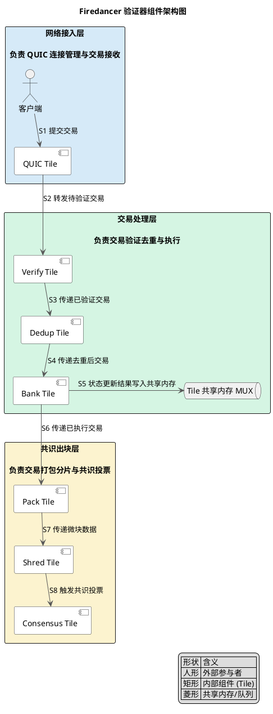
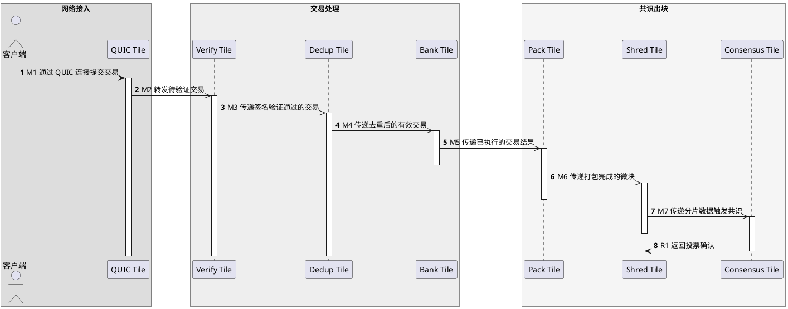

## 目录

- [摘要](#摘要)
- [术语表](#术语表)
- [实体分类](#实体分类)
- [信任边界](#信任边界)
- [组件结构](#组件结构)
  - [各 Tile 职责](#各-tile-职责)
- [核心流程：交易处理流水线](#核心流程交易处理流水线)
  - [流水线阶段详解](#流水线阶段详解)
  - [与 Agave 的架构差异](#与-agave-的架构差异)
- [状态转换](#状态转换)
- [性能优化原理](#性能优化原理)
  - [Tile 架构的核心设计](#tile-架构的核心设计)
  - [网络栈优化](#网络栈优化)
  - [实际性能数据](#实际性能数据)
- [部署架构](#部署架构)
  - [硬件要求](#硬件要求)
  - [部署拓扑](#部署拓扑)
  - [与 Agave 共存](#与-agave-共存)
- [2025-2026 规划与部署状态](#2025-2026-规划与部署状态)
  - [时间线](#时间线)
  - [主网部署现状](#主网部署现状)
  - [与 Alpenglow 的协同](#与-alpenglow-的协同)
- [设计取舍](#设计取舍)
  - [为什么选择 C 而非 Rust](#为什么选择-c-而非-rust)
  - [独立实现 vs 共享代码库](#独立实现-vs-共享代码库)
  - [用户态网络栈 vs 内核网络栈](#用户态网络栈-vs-内核网络栈)
- [能力边界](#能力边界)
  - [协议原生能力](#协议原生能力)
  - [角色职责](#角色职责)
  - [外部依赖](#外部依赖)
  - [非目标](#非目标)
  - [失败条件](#失败条件)
  - [前提假设](#前提假设)
- [证据](#证据)
- [待决问题](#待决问题)
- [追踪链](#追踪链)

---

## 摘要

Firedancer 是由 Jump Crypto 从零开发的第二个独立 Solana 验证器客户端实现。与官方 solana-validator（Agave）共享同一套共识协议，但执行层完全独立重写。其核心创新是 Tile 架构：将交易处理流水线拆分为多个独立进程（Tile），每个 Tile 绑定到独立 CPU 核心，通过共享内存 MPMC 队列通信，实现零内核旁路、极低延迟的并行处理。截至 2025 年底，Firedancer 已进入 Solana 主网生产部署阶段，测试网基准超过 600K TPS，主网目标 1M TPS [L1: solana-blog-internet-capital-markets] [L3: solanacompass-firedancer-metrics]。

## 术语表

| 术语 | 定义 | 作用 |
|------|------|------|
| Firedancer | Jump Crypto 开发的独立 Solana 验证器客户端 | 提供与 Agave 不同的实现，增强网络弹性和性能 |
| Tile | Firedancer 架构中的独立处理单元，每个 Tile 是一个绑定到独立 CPU 核心的进程 | 实现零共享内存、无锁并行处理 |
| MPMC Queue | Multi-Producer Multi-Consumer 队列，基于共享内存实现 | Tile 间通信的数据结构 |
| QUIC | Quick UDP Internet Connections，IETF 标准化的传输层协议 | Solana 交易提交的传输层协议 |
| Agave | Solana 官方验证器客户端（原 solana-validator）的主要分支 | 与 Firedancer 并行的另一个实现 |
| Alpenglow | Solana 的新一代共识协议 | 提供 sub-150ms finality，与 Firedancer 协同工作 |
| Shred | Solana 中区块的分片单元 | 通过 Turbine 协议广播到网络 |
| Micro-block | Firedancer 中打包交易的最小单元 | Bank Tile 执行后由 Pack Tile 打包 |
| Turbine | Solana 的区块传播协议 | 将 Shred 以树状拓扑广播到全网 |
| Finality | 交易最终确定性 | 一旦达成，交易不可回滚 |

## 实体分类

| 实体 | 分类 | 说明 |
|------|------|------|
| Firedancer 验证器进程 | component | 完整的验证器软件，包含所有 Tile |
| Tile（QUIC/Verify/Dedup/Bank/Pack/Shred/Consensus） | component | 独立处理单元，各自绑定 CPU 核心 |
| Tile 共享内存 MUX | data object | Tile 间通信的 MPMC 队列 |
| 交易（Transaction） | data object | 客户端提交的签名操作指令 |
| 微块（Micro-block） | data object | Pack Tile 打包的交易集合 |
| Shred | data object | 微块分片后的广播单元 |
| 验证器身份（Validator Identity） | state | 验证者的公钥和质押状态 |
| 共识投票（Vote） | state | Consensus Tile 生成的 Alpenglow 投票 |
| 客户端（RPC/钱包） | external system | 提交交易的外部参与者 |
| Solana 网络（Turbine/Gossip） | external system | Firedancer 需要交互的 P2P 网络层 |
| Alpenglow 共识模块 | component | 处理共识投票和 finality 的内部模块 |

## 信任边界

```
┌─────────────────────────────────────────────────────┐
│                  Solana 网络（不可信）                  │
│  ┌───────────┐    ┌───────────────────────────────┐  │
│  │  客户端     │    │     Firedancer 验证器（可信）    │  │
│  │ (外部提交)  │───>│                               │  │
│  └───────────┘    │  QUIC Tile → Verify Tile → ... │  │
│                   │  交易在 Tile 链内可信处理         │  │
│                   │  Consensus Tile 输出投票到网络    │  │
│                   └───────────────────────────────┘  │
│                                                       │
│  其他验证器节点 <──> Turbine/Gossip（部分可信）         │
└─────────────────────────────────────────────────────┘
```

- **外部边界**：客户端提交的交易必须经过 QUIC Tile 的协议验证和 Verify Tile 的签名验证，不可信任外部输入
- **内部边界**：Tile 链内部通信基于共享内存，不需要密码学验证，但依赖 OS 内存安全
- **网络边界**：Consensus Tile 的投票通过 Turbine/Gossip 发送到其他验证器，需要密码学签名

## 组件结构

<!-- verified-diagram: firedancer-architecture (architecture diagram, validated 2026-05-03, puml_sha256: 5c3b582ccbb08ec4a35d36a19b14ce50b62e06e58c6e3328c934717bd33ba496) -->



### 各 Tile 职责

| Tile | 职责 | 性能优化要点 |
|------|------|------|
| QUIC Tile | 处理 QUIC 连接、解包交易、流量控制 | 直接处理 QUIC 协议栈，避免内核网络栈开销 |
| Verify Tile | 并行验证交易签名（Ed25519） | 可水平扩展多个实例，每个绑定独立核心 |
| Dedup Tile | 基于签名哈希检测重复交易 | 使用高效哈希表，无锁并发查询 |
| Bank Tile | 执行交易、更新账户状态（Accounts DB） | 通过账户锁分区实现部分并行执行 |
| Pack Tile | 将已执行交易打包为微块，选择最优交易组合 | 实现交易调度优先级逻辑 |
| Shred Tile | 将微块分片为 Shred，通过 Turbine 广播 | 高效编码和分发 |
| Consensus Tile | 生成 Alpenglow 共识投票、处理其他验证器投票 | 低延迟投票路径 |

## 核心流程：交易处理流水线

<!-- verified-diagram: firedancer-dataflow (sequence diagram, validated 2026-05-03, puml_sha256: d609c3fd2f95d1a62674cb07ecbf8179e754a74faf9517afafabeb829b7efe4a) -->



### 流水线阶段详解

1. **M1 交易接收**：客户端通过 QUIC 协议提交交易。QUIC Tile 处理连接建立、流复用和传输层重传，解包后得到原始交易数据 [L1: firedancer-docs-tuning]。

2. **M2 签名验证**：交易转发到 Verify Tile 进行 Ed25519 签名验证。Verify Tile 可水平扩展，多个实例并行处理，这是 Firedancer 高吞吐量的关键设计 [L1: firedancer-github] [L2: youtube-firedancer-v0-arch]。

3. **M3 去重检测**：验证通过的交易进入 Dedup Tile，通过签名哈希去重。这一步防止同一交易被多次处理，减少 Bank Tile 的无效负载 [L1: firedancer-docs]。

4. **M4 交易执行**：去重后的交易进入 Bank Tile，Bank Tile 负责执行交易指令并更新账户状态。Bank Tile 是流水线中最复杂的组件，需要管理账户锁、处理跨账户依赖 [L1: firedancer-docs-tuning]。

5. **M5 打包调度**：执行完成的交易结果传递给 Pack Tile，Pack Tile 将交易组织为微块（micro-block），根据优先级和费用选择最优组合 [L2: youtube-breakpoint-2025-firedancer]。

6. **M6 分片广播**：Pack Tile 输出的微块传递给 Shred Tile，Shred Tile 将微块分片为 Shred 单元，通过 Turbine 协议广播到全网 [L1: firedancer-docs]。

7. **M7 共识投票**：Shred Tile 通知 Consensus Tile 生成了新的 Shred，Consensus Tile 基于 Alpenglow 协议生成投票消息 [L1: solana-blog-internet-capital-markets] [L2: galaxy-research-firedancer-alpenglow]。

### 与 Agave 的架构差异

| 维度 | Agave（官方客户端） | Firedancer |
|------|------|------|
| 编程语言 | Rust | C（核心路径）+ Rust（部分模块） |
| 线程模型 | 多线程共享内存 | Tile 独立进程 + 共享内存 MPMC 队列 |
| 网络栈 | 内核网络栈 + tokio 异步运行时 | 自定义用户态网络栈（内核旁路） |
| 内存管理 | 标准 Rust allocator | 自定义内存分配器，NUMA 感知 |
| CPU 亲和性 | 操作系统调度 | 显式核心绑定，NUMA 拓扑感知 |
| 零拷贝 | 部分实现 | 全链路零拷贝设计 |
| 代码独立性 | 原始实现 | 完全独立重写，共享共识协议规范 |

独立实现的核心价值在于降低单点故障风险。当 Agave 和 Firedancer 存在不同实现 bug 时，网络不会因单一客户端的缺陷而全部分叉或停机 [L1: firedancer-jumpcrypto] [L3: theblock-firedancer-mainnet]。

## 状态转换

Firedancer 验证器的生命周期包含以下核心状态：

| 状态 | 描述 | 转换触发 |
|------|------|------|
| Initializing | 加载配置、初始化 Tile、建立网络连接 | 进程启动 |
| Syncing | 从网络同步最新账本状态和快照 | 连接成功后 |
| Catching Up | 重放缺失的 Shred，追赶最新 slot | 同步完成后 |
| Active | 正常处理交易、生成投票、参与共识 | 追赶完成后 |
| Voting | 生成并广播 Alpenglow 投票 | Active 状态下的周期性操作 |
| Maintenance | 热修复或配置更新 | 管理员触发 |

```
Initializing → Syncing → Catching Up → Active ↔ Voting
                                          ↓
                                    Maintenance
```

- **Initializing → Syncing**：所有 Tile 初始化完成后，通过 Gossip 发现 peers，开始下载快照 [L1: firedancer-docs-getting-started]。
- **Active ↔ Voting**：Voting 不是独立阻塞状态，而是 Active 状态下的周期性行为。Consensus Tile 在每个 slot 生成投票，同时其他 Tile 继续处理交易 [L2: quicknode-alpenglow-upgrade]。

## 性能优化原理

### Tile 架构的核心设计

Tile 架构是 Firedancer 性能优化的基石。每个 Tile 是一个独立的进程（非线程），通过以下机制实现极致性能 [L1: firedancer-docs] [L2: youtube-firedancer-v0-arch]：

1. **核心绑定（Core Pinning）**：每个 Tile 绑定到特定 CPU 核心，避免操作系统调度带来的上下文切换开销。Firedancer 的性能调优文档明确描述了 CPU 核心分配策略 [L1: firedancer-docs-tuning]。

2. **NUMA 感知内存布局**：Tile 的内存分配考虑 NUMA（Non-Uniform Memory Access）拓扑，确保数据尽可能在本地 NUMA 节点访问，减少跨节点内存延迟 [L1: firedancer-docs-tuning]。

3. **共享内存 MPMC 队列**：Tile 间通信不使用网络 socket 或管道，而是通过共享内存中的 MPMC 队列。这消除了内核态/用户态切换和序列化/反序列化开销 [L1: firedancer-github]。

4. **零拷贝数据路径**：从 QUIC Tile 接收交易到 Consensus Tile 生成投票，数据在内存中只存在一份，所有 Tile 通过指针引用，避免数据复制 [L1: firedancer-docs]。

5. **水平扩展能力**：Verify Tile 和 Dedup Tile 可以启动多个实例，每个实例处理不同的交易子集，实现并行签名验证和去重 [L2: youtube-firedancer-v0-arch]。

### 网络栈优化

Firedancer 实现了自定义的用户态网络栈，绕过内核网络协议栈 [L1: firedancer-github]：

- **QUIC 直接处理**：QUIC Tile 在用户态直接处理 QUIC 协议，避免内核网络栈的额外延迟
- **连接池管理**：复用 QUIC 连接，减少握手开销
- **流量整形**：根据验证器处理能力动态调节接收速率，防止缓冲区溢出

### 实际性能数据

> 注：以下依赖 L3 来源的数值型指标置信度较低，建议以官方后续公布的基准数据为准。

| 指标 | 数值 | 来源 |
|------|------|------|
| 测试网峰值 TPS | 600,000+ | [L3: solanacompass-firedancer-metrics] |
| 主网目标 TPS | 1,000,000 | [L1: solana-blog-internet-capital-markets] |
| 测试网无事故运行 | 100 天+ | [L3: unchained-firedancer-mainnet] [L3: cryptonomist-firedancer-mainnet] |
| 主网上线后出块 | 50,000+ blocks 无事故 | [L3: cryptonomist-firedancer-mainnet] |
| 验证器收益提升 | 18-28 bps | [L2: figment-firedancer-migration] |

## 部署架构

### 硬件要求

Firedancer 对硬件有较高要求，官方文档提供了详细的配置指南 [L1: firedancer-docs-getting-started]：

- **CPU**：多核处理器，推荐支持 AVX-512 指令集（用于签名验证加速）
- **内存**：至少 256GB RAM，支持 ECC
- **存储**：NVMe SSD，高 IOPS
- **网络**：10Gbps+ 带宽，低延迟网络接口

### 部署拓扑

```
┌─────────────────────────────────────────────┐
│                  验证器主机                    │
│  ┌─────────────────────────────────────┐    │
│  │         Firedancer 进程              │    │
│  │  ┌─────┐ ┌──────┐ ┌──────┐         │    │
│  │  │Q-Tile│ │V-Tile│ │D-Tile│ ...    │    │
│  │  └─────┘ └──────┘ └──────┘         │    │
│  │  共享内存 MPMC 队列                   │    │
│  └─────────────────────────────────────┘    │
│         ↕ 10Gbps+                            │
│  ┌─────────────────────────────────────┐    │
│  │       操作系统内核（最小化使用）         │    │
│  └─────────────────────────────────────┘    │
└─────────────────────────────────────────────┘
         ↕ Gossip / Turbine / QUIC
┌─────────────────────────────────────────────┐
│              Solana P2P 网络                  │
└─────────────────────────────────────────────┘
```

### 与 Agave 共存

在 2025-2026 年的部署阶段，Firedancer 和 Agave 在 Solana 网络上共存。验证者可以选择运行其中一种客户端，或同时运行两种以提高可靠性 [L3: chainstack-trading-infra-2026]。

## 2025-2026 规划与部署状态

### 时间线

| 时间 | 事件 | 状态 |
|------|------|------|
| 2024 Q4 | Breakpoint 2024 发布 v0 架构设计 | 已完成 [L2: youtube-firedancer-v0-arch] |
| 2025 上半年 | 测试网部署和压力测试 | 已完成 [L3: solanacompass-firedancer-metrics] |
| 2025 年底 | 主网上线（Firedancer 1.0） | 已完成 [L3: theblock-firedancer-mainnet] |
| 2026 年 | 大规模采用，与 Alpenglow 深度协同 | 进行中 [L1: solana-blog-internet-capital-markets] |

### 主网部署现状

Firedancer 已进入 Solana 主网生产环境 [L3: theblock-firedancer-mainnet] [L3: unchained-firedancer-mainnet]。截至 2025 年底的公开数据：

- 已在主网成功出块超过 50,000 个，无安全事故 [L3: cryptonomist-firedancer-mainnet]
- 测试网基准测试达到 600,000+ TPS [L3: solanacompass-firedancer-metrics]
- 主要验证者如 Figment 已迁移到 Firedancer，报告 18-28 bps 的收益提升 [L2: figment-firedancer-migration]

### 与 Alpenglow 的协同

Firedancer 与 Alpenglow 共识协议协同工作，共同实现 sub-150ms finality 目标 [L1: solana-blog-internet-capital-markets] [L2: galaxy-research-firedancer-alpenglow]。Firedancer 的低延迟 Tile 架构为 Alpenglow 的快速投票路径提供了基础设施支撑 [L2: quicknode-alpenglow-upgrade]。

> **UNC-001: Firedancer 与 Alpenglow 的具体优化协同机制**
>
> **问题**：Firedancer 和 Alpenglow 之间是否存在特定的性能优化协同（如共享内存路径、专用接口），还是仅通过标准接口交互？
>
> **当前理解**：根据 Galaxy Research 分析 [L2: galaxy-research-firedancer-alpenglow] 和 Solana 官方博客 [L1: solana-blog-internet-capital-markets]，两者协同实现 sub-150ms finality，但 Firedancer 内部的 Consensus Tile 与 Alpenglow 模块的具体接口细节未在公开文档中完整披露。
>
> **证据缺口**：
> - Firedancer 文档未描述 Consensus Tile 与 Alpenglow 的内部接口
> - Alpenglow 规范文档未明确针对 Firedancer 的优化路径
>
> **影响**：如存在深度协同优化，Firedancer 的共识性能可能显著优于仅使用标准接口的场景。
>
> **最后更新**：2026-05-03

## 设计取舍

### 为什么选择 C 而非 Rust

Firedancer 的核心性能路径使用 C 语言编写，而非 Solana 生态主流的 Rust [L1: firedancer-github]：

- **优势**：C 语言提供对内存布局、指令选择和硬件特性的精确控制，便于实现自定义分配器、NUMA 优化和 SIMD 指令利用
- **代价**：需要手动管理内存安全，增加了实现正确性的风险；与 Solana 生态的 Rust 工具链集成需要额外的 FFI 层
- **取舍理由**：Jump Crypto 在低延迟交易系统领域有深厚的 C 语言积累，选择 C 是性能优先的决策

### 独立实现 vs 共享代码库

Firedancer 选择完全独立重写，而非 fork 官方 solana-validator [L1: firedancer-jumpcrypto]：

- **优势**：消除共享代码缺陷导致的系统性风险；允许完全不同的架构设计（Tile vs 多线程）
- **代价**：需要独立的工程团队维护；两个实现可能 diverge 导致兼容性问题
- **取舍理由**：客户端多样性是区块链网络弹性的重要保障

### 用户态网络栈 vs 内核网络栈

Firedancer 实现用户态 QUIC 处理，绕过内核网络栈 [L1: firedancer-github]：

- **优势**：消除内核/用户态切换开销；实现精细的流量控制和连接管理
- **代价**：需要实现完整的协议栈；调试复杂度增加
- **取舍理由**：在百万级 TPS 目标下，内核网络栈的开销成为瓶颈

## 能力边界

### 协议原生能力

- Firedancer 完全兼容 Solana 协议规范，可以参与所有网络操作 [L1: firedancer-docs]
- 支持所有 Solana 指令类型和程序部署
- 与 Alpenglow 共识协议兼容 [L1: solana-blog-internet-capital-markets]

### 角色职责

- Firedancer 作为验证器客户端，负责：交易接收、验证、执行、打包、广播、共识投票
- 不负责：钱包管理、RPC 服务（需额外部署）、MEV 搜索者逻辑

### 外部依赖

- 依赖 Solana P2P 网络（Gossip/Turbine）进行节点发现和区块传播
- 依赖底层硬件（CPU、内存、存储、网络）满足性能要求
- 依赖操作系统提供进程隔离和共享内存支持

### 非目标

- Firedancer 不实现 Alpenglow 共识协议的内部机制，仅作为共识协议的执行载体
- Firedancer 不直接提供 RPC 服务，需要配合其他组件
- Firedancer 不是 MEV 解决方案，MEV 处理在更高层

### 失败条件

- **硬件不足**：如果 CPU 核心数或内存不足，Tile 架构无法发挥并行优势
- **网络分区**：在网络分区情况下，Firedancer 遵循 Solana 共识协议的 fork choice 规则，不会产生特殊行为
- **实现缺陷**：作为独立实现，可能存在与 Agave 不同的 bug，这也是客户端多样性的价值所在

### 前提假设

- 假设 Solana 协议规范保持稳定，无需频繁跟进 Breaking Change
- 假设验证者能够提供满足硬件要求的服务器
- 假设 QUIC 协议和底层传输层保持稳定

## 证据

| Source | 说明 |
|------|------|
| [L1: firedancer-github] | Firedancer 官方 GitHub 仓库，描述 Tile 架构、用户态网络栈、C 语言实现 |
| [L1: firedancer-docs] | Firedancer 官方文档，描述交易处理流水线、协议兼容性 |
| [L1: firedancer-docs-tuning] | 官方性能调优文档，描述 CPU 核心分配、NUMA 感知、交易接收 |
| [L1: firedancer-docs-getting-started] | 官方构建和部署指南，描述硬件要求和初始化流程 |
| [L1: firedancer-jumpcrypto] | Jump Crypto 官方描述 Firedancer 独立实现的意义 |
| [L1: solana-blog-internet-capital-markets] | Solana 官方提及 Firedancer 1M+ TPS 目标、Alpenglow sub-150ms finality |
| [L2: youtube-firedancer-v0-arch] | Breakpoint 2024 Firedancer v0 架构演讲 |
| [L2: youtube-breakpoint-2025-firedancer] | Breakpoint 2025 Firedancer 主题演讲 |
| [L2: galaxy-research-firedancer-alpenglow] | Galaxy Research 深度分析 Firedancer + Alpenglow 协同 |
| [L2: figment-firedancer-migration] | Figment 迁移经验，报告 18-28 bps 收益提升 |
| [L2: quicknode-alpenglow-upgrade] | Alpenglow 共识升级详解 |
| [L2: solana-breakpoint-2024-agenda] | Breakpoint 2024 Firedancer 议程 |
| [L3: theblock-firedancer-mainnet] | The Block 报道 Firedancer 主网上线 |
| [L3: unchained-firedancer-mainnet] | Unchained 主网上线报道 |
| [L3: solanacompass-firedancer-metrics] | Firedancer 测试网 600K TPS 基准 |
| [L3: cryptonomist-firedancer-mainnet] | 主网上线报道，50000+ blocks 无事故 |
| [L3: cherryservers-firedancer-guide] | 技术指南，架构和部署分析 |
| [L3: backpack-firedancer-explainer] | Firedancer 解释性文章 |
| [L3: chainstack-trading-infra-2026] | 2026 交易基础设施分析，Firedancer/Agave 共存 |
| [L3: bitget-breakpoint-firedancer-intro] | Breakpoint 会议介绍 |
| [L1: solana-network-health-june2025] | Solana 网络健康报告 2025 年 6 月 |
| [L4: medium-firedancer-alpenglow-mev] | Medium 技术分析 MEV 影响（补充参考） |

## 待决问题

- **共识接口细节**：Consensus Tile 与 Alpenglow 的具体接口规范未在公开文档中完整披露 [UNC-001]
- **内部性能基准**：Firedancer 团队内部的性能基准测试数据（如不同硬件配置下的 TPS）未完全公开
- **安全审计结果**：Firedancer 的安全审计报告细节未完全公开

## 追踪链

- 来源 change: `openspec/changes/primitive_blockchain-validator_firedancer/`
- Request: `openspec/changes/primitive_blockchain-validator_firedancer/request.md`
- Plan: `openspec/changes/primitive_blockchain-validator_firedancer/plan.md`
- Draft: `openspec/changes/primitive_blockchain-validator_firedancer/draft.md`
- Review: `openspec/changes/primitive_blockchain-validator_firedancer/review.md`
- Publish: `openspec/changes/primitive_blockchain-validator_firedancer/publish.md`
