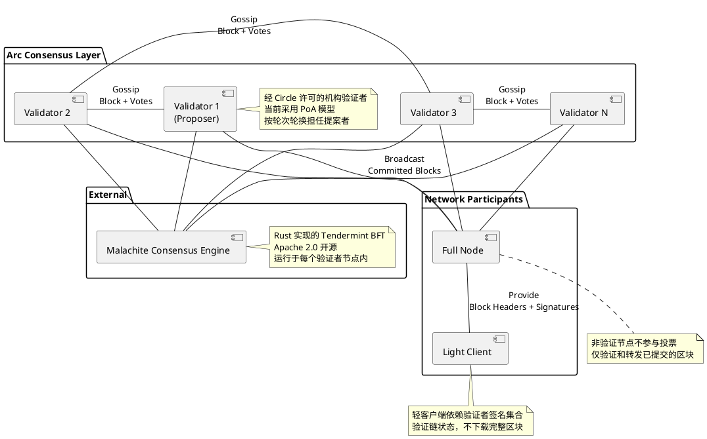
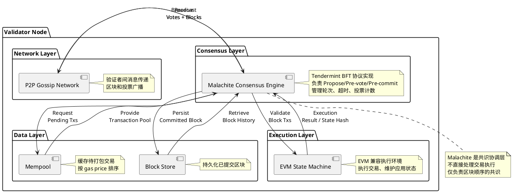
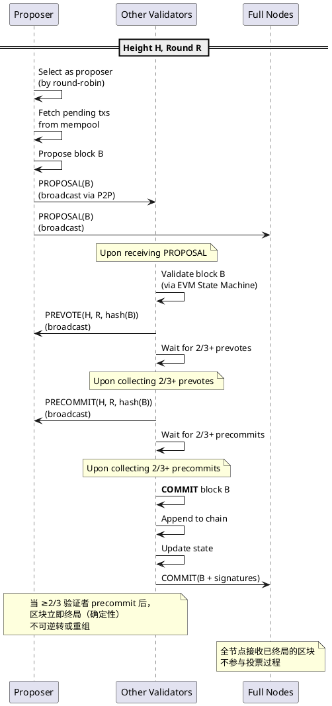

## 目录

- [概述](#概述)
- [关键术语](#关键术语)
- [角色与信任边界](#角色与信任边界)
- [验证者节点内部组件](#验证者节点内部组件)
- [Tendermint 共识流程](#tendermint-共识流程)
- [共识状态转换](#共识状态转换)
- [设计取舍](#设计取舍)
- [边界与前提](#边界与前提)
- [能力状态分类](#能力状态分类)
- [相关对象关系](#相关对象关系)
- [结论](#结论)

## 概述

Arc Chain 是由 Circle 推出的 Layer-1 区块链，专为稳定币和链上金融场景设计。其共识机制基于 **Malachite**——由 Informal Systems 开发后被 Circle 收购的高性能 BFT 共识引擎。Malachite 是 Tendermint BFT 共识协议的 Rust 实现，配合许可型 PoA 验证者模型，实现亚秒级确定性终局。

**研究深度**：focused
**对象类型**：primitive

当前 Arc 处于公测阶段（2025-10-28 启动），主网计划 2026 年上线。

## 关键术语

| 术语 | 定义 | 在本题中的作用 |
|------|------|---------------|
| **Malachite** | Circle（前 Informal Systems）开发的 Tendermint BFT 共识引擎 Rust 实现，Apache 2.0 开源 | Arc 共识的核心引擎 |
| **Tendermint BFT** | 拜占庭容错共识协议，采用 Propose → Pre-vote → Pre-commit 三阶段流程，保证 >2/3 诚实验证者时的安全性和活性 | Malachite 的协议基础 |
| **确定性终局（Deterministic Finality）** | 交易一旦确认即不可逆转，无需等待多轮概率性确认 | Arc 共识的核心特征 |
| **PoA（Proof of Authority）** | 权限证明模型，验证者为已知且经过许可的机构，通过声誉和合规约束而非经济质押保证诚实 | Arc 当前的验证者模型 |
| **permissioned PoS** | 许可型权益证明，验证者需质押代币但仍需满足准入条件 | Arc 路线图中计划从 PoA 过渡的目标模型 |
| **Multi-proposer** | 规划中的升级，允许多个验证者并行提议区块，而非当前的单提案者顺序出块 | 影响未来吞吐量和延迟的路线图特性 |
| **CometBFT** | Cosmos SDK 的 Tendermint BFT 实现，Go 语言编写 | Malachite 的参照物，两者是独立实现而非 fork 关系 |
| **Quint** | Informal Systems 开发的分布式系统形式化验证工具 | Malachite 用 Quint 编写形式化规约 |

## 角色与信任边界

### 角色与信任边界总览图

**Diagram Contract**：
- **抽象层级**：系统级角色与信任边界（Level 1）
- **范围**：Arc 共识层的全部参与者类型及其跨信任边界的通信路径
- **简化假设**：将 N 个验证者简化为代表节点，省略 P2P 网络拓扑细节

**关键信任假设**：
- 验证者集合是**许可型**的，由 Circle 遴选的机构组成，具有声誉、合规要求和运营保障
- **安全性假设**：< 1/3 验证者作恶时，保证无冲突区块终局
- **活性假设**：≥ 2/3 验证者在线且诚实时，链持续进展
- 全节点和轻客户端不直接参与共识，依赖验证者输出的区块和签名

### 角色差异表

| 角色/节点类型 | 内部组件 | 共识参与方式 |
|--------------|----------|-------------|
| **验证者节点** | 运行完整 Malachite 共识引擎、Mempool、EVM State Machine | 参与投票和出块 |
| **全节点** | 无共识投票模块，仅接收已提交区块并验证 | 验证和转发已提交区块 |
| **轻客户端** | 仅存储区块头和签名集合 | 通过验证签名集确认链状态 |

## 验证者节点内部组件

### 验证者节点内部组件图

**Diagram Contract**：
- **抽象层级**：单角色内部组件级（Level 2）
- **范围**：验证者节点内部的核心组件及协作关系
- **简化假设**：省略网络层加密细节和存储层的 I/O 实现

## Tendermint 共识流程

### 跨角色核心流程图（Happy Path）

**Diagram Contract**：
- **抽象层级**：跨角色消息流级（Level 2）
- **范围**：单个高度（Height）和轮次（Round）内的正常共识流程
- **简化假设**：省略消息签名验证、网络重传、超时重试等异常路径细节

**流程步骤说明**：
- `【Propose】`：提案者由轮次选择算法（round-robin）确定，从 mempool 拉取待打包交易并组装区块
- `【Pre-vote】`：其他验证者收到提案后，通过 EVM 执行引擎验证区块有效性，然后广播 pre-vote 消息
- `【Pre-commit】`：当验证者收集到 ≥2/3 的 pre-vote 后，广播 pre-commit 消息
- `【Commit】`：当验证者收集到 ≥2/3 的 pre-commit 后，区块被提交并追加到链上，交易确定性终局

### 异常路径

| 异常场景 | 处理机制 | 对安全性的影响 |
|----------|----------|----------------|
| 提案者超时未出块 | 进入下一轮次（Round R+1），选择新提案者 | 不影响安全性，仅影响活性 |
| 提案区块无效 | 验证者对该区块投 nil-vote，进入下一轮次 | 保证无效区块不会被提交 |
| 网络分区导致 < 2/3 投票 | 链暂停进展（牺牲活性），直到网络恢复 | 保证安全性：CAP 定理下优先选择一致性 |
| ≥ 1/3 验证者合谋作恶 | 可能产生冲突区块终局（安全性破坏） | 不可恢复的安全失败 |

## 共识状态转换

Tendermint 共识协议依赖显式的阶段转换。下表展示了单个轮次中验证者共识状态的转换逻辑。

| 当前状态 | 触发事件 | 转换结果 | 说明 |
|----------|----------|----------|------|
| **Idle / New Height** | 被选为提案者 | Propose | 开始新一轮出块 |
| **Idle / New Height** | 等待提案 | WaitForProposal | 非提案者等待接收区块 |
| **WaitForProposal** | 收到有效 PROPOSAL | Prevote | 开始 pre-vote 阶段 |
| **WaitForProposal** | 超时（TimeoutPropose） | Prevote (nil) | 未收到提案，投 nil-vote |
| **Prevote** | 收集到 2/3+ prevote 同一区块 | Precommit | 进入 pre-commit 阶段 |
| **Prevote** | 超时（TimeoutPrevote）且未达成 2/3 | Precommit (nil) | 超时后投 nil-vote |
| **Precommit** | 收集到 2/3+ precommit 同一区块 | Commit | 区块终局 |
| **Precommit** | 超时（TimeoutPrecommit）且未达成 2/3 | New Round (R+1) | 进入下一轮次 |
| **Commit** | 区块追加完成 | New Height (H+1) | 进入新高度 |

## 设计取舍

| 设计选择 | 替代方案 | 选择原因 | Trade-off |
|----------|----------|----------|-----------|
| **PoA（当前）** vs PoS | 原生 PoS（如 Ethereum）或 DPoS | 面向机构级稳定币场景，PoA 提供已知身份验证者的合规保障和可问责性 | 牺牲去中心化程度，换取合规性和机构信任 |
| **Tendermint BFT** vs Nakamoto（最长链） | PoW 最长链（Bitcoin）或 LMD-GHOST（Ethereum） | Tendermint 提供确定性终局，交易一旦确认不可逆转，符合金融结算需求 | 需要 ≥2/3 在线验证者，网络分区时牺牲活性 |
| **Malachite（Rust）** vs CometBFT（Go） | CometBFT（Cosmos SDK 的 Go 实现） | Rust 内存安全、性能优化；Malachite 从 CometBFT 维护经验中吸取教训，采用模块化设计 + Quint 形式化验证 | Rust 生态相对 Go 更年轻，开发人才稀缺 |
| **单提案者顺序出块** vs 多提案者并行 | DAG 类共识（如 Aptos Block-STM、Sui Mysticeti） | 单提案者简化一致性逻辑，降低冲突概率；适合当前验证者数量规模 | 吞吐量受单提案者瓶颈限制，multi-proposer 规划中 |
| **许可型验证者** vs 无许可验证 | 无许可 PoS（如 Solana、Ethereum） | 机构级场景需要合规和可问责，许可模型确保验证者身份和运营标准 | 去中心化程度受限，依赖 Circle 的治理可信度 |
| **乐观响应性** vs 固定延迟 | 固定区块时间（如 Solana 400ms slot） | Malachite 以网络允许的最快速度推进，无额外超时 | 实际延迟受网络条件波动，不如固定延迟可预测 |

## 边界与前提

### 强项

- **确定性终局**：交易一旦确认即不可逆转，消除区块重组风险，适合金融结算
- **亚秒级延迟**：基准条件下 100 验证者 ~780ms，20 验证者 <350ms，4 验证者 <100ms，对标传统金融市场基础设施标准（PFMI）
- **高吞吐潜力**：20 验证者基准条件下 3,000+ TPS，multi-proposer 升级后预计可达更高
- **形式化验证基础**：Malachite 使用 Quint 编写形式化规约，辅助验证协议正确性

### 弱项

- **去中心化程度受限**：当前 PoA 模型 + 许可型验证者，依赖 Circle 的治理可信度
- **验证者规模敏感**：吞吐量随验证者数量增加而下降（20 验证者 3,000 TPS vs 4 验证者 10,000+ TPS）
- **网络分区脆弱性**：< 2/3 验证者在线时链停止进展（CAP 定理下优先一致性）
- **Alpha 阶段**：Malachite 代码仍在重开发中，未经外部审计

### 不确定性

- **PoS 过渡方案**：官方仅提及从 PoA 向 permissioned PoS 过渡的方向，无技术细节文档
- **Multi-proposer 设计**：并行出块如何保证安全性，具体方案未公开
- **两轮协议优化**：从三轮减至两轮的具体变体，需等待 specs/ 目录的进一步公开
- **验证者遴选与治理**：验证者遴选标准、替换机制、惩罚规则未完全公开

## 能力状态分类

| 状态 | 能力 |
|------|------|
| **Live（已上线）** | Tendermint BFT 三阶段共识、PoA 验证者、确定性终局、EVM 兼容执行 |
| **Planned（规划中）** | Multi-proposer 并行出块、两轮协议优化、向 permissioned PoS 过渡 |
| **Lab Benchmark（实验室基准）** | Malachite README 中的实验室基准数据（如 "50,000 TPS"），非 Arc 生产环境实测 |

### 能力归属

| 能力 | 归属方 | 说明 |
|------|--------|------|
| 确定性终局 | **协议原生**（Malachite 共识引擎） | Tendermint BFT 保证，≥2/3 precommit 即终局 |
| 亚秒级延迟 | **协议原生 + 验证者基础设施** | Malachite 提供乐观响应性，实际延迟受验证者地理分布和网络条件影响 |
| 高吞吐（3,000+ TPS） | **协议原生** | 20 验证者基准条件下达到 |
| 交易执行（EVM） | **执行层**（独立模块） | EVM State Machine 执行交易逻辑，与共识层解耦 |
| 隐私（机密转账） | **官方生态模块**（TEE 实现） | 可选功能，不在共识层 |
| StableFX 外汇引擎 | **官方生态模块** | 独立于共识的应用层引擎 |
| USDC 原生 Gas | **协议配置层** | 费用机制，不影响共识算法本身 |
| Multi-proposer 并行出块 | **路线图**（未上线） | 规划中 |
| 两轮协议优化 | **路线图**（未上线） | 规划中 |
| 向 permissioned PoS 过渡 | **路线图**（未上线） | 规划方向 |

## 相关对象关系

- **上游**：Malachite 共识引擎（Rust 库）是 Arc 的共识层实现依赖
- **下游**：Arc 的 EVM 执行层依赖共识层提供的区块顺序执行交易
- **相邻**：与 CometBFT（Cosmos SDK）共享 Tendermint 协议基础，但 Malachite 是独立实现
- **互补**：StableFX 外汇引擎、隐私模块、CCTP 跨链协议是 Arc 生态中的独立模块，与共识层解耦

## 结论

- Arc Chain 共识机制基于 Malachite，是 Tendermint BFT 协议的 Rust 实现
- 当前验证者模型为 PoA（Proof of Authority），验证者为 Circle 许可的机构
- 确定性终局延迟：100 验证者基准条件下 ~780ms，20 验证者 <350ms，4 验证者 <100ms
- 安全假设：< 1/3 验证者作恶时保证安全性；≥ 2/3 在线时保证活性
- 性能指标来自官方基准测试，非独立第三方审计结果
- 路线图包含 multi-proposer 并行出块、两轮协议优化、向 permissioned PoS 过渡
