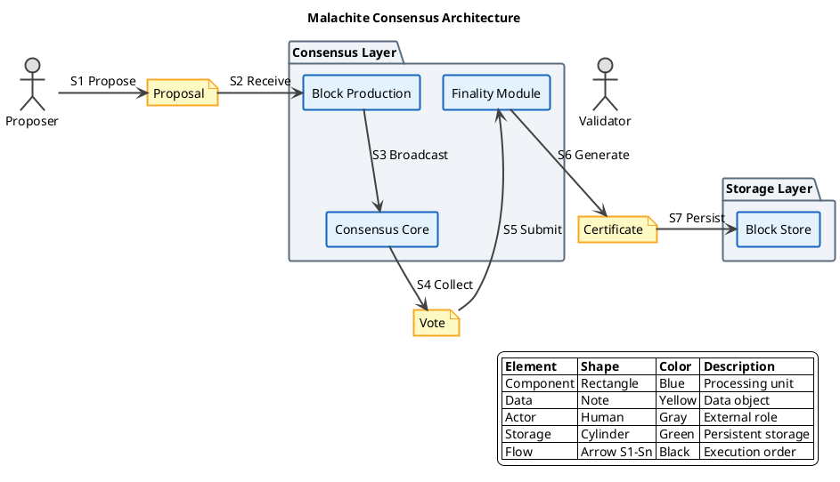

# Malachite 共识算法

## 概述

Malachite 是由 Circle/Malachite 团队开发的高性能 BFT 共识算法实现，采用 Rust 语言编写，设计目标是提供模块化、可嵌入不同区块链系统的共识层。

**研究范围**：本协议为新兴 BFT 变体，属于 Arc Network 的共识层实现。

## 关键术语

| 术语 | 定义 | 在本题中的作用 |
|------|------|---------------|
| Malachite | Circle/Arc Network 的 BFT 共识实现 | 研究对象 |
| Consensus Layer | 共识层，负责区块最终性 | Malachite 的核心功能定位 |
| Finality Gadget | 最终性组件，提供确定性保证 | Malachite 的可能组件 |

## 分析正文

### 组件架构

**架构图说明**：
- **蓝色矩形**：处理组件（区块生产、共识核心、最终性模块）
- **黄色矩形（note）**：数据对象（Proposal、Vote、Certificate）
- **灰色人形**：外部角色（验证者、Proposer）
- **绿色圆柱体**：数据存储（区块存储）
- **箭头标注 S1→S7**：流程执行顺序

**【S1→S7】共识流程说明**：

- **【S1→S2】** Proposer 生成区块提议（Proposal），传递给区块生产模块
- **【S3→S4】** 区块生产模块广播提案到共识核心，共识核心收集验证者投票（Vote）
- **【S5→S7】** 投票提交到最终性模块，生成最终性证书（Certificate）后持久化到区块存储

### 核心机制（与传统 BFT 差异）

**传统 BFT（PBFT）基线**：
- 三阶段协议：Pre-prepare → Prepare → Commit
- O(n²) 消息复杂度
- View Change 复杂且代价高

**Malachite 核心差异**：

| 维度 | 传统 BFT | Malachite |
|------|----------|-----------|
| 实现语言 | 多种（C++、Go 等） | Rust |
| 架构设计 | 单体共识 | 模块化、可嵌入 |
| 区块生产 | Leader 单独负责 | 可能与共识层分离 |
| 消息复杂度 | O(n²) | 待确认优化机制 |
| View Change | 显式视图转换协议 | 待确认 |
| 最终性 | 多轮投票后即时 | 可能有独立 Finality Module |

**【L2 证据】** Malachite 作为 Rust 库提供，可嵌入到不同的区块链系统中，这是其与传统 BFT 实现的主要差异之一。

### 设计取舍

| 设计选择 | 优势 | 劣势 | 取舍原因 |
|----------|------|------|----------|
| Rust 实现 | 内存安全、高性能、无 GC | 生态相对较小、学习曲线陡 | 系统级编程的安全性需求 |
| 模块化设计 | 可嵌入不同链、复用性强 | 集成复杂度较高 | 通用性优先 |
| 共识与生产分离 | 可能的并行化优化 | 架构复杂度增加 | 性能优先 |

## 边界与前提

### 角色归属表

| 角色 | 作用说明 | Protocol-native | Official | Third-party | 状态 |
|------|----------|-----------------|----------|-------------|------|
| Proposer | 区块提议 | ✓ | - | - | early |
| Validator | 投票验证 | ✓ | - | - | early |

### 能力边界

**能解决**：
- 拜占庭容错共识（≤1/3 故障节点）
- 区块最终性保证
- 模块化嵌入不同链

**不能解决**：
- 网络层通信问题
- 数据可用性问题
- 应用层逻辑

**故障假设**：部分同步网络
**容错比例**：1/3 拜占庭节点（待确认）
**状态**：early implementation

## 相关对象关系

### 与相邻协议的关系

| 对象 | 关系类型 | 说明 |
|------|----------|------|
| Tendermint | 替代方案 | Go 实现的 PoS+BFT，更成熟 |
| QBFT | 替代方案 | 企业级 BFT，联盟链场景 |
| Simplex | 替代方案 | Commonware 的新兴 BFT 实现 |

## 结论

**已确认**：
- 【L2 证据】Malachite 是 Rust 实现的高性能 BFT 共识
- 【L2 证据】设计目标是模块化、可嵌入不同链
- 【L3 证据】与 Arc Network 关联

**尚需验证**：
- 详细协议流程和消息复杂度优化机制
- View Change 处理方式
- 实际部署状态和性能数据

## 待确认问题

| 问题 | 状态 | 下一步 |
|------|------|--------|
| 详细协议流程 | 未解决 | 需要阅读源码 |
| View Change 机制 | 未解决 | 需要官方文档 |
| 实际部署状态 | 未解决 | 需要验证主网进展 |

## 参考资料

| 来源 | 说明 |
|------|------|
| https://github.com/circlefin/malachite | L2 来源，参考实现 |
| https://docs.arc.network/arc/concepts/consensus-layer | L1 来源，Arc 文档 |
