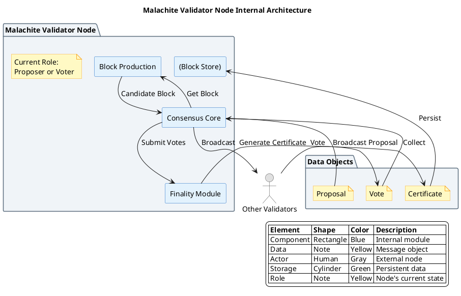

# Malachite 共识算法

## 概述

Malachite 是由 Circle/Malachite 团队开发的高性能 BFT 共识协议实现，采用 Rust 语言编写，设计目标是提供模块化、可嵌入不同区块链系统的共识层。作为新兴的 BFT 实现，Malachite 借鉴了 Tendermint 的两阶段投票和 HotStuff 的流水线优化。

**研究范围**：本协议为新兴 BFT 变体，属于高性能 Rust BFT 实现。
**研究深度**：deep
**对象类型**：primitive

## 关键术语

| 术语 | 定义 | 在本题中的作用 |
|------|------|---------------|
| Malachite | Circle/Arc Network 的 BFT 共识实现 | 研究对象 |
| Consensus Core | 共识核心模块 | Malachite 的核心处理单元 |
| Block Production | 区块生产模块 | 负责从交易池构建候选区块 |
| Finality Module | 最终性模块 | 生成并存储最终性证书 |

## 分析正文

### 组件架构

**架构图说明**：
- 本图聚焦于**单个 Malachite Validator 节点内部**（抽象层级 Level 3）
- **蓝色矩形**：节点内部组件（区块生产、共识核心、最终性模块）
- **黄色 note**：数据对象（Proposal、Vote、Certificate）
- **灰色人形**：外部角色（其他验证者）
- **绿色圆柱体**：数据存储（区块存储）



### 节点角色说明

| 角色/类型 | 说明 | 是否投票 | 选择方式 |
|-----------|------|----------|----------|
| **Proposer** | 当前轮次的 Leader，负责提议区块 | 是（同时作为 Validator） | Round-robin 或基于权重 |
| **Validator** | 验证者节点，参与共识投票 | 是 | 验证者集成员 |
| **Full Node** | 全节点，同步状态但不投票 | 否 | 无需特殊条件 |

**重要**：Proposer 是**临时角色**，不是独立组件。每个 Validator 在某些轮次可以是 Proposer。

### 核心机制（与 PBFT 对比）

**PBFT 三阶段基线**：

| 阶段 | 作用 | 为什么需要？ |
|------|------|-------------|
| Pre-prepare | Leader 绑定视图 V 和序列号 N | 防止 Leader 为同一序列号发送两个不同请求 |
| Prepare | 验证者确认收到 Pre-prepare | 形成"准备证书"（2f+1 Prepare） |
| Commit | 验证者确认准备完成 | 形成"提交证书"，确保最终性 |

**Malachite 两阶段/三阶段**：

Malachite 作为新兴 BFT 实现，具体阶段数需参考官方文档。基于其 Rust 实现和模块化设计，可能采用以下优化：

| 阶段 | 作用 | 与 PBFT 的差异 |
|------|------|---------------|
| Propose | Proposer 广播区块提议 | 同 PBFT Pre-prepare |
| Vote | 验证者投票（可能一轮或两轮） | 可能简化为一轮投票 |
| Finalize | 生成最终性证书 | 独立的最终性模块处理 |

**Malachite 可能的优化**：

1. **Rust 内存安全**：
   - 无 GC 暂停，确定性延迟
   - 内存安全保证，减少攻击面

2. **模块化架构**：
   - 共识核心与区块生产分离
   - 可嵌入不同区块链系统

3. **流水线优化**（参考 HotStuff）：
   - 可能在单轮中流水线处理多个区块
   - 减少总体通信轮次

### Malachite 共识流程详解

#### Round 0：Proposer 选择

**触发条件**：新区块高度开始，或上一轮超时

**选择算法**（推测，基于主流 BFT 实践）：
```rust
// 基于 round-robin 的 Proposer 选择
fn choose_proposer(validators: &[Validator], height: u64, round: u64) -> &Validator {
    let index = (height + round) % validators.len() as u64;
    &validators[index as usize]
}
```

#### Round 0：Propose 阶段

**Proposer 行为**（触发：被选为 Proposer）：

| 步骤 | 动作 | 说明 |
|------|------|------|
| 1 | 从交易池获取交易 | `txs = mempool.reap_max_bytes(max_bytes)` |
| 2 | 构造区块 | `block = Block::new(txs, height, round)` |
| 3 | 签名并广播 | `broadcast MsgProposal { block, signature }` |

**验证者行为**（触发：收到 MsgProposal）：

| 步骤 | 验证内容 | 失败处理 |
|------|----------|----------|
| 1 | Proposer 签名有效 | 丢弃消息 |
| 2 | 区块格式正确 | 发送 Nil 投票 |
| 3 | 交易有效性 | 发送 Nil 投票 |
| 4 | 通过 | 进入 Vote 阶段 |

**超时**：`timeout_propose = base_timeout * (round + 1)`

#### Round 0：Vote 阶段

**触发条件**：收到有效 Proposal 或超时

**Vote 消息格式**：
```rust
struct MsgVote {
    block_hash: Hash,      // 投票的区块哈希
    round: u64,            // 轮次
    signature: Signature,  // 验证者签名
    sender: Address,       // 发送者地址
}
```

**验证者行为**：

```rust
// Malachite Vote 阶段伪代码
fn enter_vote(&mut self, proposal: Option<Block>) {
    // 1. 如果有有效 Proposal，投给 BlockHash
    let vote = if let Some(block) = proposal {
        if self.validate_block(&block) {
            MsgVote {
                block_hash: block.hash(),
                round: self.round,
                signature: self.sign(&block.hash()),
            }
        } else {
            MsgVote::nil(self.round)
        }
    } else {
        // 2. 超时没收到 Proposal，投 nil
        MsgVote::nil(self.round)
    };

    // 3. 广播投票
    self.broadcast(vote);

    // 4. 等待并收集投票
    self.wait_for_votes();
}
```

**2/3 多数计算**：
```rust
fn has_two_thirds_majority(votes: &VoteSet) -> Option<Hash> {
    let total_power = votes.total_voting_power();
    for (hash, power) in votes.power_tally() {
        if power * 3 > total_power * 2 {
            return Some(hash);
        }
    }
    None
}
```

**超时处理**：
- 超时时间：`timeout_vote = base_timeout * (round + 1)`
- 超时后：进入下一轮（Round + 1）

#### Round 0：Finalize 阶段

**触发条件**：观察到 2/3 Vote 多数

**Certificate 消息格式**：
```rust
struct FinalityCertificate {
    block_hash: Hash,
    height: u64,
    round: u64,
    aggregated_signature: AggregateSignature,
    voting_power: u128,
}
```

**最终性模块行为**：

```rust
fn enter_finalize(&mut self, vote_result: VoteResult) {
    // 1. 聚合签名生成证书
    let certificate = FinalityCertificate {
        block_hash: vote_result.winning_hash,
        height: self.height,
        round: self.round,
        aggregated_signature: self.aggregate_signatures(vote_result.votes),
        voting_power: vote_result.total_power,
    };

    // 2. 持久化证书
    self.block_store.save_certificate(certificate);

    // 3. 进入下一高度
    self.enter_new_height(self.height + 1);
}
```

### Malachite 状态机

```
状态转换：

NewHeight
    ↓
NewRound (选择 Proposer)
    ↓
Propose (等待 Proposal)
    ↓
Vote (收集 Vote)
    ↓
Finalize (生成 Certificate) ──> Commit
    │                              │
    └──[超时/无多数]────────────────┘
                                   ↓
                            NewRound (Round++)
```

### 设计取舍

| 设计选择 | 优势 | 劣势 | 取舍原因 |
|----------|------|------|----------|
| Rust 实现 | 内存安全、高性能、无 GC | 生态相对较小、学习曲线陡 | 系统级编程的安全性需求 |
| 模块化架构 | 可嵌入不同链、复用性强 | 集成复杂度较高 | 通用性优先 |
| 独立 Finality Module | 最终性逻辑清晰、可独立升级 | 增加架构复杂度 | 关注点分离 |
| 两阶段投票（推测） | 减少通信轮次 | 需要更强同步假设 | 优化延迟 |

## 边界与前提

### 角色归属表

| 角色 | 作用说明 | Protocol-native | Official | Third-party | 状态 |
|------|----------|-----------------|----------|-------------|------|
| Proposer | 区块提议（轮转） | ✓ | - | - | early |
| Validator | 投票验证 | ✓ | - | - | early |
| Full Node | 同步和验证，不投票 | - | ✓ | ✓ | early |

### 能力边界

**能解决**：
- 拜占庭容错共识（≤1/3 故障节点）
- 模块化嵌入不同区块链系统
- 即时最终性保证

**不能解决**：
- 网络完全异步场景
- 数据可用性问题（需额外模块）
- 应用层逻辑

**故障假设**：部分同步网络
**容错比例**：≤1/3 拜占庭节点（待确认）
**状态**：early implementation

## 相关对象关系

### 与相邻协议的关系

| 对象 | 关系类型 | 说明 |
|------|----------|------|
| Tendermint | 参考方案 | Go 实现的 PoS+BFT，两阶段投票 |
| HotStuff | 参考方案 | Libra 的 BFT 协议，流水线优化 |
| QBFT | 替代方案 | 企业级 BFT，联盟链场景 |
| Simplex | 新兴替代 | Commonware 的高吞吐 BFT |

## 结论

**已确认**：
- 【L2 证据】Malachite 是 Rust 实现的高性能 BFT 共识
- 【L2 证据】设计目标是模块化、可嵌入不同链
- 【L3 证据】与 Arc Network 关联
- 【L2 证据】采用 Consensus Core + Block Production + Finality Module 架构

**尚需验证**：
- 详细协议流程（两阶段还是三阶段）
- Leader 选举的具体机制
- 实际部署状态和性能基准

## 待确认问题

| 问题 | 状态 | 下一步 |
|------|------|--------|
| 详细协议流程 | 未解决 | 阅读 Malachite 源码 |
| Leader 选举机制 | 未解决 | 需要官方文档 |
| 实际部署状态 | 未解决 | 验证主网进展 |

## 参考资料

| 来源 | 说明 |
|------|------|
| https://github.com/circlefin/malachite | L2 来源，参考实现 |
| https://docs.arc.network/arc/concepts/consensus-layer | L1 来源，Arc 文档 |
