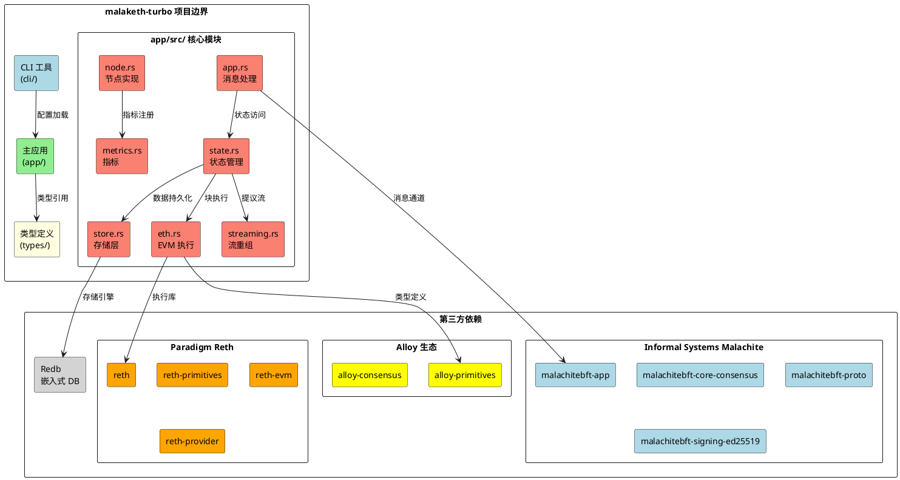
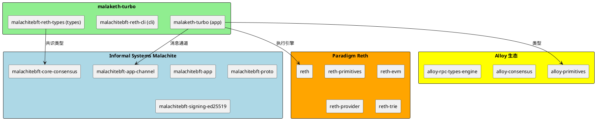
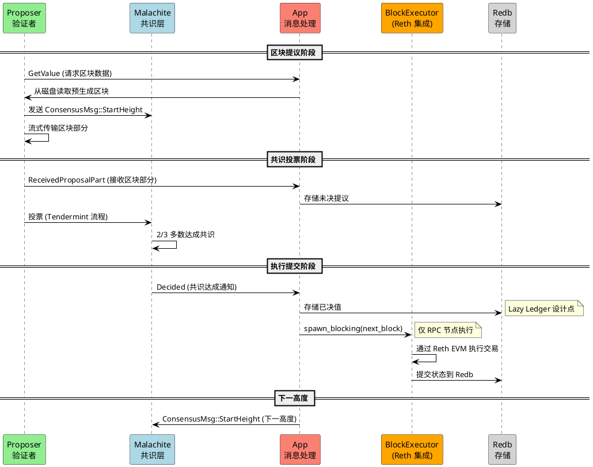
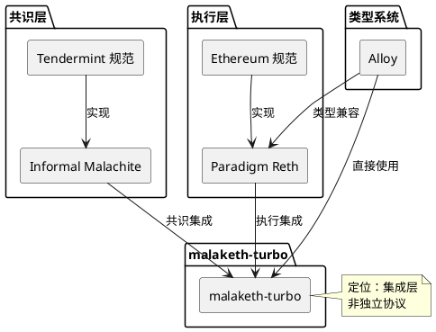

# Malachite-Turbo - 共识执行集成分析

## 研究对象定位

**Malachite-Turbo** 是 Circle 投资的 Informal Systems 团队开发的实验性项目，演示了如何将 **Malachite 共识协议**（基于 Tendermint）与 **Reth 以太坊执行客户端** 集成。

**项目状态**：实验性/演示阶段（非生产就绪）

**仓库**：https://github.com/circlefin/malaketh-turbo

---

## 目录

- [关键术语](#关键术语)
- [组件架构](#组件架构)
- [自研 vs 集成](#自研 vs 集成)
- [核心流程](#核心流程)
- [设计取舍](#设计取舍)
- [性能分析](#性能分析)
- [能力边界](#能力边界)
- [相关对象关系](#相关对象关系)
- [可确认结论](#可确认结论)
- [Evidence Gap](#evidence-gap)
- [参考资料](#参考资料)

---

## 关键术语

| 术语 | 定义 | 作用 |
|------|------|------|
| Malachite | Informal Systems 开发的 Tendermint 共识实现（Rust） | 共识层依赖 |
| Reth | Paradigm 开发的 Rust 版以太坊执行客户端 | 执行层依赖 |
| Lazy Ledger | 验证者只排序交易、不执行交易的架构 | 核心设计选择 |
| AppMsg | Malachite 应用与共识引擎的通信消息类型 | 组件交互机制 |
| BlockExecutor | 封装 Reth 执行逻辑的组件 | 自研执行集成 |

---

## 组件架构



**组件职责表**：

| 组件 | 路径 | 职责 | 来源 |
|------|------|------|------|
| CLI 工具 | `cli/` | 命令行配置、节点启动 | 自研 |
| 主应用 | `app/` | 业务逻辑主体 | 自研 |
| 类型定义 | `types/` | Protobuf 类型、编解码 | 自研 + 生成 |
| app.rs | `app/src/` | Consensus 消息处理 | 自研 |
| state.rs | `app/src/` | 状态机、区块提议/验证 | 自研 |
| store.rs | `app/src/` | Redb 存储抽象 | 自研 |
| eth.rs | `app/src/` | Reth 执行集成 | 自研 |
| node.rs | `app/src/` | 节点生命周期 | 自研 |
| streaming.rs | `app/src/` | 区块流式重组（最小堆） | 自研 |
| metrics.rs | `app/src/` | Prometheus 指标 | 自研 |

---

## 自研 vs 集成

### 依赖关系图



### 分类对比表

| 类别 | 组件/依赖 | 来源 | 成熟度 | 备注 |
|------|----------|------|--------|------|
| **自研代码** | app/, cli/, types/ | Circle/Informal | 实验性 | 核心集成逻辑 |
| **自研代码** | app.rs, state.rs, store.rs | Circle/Informal | 实验性 | 消息处理、状态管理 |
| **自研代码** | eth.rs (BlockExecutor) | Circle/Informal | 实验性 | Reth 集成层 |
| **Malachite** | malachitebft-* (10+ crates) | Informal Systems | Beta | Git 分支：main |
| **Reth** | reth-* (10+ crates) | Paradigm | 生产 | Git Tag: v1.2.0 |
| **Alloy** | alloy-* (6+ crates) | Alloy 生态 | 生产 | Ethereum 类型 |
| **存储** | redb | 第三方 | 生产 | 嵌入式 KV 数据库 |

---

## 核心流程



**流程步骤说明**：

- **【GetValue】** 提案生成：从磁盘读取预生成的区块（非真实 Mempool），构造 Proposal
- **【ReceivedProposalPart】** 区块重组：验证者接收流式区块部分，验证签名后存储
- **【Decided】** 共识达成：Malachite 完成 Tendermint 流程，通知应用提交
- **【next_block】** 延迟执行：**关键设计点** — 验证者默认不执行交易，仅 RPC 节点异步执行（Lazy Ledger）

---

## 设计取舍

### Lazy Ledger vs Validator Execution

| 维度 | Lazy Ledger（当前选择） | Validator Execution |
|------|------------------------|---------------------|
| 吞吐量 | **高**（仅排序） | 受执行速度限制 |
| 验证者负载 | **轻** | 重（需运行完整 EVM） |
| 客户端信任 | 需自行验证 | 可信任验证者 |
| 状态证明 | 客户端自构建 | 验证者提供 |
| 实现复杂度 | **低** | 高（需状态同步） |

**为什么选择 Lazy Ledger**：
1. **演示优先**：快速验证 Malachite + Reth 集成可行性
2. **性能解耦**：共识性能不受执行速度拖累
3. **简化实现**：避免验证者状态同步复杂度

**代价**：
- 客户端必须重新执行交易验证状态（无法信任验证者）
- 不适合需要即时状态证明的场景

### 预生成区块 vs 真实 Mempool

**当前选择**：从磁盘读取预生成区块

**原因**：演示简化，避免实现完整 Mempool、交易池逻辑

**生产差距**：
- 无交易选择逻辑（Gas 费排序等）
- 无交易验证（签名、nonce 检查）
- 无动态区块大小调整

---

## 性能分析

### 当前性能声明

| 指标 | 数值 | 场景 | 证据等级 |
|------|------|------|----------|
| 演示吞吐量 | 10MB/s | 本地 3 验证者 | L2 (README) |
| 演示 TPS | 42,000 | 简单转账交易 | L2 (README) |
| Malachite 基准 | 13.5MB/s | 100 验证者网络 | L4 (Informal 声明) |

### 性能瓶颈分析

```plantuml
@startuml bottleneck_analysis
skinparam componentStyle rectangle

package "性能瓶颈" {
  rectangle "执行层瓶颈" as EXEC #red
  rectangle "网络层瓶颈" as NET #orange
  rectangle "存储层瓶颈" as STORE #yellow
}

package "优化方向" {
  rectangle "并行执行" as PARALLEL #lightgreen
  rectangle "状态预取" as PREFETCH #lightgreen
  rectangle "网络优化" as NET_OPT #lightgreen
  rectangle "存储优化" as STORE_OPT #lightgreen
}

EXEC : 单线程执行
NET : 区块传播
STORE : Redb 单进程

EXEC -down-> PARALLEL
EXEC -down-> PREFETCH
NET -down-> NET_OPT
STORE -down-> STORE_OPT

note bottom
  当前瓶颈主要在
  执行层单线程设计
end note

@enduml
```

### 性能提升可行性

| 优化方向 | 可行性 | 预期收益 | 实现复杂度 |
|----------|--------|----------|------------|
| **并行执行** | 高 | 高 | 中 |
| **状态预取/缓存** | 高 | 中 | 低 |
| **Mempool 优化** | 中 | 高 | 高 |
| **网络传播优化** | 中 | 中 | 中 |
| **存储引擎替换** | 低 | 低 | 高 |

---

## 能力边界

### 能解决什么

- ✅ 演示 Malachite 与 Reth 的基本集成
- ✅ 实现 10MB/s 吞吐量（简单交易场景）
- ✅ 验证 Lazy Ledger 架构可行性

### 不能解决什么

- ❌ 生产级交易池管理
- ❌ 复杂合约执行性能（可能落后共识）
- ❌ 多节点并行执行
- ❌ 状态同步/快照
- ❌ 安全性审计（无公开审计报告）

### 角色归属分类

| 角色 | 作用说明 | Protocol-Native | Official Ecosystem | Third-Party | 状态 |
|------|----------|-----------------|-------------------|-------------|------|
| **Malachite 共识** | Tendermint 实现 | - | ✅ Informal Systems | - | Beta (main 分支) |
| **Reth 执行** | EVM 执行客户端 | - | ✅ Paradigm | - | 生产 (v1.2.0) |
| **malaketh-turbo 应用层** | 共识 - 执行集成 | ✅ Circle/Informal | - | - | 实验性 |
| **Alloy 类型库** | Ethereum 类型定义 | - | ✅ Alloy 生态 | - | 生产 |
| **Redb** | 嵌入式 KV 存储 | - | - | ✅ 第三方 | 生产 |

---

## 相关对象关系

### 上游依赖



### 与相邻项目关系

| 项目 | 关系类型 | 说明 |
|------|----------|------|
| **Celestia** | 相似理念 | 同样采用 Lazy Ledger，但聚焦数据可用性 |
| **Cosmos SDK** | 替代方案 | Cosmos 采用 Tendermint + 自执行 |
| **Arbitrum/Starknet** | 不同路径 | L2 方案，malaketh-turbo 是 L1 实验 |
| **Modular Blockchain** | 同属思潮 | 共识 - 执行分离是模块化区块链的核心思想 |

---

## 可确认结论

| 结论 | 证据等级 | 置信度 |
|------|----------|--------|
| malaketh-turbo 是 Circle/Informal 的实验性项目 | L1 (GitHub 仓库) | High |
| 集成 Malachite (Git: main) 与 Reth (v1.2.0) | L1 (Cargo.toml) | High |
| 采用 Lazy Ledger 架构（验证者不执行） | L1 (README, state.rs) | High |
| 演示性能 10MB/s（42K TPS，简单转账） | L2 (README) | High |
| 核心集成逻辑为自研（app/, cli/, types/） | L1 (源代码分析) | High |
| 存储使用 Redb 嵌入式数据库 | L1 (store.rs) | High |
| 流式重组使用最小堆实现乱序接收 | L1 (streaming.rs) | High |

---

## Evidence Gap

| 缺口 | 影响 | 解决方式 |
|------|------|----------|
| Malachite 13.5MB/s 基准的独立验证 | 无法确认共识层性能上限 | 查找 Informal 官方基准报告 |
| Reth 执行在高负载下的表现 | 无法确认执行层瓶颈 | 压力测试数据 |
| 生产部署案例 | 无法评估生产就绪性 | Circle 技术博客/公告 |
| 安全性评估 | 存在未发现漏洞风险 | 第三方审计报告 |

---

## 参考资料

| 来源 | 说明 | 证据等级 |
|------|------|----------|
| [malaketh-turbo README](https://github.com/circlefin/malaketh-turbo/blob/main/README.md) | 项目概述、架构说明、性能声明 | L2 |
| [Cargo.toml](https://github.com/circlefin/malaketh-turbo/blob/main/Cargo.toml) | 依赖关系、版本信息 | L1 |
| [app/src/app.rs](https://github.com/circlefin/malaketh-turbo/blob/main/app/src/app.rs) | 消息处理逻辑 | L1 |
| [app/src/state.rs](https://github.com/circlefin/malaketh-turbo/blob/main/app/src/state.rs) | 状态管理、区块执行集成 | L1 |
| [app/src/store.rs](https://github.com/circlefin/malaketh-turbo/blob/main/app/src/store.rs) | 存储层实现 | L1 |
| [app/src/eth.rs](https://github.com/circlefin/malaketh-turbo/blob/main/app/src/eth.rs) | Reth 集成逻辑 | L1 |
| [app/src/streaming.rs](https://github.com/circlefin/malaketh-turbo/blob/main/app/src/streaming.rs) | 流式重组机制（最小堆） | L1 |
| [types/proto/consensus.proto](https://github.com/circlefin/malaketh-turbo/blob/main/types/proto/consensus.proto) | 共识消息 Protobuf 定义 | L1 |
| [types/proto/sync.proto](https://github.com/circlefin/malaketh-turbo/blob/main/types/proto/sync.proto) | 同步消息 Protobuf 定义 | L1 |
| [Informal Systems Malachite](https://github.com/informalsystems/malachite) | 共识协议参考实现 | L2 |
| [Paradigm Reth](https://github.com/paradigmxyz/reth) | Reth 执行客户端 | L2 |

---

## 版本记录

| 版本 | 日期 | 变更说明 |
|------|------|----------|
| v1 | 2026-04-01 | 初始版本（从 changes/malaketh-tubo/draft.md 提炼） |
