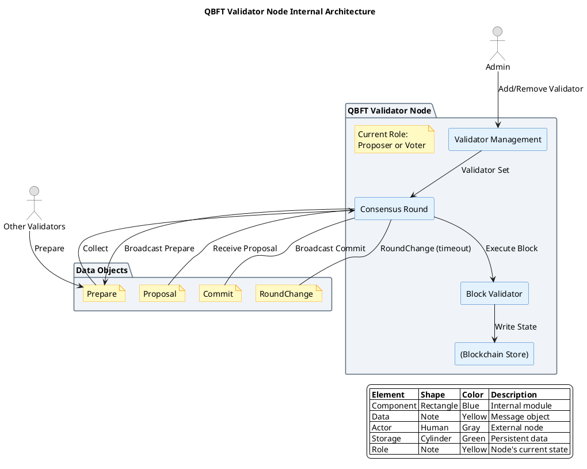

# QBFT 共识算法

## 概述

QBFT（Quorum Byzantine Fault Tolerance）是企业级 BFT 共识协议，是 IBFT 2.0 的演进版本，由 ConsenSys 为 Quorum/Besu 开发。QBFT 引入了动态验证者集和企业级权限管理，是联盟链场景的代表性 BFT 实现。采用完整的三阶段协议（Proposal → Prepare → Commit），与经典 PBFT 保持一致。

**研究范围**：本协议为成熟 BFT 实现，属于企业级/联盟链 BFT 的代表方案。
**研究深度**：deep
**对象类型**：primitive

## 关键术语

| 术语 | 定义 | 在本题中的作用 |
|------|------|---------------|
| QBFT | Quorum 的 BFT 共识协议 | 研究对象 |
| IBFT 2.0 | Istanbul BFT 2.0，QBFT 的前身 | QBFT 的演进基础 |
| Dynamic Validator Set | 动态验证者集 | QBFT 的核心创新 |
| View Change | 视图转换，Leader 故障切换 | QBFT 简化的协议 |
| Round-robin | 轮转 Leader 选举 | QBFT 的 Leader 选择方式 |

## 分析正文

### 组件架构

**架构图说明**：
- 本图聚焦于**单个 QBFT Validator 节点内部**（抽象层级 Level 3）
- **蓝色矩形**：节点内部组件（验证者管理、共识轮次、区块验证）
- **黄色 note**：数据对象（Proposal、Prepare、Commit、RoundChange）
- **灰色人形**：外部角色（其他验证者、管理员）
- **绿色圆柱体**：数据存储（区块存储）



### 节点角色说明

| 角色/类型 | 说明 | 是否投票 | 选择方式 |
|-----------|------|----------|----------|
| **Proposer** | 当前轮次的 Leader，负责提议区块 | 是（同时作为 Validator） | Round-robin 轮转 |
| **Validator** | 联盟成员节点，参与共识投票 | 是 | 验证者集成员（需授权） |
| **Admin** | 验证者集管理员 | 否 | 权限管理角色 |
| **Full Node** | 全节点，同步状态但不投票 | 否 | 无需授权 |

**重要**：Proposer 是**临时角色**，不是独立组件。每个 Validator 在某些轮次可以是 Proposer。

### 核心机制（与 PBFT 对比）

**PBFT 三阶段基线**：

| 阶段 | 作用 | 为什么需要？ |
|------|------|-------------|
| Pre-prepare | Leader 绑定视图 V 和序列号 N | 防止 Leader 为同一序列号发送两个不同请求 |
| Prepare | 验证者确认收到 Pre-prepare | 形成"准备证书"（2f+1 Prepare） |
| Commit | 验证者确认准备完成 | 形成"提交证书"，确保最终性 |

**QBFT 三阶段**：

| 阶段 | 作用 | 与 PBFT 的对应 |
|------|------|---------------|
| Proposal | Leader 提议区块 | 相当于 Pre-prepare |
| Prepare | 验证者确认收到 Proposal | 同 PBFT Prepare |
| Commit | 验证者确认提交 | 同 PBFT Commit |

**QBFT 完全遵循 PBFT 三阶段的原因**：

1. **企业场景需求**：
   - 联盟链网络条件相对稳定
   - 不需要像 Tendermint 那样依赖超时简化
   - 三阶段提供更强的安全性保证

2. **动态验证者集**：
   - 验证者集可以动态增删
   - 需要更严格的协议来保证状态一致
   - 三阶段确保所有验证者对验证者集变更达成一致

3. **View Change 保留**：
   - QBFT 保留了 PBFT 的 View Change 机制
   - 但进行了简化，适应联盟链场景
   - Leader 故障时能够安全切换

### QBFT 共识流程详解

#### Round 0：Proposer 选择

**触发条件**：新区块高度开始，或上一轮超时

**选择算法**（Round-robin）：
```java
// QBFT Proposer 选择算法（基于 Besu 实现）
public Address getProposerForRound(List<Address> validators, long height, int round) {
    // 按地址排序确保确定性
    List<Address> sorted = validators.stream().sorted().collect(toList());

    // Round-robin 选择
    int index = (int)((height + round) % validators.size());
    return sorted.get(index);
}
```

#### Round 0：Proposal 阶段

**Proposer 行为**（触发：被选为 Proposer）：

| 步骤 | 动作 | 说明 |
|------|------|------|
| 1 | 从交易池获取交易 | `txs = transactionPool.getTransactionsForBlock(maxBytes)` |
| 2 | 构造区块 | `block = Block.create(txs, height, round)` |
| 3 | 签名并广播 | `broadcast MsgProposal { block, seal, signature }` |

**验证者行为**（触发：收到 MsgProposal）：

| 步骤 | 验证内容 | 失败处理 |
|------|----------|----------|
| 1 | Proposer 签名有效 | 丢弃消息 |
| 2 | 区块格式正确 | 发送 Empty Prepare |
| 3 | 交易有效性 | 发送 Empty Prepare |
| 4 | 验证者集变更有效 | 发送 Empty Prepare |
| 5 | 通过 | 进入 Prepare 阶段 |

**超时**：`timeout_proposal = base_timeout * (round + 1)`

#### Round 0：Prepare 阶段

**触发条件**：收到有效 Proposal

**Prepare 消息格式**：
```java
class PrepareMsg {
    Hash blockHash;        // 准备的区块哈希
    long height;           // 区块高度
    int round;             // 轮次
    Signature signature;   // 验证者签名
    Address sender;        // 发送者地址
}
```

**验证者行为**：

```java
// QBFT Prepare 阶段伪代码
public void enterPrepare(ProposalMsg proposal) {
    // 1. 验证 Proposal
    if (validateProposal(proposal)) {
        PrepareMsg prepare = new PrepareMsg(
            proposal.getBlockHash(),
            height,
            round,
            sign(proposal.getBlockHash()),
            localAddress
        );

        // 2. 广播 Prepare
        broadcast(prepare);
    } else {
        // 验证失败，发送空 Prepare
        broadcast(PrepareMsg.empty(round));
    }

    // 3. 等待并收集 Prepare
    waitForPrepares();
}
```

**2f+1 Prepare 计算**：
```java
public Optional<Hash> hasPreparedCertificate(PrepareMsgCollection prepares) {
    int required = 2 * getFaultyNodeThreshold() + 1;

    for (Hash hash : prepares.getUniqueHashes()) {
        if (prepares.getCountForHash(hash) >= required) {
            return Optional.of(hash);
        }
    }
    return Optional.empty();
}
```

**超时处理**：
- 超时时间：`timeout_prepare = base_timeout * (round + 1)`
- 超时后：发送 RoundChange 消息，进入下一轮

#### Round 0：Commit 阶段

**触发条件**：收到 2f+1 条 Prepare（形成 Prepared Certificate）

**Commit 消息格式**：
```java
class CommitMsg {
    Hash blockHash;        // 提交的区块哈希
    long height;           // 区块高度
    int round;             // 轮次
    Signature signature;   // 验证者签名（包含在区块中）
    Address sender;        // 发送者地址
}
```

**验证者行为**：

```java
// QBFT Commit 阶段伪代码
public void enterCommit(Hash preparedHash) {
    // 1. 创建 Commit 消息
    CommitMsg commit = new CommitMsg(
        preparedHash,
        height,
        round,
        signAndSeal(preparedHash),
        localAddress
    );

    // 2. 广播 Commit
    broadcast(commit);

    // 3. 等待并收集 Commit
    waitForCommits();

    // 4. 检查是否达到 2f+1 Commit
    if (commits.getCountForHash(preparedHash) >= 2 * getFaultyNodeThreshold() + 1) {
        enterCommitPhase();
    }
}
```

#### Commit 阶段

**触发条件**：收到 2f+1 条 Commit（形成 Committed Certificate）

**提交行为**：
```java
public void finalizeBlock(CommitMsgCollection commits) {
    // 1. 聚合 Commit 签名形成 Committed Seal
    CommittedSeal seal = aggregateCommits(commits);

    // 2. 将区块添加到本地链
    blockchain.addBlock(committedBlock, seal);

    // 3. 进入下一高度
    startNewHeight(height + 1);
}
```

#### View Change 机制

QBFT 保留了 PBFT 的 View Change 机制，但进行了简化：

**触发条件**：
- Proposal 超时未收到
- Prepare 超时未收到 2f+1
- Commit 超时未收到 2f+1

**RoundChange 消息格式**：
```java
class RoundChangeMsg {
    int newRound;
    long height;
    Optional<PreparedCertificate> preparedCertificate;  // 如果有已准备的区块
    Signature signature;
    Address sender;
}
```

**View Change 流程**：
```java
public void handleViewChange(RoundChangeMsg msg) {
    // 1. 收集 RoundChange 消息
    roundChangeState.add(msg);

    // 2. 检查是否收到 2f+1 条 RoundChange
    if (roundChangeState.hasTwoThirds()) {
        // 3. 进入新轮次
        startNewRound(msg.getNewRound());

        // 4. 如果有最高的 Prepared Certificate，使用它
        Optional<PreparedCertificate> highest = roundChangeState.getHighestCertificate();
        if (highest.isPresent()) {
            rePropose(highest.get());
        }
    }
}
```

### QBFT 状态机

```
状态转换：

NewHeight
    ↓
NewRound (选择 Proposer)
    ↓
Propose (等待 Proposal)
    │
    ├──[收到有效 Proposal]──> Prepare ──[2f+1 Prepare]──> Commit
    │         │                                              │
    │         └──[超时]──────────────────────────────────────┤
    │                                                        │
    └──[超时]──> RoundChange ──[2f+1 RoundChange]──> NewRound
```

### 设计取舍

| 设计选择 | 优势 | 劣势 | 取舍原因 |
|----------|------|------|----------|
| 三阶段协议 | 完整 PBFT 安全性，异步网络也能工作 | 多一轮通信，延迟略高 | 企业级安全性需求 |
| Round-robin Leader | 公平性，去中心化 | Leader 切换开销 | 联盟链公平性需求 |
| 动态验证者集 | 灵活成员管理，支持治理 | 增加协议复杂度 | 企业联盟链需求 |
| 简化 View Change | 比 IBFT 更健壮 | 仍比 Tendermint 复杂 | 企业网络稳定，View Change 不频繁 |
| 权限管理 | 合规性，访问控制 | 中心化程度高 | 企业场景必需 |

## 边界与前提

### 角色归属表

| 角色 | 作用说明 | Protocol-native | Official | Third-party | 状态 |
|------|----------|-----------------|----------|-------------|------|
| Proposer | 区块提议（轮转） | ✓ | - | - | live |
| Validator | 联盟成员节点 | ✓ | - | - | live |
| Admin | 验证者集管理 | - | ✓ | - | live |
| Full Node | 同步和验证，不投票 | - | ✓ | ✓ | live |

### 能力边界

**能解决**：
- 拜占庭容错共识（≤1/3 故障节点）
- 动态验证者集管理
- 企业级权限控制
- 即时最终性保证

**不能解决**：
- 无许可公链场景
- 抗审查需求（需要管理员授权）
- 网络完全异步场景（View Change 有复杂度限制）

**故障假设**：部分同步网络
**容错比例**：≤1/3 拜占庭节点
**适用场景**：联盟链/企业链
**状态**：live（成熟）

## 相关对象关系

### 与相邻协议的关系

| 对象 | 关系类型 | 说明 |
|------|----------|------|
| IBFT 2.0 | 前身 | QBFT 是 IBFT 2.0 的演进版本 |
| PBFT | 理论基础 | QBFT 基于 PBFT 设计，保留三阶段 |
| Tendermint | 替代方案 | PoS+BFT，公链场景，两阶段优化 |
| Clique | 替代方案 | PoA 共识，更简单但不抗拜占庭 |
| Malachite | 新兴替代 | Rust 实现的高性能 BFT |
| Simplex | 新兴替代 | Commonware 的高吞吐 BFT |

## 结论

**已确认**：
- 【L1 证据】QBFT 是 IBFT 2.0 的演进版本，由 ConsenSys 开发
- 【L1 证据】支持动态验证者集管理
- 【L1 证据】采用简化的 View Change 机制
- 【L1 证据】Quorum/Besu 在使用，多个联盟链部署
- 【L1 证据】保留 PBFT 三阶段协议，与 Tendermint 的两阶段形成对比

**尚需验证**：
- 与以太坊兼容性的具体实现细节
- 企业级权限管理的配置选项

## 待确认问题

| 问题 | 状态 | 下一步 |
|------|------|--------|
| 权限管理配置细节 | 部分解决 | 阅读 Quorum 文档 |
| 与以太坊兼容性 | 已解决 | 已知完全兼容 |

## 参考资料

| 来源 | 说明 |
|------|------|
| IBFT 2.0 规范 | L1 来源 |
| ConsenSys Quorum/Besu 文档 | L1 来源 |
| https://github.com/ConsenSys/qbft | L2 来源，参考实现 |
