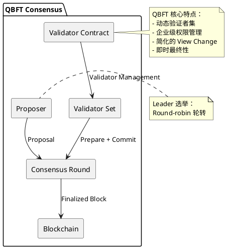

# QBFT 共识算法

## 概述

QBFT（Quorum Byzantine Fault Tolerance）是企业级 BFT 共识协议，是 IBFT 2.0 的演进版本，由 ConsenSys 为 Quorum/Besu 开发。QBFT 引入了动态验证者集和企业级权限管理，是联盟链场景的代表性 BFT 实现。

**研究范围**：本协议为成熟 BFT 实现，属于企业级/联盟链 BFT 的代表方案。

## 关键术语

| 术语 | 定义 | 在本题中的作用 |
|------|------|---------------|
| QBFT | Quorum 的 BFT 共识协议 | 研究对象 |
| IBFT 2.0 | Istanbul BFT 2.0，QBFT 的前身 | QBFT 的演进基础 |
| Dynamic Validator Set | 动态验证者集 | QBFT 的核心创新 |
| View Change | 视图转换，Leader 故障切换 | QBFT 简化的协议 |

## 分析正文

### 组件架构

### 核心机制（与传统 BFT 差异）

**传统 BFT（PBFT）基线**：
- 三阶段协议：Pre-prepare → Prepare → Commit
- 固定验证者集
- 需要主节点
- 复杂 View Change 协议

**QBFT 核心差异**：

| 维度 | 传统 BFT (PBFT) | QBFT |
|------|-----------------|------|
| 验证者集 | 固定 | 动态（可增删验证者） |
| Leader 选举 | 固定主节点 | Round-robin 轮转 |
| View Change | 复杂协议 | 简化处理 |
| 权限模型 | 无 | 企业级权限管理 |
| 最终性 | 即时 | 即时（确定性） |
| 实现语言 | 多种 | Go/Java |

**QBFT 三阶段流程**：

- 【S1】**Proposal**：Leader 提议区块，广播给所有验证者
- 【S2】**Prepare**：验证者广播 Prepare 消息，收集 2f+1 个 Prepare 后进入 Commit 阶段
- 【S3】**Commit**：收集 2f+1 个 Prepare 后广播 Commit，收集 2f+1 个 Commit 后提交区块

### 设计取舍

| 设计选择 | 优势 | 劣势 | 取舍原因 |
|----------|------|------|----------|
| 动态验证者集 | 灵活的成员管理，支持治理 | 增加协议复杂度，需要额外的验证者管理交易 | 企业联盟链成员管理需求 |
| Round-robin Leader | 公平性，去中心化，避免单点控制 | 可能降低性能，Leader 切换开销 | 联盟链公平性需求 |
| 简化 View Change | 降低协议复杂度，易于实现 | 极端网络条件下恢复可能较慢 | 企业网络环境相对稳定 |
| 即时最终性 | 交易不可逆转，确定性高 | 延迟略高于概率最终性 | 企业级确定性需求 |
| 权限管理 | 合规性，访问控制 | 中心化程度高，需要信任管理员 | 企业场景必需 |

## 边界与前提

### 角色归属表

| 角色 | 作用说明 | Protocol-native | Official | Third-party | 状态 |
|------|----------|-----------------|----------|-------------|------|
| Proposer | 区块提议（轮转） | ✓ | - | - | live |
| Validator | 联盟成员节点 | ✓ | - | - | live |
| Admin | 验证者集管理 | - | ✓ | - | live |
| Full Node | 同步和验证，不质押 | - | ✓ | ✓ | live |

### 能力边界

**能解决**：
- 拜占庭容错共识（≤1/3 故障节点）
- 动态验证者集管理
- 企业级权限控制
- 即时最终性保证

**不能解决**：
- 无许可公链场景
- 网络完全异步场景
- 抗审查需求

**故障假设**：部分同步网络
**容错比例**：≤1/3 拜占庭节点
**适用场景**：联盟链/企业链
**状态**：live（成熟）

## 相关对象关系

### 与相邻协议的关系

| 对象 | 关系类型 | 说明 |
|------|----------|------|
| IBFT 2.0 | 前身 | QBFT 是 IBFT 2.0 的演进版本 |
| PBFT | 理论基础 | QBFT 基于 PBFT 简化设计 |
| Tendermint | 替代方案 | PoS+BFT，公链场景 |
| Clique | 替代方案 | PoA 共识，更简单但不抗拜占庭 |
| Malachite | 新兴替代 | Rust 实现的高性能 BFT |
| Simplex | 新兴替代 | Commonware 的高吞吐 BFT |

## 结论

**已确认**：
- 【L1 证据】QBFT 是 IBFT 2.0 的演进版本，由 ConsenSys 开发
- 【L1 证据】支持动态验证者集管理
- 【L1 证据】采用简化的 View Change 机制
- 【L1 证据】Quorum/Besu 在使用，多个联盟链部署

**尚需验证**：
- 与以太坊兼容性的具体实现细节
- 企业级权限管理的配置选项

## 待确认问题

| 问题 | 状态 | 下一步 |
|------|------|--------|
| 权限管理配置细节 | 部分解决 | 阅读 Quorum 文档 |
| 与以太坊兼容性 | 已解决 | 已知完全兼容 |

## 参考资料

| 来源 | 说明 |
|------|------|
| QBFT 规范（IBFT 2.0） | L1 来源 |
| ConsenSys Quorum/Besu 文档 | L1 来源 |
| https://github.com/ConsenSys/qbft | L2 来源，参考实现 |
