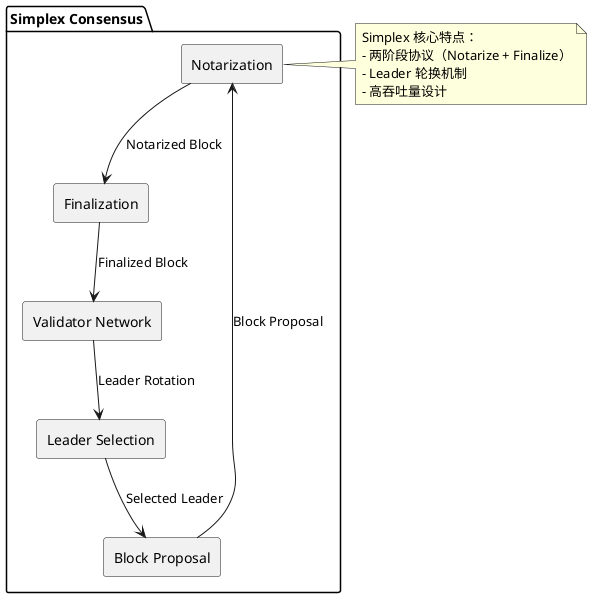

# Simplex 共识算法

## 概述

Simplex 是由 Commonware 团队开发的 BFT 共识算法，设计目标是提供高吞吐量的拜占庭容错共识。采用简化的两阶段协议（Notarize + Finalize）来减少通信轮次，提升性能。

**研究范围**：本协议为新兴 BFT 变体，属于 Commonware 的核心共识协议。

## 关键术语

| 术语 | 定义 | 在本题中的作用 |
|------|------|---------------|
| Simplex | Commonware 的 BFT 共识协议 | 研究对象 |
| Notarization | 公证阶段，验证区块有效性 | Simplex 协议第一阶段 |
| Finalization | 最终化阶段，确认区块 | Simplex 协议第二阶段 |

## 分析正文

### 组件架构

### 核心机制（与传统 BFT 差异）

**传统 BFT（PBFT）基线**：
- 三阶段协议：Pre-prepare → Prepare → Commit
- O(n²) 消息复杂度
- View Change 复杂

**Simplex 核心差异**：

| 维度 | 传统 BFT (PBFT) | Simplex |
|------|-----------------|---------|
| 协议阶段 | 三阶段 | 两阶段（Notarize + Finalize） |
| Leader 选举 | 固定主节点 | 轮换机制 |
| View Change | 复杂协议 | 简化处理 |
| 消息复杂度 | O(n²) | 可能有优化 |
| 设计目标 | 一致性 | 一致性 + 高吞吐量 |

**协议流程**：

- 【S1】**Leader Selection**：通过轮换机制选择当前轮次的 Leader
- 【S2】**Notarization**：验证者对区块进行公证投票
- 【S3】**Finalization**：收集足够公证票后进入最终化

### 设计取舍

| 设计选择 | 优势 | 劣势 | 取舍原因 |
|----------|------|------|----------|
| 两阶段协议 | 减少通信轮次，降低延迟 | 可能需要更强的同步假设 | 性能优化优先 |
| Leader 轮换 | 去中心化，抗审查，公平性 | 领导切换可能带来开销 | 避免单点控制 |
| 简化 View Change | 降低协议复杂度 | 极端场景恢复可能较慢 | 常见场景优先 |

## 边界与前提

### 角色归属表

| 角色 | 作用说明 | Protocol-native | Official | Third-party | 状态 |
|------|----------|-----------------|----------|-------------|------|
| Leader | 区块提议（轮换） | ✓ | - | - | early |
| Validator | 投票验证 | ✓ | - | - | early |

### 能力边界

**能解决**：
- 拜占庭容错共识（≤1/3 故障节点）
- 高吞吐量交易处理
- Leader 公平轮换

**不能解决**：
- 网络层通信问题
- 数据可用性问题
- 应用层逻辑

**故障假设**：部分同步网络
**容错比例**：1/3 拜占庭节点（待确认）
**状态**：early implementation

## 相关对象关系

### 与相邻协议的关系

| 对象 | 关系类型 | 说明 |
|------|----------|------|
| Tendermint | 替代方案 | Go 实现的 PoS+BFT，更成熟 |
| QBFT | 替代方案 | 企业级 BFT，联盟链场景 |
| Malachite | 替代方案 | Rust 实现的新兴 BFT |

## 结论

**已确认**：
- 【L1 证据】Simplex 是 Commonware 的 BFT 共识协议
- 【L1 证据】采用两阶段协议（Notarize + Finalize）
- 【L1 证据】设计目标是高吞吐量

**尚需验证**：
- 详细协议流程和消息格式
- Leader 轮换的具体机制
- 实际部署状态和性能基准

## 待确认问题

| 问题 | 状态 | 下一步 |
|------|------|--------|
| 详细协议流程 | 未解决 | 需要阅读源码 |
| Leader 轮换机制 | 未解决 | 需要官方文档 |
| 实际部署状态 | 未解决 | 需要验证主网进展 |

## 参考资料

| 来源 | 说明 |
|------|------|
| https://simplex.blog/ | L1 来源，Simplex 官方博客 |
| Commonware 文档 | L1 来源，待补充 |
