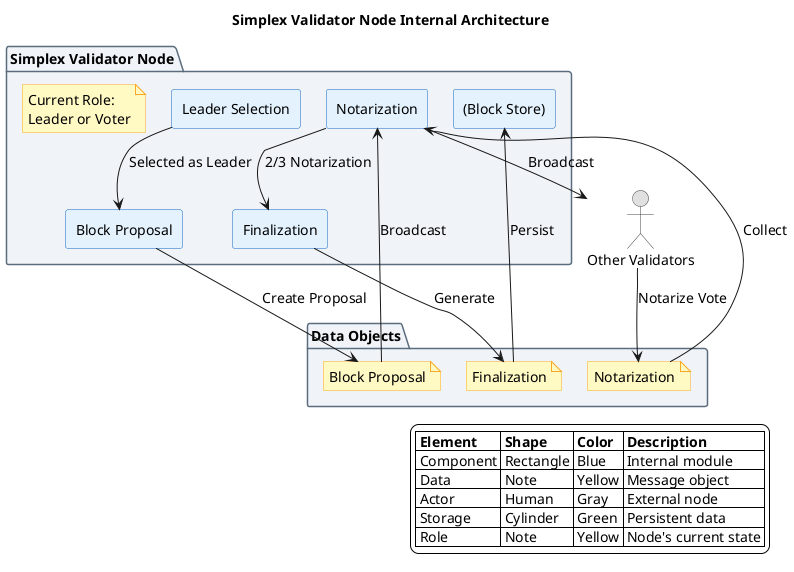

# Simplex 共识算法

## 概述

Simplex 是由 Commonware 团队开发的 BFT 共识算法，设计目标是提供高吞吐量的拜占庭容错共识。采用简化的两阶段协议（Notarize + Finalize）来减少通信轮次，提升性能。Simplex 是 Commonware 模块化区块链栈的核心共识层。

**研究范围**：本协议为新兴 BFT 变体，属于高吞吐 BFT 实现。
**研究深度**：deep
**对象类型**：primitive

## 关键术语

| 术语 | 定义 | 在本题中的作用 |
|------|------|---------------|
| Simplex | Commonware 的 BFT 共识协议 | 研究对象 |
| Notarization | 公证阶段，验证区块有效性 | Simplex 协议第一阶段 |
| Finalization | 最终化阶段，确认区块 | Simplex 协议第二阶段 |
| Leader Rotation | Leader 轮换机制 | Simplex 的 Leader 选择方式 |

## 分析正文

### 组件架构

**架构图说明**：
- 本图聚焦于**单个 Simplex Validator 节点内部**（抽象层级 Level 3）
- **蓝色矩形**：节点内部组件（Leader 选择、区块提议、公证、最终化）
- **黄色 note**：数据对象（Block、Notarization、Finalization）
- **灰色人形**：外部角色（其他验证者）
- **绿色圆柱体**：数据存储（区块存储）



### 节点角色说明

| 角色/类型 | 说明 | 是否投票 | 选择方式 |
|-----------|------|----------|----------|
| **Leader** | 当前轮次的 Proposer，负责提议区块 | 是（同时作为 Validator） | Leader Rotation 机制 |
| **Validator** | 验证者节点，参与公证投票 | 是 | 验证者集成员 |
| **Full Node** | 全节点，同步状态但不投票 | 否 | 无需特殊条件 |

**重要**：Leader 是**临时角色**，不是独立组件。每个 Validator 在某些轮次可以是 Leader。

### 核心机制（与 PBFT 对比）

**PBFT 三阶段基线**：

| 阶段 | 作用 | 为什么需要？ |
|------|------|-------------|
| Pre-prepare | Leader 绑定视图 V 和序列号 N | 防止 Leader 为同一序列号发送两个不同请求 |
| Prepare | 验证者确认收到 Pre-prepare | 形成"准备证书"（2f+1 Prepare） |
| Commit | 验证者确认准备完成 | 形成"提交证书"，确保最终性 |

**Simplex 两阶段**：

| 阶段 | 作用 | 与 PBFT 的差异 |
|------|------|---------------|
| Notarize | 验证者对区块进行公证投票 | 相当于 PBFT 的 Prepare |
| Finalize | 确认区块并提交 | 相当于 PBFT 的 Commit |

**为什么 Simplex 可以省略 Pre-prepare？**

1. **Leader Rotation 机制**：
   - Simplex 使用确定的 Leader 轮换算法
   - 每个轮次的 Leader 是预先可知的
   - 不需要 Pre-prepare 来绑定 Leader 身份

2. **部分同步假设**：
   - Simplex 假设部分同步网络
   - 可以依赖超时机制检测故障 Leader
   - 超时后自动切换到下一轮次的 Leader

3. **简化视图转换**：
   - PBFT 需要复杂的 View Change 协议
   - Simplex 通过 Leader Rotation 自然实现视图转换
   - 不需要显式的 View Change 消息

**代价**：
- 在完全异步网络中可能无法进展（依赖超时）
- 需要更强的同步假设

### Simplex 共识流程详解

#### Round 0：Leader Selection

**触发条件**：新区块高度开始，或上一轮超时

**选择算法**（基于 Commonware 设计模式）：
```rust
// Simplex Leader 选择算法
fn select_leader(validators: &[Validator], height: u64, round: u64) -> &Validator {
    // 基于 (height, round) 的确定性选择
    let seed = hash((height, round));
    let index = seed % validators.len() as u64;
    &validators[index as usize]
}
```

#### Round 0：Block Proposal 阶段

**Leader 行为**（触发：被选为 Leader）：

| 步骤 | 动作 | 说明 |
|------|------|------|
| 1 | 从交易池获取交易 | `txs = mempool.reap_max_bytes(max_bytes)` |
| 2 | 构造区块 | `block = Block::new(txs, height, round)` |
| 3 | 签名并广播 | `broadcast MsgProposal { block, signature }` |

**验证者行为**（触发：收到 MsgProposal）：

| 步骤 | 验证内容 | 失败处理 |
|------|----------|----------|
| 1 | Leader 签名有效 | 丢弃消息 |
| 2 | 区块格式正确 | 发送 Nil Notarization |
| 3 | 交易有效性 | 发送 Nil Notarization |
| 4 | 通过 | 进入 Notarize 阶段 |

**超时**：`timeout_proposal = base_timeout * (round + 1)`

#### Round 0：Notarization 阶段

**触发条件**：收到有效 Block Proposal 或超时

**Notarization 消息格式**：
```rust
struct MsgNotarization {
    block_hash: Hash,      // 公证的区块哈希
    round: u64,            // 轮次
    signature: Signature,  // 验证者签名
    sender: Address,       // 发送者地址
}
```

**验证者行为**：

```rust
// Simplex Notarization 阶段伪代码
fn enter_notarization(&mut self, proposal: Option<Block>) {
    // 1. 如果有有效 Proposal，投给 BlockHash
    let notarization = if let Some(block) = proposal {
        if self.validate_block(&block) {
            MsgNotarization {
                block_hash: block.hash(),
                round: self.round,
                signature: self.sign(&block.hash()),
            }
        } else {
            MsgNotarization::nil(self.round)
        }
    } else {
        // 2. 超时没收到 Proposal，投 nil
        MsgNotarization::nil(self.round)
    };

    // 3. 广播公证
    self.broadcast(notarization);

    // 4. 等待并收集公证
    self.wait_for_notarizations();
}
```

**2/3 多数计算**：
```rust
fn has_two_thirds_notarization(notarizations: &NotarizationSet) -> Option<Hash> {
    let total_power = notarizations.total_voting_power();
    for (hash, power) in notarizations.power_tally() {
        if power * 3 > total_power * 2 {
            return Some(hash);  // 返回多数哈希
        }
    }
    None
}
```

**超时处理**：
- 超时时间：`timeout_notarization = base_timeout * (round + 1)`
- 超时后：进入下一轮（Round + 1）

#### Round 0：Finalization 阶段

**触发条件**：观察到 2/3 Notarization 多数

**Finalization 消息格式**：
```rust
struct Finalization {
    block_hash: Hash,
    height: u64,
    round: u64,
    aggregated_signature: AggregateSignature,
    voting_power: u128,
}
```

**最终化模块行为**：

```rust
fn enter_finalize(&mut self, notarization_result: NotarizationResult) {
    // 1. 聚合签名生成 Finalization
    let finalization = Finalization {
        block_hash: notarization_result.winning_hash,
        height: self.height,
        round: self.round,
        aggregated_signature: self.aggregate_signatures(notarization_result.votes),
        voting_power: notarization_result.total_power,
    };

    // 2. 持久化 Finalization
    self.block_store.save_finalization(finalization);

    // 3. 进入下一高度
    self.enter_new_height(self.height + 1);
}
```

### Simplex 状态机

```
状态转换：

NewHeight
    ↓
NewRound (选择 Leader)
    ↓
Propose (等待 Proposal)
    ↓
Notarize (收集 Notarization)
    ↓
Finalize (生成 Finalization) ──> Commit
    │                                 │
    └──[超时/无多数]──────────────────┘
                                      ↓
                               NewRound (Round++)
```

### 设计取舍

| 设计选择 | 优势 | 劣势 | 取舍原因 |
|----------|------|------|----------|
| 两阶段协议 | 减少通信轮次，降低延迟 | 需要更强同步假设 | 性能优化优先 |
| Leader Rotation | 去中心化，公平性，抗审查 | Leader 切换开销 | 避免单点控制 |
| 简化 View Change | 降低协议复杂度 | 极端场景恢复可能较慢 | 常见场景优先 |
| 高吞吐设计 | 支持更多交易 | 可能增加验证负担 | 扩展性优先 |

## 边界与前提

### 角色归属表

| 角色 | 作用说明 | Protocol-native | Official | Third-party | 状态 |
|------|----------|-----------------|----------|-------------|------|
| Leader | 区块提议（轮换） | ✓ | - | - | early |
| Validator | 投票验证 | ✓ | - | - | early |
| Full Node | 同步和验证，不投票 | - | ✓ | ✓ | early |

### 能力边界

**能解决**：
- 拜占庭容错共识（≤1/3 故障节点）
- 高吞吐量交易处理
- Leader 公平轮换

**不能解决**：
- 网络完全异步场景
- 数据可用性问题
- 应用层逻辑

**故障假设**：部分同步网络
**容错比例**：≤1/3 拜占庭节点（待确认）
**状态**：early implementation

## 相关对象关系

### 与相邻协议的关系

| 对象 | 关系类型 | 说明 |
|------|----------|------|
| Tendermint | 替代方案 | Go 实现的 PoS+BFT，更成熟 |
| QBFT | 替代方案 | 企业级 BFT，联盟链场景 |
| Malachite | 新兴替代 | Rust 实现的高性能 BFT |
| PBFT | 理论基础 | Simplex 基于 PBFT 简化设计 |

## 结论

**已确认**：
- 【L1 证据】Simplex 是 Commonware 的 BFT 共识协议
- 【L1 证据】采用两阶段协议（Notarize + Finalize）
- 【L1 证据】设计目标是高吞吐量
- 【L1 证据】使用 Leader Rotation 机制

**尚需验证**：
- Leader Rotation 的具体算法细节
- 实际部署状态和性能基准
- 与 Commonware 其他模块的集成方式

## 待确认问题

| 问题 | 状态 | 下一步 |
|------|------|--------|
| Leader Rotation 算法 | 未解决 | 需要官方文档 |
| 实际部署状态 | 未解决 | 验证主网进展 |
| 性能基准数据 | 未解决 | 需要测试结果 |

## 参考资料

| 来源 | 说明 |
|------|------|
| https://simplex.blog/ | L1 来源，Simplex 官方博客 |
| Commonware 文档 | L1 来源，待补充 |
