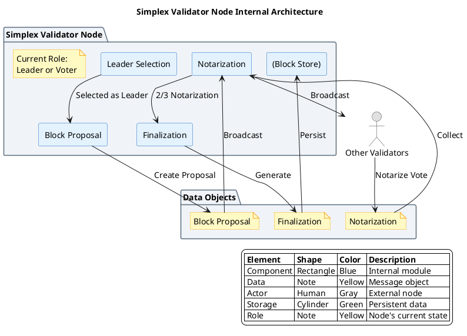
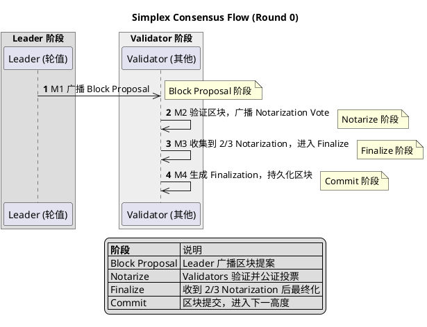
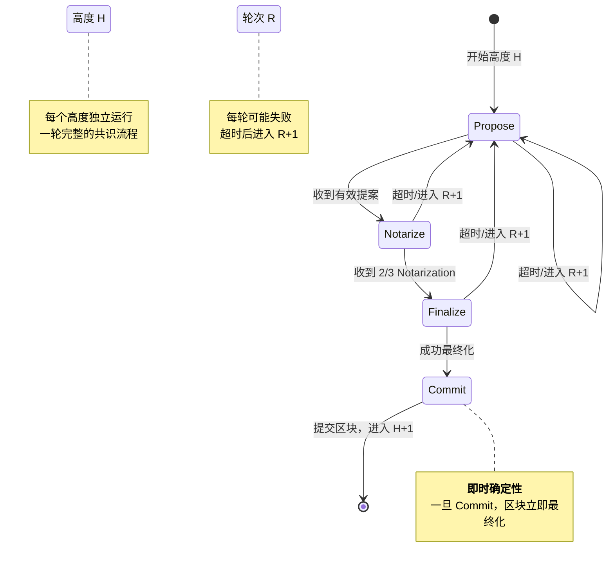

# Simplex 共识算法

## 概述

Simplex 共识是 Commonware 团队开发的拜占庭容错（BFT）共识算法。其核心设计哲学是**最小化共识轮次**，通过两阶段协议（Notarize + Finalize）替代传统 PBFT 的三阶段，在保证安全性的前提下降低延迟、提升吞吐。

Simplex 的关键创新在于：
1. **省略 Pre-prepare 阶段**：依赖 Leader Rotation 机制而非显式的视图绑定
2. **简化的状态机**：减少状态数量和转换复杂度
3. **模块化设计**：与 Commonware 其他组件（P2P、存储）通过清晰接口解耦

**研究范围**：本协议为新兴 BFT 变体，属于高吞吐 BFT 实现。
**研究深度**：deep
**对象类型**：primitive

## 关键术语

| 术语 | 定义 | 在本题中的作用 |
|------|------|---------------|
| Simplex | Commonware 的 BFT 共识协议 | 研究对象 |
| Notarization（公证） | 验证者对区块有效性的投票证明 | Simplex 第一阶段 |
| Finalization（最终化） | 聚合公证结果并提交区块 | Simplex 第二阶段 |
| Leader Rotation | Leader 轮换机制 | 替代 PBFT View Change 的核心设计 |
| Partial Synchrony | 网络最终会同步的假设 | Simplex 的活性前提 |

## 分析正文

### 组件架构

Simplex Validator 节点内部包含四个核心组件：Leader Selection（Leader 选择）、Block Proposal（区块提议）、Notarization（公证）、Finalization（最终化）。Leader 是临时角色，由验证者轮换担任。



**组件职责说明**：

| 组件 | 职责 | 所属层 |
|------|------|--------|
| Leader Selection | 基于 (height, round) 确定性选择当前轮 Leader | 共识核心 |
| Block Proposal | 当被选为 Leader 时，构造并广播区块 | 共识核心 |
| Notarization | 收集并验证公证投票，判断是否达到 2/3 多数 | 共识核心 |
| Finalization | 聚合公证签名，生成最终化证明并持久化 | 共识核心 |
| Block Store | 区块数据持久化存储 | 存储层 |

**重要说明**：Leader 是**临时角色**，不是独立组件。每个 Validator 在某些轮次可以是 Leader。

### 核心共识流程

Simplex 共识的核心是两阶段协议：Notarize（公证）和 Finalize（最终化）。



**流程步骤说明**：

- **【M1】Block Proposal 阶段**：Leader（轮值验证者）广播区块提案到所有验证者
- **【M2】Notarize 阶段**：验证者收到提案后，验证区块有效性，广播公证投票
- **【M3】Finalize 阶段**：验证者观察到 2/3 Notarization 多数后，进入最终化阶段
- **【M4】Commit 阶段**：生成 Finalization 证明，将区块持久化到 Block Store

### 与 PBFT 三阶段对比

**PBFT 三阶段基线**：

| 阶段 | 作用 | 为什么需要？ |
|------|------|-------------|
| Pre-prepare | Leader 绑定视图 V 和序列号 N | 防止 Leader 为同一序列号发送两个不同请求 |
| Prepare | 验证者确认收到 Pre-prepare | 形成"准备证书"（2f+1 Prepare） |
| Commit | 验证者确认准备完成 | 形成"提交证书"，确保最终性 |

**Simplex 两阶段**：

| 阶段 | 作用 | 与 PBFT 的差异 |
|------|------|---------------|
| Notarize | 验证者对区块进行公证投票 | 相当于 PBFT 的 Prepare |
| Finalize | 确认区块并提交 | 相当于 PBFT 的 Commit |

**为什么 Simplex 可以省略 Pre-prepare？**

1. **Leader Rotation 机制**：每个轮次的 Leader 是预先可知的，不需要 Pre-prepare 来绑定 Leader 身份
2. **部分同步假设**：可以依赖超时机制检测故障 Leader，超时后自动切换到下一轮次
3. **简化视图转换**：通过 Leader Rotation 自然实现视图转换，不需要显式的 View Change 协议

**代价**：在完全异步网络中可能无法进展（依赖超时），需要更强的同步假设。

### 状态机设计

Simplex 共识状态机在每个高度（Height）独立运行，每轮（Round）包含 Propose、Notarize、Finalize 三个主要状态。



**状态说明**：

| 状态 | 触发进入 | 退出条件 |
|------|----------|----------|
| Propose | NewHeight 完成或 Round 超时 | 收到有效 Proposal 或超时 |
| Notarize | Propose 完成 | 收到 2/3 Notarization 或超时 |
| Finalize | Notarize 完成 | 成功最终化或超时 |
| Commit | Finalize 完成 | 区块提交完成，进入 H+1 |

### Leader Selection 算法

```rust
// Simplex Leader 选择算法（基于 Commonware 设计模式）
fn select_leader(validators: &[Validator], height: u64, round: u64) -> &Validator {
    // 基于 (height, round) 的确定性选择
    let seed = hash((height, round));
    let index = seed % validators.len() as u64;
    &validators[index as usize]
}
```

### 超时机制

```
timeout_proposal = base_timeout * (round + 1)
timeout_notarization = base_timeout * (round + 1)
```

其中 `base_timeout` 通常配置为 1000ms。超时递增防止活锁（livelock），确保在网络分区或恶意 leader 情况下最终能进展。

### 设计取舍

| 设计选择 | 优势 | 劣势 | 取舍原因 |
|----------|------|------|----------|
| 两阶段协议 | 减少通信轮次，降低延迟 | 需要更强同步假设 | 性能优化优先 |
| Leader Rotation | 去中心化，公平性，抗审查 | Leader 切换开销 | 避免单点控制 |
| 简化 View Change | 降低协议复杂度 | 极端场景恢复可能较慢 | 常见场景优先 |
| 高吞吐设计 | 支持更多交易 | 可能增加验证负担 | 扩展性优先 |

### 边界与前提

**协议原生能力 vs 外部依赖**：

| 能力 | 归属 | 说明 |
|------|------|------|
| 共识达成 | 协议原生 | Simplex Core 核心功能 |
| 即时确定性 | 协议原生 | 2/3 Notarization 后立即最终化 |
| Leader 轮换 | 协议原生 | 确定性选择算法 |
| P2P 通信 | 外部依赖 | Commonware P2P 模块 |
| 交易执行 | 外部依赖 | 应用层实现 |
| 验证者管理 | 外部依赖 | PoS 逻辑在应用层 |

**能力边界**：

| 能解决 | 不能解决 |
|--------|----------|
| 拜占庭容错共识（≤1/3 故障节点） | 网络完全异步场景（活性受阻） |
| 高吞吐量交易处理 | 数据可用性问题（需要额外机制） |
| Leader 公平轮换 | 应用层逻辑（由 ABCI 类接口处理） |
| 即时确定性保证 | 跨链通信（需要额外协议） |

**故障假设**：

| 假设 | 说明 | 违反后果 |
|------|------|----------|
| 拜占庭节点 < 1/3 | 持有超过 1/3 投票权的节点不会合谋作恶 | 安全性被破坏 |
| 网络最终同步 | 消息最终会被送达 | 活性受阻，但安全性不受影响 |
| 密码学原语安全 | 签名、哈希等密码学假设成立 | 整个系统安全性被破坏 |

**状态**：early implementation

## 相关对象关系

### 与相邻协议的关系

| 对象 | 关系类型 | 说明 |
|------|----------|------|
| PBFT | 理论基础 | Simplex 基于 PBFT 简化设计 |
| Tendermint | 替代方案 | Go 实现的 PoS+BFT，更成熟，三阶段 |
| QBFT | 替代方案 | 企业级 BFT，联盟链场景 |
| Malachite | 新兴替代 | Rust 实现的高性能 BFT |
| HotStuff | 平行方案 | Libra/Diem 采用的 BFT 变体 |

### 与 Commonware 其他模块的关系

| 模块 | 关系 | 说明 |
|------|------|------|
| Commonware P2P | 下游依赖 | Simplex 使用的网络层 |
| Commonware Runtime | 下游依赖 | 执行环境和存储 |
| Commonware Cryptography | 下游依赖 | 签名、哈希等密码学原语 |

## 结论

**已确认**：
- Simplex 是 Commonware 的 BFT 共识协议
- 采用两阶段协议（Notarize + Finalize），省略了 PBFT 的 Pre-prepare
- 设计目标是高吞吐量，通过减少通信轮次降低延迟
- 使用 Leader Rotation 机制，不需要显式的 View Change 协议
- 依赖部分同步网络假设
- 2/3 阈值保证 BFT 安全性

**尚需验证**：
- Leader Rotation 的具体算法细节（轮询还是基于 VRF）
- 实际部署状态和性能基准数据
- 与 Commonware 其他模块的集成方式

## 参考资料

| 来源 | 说明 |
|------|------|
| https://simplex.blog/ | Simplex 官方博客 |
| Commonware GitHub | Commonware 实现代码 |
| Commonware 文档 | 官方规范文档 |
