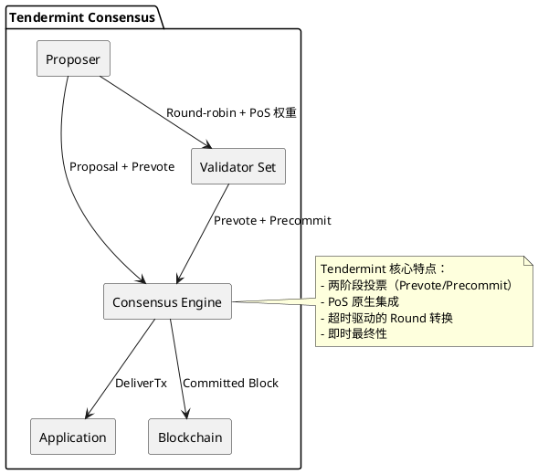

# Tendermint 共识算法

## 概述

Tendermint 是 Cosmos 生态的核心共识算法，是第一个将 PoS（权益证明）与 BFT（拜占庭容错）原生集成的共识协议。采用简化的两阶段投票（Prevote/Precommit）和超时驱动的视图转换机制，提供即时最终性保证。

**研究范围**：本协议为成熟 BFT 实现，属于 PoS+BFT 的代表性方案。

## 关键术语

| 术语 | 定义 | 在本题中的作用 |
|------|------|---------------|
| Tendermint | Cosmos 的 BFT 共识协议 | 研究对象 |
| Prevote/Precommit | 两阶段投票 | Tendermint 的核心机制 |
| Round-robin Proposer | 轮转提议者 | Leader 选举机制 |
| PoS Integration | PoS 原生集成 | Tendermint 的创新点 |

## 分析正文

### 组件架构

### 核心机制（与传统 BFT 差异）

**传统 BFT（PBFT）基线**：
- 三阶段：Pre-prepare → Prepare → Commit
- View Change 复杂，需要显式协议
- 固定主节点
- 无原生 PoS 集成

**Tendermint 核心差异**：

| 维度 | 传统 BFT (PBFT) | Tendermint |
|------|-----------------|------------|
| 投票阶段 | 三阶段 | 两阶段 (Prevote/Precommit) |
| Leader 选举 | 固定主节点 | Round-robin + PoS 权重 |
| View Change | 显式视图转换协议 | 超时自动进入下一轮 (Round) |
| PoS 集成 | 无 | 原生集成（验证者质押） |
| 最终性 | 即时 | 即时（确定性） |
| 实现语言 | 多种 | Go |

**【S1→S3】Tendermint 共识流程**：

- 【S1】**Proposer 选择**：基于 PoS 权重和 round-robin 选择当前高度的提议者。验证者按质押权重排序，依次轮转。
- 【S2】**Prevote 阶段**：验证者对 proposal 进行 prevote 投票。收集到 2/3 多数 prevote 后进入下一阶段。
- 【S3】**Precommit 阶段**：prevote 通过后进行 precommit 投票。收集到 2/3 precommit 后区块被提交，具有即时最终性。

### 设计取舍

| 设计选择 | 优势 | 劣势 | 取舍原因 |
|----------|------|------|----------|
| 两阶段投票 | 减少一轮通信，延迟更低 | 需要更严格的同步假设 | 优化区块确认时间 |
| Round-robin Proposer | 去中心化，抗审查，公平性 | 频繁 Leader 切换可能降低性能 | 避免单点故障 |
| 超时驱动 | 简化视图转换，自动恢复 | 网络不稳定时可能多轮 | 简化协议复杂度 |
| PoS 原生集成 | 无需额外共识层，经济安全 | 验证者集相对固定，进入门槛高 | 与 Cosmos 经济模型对齐 |

## 边界与前提

### 角色归属表

| 角色 | 作用说明 | Protocol-native | Official | Third-party | 状态 |
|------|----------|-----------------|----------|-------------|------|
| Proposer | 区块提议（轮转） | ✓ | - | - | live |
| Validator | 投票验证（需质押） | ✓ | - | - | live |
| Full Node | 同步和验证，不质押 | - | ✓ | ✓ | live |
| Light Client | 轻节点，验证头部 | - | ✓ | ✓ | live |

### 能力边界

**能解决**：
- 拜占庭容错共识（≤1/3 故障节点）
- PoS 验证者管理
- 即时最终性保证
- 自恢复（超时驱动）

**不能解决**：
- 网络完全异步场景
- 长程攻击（需要检查点）
- 应用层逻辑

**故障假设**：部分同步网络
**容错比例**：≤1/3 拜占庭节点
**状态**：live（成熟）

## 相关对象关系

### 与相邻协议的关系

| 对象 | 关系类型 | 说明 |
|------|----------|------|
| PBFT | 前身 | Tendermint 简化了 PBFT 的三阶段 |
| QBFT | 替代方案 | 企业级 BFT，联盟链场景 |
| HotStuff | 演进方案 | Facebook Libra 的 BFT 协议，进一步优化 |
| Malachite | 新兴替代 | Rust 实现的高性能 BFT |
| Simplex | 新兴替代 | Commonware 的高吞吐 BFT |

## 结论

**已确认**：
- 【L1 证据】Tendermint 是第一个 PoS+BFT 原生集成的共识协议
- 【L1 证据】采用两阶段投票（Prevote/Precommit）
- 【L1 证据】超时驱动的 Round 转换机制
- 【L1 证据】Cosmos Hub 及多个 Cosmos SDK 链在使用

**尚需验证**：
- 与 IBC 跨链协议的深度集成细节
- Cosmos Hub 升级（如 Atlantis 升级）后的变化

## 待确认问题

| 问题 | 状态 | 下一步 |
|------|------|--------|
| IBC 集成细节 | 部分解决 | 阅读 IBC 规范 |
| v1 升级后变化 | 未解决 | 追踪 Cosmos Hub 升级 |

## 参考资料

| 来源 | 说明 |
|------|------|
| Tendermint 官方文档 | L1 来源 |
| Cosmos Hub 文档 | L1 来源 |
| https://github.com/tendermint/tendermint | L2 来源，参考实现 |
