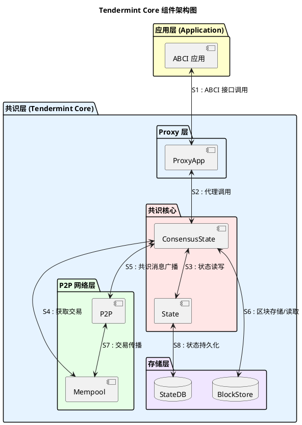
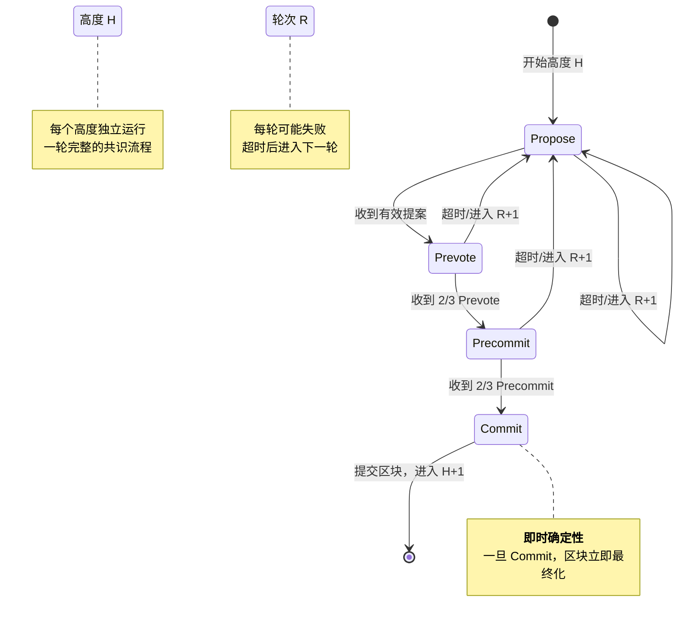
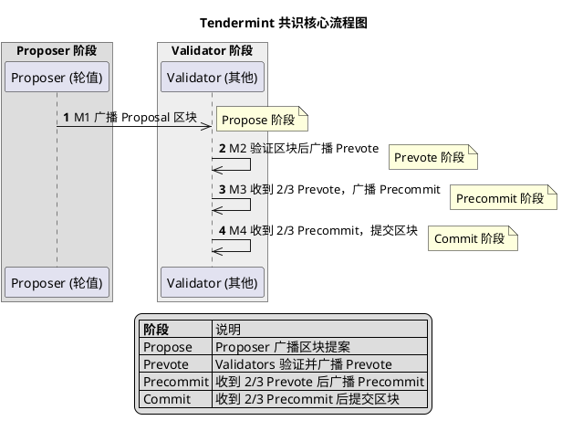
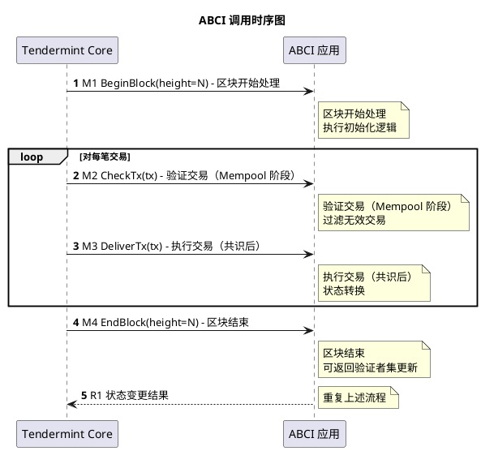

# Tendermint 共识算法

## 概述

Tendermint 是一种拜占庭容错（BFT）共识算法，基于 PBFT 改进而来，采用 PoS 作为 Sybil 抵抗机制。其核心特征包括即时确定性（instant finality）、leader 轮换机制、以及通过 ABCI 接口实现应用层与共识层解耦。

**研究范围**：Tendermint Core 共识协议本身（v0.33+ 版本），覆盖组件架构、共识状态机、安全性假设、以及与 PBFT 的关系。

**研究深度**：deep

**对象类型**：primitive

## 关键术语

| 术语 | 定义 | 在本题中的作用 |
|------|------|---------------|
| BFT (Byzantine Fault Tolerance) | 拜占庭容错，系统在部分节点恶意或故障情况下仍能正确运行的能力 | Tendermint 的核心安全目标 |
| 即时确定性 (Instant Finality) | 交易一旦被确认即不可逆转，无需像 PoW 那样等待多个区块确认 | Tendermint 区别于 probabilistic finality 的关键特征 |
| Proposer | 每轮共识中负责提出区块的节点（类似 PBFT 的 primary） | leader 轮换机制的核心角色 |
| Prevote / Precommit | 共识状态机中的两个投票阶段 | BFT 共识达成两阶段投票的核心步骤 |
| Round | 共识的一轮，包含完整的 Propose-Prevote-Precommit 流程 | 处理 leader 失败时的重试机制 |
| Step | 一轮中的具体步骤（ProposeStep、PrevoteStep、PrecommitStep） | 状态机状态转换的粒度 |
| 2/3 阈值 | 超过 2/3 投票权加权即达成共识 | BFT 安全性的数学基础 |
| ABCI | Application-Blockchain Interface，应用层与共识层的接口规范 | Tendermint 实现区块链应用框架的关键 |
| Validator | 验证者节点，持有投票权参与共识 | 共识的参与主体 |
| Mempool | 内存池，缓存待打包交易的组件 | 交易排序和共识的输入源 |
| 部分同步网络 (Partial Synchrony) | 网络最终会进入同步状态，但在同步前消息延迟不确定 | Tendermint 的活性假设 |
| View Change | PBFT 中切换 leader 的协议 | Tendermint 用轮次超时替代了这一机制 |

## 分析正文

### 组件架构

Tendermint Core 是一个 BFT 共识引擎，通过 ABCI 接口与应用层解耦。系统分为应用层和共识层，共识层内部包含 Proxy 层、共识核心、P2P 网络层和存储层。



**组件职责说明：**

| 组件 | 职责 | 所属层 |
|------|------|--------|
| ProxyApp | 代理应用层与共识层的通信，将 ABCI 调用转换为本地/网络请求 | Proxy 层 |
| ConsensusState | 共识状态机核心，管理 Propose-Prevote-Precommit 流程 | 共识核心 |
| State | 区块链状态管理，包含验证者集、区块高度等 | 共识核心 |
| P2P | 节点间网络通信，广播共识消息和交易 | 网络层 |
| Mempool | 缓存待打包交易，按优先级排序 | 网络层 |
| BlockStore | 区块数据存储，支持按高度/哈希查询 | 存储层 |
| StateDB | 状态数据库（通常使用 BadgerDB/LevelDB） | 存储层 |

**重要说明**：
- Proposer 是 Validator 的**临时职责**，不是独立组件
- ABCI 应用是外部依赖，跨信任边界
- 状态（如 RoundStepNewHeight）是组件的运行阶段，不是组件

### 共识状态机

Tendermint 共识在每个高度 H 独立运行一轮完整的共识流程。每轮包含 Propose、Prevote、Precommit、Commit 四个主要状态。状态转换依赖 2/3 阈值投票，超时后进入下一轮次 (R+1)。



**状态说明**：

| 状态 | 触发进入 | 退出条件 |
|------|----------|----------|
| RoundStepNewHeight | 上一区块提交完成 | 初始化完成，进入 NewRound |
| RoundStepNewRound | NewHeight 完成或 Round 超时 | Proposer 选定，进入 Propose |
| RoundStepPropose | NewRound 完成 | 收到有效 Proposal 或超时 |
| RoundStepPrevote | Propose 完成 | 收到 2/3 Prevote 或超时 |
| RoundStepPrecommit | Prevote 完成 | 收到 2/3 Precommit 或超时 |
| RoundStepCommit | Precommit 完成 | 区块提交完成，进入 NewHeight |

### 核心共识流程

Proposer 与 Validators 之间的 Propose/Prevote/Precommit 消息流转：



**流程步骤说明**：

- **【M1】Propose 阶段**：Proposer（轮值验证者）广播区块提案到所有验证者
- **【M2】Prevote 阶段**：验证者收到提案后，验证区块有效性，广播 Prevote 投票
- **【M3】Precommit 阶段**：验证者观察到 2/3 Prevote 多数后，广播 Precommit 投票
- **【M4】Commit 阶段**：验证者观察到 2/3 Precommit 多数后，提交区块到区块链

### 消息格式定义

**Proposal 消息**：
```go
type MsgProposal struct {
    Block     Block  // 提议的区块
    Round     int64  // 当前轮次
    Signature []byte // Proposer 签名
    POLRound  int64  // Proof-of-Lock 轮次（可能为 -1）
}
```

**Prevote 消息**：
```go
type MsgPrevote struct {
    BlockHash []byte // 投票的区块哈希（nil 表示跳过）
    Height    int64  // 区块高度
    Round     int64  // 轮次
    Signature []byte // 验证者签名
}
```

**Precommit 消息**：
```go
type MsgPrecommit struct {
    BlockHash []byte // 投票的区块哈希（nil 表示跳过）
    Height    int64  // 区块高度
    Round     int64  // 轮次
    Signature []byte // 验证者签名
}
```

### 关键机制

**超时机制**：每个状态设有超时时间（timeout_propose、timeout_prevote、timeout_precommit），超时后进入下一轮（R+1），leader 轮换。

**超时递增公式**：
```
timeout_round = base_timeout * (round + 1)
```
其中 `base_timeout` 通常为 1000ms。超时递增防止活锁（livelock），确保在网络分区或恶意 leader 情况下最终能进展。

**2/3 阈值**：Prevote 和 Precommit 都需要超过 2/3 投票权加权才能进入下一阶段，这是 BFT 安全性的数学基础。

**2/3 计算**：
```go
func (vs *VoteSet) HasTwoThirdsMajority() bool {
    totalPower := vs.TotalVotingPower()
    threshold := (2 * totalPower) / 3

    for blockHash, voteCount := range vs.VoteTally() {
        if voteCount.VotingPower() > threshold {
            return true
        }
    }
    return false
}
```

**即时确定性**：一旦进入 Commit 状态，区块立即最终化，不存在分叉重组的可能性（与 PoW 的 probabilistic finality 本质不同）。

**为什么 2/3 阈值保证安全性？**

假设恶意节点持有 voting_power < 1/3：
1. honest 节点持有 voting_power > 2/3
2. 要形成 2/3 多数，必须至少有 1/3 honest 节点参与
3. honest 节点不会对同一高度的两个不同区块都投票
4. 因此，不可能同时对两个冲突区块都形成 2/3 多数

这保证了**安全性**（safety）：两个诚实节点不会对同一高度提交不同区块。

### 安全性与活性

**安全性假设**：

| 假设 | 说明 | 违反后果 |
|------|------|----------|
| 拜占庭节点 < 1/3 | 持有超过 1/3 投票权的节点不会合谋作恶 | 安全性被破坏，可能出现双签 |
| 网络最终同步 | 消息最终会被送达（异步网络中的同步假设） | 活性受阻，但安全性不受影响 |
| 密码学原语安全 | 签名、哈希等密码学假设成立 | 整个系统安全性被破坏 |
| Proposer 按协议行事 | Proposer 不会提出无效区块 | 违反时会超时切换，不影响安全性 |

**安全性定理**（Tendermint Consensus Paper, 2018）：
> 如果恶意验证者的总投票权小于 1/3，且密码学原语安全，则 Tendermint 保证：
> 1. **安全性**：两个诚实节点不会对同一高度提交不同区块
> 2. **活性**：如果网络进入同步状态，诚实节点最终会提交区块

**活性条件**：

- **Leader 正常**：proposer 在线并按协议提出区块
- **网络连通**：2/3 以上验证者能相互通信
- **超时递增**：每轮超时时间递增（exponential backoff），避免活锁

**活性失败场景**：
1. **网络分区**：超过 1/3 诚实节点被分区，无法形成 2/3 多数
2. **恶意 Proposer**：Proposer 不提出区块，依赖超时切换（仍会进展，但延迟增加）
3. **DDoS 攻击**：攻击者阻止消息传播，延缓共识达成

**活性恢复机制**：
- 轮次超时递增：`timeout_round = base_timeout * (round + 1)`
- Proposer 轮换：每轮自动切换到下一个 Proposer
- gossip 协议：确保消息最终传播到所有节点

### 能力归属表

| 能力 | 归属 | 依赖条件 |
|------|------|----------|
| 即时确定性 | 协议原生 | 2/3 诚实假设 |
| 拜占庭容错 | 协议原生 | < 1/3 恶意节点 |
| Sybil 抵抗 | 外部依赖 | PoS 验证者集管理 |
| 交易排序 | 协议原生 | proposer 选择 |
| 状态执行 | 外部依赖 | ABCI 应用实现 |

### 与 PBFT 对比

**对比表格**：

| 维度 | PBFT | Tendermint | 说明 |
|------|------|------------|------|
| Leader 选择 | 固定 primary | 轮换 proposer | Tendermint 避免单点故障 |
| Leader 切换 | View Change 协议 | 超时自动轮换 | Tendermint 更简单 |
| 投票阈值 | 2f+1（f 为容错数） | 2/3 投票权 | 数学等价，Tendermint 适配 PoS |
| 消息复杂度 | O(n²) | O(n) | Tendermint 使用 Gossip 优化 |
| 最终性 | 即时确定 | 即时确定 | 两者相同 |
| 网络假设 | 部分同步 | 部分同步 | 两者相同 |
| Sybil 抵抗 | 外部依赖 | PoS 内置 | Tendermint 集成验证者集 |

**差异分析：两阶段 vs 三阶段**

PBFT 的三阶段（Pre-prepare → Prepare → Commit）设计原因：
1. **Pre-prepare**：Leader 提议，绑定视图 V 和序列号 N，防止 Leader 作恶
2. **Prepare**：形成"准备证书"（2f+1 个 Prepare），证明大多数节点同意处理请求
3. **Commit**：形成"提交证书"，确保最终性

Tendermint 的两阶段（Prevote → Precommit）设计原因：
1. **依赖同步假设**：Tendermint 假设部分同步网络，有超时机制
2. **轮次概念**：Round 超时后自动进入下一轮，不需要显式的 View Change 协议
3. **PoS 集成**：验证者集固定，通过 PoS 选择 Proposer

**代价分析**：

| 特性 | PBFT 优势 | Tendermint 优势 |
|------|----------|-----------------|
| 网络假设 | 异步网络也能工作 | 部分同步网络更高效 |
| 延迟 | 3 轮通信 | 2 轮通信 |
| View Change | 复杂但安全 | 简单但依赖超时 |
| 适用场景 | 联盟链、广域网 | PoS 公链 |

### ABCI 接口

**ABCI 三接口**：

| 接口 | 职责 | 典型方法 |
|------|------|----------|
| Info | 查询应用状态 | `Info()`, `Query()` |
| Consensus | 共识层调用应用层 | `BeginBlock()`, `DeliverTx()`, `EndBlock()` |
| Mempool | 交易验证 | `CheckTx()` |

**ABCI 调用时序**：



**流程步骤说明**：

- **CheckTx**：交易进入 Mempool 前验证，过滤无效交易
- **BeginBlock**：区块处理开始，可执行初始化逻辑
- **DeliverTx**：按 proposer 排序执行交易，状态机转换
- **EndBlock**：区块处理结束，可更新验证者集（PoS 逻辑）

**解耦机制**：

ABCI 的核心价值是**共识层与应用层分离**：
- Tendermint Core 只负责共识和 P2P
- 应用开发者只需实现 ABCI 接口，无需关心共识细节
- 同一共识层可支持多种应用（Cosmos SDK、自定义应用等）

## 设计取舍

### 为什么选择同步假设而非异步 BFT？

**选择**：Tendermint 采用部分同步网络假设（partial synchrony）。

**Trade-off**：
- 优势：可实现即时确定性，工程上更简单
- 代价：在网络异步期间活性受阻（但安全性不受影响）
- 对比：异步 BFT（如 HoneyBadger）活性更强但复杂度高

**设计原因**：
1. 工程实用性：真实世界中网络通常是部分同步的（有延迟上限）
2. 确定性保证：同步假设下可实现即时确定性，用户体验更好
3. 简化证明：安全性证明依赖于同步假设，比完全异步简单

**边界条件**：
- 如果网络长时间异步（如严重分区），活性会受阻
- 但安全性始终保证：即使网络完全异步，也不会出现双签

### 为什么采用 PoS 而非 PoW 作为 Sybil 抵抗？

**选择**：Tendermint 内置 PoS 验证者集管理。

**Trade-off**：
- 优势：能耗低、确认快、验证者身份可管理
- 代价：需要初始分发机制、可能趋向中心化
- 对比：PoW 更去中心化但能耗高、确认慢

**设计原因**：
1. 性能考量：PoW 需要等待多个区块确认，与即时确定性目标冲突
2. 能耗考量：PoW 能耗高，不符合可持续发展理念
3. 治理考量：PoS 下验证者身份可管理，便于治理和升级

**边界条件**：
- PoS 需要初始代币分发机制（可能导致中心化）
- 验证者集大小受限（通常<200），不如 PoW 开放

### 为什么选择 2/3 阈值？

**选择**：Prevote 和 Precommit 都需要 2/3 投票权。

**数学原因**：
- 2/3 阈值可在 f < n/3 恶意节点下保证安全性
- 这是 BFT 共识的最优阈值（不能再低）
- 与 PBFT 的 2f+1 阈值数学等价（f 为容错数）

**为什么不能更低？**

假设阈值改为 1/2：
- 恶意节点持有 1/2 + ε 投票权即可破坏安全性
- 可以对同一高度的两个区块都形成 1/2 多数
- 导致双签，安全性被破坏

**为什么不是更高（如 3/4）？**

假设阈值改为 3/4：
- 需要诚实节点持有 > 3/4 才能进展
- 恶意节点持有 > 1/4 即可阻止活性
- 系统更易被攻击（只需要破坏 1/4 而非 1/3）

**2/3 是最优平衡点**：
- 安全性：恶意节点需 < 1/3 才能确保安全
- 活性：诚实节点需 > 2/3 才能进展
- 两者相加 = 1，没有冗余，是最优设计

## 边界与前提

### 协议原生能力 vs 外部依赖

| 能力 | 归属 | 说明 |
|------|------|------|
| 共识达成 | 协议原生 | Tendermint Core 核心功能 |
| 即时确定性 | 协议原生 | 2/3 Commit 后立即最终化 |
| P2P 通信 | 协议原生 | Gossip 协议内置 |
| 交易执行 | 外部依赖 | ABCI 应用负责 |
| 验证者管理 | 外部依赖 | PoS 逻辑在应用层 |
| 身份认证 | 外部依赖 | 应用层决定 |

### 不能解决什么

- **应用逻辑**：业务规则由 ABCI 应用实现
- **跨链通信**：需要 IBC 等额外协议
- **隐私保护**：交易默认公开，需额外机制
- **抗审查性**：proposer 可选择排除交易
- **51% 攻击**：持有 > 1/3 投票权的攻击者可破坏安全性

### 性能边界

| 指标 | 典型值 | 瓶颈 |
|------|--------|------|
| TPS | 1k - 10k | 交易执行 + 网络传播 |
| 延迟 | 1-5 秒 | 超时参数配置 |
| 节点规模 | < 200 | P2P 通信开销 |

> 注：以上数据基于公开文档，实际性能取决于配置和网络条件。

**性能瓶颈分析**：

1. **网络瓶颈**：共识消息需要广播到所有节点，O(n) 复杂度
2. **计算瓶颈**：交易执行是串行的，无法并行化
3. **存储瓶颈**：状态数据库写入速度受限

**优化方向**：
- 并行交易执行（Optimistic Execution）
- 批量签名验证
- 状态快照和剪枝

## 相关对象关系

### 与相邻协议定位

| 协议 | 关系 | 说明 |
|------|------|------|
| PBFT | 上游 | Tendermint 基于 PBFT 改进 |
| Cosmos SDK | 下游 | 基于 ABCI 的应用框架 |
| IBC | 平行 | 跨链协议，依赖 Tendermint 共识 |
| HotStuff | 平行 | 同为 BFT 共识，Libra/Diem 采用 |

## 结论

**已确认**：
- Tendermint 是基于 PBFT 改进的 BFT 共识
- 采用 PoS 作为 Sybil 抵抗机制
- 具有即时确定性（Instant Finality）
- 通过 ABCI 接口实现应用层解耦
- 2/3 阈值保证 BFT 安全性
- leader 轮换避免单点故障
- 部分同步网络假设是活性的前提
- 两阶段投票优于 PBFT 三阶段（延迟）

**尚需验证**：
- v0.33+ 版本的 breaking changes 列表
- 实际生产环境 TPS 数据
- 针对 Tendermint 的攻击分析
- CometBFT 分叉的背景和影响

## 待确认问题

| 问题 | 状态 | 说明 |
|------|------|------|
| Tendermint 与 HotStuff 的详细对比 | 未解决 | plan 中未规划，需补充分析 |
| CometBFT 分叉的背景和影响 | 未解决 | Tendermint 更名为 CometBFT 的背景需确认 |
| v0.33+ 各版本的关键变化 | 部分解决 | 需补充 release notes 查阅 |
| Tendermint 在 Cosmos Hub 的实际性能数据 | 未解决 | 需查找公开监控数据 |
| 双签攻击的实际案例和防护措施 | 未解决 | 需查找安全事件报告 |

## 参考资料

| 来源 | 说明 |
|------|------|
| https://github.com/tendermint/spec | Tendermint 官方规范仓库 |
| https://arxiv.org/abs/1807.04938 | Tendermint Consensus 论文 |
| https://docs.tendermint.com/master/spec/abci/ | ABCI 接口规范 |
| https://github.com/tendermint/tendermint | Tendermint Core Go 实现（v0.33+ tags） |
| https://github.com/tendermint/tendermint/blob/v0.33.0/consensus/state.go | 共识状态机核心实现 |
| https://docs.cosmos.network/ | Cosmos SDK 文档（ABCI 使用案例） |
| https://blog.cosmos.network/ | Tendermint 官方博客与设计决策说明 |
| https://medium.com/@le_melophile/tendermint-consensus-algorithm-8088e43f1c6c | 社区技术解读 |
