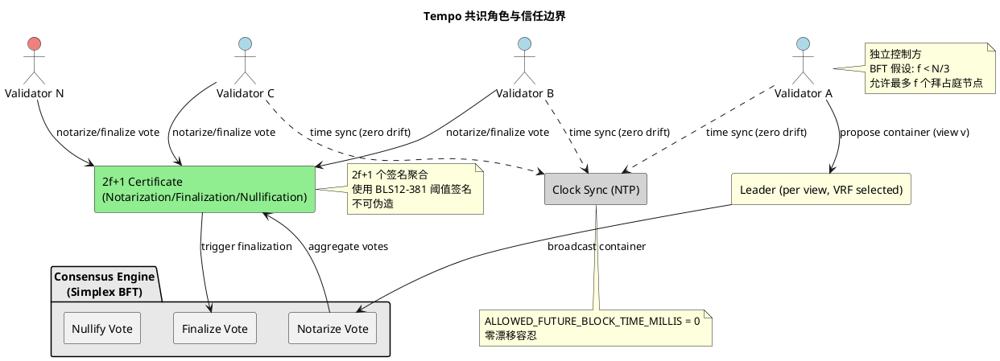
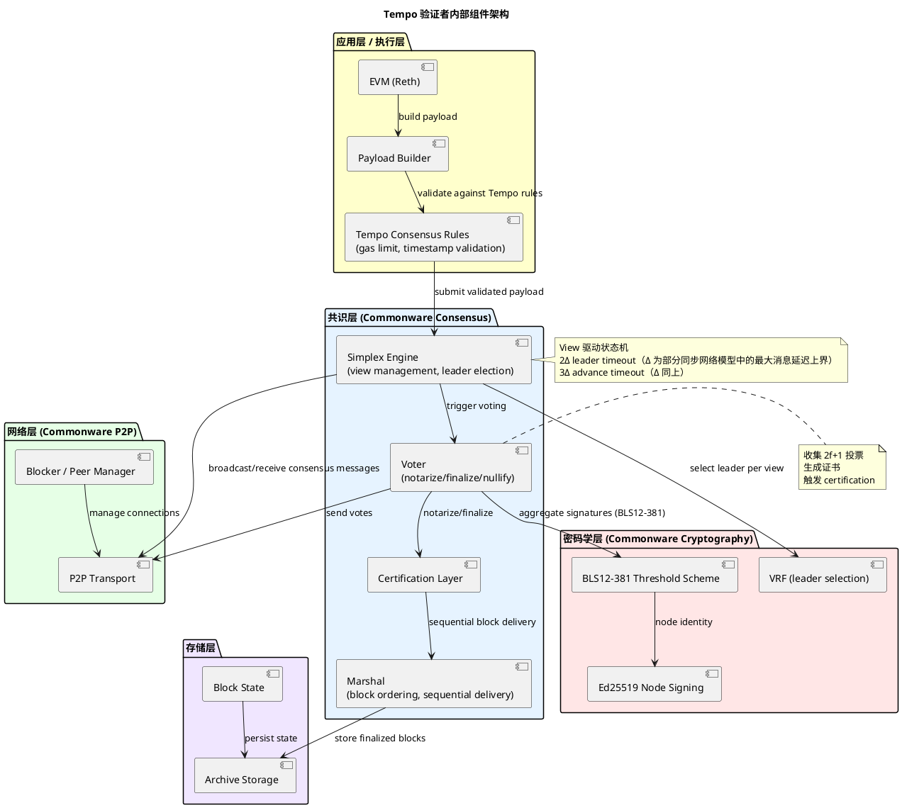
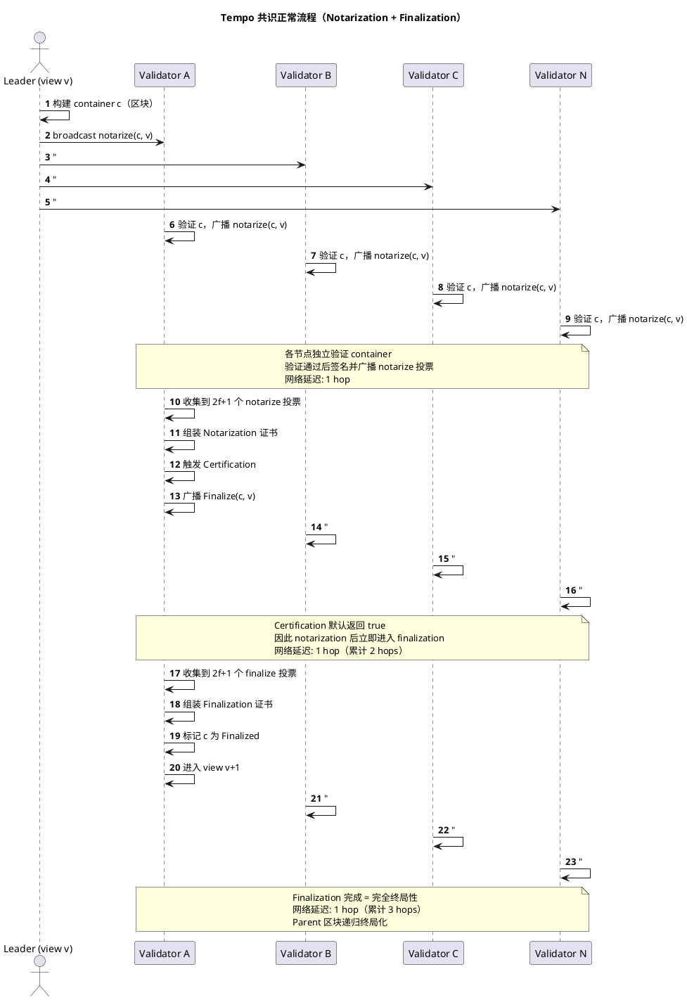

## 目录

- [概述](#概述)
- [关键术语](#关键术语)
- [分析正文](#分析正文)
  - [实体分类](#实体分类)
  - [角色与信任边界](#角色与信任边界)
  - [角色内部组件](#角色内部组件)
  - [核心共识流程](#核心共识流程)
  - [状态转换](#状态转换)
  - [能力归属](#能力归属)
- [设计取舍](#设计取舍)
- [边界与前提](#边界与前提)
- [相关对象关系](#相关对象关系)
- [结论](#结论)
- [参考资料](#参考资料)

---

## 概述

Tempo Chain 是一条专注于支付场景的高性能区块链，其共识层基于 Commonware Consensus 库的 **Simplex BFT** 协议实现。Tempo 采用毫秒级时间戳、双阶段确认（notarization + finalization）、VRF leader 选择和 BLS12-381 阈值签名，旨在实现网络速度的出块延迟和最优的终局性延迟。

**研究范围**：Tempo 共识机制的协议设计、实体角色、核心流程、能力边界，不覆盖代码级实现细节。

**研究深度**：focused

**对象类型**：primitive

### 本质与表现形式

| 维度 | 说明 |
|------|------|
| 它是什么 | 基于 Simplex BFT 协议的拜占庭容错共识机制，由 Commonware Consensus 库提供 Rust 实现，Tempo Chain 集成作为其共识引擎 |
| 表现形式 | Rust 共识库（commonware-consensus）、Tempo 节点代码（tempoxyz/tempo）、Simplex 协议论文（eprint.iacr.org/2023/463） |
| 类比理解 | 类似 Tendermint BFT，但采用 view 驱动的 Simplex 协议替代经典的 round-based PBFT；类似 HotStuff，但更强调简单性和快速 notarization 路径 |
| 在模型中的位置 | 共识层（Consensus Layer），位于执行层（EVM via Reth）和网络层（commonware-p2p）之间 |

---

## 关键术语

| 术语 | 定义 | 在本题中的作用 |
|------|------|---------------|
| Simplex Consensus | 一种异步 BFT 共识协议，由 Cardinal-Cryptography 研究团队提出（eprint.iacr.org/2023/463），设计目标为简单、快速、网络速度延迟 | Tempo 共识的学术基础，定义了核心协议流程 |
| BFT (Byzantine Fault Tolerance) | 拜占庭容错，系统在最多 f < N/3 个恶意或故障节点情况下仍能正确运行 | Tempo 共识的安全基础 |
| View | 共识的一轮视图，每个 view 有指定的 leader 负责提议。View 编号单调递增 | 共识状态机的基本步进单位 |
| Notarization | 2f+1 个节点对某个 container（区块）的 notarize 投票形成的证书，表示 "已公证" | 乐观终局性的标志，2 network hops 即可达成 |
| Finalization | 2f+1 个节点对某个 container 的 finalize 投票形成的证书，表示 "已终局化" | 完全终局性的标志，3 network hops |
| Nullification | 2f+1 个节点对某个 view 的 nullify 投票形成的证书，表示该 view "已作废" | 处理 leader 失败或超时的机制 |
| 乐观终局性 (Optimistic Finality) | 看到 notarization 证书后，可推测该区块将不会被排除在规范链之外（除非 f+1 诚实节点超时或 certification 失败），无需等待 finalization | Tempo 实现低延迟确认的关键 |
| Certification | 应用层在 notarization 后对 payload 进行额外验证的步骤，验证通过才允许 finalization | 允许 erasure coding 等高级功能延迟 finalization |
| Leader / Proposer | 每个 view 中负责提议 container 的节点，通过 VRF 选择 | 共识的驱动者，leader 选择影响性能 |
| VRF (Verifiable Random Function) | 可验证随机函数，用于公平选择 leader | 嵌入在 BLS12-381 阈值签名方案中 |
| Epoch | 验证者集合的变更周期，Tempo 主网 epochLength = 21600 | 验证者管理的粒度 |
| BLS12-381 | 一种配对友好的椭圆曲线，支持高效的聚合签名和阈值签名 | Tempo 共识使用的密码学原语 |
| 阈值签名 (Threshold Signature) | N 个参与者中任意 t 个协作即可生成有效签名，无法区分于 N 个协作生成的签名 | 共识投票聚合的核心机制 |
| 部分同步 (Partial Synchrony) | 网络最终会进入同步状态（消息延迟有界），但在同步前延迟不确定 | Tempo 共识的活性假设 |
| 毫秒时间戳 | Tempo Header 使用毫秒精度的时间戳字段，ALLOWED_FUTURE_BLOCK_TIME_MILLIS = 0 | 实现亚秒级出块的关键 |
| Commonware | 提供共识、P2P、密码学等区块链原语的 Rust 库项目 | Tempo 共识的底层依赖 |

---

## 分析正文

### 实体分类

| 实体 | 类型 | 控制方 | 是否跨信任边界 | 主要职责 |
|------|------|--------|----------------|----------|
| Validator（验证者） | role | 各验证者运营方 | 是 | 参与共识投票、提议区块 |
| Leader / Proposer | role（validator 的子角色） | 当前 view 被 VRF 选中的验证者 | 是 | 在 view v 中提议 container |
| Consensus Engine | component | 各验证者节点内部 | 否 | 驱动 Simplex 协议状态机 |
| EVM Execution Layer | component | 各验证者节点内部 | 否 | 执行交易、生成 payload |
| P2P Network | component | 各验证者节点内部 | 否 | 传输共识消息 |
| Notarize / Nullify / Finalize 投票 | data object | 由 validator 签名 | 是 | 共识协议的消息载体 |
| Notarization / Nullification / Finalization 证书 | data object | 由 2f+1 个投票聚合 | 是 | 证明共识进度 |
| Container（区块） | data object | 由 leader 提议 | 是 | 共识的有效载荷 |
| View（视图） | state | 全局 | 是 | 共识的当前轮次 |
| Epoch（时期） | state | 全局 | 是 | 验证者集合的管理周期 |
| Clock Synchronization | external system | 各节点依赖 NTP 等 | 是 | 提供时间同步 |
| Commonware Consensus 库 | external system | 项目方维护 | 否 | 提供 Simplex 实现 |

### 角色与信任边界

Tempo 共识的信任模型基于以下假设：

- **BFT 安全阈值**：最多 f 个拜占庭节点，总节点数 N > 3f（即 f < N/3）
- **签名安全**：BLS12-381 阈值签名保证 2f+1 个签名聚合后的证书不可伪造
- **时钟同步**：各节点需要时间同步，Tempo 设定零漂移容忍（ALLOWED_FUTURE_BLOCK_TIME_MILLIS = 0），假设诚实节点的系统时钟偏差在可接受范围内（具体数值取决于网络条件）
- **网络假设**：部分同步网络，最终消息延迟有界

### 角色内部组件

所有验证者节点复用同一架构，Leader 只是当前 view 的临时角色，不引入额外的内部组件。

### 核心共识流程

Simplex 协议采用 view 驱动的状态机，每个 view 由一个 leader 提议，其他验证者通过投票达成共识。

**Happy Path（正常流程）**：

**流程步骤说明**：

- **Leader 提议**：每个 view v 开始时，通过 VRF 选择的 leader 构建 container（区块）并广播 notarize(c, v) 消息。如果 leader 在过去 r 个 views 中不活跃，t_l（leader timeout）设为 0，立即触发超时。
- **Notarize 投票**：各验证者收到 leader 的提议后，独立验证 container。验证通过则广播 notarize(c, v) 投票。网络延迟：1 hop。
- **Notarization 证书**：当节点收集到 2f+1 个 notarize 投票，组装 Notarization 证书。此时达到**乐观终局性**（optimistic finality）——该 container 不会被排除在规范链之外（除非 f+1 诚实节点超时或 certification 失败）。网络延迟：1 hop（累计 2 hops）。
- **Certification**：应用层对 notarized payload 进行额外验证。Tempo 中默认返回 true，因此 notarization 后立即进入 finalization。
- **Finalization 证书**：收集到 2f+1 个 finalize 投票后，组装 Finalization 证书，container 达到**完全终局性**。网络延迟：1 hop（累计 3 hops）。Parent 区块同时递归终局化。

**异常路径（Leader 超时 / Nullification）**：

当 leader 不活跃或提议无效时，通过以下机制恢复活性：

| 触发条件 | 流程 | 结果 |
|----------|------|------|
| Leader 超时（t_l = 2Δ，Δ 为网络最大消息延迟上界，触发） | 节点广播 nullify(v) | 进入 view v+1，新 leader 提议 |
| Advance 超时（t_a = 3Δ，同上，触发） | 节点广播 nullify(v) | 同上 |
| Container 验证失败 | 立即广播 nullify(v) | 跳过当前 leader 的提议 |
| Certification 失败 | 广播 nullify(v) | 拒绝 finalization，等待新提议 |
| 收集到 2f+1 个 nullify 投票 | 组装 Nullification 证书 | 强制进入 view v+1 |

Tempo 引入了独立的 `notarize` 和 `nullify` 消息（与原始 Simplex 论文不同），并增加了 leader timeout 机制以加速对不活跃 leader 的处理。

### 状态转换

Tempo 共识的核心状态是 View 编号。以下状态转换表描述了 view 推进的条件。

| 当前状态 | 触发事件 | 转换结果 | 说明 |
|----------|----------|----------|------|
| View v（等待 leader 提议） | 收到 leader 的 notarize(c, v) | 进入验证阶段 | 取消 t_l 计时器 |
| View v（验证中） | Container 验证通过 | 广播 notarize(c, v) | 独立验证后投票 |
| View v（投票中） | 收集到 2f+1 个 notarize 投票 | 标记 notarized → 触发 certification | 达到乐观终局性 |
| View v（certification） | Certification 返回 true | 广播 finalize(c, v) | 进入 finalization 阶段 |
| View v（certification） | Certification 返回 false | 广播 nullify(v) | 拒绝当前 container |
| View v（finalization） | 收集到 2f+1 个 finalize 投票 | 标记 finalized → 进入 view v+1 | 完全终局性，递归终局化 parent |
| View v（等待提议） | t_l 超时（2Δ，Δ 为网络最大消息延迟上界） | 广播 nullify(v) → 进入 view v+1 | Leader 不活跃 |
| View v（投票中） | t_a 超时（3Δ，同上） | 广播 nullify(v) → 进入 view v+1 | 无法达成 notarization |
| View v（任意） | 收集到 2f+1 个 nullify 投票 | 进入 view v+1 | Nullification 强制推进 |
| View v（任意） | 观察到 2f+1 个 nullify/finalize for view v' > v | 跳到 view v'+1 | 新节点加入或追赶 |

**超时机制**：

- **t_l (leader timeout)** = 2Δ（Δ 为部分同步网络模型中的最大消息延迟上界）：leader 提议超时，防止不活跃 leader 阻塞进度
- **t_a (advance timeout)** = 3Δ（同上）：共识推进超时，防止网络分区导致无法达成共识
- **t_r (rebroadcast interval)**：nullify 后的重播间隔，确保消息可靠传递

### 能力归属

| 能力 | 协议原生 / 角色职责 / 外部依赖 | 说明 |
|------|-------------------------------|------|
| BFT 安全性（f < N/3） | 协议原生 | Simplex 协议保证 |
| 乐观终局性（2 hops） | 协议原生 | Notarization 证书即表示推测终局（container 不会被排除在规范链之外，除非 f+1 诚实节点超时或 certification 失败） |
| 完全终局性（3 hops） | 协议原生 | Finalization 证书即表示确定终局 |
| VRF leader 选择 | 协议原生（依赖 BLS12-381） | 嵌入在阈值签名方案中 |
| 毫秒级出块 | 协议原生 | ALLOWED_FUTURE_BLOCK_TIME_MILLIS = 0 |
| EVM 兼容执行 | 外部依赖（Reth） | 执行层独立于共识层 |
| 双 gas 限制（general + shared） | 协议原生（Tempo 扩展） | 支付车道容量管理 |
| Epoch 验证者管理 | 协议原生 | 每 epochLength = 21600 个 block |
| 时钟同步 | 外部依赖（NTP） | 各节点自行负责 |
| 网络通信 | 外部依赖（commonware-p2p） | P2P 层不引入额外信任假设 |

---

## 设计取舍

| 设计决策 | 选择方案 | 未选择方案 | Trade-off 说明 |
|----------|----------|-----------|----------------|
| **Simplex BFT 作为核心协议** | View 驱动的 Simplex 协议，2-hop notarization + 3-hop finalization | 经典 PBFT/Tendermint（3-round voting），DAG 类（如 AlephBFT） | Simplex 更简单，乐观终局性更快（2 hops vs Tendermint 的 2-3 rounds）。但 DAG 方案在异步网络下可能更稳健 |
| **Commonware 库而非自建共识** | 复用 commonware-consensus | 从头实现共识协议 | Commonware 经过 fuzz testing，支持多种签名方案。但引入外部依赖，需信任 Commonware 的安全审计 |
| **BLS12-381 阈值签名** | 2f+1 阈值聚合签名 | Ed25519 多重签名或 secp256r1 | BLS12-381 支持高效的签名聚合，减少网络带宽。但需要更复杂的密码学实现 |
| **Notarization + Finalization 双阶段** | 先 notarization（乐观终局），后 finalization（完全终局） | 一步终局（如 Tendermint） | 双阶段提供更快的推测终局性，应用层可选择信任乐观终局。但增加了协议复杂度 |
| **Certification 机制** | 应用层可在 notarization 后延迟 finalization | 直接 finalization | 支持 erasure coding 等高级功能。Tempo 默认直接通过，保留了扩展能力 |
| **零时间漂移（ALLOWED_FUTURE_BLOCK_TIME_MILLIS = 0）** | 不允许未来时间戳 | 允许一定漂移（如 500ms） | 更严格的时序控制，配合毫秒级出块。但对时钟同步要求更高 |
| **独立 notarize / nullify 消息** | 两种独立消息类型 | 统一的 vote 消息（原始 Simplex 论文） | 更清晰的语义，简化实现。但与原始论文有偏差 |
| **Leader timeout + rebroadcast** | 独立的 leader timeout（2Δ，Δ 为网络最大消息延迟上界）和消息重播 | 仅依赖 advance timeout（原始 Simplex） | 更快检测不活跃 leader，增强网络不稳定时的活性 |

---

## 边界与前提

### 协议原生能力

- **BFT 安全性**：在 f < N/3 的拜占庭假设下，协议保证安全性和活性
- **乐观终局性**：notarization 后，container 不会被排除在规范链之外（除非 f+1 诚实节点超时或 certification 失败）
- **完全终局性**：finalization 后，container 不可逆转
- **毫秒级时间戳**：支持亚秒级出块间隔

### 外部依赖

- **时钟同步**：各节点需要独立保证时间同步（NTP 等），协议不提供同步机制
- **网络层**：依赖 commonware-p2p 提供消息传递，协议假设部分同步网络
- **执行层**：EVM 兼容执行由 Reth 提供，与共识层通过 Payload Builder 接口解耦

### 能力边界

| 能解决 | 不能解决 |
|--------|----------|
| 拜占庭环境下的区块排序和终局性 | 经济安全性（无 slashing 机制，依赖外部） |
| 低延迟确认（2-3 network hops） | 时钟同步问题（由外部解决） |
| Leader 公平选择（VRF） | 动态验证者集合的即时变更（epoch 粒度） |
| 消息认证和签名聚合（BLS12-381） | 网络层攻击（如 Sybil 攻击） |

### 状态区分

| 状态 | 说明 | 来源 |
|------|------|------|
| 已上线 | Simplex 共识协议、notarization/finalization 机制、毫秒时间戳 | L1 源码确认 |
| 已上线 | 主网 Presto（chainId: 4217）运行中 | L1 源码确认 |
| 规划中 | T2/T3/T4 硬分叉功能 | L2 源码中的 fork 调度 |
| 宣传性表述 | "blockchain for payments" 定位 | L3 官方文档 |

---

## 相关对象关系

| 相邻协议 | 关系定位 | 说明 |
|----------|----------|------|
| Tendermint BFT | 替代关系 | 同为 BFT 共识，但 Tendermint 采用经典的 3-round voting，Simplex 采用 view 驱动 + 乐观终局 |
| AlephBFT (DAG) | 替代关系 | 同为 Cardinal-Cryptography 开发的共识，AlephBFT 采用 DAG 排序，Simplex 采用 leader 提议 |
| HotStuff | 相似关系 | 同为 view/round 驱动的 BFT 协议，但 Simplex 更强调简单性和快速 notarization |
| Ethereum PoS | 互补关系 | Tempo 执行层与 EVM 兼容，但共识层使用 Simplex 替代了 PoS |
| Commonware Consensus | 依赖关系 | Tempo 共识的底层实现，提供 Simplex 协议和加密原语 |

---

## 结论

### 已确认

- Tempo Chain 的共识机制基于 Simplex BFT 协议，通过 Commonware Consensus 库实现
- Simplex 协议提供 2-hop notarization（乐观终局性）和 3-hop finalization（完全终局性）
- 安全性假设为 f < N/3 的拜占庭容错，使用 BLS12-381 阈值签名聚合投票
- Leader 通过 VRF（嵌入 BLS12-381 阈值方案）公平选择
- Tempo 使用毫秒级时间戳，ALLOWED_FUTURE_BLOCK_TIME_MILLIS = 0，支持亚秒级出块
- 主网 Presto（chainId: 4217），epochLength = 21600 blocks
- Tempo 对 Simplex 原始协议做了多处改进：独立消息类型、leader timeout、消息重播

### 尚需验证

- Tempo 主网实际验证者数量（需从链上状态确认）
- 实际测量的 TPS 和 finality 延迟（官方宣称 vs 实测）
- Commonware 库的安全审计状态和形式化验证情况

### 基于推断

- 由于 Tempo 允许零时间漂移且使用毫秒级时间戳，推断其目标出块间隔在数百毫秒级别（具体数值需官方确认）
- 由于采用 Commonware 而非自建共识，推断 Tempo 团队将工程资源集中在支付应用层而非共识层

---

## 参考资料

| 来源 | 说明 | 验证状态 |
|------|------|----------|
| Simplex Consensus 论文 (eprint.iacr.org/2023/463) | 原始 Simplex 协议规范 | `[已验证]` |
| tempoxyz/tempo GitHub | Tempo 主仓库，共识实现代码 | `[已验证]` |
| commonwarexyz/monorepo GitHub | Commonware 共识库，Simplex Rust 实现 | `[已验证]` |
| Tempo 官方文档 (docs.tempo.xyz) | 协议规范和开发者文档 | `[已验证]` |
| consensus/src/simplex/mod.rs | Simplex 协议文档和状态机描述 | `[已验证]` |
| crates/consensus/src/lib.rs | Tempo 共识规则验证（时间戳、gas limit） | `[已验证]` |
| crates/commonware-node/src/consensus/engine.rs | 共识引擎配置和初始化 | `[已验证]` |
| crates/chainspec/src/constants.rs | 链参数、硬分叉调度 | `[已验证]` |
| crates/commonware-node-config/src/lib.rs | 验证者配置和签名密钥管理 | `[已验证]` |
