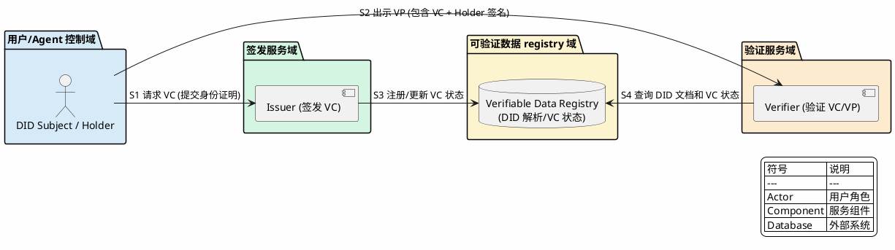

<!--
研究元数据：
- 研究深度：light
- 对象类型：primitive
- 研究路径：light
- 相关 domains：account-abstraction, agentic-payment, decentralized-identity
- 创建时间：2026-04-11
- 状态：stable
-->

<!-- 目录 -->
- [概述](#概述)
- [关键术语](#关键术语)
- [组件架构](#组件架构)
- [核心流程](#核心流程)
- [设计取舍](#设计取舍)
- [能力边界](#能力边界)
- [相关协议对比](#相关协议对比)
- [结论](#结论)
- [待确认问题](#待确认问题)
- [参考资料](#参考资料)

## 概述

DID Auth (Decentralized Identity Authentication) 是基于 W3C DID Core 和 Verifiable Credentials (VC) 规范的去中心化身份认证机制。DID Auth 允许实体通过 DID 文档中定义的验证方法证明身份，并使用 VC 进行可验证的凭证交换。

**DID Auth 解决的核心问题**：
- 中心化身份提供商 (IdP) 的单点控制和数据垄断
- 跨链/跨平台的身份互操作性
- 可验证凭证的标准化格式和验证流程

**DID Auth 不解决的问题**（范围外或需外部规范）：
- 具体 DID 方法的实现细节（如 did:ethr, did:pk）
- VC 的零知识证明扩展（如 BBS+ 签名）
- 完整的授权策略引擎

DID Auth 在 AP2 协议概念中定位为 L5 层（Trust/Authorization）的**凭证管理参考实现**，提供 DID 文档结构、VC 验证流程、多链身份支持。

## 关键术语

| 术语 | 定义 | 在本题中的作用 |
|------|------|---------------|
| DID (Decentralized Identifier) | W3C 定义的去中心化标识符，格式为 `did:method:identifier` | AP2 中 agent 身份标识的参考 |
| DID Document | 包含 DID subject 验证方法和服务端点的文档 | 定义谁可以认证/签发/调用能力 |
| Verification Method | DID 文档中定义的验证方法（如 Ed25519VerificationKey2020） | 签名验证的密钥材料 |
| Verification Relationship | DID subject 与验证方法之间的关系（5 种） | 定义不同场景下的授权边界 |
| Verifiable Credential (VC) | 包含 claims 的可验证凭证 | AP2 中授权凭证的参考格式 |
| Verifiable Presentation (VP) | Holder 出示的 VC 集合，带有 Holder 签名 | 凭证展示和选择性披露 |
| Issuer | 签发 VC 的实体 | 授权凭证的签发方 |
| Holder | 持有 VC 并出示的实体 | 被授权的 agent 或用户 |
| Verifier | 验证 VC/VP 的实体 | AP2 中的服务提供者 |
| Verifiable Data Registry (VDR) | 提供 DID 解析和 VC 状态查询的系统 | 支持 DID 文档和 VC 状态的链上/链下查询 |
| [AP2](../../agentic-payment/agentic-payment-ap2/artifact.md) | Agent Payment Authorization Protocol，agentic payment 授权层概念模型 | DID Auth 是 AP2 凭证管理和身份验证的参考实现 |

## 组件架构

### 实体分类表

| 实体 | 类型 | 控制方 | 是否跨信任边界 | 主要职责 |
|------|------|--------|----------------|----------|
| DID Subject / Holder | role | 用户/agent | 是 | DID 标识符的持有者，VC 持有者，出示可验证证明 (VP) |
| Issuer | role | 签发服务 | 是 | 验证 Holder 身份，签发可验证凭证 (VC) |
| Verifier | role | 验证服务 | 是 | 验证 VC 和 VP 的有效性，确认身份 |
| DID Document | data object | - | - | 验证方法和服务端点定义 |
| VC | data object | - | - | 凭证载荷 |
| VP | data object | - | - | 凭证展示 |
| Verifiable Data Registry | external system | 网络 | 是 | DID 解析和 VC 状态查询 |

### DID Auth 角色与信任边界图

**视角说明**：本图采用角色与信任边界总览视角，展示 DID Auth 协议中各参与角色、信任边界划分及跨边界通信关系。图中分为四个域：用户/Agent 控制域、签发服务域、验证服务域、可验证数据 registry 域。

**控制方说明**：
- 用户/Agent 控制域：由用户控制，持有 VC 并出示证明
- 签发服务域：由签发机构控制，验证身份并签发 VC
- 验证服务域：由验证方控制，验证 VC 和 VP 的有效性
- 可验证数据 registry 域：由网络/registry 控制，提供 DID 解析和 VC 状态查询



**图注**：DID Auth 角色与信任边界图。图中展示了四个信任域及其交互关系。跨域通信（如 Holder 出示 VP 给 Verifier）依赖 trust assumption：Holder 必须安全保管私钥，Issuer 必须如实签发 claims，VDR 必须提供准确状态。

**简化说明**：本图省略了 DID Document 的详细结构和 VC 的具体格式，这些属于 W3C 规范层面的细节。

## 核心流程

### DID Auth 认证与 VC 流转流程

**视角说明**：本图采用跨角色核心流程视角，展示 DID Auth 认证的完整交互流程。图中包含 4 个分组：Holder、Issuer、Verifier、VDR，分为两个阶段：VC 签发阶段和 VC 出示与验证阶段。

**流程场景**：本图展示认证成功的 happy path。

```plantuml
@startuml
skinparam backgroundColor #FEFEFE
skinparam sequenceMessageAlign center
skinparam nodesep 30
skinparam ranksep 30
left_to_right direction

autonumber

box "Holder" #EEEEEE
  actor "Holder" as holder
endbox

box "Issuer" #DDDDDD
  participant "Issuer" as issuer
endbox

box "Verifier" #CCCCCC
  participant "Verifier" as verifier
endbox

separator

box "VDR" #FFFFFF
  database "VDR (Verifiable Data Registry)" as vdr
endbox

holder -> issuer : M1 提交身份证明请求 VC
activate holder
activate issuer

issuer -> vdr : M2 (可选) 注册 VC 状态
activate issuer
activate vdr
vdr --> issuer : R1 返回注册确认
deactivate vdr
deactivate issuer

issuer --> holder : M3 签发 VC
deactivate holder
deactivate issuer

verifier -> holder : M4 请求验证 (Challenge)
activate verifier
activate holder

holder --> verifier : M5 出示 VP\n(包含 VC + Holder 签名)
deactivate holder
deactivate verifier

verifier -> vdr : M6 查询 DID 文档
activate verifier
activate vdr
vdr --> verifier : R2 返回 DID Document
deactivate vdr
deactivate verifier

verifier -> vdr : M7 查询 VC 吊销状态
activate verifier
activate vdr
vdr --> verifier : R3 返回状态
deactivate vdr
deactivate verifier

verifier --> holder : M8 认证通过/失败
activate verifier
activate holder
deactivate holder
deactivate verifier

legend right
  | 符号 | 说明 |
  | --- | --- |
  | Actor | 用户角色 |
  | Participant | 服务参与者 |
  | Database | 外部系统 |
endlegend

@enduml
```

**流程步骤说明**：
- **【M1-M3】VC 签发阶段**：Holder 提交身份证明，Issuer 验证后签发 VC，可选地将 VC 状态注册到 VDR
- **【M4】验证请求**：Verifier 生成随机 challenge，请求 Holder 出示 VC
- **【M5】VP 出示**：Holder 创建 VP（包含 VC 和 Holder 对 challenge 的签名），出示给 Verifier
- **【M6-R2】DID 解析**：Verifier 从 VDR 解析 Issuer 的 DID 文档，获取公钥
- **【M7-R3】吊销状态检查**：Verifier 查询 VDR 确认 VC 未被吊销
- **【M8】认证结果**：全部验证通过则认证成功，失败则拒绝

**异常路径说明**：

| 异常点 | 触发条件 | 返回结果 | 说明 |
|--------|----------|----------|------|
| M3 签发失败 | 身份证明不足 | 拒绝签发 VC | Holder 无法证明身份 |
| M5 VP 无效 | VP 签名验证失败 | 认证失败 | Holder 签名无效或 VC 被篡改 |
| M6 DID 解析失败 | DID 文档不存在 | 认证失败 | Issuer DID 无法解析 |
| M7 吊销检查失败 | VC 状态为 revoked | 认证失败 | VC 已被 Issuer 吊销 |

**简化说明**：本图省略了 VC 的具体格式（如 @context, type, credentialSubject 等字段），这些属于 W3C VC Data Model 规范层面的细节。

### VC/VP 状态转换表

| 状态 | 触发事件 | 转换结果 | 说明 |
|------|----------|----------|------|
| None | Issuer 签发 | Valid | VC 创建，进入有效状态 |
| Valid | Holder 出示 | Valid | VP 出示不改变 VC 状态 |
| Valid | Issuer 吊销 | Revoked | VC 被吊销 |
| Valid | validUntil 到期 | Expired | VC 过期失效 |
| Valid | DID 文档变更 | Invalid | Issuer DID 验证方法变更可能导致 VC 无效 |

## 设计取舍

### 为什么选择 DID 而非传统标识符？

| 方案 | 优势 | 劣势 |
|------|------|------|
| DID | 去中心化、跨链互操作、用户控制 | 解析复杂、生态成熟度低 |
| 传统标识符 (Email, OAuth ID) | 生态成熟、易于使用 | 中心化控制、数据孤岛 |

**DID Auth 选择 DID 的原因**：
- 符合 Web3"自我主权身份"理念
- 支持多链/跨平台身份互操作
- 用户完全控制身份数据

### 为什么需要 5 种验证关系？

| 验证关系 | 用途 | 不可替代的原因 |
|----------|------|---------------|
| authentication | 身份认证 | 专用于登录场景，与签发分离 |
| assertionMethod | VC 签发 | 专用于声明签发，与认证分离 |
| keyAgreement | 加密通信 | 支持 DIDComm 等加密场景 |
| capabilityInvocation | 能力调用 | 特权操作的授权（如更新 DID 文档） |
| capabilityDelegation | 能力委托 | 将能力委托给第三方 |

**设计价值**：关注点分离，最小权限原则

### 为什么 VC 需要独立的 proof 而非依赖 DID？

- **灵活性**：VC 可以被独立验证，不依赖实时 DID 解析
- **离线验证**：VC 可以在离线环境下验证
- **选择性披露**：Holder 可以选择性地出示 VC 中的 claims

## 能力边界

### DID Auth 能解决什么

| 能力 | 说明 | 协议原生 |
|------|------|----------|
| 去中心化身份认证 | 通过 DID 文档验证身份 | ✓ |
| 跨链/跨平台身份 | DID 方法无关性 | ✓ |
| 可验证凭证交换 | VC/VP 标准格式 | ✓ |
| 细粒度授权 | 5 种验证关系分离 | ✓ |
| 凭证吊销管理 | credentialStatus 机制 | ✓ |

### DID Auth 不能解决什么

| 能力 | 说明 | 外部依赖 |
|------|------|----------|
| 具体 DID 方法实现 | did:ethr, did:pk 等需单独规范 | DID 方法规范 |
| 零知识证明扩展 | BBS+ 签名等需额外规范 | ZK-VC 规范 |
| 完整授权策略引擎 | 仅定义身份和凭证，不定义策略 | AP2 策略引擎 |
| 链上结算 | 不涉及支付传输 | MPP / 链协议 |

### 能力边界总结

| 层次 | DID Auth 职责 | 外部职责 |
|------|----------|----------|
| L1 身份 | DID 标识、DID 文档管理 | - |
| L2 认证 | authentication 验证 | - |
| L3 凭证 | VC 签发和验证 | - |
| L4 授权 | capabilityInvocation/Delegation | AP2 策略引擎定义具体策略 |
| L5 支付 | - | MPP / 链协议 |

## 相关协议对比

### DID Auth vs SIWE

| 维度 | DID Auth | SIWE |
|------|----------|------|
| 标识符类型 | DID (多方法支持) | Ethereum 地址 |
| 验证方法 | 多种 (EdDSA, ECDSA 等) | ECDSA (secp256k1) |
| 链支持 | 多链/跨链 | 仅 Ethereum |
| VC 集成 | 原生支持 (assertionMethod) | 不支持 |
| 服务端点 | 支持 (service 属性) | 不支持 |
| 适用场景 | 跨链身份、VC 凭证 | Ethereum 生态登录 |

### DID Auth vs OAuth 2.0

| 维度 | DID Auth | OAuth 2.0 |
|------|----------|----------|
| 身份基础 | DID (自我主权) | IdP 管理的 User ID |
| 凭证格式 | VC (标准化) | JWT/Token (厂商特定) |
| 授权模型 | capabilityInvocation/Delegation | Scopes, Grants |
| 身份提供商 | 去中心化 (用户控制) | 中心化 (Google, etc.) |
| 适用场景 | Web3、跨链、SSI | Web2、企业 SSO |

### DID Auth 与 AP2 的关系

| 层面 | DID Auth | AP2 (概念) | 关系 |
|------|----------|-----------|------|
| 定位 | W3C DID Core + VC 规范 | 7 层模型 L5 概念 | AP2 将 DID Auth 作为凭证管理参考 |
| 核心能力 | DID 文档、VC 验证 | 授权策略、信任验证 | DID Auth 提供凭证格式和验证机制 |
| 授权能力 | capabilityInvocation/Delegation | 策略引擎 | AP2 可扩展 DID Auth 的授权语义 |
| 适用场景 | 跨链身份、VC 凭证 | agentic payment 授权 | DID Auth 适用于多链场景，AP2 聚焦 agent 经济 |

## 结论

| 结论 | 置信度 |
|------|--------|
| DID Auth 基于 W3C DID Core 和 VC Data Model 规范 | high |
| DID 文档支持 5 种验证关系，实现关注点分离 | high |
| VC 标准格式包含 issuer, credentialSubject, proof 等核心字段 | high |
| DID Auth 支持多链/跨链身份，不依赖单一链 | high |
| DID Auth 是 AP2 凭证管理组件的参考实现之一 | medium |
| DID Auth 适用于跨链场景，AP2 需扩展以支持 agent 特定需求 | medium |

## 待确认问题

| 问题 | 状态 | 说明 |
|------|------|------|
| DID Auth 与 AP2 的官方认可关系 | 未解决 | 无官方文档确认 DID Auth 是 AP2 的参考实现 |
| DID Auth 具体协议流程 | 部分解决 | W3C 规范定义数据结构，具体协议需参考 DIDComm/OID4VC |
| DID Auth 如何扩展支持 agent 授权 | 未解决 | 需分析 agent 场景的特殊需求（如自动执行策略） |

## 参考资料

| 来源 | 说明 |
|------|------|
| [W3C DID Core 1.0](https://www.w3.org/TR/did-core/) | DID 核心规范 |
| [W3C VC Data Model 2.1](https://www.w3.org/TR/vc-data-model/) | 可验证凭证数据模型规范 |
| [w3c/did-core](https://github.com/w3c/did-core) | DID Core 规范源码 |
| [w3c/vc-data-model](https://github.com/w3c/vc-data-model) | VC 数据模型规范源码 |
