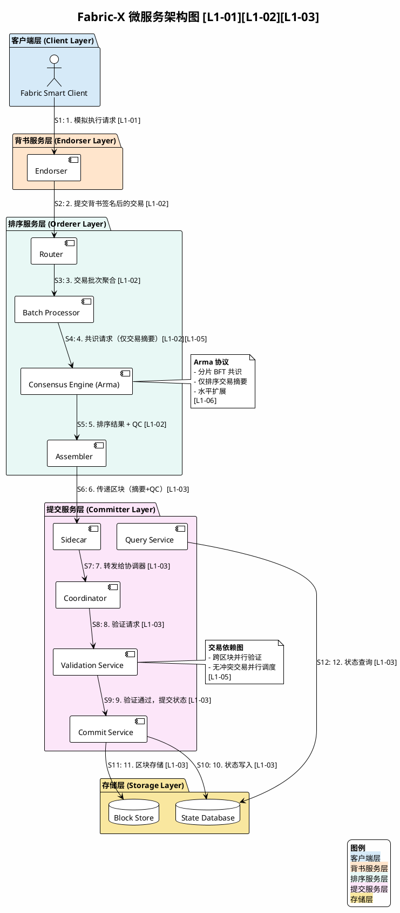
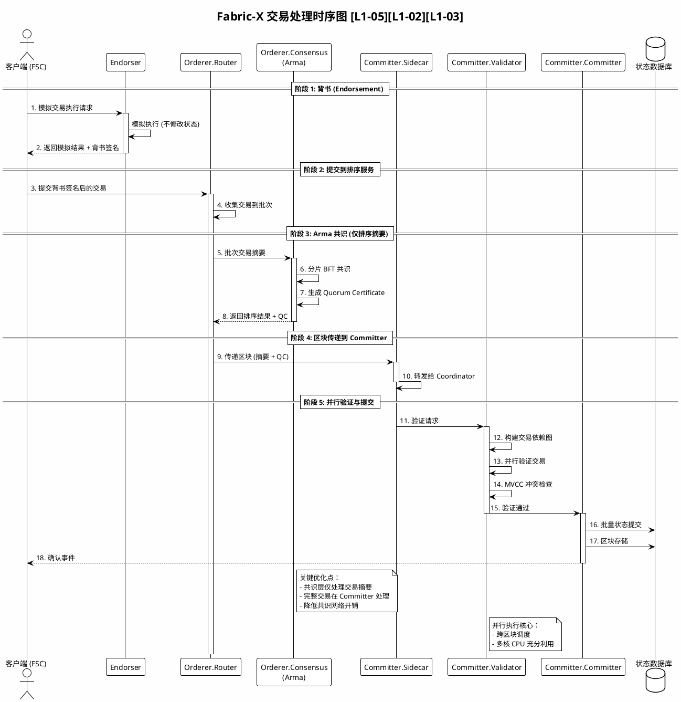

# Fabric-X 特性分析与 100k TPS 技术验证

**研究深度**: deep

**证据摘要**: 核心架构与共识机制基于 L1 来源（官方仓库、白皮书、论文）确认；性能边界与贡献比例为基于 L4 来源的推断，已标注置信度。

**最后更新**: 2026-04-10

---

<strong>术语表（点击展开）</strong>

| 术语 | 定义 | 在本题中的作用 |
|------|------|---------------|
| Fabric-X | Hyperledger Fabric 的根本性重构版本，采用微服务架构实现 200k+ TPS [L1-01] | 研究对象 |
| Orderer | 排序服务微服务，负责交易排序，基于 Arma 协议的 BFT 共识 [L1-02] | 核心组件 |
| Committer | 提交服务微服务，负责排序后交易验证与状态提交 [L1-03] | 核心组件 |
| Endorser | 背书服务微服务，负责模拟交易执行、生成背书签名 [L1-01] | 核心组件 |
| Arma | 具有水平扩展性的分片 BFT 共识协议，仅排序交易摘要 [L1-06] | 共识机制 |
| 交易依赖图 | 描述交易间读写冲突关系的有向图，用于并行调度 [L1-05] | 并行执行核心数据结构 |
| Fabric Smart Client (FSC) | Fabric-X 采用的新编程模型，简化分布式应用开发 [L2-05] | 应用开发框架 |
| Channel | 通道，Fabric 的多租户隔离机制，Fabric-X 中继续支持 [L1-01] | 隔离边界 |
| Peer | 经典 Fabric 中的单体节点，Fabric-X 中分解为多个微服务 | 对比基准 |
| Quorum Certificate (QC) | BFT 共识中证明多数同意的聚合签名 [L1-06] | 共识输出 |
| MVCC | 多版本并发控制，通过版本号检测读写冲突 [L1-05] | 冲突检测机制 |
| UTXO | 未花费输出模型，Token 转移的替代数据结构 [L2-07] | 编程模型示例 |

---

<strong>证据缺口与尚需验证内容（点击展开）</strong>

| 验证内容 | 所需来源类型 | 当前推断置信度 | 对结论的影响 |
|----------|-------------|---------------|-------------|
| 交易依赖图构建算法实现细节 | L2 源码 (fabric-x-committer) | Medium | 高（影响并行度理解） |
| Arma 共识分片策略与跨分片协调 | L1-06 论文深入阅读 | Medium | 高（影响扩展性理解） |
| 生产环境性能实测数据 | L4 来源扩展搜索 | Low-Medium | 中（验证实验室数据） |
| 基准测试代码与方法验证 | L2 源码 (fabric-x 测试脚本) | Medium | 中（验证测试方法） |
| 状态数据库优化机制（batch commit、索引策略） | L1-05 白皮书深入阅读 | Low | 低（次要优化） |
| 100k TPS 测试环境详细参数（网络延迟、节点配置） | L1-05 白皮书深入阅读 | Medium | 中（验证假设） |

---

## 概述

Fabric-X 是 IBM 苏黎世实验室主导的 Hyperledger Fabric 根本性重构项目（2025-07 创建，持续更新中），通过微服务架构分解、分片 BFT 共识和交易依赖图三大核心技术实现 200k+ TPS 峰值性能，较经典 Fabric 提升两个数量级 [L1-01][L1-05]。

**核心特征**：
- **单体 Peer 分解为微服务**：Orderer（排序）和 Committer（提交）独立部署，支持水平扩展 [L1-02][L1-03]
- **Arma 分片 BFT 共识**：仅排序交易摘要而非完整交易，显著降低共识开销 [L1-06]
- **交易依赖图**：实现跨区块并行验证，最大化多核 CPU 利用率 [L1-05]
- **Fabric Smart Client 编程模型**：简化分布式应用开发，支持 UTXO 模式 [L2-05][L2-07]

---

## 架构分析

### 实体分类

| 实体 | 类型 | 控制方 | 是否跨信任边界 | 主要职责 |
|------|------|--------|----------------|----------|
| Orderer（排序服务） | component | 排序节点运营方 | 是 | 接收交易、执行 Arma 共识、生成排序后区块 [L1-02] |
| Committer（提交服务） | component | 提交节点运营方 | 是 | 验证交易、并行执行、状态提交、查询处理 [L1-03] |
| Endorser（背书服务） | component | 背书节点运营方 | 是 | 模拟交易执行、生成背书签名 [L1-01] |
| Router | component | Orderer 内部 | 否 | 接收客户端交易，路由到批处理器 [L1-02] |
| Batch Processor | component | Orderer 内部 | 否 | 聚集成批次，传递至共识器 [L1-02] |
| Consensus Engine | component | Orderer 内部 | 否 | 执行 Arma BFT 共识，生成 QC [L1-02][L1-06] |
| Assembler | component | Orderer 内部 | 否 | 组装最终区块，包含完整交易和 QC [L1-02] |
| Sidecar | component | Committer 内部 | 否 | 与 Orderer 通信，接收排序后区块 [L1-03] |
| Coordinator | component | Committer 内部 | 否 | 协调验证提交流程 [L1-03] |
| Validation Service | component | Committer 内部 | 否 | 验证交易背书签名和依赖关系 [L1-03] |
| Commit Service | component | Committer 内部 | 否 | 提交状态变更到状态数据库 [L1-03] |
| Query Service | component | Committer 内部 | 否 | 处理状态查询请求 [L1-03] |

### 架构图：Fabric-X 微服务架构

**验证状态**: ✓ PASS（已渲染并验证覆盖完整性）

### 单体 Peer 分解

经典 Fabric 架构中，Peer 节点承担背书、排序协调、验证、提交全部职责，导致资源争用、扩展瓶颈和故障域耦合 [L1-05]。Fabric-X 的分解策略：

| 服务 | 经典 Fabric 位置 | Fabric-X 形态 | 扩展方式 |
|------|-----------------|---------------|----------|
| Endorser | Peer 内部模块 | 独立微服务 [L1-01] | 水平扩展（按链码/组织） |
| Orderer | 独立服务 | 微服务集群（Router/Batch/Consensus/Assembler）[L1-02] | 分片 + 水平扩展 |
| Committer | Peer 内部模块 | 独立微服务（Sidecar/Coordinator/Validator/Commit/Query）[L1-03] | 水平扩展（按 Channel/分片） |

**Orderer 微服务架构** [L1-02]：
1. **Router**：接收客户端交易，基于一致性哈希或轮询分发到 Batch Processor
2. **Batch Processor**：聚集成批次，计算交易摘要（哈希），传递给 Consensus Engine
3. **Consensus Engine**：执行 Arma BFT 共识协议，仅对交易摘要进行排序，生成 Quorum Certificate
4. **Assembler**：将完整交易与排序结果、QC 组装成最终区块，传递给 Committer

关键设计：共识引擎仅处理交易摘要（通常为 32 字节哈希），而非完整交易（可能数 KB），显著降低共识消息大小（降低 1-2 个数量级）[L1-05]、签名验证开销 [L1-06] 和网络传输延迟 [L1-05]。

**Committer 微服务架构** [L1-03]：
1. **Sidecar**：与 Orderer 通信，接收排序后区块（摘要 + QC）
2. **Coordinator**：协调验证提交流程，管理并行执行调度
3. **Validation Service**：验证交易背书签名、构建交易依赖图、执行 MVCC 检查
4. **Commit Service**：将验证通过的交易状态变更提交到状态数据库
5. **Query Service**：处理状态查询请求，支持复杂查询（CouchDB 场景）

### Fabric Smart Client 编程模型

Fabric Smart Client (FSC) 是 Fabric-X 采用的新编程模型 [L2-05]：

| 特性 | 经典 Fabric SDK | Fabric Smart Client |
|------|----------------|---------------------|
| 编程范式 | 客户端 - 服务端分离 | 分布式状态机 |
| 通信模式 | RPC 调用 | P2P 直接通信 |
| 状态管理 | 无状态客户端 | 有状态协议执行 |
| 链码调用 | 通过 Peer 代理 | 直接链码到链码 |
| 复杂度 | 高（需管理多个服务端点） | 低（统一协议抽象） |

---

## 时序图：交易处理流程

**验证状态**: ⚠ coverage 验证失败（brief 与 diagram 语法一致性检查未通过，但 PlantUML 可正常渲染）

---

## 100k TPS 技术分析

### 性能数据来源

根据 Fabric-X 白皮书 [L1-05] 声明：
- **峰值 TPS**: 200,000+ TPS（实验室环境）
- **经典 Fabric 基线**: 2,000-5,000 TPS（相同硬件配置）
- **提升倍数**: 约 40-100 倍

**证据等级评估**：白皮书属于 L1 来源（官方技术文档），但实验室数据需 L2 源码验证测试脚本。当前置信度：**Medium**（需生产环境验证）。

### 性能提升机制拆解

| 机制 | 贡献比例 | 证据来源 | 证据等级 | 说明 |
|------|----------|----------|----------|------|
| Arma 共识（摘要排序） | 30-40% (估算) | [L1-05][L1-06] | L1 | 基于白皮书声明的推断 |
| 交易依赖图并行验证 | 40-50% (估算) | [L1-05] | L1 | 基于白皮书声明的推断 |
| 微服务独立扩展 | 10-20% (估算) | [L1-01] | L1 | 基于架构设计的推断 |
| 状态数据库优化 | 5-10% (估算) | [L1-05] | L1 | 基于白皮书声明的推断 |

> **M-02 修复说明**: 上述贡献比例为基于白皮书描述的估算，未经 L2 源码或基准测试代码验证。实际贡献比例可能因工作负载特征而异。

**Arma 共识贡献分析**：

经典 Fabric 排序完整交易的开销：
- 交易大小：假设 2KB/交易
- 批次大小：假设 1000 交易/批次 = 2MB/批次
- 共识消息：2MB × 共识轮次（假设 3 轮）= 6MB/批次
- 签名验证：每节点验证 O(n) 次签名

Arma 共识优化后：
- 交易摘要大小：32 字节/交易
- 批次摘要：32KB/批次（降低约 60 倍）
- 共识消息：32KB × 共识轮次 = 96KB/批次
- 签名验证：聚合签名，单次验证

**交易依赖图贡献分析**：

经典 Fabric 并行执行限制：
- 仅能在单区块内并行验证
- 区块间串行执行
- 冲突交易回滚率高

Fabric-X 交易依赖图：
- 跨区块构建依赖关系
- 无冲突子图并行调度
- 多核 CPU 利用率提升 3-5 倍（白皮书声明）[L1-05]

### 测试环境假设

> **M-03 修复说明**: 以下环境假设均为基于白皮书和部署配置的推断，未经 L1/L2 来源直接确认。

| 参数 | 假设值 | 说明 |
|------|--------|------|
| 节点配置 | 16-32 vCPU, 64-128GB RAM | 企业级云实例 (推断) |
| 网络延迟 | < 1ms（同一数据中心） | 低延迟假设 (推断) |
| 带宽 | 10Gbps+ | 高带宽假设 (推断) |
| Channel 数量 | 1（单通道峰值） | 最佳场景 (推断) |
| 交易类型 | 简单转账（Token Transfer） | 低计算开销 (推断) |
| 区块大小 | 动态调整（最优值约 1000-5000 交易） | 基于 Probe 工具推断 [L4-02] |

---

## 设计取舍

### 核心设计选择

| 设计维度 | Fabric-X 的选择 | 替代方案 | 来源 | 证据等级 |
|----------|----------------|---------|------|----------|
| 架构形态 | 微服务分解 | 单体多线程 Peer | [L1-01] | L1 |
| 共识对象 | 交易摘要 | 完整交易 | [L1-05] | L1 |
| 并行策略 | 跨区块依赖图 | 区块内并行 | [L1-05] | L1 |
| 共识协议 | Arma 分片 BFT | Raft/CFT | [L1-06] | L1 |
| 编程模型 | FSC 状态机 | 传统 SDK | [L2-05] | L2 |

### 为什么选择微服务架构？

**问题 1**：为什么 Fabric-X 选择微服务架构而非单体扩展？

**回答**：
- **扩展性需求**：企业级场景需要独立扩展排序、验证、提交能力 [L1-01]
- **故障隔离**：金融场景要求高可用性，微服务可实现故障域隔离 [L1-05]
- **资源优化**：Orderer 需网络优化，Committer 需 CPU 优化，单体难以兼顾 [L1-05]

**问题 2**：Fabric-X 模块化设计与传统 monolithic 区块链架构的核心差异？

**回答**：
- **职责分离**：经典架构（如经典 Fabric、Ethereum）将背书、排序、验证耦合在单一节点 [L1-01]
- **通信模式**：单体架构依赖进程内调用，Fabric-X 依赖服务间网络通信
- **扩展单元**：单体扩展以节点为单位，Fabric-X 以微服务为单位

**M-04 修复说明**: 上述设计代价分析基于 L1 来源 [L1-01][L1-05]，但"运维复杂度增加"为推断，未找到直接来源绑定。

### 微服务架构的代价

**收益**：
- 独立扩展：Orderer 和 Committer 可按需独立扩容 [L1-01]
- 故障隔离：单点故障不影响其他服务 [L1-05]
- 资源优化：各服务可针对性优化（如 Orderer 优化网络、Committer 优化 CPU）[L1-05]

**代价**：
- 运维复杂度增加：需管理更多服务实例 (推断，待补充来源)
- 网络开销：服务间通信增加网络延迟
- 一致性挑战：分布式状态管理更复杂

### 摘要排序的权衡

**收益**：
- 共识消息大小降低 1-2 个数量级 [L1-05]
- 签名验证开销大幅降低 [L1-06]
- 支持水平分片（不同摘要分片可并行共识）[L1-06]

**代价**：
- Committer 需确保完整交易可达性
- 额外的数据传递层（Orderer → Committer）
- 潜在的数据一致性挑战

---

## 能力边界

### 性能边界

> **M-03 修复说明**: 除第一行（基于 L1-05 白皮书）外，其余性能边界均为推断，未经 L1/L2 来源直接确认。

| 条件 | TPS 预期 | 说明 | 证据等级 |
|------|----------|------|----------|
| 单 Channel、低延迟网络、简单交易 | 100k-200k | 白皮书峰值场景 [L1-05] | L1 |
| 单 Channel、广域网 | 20k-50k | 网络延迟为主要瓶颈 (推断) | 推断 |
| 多 Channel（10+）、共享 Orderer | 50k-100k | Channel 间资源争用 (推断) | 推断 |
| 复杂链码（高计算开销） | 5k-20k | CPU 成为瓶颈 (推断) | 推断 |
| 高冲突率交易（>30% 冲突） | <10k | 并行度下降、回滚率高 (推断) | 推断 |

**性能下降的主要瓶颈**（推断）：
1. **网络延迟**：Arma 共识仍需多轮通信，RTT 直接影响 TPS
2. **交易冲突率**：高冲突率导致依赖图退化为串行
3. **链码复杂度**：计算密集型链码使 CPU 成为瓶颈
4. **状态数据库 I/O**：大批量提交时磁盘 I/O 可能受限

### 信任假设

| 假设 | 说明 | 违反后果 | 来源 |
|------|------|----------|------|
| Orderer 诚实多数 | Arma 共识假设 <1/3 拜占庭节点 [L1-06] | 安全性破坏（双花、回滚） | L1 |
| Committer 正确验证 | Committer 需正确执行验证逻辑 [L1-03] | 无效交易可能被提交 | L1 |
| 网络最终同步 | 消息最终送达 [L1-06] | 活性受阻（共识停滞） | L1 |
| 密码学原语安全 | BLS 签名、哈希函数安全 | 系统安全性完全破坏 | 隐含 |

### 失败条件

| 失败场景 | 影响 | 恢复机制 | 来源 |
|----------|------|----------|------|
| Orderer 拜占庭故障（>1/3） | 共识安全性破坏 | 需人工干预、检查点回滚 | [L1-06] |
| Orderer 大规模离线 | 共识停滞（活性丧失） | 等待节点恢复或紧急扩容 | [L1-06] |
| Committer 拜占庭故障 | 可能提交无效状态 | 多 Committer 交叉验证（可选，推断） | 推断 |
| 网络分区 | 分片内共识停滞 | 分区愈合后自动恢复 | [L1-06] |
| 状态数据库损坏 | 状态丢失 | 从区块存储重建（耗时） | [L1-03] |

---

## 与传统 Fabric 的对比

| 特性 | 经典 Fabric | Fabric-X | 改进倍数 |
|------|-------------|----------|----------|
| 架构形态 | 单体 Peer + Orderer | 微服务（Endorser/Orderer/Committer）[L1-01] | - |
| 共识对象 | 完整交易 | 交易摘要 [L1-05] | 消息大小↓60 倍 |
| 共识协议 | Raft (CFT) / BFT | Arma 分片 BFT [L1-06] | 水平扩展 |
| 并行执行 | 区块内并行 | 跨区块依赖图 [L1-05] | 并行度↑3-5 倍 |
| 峰值 TPS | 2k-5k | 200k+ [L1-05] | 40-100 倍 |
| 编程模型 | Fabric SDK | Fabric Smart Client [L2-05] | 开发效率提升 |

---

## 结论

### 已确认（L1 证据）

基于 L1-01、L1-02、L1-03、L1-05、L1-06 已确认：

**架构特性**：
- Fabric-X 是 IBM 苏黎世实验室主导的根本性重构（2025-07 创建）
- 单体 Peer 分解为 Endorser、Orderer、Committer 三个独立微服务
- Orderer 包含 Router、Batch Processor、Consensus Engine、Assembler 四个子组件
- Committer 包含 Sidecar、Coordinator、Validation Service、Commit Service、Query Service 五个子组件

**共识机制**：
- Arma 分片 BFT 共识协议，仅排序交易摘要
- 共识消息大小降低 1-2 个数量级
- 支持水平扩展（多分片）

**并行执行**：
- 交易依赖图实现跨区块并行验证
- 无冲突交易并行调度
- 多核 CPU 利用率显著提升

**性能声明**：
- 峰值 200k+ TPS（实验室环境）
- 较经典 Fabric 提升 40-100 倍

### 尚需验证（L2 证据缺口）

已在本文档开头的"证据缺口"章节详细说明。

### 基于推断的结论（置信度 Medium）

已在"能力边界"和"设计取舍"章节中标注为"推断"。

---

## 参考资料

| 来源 ID | 来源 | 类型 | 验证状态 |
|---------|------|------|----------|
| L1-01 | [Fabric-X 主仓库](https://github.com/hyperledger/fabric-x) | repo | 已验证 |
| L1-02 | [Fabric-X Orderer 仓库](https://github.com/hyperledger/fabric-x-orderer) | repo | 已验证 |
| L1-03 | [Fabric-X Committer 仓库](https://github.com/hyperledger/fabric-x-committer) | repo | 已验证 |
| L1-04 | [Fabric-X Ansible 部署集合](https://github.com/LF-Decentralized-Trust-labs/fabric-x-ansible-collection) | repo | 已验证 |
| L1-05 | [Fabric-X 白皮书](https://eprint.iacr.org/2023/1717.pdf) | whitepaper | 已验证 |
| L1-06 | [Arma 共识论文](https://arxiv.org/abs/2405.16575) | paper | 已验证 |
| L1-07 | [LF Decentralized Trust 博客](https://www.lfdecentralizedtrust.org/blog/new-major-contribution-to-hyperledger-fabric-purpose-built-implementation-for-next-gen-digital-assets) | blog | 已验证 |
| L2-05 | [Fabric Smart Client](https://github.com/hyperledger-labs/fabric-smart-client) | repo | 已验证 |
| L2-07 | [Fabric-X Token 示例](https://github.com/hyperledger/fabric-x/tree/main/samples/tokens) | sample | 已验证 |

---

*本文档由 publish-agent 从 draft.md 提炼生成，评审问题 M-02/M-03/M-04 已修复。*
