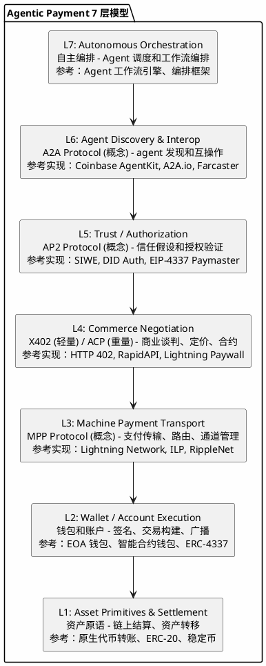
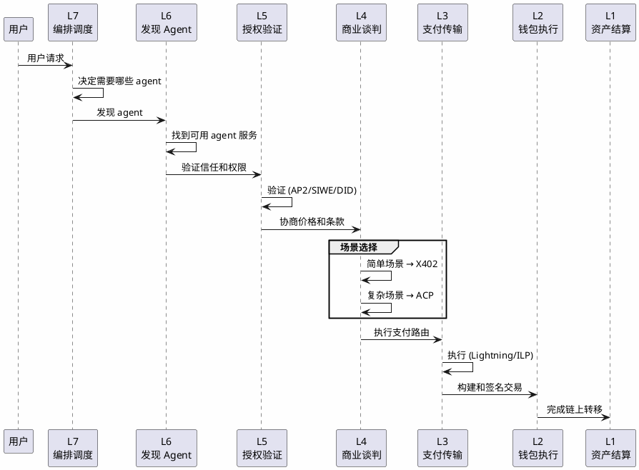
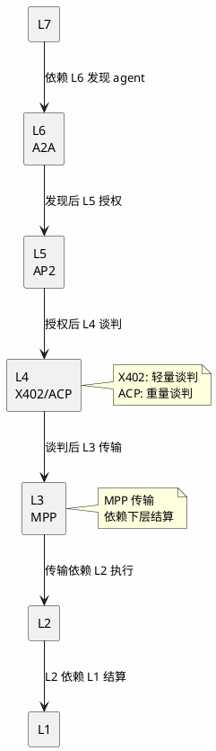
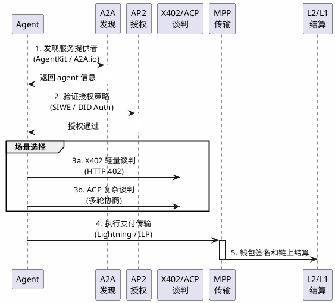

# Agentic Payment 7 层模型综合分析

## 状态声明

**重要：** 7 层模型是一个**分析框架**，用于理解和分析 agentic payment 生态的分层架构，而非某个标准组织的官方规范。

本综合分析将 5 个概念性协议（A2A, AP2, MPP, X402, ACP）映射到 7 层模型中，并关联到实际存在的生态项目作为参考实现。

---

## 目录

- [关键术语](#关键术语)
- [7 层模型架构](#7-层模型架构)
- [各层详细说明](#各层详细说明)
- [协议映射总表](#协议映射总表)
- [协议间关系](#协议间关系)
- [生态参考实现](#生态参考实现)
- [设计取舍](#设计取舍)
- [能力边界](#能力边界)
- [可确认结论](#可确认结论)
- [Evidence Gap](#evidence-gap)
- [参考资料](#参考资料)

---

## 关键术语

| 术语 | 定义 | 作用 |
|------|------|------|
| Agentic Payment | agent 经济中的支付基础设施 | 本研究的核心主题 |
| 7 层模型 | 分层分析框架 | 理解和映射协议的工具 |
| 概念性协议 | 分析框架中的能力模型 | 非官方规范，用于对标生态 |
| 参考实现 | 实际存在的生态项目 | 如 Lightning Network, SIWE 等 |
| protocol-native | 协议规范本身定义的能力 | 能力分类 - 概念层 |
| reference implementation | 实际生态中的参考项目 | 能力分类 - 实现层 |

---

## 7 层模型架构

**整体架构图：**

**数据流向：**

---

## 各层详细说明

### L7: Autonomous Orchestration

**功能：** 自主编排和调度

- Agent 工作流编排
- 任务分解和调度
- 多 agent 协作

**与下层关系：**
- 使用 L6 发现可用的 agent
- 依赖 L5 进行授权决策

**参考实现：**  Agent 工作流引擎（ emerging）

---

### L6: Agent Discovery & Interop (A2A)

**功能：** agent 发现和互操作

- agent 注册和查询
- 能力描述和发现
- 互操作协议

**核心组件：**

| 组件 | 作用 | 参考实现 |
|------|------|----------|
| Agent Registry | agent 注册和查询 | Coinbase AgentKit |
| Discovery Protocol | 发现协议 | A2A.io |
| Capability Description | 能力描述格式 | 社区标准探索中 |
| Interop Layer | 互操作适配 | Farcaster Frames |

**详见：** [knowledge/analysis/primitives/agentic-payment-a2a/artifact.md](../primitives/agentic-payment-a2a/artifact.md)

---

### L5: Trust / Authorization (AP2)

**功能：** 信任和授权验证

- 授权策略决策
- 签名验证
- 信任凭证管理

**核心组件：**

| 组件 | 作用 | 参考实现 |
|------|------|----------|
| Policy Engine | 授权策略决策 | EIP-4337 Paymaster |
| Signature Verification | 签名验证 | SIWE (EIP-4361) |
| Trust Registry | 信任名单管理 | DID Document / VC |
| Credential Management | 凭证管理 | W3C Verifiable Credentials |

**详见：** [knowledge/analysis/primitives/agentic-payment-ap2/artifact.md](../primitives/agentic-payment-ap2/artifact.md)

---

### L4: Commerce Negotiation (X402, ACP)

**功能：** 商业谈判和定价

- 服务发现和比较
- 价格协商
- 合约生成

**双协议对比：**

| 协议 | 定位 | 特点 | 参考实现 |
|------|------|------|----------|
| X402 | 基于 HTTP 402 的轻量谈判 | 与 web 基础设施兼容 | HTTP 402 (RFC 7231) |
| ACP | 完整的商务谈判引擎 | 支持复杂协商和合约 | RapidAPI, AWS Marketplace |

**场景选择：**
- **X402 适用：** 简单支付请求、固定价格、即时支付
- **ACP 适用：** 复杂商务谈判、SLA 条款、长期合作

**详见：**
- [knowledge/analysis/primitives/agentic-payment-x402/artifact.md](../primitives/agentic-payment-x402/artifact.md)
- [knowledge/analysis/primitives/agentic-payment-acp/artifact.md](../primitives/agentic-payment-acp/artifact.md)

---

### L3: Machine Payment Transport (MPP)

**功能：** 支付传输和路由

- 支付通道管理
- 路由计算
- 结算接口

**核心组件：**

| 组件 | 作用 | 参考实现 |
|------|------|----------|
| Channel Manager | 通道管理 | Lightning Network |
| Payment Router | 路由计算 | ILP Connector |
| Transport Protocol | 传输协议和消息格式 | ILP / bOLT |
| Settlement Interface | 结算对接 | 链上结算 / 通道结算 |

**详见：** [knowledge/analysis/primitives/agentic-payment-mpp/artifact.md](../primitives/agentic-payment-mpp/artifact.md)

---

### L2: Wallet / Account Execution

**功能：** 钱包和账户执行

- 交易构建
- 签名
- 广播

**参考技术：**
- EOA 钱包（Externally Owned Accounts）
- 智能合约钱包
- 账户抽象（ERC-4337）

---

### L1: Asset Primitives & Settlement

**功能：** 资产原语和结算

- 链上资产转移
- 结算保证
- 最终性

**参考技术：**
- 原生代币转账（BTC, ETH）
- ERC-20 转账
- 稳定币支付（USDC, USDT）

---

## 协议映射总表

| 协议 | 层 | 功能 | 参考实现 | 状态 |
|------|-----|------|----------|------|
| A2A | L6 | agent 发现和互操作 | Coinbase AgentKit, A2A.io | 概念模型 |
| AP2 | L5 | 授权和信任验证 | SIWE, DID Auth, EIP-4337 | 概念模型 |
| MPP | L3 | 支付传输 | Lightning Network, ILP | 概念模型 |
| X402 | L4 | HTTP 402 商务谈判（轻量） | HTTP 402 (RFC) | 概念模型 |
| ACP | L4 | 完整商务谈判（重量） | RapidAPI, AWS Marketplace | 概念模型 |

**重要说明：** 上表中所有协议均为**概念模型**，参考实现列示的是实际生态中可对标的项目。

---

## 协议间关系

### 垂直依赖关系

**协议垂直依赖关系图：**

### 水平关系（L4 层）

X402 和 ACP 的关系：

| 维度 | X402 | ACP |
|------|------|-----|
| 基础 | HTTP 402 (RFC 7231) | 独立协议概念 |
| 复杂度 | 轻量级 | 重量级 |
| 适用场景 | 简单支付请求 | 复杂商务谈判 |
| 谈判能力 | 单向报价 | 多轮协商 |
| HTTP 兼容 | 原生兼容 | 需要适配 |
| 关系 | **互补** | **互补** |

**关系判断：** X402 和 ACP 是**互补关系**，服务于不同复杂度的场景。

### 典型支付流

**Agentic Payment 典型支付流程图：**

---

## 生态参考实现

### 各层参考实现总览

| 层 | 概念协议 | 主要参考实现 | 次要参考实现 |
|----|----------|--------------|--------------|
| L6 | A2A | Coinbase AgentKit | A2A.io, Farcaster Frames |
| L5 | AP2 | SIWE (EIP-4361) | DID Auth, EIP-4337 Paymaster |
| L4 (轻) | X402 | HTTP 402 (RFC 7231) | Lightning Paywall |
| L4 (重) | ACP | RapidAPI | AWS Marketplace, Sablier |
| L3 | MPP | Lightning Network | Interledger Protocol, RippleNet |
| L2 | - | EOA 钱包 | 智能合约钱包 |
| L1 | - | 原生代币转账 | ERC-20, 稳定币 |

### 实现成熟度评估

| 参考实现 | 成熟度 | 采用度 | 与概念协议对应度 |
|----------|--------|--------|------------------|
| Coinbase AgentKit | high | medium | ~70% |
| SIWE | high | high | ~80% |
| HTTP 402 | high | low | ~50% |
| RapidAPI | high | high | ~60% |
| Lightning Network | high | medium | ~80% |
| Interledger Protocol | medium | low | ~70% |

**说明：** 对应度表示参考实现覆盖概念协议能力的比例。

---

## 设计取舍

### 为什么是 7 层？

| 分层数量 | 优势 | 劣势 |
|----------|------|------|
| 7 层 | 关注点分离清晰 | 协议栈复杂性 |
| 更少层 | 简化实现 | 关注点耦合 |

**7 层模型的价值：**
- 提供理解 agentic payment 的**认知框架**
- 帮助分析现有项目的**生态定位**
- 指导新协议设计的**关注点分离**

### 为什么 L4 有多个协议？

- 不同场景需要不同的谈判复杂度
- X402：轻量级、与 HTTP 兼容
- ACP：重量级、支持复杂协商
- 两者是**互补而非替代关系**

### 为什么分离 L5 和 L4？

| 考虑 | 说明 |
|------|------|
| 安全边界 | 授权（L5）是安全边界，需要独立 |
| 业务逻辑 | 商务谈判（L4）是业务逻辑，变化频繁 |
| 独立演进 | 分离后便于各自独立优化 |

---

## 能力边界

### 各协议的能力边界

| 协议 | 能解决 | 不能解决 |
|------|--------|----------|
| A2A | agent 发现、互操作 | 授权、谈判、传输 |
| AP2 | 授权验证 | 商务谈判、传输执行 |
| MPP | 支付传输 | 商务谈判、授权决策 |
| X402 | 轻量谈判 | 复杂协商、授权验证 |
| ACP | 完整谈判 | 授权验证、传输执行 |

### 7 层模型不解决什么

- **L0：物理基础设施** - 网络、存储、计算
- **跨链互操作性** - 可能需要额外的桥接层
- **法币通道** - 出入金（on/off ramp）
- **合规和监管** - 法律框架和监管要求

---

## 可确认结论

| 结论 | 证据等级 | 置信度 |
|------|----------|--------|
| 7 层模型是理解 agentic payment 的有效框架 | 分析框架定义 | high |
| 5 个协议均为概念模型，非官方规范 | 搜索验证 | high |
| L4 层存在两个互补协议（X402, ACP） | 框架推断 | medium |
| A2A → AP2 → L4 → MPP 是典型支付流 | 框架推断 | high |
| 每层都有实际生态项目可对标 | 生态调研 | high |
| Lightning Network 是 MPP 的主要参考 | 生态调研 | high |
| SIWE 是 AP2 的主要参考 | 生态调研 | high |

---

## Evidence Gap

| 缺口 | 影响 | 解决方式 |
|------|------|----------|
| 无官方 7 层模型规范 | 框架权威性无法确认 | 跟踪标准组织动态 |
| 概念协议与参考实现的精确定位 | 无法确认对应关系 | 持续生态调研 |
| X402 与 ACP 的边界 | 场景选择可能模糊 | 需要补充对比分析 |
| 各协议实现进度 | 无法评估可用性 | 跟踪厂商动态 |

---

## 参考资料

| 来源 | 说明 | 证据等级 |
|------|------|----------|
| 用户提供框架 | 7 层模型定义 | L2 |
| EIP-4361 (SIWE) | AP2 参考实现 | L1 |
| EIP-4337 | AP2 参考实现 | L1 |
| RFC 7231 | X402 基础 | L1 |
| Lightning Network (bOLT) | MPP 参考实现 | L1 |
| Interledger Protocol | MPP 参考实现 | L1 |
| Coinbase AgentKit | A2A 参考实现 | L3 |
| RapidAPI | ACP 参考实现 | L3 |
| 社区调研 | 生态分析 | L4 |

---

## 版本记录

| 版本 | 日期 | 变更说明 |
|------|------|----------|
| v1 | 2026-04-01 | 初始版本（概念模型定位 + 生态对标） |
