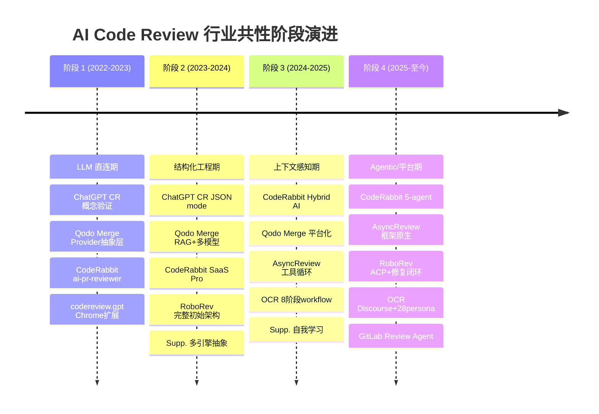

<!-- 目录 -->
- [概述](#概述)
- [关键术语](#关键术语)
- [行业共性阶段框架](#行业共性阶段框架)
- [多项目能力矩阵](#多项目能力矩阵)
- [分化路径分析](#分化路径分析)
- [能力边界分析](#能力边界分析)
- [关键取舍分析](#关键取舍分析)
- [场景评估](#场景评估)
- [趋势判断](#趋势判断)
- [证据缺口](#证据缺口)
- [参考资料](#参考资料)

## 概述

本研究基于 7 个 primitive 的最新结果，对 AI Code Review 领域进行横向综合分析。7 个 primitive 覆盖了从底层 API 能力层（ChatGPT CodeReview）、开源框架（Qodo Merge、Open Code Review）、商业 SaaS（CodeRabbit）、commit 级工具（RoboRev）、Agentic 系统（AsyncReview）到长尾生态（Supplementary Frameworks）的完整技术谱系。

**比较目的**：回答行业整体演进的共性规律、不同项目的分化逻辑、能力边界的通用性与专用性，以及关键工程取舍的权衡点。服务于对 AI Code Review 领域的结构性理解，而非具体选型决策。

**目标读者**：技术架构师、工程效能负责人、AI 工具选型研究者。

---

## 关键术语

| 术语 | 定义 | 来源 |
|------|------|------|
| Prompt Engineering | 通过设计 prompt 指令引导 LLM 输出 | ChatGPT CodeReview primitive |
| Context Engineering | 从多来源组装正确信息、以正确结构在正确时机提供给模型 | CodeRabbit primitive |
| Agentic Code Review | LLM 通过工具调用主动探索代码库、执行代码、验证假设的多轮审查过程 | AsyncReview primitive |
| Hybrid AI Pipeline | 确定性 pipeline 为主干、在关键环节嵌入 agentic loop 的架构 | CodeRabbit primitive |
| Discourse | 多 reviewer 之间的程序化交叉验证（AGREE/CHALLENGE/CONNECT/SURFACE） | Open Code Review primitive |
| RLM（Recursive Language Models） | DSPy 框架中的递归语言模型执行模式，支持多轮有状态推理循环 | AsyncReview primitive |
| ACP（Agent Client Protocol） | RoboRev 内部的 JSON-RPC 协议，统一 agent 后端接入 | RoboRev primitive |
| Self-Learning Feedback Loop | 系统通过历史 review 反馈自动提取规则、更新 prompt | Supplementary Frameworks primitive |
| PR Compression Strategy | 处理超大 PR 的 token-aware diff 拟合、文件优先级排序、分块审查策略 | Qodo Merge primitive |
| Context Curation | 主动筛选和过滤 context，而非被动堆砌 | CodeRabbit primitive |
| Review Granularity | 审查触发粒度：commit 级 / PR 级 / MR 级 | RoboRev + Qodo Merge primitives |
| Fix/Refine Loop | 发现问题后自动调用 fix agent 生成补丁并循环重审 | RoboRev primitive |

---

## 行业共性阶段框架

### 评分标准定义

本节横向对比矩阵采用统一评分标准：
- ★★★★★：深度原生支持，该能力是产品的核心架构组件
- ★★★★☆：良好支持，能力已产品化且持续维护
- ★★★☆☆：基本支持，能力存在但有明显局限或依赖外部配置
- ★★☆☆☆：有限支持，能力处于早期或社区/实验阶段
- ☆☆☆☆☆：不支持或无公开信息

### 共性阶段路线图

将 7 个 primitive 的各自阶段划分映射到统一的行业共性框架，AI Code Review 整体经历了**四个共性阶段**：

```
行业共性阶段路线图
═══════════════════════════════════════════════════════════════════════════

阶段 1                 阶段 2                    阶段 3                    阶段 4
LLM 直连期        →    结构化工程期            →    上下文感知期          →    Agentic/平台期
(2022-2023)             (2023-2024)               (2024-2025)               (2025-至今)

核心问题：              核心问题：                核心问题：                核心问题：
"LLM能看代码吗？"       "输出能被程序处理吗？"      "LLM缺什么上下文？"       "review能自主完成吗？"

代表项目：              代表项目：                代表项目：                代表项目：
· ChatGPT CR v1        · ChatGPT CR Action       · CodeRabbit Pro          · CodeRabbit 5-agent
· Qodo Merge v0.7      · Qodo Merge RAG          · Qodo Merge RAG          · AsyncReview RLM循环
· codereview.gpt       · CR JSON mode            · CodeRabbit Learnings    · RoboRev ACP+闭环
· ai-pr-reviewer       · RoboRev 初始架构         · OCR 8阶段               · OCR Discourse
                      · RoboRev CLI架构          · AsyncReview 工具循环    · GitLab Review Agent
                      · ai-review多引擎          · Supp. 多引擎抽象        · Supp. Self-Learning
═══════════════════════════════════════════════════════════════════════════
```



### 四阶段的本质特征

| 维度 | 阶段 1：LLM 直连期 | 阶段 2：结构化工程期 | 阶段 3：上下文感知期 | 阶段 4：Agentic/平台期 |
|------|-------------------|---------------------|---------------------|----------------------|
| **核心驱动力** | LLM 代码理解能力初步可用 | 输出可被程序可靠解析 | 上下文质量决定 review 上限 | 多步自主推理 + 持续学习 |
| **输入范式** | diff → prompt → LLM | diff + 结构化参数 → LLM → JSON | diff + RAG/索引/learnings → LLM | 全仓库感知 + 工具调用 → 多轮推理 |
| **输出范式** | 自由文本，人阅读 | 结构化 JSON，程序发布行级评论 | 上下文增强的结构化评论 | 多 agent 协作、自动修复、持续学习 |
| **架构模式** | 单次 pipeline | 结构化 pipeline | Hybrid AI（pipeline + context） | Multi-agent / 自主循环 |
| **与 LLM 的关系** | 直接调用 | 通过 API 参数控制 | 通过上下文工程优化输入 | 将 LLM 作为推理引擎嵌入 agent |
| **信任假设** | 相信 LLM 能给出有用意见 | 相信结构化输出可被可靠解析 | 相信好的上下文能产出好评论 | 相信 agent 能自主完成完整流程 |

### 各项目在各阶段的落位

| 项目 | 阶段 1 表现 | 阶段 2 表现 | 阶段 3 表现 | 阶段 4 表现 |
|------|------------|------------|------------|------------|
| **ChatGPT CodeReview** | Probot App 概念验证 | Action 模式 + JSON mode | 成熟维护，未主动升级 | 未进入（停留在阶段 2） |
| **Qodo Merge** | Git Provider 抽象层 | RAG + 多模型后端 | 平台化 + 开源/商业分化 | 持续多模型扩展，架构未跃迁 |
| **CodeRabbit** | ai-pr-reviewer 单 pipeline | SaaS Pro 平台化 | Hybrid AI + Context Engineering | 5 specialized agents 并行 |
| **AsyncReview** | 一次性分析引擎 | RLM 工具循环（自定义） | RLM 工具循环（框架原生） | 多模输入 + 多平台（open PR 有 Gitea） |
| **RoboRev** | 尚未存在 | 完整初始架构 + 功能完善 | 协议标准化 + 闭环构建 | 基础设施安全 + 生产就绪 |
| **Open Code Review** | 尚未存在 | 尚未存在 | CLI-only 核心引擎 | Dashboard + Team 平台 |
| **Supplementary** | GPT Wrapper 期 | 多引擎抽象期 | — | Agentic 自主期（GitLab Review Agent） |

**关键观察**：
- 不是所有项目都完整经历了四个阶段。ChatGPT CodeReview 在阶段 2 进入成熟维护后未继续演进。Open Code Review 跳过了阶段 1/2，从阶段 3 起步即实现完整 8 阶段 workflow。RoboRev 从阶段 2 起步，在 3 个月内走完了阶段 2→4 的架构跃迁。
- 阶段的命名在不同项目中有差异，但映射到同一行业共性阶段后，核心特征高度一致。

---

## 多项目能力矩阵

### 评分维度定义

| 维度 | 定义 | 评分标准 |
|------|------|----------|
| **上下文获取深度** | review 时能获取多少代码上下文 | ★ diff 级 / ★★ 单文件 / ★★★ 跨文件 / ★★★★ 仓库级索引 / ★★★★★ Agent 主动探索 |
| **结构化输出能力** | review 结果是否可被程序可靠处理 | ★ 自由文本 / ★★ JSON mode / ★★★ json_object / ★★★★ json_schema / ★★★★★ 固定响应类型 + 交叉验证 |
| **多模型支持** | 是否支持多个 LLM 后端 | ★ 单模型 / ★★ 可配置但单一 / ★★★ 多 provider 适配 / ★★★★ 多 provider + 路由 / ★★★★★ 模型选择自动化 |
| **平台覆盖** | 支持哪些 Git 平台 | ★ 单平台 / ★★ 2 平台 / ★★★ 3 平台 / ★★★★ 4-5 平台 / ★★★★★ 6+ 平台 |
| **自动化程度** | 从触发到输出的自动化水平 | ★ 手动触发 / ★★ 手动 + 自动评论 / ★★★ CI 自动触发 / ★★★★ 自动触发 + 自动修复 / ★★★★★ 完全自主闭环 |
| **反馈学习能力** | 是否从历史 review 中学习 | ★ 无 / ★★ 手动配置规则 / ★★★ 基于反馈更新 prompt / ★★★★ 自动提取规则 / ★★★★★ 持续自主学习 |
| **协作审查** | 是否支持多视角/多 Agent 审查 | ★ 单 LLM 单次调用 / ★★ 单次 + 多 prompt / ★★★ 多 reviewer 独立 / ★★★★ 多 reviewer + 辩论 / ★★★★★ 5+ 专业化 agent |
| **部署灵活性** | 部署方式的多样性 | ★ SaaS only / ★★ SaaS + CLI / ★★★ SaaS + 自托管 + CLI / ★★★★ 5 种以上部署方式 / ★★★★★ 全场景覆盖 |

### 能力对比矩阵

| 维度 | AsyncReview | ChatGPT CR | CodeRabbit | Open Code Review | Qodo Merge | RoboRev | Supplementary |
|------|------------|------------|------------|-----------------|-----------|---------|---------------|
| **上下文获取深度** | ★★★★★ (Agent 主动探索) | ★★☆ (diff 级) | ★★★★☆ (仓库级索引 + context curation) | ★★★★★ (full agency 自主探索) | ★★★★☆ (RAG + 动态上下文扩展) | ★★★☆☆ (commit 级 diff) | ★★★☆☆ (diff 级到 Agent 探索，跨度大) |
| **结构化输出能力** | ★★★☆☆ (框架原生 tools[]) | ★★★☆☆ (JSON mode) | ★★★★☆ (Hybrid pipeline + 5-agent) | ★★★★★ (4 种固定响应 + discourse) | ★★★☆☆ (工具化输出) | ★★★★☆ (ACP 协议化) | ★★★☆☆ (长尾跨度大) |
| **多模型支持** | ★★☆ (仅 Gemini) | ★★★☆☆ (OpenAI/Azure/GitHub Models) | ★★★★☆ (多模型路由，推断) | ★★★☆☆ (依赖 AI assistant 提供) | ★★★★★ (OpenAI/Claude/Gemini/Bedrock) | ★★★★☆ (多 provider 适配) | ★★★★☆ (同 provider 内 key 均衡) |
| **平台覆盖** | ★★☆ (GitHub + 本地，open PR 有 Gitea) | ★★★☆☆ (GitHub Action + App) | ★★★★☆ (GitHub/GitLab/Bitbucket) | ★★★☆☆ (依赖 AI assistant + gh CLI) | ★★★★★ (6 大平台) | ★★☆ (commit 级，本地 + CI) | ★★★☆☆ (GitLab 深度到其他平台通用) |
| **自动化程度** | ★★★☆☆ (RLM 循环但手动触发) | ★★☆ (手动 + CI 触发) | ★★★★☆ (webhook 自动触发 + CI) | ★★★☆☆ (AI assistant 内触发) | ★★★★☆ (webhook + Action + CLI) | ★★★★★ (post-commit 自动 + 修复闭环) | ★★★☆☆ (label/commit/PR event) |
| **反馈学习能力** | ★☆☆ (无) | ★☆☆ (无) | ★★★★★ (Living Memory + learnings) | ★★☆ (round 迭代但无自动学习) | ★★☆ (配置更新但无自主学习) | ★★★☆☆ (fix/refine 闭环) | ★★★★☆ (Self-Learning Consolidator) |
| **协作审查** | ★★☆ (单 RLM 循环) | ★☆☆ (单次 LLM 调用) | ★★★★★ (5 专业化 agent 并行) | ★★★★★ (28 persona + discourse) | ★★☆ (工具链并行) | ★★★☆☆ (多 agent 后端) | ★★★☆☆ (多 Agent 到单 Agent) |
| **部署灵活性** | ★★★☆☆ (npx CLI + AI assistant) | ★★★☆☆ (Action + App + CLI，ChatGPT CR CLI 成熟度存在不确定性) | ★★★☆☆ (SaaS + 开源版 Action，修正后的部署灵活性评分) | ★★★★★ (14 种 AI assistant + CLI + Dashboard) | ★★★★★ (5 种部署方式) | ★★★☆☆ (CLI + daemon + TUI + CI) | ★★★☆☆ (Chrome 扩展到自托管服务端) |

### 模式分类图

为理解 7 个项目的架构分层差异，下图将它们归入四种架构模式：

```
AI Code Review 架构模式分类
═══════════════════════════════════════════════════════════════════════

模式 A：LLM 能力供给层
  定位：提供底层推理能力，不定义 review 工作流
  项目：ChatGPT CodeReview (primitive 定位)
  特征：API 参数演进驱动上层框架变化

模式 B：Workflow-embedded Hybrid AI
  定位：确定性 pipeline 为主干，嵌入 agentic 能力
  项目：CodeRabbit、Qodo Merge
  特征：pipeline 保证速度下限，agentic loop 提供灵活性
  子分化：
    B1 SaaS 主导（CodeRabbit Pro）
    B2 开源核心（Qodo Merge pr-agent + Pro）

模式 C：Multi-Agent Orchestration
  定位：LLM 之上的编排层，结构化多角色协作
  项目：Open Code Review、AsyncReview
  特征：不内置 LLM，依赖外部 AI assistant 提供推理
  子分化：
    C1 Discourse 辩论型（Open Code Review）
    C2 RLM 递归循环型（AsyncReview）

模式 D：Commit-level Continuous Review
  定位：commit 级自动触发 + 修复闭环
  项目：RoboRev
  特征：面向 AI agent 产出物的质量守门人，非人类 PR

模式 E：长尾生态位
  定位：特定场景的深度集成或早期探索
  项目：Supplementary Frameworks
  特征：Star 规模小但代表不同架构趋势
  子分化：
    E1 平台深度集成（GitLab Review Agent）
    E2 轻量零部署（codereview.gpt，已淘汰）
    E3 特定触发模式（git-lrc commit 级、Gito 置信度过滤）
═══════════════════════════════════════════════════════════════════════
```

---

## 分化路径分析

### 分化维度 1：产品形态

AI Code Review 项目在"产品形态"维度上分化为三条路线：

| 路线 | 代表项目 | 核心特征 | 为什么选择此路线 |
|------|----------|----------|-----------------|
| **SaaS 闭源主导** | CodeRabbit Pro | 核心引擎闭源，通过 webhook/App 提供服务，统一 LLM 调用 | 需要 learnings、code indexing 等状态持久化能力，SaaS 是自然选择 |
| **开源核心 + 商业增值** | Qodo Merge | 开源版保留核心工具链，商业版增加企业功能 | 通过开源获得社区贡献和信任，通过企业功能变现，同时避免完全闭源的用户流失 |
| **纯开源框架** | Open Code Review、AsyncReview、RoboRev、Supplementary 大部分 | 代码完全开放，不自建 SaaS | 项目定位是"能力层"而非"产品层"，依赖用户自建基础设施或使用 AI assistant |

**分化逻辑**：产品形态的选择取决于"review 是否需要持久状态"。CodeRabbit 和 Qodo Merge 的 learnings 系统、code indexing、团队配置都需要持久化存储，这天然倾向于 SaaS。而 AsyncReview、OCR 等项目定位为编排层或能力层，本身不持有持久状态，纯开源即可满足。

### 分化维度 2：审查粒度

| 粒度 | 代表项目 | 触发时机 | 适用场景 |
|------|----------|----------|----------|
| **Commit 级** | RoboRev、git-lrc（Supp.） | post-commit hook 或 CI pipeline | AI agent 产出物审查，在 PR 之前最早拦截 |
| **PR/MR 级** | CodeRabbit、Qodo Merge、ChatGPT CR、AsyncReview | webhook 或 Action 监听 PR 事件 | 人类开发者协作，关注变更集的整体语义 |
| **会话级（AI assistant 内）** | Open Code Review、codereview.gpt（Supp.） | 用户在 AI assistant 中手动触发 | 开发过程中即时审查，不依赖 git 事件 |

**分化逻辑**：审查粒度的选择取决于"review 的服务对象"。面向人类开发者 → PR 级；面向 AI agent 产出 → commit 级；面向即时开发辅助 → 会话级。这三种粒度不是互斥的——RoboRev 在 commit 级的同时也支持 CI 和 webhook 触发。

### 分化维度 3：LLM 依赖策略

| 策略 | 代表项目 | 特征 | 优势 | 风险 |
|------|----------|------|------|------|
| **多模型路由** | Qodo Merge、Supplementary (ai-review) | 支持 OpenAI/Claude/Gemini/Bedrock 等多 provider | 避免供应商锁定，适应合规需求 | 增加模型适配层复杂度 |
| **单模型深度优化** | AsyncReview (Gemini) | 深度优化单一 LLM 与框架的集成 | 集成简单，调优聚焦 | 供应商风险集中 |
| **依赖宿主 AI assistant** | Open Code Review | 不内置 LLM，依赖用户 AI assistant 提供 | 零 LLM 依赖管理，覆盖 14 种工具 | 无法控制 LLM 质量和成本 |
| **SaaS 统一管理** | CodeRabbit Pro | 用户不持有 API key，CodeRabbit 统一调用 | 用户体验统一，可控成本和配额 | 用户代码经过 CodeRabbit 服务器 |

### 关键分化点关系图

```
分化路径关系图
═══════════════════════════════════════════════════════════════════════

                        [AI Code Review 领域]
                                │
                ┌───────────────┼───────────────┐
                ▼               ▼               ▼
          需要持久状态？     面向什么对象？    需要什么粒度？
                │               │               │
        ┌───────┼───────┐      │        ┌───────┼───────┐
        ▼               ▼      ▼        ▼               ▼
      是              否      人类     AI agent       即时开发
        │               │      │        │               │
        ▼               ▼      ▼        ▼               ▼
   SaaS/开源核心     纯开源   PR级    Commit级       会话级
        │               │      │        │               │
        ▼               ▼      ▼        ▼               ▼
   CodeRabbit      OCR       CodeRabbit  RoboRev       OCR
   Qodo Merge      AsyncRev  Qodo Merge  git-lrc       codereview.gpt
                   RoboRev   OCR
                   Supp.

关键分化点标注：
  [DP-1] 是否需要持久状态 → SaaS vs 开源
  [DP-2] 面向人类还是 AI agent → PR 级 vs Commit 级
  [DP-3] 自建 SaaS 还是依赖 AI assistant → 产品 vs 框架
  [DP-4] 单次调用还是多轮循环 → Pipeline vs Agentic
═══════════════════════════════════════════════════════════════════════
```

---

## 能力边界分析

### 通用模式 vs 特定产品形态

以下能力分析哪些是所有 AI Code Review 项目共享的"通用模式"，哪些只在特定产品形态中成立。

| 能力 | 通用/专用 | 覆盖项目 | 依赖条件 | 来源 |
|------|-----------|----------|----------|------|
| **Diff 级别代码理解** | 通用 | 全部 7 个 | LLM 代码理解能力 | 行业共性 |
| **结构化输出** | 通用 | ChatGPT CR、CodeRabbit、OCR、RoboRev | response_format 或固定响应类型定义 | ChatGPT CodeReview + OCR primitives |
| **多模型适配** | 通用 | Qodo Merge、Supplementary、ChatGPT CR | API provider 抽象层 | Qodo Merge primitive |
| **增量审查** | 通用 | Qodo Merge、ChatGPT CR、CodeRabbit、RoboRev | commit tracking 或增量 diff 机制 | Qodo Merge + ChatGPT CR primitives |
| **PR 级别上下文扩展** | 特定于 PR 级产品 | CodeRabbit、Qodo Merge、AsyncReview | 需要 webhook 或 Action 触发 | CodeRabbit + Qodo Merge primitives |
| **Agent 主动探索仓库** | 特定于 Agentic 架构 | AsyncReview、Open Code Review、GitLab Review Agent (Supp.) | 需要文件访问工具 + 沙箱或本地权限 | AsyncReview + OCR primitives |
| **Learnings / 持续学习** | 特定于 SaaS / 有状态产品 | CodeRabbit、GitLab Review Agent (Supp.) | 需要持久化存储 + 反馈数据收集 | CodeRabbit + Supplementary primitives |
| **Fix/Refine 闭环** | 特定于 commit 级 / Agentic 产品 | RoboRev | 需要 fix agent + 重审循环 + 终止条件 | RoboRev primitive |
| **Discourse 交叉验证** | 特定于多 Agent 编排框架 | Open Code Review | 需要 >= 2 个独立 reviewer + 固定响应类型 | OCR primitive |
| **5+ 专业化 Agent 并行** | 特定于 SaaS 大规模平台 | CodeRabbit | 需要统一调度 + 独立 context 构建 | CodeRabbit primitive |
| **6 平台 Git Provider 覆盖** | 特定于 Qodo Merge | Qodo Merge | GitProvider 抽象层架构 | Qodo Merge primitive |

### 通用能力的分层架构

所有项目共享的"最小能力栈"可以归纳为三层：

```
AI Code Review 通用能力栈
═══════════════════════════════════════════════════════════════════════

层 3：交互与输出层（全部项目）
  · 某种形式的人类可读 review 输出
  · 某种形式的 PR comment / CLI 输出 / popup 展示
  · 结构化或非结构化的 review 结果

层 2：LLM 编排层（全部项目）
  · diff 获取与解析
  · prompt 构造（至少包含 diff + 审查指令）
  · LLM API 调用
  · 响应处理与格式解析

层 1：触发层（全部项目）
  · 某种事件触发机制：webhook / Action / CLI / commit hook / 手动
═══════════════════════════════════════════════════════════════════════

在此通用栈之上，不同项目的增值能力：

CodeRabbit 增值：Context Engineering + 5-agent + learnings + CI/CD 分析
Qodo Merge 增值：6 平台 + RAG + PR Compression + 多模型路由
Open Code Review 增值：8 阶段 workflow + discourse + 28 persona
AsyncReview 增值：RLM 递归循环 + 沙箱执行 + 全仓库探索
RoboRev 增值：ACP 协议 + fix/refine 闭环 + TUI + systemd
Supplementary 增值：各工具在不同生态位的深度适配
═══════════════════════════════════════════════════════════════════════
```

---

## 关键取舍分析

### 取舍 1：工作流集成 vs 独立平台

| 方案 | 代表项目 | 选择 | 放弃 | 为什么 | 代价 |
|------|----------|------|------|--------|------|
| **嵌入现有工作流** | ChatGPT CR、Qodo Merge（Action 模式）、RoboRev（CI 模式） | GitHub Action / webhook / post-commit hook | 自建运行环境 | 零部署门槛，用户无需离开现有工具链 | 受制于平台 API 限制和功能约束 |
| **独立 SaaS 平台** | CodeRabbit Pro | 自建后端统一处理 | 依赖用户基础设施 | 完整控制 review 管线，可引入 learnings/code indexing | 用户代码经过第三方服务器，信任成本高 |
| **AI assistant 内执行** | Open Code Review、AsyncReview | 作为 Skill/Plugin 运行在 AI assistant 中 | 独立运行入口 | 利用用户已有的 AI assistant 环境，零额外部署 | 无法控制 LLM 质量和成本，依赖宿主工具 |

**权衡本质**：集成深度与控制力的反比关系。越嵌入现有工作流，部署越简单但能力越受限；越独立的平台，能力越全面但用户迁移成本越高。

### 取舍 2：上下文获取策略

| 策略 | 代表项目 | 核心思路 | 优势 | 局限 |
|------|----------|----------|------|------|
| **Diff-only** | ChatGPT CR、Supp. 阶段 1 | 只分析 git diff 内容 | Token 成本低、速度快 | 无法理解变更的上下文影响 |
| **RAG 增强** | Qodo Merge (LanceDB) | 检索仓库历史讨论和相似代码 | 提供历史上下文 | RAG 维护复杂度增加，当前状态不确定 |
| **Code Indexing** | CodeRabbit Pro | 对代码库进行索引（技术未公开） | 跨文件、跨仓库上下文 | 闭源实现，具体技术不明 |
| **Agent 主动探索** | AsyncReview、Open Code Review | Agent 通过工具调用自主探索代码库 | 最灵活，可发现 diff 之外的上下文 | Token 消耗高、延迟大、需要沙箱隔离 |
| **Context Curation** | CodeRabbit（Hybrid） | Pipeline curated context + agentic 探索关键环节 | 平衡灵活性和可预测性 | 架构复杂，需要精心调优 pipeline 和 agentic loop 的边界 |

**权衡本质**：上下文越丰富，review 质量越高，但成本和延迟也越高。CodeRabbit 的 Context Curation 理念（"better is better, not more is better"）试图突破这一权衡，但仍需要精心调优。

### 取舍 3：Review 粒度

| 粒度 | 代表项目 | 适用场景 | 优势 | 局限 |
|------|----------|----------|------|------|
| **Commit 级** | RoboRev、git-lrc | AI agent 产出物审查、pre-merge 检查 | 最早拦截问题，自动化程度最高 | 单次 commit 变更小，可能遗漏跨 commit 的模式问题 |
| **PR/MR 级** | CodeRabbit、Qodo Merge、ChatGPT CR、AsyncReview | 人类开发者协作 | 能看到变更集的整体语义和架构影响 | 触发时机晚，问题修复成本高 |
| **会话级** | Open Code Review、codereview.gpt | 开发中即时审查 | 即时反馈，不等待 PR | 脱离 git 事件，无法形成持久化 review 记录 |

### 取舍 4：自动化程度

| 级别 | 代表项目 | 特征 | 适用场景 | 风险 |
|------|----------|------|----------|------|
| **手动触发** | codereview.gpt、Open Code Review（部分场景） | 用户主动发起审查 | 探索性使用、小规模团队 | 容易被遗忘，覆盖率不可控 |
| **CI 自动触发** | ChatGPT CR、Qodo Merge（Action 模式） | PR 事件自动触发 review | 标准 CI/CD 管线集成 | 对每个 PR 都触发可能造成噪音 |
| **自动 + 降噪** | CodeRabbit（smart triage）、Supp.（Gito 置信度过滤） | 自动触发但通过 LLM 判断是否需要深度 review | 大规模项目、高频 PR | triage 本身可能出错，漏判重要变更 |
| **完全自主闭环** | RoboRev（fix + refine + auto-close） | 从触发到修复到关闭全自动 | AI agent 产出物的质量保障 | 自动修复可能引入新问题，需要终止条件 |

### 取舍 5：协作方式

| 模式 | 代表项目 | 协作机制 | 优势 | 代价 |
|------|----------|----------|------|------|
| **单次 LLM 调用** | ChatGPT CR、codereview.gpt | 一个 LLM 调用生成 review | 简单、快速、成本低 | 单一视角，容易遗漏特定领域问题 |
| **多工具链并行** | Qodo Merge（/review + /describe + /improve） | 多个工具独立运行 | 覆盖不同 review 方面 | 工具之间不交互，发现无法交叉验证 |
| **多 Agent 独立审查** | AsyncReview、Open Code Review | 多个 reviewer 从不同视角独立审查 | 减少盲区，覆盖全面 | Token 成本线性增长，需要去重机制 |
| **Discourse 交叉验证** | Open Code Review | reviewer 之间 AGREE/CHALLENGE/CONNECT/SURFACE | 减少 false positive，提升高置信度发现 | 增加额外 LLM 调用轮次，延迟显著增加 |
| **5 专业化 Agent 并行** | CodeRabbit | Review/Verification/Chat/Pre-Merge/Living Memory | 每个 agent 专注正交职责 | 需要统一调度和 context 分发，架构复杂 |
| **Self-Learning** | GitLab Review Agent (Supp.) | 从历史 accepted/rejected 信号自动更新规则 | 随使用次数提升质量 | 需要足够的历史反馈数据才能生效 |

---

## 场景评估

### 区块链 / 智能合约场景

**关注点**：Solidity/Rust 智能合约安全审查、典型漏洞模式检测（重入、闪电贷、预言机操纵）、Web3 CI 集成。

| 项目 | 适配度 | 评估依据 | 不确定性 |
|------|--------|----------|----------|
| **CodeRabbit** | ★★★★☆ | 基线 artifact 确认 Solidity 专门支持。LLM 语义理解可识别重入、delegatecall 模式 | 具体 Solidity query 规则和测试覆盖率未公开 |
| **Qodo Merge** | ★★★☆☆ | 多模型 + RAG 架构理论上可处理 Solidity 代码。通过 path_instructions 可为 `.sol` 配置专门指令 | 官方未单独说明 Solidity 专项支持 |
| **Open Code Review** | ★★☆☆☆ | 28 个 reviewer persona 中无 Solidity/blockchain 专属 persona。Generalists 可提供基础审查 | 社区是否有第三方扩展不确定 |
| **AsyncReview** | ★★☆☆☆ | RLM 工具循环可探索 Solidity 代码库，但无语言专属优化 | 仅支持 Gemini，Gemini 对 Solidity 的理解能力不确定 |
| **RoboRev** | ★★☆☆☆ | commit 级审查对 Solidity 同样适用，但无语言专属规则 | agent 后端对 Solidity 的理解取决于选用的 LLM |
| **Supplementary** | ★☆☆☆☆ | 所有纳入工具均未声明对智能合约的专门支持 | 长尾中可能有未发现的项目 |

**重要边界**：LLM 工具可识别代码层面的安全模式，但**无法替代形式化验证工具**（Certora、Manticore）对合约进行数学级别的属性证明。闪电贷攻击和预言机操纵涉及经济博弈层，纯代码分析无法覆盖。

**区块链场景综合建议**：
- 主力 PR review：CodeRabbit（Solidity 语义理解最好）
- 安全基线：Slither（专业 Solidity 静态分析）+ CodeQL（如有 Solidity query）
- 形式化验证：Certora / Manticore（关键合约必须）

### 后端场景

**关注点**：API 安全（SQL 注入、XSS、认证缺陷）、性能反模式（N+1 查询、资源泄漏）、架构一致性。

| 项目 | 适配度 | 评估依据 | 不确定性 |
|------|--------|----------|----------|
| **CodeRabbit** | ★★★★☆ | Hybrid AI 架构在 PR 语义理解上表现好，集成 40+ 静态分析工具补充确定性检查。Context Engineering 可注入项目特定规范 | — |
| **Qodo Merge** | ★★★★☆ | 6 平台覆盖 + PR Compression 适合大型后端项目。多模型支持可根据任务选择成本最优模型 | — |
| **Open Code Review** | ★★★☆☆ | 多 persona 覆盖架构、安全、质量等多视角，但无后端框架（Spring/Django 等）专属 persona | — |
| **AsyncReview** | ★★★☆☆ | RLM 递归循环可深入探索后端代码库的调用链，但仅 Gemini 后端限制了灵活性 | — |
| **RoboRev** | ★★★☆☆ | commit 级持续审查适合 AI 生成后端代码的质量监控，fix/refine 闭环有价值 | — |

**后端场景综合建议**：CodeRabbit 或 Qodo Merge 作为 PR review 层，配合 SAST 工具（SonarQube / CodeQL）保证安全底线。两者互补而非替代。

### Java 场景

**关注点**：JVM 生态深度（Spring、Hibernate）、企业级部署合规、性能与内存分析。

| 项目 | 适配度 | 评估依据 | 不确定性 |
|------|--------|----------|----------|
| **Qodo Merge** | ★★★☆☆ | 多模型支持可覆盖 Java，但无 Java 专属数据流分析。TOML 配置体系适合企业级定制 | — |
| **CodeRabbit** | ★★★☆☆ | LLM 可审查 Java 代码，Context Engineering 可注入项目规范，但无 Java CFG/数据流分析 | — |
| **Open Code Review** | ★★★☆☆ | Principal reviewer 可做架构审查，但无 JVM 生态专属 persona | — |
| **AsyncReview** | ★★☆☆☆ | RLM 可探索 Java 代码库，但 Gemini 对 Java 的理解不如 GPT-4/Claude 成熟 | — |
| **RoboRev** | ★★☆☆☆ | commit 级审查对 Java 同样适用，但无 Java 专属规则 | — |
| **Supplementary** | ★★☆☆☆ | 无 Java 专项工具 | — |

**重要说明**：在 Java 场景中，LLM-native review 工具的能力上限远低于专用 SAST（SonarQube 的 SonarJava 插件、CodeGuru 的 Java ML 模型）。LLM 工具适合做 PR 语义理解和架构建议，但 CFG + 数据流分析能力仍是 SAST 的强项。

---

## 趋势判断

### 已发生的演进（高置信度）

1. **从 Prompt Engineering 到 Context Engineering 的范式迁移**：早期项目（ChatGPT CR 阶段 1）依赖 prompt 设计来引导 LLM 输出。成熟项目（CodeRabbit 阶段 3/4、Qodo Merge 阶段 2）已将核心竞争点从"如何问"转向"给模型看什么"。这是行业共识。

2. **从单次调用到多轮/多 Agent 的架构升级**：所有从阶段 1 起步的项目（ChatGPT CR、Qodo Merge、CodeRabbit）都经历了从单次 LLM 调用向多轮循环或多 Agent 协作的演进。后发项目（RoboRev、OCR）直接进入更高阶段。演进方向一致，但并非所有项目都到达了阶段 4。

3. **从"diff 级"向"仓库级"上下文获取**：Diff-only 模式已证明不足以支撑高质量 review。RAG、code indexing、agent 主动探索三条路线并行发展，各自在不同产品形态中落地。

4. **审查粒度的分化**：行业没有收敛到单一粒度，而是分化为 commit 级（RoboRev）、PR 级（CodeRabbit/Qodo Merge）、会话级（OCR）三条路线，分别服务于不同的审查对象。

### 推测的趋势（标注不确定性）

5. **平台原生 AI 功能可能吸收长尾生态位** [uncertainty]：GitHub Copilot Code Review 和 GitLab Duo 等平台内建的 AI 能力可能替代部分补充框架（Supplementary）的生态位。这一推测基于平台整合的历史趋势，但缺乏直接证据。

6. **Self-Learning 可能成为标配能力** [uncertainty]：CodeRabbit 的 Living Memory 和 GitLab Review Agent 的 Self-Learning Consolidator 代表了同一趋势——review 系统从历史反馈中学习。这一能力目前仅在少数项目中实现，可能在未来 1-2 年内成为成熟产品的标配。

7. **Fix/Refine 闭环可能从 commit 级扩展到 PR 级** [uncertainty]：RoboRev 的 fix → refine → auto_close 闭环在 commit 级已被验证。这一模式是否可以扩展到 PR 级别（涉及多文件、多人协作的更复杂场景）尚待观察。

### 行业分化的未来方向

8. **SaaS vs 开源的边界将持续调整**：Qodo Merge 的开源/商业分化（"not the Qodo free tier"）和 CodeRabbit 的 v1 开源维护 + Pro 闭源路线，代表了两种不同的开源商业策略。哪条策略更可持续，取决于社区贡献活跃度和企业付费意愿。

9. **编排层框架可能独立于 LLM provider 发展**：Open Code Review 的 Agent Skills 分发模式（兼容 14 种 AI assistant）和 AsyncReview 的 DSPy RLM 框架依赖，代表了两条路径：前者彻底解耦 LLM，后者深度绑定框架。前者的优势是抗 LLM 供应商风险，后者可能获得更深的框架集成能力。

---

## 证据缺口

| 缺口 | 严重程度 | 说明 | 影响 |
|------|----------|------|------|
| LLM review 准确率/召回率量化数据 | 高 | 所有 7 个 primitive 均未提供公开的准确率基准测试 | 无法量化比较各项目的 review 质量 |
| CodeRabbit Pro 版内部架构细节 | 高 | 核心 review engine、learnings 存储机制、5-agent 通信拓扑均未开源 | 对 CodeRabbit 的能力评估基于官方文档推断 |
| AsyncReview 静止期原因 | 中 | 项目自 2026-03 以来无新推送，open PR 状态不确定 | 阶段 4 能力是否落地无法确认 |
| Qodo Merge LanceDB RAG 当前状态 | 中 | v0.12 引入后 release notes 中未见重大更新 | RAG 能力可能已降级或被替代 |
| 区块链项目真实使用数据 | 中 | 各项目的 Solidity 支持缺乏公开的 Web3 项目采用率数据 | 区块链场景评估基于能力推断而非使用验证 |
| Supplementary 智能合约专项项目搜索 | 中 | 当前 session 无 MCP 工具，无法执行 GitHub Search 验证长尾中是否有 Solidity AI review 项目 | 可能存在未被纳入的中型项目 |

---

## 参考资料

| 来源 | 类型 | 路径 |
|------|------|------|
| AsyncReview draft | primitive draft | `openspec/changes/cr-primitive-asyncreview-evolution-refresh/draft.md` |
| ChatGPT CodeReview draft | primitive draft | `openspec/changes/cr-primitive-chatgpt-codereview-framework-refresh/draft.md` |
| CodeRabbit draft | primitive draft | `openspec/changes/cr-primitive-coderabbit-framework-refresh/draft.md` |
| Open Code Review draft | primitive draft | `openspec/changes/cr-primitive-open-code-review-framework-refresh/draft.md` |
| Qodo Merge draft | primitive draft | `openspec/changes/cr-primitive-qodo-merge-evolution-refresh/draft.md` |
| RoboRev draft | primitive draft | `openspec/changes/cr-primitive-roborev-evolution-refresh/draft.md` |
| Supplementary draft | primitive draft | `openspec/changes/cr-primitive-supplementary-frameworks-refresh/draft.md` |
| Baseline artifact (v1) | 基线参考（旧版） | `knowledge/analysis/synthesis/ai-coding-review-comparison/artifact.md`（2026-04-18，source: synthesis-ai-coding-review-comparison-pass-1） |
