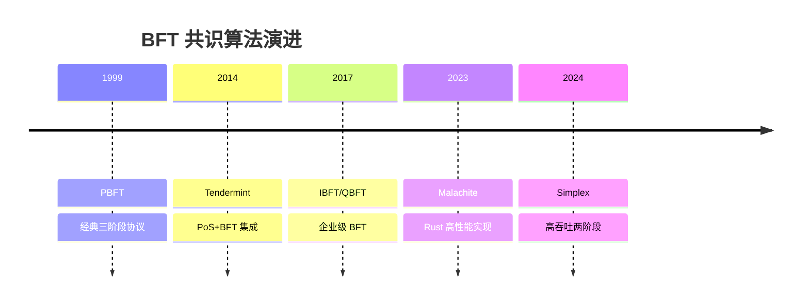
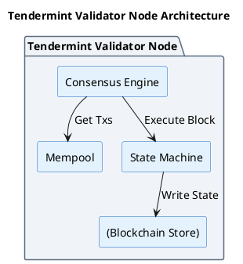
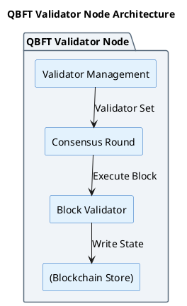
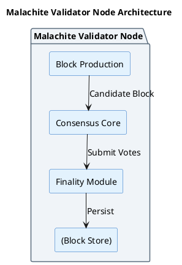
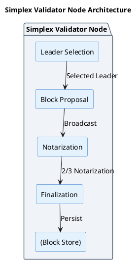

# BFT 共识算法对比分析

## 概述

本分析对比四种现代 BFT 共识算法实现：**Tendermint**（Cosmos）、**QBFT**（Quorum/Besu）、**Malachite**（Circle/Arc Network）、**Simplex**（Commonware）。重点分析它们与经典 PBFT 的差异、设计取舍和适用场景。

**研究范围**：BFT 共识算法演进与对比
**研究深度**：synthesis
**对象类型**：synthesis

## 关键术语

| 术语 | 定义 | 在本题中的作用 |
|------|------|---------------|
| PBFT | Practical Byzantine Fault Tolerance，经典 BFT 协议 | 对比基准 |
| BFT | Byzantine Fault Tolerance，拜占庭容错 | 共识类型 |
| View Change | 视图转换，Leader 故障切换机制 | 对比维度 |
| Finality | 最终性，区块不可逆转 | 共识保证 |

## 分析正文

### 演进时间线

### 问题层分布

| 算法 | 年份 | 问题层 | 状态 | 核心创新 | 适用场景 |
|------|------|--------|------|----------|----------|
| PBFT | 1999 | Consensus | Reference | 三阶段 BFT 基础 | 理论基础 |
| Tendermint | 2014 | Consensus | Live | PoS+BFT 原生集成、两阶段投票 | 公链 |
| QBFT | 2017 | Consensus | Live | 动态验证者集、企业权限管理 | 联盟链 |
| Malachite | 2023 | Consensus | Early | Rust 实现、模块化架构 | 公链/联盟链 |
| Simplex | 2024 | Consensus | Early | 高吞吐、简化 View Change | 公链 |

### 核心机制对比

#### 投票阶段数对比

| 算法 | 阶段数 | 阶段名称 | 相比 PBFT 的变化 |
|------|--------|----------|-----------------|
| PBFT | 3 | Pre-prepare → Prepare → Commit | 基准 |
| Tendermint | 2 | Prevote → Precommit | 省略 Pre-prepare |
| QBFT | 3 | Proposal → Prepare → Commit | 同 PBFT，重命名 |
| Malachite | 2 (推测) | Vote → Finalize | 简化为两轮 |
| Simplex | 2 | Notarize → Finalize | 省略 Pre-prepare |

#### 为什么有些算法可以省略 Pre-prepare？

| 算法 | 能否省略 | 原因 | 代价 |
|------|----------|------|------|
| Tendermint | 能 | 1. 部分同步假设（可依赖超时） 2. Round 概念（每轮独立） 3. PoS 经济安全（slashing） | 完全异步网络无法进展 |
| QBFT | 不能 | 1. 企业场景需要更强安全性 2. 动态验证者集需要严格协议 3. 保留完整 PBFT 安全性 | 多一轮通信，延迟略高 |
| Malachite | 能 | 1. 部分同步假设 2. Rust 内存安全保证 3. 模块化设计优化 | 待确认 |
| Simplex | 能 | 1. Leader Rotation 预先可知 2. 部分同步假设 3. 简化 View Change | 完全异步网络无法进展 |

#### Leader 选举机制对比

| 算法 | 选举方式 | 是否固定 | 选择算法 |
|------|----------|----------|----------|
| PBFT | Primary 指定 | 相对固定 | 预定义主节点 |
| Tendermint | Proposer 轮转 | 每轮变化 | `(height + round) % totalPower` |
| QBFT | Proposer 轮转 | 每轮变化 | `(height + round) % validatorCount` |
| Malachite | 待确认 | 每轮变化 | 基于 round-robin（推测） |
| Simplex | Leader Rotation | 每轮变化 | `hash(height, round) % count` |

#### View Change 机制对比

| 算法 | View Change 方式 | 复杂度 | 触发条件 |
|------|------------------|--------|----------|
| PBFT | 显式 View Change 协议 | 高 | Leader 故障/超时 |
| Tendermint | Round 超时自动递增 | 低 | 超时 |
| QBFT | 简化 View Change（RoundChange） | 中 | 超时/故障 |
| Malachite | 待确认 | 待确认 | 超时 |
| Simplex | Leader Rotation 自然切换 | 低 | 超时 |

#### 消息复杂度对比

| 算法 | 消息复杂度 | 优化机制 |
|------|------------|----------|
| PBFT | O(n²) | 基准 |
| Tendermint | O(n²) | 验证者集相对固定 |
| QBFT | O(n²) | 联盟链节点数有限 |
| Malachite | 待确认 | 可能有流水线优化 |
| Simplex | 待确认 | 高吞吐设计 |

### 架构组件对比

#### Tendermint 节点内部架构

#### QBFT 节点内部架构

#### Malachite 节点内部架构

#### Simplex 节点内部架构

### 设计取舍对比

| 维度 | Tendermint | QBFT | Malachite | Simplex |
|------|------------|------|-----------|---------|
| **实现语言** | Go | Java/Go | Rust | 待确认 |
| **网络假设** | 部分同步 | 部分同步 | 部分同步 | 部分同步 |
| **验证者集** | PoS 质押 | 动态授权 | 待确认 | 待确认 |
| **最终性** | 即时 | 即时 | 即时 | 即时 |
| **适用场景** | 公链 | 联盟链 | 公链/联盟链 | 公链 |
| **成熟度** | Live（成熟） | Live（成熟） | Early | Early |

### 能力边界对比

| 能力 | Tendermint | QBFT | Malachite | Simplex |
|------|------------|------|-----------|---------|
| 拜占庭容错 | ✓ (≤1/3) | ✓ (≤1/3) | ✓ (待确认) | ✓ (待确认) |
| 即时最终性 | ✓ | ✓ | ✓ | ✓ |
| 动态验证者集 | ✓ (PoS) | ✓ (授权) | 待确认 | 待确认 |
| 企业权限管理 | ✗ | ✓ | ✗ | ✗ |
| 模块化嵌入 | ✗ | ✗ | ✓ | ✗ |
| 高吞吐优化 | ✗ | ✗ | ✓ | ✓ |

### 与相邻协议的关系

| 对象 | 与 Tendermint 关系 | 与 QBFT 关系 | 与 Malachite 关系 | 与 Simplex 关系 |
|------|-------------------|-------------|------------------|----------------|
| PBFT | 简化版本（两阶段） | 直接继承（三阶段） | 参考优化 | 简化优化 |
| HotStuff | 同为两阶段优化 | 不同场景 | 可能参考 | 可能参考 |
| IBFT 2.0 | 不同场景 | 前身 | 无直接关系 | 无直接关系 |

## 结论

**已确认**：

1. **阶段数差异的根本原因**：
   - Tendermint、Simplex、Malachite 采用两阶段，省略 Pre-prepare
   - QBFT 保留三阶段，遵循完整 PBFT
   - 省略的前提是**部分同步网络假设**

2. **View Change 简化趋势**：
   - Tendermint 使用 Round 超时自动递增
   - Simplex 通过 Leader Rotation 自然切换
   - QBFT 保留但简化 View Change 协议

3. **场景分化明显**：
   - Tendermint → 公链（PoS 原生集成）
   - QBFT → 联盟链（企业权限管理）
   - Malachite → 模块化（可嵌入不同链）
   - Simplex → 高吞吐（性能优先）

**尚需验证**：

1. Malachite 和 Simplex 的详细协议流程
2. 实际部署状态和性能基准数据
3. Leader 选举的具体算法细节

## 待确认问题

| 问题 | 状态 | 下一步 |
|------|------|--------|
| Malachite 详细流程 | 未解决 | 阅读源码 |
| Simplex 性能基准 | 未解决 | 查找测试报告 |
| Malachite/Simplex 主网状态 | 未解决 | 追踪部署进展 |

## 参考资料

| 来源 | 说明 |
|------|------|
| Tendermint 官方文档 | L1 来源 |
| Cosmos Hub 文档 | L1 来源 |
| ConsenSys Quorum/Besu 文档 | L1 来源 |
| IBFT 2.0 规范 | L1 来源 |
| https://github.com/circlefin/malachite | L2 来源 |
| https://docs.arc.network/arc/concepts/consensus-layer | L1 来源 |
| https://simplex.blog/ | L1 来源 |
