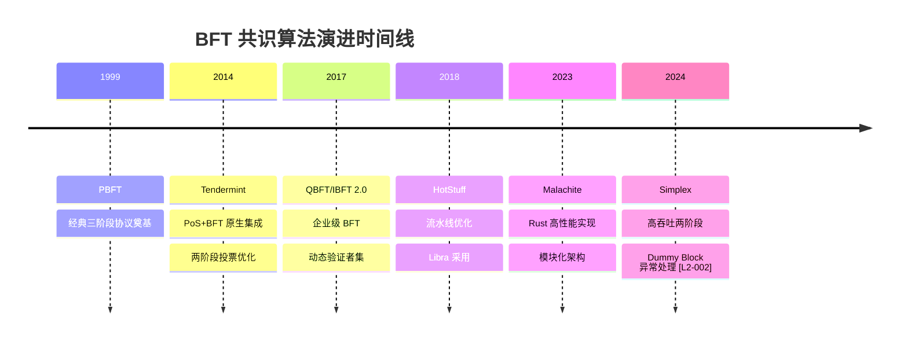

# Malachite 共识演进分析

## 概述

Malachite 是由 Circle/Malachite 团队开发的高性能 BFT 共识协议实现，采用 Rust 语言编写，设计目标是提供模块化、可嵌入不同区块链系统的共识层。作为新兴的 BFT 变体，Malachite 在 Tendermint 两阶段投票和 HotStuff 流水线优化的基础上，进一步简化协议流程，采用模块化架构设计。

本分析聚焦 Malachite 在 BFT 共识演进脉络中的定位，对比 Tendermint、QBFT、HotStuff、Simplex 等协议，揭示现代 BFT 共识的演进趋势。

**研究范围**：Malachite 共识协议在 BFT 演进脉络中的定位
**对象类型**：synthesis（演进分析）

## 关键术语

| 术语 | 定义 | 在本题中的作用 |
|------|------|---------------|
| BFT 演进 | 从 PBFT 到现代变体的发展脉络 | 分析框架 |
| 两阶段投票 | 省略 Pre-prepare 的简化协议 | 核心对比维度 |
| 模块化架构 | Consensus Core + Block Production + Finality Module | Malachite 的设计特征 |
| View Change | Leader 故障切换机制 | 对比维度之一 |

## 分析正文

### BFT 演进时间线

### 问题层分布

| 算法 | 年份 | 问题层 | 状态 | 核心创新 | 实现语言 |
|------|------|--------|------|----------|----------|
| PBFT | 1999 | Consensus (Infrastructure) | Reference | 三阶段 BFT 基础 | C++ |
| Tendermint | 2014 | Consensus (Infrastructure) | Live (成熟) | PoS+BFT 集成、两阶段投票、ABCI 解耦 | Go |
| QBFT | 2017 | Consensus (Infrastructure) | Live (成熟) | 动态验证者集、企业权限管理 | Java/Go |
| HotStuff | 2018 | Consensus (Infrastructure) | Live (成熟) | 流水线优化、线性视图转换 | Move/C++ |
| Malachite | 2023 | Consensus (Infrastructure) | Early | Rust 实现、模块化架构、可嵌入 | Rust |
| Simplex | 2024 | Consensus (Infrastructure) | Early | 高吞吐、Dummy Block 异常处理 [L2-002] | Rust [L2-001] |

### 各对象定位对比

| 对象 | 一句话定位 | 问题层 | 当前状态 | 与基准关系 |
|------|-----------|--------|----------|------------|
| PBFT | 经典三阶段 BFT 协议 | Consensus | Reference | 基准 |
| Tendermint | PoS+BFT 原生的公链共识 | Consensus | Live (成熟) | 简化版 PBFT（两阶段） |
| QBFT | 企业级联盟链 BFT | Consensus | Live (成熟) | 完整 PBFT 继承 |
| HotStuff | 流水线优化的 BFT | Consensus | Live (成熟) | 两阶段 + 流水线 |
| Malachite | 模块化 Rust BFT 实现 | Consensus | Early | 两阶段 + 模块化 |
| Simplex | 无许可公链 BFT | Consensus | Early | 两阶段 + Dummy Block [L2-002] |

### 核心机制对比

#### 投票阶段数对比

| 算法 | 阶段数 | 阶段名称 | 通信轮次 | 延迟优化 |
|------|--------|----------|----------|----------|
| PBFT | 3 | Pre-prepare → Prepare → Commit | 3 轮 | 基准 |
| Tendermint | 2 | Prevote → Precommit | 2 轮 | -33% 延迟 |
| QBFT | 3 | Proposal → Prepare → Commit | 3 轮 | 基准 |
| HotStuff | 2 | Prepare → Commit | 2 轮 | -33% 延迟 |
| Malachite | 2 | Vote → Finalize | 2 轮 | -33% 延迟 |
| Simplex | 2 | Notarize → Finalize | 2 轮 | -33% 延迟 |

**演进规律**：现代 BFT 变体普遍从三阶段简化为两阶段，通过省略 Pre-prepare 来减少通信轮次，降低延迟。

#### 为什么可以省略 Pre-prepare？

| 算法 | 能否省略 | 原因 | 代价 |
|------|----------|------|------|
| Tendermint | 能 | 1. 部分同步假设（可依赖超时） 2. Round 概念（每轮独立） 3. PoS 经济安全（slashing） | 完全异步网络无法进展 |
| QBFT | 不能 | 1. 企业场景需要更强安全性 2. 动态验证者集需要严格协议 3. 保留完整 PBFT 安全性 | 多一轮通信，延迟略高 |
| HotStuff | 能 | 1. Leader 预先可知 2. 部分同步假设 3. 流水线优化 | 完全异步网络无法进展 |
| Malachite | 能 | 1. 部分同步假设 2. Rust 内存安全保证 3. 模块化设计 | 完全异步网络无法进展 |
| Simplex | 能 | 1. Leader Rotation 预先可知 [L2-002] 2. 部分同步假设 3. Dummy Block 跳过 View [L2-002] | 完全异步网络无法进展 |

#### Leader 选举与 View Change 对比

| 算法 | Leader 选举方式 | View Change 方式 | 复杂度 |
|------|----------------|------------------|--------|
| PBFT | Primary 指定（相对固定） | 显式 View Change 协议 | 高 |
| Tendermint | Proposer 轮转 `(height + round) % totalPower` | Round 超时自动递增 | 低 |
| QBFT | Proposer 轮转 `(height + round) % validatorCount` | 简化 View Change（RoundChange） | 中 |
| HotStuff | Leader Rotation 基于 VRF | 流水线视图转换 | 低 |
| Malachite | Round-robin 轮转 | Round 超时自动递增 | 低 |
| Simplex | `ViewNumber % CommitteeSize` [L2-002] | Dummy Block 跳过 View [L2-002] | 低 |

**演进规律**：从固定 Primary → 轮转 Proposer → VRF 随机选择，View Change 从显式协议 → 超时自动递增 → 自然切换。

### Malachite 在演进脉络中的定位

#### Malachite 与 Tendermint 的关系

**关系定位**：演进而非替代

| 维度 | Tendermint | Malachite | 演进方向 |
|------|------------|-----------|----------|
| 实现语言 | Go | Rust | 内存安全、性能 |
| 投票阶段 | 2 轮（Prevote/Precommit） | 2 轮（Vote/Finalize） | 相同 |
| Leader 选举 | Round-robin 轮转 | Round-robin 轮转 | 相同 |
| View Change | Round 超时递增 | Round 超时递增 | 相同 |
| 架构风格 | 单体 Core + ABCI | 模块化（Core/BP/FM） | Malachite 更解耦 |
| 嵌入性 | 通过 ABCI 接口 | 原生模块化设计 | Malachite 更灵活 |
| 成熟度 | Live（成熟） | Early | Tendermint 领先 |

**结论**：Malachite 在协议层面与 Tendermint 高度相似（同为两阶段 BFT），主要差异在于实现语言和架构风格。

#### Malachite 架构演进的驱动力

Malachite 采用 Consensus Core + Block Production + Finality Module 的模块化架构，这种架构反映了以下演进趋势：

1. **关注点分离**：区块生产、共识核心、最终性模块职责清晰，便于独立升级
2. **可嵌入性优先**：模块化设计使 Malachite 可以嵌入不同的区块链系统，而非绑定单一生态
3. **Rust 生态红利**：内存安全保证、无 GC 暂停、确定性延迟，适合系统级共识实现

### 与相邻 BFT 的关系定位

| 对象 | 与 Malachite 关系 | 说明 |
|------|------------------|------|
| Tendermint | 协议层相似，架构层演进 | Malachite 协议与 Tendermint 高度相似，但架构更模块化 |
| QBFT | 不同场景 | QBFT 面向联盟链，Malachite 面向公链/可嵌入场景 |
| HotStuff | 可能参考 | Malachite 可能参考 HotStuff 的流水线思想 |
| Simplex | 同期 Rust BFT | 同为新兴 Rust BFT，Simplex 采用 Dummy Block 机制简化异常处理 [L2-002] |

### 能力边界对比

| 能力 | Tendermint | QBFT | Malachite | Simplex |
|------|------------|------|-----------|---------|
| 拜占庭容错 | ✓ (≤1/3) | ✓ (≤1/3) | ✓ (≤1/3) | ✓ (≤1/3) [L2-002] |
| 即时最终性 | ✓ | ✓ | ✓ | ✓ (两阶段 QC) [L2-002] |
| 动态验证者集 | ✓ (PoS) | ✓ (授权) | 待确认 | ✗ (固定委员会) [L2-002] |
| 企业权限管理 | ✗ | ✓ | ✗ | ✗ |
| 模块化嵌入 | ✗ | ✗ | ✓ | ✗ |
| 高吞吐优化 | ✗ | ✗ | ✓ | ✓ (BLS 聚合) [L2-001] |
| 成熟度 | Live | Live | Early | Early [L2-001] |

## 设计取舍

### Malachite 为什么选择 Rust？

**选择**：Rust 而非 Go（如 Tendermint）或 Move（如 HotStuff 后期）

**优势**：内存安全、无 GC 暂停、确定性延迟、性能优异

**代价**：学习曲线陡峭、生态相对较小、开发效率可能较低

**设计原因**：
1. **系统级安全需求**：共识层代码错误可能导致双签等严重安全问题，Rust 的内存安全保证降低此类风险
2. **性能需求**：无 GC 暂停意味着确定性延迟，对共识协议的超时机制更友好
3. **并发模型**：Rust 的所有权模型天然适合高并发场景

### Malachite 为什么选择模块化架构？

**选择**：Consensus Core + Block Production + Finality Module 分离，而非 Tendermint 式的单体 Core

**优势**：可嵌入性、可维护性、独立升级能力

**代价**：集成复杂度较高、接口定义成本

**设计原因**：
1. **可嵌入性优先**：模块化设计使 Malachite 可以嵌入不同的区块链系统，而非绑定单一生态（如 Tendermint 绑定 Cosmos）
2. **关注点分离**：区块生产、共识核心、最终性模块职责清晰，便于独立升级和优化
3. **测试友好**：模块边界清晰，便于单元测试和形式化验证

### 为什么现代 BFT 普遍简化为两阶段？

**选择**：Tendermint、Malachite、Simplex 均采用两阶段投票，省略 PBFT 的 Pre-prepare

**优势**：减少通信轮次（3 轮 → 2 轮），降低延迟约 33%

**代价**：需要更强的同步假设（部分同步网络）

**设计原因**：
1. **网络假设现实**：真实世界中网络通常是部分同步的，有延迟上限
2. **超时机制替代**：Round 超时自动递增可以替代 Pre-prepare 的绑定功能
3. **PoS 经济安全**：slashing 机制增加作恶成本，降低对 Pre-prepare 的依赖

## 边界与前提

### 协议原生能力 vs 外部依赖

| 能力 | 归属 | 说明 |
|------|------|------|
| 共识达成 | 协议原生 | BFT 核心功能 |
| 即时确定性 | 协议原生 | 2/3 Commit 后立即最终化 |
| Leader 轮换 | 协议原生 | Round-robin 或类似机制 |
| 交易池管理 | 外部依赖 | Block Production 模块对接 |
| P2P 网络 | 外部依赖 | 共识层假设可靠广播 |
| 状态执行 | 外部依赖 | 应用层处理 |
| 验证者集管理 | 外部依赖 | PoS 或其他机制 |

### 不能解决什么

- **应用逻辑**：业务规则由应用层实现
- **跨链通信**：需要 IBC 等额外协议
- **隐私保护**：交易默认公开
- **数据可用性**：需额外模块保证

### 性能边界

| 指标 | Tendermint (参考) | Malachite (预期) | 说明 |
|------|-------------------|------------------|------|
| TPS | 1k - 10k | 待确认 | 取决于交易执行 + 网络传播 |
| 延迟 | 1-5 秒 | 待确认 | 取决于超时参数配置 |
| 节点规模 | < 200 | 待确认 | P2P 通信开销限制 |

## 相关对象关系

### 与相邻协议的关系

| 对象 | 关系类型 | 说明 |
|------|----------|------|
| PBFT | 上游/理论基础 | 所有现代 BFT 均源自 PBFT |
| Tendermint | 相似方案/演进 | Malachite 协议与 Tendermint 高度相似 |
| HotStuff | 参考方案 | Malachite 可能参考流水线优化思想 |
| Simplex | 同期 Rust BFT | 同为新兴 Rust BFT，Simplex 采用 Dummy Block 机制简化异常处理 [L2-002] |
| QBFT | 不同场景 | QBFT 面向联盟链，Malachite 面向公链/可嵌入 |

### Malachite 的下游依赖

| 对象 | 关系类型 | 说明 |
|------|----------|------|
| Arc Network | 采用方 | Arc Network 使用 Malachite 作为共识层 |
| 其他嵌入链 | 潜在采用方 | Malachite 设计目标是可嵌入不同链 |

## 结论

### BFT 演进的三大趋势

1. **阶段简化**：三阶段（PBFT/QBFT） → 两阶段（Tendermint/Malachite/Simplex）
2. **View Change 简化**：显式协议 → Round 超时递增 → Dummy Block 跳过 View [L2-002]
3. **架构模块化**：单体 Core → 模块化（Consensus Core/BP/FM）

### Malachite 的定位

- **协议层面**：与 Tendermint 高度相似（同为两轮投票、Round-robin Leader 选举）
- **架构层面**：更模块化（Consensus Core + Block Production + Finality Module）
- **实现层面**：采用 Rust（内存安全、无 GC、确定性延迟）
- **目标场景**：可嵌入不同区块链系统，而非绑定单一生态

### 两阶段投票的前提

所有采用两阶段的 BFT 都依赖**部分同步网络假设**：
- 省略 Pre-prepare 的前提是超时机制可以替代其绑定功能
- 完全异步网络中，两阶段 BFT 的活性可能受阻
- 安全性始终保证：即使网络异步，也不会出现双签

## 待确认问题

| 问题 | 状态 | 下一步 |
|------|------|--------|
| Malachite 详细协议流程 | 待确认 | 阅读 Malachite 源码或官方文档 |
| Malachite 实际部署状态 | 待确认 | 追踪 Arc Network 主网进展 |
| Malachite 性能基准数据 | 待确认 | 查找公开测试结果 |
| Malachite 与 Arc Network 的集成方式 | 待确认 | 查阅 Arc Network 技术文档 |

## 参考资料

| 来源 | 说明 |
|------|------|
| [Malachite GitHub](https://github.com/circlefin/malachite) | Malachite Rust 实现 |
| [Arc Network 文档](https://docs.arc.network/arc/concepts/consensus-layer) | Arc Network 共识层概念说明 |
| [Tendermint Consensus 论文](https://arxiv.org/abs/1807.04938) | Tendermint 共识协议论文 |
| [Cosmos SDK](https://github.com/cosmos/cosmos-sdk) | Tendermint 使用案例 |
| [Quorum/Besu](https://github.com/consensys/quorum) | QBFT 实现 |
| [Libra](https://github.com/facebookarchive/libra) | HotStuff 原始实现 |
| [hadv/ockham](https://github.com/hadv/ockham) | Simplex Rust 实现 [L2-001] |
| [consensus_flow.md](https://raw.githubusercontent.com/hadv/ockham/main/docs/consensus_flow.md) | Simplex 协议文档 [L2-002] |
